Step 2 - eQTM
================
Lisa Leung
2018-03-03

Loading Libraries
=================

For Step 2, we will load three library packages: tidyverse, reshape, ggplot2. We will load the data sets built from Step 1: probes\_subjects that contains DNA methylation probe values, subjects\_genes that contains gene expression values, and probes\_genes\_distance that is a sparse matrix containing the distances between a gene and a probe. Note that probes\_genes\_distance is 0 when probe and gene distance is over 1Mb.

``` r
library(tidyverse)
```

    ## ── Attaching packages ────────────────────────────────── tidyverse 1.2.1 ──

    ## ✔ ggplot2 2.2.1     ✔ purrr   0.2.4
    ## ✔ tibble  1.4.2     ✔ dplyr   0.7.4
    ## ✔ tidyr   0.8.0     ✔ stringr 1.3.0
    ## ✔ readr   1.1.1     ✔ forcats 0.3.0

    ## ── Conflicts ───────────────────────────────────── tidyverse_conflicts() ──
    ## ✖ dplyr::filter() masks stats::filter()
    ## ✖ dplyr::lag()    masks stats::lag()

``` r
library(reshape)
```

    ## 
    ## Attaching package: 'reshape'

    ## The following object is masked from 'package:dplyr':
    ## 
    ##     rename

    ## The following objects are masked from 'package:tidyr':
    ## 
    ##     expand, smiths

``` r
library(ggplot2)
m <- load("~/STAT540/Repo_team_gene_heroes/rosmap_postprocV2.rdata")
probes_subjects[1:5,1:5] #look at what are these data sets
```

    ##              10101327   10101589   10202345   10203224   10205244
    ## cg15886596 0.06223898 0.06643503 0.06067198 0.05669612 0.06437694
    ## cg12261117 0.22883983 0.28437790 0.26597568 0.29549651 0.30087612
    ## cg25433760 0.41568249 0.39730559 0.49797690 0.48789274 0.41684200
    ## cg23278040 0.29617882 0.26983136 0.27622813 0.28423828 0.30989476
    ## cg14324693 0.95746992 0.90520790 0.93080533 0.95443363 0.93380807

``` r
subjects_genes[1:5,1:5]
```

    ##          RAB4B:ENSG00000167578.11 ZNF708:ENSG00000182141.4
    ## 10101327               -0.1420430                -0.210962
    ## 10101589                0.1069440                -0.304536
    ## 10202345               -0.2479760                -0.119064
    ## 10203224                0.1582540                -0.191419
    ## 10205244                0.0548584                 0.116589
    ##          RAD23A:ENSG00000179262.4 ARFGAP1:ENSG00000101199.8
    ## 10101327                0.0622548                 0.2212560
    ## 10101589               -0.1841080                 0.3467160
    ## 10202345                0.1261420                -0.0074513
    ## 10203224                0.3774820                 0.1709550
    ## 10205244               -0.0405737                 0.1832600
    ##          CTSA:ENSG00000064601.11
    ## 10101327               0.0180461
    ## 10101589              -0.3811340
    ## 10202345               0.3538090
    ## 10203224              -0.0412956
    ## 10205244               0.2605110

``` r
rownames(subjects_genes)==names(probes_subjects)
```

    ##   [1] TRUE TRUE TRUE TRUE TRUE TRUE TRUE TRUE TRUE TRUE TRUE TRUE TRUE TRUE
    ##  [15] TRUE TRUE TRUE TRUE TRUE TRUE TRUE TRUE TRUE TRUE TRUE TRUE TRUE TRUE
    ##  [29] TRUE TRUE TRUE TRUE TRUE TRUE TRUE TRUE TRUE TRUE TRUE TRUE TRUE TRUE
    ##  [43] TRUE TRUE TRUE TRUE TRUE TRUE TRUE TRUE TRUE TRUE TRUE TRUE TRUE TRUE
    ##  [57] TRUE TRUE TRUE TRUE TRUE TRUE TRUE TRUE TRUE TRUE TRUE TRUE TRUE TRUE
    ##  [71] TRUE TRUE TRUE TRUE TRUE TRUE TRUE TRUE TRUE TRUE TRUE TRUE TRUE TRUE
    ##  [85] TRUE TRUE TRUE TRUE TRUE TRUE TRUE TRUE TRUE TRUE TRUE TRUE TRUE TRUE
    ##  [99] TRUE TRUE TRUE TRUE TRUE TRUE TRUE TRUE TRUE TRUE TRUE TRUE TRUE TRUE
    ## [113] TRUE TRUE TRUE TRUE TRUE TRUE TRUE TRUE TRUE TRUE TRUE TRUE TRUE TRUE
    ## [127] TRUE TRUE TRUE TRUE TRUE TRUE TRUE TRUE TRUE TRUE TRUE TRUE TRUE TRUE
    ## [141] TRUE TRUE TRUE TRUE TRUE TRUE TRUE TRUE TRUE TRUE TRUE TRUE TRUE TRUE
    ## [155] TRUE TRUE TRUE TRUE TRUE TRUE TRUE TRUE TRUE TRUE TRUE TRUE TRUE TRUE
    ## [169] TRUE TRUE TRUE TRUE TRUE TRUE TRUE TRUE TRUE TRUE TRUE TRUE TRUE TRUE
    ## [183] TRUE TRUE TRUE TRUE TRUE TRUE TRUE TRUE TRUE TRUE TRUE TRUE TRUE TRUE
    ## [197] TRUE TRUE TRUE TRUE TRUE TRUE TRUE TRUE TRUE TRUE TRUE TRUE TRUE TRUE
    ## [211] TRUE TRUE TRUE TRUE TRUE TRUE TRUE TRUE TRUE TRUE TRUE TRUE TRUE TRUE
    ## [225] TRUE TRUE TRUE TRUE TRUE TRUE TRUE TRUE TRUE TRUE TRUE TRUE TRUE TRUE
    ## [239] TRUE TRUE TRUE TRUE TRUE TRUE TRUE TRUE TRUE TRUE TRUE TRUE TRUE TRUE
    ## [253] TRUE TRUE TRUE TRUE TRUE TRUE TRUE TRUE TRUE TRUE TRUE TRUE TRUE TRUE
    ## [267] TRUE TRUE TRUE TRUE TRUE TRUE TRUE TRUE TRUE TRUE TRUE TRUE TRUE TRUE
    ## [281] TRUE TRUE TRUE TRUE TRUE TRUE TRUE TRUE TRUE TRUE TRUE TRUE TRUE TRUE
    ## [295] TRUE TRUE TRUE TRUE TRUE TRUE TRUE TRUE TRUE TRUE TRUE TRUE TRUE TRUE
    ## [309] TRUE TRUE TRUE TRUE TRUE TRUE TRUE TRUE TRUE TRUE TRUE TRUE TRUE TRUE
    ## [323] TRUE TRUE TRUE TRUE TRUE TRUE TRUE TRUE TRUE TRUE TRUE TRUE TRUE TRUE
    ## [337] TRUE TRUE TRUE TRUE TRUE TRUE TRUE TRUE TRUE TRUE TRUE TRUE TRUE TRUE
    ## [351] TRUE TRUE TRUE TRUE TRUE TRUE TRUE TRUE TRUE TRUE TRUE TRUE TRUE TRUE
    ## [365] TRUE TRUE TRUE TRUE TRUE TRUE TRUE TRUE TRUE TRUE TRUE TRUE TRUE TRUE
    ## [379] TRUE TRUE TRUE TRUE TRUE TRUE TRUE TRUE TRUE TRUE TRUE TRUE TRUE TRUE
    ## [393] TRUE TRUE TRUE TRUE TRUE TRUE TRUE TRUE TRUE TRUE TRUE TRUE TRUE TRUE
    ## [407] TRUE TRUE TRUE TRUE TRUE TRUE TRUE TRUE TRUE TRUE TRUE TRUE TRUE TRUE
    ## [421] TRUE TRUE TRUE TRUE TRUE TRUE TRUE TRUE TRUE TRUE TRUE TRUE TRUE TRUE
    ## [435] TRUE TRUE TRUE TRUE TRUE TRUE TRUE TRUE TRUE TRUE TRUE TRUE TRUE TRUE
    ## [449] TRUE TRUE TRUE TRUE TRUE TRUE TRUE TRUE TRUE TRUE TRUE TRUE TRUE TRUE
    ## [463] TRUE TRUE TRUE TRUE TRUE TRUE TRUE TRUE TRUE TRUE TRUE TRUE TRUE TRUE
    ## [477] TRUE TRUE TRUE TRUE TRUE

``` r
dat <- as.data.frame(as.matrix(probes_genes_distance))
```

    ## Loading required package: Matrix

    ## 
    ## Attaching package: 'Matrix'

    ## The following object is masked from 'package:reshape':
    ## 
    ##     expand

    ## The following object is masked from 'package:tidyr':
    ## 
    ##     expand

``` r
dim(dat)
```

    ## [1] 42813  1795

``` r
colnames(dat) <- names(subjects_genes)
rownames(dat) <- rownames(probes_subjects) #putting the genes and probes name back to the data frame
```

There are currently 42813 genes and 1795 probes.

Adjust PCs for gene expression data (labelled as m)
===================================================

Here we are going to build gene expression data sets adjusted for various numbers of PCs. Although this data set is assumed not to have any batch effects (they are coming from one batch), we would like to adjust for gene expression data to account for hidden confounders that are not recorded in the study. Because we are unsure of how many PCs to adjust for, we would like to explore what happens to the results of correlation tests between gene and probe pair To run PCA, we will use svd() and adjust for 1, 5, 10, 15, 20, 25, 30 PCAs. The data set is saved as "subjects\_genes\_PCA\_adjusted\_V3.RDS"

``` r
#SVD PCA
pc_svd_genes <- svd(subjects_genes)

#exploring the dimensionality on PCA
length(pc_svd_genes$d)
```

    ## [1] 481

``` r
dim(pc_svd_genes$u) #u is equivalent to the principal components
```

    ## [1] 481 481

``` r
dim(pc_svd_genes$v) 
```

    ## [1] 1795  481

``` r
plot(pc_svd_genes$u[, 1], pc_svd_genes$u[, 2], main = "SVD", xlab = "U1", ylab = "U2") #plot the first two PCs
```

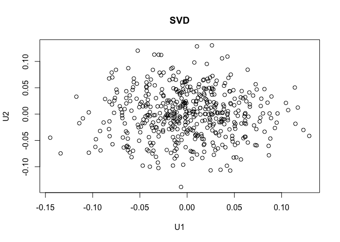

``` r
# reconstructing the same values is shown below:
# SVD$u %*% diag(SVD$d) %*% t(SVD$v)

# Adjusting for the PCs according to number of PCA you want to adjust in gene expression data
m <- list()
n <- c(1,5,10,15,20, 25, 30)
for (i in n){
diag_of_d <- pc_svd_genes$d
diag_of_d[1:i] <- 0
m[[i]] <- pc_svd_genes$u %*% diag(diag_of_d) %*% t(pc_svd_genes$v)
rownames(m[[i]]) <- rownames(subjects_genes)
colnames(m[[i]]) <- colnames(subjects_genes)
}

#saveRDS(m, "subjects_genes_PCA_adjusted_all.RDS")
```

Adjust PCs for DNA methylation probe data (labelled as m2)
==========================================================

Below is adjusting for the DNA methylation probes. The reasons to adjust for DNA methylation probes are the same as why we decide to adjust for gene expression data (described above). Again, we will use svd() to adjust for 1, 5, 10, 15, 20, 25, 30 PCAs. The data set is saved as probes\_subjects\_PCA\_adjusted\_V3.RDS.

``` r
#SVD PCA
pc_svd_probes <- svd(t(probes_subjects))

#exploring the dimensionality on PCA
length(pc_svd_probes$d)
```

    ## [1] 481

``` r
dim(pc_svd_probes$u) #u is equivalent to the principal components
```

    ## [1] 481 481

``` r
dim(pc_svd_probes$v) 
```

    ## [1] 42813   481

``` r
plot(pc_svd_probes$u[, 1], pc_svd_probes$u[, 2], main = "SVD", xlab = "U1", ylab = "U2") #plot the first two PCs
```

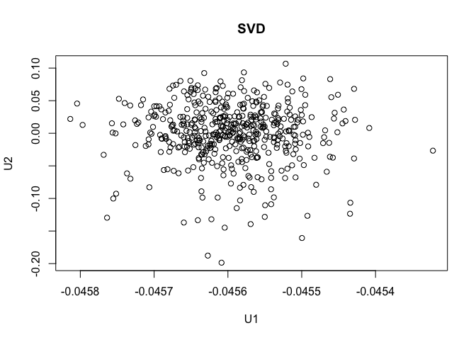

``` r
# reconstructing the same values is shown below:
# SVD$u %*% diag(SVD$d) %*% t(SVD$v)

# Adjusting for the PCs according to number of PCA you want to adjust
m2 <- list()
for (i in n){
diag_of_d <- pc_svd_probes$d
diag_of_d[1:i] <- 0
m2[[i]] <- pc_svd_probes$u %*% diag(diag_of_d) %*% t(pc_svd_probes$v)
rownames(m2[[i]]) <- colnames(probes_subjects)
colnames(m2[[i]]) <- rownames(probes_subjects)
}

#saveRDS(m2, "probes_subjects_PCA_adjusted_all.RDS")
```

Look at the number of significant results on 50 random genes
============================================================

To look at what happens to the correlation test results on 49 different setting combination (7 different numbers of PCA adjusted for either gene expression data and DNA methylation probe data), we would like to see the nuber of significant results on 50 random genes. We believe that 50 can give us a rough estimate on what happens to these genes. This code will result plots with the number of PCs adjusted in either data set, and the proportion of genes that has at least one significant eQTM hit.

``` r
set.seed(100)
n_genes <- sample(1:ncol(subjects_genes),50)

results_pca_50_genes = lapply(n, function(k){
out_per_gdata <-  lapply(n, function(l){
out_per_gene <-  lapply(n_genes, function(i){
    toLoop = which(dat[,i] != 0) 
    out <- lapply(toLoop, function(j){
      data.frame(probe = rownames(probes_subjects)[j], 
                 gene = colnames(subjects_genes)[i],
                estimate = cor.test(m[[k]][,i],
                                    m2[[l]][,j])$estimate,
                pvalue = cor.test(m[[k]][,i],
                                    m2[[l]][,j])$p.value)
      })
    gene_out <- do.call(rbind, out)
    gene_out$fdr <- p.adjust(gene_out$pvalue, method = "fdr")
    gene_out$bonferroni <- p.adjust(gene_out$pvalue, method = "bonferroni")
    data.frame(num_PC_gdata=k, gene = colnames(m[[k]])[i], num_less_fdr=sum(gene_out$fdr <= 0.1), num_less_bonferroni=sum(gene_out$bonferroni <= 0.1))
   # num_less_pvalue=sum(gene_out$pvalue <= 0.1))
}) 
do.call(rbind, out_per_gene) %>% mutate(num_PC_probedata = l)
})
do.call(rbind, out_per_gdata)
})

toPlot_50_genes_PCA_gdata_probedata <- do.call(rbind, results_pca_50_genes)
toPlot_50_genes_PCA_gdata_probedata$eqtl_fdr<-0
toPlot_50_genes_PCA_gdata_probedata$eqtl_fdr[toPlot_50_genes_PCA_gdata_probedata$num_less_fdr>0] <- 1
toPlot_50_genes_PCA_gdata_probedata$eqtl_bonferroni<-0
toPlot_50_genes_PCA_gdata_probedata$eqtl_bonferroni[toPlot_50_genes_PCA_gdata_probedata$num_less_bonferroni>0] <- 1
head(toPlot_50_genes_PCA_gdata_probedata)
```

    ##   num_PC_gdata                    gene num_less_fdr num_less_bonferroni
    ## 1            1  TGM2:ENSG00000198959.6            0                   0
    ## 2            1 TAF4:ENSG00000130699.10            0                   0
    ## 3            1 CSTF1:ENSG00000101138.7            0                   0
    ## 4            1 ZHX3:ENSG00000174306.15            0                   0
    ## 5            1  DTD1:ENSG00000125821.7            0                   0
    ## 6            1  MRI1:ENSG00000037757.9            5                   3
    ##   num_PC_probedata eqtl_fdr eqtl_bonferroni
    ## 1                1        0               0
    ## 2                1        0               0
    ## 3                1        0               0
    ## 4                1        0               0
    ## 5                1        0               0
    ## 6                1        1               1

``` r
#saveRDS(toPlot_50_genes_PCA_gdata_probedata, "toPlot_50_genes_PCA_gdata_probedata_V4.RDS")

toPlot_50_genes_PCA_gdata_probedata_average <- toPlot_50_genes_PCA_gdata_probedata %>% group_by(num_PC_gdata, num_PC_probedata) %>% summarise(average_sig_fdr = mean(eqtl_fdr), average_sig_bonferroni = mean(eqtl_bonferroni))

toPlot_50_genes_PCA_gdata_probedata_average$num_PC_gdata <- as.factor(toPlot_50_genes_PCA_gdata_probedata_average$num_PC_gdata )
toPlot_50_genes_PCA_gdata_probedata_average$num_PC_probedata <- as.factor(toPlot_50_genes_PCA_gdata_probedata_average$num_PC_probedata )

head(toPlot_50_genes_PCA_gdata_probedata_average)
```

    ## # A tibble: 6 x 4
    ## # Groups:   num_PC_gdata [1]
    ##   num_PC_gdata num_PC_probedata average_sig_fdr average_sig_bonferroni
    ##   <fct>        <fct>                      <dbl>                  <dbl>
    ## 1 1            1                          0.400                  0.380
    ## 2 1            5                          0.280                  0.280
    ## 3 1            10                         0.260                  0.260
    ## 4 1            15                         0.280                  0.260
    ## 5 1            20                         0.360                  0.340
    ## 6 1            25                         0.280                  0.280

``` r
#png("/Users/lisa/STAT540/Repo_team_gene_heroes/images/Step 2/prop_of_genes_sig_on_50_genes_V4_fdr.png")
p <- ggplot(aes(x=num_PC_gdata, y = num_PC_probedata), data = toPlot_50_genes_PCA_gdata_probedata_average) + geom_tile(aes(fill=average_sig_fdr), color = "white") + scale_fill_gradient(low= "white", high = "steelblue", name = "Proportion of genes significant") 
p +  ggtitle("Proportion of genes with a significant eQTM for 50 genes") + xlab("Number of PCs Adjusted for Gene Expression Data") + ylab("Number of PCs Adjusted for DNA Methylation Data")
```

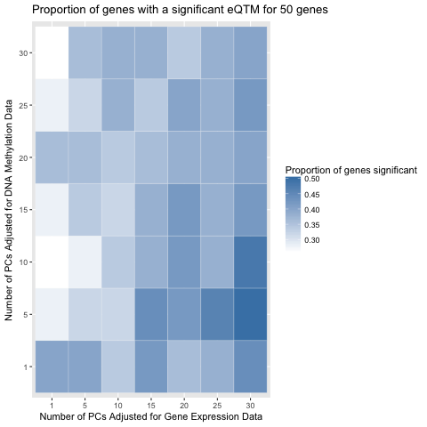

``` r
#dev.off()
```

``` r
#png("/Users/lisa/STAT540/Repo_team_gene_heroes/images/Step 2/prop_of_genes_sig_on_50_genes_V4_bonferroni.png")
p <- ggplot(aes(x=num_PC_gdata, y = num_PC_probedata), data = toPlot_50_genes_PCA_gdata_probedata_average) + geom_tile(aes(fill=average_sig_bonferroni), color = "white") + scale_fill_gradient(low= "white", high = "steelblue", name = "Proportion of genes significant") 
p +  ggtitle("Proportion of genes with a significant eQTM for 50 genes") + xlab("Number of PCs Adjusted for Gene Expression Data") + ylab("Number of PCs Adjusted for DNA Methylation Data")
```

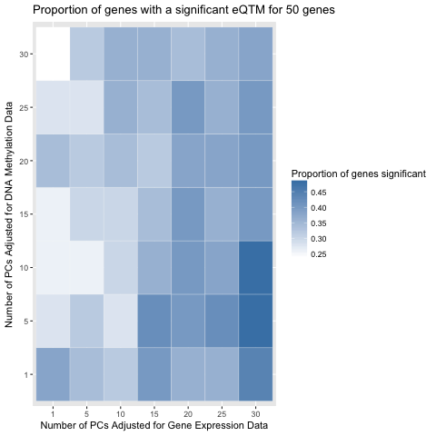

``` r
#dev.off()
```

Looks like adjusting for PCs in DNA methylation probes don't do much when very few PCAs are adjusted in the gene expression data, but changes when many PCs are adjusted in gene expression data. On the other hand, it is apparent that adjusting for PCAs in gene expression data does a lot - number of genes that contains at least one significant eQTM increases when PCAs adjusted increase. Based on the results, we will keep 5 PCs adjusted for DNA methylation and 30 PC adjusted for gene expression data.

Cumulative variation explained by PCs
=====================================

We first calculate the ratio of variance explained by each principal component, and then sum variances to find the cumulative variance explained by each additional PC. We will do this on both gene expression data and DNA methylation data. Number of PCs range from 1 to 30.

Gene Expression Data
--------------------

``` r
cum_var_explained_gdata<-(as.data.frame(cumsum(pc_svd_genes$d^2/sum(pc_svd_genes$d^2))))
cum_var_explained_gdata$pcs<-c(1:nrow(cum_var_explained_gdata))
colnames(cum_var_explained_gdata)<- c("cum_var_explained","PCs")

#png("/Users/lisa/STAT540/Repo_team_gene_heroes/images/Step 2/cum_var_explained_50_V4_gdata.png")
ggplot(aes( x=PCs, y=cum_var_explained), data = cum_var_explained_gdata[1:30,]) + geom_point(size=1) + geom_line() + ggtitle("Cumulative variance explained by PCs on Gene Expression Data Data") + xlab("Number of PCs") + ylab("Variance Explained") + xlim(0,30) + ylim(0,1)
```

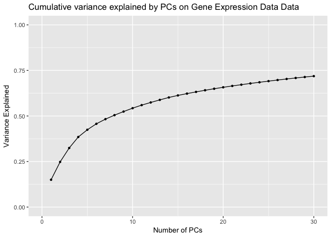

``` r
#dev.off()
```

From the above, we see when 30 PCs are adjusted for gene expression data, a total of 72% variance was accounted for.

DNA Methylation Data
--------------------

``` r
cum_var_explained_probe<-(as.data.frame(cumsum(pc_svd_probes$d^2/sum(pc_svd_probes$d^2))))
cum_var_explained_probe$pcs<-c(1:nrow(cum_var_explained_probe))
colnames(cum_var_explained_probe)<- c("cum_var_explained","PCs")

#png("/Users/lisa/STAT540/Repo_team_gene_heroes/images/Step 2/cum_var_explained_50_V4_probe.png")
ggplot(aes( x=PCs, y=cum_var_explained), data = cum_var_explained_probe[1:30,]) + geom_point(size=1) + geom_line() + ggtitle("Cumulative variance explained by PCs on DNA Methylation Data") + xlab("Number of PCs") + ylab("Variance Explained") + xlim(0,30) + ylim(0,1)
```

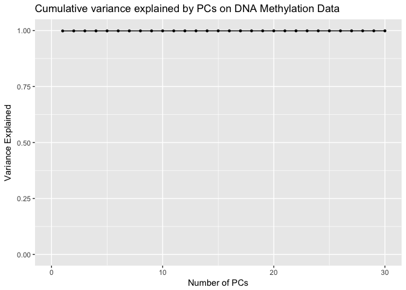

``` r
#dev.off()
```

Correlation tests based on the PC adjusted data sets
====================================================

This set of correlation test results will be passed on to Step 3. It contains all the statistics and significances for each pair of gene and probe.

``` r
## using lapply - recommended
PC_probes <- 5 # of PCs adjusted for probes data set
PC_genes <- 30 # of PCs adjusted for genes data set

results_PCA = lapply(1:ncol(m[[PC_genes]]), function(i){
    toLoop = which(dat[,i] != 0) 
    out <- lapply(toLoop, function(j){
      data.frame(gene = colnames(m[[PC_genes]])[i],
                probe = colnames(m2[[PC_probes]])[j], 
                estimate = cor.test(m[[PC_genes]][,i],m2[[PC_probes]][,j])$estimate,
                pvalue = cor.test(m[[PC_genes]][,i],m2[[PC_probes]][,j])$p.value)
      })
    do.call(rbind,out)
})

lapply_results_PCA <- do.call(rbind,results_PCA)
lapply_results_PCA$adjusted.pvalue <- p.adjust(lapply_results_PCA$pvalue, method="fdr") #adjusting for fdr
#saveRDS(lapply_results_PCA,"cor_test_results_PCA_lapply_V4.rds")

#png("/Users/lisa/STAT540/Repo_team_gene_heroes/images/Step 2/histogram_pvalue_V4.png")
ggplot(aes(pvalue), data = lapply_results_PCA) + geom_histogram(bins=500) + ggtitle("Histogram of p-value on correlation tests")
```

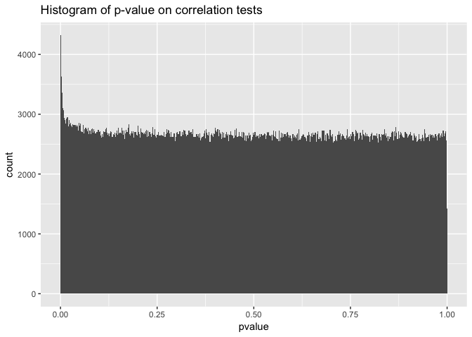

``` r
#dev.off()

summary(lapply_results_PCA$adjusted.pvalue)
```

    ##    Min. 1st Qu.  Median    Mean 3rd Qu.    Max. 
    ##  0.0000  0.9667  0.9861  0.9657  0.9957  1.0000

``` r
min(lapply_results_PCA$adjusted.pvalue)
```

    ## [1] 7.263e-82

``` r
#saveRDS(t(m2[[5]]), "probes_subjects_PCA_adjusted_V4.RDS")
#saveRDS(m[[30]], "subjects_genes_PCA_adjusted_V4.RDS")
```

Look at some random genes individually
======================================

We will plot the pvalues based on the number of adjusted PCs in the DNA methylation data set and gene expression data set and observe what happens.

Create a function called results\_by\_gene that looks at how many significant probes are there per gene based on pvalue, fdr, and bonferroni given that DNA methylation data set is controlled for 5 PCs, and results\_by\_probe given that gene data set is controlled for 30 PCs
----------------------------------------------------------------------------------------------------------------------------------------------------------------------------------------------------------------------------------------------------------------------------------

``` r
results_by_gene <- function(gene){
  lapply(n, function(i){
    toLoop = which(dat[,gene] != 0) 
    out <- lapply(toLoop, function(j){
      data.frame(probe = rownames(probes_subjects)[j], 
                estimate = cor.test(m[[i]][,gene],
                                    m2[[5]][,j])$estimate,
                pvalue = cor.test(m[[i]][,gene], m2[[5]][,j])$p.value)
      })
   gene_out <-  do.call(rbind,out)
   gene_out$fdr <- p.adjust(gene_out$pvalue, method="fdr")
   gene_out$bonferroni <- p.adjust(gene_out$pvalue, method="bonferroni")
   data.frame(num_PC=i, num_less_pvalue=sum(gene_out$pvalue <= 0.1), num_less_fdr = sum(gene_out$fdr <= 0.1), num_less_bonferroni = sum(gene_out$bonferroni <= 0.1))
})
}

results_by_probe <- function(gene){
  lapply(n, function(i){
    toLoop = which(dat[,gene] != 0) 
    out <- lapply(toLoop, function(j){
      data.frame(probe = rownames(probes_subjects)[j], 
                estimate = cor.test(m[[30]][,gene],
                                    m2[[i]][,j])$estimate,
                pvalue = cor.test(m[[30]][,gene], m2[[i]][,j])$p.value)
      })
   gene_out <-  do.call(rbind,out)
   gene_out$fdr <- p.adjust(gene_out$pvalue, method="fdr")
   gene_out$bonferroni <- p.adjust(gene_out$pvalue, method="bonferroni")
   data.frame(num_PC=i, num_less_pvalue=sum(gene_out$pvalue <= 0.1), num_less_fdr = sum(gene_out$fdr <= 0.1), num_less_bonferroni = sum(gene_out$bonferroni <= 0.1))
})
}
```

Based on literature search, we will explore two genes: AKT2 which is a cancer related gene, and APP gene which is related to Alzheimer's disease.

``` r
#finding genes in data set
gene_name <- unique(sub(':.*$',"",colnames(subjects_genes)))
sum(gene_name %in% c("AKT2","APOBEC3B","APP"))
```

    ## [1] 2

``` r
colnames(subjects_genes)[grep("AKT2",colnames(subjects_genes))]
```

    ## [1] "AKT2:ENSG00000105221.10"

``` r
colnames(subjects_genes)[grep("APP",colnames(subjects_genes))]
```

    ## [1] "TRAPPC6A:ENSG00000007255.6"  "TRAPPC2P1:ENSG00000256060.1"
    ## [3] "TRAPPC5:ENSG00000181029.6"   "TRAPPC10:ENSG00000160218.8" 
    ## [5] "APP:ENSG00000142192.14"

Looking at AKT2
---------------

``` r
lapply_results_pca_AKT2_gdata <- do.call(rbind,results_by_gene("AKT2:ENSG00000105221.10"))
toPlot_lapply_results_pca_AKT2_gdata  <- lapply_results_pca_AKT2_gdata  %>% melt(id="num_PC")

#png("/Users/lisa/STAT540/Repo_team_gene_heroes/images/Step 2/gene_AKT2_gdata.png")
ggplot(aes(x=num_PC, y=value, colour=variable), data = toPlot_lapply_results_pca_AKT2_gdata) + geom_point() + geom_line( ) + ggtitle("Number of significant eQTMs on AKT2 when gene data adjusted for 30 PCs") + xlab("Number of PCs") + ylab("Number of significant DNA probes") + scale_colour_discrete(name = "Type of Threshold", breaks=c("num_less_pvalue", "num_less_fdr", "num_less_bonferroni"), labels=c("P-value < 0.1", "FDR < 0.1", "Bonferroni < 0.1"))
```

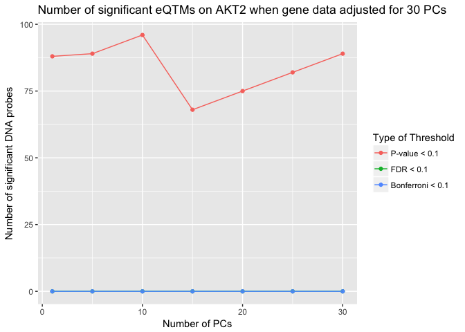

``` r
#dev.off()
```

``` r
lapply_results_pca_AKT2_probe <- do.call(rbind,results_by_probe("AKT2:ENSG00000105221.10"))
toPlot_lapply_results_pca_AKT2_probe  <- lapply_results_pca_AKT2_probe  %>% melt(id="num_PC")

#png("/Users/lisa/STAT540/Repo_team_gene_heroes/images/Step 2/gene_AKT2_probes.png")
ggplot(aes(x=num_PC, y=value, colour=variable), data = toPlot_lapply_results_pca_AKT2_probe) + geom_point() + geom_line( ) + ggtitle("Number of significant eQTMs on AKT2 when probe data adjusted for 5 PCs") + xlab("Number of PCs") + ylab("Number of significant DNA probes") + scale_colour_discrete(name = "Type of Threshold", breaks=c("num_less_pvalue", "num_less_fdr", "num_less_bonferroni"), labels=c("P-value < 0.1", "FDR < 0.1", "Bonferroni < 0.1"))
```

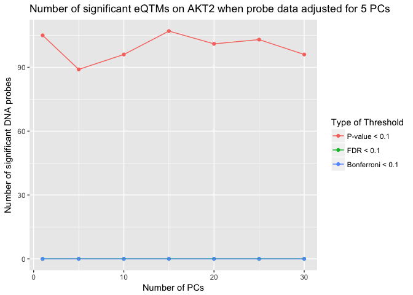

``` r
#dev.off()
```

There seems to be nothing showing in AKT2 gene, let's try another gene that is related to Alzheimer's disease.

Looking at APP
--------------

``` r
lapply_results_pca_APP_gdata <- do.call(rbind,results_by_gene("APP:ENSG00000142192.14"))
toPlot_lapply_results_pca_APP_gdata  <- lapply_results_pca_APP_gdata  %>% melt(id="num_PC")

#png("/Users/lisa/STAT540/Repo_team_gene_heroes/images/Step 2/gene_APP_gdata.png")
ggplot(aes(x=num_PC, y=value, colour=variable), data = toPlot_lapply_results_pca_APP_gdata) + geom_point() + geom_line( ) + ggtitle("Number of significant eQTMs for APP on gene data adjusted for 30 PCs") + xlab("Number of PCs") + ylab("Number of significant DNA probes") + scale_colour_discrete(name = "Type of Threshold", breaks=c("num_less_pvalue", "num_less_fdr", "num_less_bonferroni"), labels=c("P-value < 0.1", "FDR < 0.1", "Bonferroni < 0.1"))
```

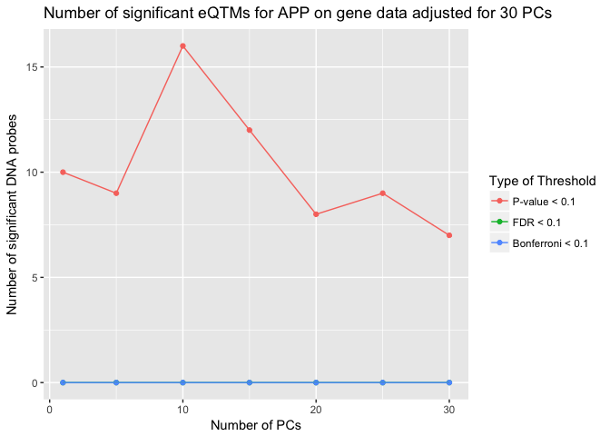

``` r
#dev.off()
```

``` r
lapply_results_pca_APP_probe <- do.call(rbind,results_by_probe("APP:ENSG00000142192.14"))
toPlot_lapply_results_pca_APP_probe  <- lapply_results_pca_APP_probe  %>% melt(id="num_PC")

#png("/Users/lisa/STAT540/Repo_team_gene_heroes/images/Step 2/gene_APP_probes.png")
ggplot(aes(x=num_PC, y=value, colour=variable), data = toPlot_lapply_results_pca_APP_probe) + geom_point() + geom_line( ) + ggtitle("Number of significant eQTMs by number of PCs on APP when probe data adjusted for 5 PCs") + xlab("Number of PCs") + ylab("Number of significant DNA probes") + scale_colour_discrete(name = "Type of Threshold", breaks=c("num_less_pvalue", "num_less_fdr", "num_less_bonferroni"), labels=c("P-value < 0.1", "FDR < 0.1", "Bonferroni < 0.1"))
```

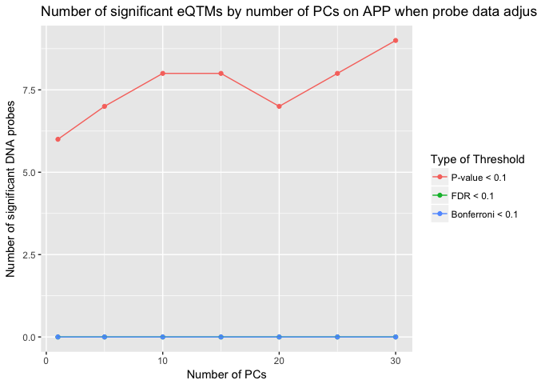

``` r
#dev.off()
```

Nothing much is going on in any of these genes, we will now by look at genes that have multiple significant eQTMs.

``` r
filtered_cor_test_results <- lapply_results_PCA[lapply_results_PCA$adjusted.pvalue<=0.1,]
summary_cor_test_results <- filtered_cor_test_results %>% group_by(gene) %>% count()
summary_cor_test_results[order(-summary_cor_test_results$n),]
```

    ## # A tibble: 679 x 2
    ## # Groups:   gene [679]
    ##    gene                             n
    ##    <fct>                        <int>
    ##  1 CYP2D6:ENSG00000100197.16       22
    ##  2 L3MBTL1:ENSG00000185513.9       20
    ##  3 C21orf56:ENSG00000160284.10     20
    ##  4 FRG1B:ENSG00000149531.9         19
    ##  5 NLRP2:ENSG00000022556.11        19
    ##  6 CSDC2:ENSG00000172346.9         18
    ##  7 MAPK12:ENSG00000188130.9        18
    ##  8 NKAIN4:ENSG00000101198.10       18
    ##  9 ELL:ENSG00000105656.5           17
    ## 10 AC016629.2:ENSG00000213753.4    17
    ## # ... with 669 more rows

Looking at individual genes which contain multiple significant probes
=====================================================================

CYP2D6 - a gene that contains multiple significant probes
---------------------------------------------------------

``` r
lapply_results_pca_CYP2D6_gdata <- do.call(rbind,results_by_gene("CYP2D6:ENSG00000100197.16"))
toPlot_lapply_results_pca_CYP2D6_gdata  <- lapply_results_pca_CYP2D6_gdata  %>% melt(id="num_PC")

#png("/Users/lisa/STAT540/Repo_team_gene_heroes/images/Step 2/gene_CYP2D6_gdata.png")
ggplot(aes(x=num_PC, y=value, colour=variable), data = toPlot_lapply_results_pca_CYP2D6_gdata) + geom_point() + geom_line( ) + ggtitle("Number of significant eQTMs on CYP2D6 when gene data adjusted for 30 PCs") + xlab("Number of PCs") + ylab("Number of significant DNA probes") + scale_colour_discrete(name = "Type of Threshold", breaks=c("num_less_pvalue", "num_less_fdr", "num_less_bonferroni"), labels=c("P-value < 0.1", "FDR < 0.1", "Bonferroni < 0.1"))
```

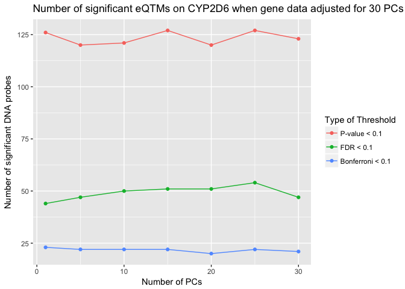

``` r
#dev.off()
```

``` r
lapply_results_pca_CYP2D6_probe <- do.call(rbind,results_by_probe("CYP2D6:ENSG00000100197.16"))
toPlot_lapply_results_pca_CYP2D6_probe  <- lapply_results_pca_CYP2D6_probe  %>% melt(id="num_PC")

#png("/Users/lisa/STAT540/Repo_team_gene_heroes/images/Step 2/gene_CYP2D6_probe.png")
ggplot(aes(x=num_PC, y=value, colour=variable), data = toPlot_lapply_results_pca_CYP2D6_probe) + geom_point() + geom_line( ) + ggtitle("Number of significant eQTMs on CYP2D6 when probe data adjusted for 5 PCs") + xlab("Number of PCs") + ylab("Number of significant DNA probes") + scale_colour_discrete(name = "Type of Threshold", breaks=c("num_less_pvalue", "num_less_fdr", "num_less_bonferroni"), labels=c("P-value < 0.1", "FDR < 0.1", "Bonferroni < 0.1"))
```

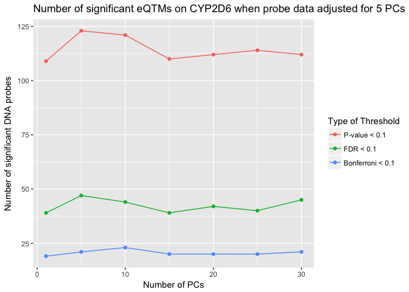

``` r
#dev.off()
```

C21orf56- a gene that contains multiple significant probes
----------------------------------------------------------

``` r
lapply_results_pca_C21orf56_gdata <- do.call(rbind,results_by_gene("C21orf56:ENSG00000160284.10"))
toPlot_lapply_results_pca_C21orf56_gdata  <- lapply_results_pca_C21orf56_gdata  %>% melt(id="num_PC")

#png("/Users/lisa/STAT540/Repo_team_gene_heroes/images/Step 2/gene_C21orf56_gdata.png")
ggplot(aes(x=num_PC, y=value, colour=variable), data = toPlot_lapply_results_pca_C21orf56_gdata) + geom_point() + geom_line( ) + ggtitle("Number of significant eQTMs on C21orf56 when gene data adjusted for 30 PCs") + xlab("Number of PCs") + ylab("Number of significant DNA probes") + scale_colour_discrete(name = "Type of Threshold", breaks=c("num_less_pvalue", "num_less_fdr", "num_less_bonferroni"), labels=c("P-value < 0.1", "FDR < 0.1", "Bonferroni < 0.1"))
```

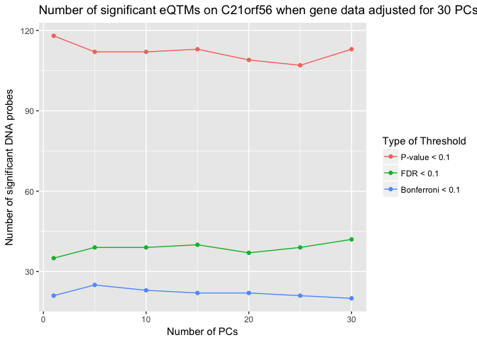

``` r
#dev.off()
```

``` r
lapply_results_pca_C21orf56_probe <- do.call(rbind,results_by_probe("C21orf56:ENSG00000160284.10"))
toPlot_lapply_results_pca_C21orf56_probe  <- lapply_results_pca_C21orf56_probe  %>% melt(id="num_PC")

#png("/Users/lisa/STAT540/Repo_team_gene_heroes/images/Step 2/gene_C21orf56_probes.png")
ggplot(aes(x=num_PC, y=value, colour=variable), data = toPlot_lapply_results_pca_C21orf56_probe) + geom_point() + geom_line( ) + ggtitle("Number of significant eQTMs on C21orf56 when probe data adjusted for 5 PCs") + xlab("Number of PCs") + ylab("Number of significant DNA probes") + scale_colour_discrete(name = "Type of Threshold", breaks=c("num_less_pvalue", "num_less_fdr", "num_less_bonferroni"), labels=c("P-value < 0.1", "FDR < 0.1", "Bonferroni < 0.1"))
```

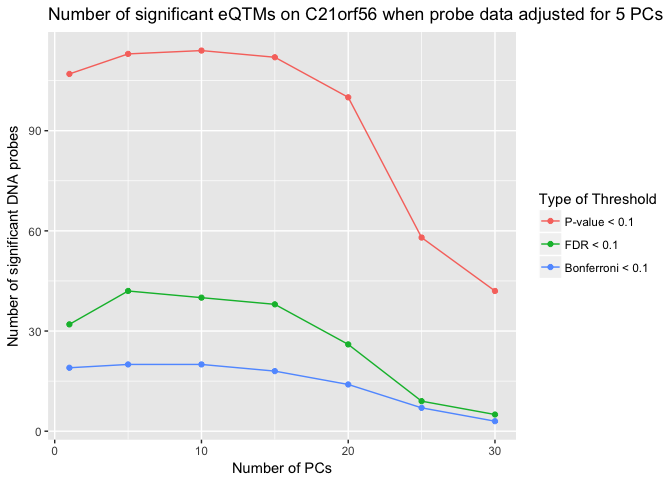

``` r
#dev.off()
```

Here, you can see clearly how the number of PCs adjusted affects the number of significant probes by individual genes. For example, it seems that the number of PCs adjusted in probes does not affect the number of significances. This observation corresponds to the cumulative variance explained that was illustrated above - over 90% of variability was explained on the first PC. In the same gene for the second graph which looks at the number of PCs adjusted in genes affect a lot more especially between 20 to 30 PCs.
