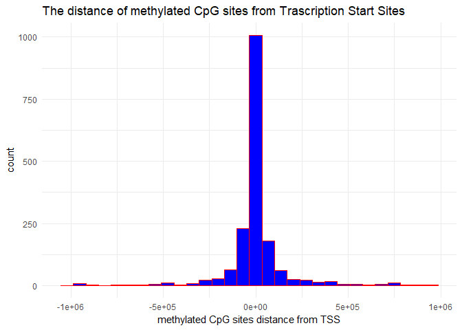
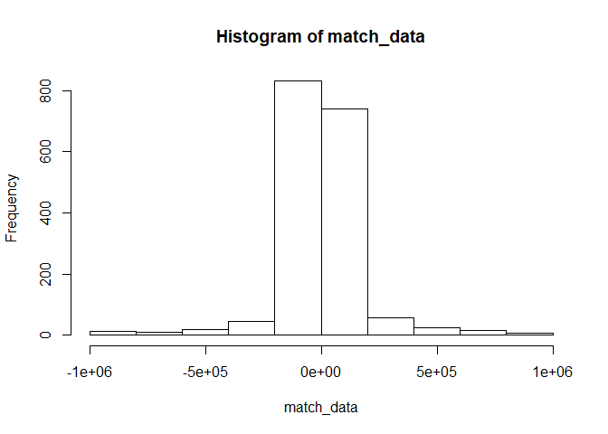
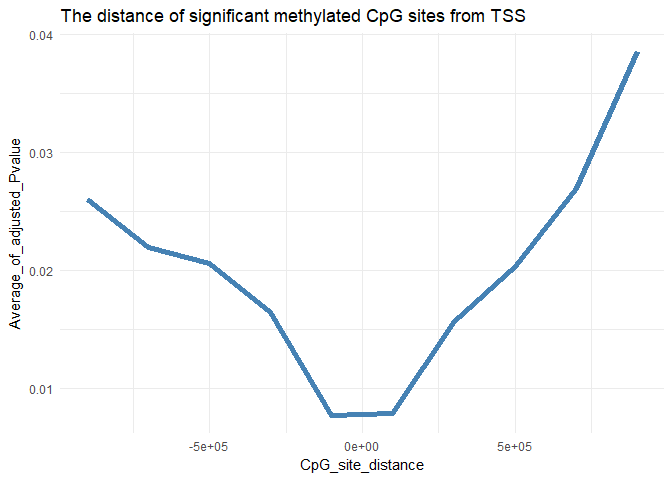
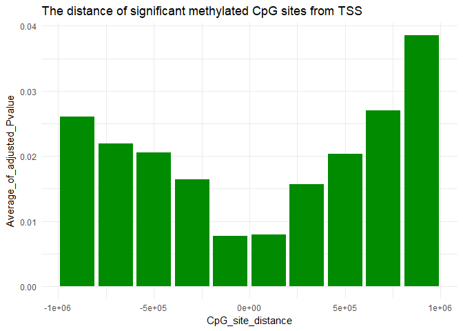

Step4-Biological Analysis-part 1
================
Zohreh Sharafian
March 24, 2018

We load related library packages to understand and verify the biological aspects of our analysis.

### Loading data

We load data set from Step 1:probes\_subjects that contains DNA methylation probe values, subjects\_genes that contains gene expression values, and probes\_genes\_distance that is a sparse matrix containing the distances between a gene and a probe.Note that probes\_genes\_distance is 0 when probe and gene distance is over 1Mb.

``` r
RosmapData <- load("C:/Users/zohre/Desktop/Repo_team_Gene_Heroes/Data/rosmap_postprocV2.RData")
probes_subjects[1:5, 1:5]
```

    ##              10101327   10101589   10202345   10203224   10205244
    ## cg15886596 0.06223898 0.06643503 0.06067198 0.05669612 0.06437694
    ## cg12261117 0.22883983 0.28437790 0.26597568 0.29549651 0.30087612
    ## cg25433760 0.41568249 0.39730559 0.49797690 0.48789274 0.41684200
    ## cg23278040 0.29617882 0.26983136 0.27622813 0.28423828 0.30989476
    ## cg14324693 0.95746992 0.90520790 0.93080533 0.95443363 0.93380807

``` r
subjects_genes[1:5,1:5]
```

    ##          RAB4B:ENSG00000167578.11 ZNF708:ENSG00000182141.4
    ## 10101327               -0.1420430                -0.210962
    ## 10101589                0.1069440                -0.304536
    ## 10202345               -0.2479760                -0.119064
    ## 10203224                0.1582540                -0.191419
    ## 10205244                0.0548584                 0.116589
    ##          RAD23A:ENSG00000179262.4 ARFGAP1:ENSG00000101199.8
    ## 10101327                0.0622548                 0.2212560
    ## 10101589               -0.1841080                 0.3467160
    ## 10202345                0.1261420                -0.0074513
    ## 10203224                0.3774820                 0.1709550
    ## 10205244               -0.0405737                 0.1832600
    ##          CTSA:ENSG00000064601.11
    ## 10101327               0.0180461
    ## 10101589              -0.3811340
    ## 10202345               0.3538090
    ## 10203224              -0.0412956
    ## 10205244               0.2605110

``` r
str(RosmapData)
```

    ##  chr [1:4] "probes_subjects" ".Random.seed" "probes_genes_distance" ...

``` r
nrow(probes_genes_distance) #number of probes
```

    ## Loading required package: Matrix

    ## Warning: package 'Matrix' was built under R version 3.4.3

    ## 
    ## Attaching package: 'Matrix'

    ## The following object is masked from 'package:tidyr':
    ## 
    ##     expand

    ## [1] 42813

``` r
ncol(probes_genes_distance) #number of genes
```

    ## [1] 1795

WE also load a data set from eQTM analysis that we have peroformed in Step 2, including all the adjusted P values for analysing single probes.

``` r
cor_test_results_PCA_lapply_V4 <- readRDS("C:/Users/zohre/Desktop/Repo_team_Gene_Heroes/Code/Step4/cor_test_results_PCA_lapply_V4.rds")
head (cor_test_results_PCA_lapply_V4)
```

    ##                          gene      probe    estimate    pvalue
    ## cor  RAB4B:ENSG00000167578.11 cg25697727  0.04075525 0.3724587
    ## cor1 RAB4B:ENSG00000167578.11 cg02686662 -0.01476077 0.7467678
    ## cor2 RAB4B:ENSG00000167578.11 cg14319773  0.04823112 0.2911267
    ## cor3 RAB4B:ENSG00000167578.11 cg05498041 -0.05633210 0.2174921
    ## cor4 RAB4B:ENSG00000167578.11 cg14583103  0.06417159 0.1599679
    ## cor5 RAB4B:ENSG00000167578.11 cg18074151  0.03974841 0.3843954
    ##      adjusted.pvalue
    ## cor        0.9794159
    ## cor1       0.9957041
    ## cor2       0.9728284
    ## cor3       0.9633156
    ## cor4       0.9527597
    ## cor5       0.9801636

### setting a cut of 0.05 for "adjusted P value"

Next, We extract three columns including gene, probe, and adjusted P value and filtering the genes based on adjusted P value that are greater than 0.05 .

``` r
extracted_matrix <- cor_test_results_PCA_lapply_V4 [,c(1,2, 5)]
head(extracted_matrix)
```

    ##                          gene      probe adjusted.pvalue
    ## cor  RAB4B:ENSG00000167578.11 cg25697727       0.9794159
    ## cor1 RAB4B:ENSG00000167578.11 cg02686662       0.9957041
    ## cor2 RAB4B:ENSG00000167578.11 cg14319773       0.9728284
    ## cor3 RAB4B:ENSG00000167578.11 cg05498041       0.9633156
    ## cor4 RAB4B:ENSG00000167578.11 cg14583103       0.9527597
    ## cor5 RAB4B:ENSG00000167578.11 cg18074151       0.9801636

``` r
nrow(extracted_matrix)
```

    ## [1] 1335544

``` r
# cut off (0.05) for the p value
filtered_pvalue <- extracted_matrix[extracted_matrix$adjusted.pvalue<0.05,]
```

### Merging two data sets

We create a new data set with the subject\_genes as columns and probe\_subjects as rows of data.Then, we match the probes and genes from two data sets.Finally, we plot the histogram of our data to see the distance of the methylated CpG sites from transcription start site (TSS) of the genes.

``` r
data <- as.data.frame(as.matrix(probes_genes_distance))
colnames(data) <- names(subjects_genes)
rownames(data) <- rownames(probes_subjects)
```

``` r
#matching the probes and genes from two data set

match_probes <- match(filtered_pvalue$probe, rownames(data) )
matche_genes <- match(filtered_pvalue$gene, colnames(data) )

inds=cbind(match_probes,matche_genes)

match_data <- data[inds]

qplot(match_data,
      geom="histogram",
      main = "The distance of methylated CpG sites from Trascription Start Sites", 
      xlab = "methylated CpG sites distance from TSS",  
      fill=I("blue"), 
      col=I("red"), 
      ) +theme_minimal()
```

    ## `stat_bin()` using `bins = 30`. Pick better value with `binwidth`.



**The histogram clearly shows that the majority of methylated CpG sites are concentrated near the transcription start sites (TSS) of genes.**

Next, we get the mean of adjusted P value for each bin of histogram (number of methylated CpG sites) to check the distance of the significant probes from TSS.

``` r
tmp <- hist(match_data) 
```



``` r
intervals_values=findInterval(match_data,tmp$breaks)  #get the interval values from the histogram
```

Using a for loop function to get the interval values for all the genes.Then, we generate a geome line plot of adjusted P value for all the methylated CpG sites in genes promoters.

``` r
histog <-  integer (10)
for(i in 1:10) {
elemenets_in_this_interval <-which(intervals_values==i);
histog[i]=mean(filtered_pvalue$adjusted.pvalue[elemenets_in_this_interval])
print((histog[i]))
}
```

    ## [1] 0.02601977
    ## [1] 0.02198257
    ## [1] 0.02058323
    ## [1] 0.0164299
    ## [1] 0.007736391
    ## [1] 0.007949926
    ## [1] 0.0156836
    ## [1] 0.02037731
    ## [1] 0.02700968
    ## [1] 0.03858725

``` r
x=tmp$mids;
y=histog;
data_plot=cbind(x,y)
data_plot=as.data.frame(data_plot)
colnames(data_plot)=c("CpG_site_distance","Average_of_adjusted_Pvalue")

data_plot %>% ggplot2::ggplot(aes(x= CpG_site_distance, y=Average_of_adjusted_Pvalue)) +geom_line(color='steelblue', size=2 )+ ggtitle ("The distance of significant methylated CpG sites from TSS")+ theme_minimal()
```



**The bar grapgh shows that the methylated CpG sites with significant P values are located in the close distance from TSS. This result is consistant with previous data which showed that CpG sites are relatively enriched around transcription start sites of genes\[ref\].**

``` r
x=tmp$mids;
y=histog;
data_plot=cbind(x,y)
data_plot=as.data.frame(data_plot)
colnames(data_plot)=c("CpG_site_distance","Average_of_adjusted_Pvalue")
data_plot %>% ggplot2::ggplot(aes(x= CpG_site_distance, y=Average_of_adjusted_Pvalue)) +geom_bar(stat="identity",fill="Green4")+ggtitle ("The distance of significant methylated CpG sites from TSS")+ theme_minimal()
```


