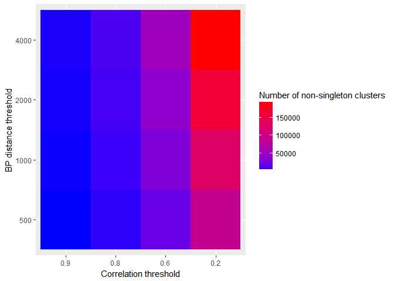
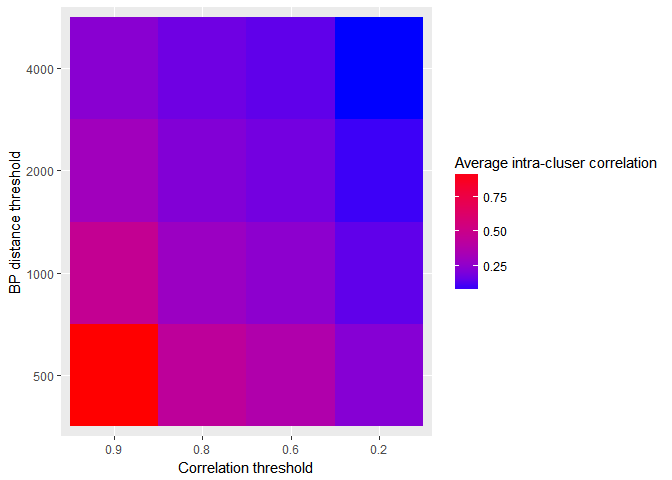
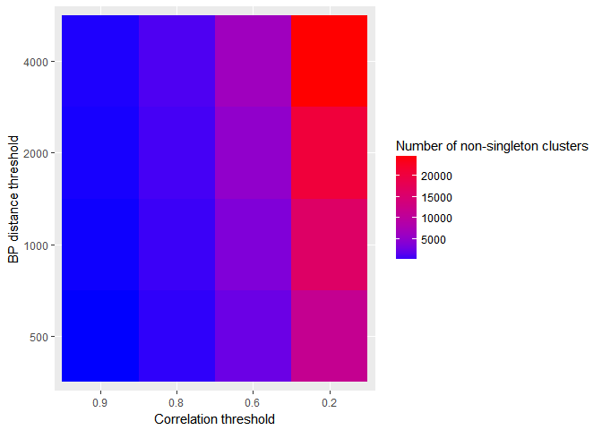
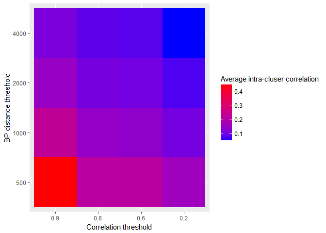
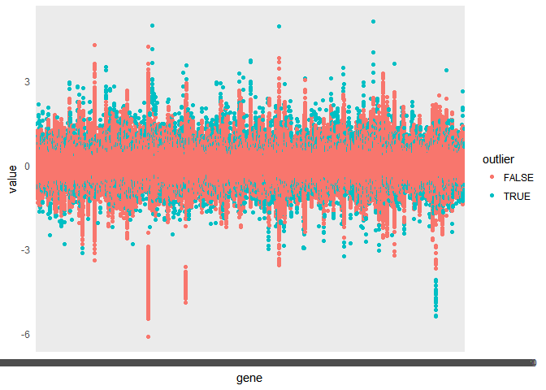
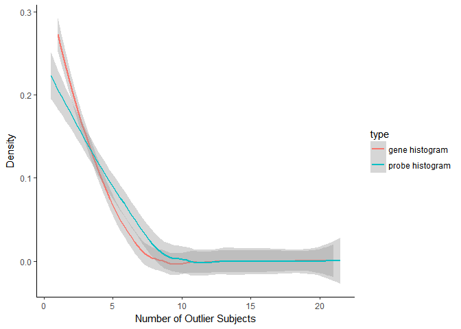

Gene Heros: Step1 - Preprocessing and Data Preparation
================
Sina Jafarzadeh
January 13, 2018

``` r
library(ggplot2)
library(pheatmap)
library(magrittr)
library(reshape2)
library(tibble)
library(dplyr)
```

    ## 
    ## Attaching package: 'dplyr'

    ## The following objects are masked from 'package:stats':
    ## 
    ##     filter, lag

    ## The following objects are masked from 'package:base':
    ## 
    ##     intersect, setdiff, setequal, union

***1.1 Data Introduction***

Our data consists of the gene expression and methylation measurements for `508` and `702` subjects, respectively. We organize the data into the following files:

-   `gene_expression.csv`: a 420103\*702 matrix showing the values for ~420 K CpG sites across 702 samples.
-   `methylation.csv`: a 508\*13484 matrix showing the values for ~13 K genes across 508 samples.
-   `genes_name.csv`: a 13484 elements vector containing the gene symbol and the ensemble name for all genes.
-   `cpg_sites_name.csv`: a 420103 elements vector containing the names for all cpg sites according to the Illumina Infinium HumanMethylation450K BeadChip naming convention.
-   `subjects_in_gene_expression_data.csv`: column names in gene expression matrix presenting the name of subjects that we collected gene expression data for.
-   `subjects_in_methylation_data.csv`: the row names in gene expression matrix presenting the name of subjects that we collected gene expression data for.
-   `methylationCoordChromHMM.csv`: chromatine state annotation for CpG sites according to ChromHMM software. Apparently, it imposes an unnecessary huge number of hypothesis, testing the correlation between each single CpG site and gene pair. So, We solely analyze the probes locating in a 1MB window around the gene of interest using the information encoded in `probe_gene_distance_matrix_sparse.csv`.

***1.2 Multicollinearity of Methylation Probes***

It is known that methylation probes can be in strong Linkage Disequilibrium (LD) with their neighbouring probes. So, we need to reduce the number of probes to a set of unrelated ones. It helps us to decrease the computational cost of the model. Moreover, It is necessary to have uncorrelated probes in the second phase of the project where we want to design linear and non-linear predictors of multiple probes for the gene of interest. Having highly correlation probes impose biases to the predictor results. There are a few tools developed for this purpose. In this project, we use [A-clust algorithm](https://academic.oup.com/bioinformatics/article/29/22/2884/314757) developed by Harvard University. This algorithm first merges each pair of nearby probes and all of the probes located between them if the correlation between that pair is more than `corr_dist_thresh` parameter. Nearby pairs are pairs of probes with a base pair distance less than `bp_dist_thresh` parameter. In the next step, it merges each two neighbour probes if their correlation distance is less than `corr_dist_thresh`. We find the best values for these parameters by creating train and validation datasets. We choose the parameters based on train data and then see if they work on another validation data. We choose CpG sites on chromosomes 1-18 as train data and CpG sites in chromosome 19-22 as validation. We choose the parameters that decrease the number of probes (i.e. create as much cluster as possible) and yield the highest intra-cluster correlation between probes. Below, we plot the results for train set chromosomes. In thie first plot we see the number of clusters with more than one probe for different configuration of parameters. In the second plot, we report the average intra-cluster correlation for the clusters found in previous plot.

``` r
load("../rosmap_postprocV2.RData")

report_matrix_clusts_number_non_singles_train <- read.table("../data/step1/a-clustering/report_matrix_clusts_number_non_singles_train.csv", header=FALSE, sep=",")
report_matrix_intra_cluster_corr_non_singles_train <- read.table("../data/step1/a-clustering/report_matrix_corrs_non_singles_train.csv", header=FALSE, sep=",")

row_col_combinaions = expand.grid(corr_threshold=c("0.9", "0.8", "0.6", "0.2"), bp_dist_threshold=c("500","1000","2000","4000"))
report_matrix_clusts_number_non_singles_train_melt = report_matrix_clusts_number_non_singles_train %>% melt()
```

    ## No id variables; using all as measure variables

``` r
report_matrix_intra_cluster_corr_non_singles_train_melt = report_matrix_intra_cluster_corr_non_singles_train %>%  melt()
```

    ## No id variables; using all as measure variables

``` r
heatmap_data = cbind(row_col_combinaions, number_of_clusters=report_matrix_clusts_number_non_singles_train_melt$value)
heatmap_data %>% ggplot(aes(corr_threshold,bp_dist_threshold,fill = number_of_clusters)) + geom_tile() + scale_fill_gradient("Number of non-singleton clusters",low = 'blue',high = 'red') +xlab('Correlation threshold')+ylab('BP distance threshold') 
```



``` r
heatmap_data = cbind(row_col_combinaions, intra_cluster_correlation=report_matrix_intra_cluster_corr_non_singles_train_melt$value)
heatmap_data %>% ggplot(aes(corr_threshold,bp_dist_threshold,fill = intra_cluster_correlation)) + geom_tile() + scale_fill_gradient("Average intra-cluser correlation",low = 'blue',high = 'red') +xlab('Correlation threshold')+ylab('BP distance threshold') 
```

 The plots suggest that `corr_threshold = 0.8` and `bp_dist_threshold = 1000` are the best parameters in terms of the intra-cluster correlation/number of clusters trade-off. The authors of A-clust paper also suggested this parameter in their experiment on human methylation data, supporting the chosen parameters in this project. Now, we investigate the parameters on validation set. Below, you see the similar plots for validation data:

``` r
report_matrix_clusts_number_non_singles_test <- read.table("../data/step1/a-clustering/report_matrix_clusts_number_non_singles_test.csv", header=FALSE, sep=",")
report_matrix_intra_cluster_corr_non_singles_test <- read.table("../data/step1/a-clustering/report_matrix_corrs_non_singles_test.csv", header=FALSE, sep=",")

row_col_combinaions = expand.grid(corr_threshold=c("0.9", "0.8", "0.6", "0.2"), bp_dist_threshold=c("500","1000","2000","4000"))
report_matrix_clusts_number_non_singles_test_melt = report_matrix_clusts_number_non_singles_test %>% melt()
```

    ## No id variables; using all as measure variables

``` r
report_matrix_intra_cluster_corr_non_singles_test_melt = report_matrix_intra_cluster_corr_non_singles_test %>%  melt()
```

    ## No id variables; using all as measure variables

``` r
heatmap_data = cbind(row_col_combinaions, number_of_clusters=report_matrix_clusts_number_non_singles_test_melt$value)
heatmap_data %>% ggplot(aes(corr_threshold,bp_dist_threshold,fill = number_of_clusters)) + geom_tile() + scale_fill_gradient("Number of non-singleton clusters",low = 'blue',high = 'red') +xlab('Correlation threshold')+ylab('BP distance threshold') 
```



``` r
heatmap_data = cbind(row_col_combinaions, intra_cluster_correlation=report_matrix_intra_cluster_corr_non_singles_test_melt$value)
heatmap_data %>% ggplot(aes(corr_threshold,bp_dist_threshold,fill = intra_cluster_correlation)) + geom_tile() + scale_fill_gradient("Average intra-cluser correlation",low = 'blue',high = 'red') +xlab('Correlation threshold')+ylab('BP distance threshold') 
```



It verifies the consistency of parameters fitness in train and validation data. The final results are the following files. Because of the space limit, we don't uplaod the actual files to the Github repository.

-   `methylationSNMnorm_usr_prb_matrix_sampled_corr_dist_thresh_point2_bp_dist_thresh_1000_train.csv`

-   `methylationSNMnorm_usr_prb_matrix_sampled_corr_dist_thresh_point2_bp_dist_thresh_1000_test.csv`

***1.3 Data Conversion***

In this part, we convert the described .csv files to the R language data format to make it easier to handle. We also combine the related .csv files to organize the data better. In order to lower the computational cost, we limit the analysis to chromosomes 19-22. Below is the list of final data structure saved together as `rosmap_postdocV1.RData` file:

-   probes\_genes\_distance: a sparse matrix created by Matrix library showing the distance of each cpg probe to each gene in its neighbourhood.
-   probes\_subjects: a data frame showing the Z-scored value for each cpg site across all subjects.
-   subjects\_genes: a data frame showing the expression value of each gene across all subjects.

We can access the list of probes, genes, and subjects using the rownames() and colnames() functions.

***1.4 Exploration***

According the ROSMAP data documentation, the data is QC'ed and controlled for batch and confounder effect, however it is not obvious if they removed outliers in the QC process or not. In this part, we analyze the outliers in our gene expression and methylation data. In the scatter plot below, we show the subjects with gene expression values outside the 3 standard deviation around the mean with green color, suggesting them as potential outlier. Having 468 subjects, we expect to have around ~5 green points per gene (or methylation probe).

``` r
subjects_genes=rownames_to_column(subjects_genes)
subjects_genes_melted = melt(subjects_genes)
```

    ## Using rowname as id variables

``` r
colnames(subjects_genes_melted)=c("subject","gene","value")
subjects_genes_melted %>% group_by(gene) %>% mutate(outlier=abs(value-mean(value))>(3*sd(value))) %>% ggplot() +  geom_point(aes(x=gene,y=value, colour=outlier)) + theme_bw() +theme_minimal()
```



Below, we see the histogram of number of potential outliers for gene and methylation data. The X axis shows the number of outlier subjects and the Y axis show the density value, showing the frequency of genes or methylation probes having that number of subjects as potential outlier. We see that the expected value of those distributions are less than 5 showing that the data does not show any form of abnormality.

``` r
probes_subjects_new = rownames_to_column(probes_subjects);
probes_subjects_melted = probes_subjects_new %>% melt() %>% as.data.frame()
```

    ## Using rowname as id variables

``` r
colnames(probes_subjects_melted)=c("probe","subject","value")
probes_subjects_melted=probes_subjects_melted %>% group_by(probe) %>% mutate(outlier_count=length(which(abs(value-mean(value))>3*sd(value))))
probes_subjects_melted = probes_subjects_melted[,c("probe","outlier_count")] %>% unique() 

probes_subjects_melted = as.data.frame(probes_subjects_melted)
subjects_genes_melted = as.data.frame(subjects_genes_melted)

colnames(subjects_genes_melted)=c("subject","gene","value")
subjects_genes_melted=subjects_genes_melted %>% group_by(gene) %>% mutate(outlier_count=length(which(abs(value-mean(value))>3*sd(value))))
subjects_genes_melted = subjects_genes_melted[,c("gene","outlier_count")] %>% unique() 

subjects_genes_melted$model = "gene"
probes_subjects_melted$model = "probe"


probes_subjects_melted = as.data.frame(probes_subjects_melted)
subjects_genes_melted = as.data.frame(subjects_genes_melted)


colnames(probes_subjects_melted)=c("name","count","model")
colnames(subjects_genes_melted)=c("name","count","model")


first=hist(subjects_genes_melted$count,plot = FALSE)
second=hist(probes_subjects_melted$count, plot = FALSE)

first_hist=rbind(first$mids,first$density) %>% t() %>% as.data.frame()
second_hist = rbind(second$mids, second$density) %>% t() %>% as.data.frame()
first_hist$type="gene histogram"
second_hist$type = "probe histogram"
overall=rbind(first_hist,second_hist)
ggplot() +geom_smooth(data=overall, aes(x=V1, y=V2, colour = type)) +xlab("Number of Outlier Subjects") +ylab("Density") + theme_bw() + theme(axis.line = element_line(colour = "black"),
    panel.grid.major = element_blank(),
    panel.grid.minor = element_blank(),
    panel.border = element_blank(),
    panel.background = element_blank())  + scale_fill_discrete(name = "New Legend Title")
```

    ## `geom_smooth()` using method = 'loess'



``` r
gene_distribution_expected_value = sum(first_hist$V1*first_hist$V2)
methylation_distribution_expected_value = sum(second_hist$V1*second_hist$V2)

gene_distribution_expected_value
```

    ## [1] 1.137326

``` r
methylation_distribution_expected_value
```

    ## [1] 2.912492
