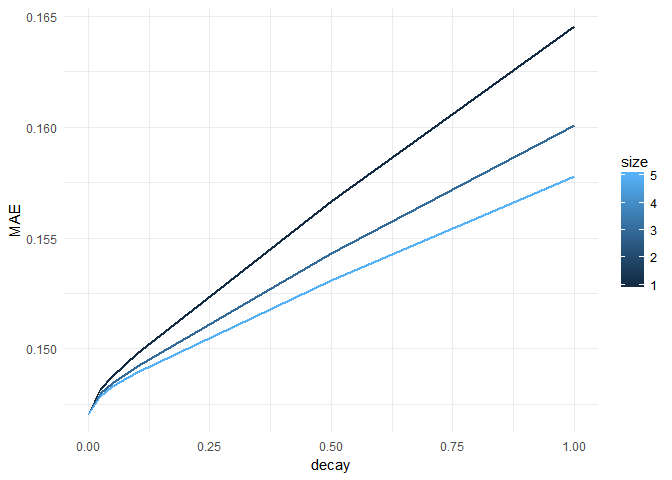
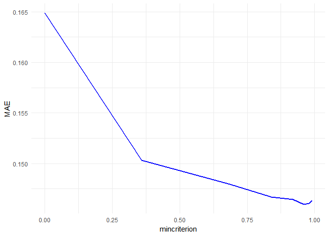
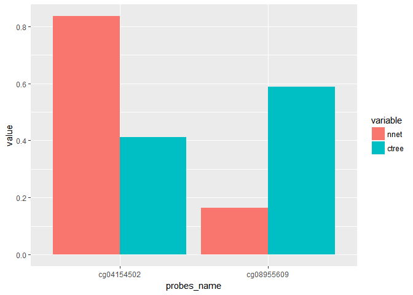
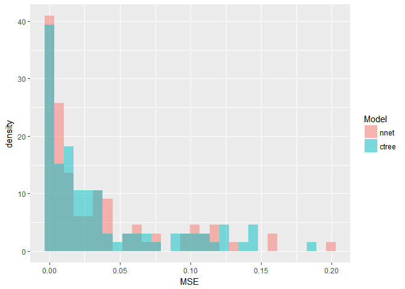

Non-linear models to predict gene expression level
================
Sina Jafarzadeh
March 28, 2018

``` r
library(dplyr)
```

    ## 
    ## Attaching package: 'dplyr'

    ## The following objects are masked from 'package:stats':
    ## 
    ##     filter, lag

    ## The following objects are masked from 'package:base':
    ## 
    ##     intersect, setdiff, setequal, union

``` r
library(Matrix)
library(magrittr)
library(tibble)
library(neuralnet)
```

    ## 
    ## Attaching package: 'neuralnet'

    ## The following object is masked from 'package:dplyr':
    ## 
    ##     compute

``` r
library(caret)
```

    ## Loading required package: lattice

    ## Loading required package: ggplot2

``` r
library(gbm)
```

    ## Loading required package: survival

    ## 
    ## Attaching package: 'survival'

    ## The following object is masked from 'package:caret':
    ## 
    ##     cluster

    ## Loading required package: splines

    ## Loading required package: parallel

    ## Loaded gbm 2.1.3

``` r
library(mnormt)
library(doParallel)
```

    ## Loading required package: foreach

    ## Loading required package: iterators

``` r
library(foreach)
library(logging)
library(reshape2)
```

We started out with linear regression models to capture the relations between the CpG sites values and the level of expression for different genes. We have applied various feature selection techniques to achieve a stable performance for the model and make it robust against overfitting. In this section, we are going to analyze the performance of more advanced models that capture the non-linear relations between the variables as well. For this purpose, we train two models based on neural networks and conditional inference trees. Neural networks are known for their capability of estimating more complex smooth functions. Decision Trees are also known for partitioning the vector space into different disjoint areas instead of one continuous estimation line.

Our first step is loading data. We need to load the results of the initial eQTM analysis that shows the significant probes for each gene. We also need to load the initial dataset to get the value of methylation probes and genes of interest. We filter out adjusted pvalues bigger than 0.05 as the significance threshold. We just consider the genes with more than one significant probe resulting in a total number of 312 genes.

``` r
cor_test_results_PCA_lapply_V4=readRDS('../cor_test_results_PCA_lapply_V4.rds')
load('../rosmap_postprocV2.RData')
```

``` r
cor_test_results_PCA_lapply_V4_significants=cor_test_results_PCA_lapply_V4 %>% filter(adjusted.pvalue<0.05)
important_genes=table(cor_test_results_PCA_lapply_V4_significants$gene) %>% as.data.frame() %>% filter(Freq>1)
cor_test_results_PCA_lapply_V4_significants_importance_genes = cor_test_results_PCA_lapply_V4_significants[which(match(cor_test_results_PCA_lapply_V4_significants$gene,important_genes$Var1,nomatch = 0)!=0),]
genes_ind = match(cor_test_results_PCA_lapply_V4_significants_importance_genes$gene,colnames(subjects_genes))
probes_ind = match(cor_test_results_PCA_lapply_V4_significants_importance_genes$probe,rownames(probes_subjects));
genes_ind_unique=unique(genes_ind)
mse_on_test=matrix(nrow  = 2,ncol = length(genes_ind_unique),data = 0)
mae_on_test=matrix(nrow = 2,ncol = length(genes_ind_unique), data = 0)
  
first_feature_importance=matrix(nrow = 6,ncol = length(genes_ind_unique), data = 0)
```

we use `caret` library to analyze the data by the mentioned model. we use `80%` of subjects for train and the remaining `20%` for the test. We train the model using a 3-fold cross validation repeated 10 times for different random splitting of data. for the neural network, we use `nnet` model with maximum iterations of `1000`. we tune the `decay` and `size` parameters of the networking using the cross-validation results. we use the logistic function as activation function of neurons to impose non-linearity for the decision tree, we use `ctree` model with `mincriterion` as tuning parameter selected by cross-validation. We then use the model to predict the gene expression values for genes in the test dataset. We also quantize the r-square contribution of the most significant probe divided by the sum of r-square for all of the significant probes. This criterion highlights the importance of using multiple probes in model training instead of single probe analysis.

``` r
#foreach (i=1:length(genes_ind_unique), .packages = c("dplyr","magrittr","tibble","neuralnet","caret","gbm","mnormt"))%dopar% {
for (i in 1:length(genes_ind_unique)){
  print(i)
#  loginfo(i,logger='writeToFile')

  subjects_gene = subjects_genes[,genes_ind_unique[i]] %>% as.data.frame()
  rownames(subjects_gene)=rownames(subjects_genes)
  colnames(subjects_gene)=important_genes$Var1[i]
  probes_subject = probes_subjects[probes_ind[which(genes_ind==genes_ind_unique[i])],] ;
  subject_probes = probes_subject %>% t()
  data=merge(subject_probes,subjects_gene, by = "row.names")

  data=column_to_rownames(data, var = "Row.names") 
  #folds <- kWayCrossValidation(nRows = nrow(data),3);
  trainIndex <- createDataPartition(data[,ncol(data)], p=.8, list=F)
  train_control<- trainControl(method="repeatedcv", number=3,repeats = 10, savePredictions = TRUE)
  my.grid <- expand.grid(.decay = c(1, 0.5, 0.1, 0.05, 0.025, 0), .size = c(1, 3, 5))
  fit.nnet <- train(x = data[trainIndex,-ncol(data)],y=data[trainIndex,ncol(data)], trControl = train_control,
    method = "nnet", maxit = 1000, tuneGrid = my.grid, trace = F, linout = 0)    
 
  my.grid=expand.grid(.mincriterion=c(0.99, 0.98, 0.96, 0.92, 0.84, 0.68, 0.36, 0))
  fit.ctree <- train(x = data[trainIndex,-ncol(data)],y=data[trainIndex,ncol(data)], trControl = train_control, method='ctree',tuneGrid=my.grid)

  
  # fit.leapBackward <-train(x = data[trainIndex,-ncol(data)],y=data[trainIndex,ncol(data)], trControl = train_control, method='leapBackward',tuneGrid = expand.grid(nvmax = seq(ncol(data)-1) ))
  # 
  #   fit.leapForward <-train(x = data[trainIndex,-ncol(data)],y=data[trainIndex,ncol(data)], trControl = train_control, method='leapForward',tuneGrid = expand.grid(nvmax = seq(ncol(data)-1) ))
  #   
  #     fit.leapSeq <-train(x = data[trainIndex,-ncol(data)],y=data[trainIndex,ncol(data)], trControl = train_control, method='leapSeq',tuneGrid = expand.grid(nvmax = seq(ncol(data)-1) ))
  #     
  #       fit.lmStepAIC <-train(x = data[trainIndex,-ncol(data)],y=data[trainIndex,ncol(data)], trControl = train_control, method='lmStepAIC')
        
  
  # gbmGrid <-  expand.grid(interaction.depth = c(1, 3, 6, 9, 10),
  #                   n.trees = (0:5)*5, 
  #                   shrinkage = seq(.0005, .05,.0005),
  #                   n.minobsinnode = 10) # you can also put something        like c(5, 10, 15, 20)
  # 
  # fit.gbm <- train(x = data[trainIndex,-ncol(data)],y=data[trainIndex,ncol(data)], trControl = train_control, method='gbm',tuneGrid=gbmGrid , verbose=FALSE)
  # 
  # 
  predict.nnet <- predict(fit.nnet, newdata =data[-trainIndex,-ncol(data)])
  predict.ctree <- predict(fit.ctree, newdata =data[-trainIndex,-ncol(data)])
  # predict.leapBackward<- predict(fit.leapBackward, newdata =data[-trainIndex,-ncol(data)])
  # predict.leapForward <- predict(fit.leapForward, newdata =data[-trainIndex,-ncol(data)])
  # predict.leapSeq<- predict(fit.leapSeq, newdata =data[-trainIndex,-ncol(data)])
  # predict.lmStepAIC<- predict(fit.lmStepAIC, newdata =data[-trainIndex,-ncol(data)])
  # 
  # predict.gbm <- predict(fit.gbm, newdata =data[-trainIndex,-ncol(data)])
  # 
  mse_on_test[1,i]=mean((predict.nnet-data[-trainIndex,ncol(data)])^2)
  mae_on_test[1,i]=mean(abs(predict.nnet-data[-trainIndex,ncol(data)]))
  
  mse_on_test[2,i]=mean((predict.ctree-data[-trainIndex,ncol(data)])^2)
  mae_on_test[2,i]=mean(abs(predict.ctree-data[-trainIndex,ncol(data)]))
  
  # mse_on_test[3,i]=mean((predict.leapBackward-data[-trainIndex,ncol(data)])^2)
  # mae_on_test[3,i]=mean(abs(predict.leapBackward-data[-trainIndex,ncol(data)]))
  # 
  # 
  # mse_on_test[4,i]=mean((predict.leapForward-data[-trainIndex,ncol(data)])^2)
  # mae_on_test[4,i]=mean(abs(predict.leapForward-data[-trainIndex,ncol(data)]))
  # 
  # 
  # mse_on_test[5,i]=mean((predict.leapSeq-data[-trainIndex,ncol(data)])^2)
  # mae_on_test[5,i]=mean(abs(predict.leapSeq-data[-trainIndex,ncol(data)]))
  # 
  # 
  # mse_on_test[6,i]=mean((predict.lmStepAIC-data[-trainIndex,ncol(data)])^2)
  # mae_on_test[6,i]=mean(abs(predict.lmStepAIC-data[-trainIndex,ncol(data)]))
  # 
  # 
  
  # mse_on_test[3,i]=mean((predict.gbm-data[-trainIndex,ncol(data)])^2)
  # mae_on_test[3,i]=mean(abs(predict.gbm-data[-trainIndex,ncol(data)]))
  # 
  importance.nnet=varImp(fit.nnet, scale = FALSE)$importance
  importance.ctree=varImp(fit.ctree, scale = FALSE)$importance
  #   importance.leapBackward=varImp(fit.leapBackward, scale = FALSE)$importance
  # importance.leapForward=varImp(fit.leapForward, scale = FALSE)$importance
  #   importance.leapSeq=varImp(fit.leapSeq, scale = FALSE)$importance
  # importance.lmStepAIC=varImp(fit.lmStepAIC, scale = FALSE)$importance
  # 
  # importance.gbm=varImp(fit.gbm, scale = FALSE)$importance
  # 
  first_feature_importance[1,i]=max(importance.nnet$Overall)/sum(importance.nnet$Overall)
  first_feature_importance[2,i]=max(importance.ctree$Overall)/sum(importance.ctree$Overall)
  # first_feature_importance[3,i]=max(importance.leapBackward$Overall)/sum(importance.leapBackward$Overall)
  # first_feature_importance[4,i]=max(importance.leapForward$Overall)/sum(importance.leapForward$Overall)
  # first_feature_importance[5,i]=max(importance.leapSeq$Overall)/sum(importance.leapSeq$Overall)
  # first_feature_importance[6,i]=max(importance.lmStepAIC$Overall)/sum(importance.lmStepAIC$Overall)
  # 
  # first_feature_importance[3,i]=max(importance.gbm$Overall)/sum(importance.gbm$Overall)
  # 
}
```

    ## [1] 1

    ## Warning in nominalTrainWorkflow(x = x, y = y, wts = weights, info =
    ## trainInfo, : There were missing values in resampled performance measures.

    ## Warning in nominalTrainWorkflow(x = x, y = y, wts = weights, info =
    ## trainInfo, : There were missing values in resampled performance measures.

    ## [1] 2

    ## Warning in nominalTrainWorkflow(x = x, y = y, wts = weights, info =
    ## trainInfo, : There were missing values in resampled performance measures.

    ## [1] 3

    ## Warning in nominalTrainWorkflow(x = x, y = y, wts = weights, info =
    ## trainInfo, : There were missing values in resampled performance measures.

    ## Warning in nominalTrainWorkflow(x = x, y = y, wts = weights, info =
    ## trainInfo, : There were missing values in resampled performance measures.

    ## [1] 4

    ## Warning in nominalTrainWorkflow(x = x, y = y, wts = weights, info =
    ## trainInfo, : There were missing values in resampled performance measures.

    ## Warning in nominalTrainWorkflow(x = x, y = y, wts = weights, info =
    ## trainInfo, : There were missing values in resampled performance measures.

    ## [1] 5

    ## Warning in nominalTrainWorkflow(x = x, y = y, wts = weights, info =
    ## trainInfo, : There were missing values in resampled performance measures.

    ## [1] 6

    ## Warning in nominalTrainWorkflow(x = x, y = y, wts = weights, info =
    ## trainInfo, : There were missing values in resampled performance measures.

    ## Warning in nominalTrainWorkflow(x = x, y = y, wts = weights, info =
    ## trainInfo, : There were missing values in resampled performance measures.

    ## [1] 7

    ## Warning in nominalTrainWorkflow(x = x, y = y, wts = weights, info =
    ## trainInfo, : There were missing values in resampled performance measures.

    ## [1] 8

    ## Warning in nominalTrainWorkflow(x = x, y = y, wts = weights, info =
    ## trainInfo, : There were missing values in resampled performance measures.

    ## Warning in nominalTrainWorkflow(x = x, y = y, wts = weights, info =
    ## trainInfo, : There were missing values in resampled performance measures.

    ## [1] 9

    ## Warning in nominalTrainWorkflow(x = x, y = y, wts = weights, info =
    ## trainInfo, : There were missing values in resampled performance measures.

    ## Warning in nominalTrainWorkflow(x = x, y = y, wts = weights, info =
    ## trainInfo, : There were missing values in resampled performance measures.

    ## [1] 10

    ## Warning in nominalTrainWorkflow(x = x, y = y, wts = weights, info =
    ## trainInfo, : There were missing values in resampled performance measures.

    ## [1] 11

    ## Warning in nominalTrainWorkflow(x = x, y = y, wts = weights, info =
    ## trainInfo, : There were missing values in resampled performance measures.

    ## Warning in nominalTrainWorkflow(x = x, y = y, wts = weights, info =
    ## trainInfo, : There were missing values in resampled performance measures.

    ## [1] 12

    ## Warning in nominalTrainWorkflow(x = x, y = y, wts = weights, info =
    ## trainInfo, : There were missing values in resampled performance measures.

    ## [1] 13

    ## Warning in nominalTrainWorkflow(x = x, y = y, wts = weights, info =
    ## trainInfo, : There were missing values in resampled performance measures.

    ## Warning in nominalTrainWorkflow(x = x, y = y, wts = weights, info =
    ## trainInfo, : There were missing values in resampled performance measures.

    ## [1] 14

    ## Warning in nominalTrainWorkflow(x = x, y = y, wts = weights, info =
    ## trainInfo, : There were missing values in resampled performance measures.

    ## [1] 15

    ## Warning in nominalTrainWorkflow(x = x, y = y, wts = weights, info =
    ## trainInfo, : There were missing values in resampled performance measures.

    ## Warning in nominalTrainWorkflow(x = x, y = y, wts = weights, info =
    ## trainInfo, : There were missing values in resampled performance measures.

    ## [1] 16

    ## Warning in nominalTrainWorkflow(x = x, y = y, wts = weights, info =
    ## trainInfo, : There were missing values in resampled performance measures.

    ## [1] 17

    ## Warning in nominalTrainWorkflow(x = x, y = y, wts = weights, info =
    ## trainInfo, : There were missing values in resampled performance measures.

    ## Warning in nominalTrainWorkflow(x = x, y = y, wts = weights, info =
    ## trainInfo, : There were missing values in resampled performance measures.

    ## [1] 18

    ## Warning in nominalTrainWorkflow(x = x, y = y, wts = weights, info =
    ## trainInfo, : There were missing values in resampled performance measures.

    ## Warning in nominalTrainWorkflow(x = x, y = y, wts = weights, info =
    ## trainInfo, : There were missing values in resampled performance measures.

    ## [1] 19

    ## Warning in nominalTrainWorkflow(x = x, y = y, wts = weights, info =
    ## trainInfo, : There were missing values in resampled performance measures.

    ## Warning in nominalTrainWorkflow(x = x, y = y, wts = weights, info =
    ## trainInfo, : There were missing values in resampled performance measures.

    ## [1] 20

    ## Warning in nominalTrainWorkflow(x = x, y = y, wts = weights, info =
    ## trainInfo, : There were missing values in resampled performance measures.

    ## Warning in nominalTrainWorkflow(x = x, y = y, wts = weights, info =
    ## trainInfo, : There were missing values in resampled performance measures.

    ## [1] 21

    ## Warning in nominalTrainWorkflow(x = x, y = y, wts = weights, info =
    ## trainInfo, : There were missing values in resampled performance measures.

    ## [1] 22

    ## Warning in nominalTrainWorkflow(x = x, y = y, wts = weights, info =
    ## trainInfo, : There were missing values in resampled performance measures.

    ## Warning in nominalTrainWorkflow(x = x, y = y, wts = weights, info =
    ## trainInfo, : There were missing values in resampled performance measures.

    ## [1] 23

    ## Warning in nominalTrainWorkflow(x = x, y = y, wts = weights, info =
    ## trainInfo, : There were missing values in resampled performance measures.

    ## Warning in nominalTrainWorkflow(x = x, y = y, wts = weights, info =
    ## trainInfo, : There were missing values in resampled performance measures.

    ## [1] 24

    ## Warning in nominalTrainWorkflow(x = x, y = y, wts = weights, info =
    ## trainInfo, : There were missing values in resampled performance measures.

    ## [1] 25

    ## Warning in nominalTrainWorkflow(x = x, y = y, wts = weights, info =
    ## trainInfo, : There were missing values in resampled performance measures.

    ## Warning in nominalTrainWorkflow(x = x, y = y, wts = weights, info =
    ## trainInfo, : There were missing values in resampled performance measures.

    ## [1] 26

    ## Warning in nominalTrainWorkflow(x = x, y = y, wts = weights, info =
    ## trainInfo, : There were missing values in resampled performance measures.

    ## [1] 27

    ## Warning in nominalTrainWorkflow(x = x, y = y, wts = weights, info =
    ## trainInfo, : There were missing values in resampled performance measures.

    ## Warning in nominalTrainWorkflow(x = x, y = y, wts = weights, info =
    ## trainInfo, : There were missing values in resampled performance measures.

    ## [1] 28

    ## Warning in nominalTrainWorkflow(x = x, y = y, wts = weights, info =
    ## trainInfo, : There were missing values in resampled performance measures.

    ## Warning in nominalTrainWorkflow(x = x, y = y, wts = weights, info =
    ## trainInfo, : There were missing values in resampled performance measures.

    ## [1] 29

    ## Warning in nominalTrainWorkflow(x = x, y = y, wts = weights, info =
    ## trainInfo, : There were missing values in resampled performance measures.

    ## Warning in nominalTrainWorkflow(x = x, y = y, wts = weights, info =
    ## trainInfo, : There were missing values in resampled performance measures.

    ## [1] 30

    ## Warning in nominalTrainWorkflow(x = x, y = y, wts = weights, info =
    ## trainInfo, : There were missing values in resampled performance measures.

    ## Warning in nominalTrainWorkflow(x = x, y = y, wts = weights, info =
    ## trainInfo, : There were missing values in resampled performance measures.

    ## [1] 31

    ## Warning in nominalTrainWorkflow(x = x, y = y, wts = weights, info =
    ## trainInfo, : There were missing values in resampled performance measures.

    ## [1] 32

    ## Warning in nominalTrainWorkflow(x = x, y = y, wts = weights, info =
    ## trainInfo, : There were missing values in resampled performance measures.

    ## Warning in nominalTrainWorkflow(x = x, y = y, wts = weights, info =
    ## trainInfo, : There were missing values in resampled performance measures.

    ## [1] 33

    ## Warning in nominalTrainWorkflow(x = x, y = y, wts = weights, info =
    ## trainInfo, : There were missing values in resampled performance measures.

    ## Warning in nominalTrainWorkflow(x = x, y = y, wts = weights, info =
    ## trainInfo, : There were missing values in resampled performance measures.

    ## [1] 34

    ## Warning in nominalTrainWorkflow(x = x, y = y, wts = weights, info =
    ## trainInfo, : There were missing values in resampled performance measures.

    ## Warning in nominalTrainWorkflow(x = x, y = y, wts = weights, info =
    ## trainInfo, : There were missing values in resampled performance measures.

    ## [1] 35

    ## Warning in nominalTrainWorkflow(x = x, y = y, wts = weights, info =
    ## trainInfo, : There were missing values in resampled performance measures.

    ## [1] 36

    ## Warning in nominalTrainWorkflow(x = x, y = y, wts = weights, info =
    ## trainInfo, : There were missing values in resampled performance measures.

    ## Warning in nominalTrainWorkflow(x = x, y = y, wts = weights, info =
    ## trainInfo, : There were missing values in resampled performance measures.

    ## [1] 37

    ## Warning in nominalTrainWorkflow(x = x, y = y, wts = weights, info =
    ## trainInfo, : There were missing values in resampled performance measures.

    ## [1] 38

    ## Warning in nominalTrainWorkflow(x = x, y = y, wts = weights, info =
    ## trainInfo, : There were missing values in resampled performance measures.

    ## [1] 39

    ## Warning in nominalTrainWorkflow(x = x, y = y, wts = weights, info =
    ## trainInfo, : There were missing values in resampled performance measures.

    ## [1] 40

    ## Warning in nominalTrainWorkflow(x = x, y = y, wts = weights, info =
    ## trainInfo, : There were missing values in resampled performance measures.

    ## Warning in nominalTrainWorkflow(x = x, y = y, wts = weights, info =
    ## trainInfo, : There were missing values in resampled performance measures.

    ## [1] 41

    ## Warning in nominalTrainWorkflow(x = x, y = y, wts = weights, info =
    ## trainInfo, : There were missing values in resampled performance measures.

    ## [1] 42

    ## Warning in nominalTrainWorkflow(x = x, y = y, wts = weights, info =
    ## trainInfo, : There were missing values in resampled performance measures.

    ## Warning in nominalTrainWorkflow(x = x, y = y, wts = weights, info =
    ## trainInfo, : There were missing values in resampled performance measures.

    ## [1] 43

    ## Warning in nominalTrainWorkflow(x = x, y = y, wts = weights, info =
    ## trainInfo, : There were missing values in resampled performance measures.

    ## Warning in nominalTrainWorkflow(x = x, y = y, wts = weights, info =
    ## trainInfo, : There were missing values in resampled performance measures.

    ## [1] 44

    ## Warning in nominalTrainWorkflow(x = x, y = y, wts = weights, info =
    ## trainInfo, : There were missing values in resampled performance measures.

    ## Warning in nominalTrainWorkflow(x = x, y = y, wts = weights, info =
    ## trainInfo, : There were missing values in resampled performance measures.

    ## [1] 45

    ## Warning in nominalTrainWorkflow(x = x, y = y, wts = weights, info =
    ## trainInfo, : There were missing values in resampled performance measures.

    ## Warning in nominalTrainWorkflow(x = x, y = y, wts = weights, info =
    ## trainInfo, : There were missing values in resampled performance measures.

    ## [1] 46

    ## Warning in nominalTrainWorkflow(x = x, y = y, wts = weights, info =
    ## trainInfo, : There were missing values in resampled performance measures.

    ## Warning in nominalTrainWorkflow(x = x, y = y, wts = weights, info =
    ## trainInfo, : There were missing values in resampled performance measures.

    ## [1] 47

    ## Warning in nominalTrainWorkflow(x = x, y = y, wts = weights, info =
    ## trainInfo, : There were missing values in resampled performance measures.

    ## Warning in nominalTrainWorkflow(x = x, y = y, wts = weights, info =
    ## trainInfo, : There were missing values in resampled performance measures.

    ## [1] 48

    ## Warning in nominalTrainWorkflow(x = x, y = y, wts = weights, info =
    ## trainInfo, : There were missing values in resampled performance measures.

    ## Warning in nominalTrainWorkflow(x = x, y = y, wts = weights, info =
    ## trainInfo, : There were missing values in resampled performance measures.

    ## [1] 49

    ## Warning in nominalTrainWorkflow(x = x, y = y, wts = weights, info =
    ## trainInfo, : There were missing values in resampled performance measures.

    ## Warning in nominalTrainWorkflow(x = x, y = y, wts = weights, info =
    ## trainInfo, : There were missing values in resampled performance measures.

    ## [1] 50

    ## Warning in nominalTrainWorkflow(x = x, y = y, wts = weights, info =
    ## trainInfo, : There were missing values in resampled performance measures.

    ## Warning in nominalTrainWorkflow(x = x, y = y, wts = weights, info =
    ## trainInfo, : There were missing values in resampled performance measures.

    ## [1] 51

    ## Warning in nominalTrainWorkflow(x = x, y = y, wts = weights, info =
    ## trainInfo, : There were missing values in resampled performance measures.

    ## Warning in nominalTrainWorkflow(x = x, y = y, wts = weights, info =
    ## trainInfo, : There were missing values in resampled performance measures.

    ## [1] 52

    ## Warning in nominalTrainWorkflow(x = x, y = y, wts = weights, info =
    ## trainInfo, : There were missing values in resampled performance measures.

    ## [1] 53

    ## Warning in nominalTrainWorkflow(x = x, y = y, wts = weights, info =
    ## trainInfo, : There were missing values in resampled performance measures.

    ## Warning in nominalTrainWorkflow(x = x, y = y, wts = weights, info =
    ## trainInfo, : There were missing values in resampled performance measures.

    ## [1] 54

    ## Warning in nominalTrainWorkflow(x = x, y = y, wts = weights, info =
    ## trainInfo, : There were missing values in resampled performance measures.

    ## Warning in nominalTrainWorkflow(x = x, y = y, wts = weights, info =
    ## trainInfo, : There were missing values in resampled performance measures.

    ## [1] 55

    ## Warning in nominalTrainWorkflow(x = x, y = y, wts = weights, info =
    ## trainInfo, : There were missing values in resampled performance measures.

    ## [1] 56

    ## Warning in nominalTrainWorkflow(x = x, y = y, wts = weights, info =
    ## trainInfo, : There were missing values in resampled performance measures.

    ## Warning in nominalTrainWorkflow(x = x, y = y, wts = weights, info =
    ## trainInfo, : There were missing values in resampled performance measures.

    ## [1] 57

    ## Warning in nominalTrainWorkflow(x = x, y = y, wts = weights, info =
    ## trainInfo, : There were missing values in resampled performance measures.

    ## Warning in nominalTrainWorkflow(x = x, y = y, wts = weights, info =
    ## trainInfo, : There were missing values in resampled performance measures.

    ## [1] 58

    ## Warning in nominalTrainWorkflow(x = x, y = y, wts = weights, info =
    ## trainInfo, : There were missing values in resampled performance measures.

    ## [1] 59

    ## Warning in nominalTrainWorkflow(x = x, y = y, wts = weights, info =
    ## trainInfo, : There were missing values in resampled performance measures.

    ## Warning in nominalTrainWorkflow(x = x, y = y, wts = weights, info =
    ## trainInfo, : There were missing values in resampled performance measures.

    ## [1] 60

    ## Warning in nominalTrainWorkflow(x = x, y = y, wts = weights, info =
    ## trainInfo, : There were missing values in resampled performance measures.

    ## [1] 61

    ## Warning in nominalTrainWorkflow(x = x, y = y, wts = weights, info =
    ## trainInfo, : There were missing values in resampled performance measures.

    ## [1] 62

    ## Warning in nominalTrainWorkflow(x = x, y = y, wts = weights, info =
    ## trainInfo, : There were missing values in resampled performance measures.

    ## Warning in nominalTrainWorkflow(x = x, y = y, wts = weights, info =
    ## trainInfo, : There were missing values in resampled performance measures.

    ## [1] 63

    ## Warning in nominalTrainWorkflow(x = x, y = y, wts = weights, info =
    ## trainInfo, : There were missing values in resampled performance measures.

    ## Warning in nominalTrainWorkflow(x = x, y = y, wts = weights, info =
    ## trainInfo, : There were missing values in resampled performance measures.

    ## [1] 64

    ## Warning in nominalTrainWorkflow(x = x, y = y, wts = weights, info =
    ## trainInfo, : There were missing values in resampled performance measures.

    ## Warning in nominalTrainWorkflow(x = x, y = y, wts = weights, info =
    ## trainInfo, : There were missing values in resampled performance measures.

    ## [1] 65

    ## Warning in nominalTrainWorkflow(x = x, y = y, wts = weights, info =
    ## trainInfo, : There were missing values in resampled performance measures.

    ## [1] 66

    ## Warning in nominalTrainWorkflow(x = x, y = y, wts = weights, info =
    ## trainInfo, : There were missing values in resampled performance measures.

    ## Warning in nominalTrainWorkflow(x = x, y = y, wts = weights, info =
    ## trainInfo, : There were missing values in resampled performance measures.

    ## [1] 67

    ## Warning in nominalTrainWorkflow(x = x, y = y, wts = weights, info =
    ## trainInfo, : There were missing values in resampled performance measures.

    ## [1] 68

    ## Warning in nominalTrainWorkflow(x = x, y = y, wts = weights, info =
    ## trainInfo, : There were missing values in resampled performance measures.

    ## Warning in nominalTrainWorkflow(x = x, y = y, wts = weights, info =
    ## trainInfo, : There were missing values in resampled performance measures.

    ## [1] 69

    ## Warning in nominalTrainWorkflow(x = x, y = y, wts = weights, info =
    ## trainInfo, : There were missing values in resampled performance measures.

    ## [1] 70

    ## Warning in nominalTrainWorkflow(x = x, y = y, wts = weights, info =
    ## trainInfo, : There were missing values in resampled performance measures.

    ## [1] 71

    ## Warning in nominalTrainWorkflow(x = x, y = y, wts = weights, info =
    ## trainInfo, : There were missing values in resampled performance measures.

    ## Warning in nominalTrainWorkflow(x = x, y = y, wts = weights, info =
    ## trainInfo, : There were missing values in resampled performance measures.

    ## [1] 72

    ## Warning in nominalTrainWorkflow(x = x, y = y, wts = weights, info =
    ## trainInfo, : There were missing values in resampled performance measures.

    ## Warning in nominalTrainWorkflow(x = x, y = y, wts = weights, info =
    ## trainInfo, : There were missing values in resampled performance measures.

    ## [1] 73

    ## Warning in nominalTrainWorkflow(x = x, y = y, wts = weights, info =
    ## trainInfo, : There were missing values in resampled performance measures.

    ## Warning in nominalTrainWorkflow(x = x, y = y, wts = weights, info =
    ## trainInfo, : There were missing values in resampled performance measures.

    ## [1] 74

    ## Warning in nominalTrainWorkflow(x = x, y = y, wts = weights, info =
    ## trainInfo, : There were missing values in resampled performance measures.

    ## [1] 75

    ## Warning in nominalTrainWorkflow(x = x, y = y, wts = weights, info =
    ## trainInfo, : There were missing values in resampled performance measures.

    ## [1] 76

    ## Warning in nominalTrainWorkflow(x = x, y = y, wts = weights, info =
    ## trainInfo, : There were missing values in resampled performance measures.

    ## Warning in nominalTrainWorkflow(x = x, y = y, wts = weights, info =
    ## trainInfo, : There were missing values in resampled performance measures.

    ## [1] 77

    ## Warning in nominalTrainWorkflow(x = x, y = y, wts = weights, info =
    ## trainInfo, : There were missing values in resampled performance measures.

    ## Warning in nominalTrainWorkflow(x = x, y = y, wts = weights, info =
    ## trainInfo, : There were missing values in resampled performance measures.

    ## [1] 78

    ## Warning in nominalTrainWorkflow(x = x, y = y, wts = weights, info =
    ## trainInfo, : There were missing values in resampled performance measures.

    ## Warning in nominalTrainWorkflow(x = x, y = y, wts = weights, info =
    ## trainInfo, : There were missing values in resampled performance measures.

    ## [1] 79

    ## Warning in nominalTrainWorkflow(x = x, y = y, wts = weights, info =
    ## trainInfo, : There were missing values in resampled performance measures.

    ## [1] 80

    ## Warning in nominalTrainWorkflow(x = x, y = y, wts = weights, info =
    ## trainInfo, : There were missing values in resampled performance measures.

    ## [1] 81

    ## Warning in nominalTrainWorkflow(x = x, y = y, wts = weights, info =
    ## trainInfo, : There were missing values in resampled performance measures.

    ## [1] 82

    ## Warning in nominalTrainWorkflow(x = x, y = y, wts = weights, info =
    ## trainInfo, : There were missing values in resampled performance measures.

    ## Warning in nominalTrainWorkflow(x = x, y = y, wts = weights, info =
    ## trainInfo, : There were missing values in resampled performance measures.

    ## [1] 83

    ## Warning in nominalTrainWorkflow(x = x, y = y, wts = weights, info =
    ## trainInfo, : There were missing values in resampled performance measures.

    ## Warning in nominalTrainWorkflow(x = x, y = y, wts = weights, info =
    ## trainInfo, : There were missing values in resampled performance measures.

    ## [1] 84

    ## Warning in nominalTrainWorkflow(x = x, y = y, wts = weights, info =
    ## trainInfo, : There were missing values in resampled performance measures.

    ## Warning in nominalTrainWorkflow(x = x, y = y, wts = weights, info =
    ## trainInfo, : There were missing values in resampled performance measures.

    ## [1] 85

    ## Warning in nominalTrainWorkflow(x = x, y = y, wts = weights, info =
    ## trainInfo, : There were missing values in resampled performance measures.

    ## Warning in nominalTrainWorkflow(x = x, y = y, wts = weights, info =
    ## trainInfo, : There were missing values in resampled performance measures.

    ## [1] 86

    ## Warning in nominalTrainWorkflow(x = x, y = y, wts = weights, info =
    ## trainInfo, : There were missing values in resampled performance measures.

    ## [1] 87

    ## Warning in nominalTrainWorkflow(x = x, y = y, wts = weights, info =
    ## trainInfo, : There were missing values in resampled performance measures.

    ## Warning in nominalTrainWorkflow(x = x, y = y, wts = weights, info =
    ## trainInfo, : There were missing values in resampled performance measures.

    ## [1] 88

    ## Warning in nominalTrainWorkflow(x = x, y = y, wts = weights, info =
    ## trainInfo, : There were missing values in resampled performance measures.

    ## Warning in nominalTrainWorkflow(x = x, y = y, wts = weights, info =
    ## trainInfo, : There were missing values in resampled performance measures.

    ## [1] 89

    ## Warning in nominalTrainWorkflow(x = x, y = y, wts = weights, info =
    ## trainInfo, : There were missing values in resampled performance measures.

    ## [1] 90

    ## Warning in nominalTrainWorkflow(x = x, y = y, wts = weights, info =
    ## trainInfo, : There were missing values in resampled performance measures.

    ## Warning in nominalTrainWorkflow(x = x, y = y, wts = weights, info =
    ## trainInfo, : There were missing values in resampled performance measures.

    ## [1] 91

    ## Warning in nominalTrainWorkflow(x = x, y = y, wts = weights, info =
    ## trainInfo, : There were missing values in resampled performance measures.

    ## Warning in nominalTrainWorkflow(x = x, y = y, wts = weights, info =
    ## trainInfo, : There were missing values in resampled performance measures.

    ## [1] 92

    ## Warning in nominalTrainWorkflow(x = x, y = y, wts = weights, info =
    ## trainInfo, : There were missing values in resampled performance measures.

    ## Warning in nominalTrainWorkflow(x = x, y = y, wts = weights, info =
    ## trainInfo, : There were missing values in resampled performance measures.

    ## [1] 93

    ## Warning in nominalTrainWorkflow(x = x, y = y, wts = weights, info =
    ## trainInfo, : There were missing values in resampled performance measures.

    ## Warning in nominalTrainWorkflow(x = x, y = y, wts = weights, info =
    ## trainInfo, : There were missing values in resampled performance measures.

    ## [1] 94

    ## Warning in nominalTrainWorkflow(x = x, y = y, wts = weights, info =
    ## trainInfo, : There were missing values in resampled performance measures.

    ## Warning in nominalTrainWorkflow(x = x, y = y, wts = weights, info =
    ## trainInfo, : There were missing values in resampled performance measures.

    ## [1] 95

    ## Warning in nominalTrainWorkflow(x = x, y = y, wts = weights, info =
    ## trainInfo, : There were missing values in resampled performance measures.

    ## Warning in nominalTrainWorkflow(x = x, y = y, wts = weights, info =
    ## trainInfo, : There were missing values in resampled performance measures.

    ## [1] 96

    ## Warning in nominalTrainWorkflow(x = x, y = y, wts = weights, info =
    ## trainInfo, : There were missing values in resampled performance measures.

    ## Warning in nominalTrainWorkflow(x = x, y = y, wts = weights, info =
    ## trainInfo, : There were missing values in resampled performance measures.

    ## [1] 97

    ## Warning in nominalTrainWorkflow(x = x, y = y, wts = weights, info =
    ## trainInfo, : There were missing values in resampled performance measures.

    ## Warning in nominalTrainWorkflow(x = x, y = y, wts = weights, info =
    ## trainInfo, : There were missing values in resampled performance measures.

    ## [1] 98

    ## Warning in nominalTrainWorkflow(x = x, y = y, wts = weights, info =
    ## trainInfo, : There were missing values in resampled performance measures.

    ## Warning in nominalTrainWorkflow(x = x, y = y, wts = weights, info =
    ## trainInfo, : There were missing values in resampled performance measures.

    ## [1] 99

    ## Warning in nominalTrainWorkflow(x = x, y = y, wts = weights, info =
    ## trainInfo, : There were missing values in resampled performance measures.

    ## [1] 100

    ## Warning in nominalTrainWorkflow(x = x, y = y, wts = weights, info =
    ## trainInfo, : There were missing values in resampled performance measures.

    ## [1] 101

    ## Warning in nominalTrainWorkflow(x = x, y = y, wts = weights, info =
    ## trainInfo, : There were missing values in resampled performance measures.

    ## Warning in nominalTrainWorkflow(x = x, y = y, wts = weights, info =
    ## trainInfo, : There were missing values in resampled performance measures.

    ## [1] 102

    ## Warning in nominalTrainWorkflow(x = x, y = y, wts = weights, info =
    ## trainInfo, : There were missing values in resampled performance measures.

    ## [1] 103

    ## Warning in nominalTrainWorkflow(x = x, y = y, wts = weights, info =
    ## trainInfo, : There were missing values in resampled performance measures.

    ## [1] 104

    ## Warning in nominalTrainWorkflow(x = x, y = y, wts = weights, info =
    ## trainInfo, : There were missing values in resampled performance measures.

    ## [1] 105

    ## Warning in nominalTrainWorkflow(x = x, y = y, wts = weights, info =
    ## trainInfo, : There were missing values in resampled performance measures.

    ## [1] 106

    ## Warning in nominalTrainWorkflow(x = x, y = y, wts = weights, info =
    ## trainInfo, : There were missing values in resampled performance measures.

    ## [1] 107

    ## Warning in nominalTrainWorkflow(x = x, y = y, wts = weights, info =
    ## trainInfo, : There were missing values in resampled performance measures.

    ## [1] 108

    ## Warning in nominalTrainWorkflow(x = x, y = y, wts = weights, info =
    ## trainInfo, : There were missing values in resampled performance measures.

    ## Warning in nominalTrainWorkflow(x = x, y = y, wts = weights, info =
    ## trainInfo, : There were missing values in resampled performance measures.

    ## [1] 109

    ## Warning in nominalTrainWorkflow(x = x, y = y, wts = weights, info =
    ## trainInfo, : There were missing values in resampled performance measures.

    ## Warning in nominalTrainWorkflow(x = x, y = y, wts = weights, info =
    ## trainInfo, : There were missing values in resampled performance measures.

    ## [1] 110

    ## Warning in nominalTrainWorkflow(x = x, y = y, wts = weights, info =
    ## trainInfo, : There were missing values in resampled performance measures.

    ## [1] 111

    ## Warning in nominalTrainWorkflow(x = x, y = y, wts = weights, info =
    ## trainInfo, : There were missing values in resampled performance measures.

    ## Warning in nominalTrainWorkflow(x = x, y = y, wts = weights, info =
    ## trainInfo, : There were missing values in resampled performance measures.

    ## [1] 112

    ## Warning in nominalTrainWorkflow(x = x, y = y, wts = weights, info =
    ## trainInfo, : There were missing values in resampled performance measures.

    ## [1] 113

    ## Warning in nominalTrainWorkflow(x = x, y = y, wts = weights, info =
    ## trainInfo, : There were missing values in resampled performance measures.

    ## [1] 114

    ## Warning in nominalTrainWorkflow(x = x, y = y, wts = weights, info =
    ## trainInfo, : There were missing values in resampled performance measures.

    ## [1] 115

    ## Warning in nominalTrainWorkflow(x = x, y = y, wts = weights, info =
    ## trainInfo, : There were missing values in resampled performance measures.

    ## Warning in nominalTrainWorkflow(x = x, y = y, wts = weights, info =
    ## trainInfo, : There were missing values in resampled performance measures.

    ## [1] 116

    ## Warning in nominalTrainWorkflow(x = x, y = y, wts = weights, info =
    ## trainInfo, : There were missing values in resampled performance measures.

    ## [1] 117

    ## Warning in nominalTrainWorkflow(x = x, y = y, wts = weights, info =
    ## trainInfo, : There were missing values in resampled performance measures.

    ## Warning in nominalTrainWorkflow(x = x, y = y, wts = weights, info =
    ## trainInfo, : There were missing values in resampled performance measures.

    ## [1] 118

    ## Warning in nominalTrainWorkflow(x = x, y = y, wts = weights, info =
    ## trainInfo, : There were missing values in resampled performance measures.

    ## Warning in nominalTrainWorkflow(x = x, y = y, wts = weights, info =
    ## trainInfo, : There were missing values in resampled performance measures.

    ## [1] 119

    ## Warning in nominalTrainWorkflow(x = x, y = y, wts = weights, info =
    ## trainInfo, : There were missing values in resampled performance measures.

    ## Warning in nominalTrainWorkflow(x = x, y = y, wts = weights, info =
    ## trainInfo, : There were missing values in resampled performance measures.

    ## [1] 120

    ## Warning in nominalTrainWorkflow(x = x, y = y, wts = weights, info =
    ## trainInfo, : There were missing values in resampled performance measures.

    ## Warning in nominalTrainWorkflow(x = x, y = y, wts = weights, info =
    ## trainInfo, : There were missing values in resampled performance measures.

    ## [1] 121

    ## Warning in nominalTrainWorkflow(x = x, y = y, wts = weights, info =
    ## trainInfo, : There were missing values in resampled performance measures.

    ## [1] 122

    ## Warning in nominalTrainWorkflow(x = x, y = y, wts = weights, info =
    ## trainInfo, : There were missing values in resampled performance measures.

    ## Warning in nominalTrainWorkflow(x = x, y = y, wts = weights, info =
    ## trainInfo, : There were missing values in resampled performance measures.

    ## [1] 123

    ## Warning in nominalTrainWorkflow(x = x, y = y, wts = weights, info =
    ## trainInfo, : There were missing values in resampled performance measures.

    ## [1] 124

    ## Warning in nominalTrainWorkflow(x = x, y = y, wts = weights, info =
    ## trainInfo, : There were missing values in resampled performance measures.

    ## Warning in nominalTrainWorkflow(x = x, y = y, wts = weights, info =
    ## trainInfo, : There were missing values in resampled performance measures.

    ## [1] 125

    ## Warning in nominalTrainWorkflow(x = x, y = y, wts = weights, info =
    ## trainInfo, : There were missing values in resampled performance measures.

    ## [1] 126

    ## Warning in nominalTrainWorkflow(x = x, y = y, wts = weights, info =
    ## trainInfo, : There were missing values in resampled performance measures.

    ## [1] 127

    ## Warning in nominalTrainWorkflow(x = x, y = y, wts = weights, info =
    ## trainInfo, : There were missing values in resampled performance measures.

    ## Warning in nominalTrainWorkflow(x = x, y = y, wts = weights, info =
    ## trainInfo, : There were missing values in resampled performance measures.

    ## [1] 128

    ## Warning in nominalTrainWorkflow(x = x, y = y, wts = weights, info =
    ## trainInfo, : There were missing values in resampled performance measures.

    ## Warning in nominalTrainWorkflow(x = x, y = y, wts = weights, info =
    ## trainInfo, : There were missing values in resampled performance measures.

    ## [1] 129

    ## Warning in nominalTrainWorkflow(x = x, y = y, wts = weights, info =
    ## trainInfo, : There were missing values in resampled performance measures.

    ## Warning in nominalTrainWorkflow(x = x, y = y, wts = weights, info =
    ## trainInfo, : There were missing values in resampled performance measures.

    ## [1] 130

    ## Warning in nominalTrainWorkflow(x = x, y = y, wts = weights, info =
    ## trainInfo, : There were missing values in resampled performance measures.

    ## [1] 131

    ## Warning in nominalTrainWorkflow(x = x, y = y, wts = weights, info =
    ## trainInfo, : There were missing values in resampled performance measures.

    ## [1] 132

    ## Warning in nominalTrainWorkflow(x = x, y = y, wts = weights, info =
    ## trainInfo, : There were missing values in resampled performance measures.

    ## Warning in nominalTrainWorkflow(x = x, y = y, wts = weights, info =
    ## trainInfo, : There were missing values in resampled performance measures.

    ## [1] 133

    ## Warning in nominalTrainWorkflow(x = x, y = y, wts = weights, info =
    ## trainInfo, : There were missing values in resampled performance measures.

    ## [1] 134

    ## Warning in nominalTrainWorkflow(x = x, y = y, wts = weights, info =
    ## trainInfo, : There were missing values in resampled performance measures.

    ## Warning in nominalTrainWorkflow(x = x, y = y, wts = weights, info =
    ## trainInfo, : There were missing values in resampled performance measures.

    ## [1] 135

    ## Warning in nominalTrainWorkflow(x = x, y = y, wts = weights, info =
    ## trainInfo, : There were missing values in resampled performance measures.

    ## Warning in nominalTrainWorkflow(x = x, y = y, wts = weights, info =
    ## trainInfo, : There were missing values in resampled performance measures.

    ## [1] 136

    ## Warning in nominalTrainWorkflow(x = x, y = y, wts = weights, info =
    ## trainInfo, : There were missing values in resampled performance measures.

    ## [1] 137

    ## Warning in nominalTrainWorkflow(x = x, y = y, wts = weights, info =
    ## trainInfo, : There were missing values in resampled performance measures.

    ## [1] 138

    ## Warning in nominalTrainWorkflow(x = x, y = y, wts = weights, info =
    ## trainInfo, : There were missing values in resampled performance measures.

    ## [1] 139

    ## Warning in nominalTrainWorkflow(x = x, y = y, wts = weights, info =
    ## trainInfo, : There were missing values in resampled performance measures.

    ## [1] 140

    ## Warning in nominalTrainWorkflow(x = x, y = y, wts = weights, info =
    ## trainInfo, : There were missing values in resampled performance measures.

    ## [1] 141

    ## Warning in nominalTrainWorkflow(x = x, y = y, wts = weights, info =
    ## trainInfo, : There were missing values in resampled performance measures.

    ## [1] 142

    ## Warning in nominalTrainWorkflow(x = x, y = y, wts = weights, info =
    ## trainInfo, : There were missing values in resampled performance measures.

    ## [1] 143

    ## Warning in nominalTrainWorkflow(x = x, y = y, wts = weights, info =
    ## trainInfo, : There were missing values in resampled performance measures.

    ## Warning in nominalTrainWorkflow(x = x, y = y, wts = weights, info =
    ## trainInfo, : There were missing values in resampled performance measures.

    ## [1] 144

    ## Warning in nominalTrainWorkflow(x = x, y = y, wts = weights, info =
    ## trainInfo, : There were missing values in resampled performance measures.

    ## Warning in nominalTrainWorkflow(x = x, y = y, wts = weights, info =
    ## trainInfo, : There were missing values in resampled performance measures.

    ## [1] 145

    ## Warning in nominalTrainWorkflow(x = x, y = y, wts = weights, info =
    ## trainInfo, : There were missing values in resampled performance measures.

    ## Warning in nominalTrainWorkflow(x = x, y = y, wts = weights, info =
    ## trainInfo, : There were missing values in resampled performance measures.

    ## [1] 146

    ## Warning in nominalTrainWorkflow(x = x, y = y, wts = weights, info =
    ## trainInfo, : There were missing values in resampled performance measures.

    ## Warning in nominalTrainWorkflow(x = x, y = y, wts = weights, info =
    ## trainInfo, : There were missing values in resampled performance measures.

    ## [1] 147

    ## Warning in nominalTrainWorkflow(x = x, y = y, wts = weights, info =
    ## trainInfo, : There were missing values in resampled performance measures.

    ## Warning in nominalTrainWorkflow(x = x, y = y, wts = weights, info =
    ## trainInfo, : There were missing values in resampled performance measures.

    ## [1] 148

    ## Warning in nominalTrainWorkflow(x = x, y = y, wts = weights, info =
    ## trainInfo, : There were missing values in resampled performance measures.

    ## Warning in nominalTrainWorkflow(x = x, y = y, wts = weights, info =
    ## trainInfo, : There were missing values in resampled performance measures.

    ## [1] 149

    ## Warning in nominalTrainWorkflow(x = x, y = y, wts = weights, info =
    ## trainInfo, : There were missing values in resampled performance measures.

    ## Warning in nominalTrainWorkflow(x = x, y = y, wts = weights, info =
    ## trainInfo, : There were missing values in resampled performance measures.

    ## [1] 150

    ## Warning in nominalTrainWorkflow(x = x, y = y, wts = weights, info =
    ## trainInfo, : There were missing values in resampled performance measures.

    ## Warning in nominalTrainWorkflow(x = x, y = y, wts = weights, info =
    ## trainInfo, : There were missing values in resampled performance measures.

    ## [1] 151

    ## Warning in nominalTrainWorkflow(x = x, y = y, wts = weights, info =
    ## trainInfo, : There were missing values in resampled performance measures.

    ## [1] 152

    ## Warning in nominalTrainWorkflow(x = x, y = y, wts = weights, info =
    ## trainInfo, : There were missing values in resampled performance measures.

    ## Warning in nominalTrainWorkflow(x = x, y = y, wts = weights, info =
    ## trainInfo, : There were missing values in resampled performance measures.

    ## [1] 153

    ## Warning in nominalTrainWorkflow(x = x, y = y, wts = weights, info =
    ## trainInfo, : There were missing values in resampled performance measures.

    ## Warning in nominalTrainWorkflow(x = x, y = y, wts = weights, info =
    ## trainInfo, : There were missing values in resampled performance measures.

    ## [1] 154

    ## Warning in nominalTrainWorkflow(x = x, y = y, wts = weights, info =
    ## trainInfo, : There were missing values in resampled performance measures.

    ## Warning in nominalTrainWorkflow(x = x, y = y, wts = weights, info =
    ## trainInfo, : There were missing values in resampled performance measures.

    ## [1] 155

    ## Warning in nominalTrainWorkflow(x = x, y = y, wts = weights, info =
    ## trainInfo, : There were missing values in resampled performance measures.

    ## [1] 156

    ## Warning in nominalTrainWorkflow(x = x, y = y, wts = weights, info =
    ## trainInfo, : There were missing values in resampled performance measures.

    ## Warning in nominalTrainWorkflow(x = x, y = y, wts = weights, info =
    ## trainInfo, : There were missing values in resampled performance measures.

    ## [1] 157

    ## Warning in nominalTrainWorkflow(x = x, y = y, wts = weights, info =
    ## trainInfo, : There were missing values in resampled performance measures.

    ## Warning in nominalTrainWorkflow(x = x, y = y, wts = weights, info =
    ## trainInfo, : There were missing values in resampled performance measures.

    ## [1] 158

    ## Warning in nominalTrainWorkflow(x = x, y = y, wts = weights, info =
    ## trainInfo, : There were missing values in resampled performance measures.

    ## [1] 159

    ## Warning in nominalTrainWorkflow(x = x, y = y, wts = weights, info =
    ## trainInfo, : There were missing values in resampled performance measures.

    ## Warning in nominalTrainWorkflow(x = x, y = y, wts = weights, info =
    ## trainInfo, : There were missing values in resampled performance measures.

    ## [1] 160

    ## Warning in nominalTrainWorkflow(x = x, y = y, wts = weights, info =
    ## trainInfo, : There were missing values in resampled performance measures.

    ## Warning in nominalTrainWorkflow(x = x, y = y, wts = weights, info =
    ## trainInfo, : There were missing values in resampled performance measures.

    ## [1] 161

    ## Warning in nominalTrainWorkflow(x = x, y = y, wts = weights, info =
    ## trainInfo, : There were missing values in resampled performance measures.

    ## [1] 162

    ## Warning in nominalTrainWorkflow(x = x, y = y, wts = weights, info =
    ## trainInfo, : There were missing values in resampled performance measures.

    ## Warning in nominalTrainWorkflow(x = x, y = y, wts = weights, info =
    ## trainInfo, : There were missing values in resampled performance measures.

    ## [1] 163

    ## Warning in nominalTrainWorkflow(x = x, y = y, wts = weights, info =
    ## trainInfo, : There were missing values in resampled performance measures.

    ## Warning in nominalTrainWorkflow(x = x, y = y, wts = weights, info =
    ## trainInfo, : There were missing values in resampled performance measures.

    ## [1] 164

    ## Warning in nominalTrainWorkflow(x = x, y = y, wts = weights, info =
    ## trainInfo, : There were missing values in resampled performance measures.

    ## Warning in nominalTrainWorkflow(x = x, y = y, wts = weights, info =
    ## trainInfo, : There were missing values in resampled performance measures.

    ## [1] 165

    ## Warning in nominalTrainWorkflow(x = x, y = y, wts = weights, info =
    ## trainInfo, : There were missing values in resampled performance measures.

    ## [1] 166

    ## Warning in nominalTrainWorkflow(x = x, y = y, wts = weights, info =
    ## trainInfo, : There were missing values in resampled performance measures.

    ## [1] 167

    ## Warning in nominalTrainWorkflow(x = x, y = y, wts = weights, info =
    ## trainInfo, : There were missing values in resampled performance measures.

    ## Warning in nominalTrainWorkflow(x = x, y = y, wts = weights, info =
    ## trainInfo, : There were missing values in resampled performance measures.

    ## [1] 168

    ## Warning in nominalTrainWorkflow(x = x, y = y, wts = weights, info =
    ## trainInfo, : There were missing values in resampled performance measures.

    ## Warning in nominalTrainWorkflow(x = x, y = y, wts = weights, info =
    ## trainInfo, : There were missing values in resampled performance measures.

    ## [1] 169

    ## Warning in nominalTrainWorkflow(x = x, y = y, wts = weights, info =
    ## trainInfo, : There were missing values in resampled performance measures.

    ## Warning in nominalTrainWorkflow(x = x, y = y, wts = weights, info =
    ## trainInfo, : There were missing values in resampled performance measures.

    ## [1] 170

    ## Warning in nominalTrainWorkflow(x = x, y = y, wts = weights, info =
    ## trainInfo, : There were missing values in resampled performance measures.

    ## Warning in nominalTrainWorkflow(x = x, y = y, wts = weights, info =
    ## trainInfo, : There were missing values in resampled performance measures.

    ## [1] 171

    ## Warning in nominalTrainWorkflow(x = x, y = y, wts = weights, info =
    ## trainInfo, : There were missing values in resampled performance measures.

    ## Warning in nominalTrainWorkflow(x = x, y = y, wts = weights, info =
    ## trainInfo, : There were missing values in resampled performance measures.

    ## [1] 172

    ## Warning in nominalTrainWorkflow(x = x, y = y, wts = weights, info =
    ## trainInfo, : There were missing values in resampled performance measures.

    ## Warning in nominalTrainWorkflow(x = x, y = y, wts = weights, info =
    ## trainInfo, : There were missing values in resampled performance measures.

    ## [1] 173

    ## Warning in nominalTrainWorkflow(x = x, y = y, wts = weights, info =
    ## trainInfo, : There were missing values in resampled performance measures.

    ## Warning in nominalTrainWorkflow(x = x, y = y, wts = weights, info =
    ## trainInfo, : There were missing values in resampled performance measures.

    ## [1] 174

    ## Warning in nominalTrainWorkflow(x = x, y = y, wts = weights, info =
    ## trainInfo, : There were missing values in resampled performance measures.

    ## [1] 175

    ## Warning in nominalTrainWorkflow(x = x, y = y, wts = weights, info =
    ## trainInfo, : There were missing values in resampled performance measures.

    ## Warning in nominalTrainWorkflow(x = x, y = y, wts = weights, info =
    ## trainInfo, : There were missing values in resampled performance measures.

    ## [1] 176

    ## Warning in nominalTrainWorkflow(x = x, y = y, wts = weights, info =
    ## trainInfo, : There were missing values in resampled performance measures.

    ## Warning in nominalTrainWorkflow(x = x, y = y, wts = weights, info =
    ## trainInfo, : There were missing values in resampled performance measures.

    ## [1] 177

    ## Warning in nominalTrainWorkflow(x = x, y = y, wts = weights, info =
    ## trainInfo, : There were missing values in resampled performance measures.

    ## Warning in nominalTrainWorkflow(x = x, y = y, wts = weights, info =
    ## trainInfo, : There were missing values in resampled performance measures.

    ## [1] 178

    ## Warning in nominalTrainWorkflow(x = x, y = y, wts = weights, info =
    ## trainInfo, : There were missing values in resampled performance measures.

    ## Warning in nominalTrainWorkflow(x = x, y = y, wts = weights, info =
    ## trainInfo, : There were missing values in resampled performance measures.

    ## [1] 179

    ## Warning in nominalTrainWorkflow(x = x, y = y, wts = weights, info =
    ## trainInfo, : There were missing values in resampled performance measures.

    ## Warning in nominalTrainWorkflow(x = x, y = y, wts = weights, info =
    ## trainInfo, : There were missing values in resampled performance measures.

    ## [1] 180

    ## Warning in nominalTrainWorkflow(x = x, y = y, wts = weights, info =
    ## trainInfo, : There were missing values in resampled performance measures.

    ## Warning in nominalTrainWorkflow(x = x, y = y, wts = weights, info =
    ## trainInfo, : There were missing values in resampled performance measures.

    ## [1] 181

    ## Warning in nominalTrainWorkflow(x = x, y = y, wts = weights, info =
    ## trainInfo, : There were missing values in resampled performance measures.

    ## Warning in nominalTrainWorkflow(x = x, y = y, wts = weights, info =
    ## trainInfo, : There were missing values in resampled performance measures.

    ## [1] 182

    ## Warning in nominalTrainWorkflow(x = x, y = y, wts = weights, info =
    ## trainInfo, : There were missing values in resampled performance measures.

    ## Warning in nominalTrainWorkflow(x = x, y = y, wts = weights, info =
    ## trainInfo, : There were missing values in resampled performance measures.

    ## [1] 183

    ## Warning in nominalTrainWorkflow(x = x, y = y, wts = weights, info =
    ## trainInfo, : There were missing values in resampled performance measures.

    ## Warning in nominalTrainWorkflow(x = x, y = y, wts = weights, info =
    ## trainInfo, : There were missing values in resampled performance measures.

    ## [1] 184

    ## Warning in nominalTrainWorkflow(x = x, y = y, wts = weights, info =
    ## trainInfo, : There were missing values in resampled performance measures.

    ## Warning in nominalTrainWorkflow(x = x, y = y, wts = weights, info =
    ## trainInfo, : There were missing values in resampled performance measures.

    ## [1] 185

    ## Warning in nominalTrainWorkflow(x = x, y = y, wts = weights, info =
    ## trainInfo, : There were missing values in resampled performance measures.

    ## Warning in nominalTrainWorkflow(x = x, y = y, wts = weights, info =
    ## trainInfo, : There were missing values in resampled performance measures.

    ## [1] 186

    ## Warning in nominalTrainWorkflow(x = x, y = y, wts = weights, info =
    ## trainInfo, : There were missing values in resampled performance measures.

    ## Warning in nominalTrainWorkflow(x = x, y = y, wts = weights, info =
    ## trainInfo, : There were missing values in resampled performance measures.

    ## [1] 187

    ## Warning in nominalTrainWorkflow(x = x, y = y, wts = weights, info =
    ## trainInfo, : There were missing values in resampled performance measures.

    ## [1] 188

    ## Warning in nominalTrainWorkflow(x = x, y = y, wts = weights, info =
    ## trainInfo, : There were missing values in resampled performance measures.

    ## Warning in nominalTrainWorkflow(x = x, y = y, wts = weights, info =
    ## trainInfo, : There were missing values in resampled performance measures.

    ## [1] 189

    ## Warning in nominalTrainWorkflow(x = x, y = y, wts = weights, info =
    ## trainInfo, : There were missing values in resampled performance measures.

    ## Warning in nominalTrainWorkflow(x = x, y = y, wts = weights, info =
    ## trainInfo, : There were missing values in resampled performance measures.

    ## [1] 190

    ## Warning in nominalTrainWorkflow(x = x, y = y, wts = weights, info =
    ## trainInfo, : There were missing values in resampled performance measures.

    ## Warning in nominalTrainWorkflow(x = x, y = y, wts = weights, info =
    ## trainInfo, : There were missing values in resampled performance measures.

    ## [1] 191

    ## Warning in nominalTrainWorkflow(x = x, y = y, wts = weights, info =
    ## trainInfo, : There were missing values in resampled performance measures.

    ## Warning in nominalTrainWorkflow(x = x, y = y, wts = weights, info =
    ## trainInfo, : There were missing values in resampled performance measures.

    ## [1] 192

    ## Warning in nominalTrainWorkflow(x = x, y = y, wts = weights, info =
    ## trainInfo, : There were missing values in resampled performance measures.

    ## [1] 193

    ## Warning in nominalTrainWorkflow(x = x, y = y, wts = weights, info =
    ## trainInfo, : There were missing values in resampled performance measures.

    ## Warning in nominalTrainWorkflow(x = x, y = y, wts = weights, info =
    ## trainInfo, : There were missing values in resampled performance measures.

    ## [1] 194

    ## Warning in nominalTrainWorkflow(x = x, y = y, wts = weights, info =
    ## trainInfo, : There were missing values in resampled performance measures.

    ## [1] 195

    ## Warning in nominalTrainWorkflow(x = x, y = y, wts = weights, info =
    ## trainInfo, : There were missing values in resampled performance measures.

    ## Warning in nominalTrainWorkflow(x = x, y = y, wts = weights, info =
    ## trainInfo, : There were missing values in resampled performance measures.

    ## [1] 196

    ## Warning in nominalTrainWorkflow(x = x, y = y, wts = weights, info =
    ## trainInfo, : There were missing values in resampled performance measures.

    ## Warning in nominalTrainWorkflow(x = x, y = y, wts = weights, info =
    ## trainInfo, : There were missing values in resampled performance measures.

    ## [1] 197

    ## Warning in nominalTrainWorkflow(x = x, y = y, wts = weights, info =
    ## trainInfo, : There were missing values in resampled performance measures.

    ## Warning in nominalTrainWorkflow(x = x, y = y, wts = weights, info =
    ## trainInfo, : There were missing values in resampled performance measures.

    ## [1] 198

    ## Warning in nominalTrainWorkflow(x = x, y = y, wts = weights, info =
    ## trainInfo, : There were missing values in resampled performance measures.

    ## Warning in nominalTrainWorkflow(x = x, y = y, wts = weights, info =
    ## trainInfo, : There were missing values in resampled performance measures.

    ## [1] 199

    ## Warning in nominalTrainWorkflow(x = x, y = y, wts = weights, info =
    ## trainInfo, : There were missing values in resampled performance measures.

    ## Warning in nominalTrainWorkflow(x = x, y = y, wts = weights, info =
    ## trainInfo, : There were missing values in resampled performance measures.

    ## [1] 200

    ## Warning in nominalTrainWorkflow(x = x, y = y, wts = weights, info =
    ## trainInfo, : There were missing values in resampled performance measures.

    ## Warning in nominalTrainWorkflow(x = x, y = y, wts = weights, info =
    ## trainInfo, : There were missing values in resampled performance measures.

    ## [1] 201

    ## Warning in nominalTrainWorkflow(x = x, y = y, wts = weights, info =
    ## trainInfo, : There were missing values in resampled performance measures.

    ## [1] 202

    ## Warning in nominalTrainWorkflow(x = x, y = y, wts = weights, info =
    ## trainInfo, : There were missing values in resampled performance measures.

    ## Warning in nominalTrainWorkflow(x = x, y = y, wts = weights, info =
    ## trainInfo, : There were missing values in resampled performance measures.

    ## [1] 203

    ## Warning in nominalTrainWorkflow(x = x, y = y, wts = weights, info =
    ## trainInfo, : There were missing values in resampled performance measures.

    ## Warning in nominalTrainWorkflow(x = x, y = y, wts = weights, info =
    ## trainInfo, : There were missing values in resampled performance measures.

    ## [1] 204

    ## Warning in nominalTrainWorkflow(x = x, y = y, wts = weights, info =
    ## trainInfo, : There were missing values in resampled performance measures.

    ## Warning in nominalTrainWorkflow(x = x, y = y, wts = weights, info =
    ## trainInfo, : There were missing values in resampled performance measures.

    ## [1] 205

    ## Warning in nominalTrainWorkflow(x = x, y = y, wts = weights, info =
    ## trainInfo, : There were missing values in resampled performance measures.

    ## Warning in nominalTrainWorkflow(x = x, y = y, wts = weights, info =
    ## trainInfo, : There were missing values in resampled performance measures.

    ## [1] 206

    ## Warning in nominalTrainWorkflow(x = x, y = y, wts = weights, info =
    ## trainInfo, : There were missing values in resampled performance measures.

    ## [1] 207

    ## Warning in nominalTrainWorkflow(x = x, y = y, wts = weights, info =
    ## trainInfo, : There were missing values in resampled performance measures.

    ## Warning in nominalTrainWorkflow(x = x, y = y, wts = weights, info =
    ## trainInfo, : There were missing values in resampled performance measures.

    ## [1] 208

    ## Warning in nominalTrainWorkflow(x = x, y = y, wts = weights, info =
    ## trainInfo, : There were missing values in resampled performance measures.

    ## Warning in nominalTrainWorkflow(x = x, y = y, wts = weights, info =
    ## trainInfo, : There were missing values in resampled performance measures.

    ## [1] 209

    ## Warning in nominalTrainWorkflow(x = x, y = y, wts = weights, info =
    ## trainInfo, : There were missing values in resampled performance measures.

    ## [1] 210

    ## Warning in nominalTrainWorkflow(x = x, y = y, wts = weights, info =
    ## trainInfo, : There were missing values in resampled performance measures.

    ## Warning in nominalTrainWorkflow(x = x, y = y, wts = weights, info =
    ## trainInfo, : There were missing values in resampled performance measures.

    ## [1] 211

    ## Warning in nominalTrainWorkflow(x = x, y = y, wts = weights, info =
    ## trainInfo, : There were missing values in resampled performance measures.

    ## Warning in nominalTrainWorkflow(x = x, y = y, wts = weights, info =
    ## trainInfo, : There were missing values in resampled performance measures.

    ## [1] 212

    ## Warning in nominalTrainWorkflow(x = x, y = y, wts = weights, info =
    ## trainInfo, : There were missing values in resampled performance measures.

    ## Warning in nominalTrainWorkflow(x = x, y = y, wts = weights, info =
    ## trainInfo, : There were missing values in resampled performance measures.

    ## [1] 213

    ## Warning in nominalTrainWorkflow(x = x, y = y, wts = weights, info =
    ## trainInfo, : There were missing values in resampled performance measures.

    ## Warning in nominalTrainWorkflow(x = x, y = y, wts = weights, info =
    ## trainInfo, : There were missing values in resampled performance measures.

    ## [1] 214

    ## Warning in nominalTrainWorkflow(x = x, y = y, wts = weights, info =
    ## trainInfo, : There were missing values in resampled performance measures.

    ## Warning in nominalTrainWorkflow(x = x, y = y, wts = weights, info =
    ## trainInfo, : There were missing values in resampled performance measures.

    ## [1] 215

    ## Warning in nominalTrainWorkflow(x = x, y = y, wts = weights, info =
    ## trainInfo, : There were missing values in resampled performance measures.

    ## Warning in nominalTrainWorkflow(x = x, y = y, wts = weights, info =
    ## trainInfo, : There were missing values in resampled performance measures.

    ## [1] 216

    ## Warning in nominalTrainWorkflow(x = x, y = y, wts = weights, info =
    ## trainInfo, : There were missing values in resampled performance measures.

    ## [1] 217

    ## Warning in nominalTrainWorkflow(x = x, y = y, wts = weights, info =
    ## trainInfo, : There were missing values in resampled performance measures.

    ## Warning in nominalTrainWorkflow(x = x, y = y, wts = weights, info =
    ## trainInfo, : There were missing values in resampled performance measures.

    ## [1] 218

    ## Warning in nominalTrainWorkflow(x = x, y = y, wts = weights, info =
    ## trainInfo, : There were missing values in resampled performance measures.

    ## Warning in nominalTrainWorkflow(x = x, y = y, wts = weights, info =
    ## trainInfo, : There were missing values in resampled performance measures.

    ## [1] 219

    ## Warning in nominalTrainWorkflow(x = x, y = y, wts = weights, info =
    ## trainInfo, : There were missing values in resampled performance measures.

    ## [1] 220

    ## Warning in nominalTrainWorkflow(x = x, y = y, wts = weights, info =
    ## trainInfo, : There were missing values in resampled performance measures.

    ## Warning in nominalTrainWorkflow(x = x, y = y, wts = weights, info =
    ## trainInfo, : There were missing values in resampled performance measures.

    ## [1] 221

    ## Warning in nominalTrainWorkflow(x = x, y = y, wts = weights, info =
    ## trainInfo, : There were missing values in resampled performance measures.

    ## Warning in nominalTrainWorkflow(x = x, y = y, wts = weights, info =
    ## trainInfo, : There were missing values in resampled performance measures.

    ## [1] 222

    ## Warning in nominalTrainWorkflow(x = x, y = y, wts = weights, info =
    ## trainInfo, : There were missing values in resampled performance measures.

    ## Warning in nominalTrainWorkflow(x = x, y = y, wts = weights, info =
    ## trainInfo, : There were missing values in resampled performance measures.

    ## [1] 223

    ## Warning in nominalTrainWorkflow(x = x, y = y, wts = weights, info =
    ## trainInfo, : There were missing values in resampled performance measures.

    ## Warning in nominalTrainWorkflow(x = x, y = y, wts = weights, info =
    ## trainInfo, : There were missing values in resampled performance measures.

    ## [1] 224

    ## Warning in nominalTrainWorkflow(x = x, y = y, wts = weights, info =
    ## trainInfo, : There were missing values in resampled performance measures.

    ## Warning in nominalTrainWorkflow(x = x, y = y, wts = weights, info =
    ## trainInfo, : There were missing values in resampled performance measures.

    ## [1] 225

    ## Warning in nominalTrainWorkflow(x = x, y = y, wts = weights, info =
    ## trainInfo, : There were missing values in resampled performance measures.

    ## Warning in nominalTrainWorkflow(x = x, y = y, wts = weights, info =
    ## trainInfo, : There were missing values in resampled performance measures.

    ## [1] 226

    ## Warning in nominalTrainWorkflow(x = x, y = y, wts = weights, info =
    ## trainInfo, : There were missing values in resampled performance measures.

    ## Warning in nominalTrainWorkflow(x = x, y = y, wts = weights, info =
    ## trainInfo, : There were missing values in resampled performance measures.

    ## [1] 227

    ## Warning in nominalTrainWorkflow(x = x, y = y, wts = weights, info =
    ## trainInfo, : There were missing values in resampled performance measures.

    ## [1] 228

    ## Warning in nominalTrainWorkflow(x = x, y = y, wts = weights, info =
    ## trainInfo, : There were missing values in resampled performance measures.

    ## Warning in nominalTrainWorkflow(x = x, y = y, wts = weights, info =
    ## trainInfo, : There were missing values in resampled performance measures.

    ## [1] 229

    ## Warning in nominalTrainWorkflow(x = x, y = y, wts = weights, info =
    ## trainInfo, : There were missing values in resampled performance measures.

    ## Warning in nominalTrainWorkflow(x = x, y = y, wts = weights, info =
    ## trainInfo, : There were missing values in resampled performance measures.

    ## [1] 230

    ## Warning in nominalTrainWorkflow(x = x, y = y, wts = weights, info =
    ## trainInfo, : There were missing values in resampled performance measures.

    ## Warning in nominalTrainWorkflow(x = x, y = y, wts = weights, info =
    ## trainInfo, : There were missing values in resampled performance measures.

    ## [1] 231

    ## Warning in nominalTrainWorkflow(x = x, y = y, wts = weights, info =
    ## trainInfo, : There were missing values in resampled performance measures.

    ## Warning in nominalTrainWorkflow(x = x, y = y, wts = weights, info =
    ## trainInfo, : There were missing values in resampled performance measures.

    ## [1] 232

    ## Warning in nominalTrainWorkflow(x = x, y = y, wts = weights, info =
    ## trainInfo, : There were missing values in resampled performance measures.

    ## Warning in nominalTrainWorkflow(x = x, y = y, wts = weights, info =
    ## trainInfo, : There were missing values in resampled performance measures.

    ## [1] 233

    ## Warning in nominalTrainWorkflow(x = x, y = y, wts = weights, info =
    ## trainInfo, : There were missing values in resampled performance measures.

    ## Warning in nominalTrainWorkflow(x = x, y = y, wts = weights, info =
    ## trainInfo, : There were missing values in resampled performance measures.

    ## [1] 234

    ## Warning in nominalTrainWorkflow(x = x, y = y, wts = weights, info =
    ## trainInfo, : There were missing values in resampled performance measures.

    ## Warning in nominalTrainWorkflow(x = x, y = y, wts = weights, info =
    ## trainInfo, : There were missing values in resampled performance measures.

    ## [1] 235

    ## Warning in nominalTrainWorkflow(x = x, y = y, wts = weights, info =
    ## trainInfo, : There were missing values in resampled performance measures.

    ## Warning in nominalTrainWorkflow(x = x, y = y, wts = weights, info =
    ## trainInfo, : There were missing values in resampled performance measures.

    ## [1] 236

    ## Warning in nominalTrainWorkflow(x = x, y = y, wts = weights, info =
    ## trainInfo, : There were missing values in resampled performance measures.

    ## Warning in nominalTrainWorkflow(x = x, y = y, wts = weights, info =
    ## trainInfo, : There were missing values in resampled performance measures.

    ## [1] 237

    ## Warning in nominalTrainWorkflow(x = x, y = y, wts = weights, info =
    ## trainInfo, : There were missing values in resampled performance measures.

    ## Warning in nominalTrainWorkflow(x = x, y = y, wts = weights, info =
    ## trainInfo, : There were missing values in resampled performance measures.

    ## [1] 238

    ## Warning in nominalTrainWorkflow(x = x, y = y, wts = weights, info =
    ## trainInfo, : There were missing values in resampled performance measures.

    ## [1] 239

    ## Warning in nominalTrainWorkflow(x = x, y = y, wts = weights, info =
    ## trainInfo, : There were missing values in resampled performance measures.

    ## Warning in nominalTrainWorkflow(x = x, y = y, wts = weights, info =
    ## trainInfo, : There were missing values in resampled performance measures.

    ## [1] 240

    ## Warning in nominalTrainWorkflow(x = x, y = y, wts = weights, info =
    ## trainInfo, : There were missing values in resampled performance measures.

    ## Warning in nominalTrainWorkflow(x = x, y = y, wts = weights, info =
    ## trainInfo, : There were missing values in resampled performance measures.

    ## [1] 241

    ## Warning in nominalTrainWorkflow(x = x, y = y, wts = weights, info =
    ## trainInfo, : There were missing values in resampled performance measures.

    ## Warning in nominalTrainWorkflow(x = x, y = y, wts = weights, info =
    ## trainInfo, : There were missing values in resampled performance measures.

    ## [1] 242

    ## Warning in nominalTrainWorkflow(x = x, y = y, wts = weights, info =
    ## trainInfo, : There were missing values in resampled performance measures.

    ## Warning in nominalTrainWorkflow(x = x, y = y, wts = weights, info =
    ## trainInfo, : There were missing values in resampled performance measures.

    ## [1] 243

    ## Warning in nominalTrainWorkflow(x = x, y = y, wts = weights, info =
    ## trainInfo, : There were missing values in resampled performance measures.

    ## Warning in nominalTrainWorkflow(x = x, y = y, wts = weights, info =
    ## trainInfo, : There were missing values in resampled performance measures.

    ## [1] 244

    ## Warning in nominalTrainWorkflow(x = x, y = y, wts = weights, info =
    ## trainInfo, : There were missing values in resampled performance measures.

    ## [1] 245

    ## Warning in nominalTrainWorkflow(x = x, y = y, wts = weights, info =
    ## trainInfo, : There were missing values in resampled performance measures.

    ## Warning in nominalTrainWorkflow(x = x, y = y, wts = weights, info =
    ## trainInfo, : There were missing values in resampled performance measures.

    ## [1] 246

    ## Warning in nominalTrainWorkflow(x = x, y = y, wts = weights, info =
    ## trainInfo, : There were missing values in resampled performance measures.

    ## Warning in nominalTrainWorkflow(x = x, y = y, wts = weights, info =
    ## trainInfo, : There were missing values in resampled performance measures.

    ## [1] 247

    ## Warning in nominalTrainWorkflow(x = x, y = y, wts = weights, info =
    ## trainInfo, : There were missing values in resampled performance measures.

    ## Warning in nominalTrainWorkflow(x = x, y = y, wts = weights, info =
    ## trainInfo, : There were missing values in resampled performance measures.

    ## [1] 248

    ## Warning in nominalTrainWorkflow(x = x, y = y, wts = weights, info =
    ## trainInfo, : There were missing values in resampled performance measures.

    ## [1] 249

    ## Warning in nominalTrainWorkflow(x = x, y = y, wts = weights, info =
    ## trainInfo, : There were missing values in resampled performance measures.

    ## [1] 250

    ## Warning in nominalTrainWorkflow(x = x, y = y, wts = weights, info =
    ## trainInfo, : There were missing values in resampled performance measures.

    ## Warning in nominalTrainWorkflow(x = x, y = y, wts = weights, info =
    ## trainInfo, : There were missing values in resampled performance measures.

    ## [1] 251

    ## Warning in nominalTrainWorkflow(x = x, y = y, wts = weights, info =
    ## trainInfo, : There were missing values in resampled performance measures.

    ## [1] 252

    ## Warning in nominalTrainWorkflow(x = x, y = y, wts = weights, info =
    ## trainInfo, : There were missing values in resampled performance measures.

    ## Warning in nominalTrainWorkflow(x = x, y = y, wts = weights, info =
    ## trainInfo, : There were missing values in resampled performance measures.

    ## [1] 253

    ## Warning in nominalTrainWorkflow(x = x, y = y, wts = weights, info =
    ## trainInfo, : There were missing values in resampled performance measures.

    ## [1] 254

    ## Warning in nominalTrainWorkflow(x = x, y = y, wts = weights, info =
    ## trainInfo, : There were missing values in resampled performance measures.

    ## Warning in nominalTrainWorkflow(x = x, y = y, wts = weights, info =
    ## trainInfo, : There were missing values in resampled performance measures.

    ## [1] 255

    ## Warning in nominalTrainWorkflow(x = x, y = y, wts = weights, info =
    ## trainInfo, : There were missing values in resampled performance measures.

    ## [1] 256

    ## Warning in nominalTrainWorkflow(x = x, y = y, wts = weights, info =
    ## trainInfo, : There were missing values in resampled performance measures.

    ## Warning in nominalTrainWorkflow(x = x, y = y, wts = weights, info =
    ## trainInfo, : There were missing values in resampled performance measures.

    ## [1] 257

    ## Warning in nominalTrainWorkflow(x = x, y = y, wts = weights, info =
    ## trainInfo, : There were missing values in resampled performance measures.

    ## [1] 258

    ## Warning in nominalTrainWorkflow(x = x, y = y, wts = weights, info =
    ## trainInfo, : There were missing values in resampled performance measures.

    ## Warning in nominalTrainWorkflow(x = x, y = y, wts = weights, info =
    ## trainInfo, : There were missing values in resampled performance measures.

    ## [1] 259

    ## Warning in nominalTrainWorkflow(x = x, y = y, wts = weights, info =
    ## trainInfo, : There were missing values in resampled performance measures.

    ## Warning in nominalTrainWorkflow(x = x, y = y, wts = weights, info =
    ## trainInfo, : There were missing values in resampled performance measures.

    ## [1] 260

    ## Warning in nominalTrainWorkflow(x = x, y = y, wts = weights, info =
    ## trainInfo, : There were missing values in resampled performance measures.

    ## Warning in nominalTrainWorkflow(x = x, y = y, wts = weights, info =
    ## trainInfo, : There were missing values in resampled performance measures.

    ## [1] 261

    ## Warning in nominalTrainWorkflow(x = x, y = y, wts = weights, info =
    ## trainInfo, : There were missing values in resampled performance measures.

    ## Warning in nominalTrainWorkflow(x = x, y = y, wts = weights, info =
    ## trainInfo, : There were missing values in resampled performance measures.

    ## [1] 262

    ## Warning in nominalTrainWorkflow(x = x, y = y, wts = weights, info =
    ## trainInfo, : There were missing values in resampled performance measures.

    ## Warning in nominalTrainWorkflow(x = x, y = y, wts = weights, info =
    ## trainInfo, : There were missing values in resampled performance measures.

    ## [1] 263

    ## Warning in nominalTrainWorkflow(x = x, y = y, wts = weights, info =
    ## trainInfo, : There were missing values in resampled performance measures.

    ## Warning in nominalTrainWorkflow(x = x, y = y, wts = weights, info =
    ## trainInfo, : There were missing values in resampled performance measures.

    ## [1] 264

    ## Warning in nominalTrainWorkflow(x = x, y = y, wts = weights, info =
    ## trainInfo, : There were missing values in resampled performance measures.

    ## Warning in nominalTrainWorkflow(x = x, y = y, wts = weights, info =
    ## trainInfo, : There were missing values in resampled performance measures.

    ## [1] 265

    ## Warning in nominalTrainWorkflow(x = x, y = y, wts = weights, info =
    ## trainInfo, : There were missing values in resampled performance measures.

    ## Warning in nominalTrainWorkflow(x = x, y = y, wts = weights, info =
    ## trainInfo, : There were missing values in resampled performance measures.

    ## [1] 266

    ## Warning in nominalTrainWorkflow(x = x, y = y, wts = weights, info =
    ## trainInfo, : There were missing values in resampled performance measures.

    ## Warning in nominalTrainWorkflow(x = x, y = y, wts = weights, info =
    ## trainInfo, : There were missing values in resampled performance measures.

    ## [1] 267

    ## Warning in nominalTrainWorkflow(x = x, y = y, wts = weights, info =
    ## trainInfo, : There were missing values in resampled performance measures.

    ## Warning in nominalTrainWorkflow(x = x, y = y, wts = weights, info =
    ## trainInfo, : There were missing values in resampled performance measures.

    ## [1] 268

    ## Warning in nominalTrainWorkflow(x = x, y = y, wts = weights, info =
    ## trainInfo, : There were missing values in resampled performance measures.

    ## Warning in nominalTrainWorkflow(x = x, y = y, wts = weights, info =
    ## trainInfo, : There were missing values in resampled performance measures.

    ## [1] 269

    ## Warning in nominalTrainWorkflow(x = x, y = y, wts = weights, info =
    ## trainInfo, : There were missing values in resampled performance measures.

    ## Warning in nominalTrainWorkflow(x = x, y = y, wts = weights, info =
    ## trainInfo, : There were missing values in resampled performance measures.

    ## [1] 270

    ## Warning in nominalTrainWorkflow(x = x, y = y, wts = weights, info =
    ## trainInfo, : There were missing values in resampled performance measures.

    ## Warning in nominalTrainWorkflow(x = x, y = y, wts = weights, info =
    ## trainInfo, : There were missing values in resampled performance measures.

    ## [1] 271

    ## Warning in nominalTrainWorkflow(x = x, y = y, wts = weights, info =
    ## trainInfo, : There were missing values in resampled performance measures.

    ## Warning in nominalTrainWorkflow(x = x, y = y, wts = weights, info =
    ## trainInfo, : There were missing values in resampled performance measures.

    ## [1] 272

    ## Warning in nominalTrainWorkflow(x = x, y = y, wts = weights, info =
    ## trainInfo, : There were missing values in resampled performance measures.

    ## Warning in nominalTrainWorkflow(x = x, y = y, wts = weights, info =
    ## trainInfo, : There were missing values in resampled performance measures.

    ## [1] 273

    ## Warning in nominalTrainWorkflow(x = x, y = y, wts = weights, info =
    ## trainInfo, : There were missing values in resampled performance measures.

    ## Warning in nominalTrainWorkflow(x = x, y = y, wts = weights, info =
    ## trainInfo, : There were missing values in resampled performance measures.

    ## [1] 274

    ## Warning in nominalTrainWorkflow(x = x, y = y, wts = weights, info =
    ## trainInfo, : There were missing values in resampled performance measures.

    ## Warning in nominalTrainWorkflow(x = x, y = y, wts = weights, info =
    ## trainInfo, : There were missing values in resampled performance measures.

    ## [1] 275

    ## Warning in nominalTrainWorkflow(x = x, y = y, wts = weights, info =
    ## trainInfo, : There were missing values in resampled performance measures.

    ## Warning in nominalTrainWorkflow(x = x, y = y, wts = weights, info =
    ## trainInfo, : There were missing values in resampled performance measures.

    ## [1] 276

    ## Warning in nominalTrainWorkflow(x = x, y = y, wts = weights, info =
    ## trainInfo, : There were missing values in resampled performance measures.

    ## Warning in nominalTrainWorkflow(x = x, y = y, wts = weights, info =
    ## trainInfo, : There were missing values in resampled performance measures.

    ## [1] 277

    ## Warning in nominalTrainWorkflow(x = x, y = y, wts = weights, info =
    ## trainInfo, : There were missing values in resampled performance measures.

    ## [1] 278

    ## Warning in nominalTrainWorkflow(x = x, y = y, wts = weights, info =
    ## trainInfo, : There were missing values in resampled performance measures.

    ## Warning in nominalTrainWorkflow(x = x, y = y, wts = weights, info =
    ## trainInfo, : There were missing values in resampled performance measures.

    ## [1] 279

    ## Warning in nominalTrainWorkflow(x = x, y = y, wts = weights, info =
    ## trainInfo, : There were missing values in resampled performance measures.

    ## Warning in nominalTrainWorkflow(x = x, y = y, wts = weights, info =
    ## trainInfo, : There were missing values in resampled performance measures.

    ## [1] 280

    ## Warning in nominalTrainWorkflow(x = x, y = y, wts = weights, info =
    ## trainInfo, : There were missing values in resampled performance measures.

    ## Warning in nominalTrainWorkflow(x = x, y = y, wts = weights, info =
    ## trainInfo, : There were missing values in resampled performance measures.

    ## [1] 281

    ## Warning in nominalTrainWorkflow(x = x, y = y, wts = weights, info =
    ## trainInfo, : There were missing values in resampled performance measures.

    ## Warning in nominalTrainWorkflow(x = x, y = y, wts = weights, info =
    ## trainInfo, : There were missing values in resampled performance measures.

    ## [1] 282

    ## Warning in nominalTrainWorkflow(x = x, y = y, wts = weights, info =
    ## trainInfo, : There were missing values in resampled performance measures.

    ## [1] 283

    ## Warning in nominalTrainWorkflow(x = x, y = y, wts = weights, info =
    ## trainInfo, : There were missing values in resampled performance measures.

    ## Warning in nominalTrainWorkflow(x = x, y = y, wts = weights, info =
    ## trainInfo, : There were missing values in resampled performance measures.

    ## [1] 284

    ## Warning in nominalTrainWorkflow(x = x, y = y, wts = weights, info =
    ## trainInfo, : There were missing values in resampled performance measures.

    ## Warning in nominalTrainWorkflow(x = x, y = y, wts = weights, info =
    ## trainInfo, : There were missing values in resampled performance measures.

    ## [1] 285

    ## Warning in nominalTrainWorkflow(x = x, y = y, wts = weights, info =
    ## trainInfo, : There were missing values in resampled performance measures.

    ## Warning in nominalTrainWorkflow(x = x, y = y, wts = weights, info =
    ## trainInfo, : There were missing values in resampled performance measures.

    ## [1] 286

    ## Warning in nominalTrainWorkflow(x = x, y = y, wts = weights, info =
    ## trainInfo, : There were missing values in resampled performance measures.

    ## Warning in nominalTrainWorkflow(x = x, y = y, wts = weights, info =
    ## trainInfo, : There were missing values in resampled performance measures.

    ## [1] 287

    ## Warning in nominalTrainWorkflow(x = x, y = y, wts = weights, info =
    ## trainInfo, : There were missing values in resampled performance measures.

    ## Warning in nominalTrainWorkflow(x = x, y = y, wts = weights, info =
    ## trainInfo, : There were missing values in resampled performance measures.

    ## [1] 288

    ## Warning in nominalTrainWorkflow(x = x, y = y, wts = weights, info =
    ## trainInfo, : There were missing values in resampled performance measures.

    ## Warning in nominalTrainWorkflow(x = x, y = y, wts = weights, info =
    ## trainInfo, : There were missing values in resampled performance measures.

    ## [1] 289

    ## Warning in nominalTrainWorkflow(x = x, y = y, wts = weights, info =
    ## trainInfo, : There were missing values in resampled performance measures.

    ## Warning in nominalTrainWorkflow(x = x, y = y, wts = weights, info =
    ## trainInfo, : There were missing values in resampled performance measures.

    ## [1] 290

    ## Warning in nominalTrainWorkflow(x = x, y = y, wts = weights, info =
    ## trainInfo, : There were missing values in resampled performance measures.

    ## Warning in nominalTrainWorkflow(x = x, y = y, wts = weights, info =
    ## trainInfo, : There were missing values in resampled performance measures.

    ## [1] 291

    ## Warning in nominalTrainWorkflow(x = x, y = y, wts = weights, info =
    ## trainInfo, : There were missing values in resampled performance measures.

    ## Warning in nominalTrainWorkflow(x = x, y = y, wts = weights, info =
    ## trainInfo, : There were missing values in resampled performance measures.

    ## [1] 292

    ## Warning in nominalTrainWorkflow(x = x, y = y, wts = weights, info =
    ## trainInfo, : There were missing values in resampled performance measures.

    ## Warning in nominalTrainWorkflow(x = x, y = y, wts = weights, info =
    ## trainInfo, : There were missing values in resampled performance measures.

    ## [1] 293

    ## Warning in nominalTrainWorkflow(x = x, y = y, wts = weights, info =
    ## trainInfo, : There were missing values in resampled performance measures.

    ## Warning in nominalTrainWorkflow(x = x, y = y, wts = weights, info =
    ## trainInfo, : There were missing values in resampled performance measures.

    ## [1] 294

    ## Warning in nominalTrainWorkflow(x = x, y = y, wts = weights, info =
    ## trainInfo, : There were missing values in resampled performance measures.

    ## [1] 295

    ## Warning in nominalTrainWorkflow(x = x, y = y, wts = weights, info =
    ## trainInfo, : There were missing values in resampled performance measures.

    ## Warning in nominalTrainWorkflow(x = x, y = y, wts = weights, info =
    ## trainInfo, : There were missing values in resampled performance measures.

    ## [1] 296

    ## Warning in nominalTrainWorkflow(x = x, y = y, wts = weights, info =
    ## trainInfo, : There were missing values in resampled performance measures.

    ## Warning in nominalTrainWorkflow(x = x, y = y, wts = weights, info =
    ## trainInfo, : There were missing values in resampled performance measures.

    ## [1] 297

    ## Warning in nominalTrainWorkflow(x = x, y = y, wts = weights, info =
    ## trainInfo, : There were missing values in resampled performance measures.

    ## [1] 298

    ## Warning in nominalTrainWorkflow(x = x, y = y, wts = weights, info =
    ## trainInfo, : There were missing values in resampled performance measures.

    ## Warning in nominalTrainWorkflow(x = x, y = y, wts = weights, info =
    ## trainInfo, : There were missing values in resampled performance measures.

    ## [1] 299

    ## Warning in nominalTrainWorkflow(x = x, y = y, wts = weights, info =
    ## trainInfo, : There were missing values in resampled performance measures.

    ## Warning in nominalTrainWorkflow(x = x, y = y, wts = weights, info =
    ## trainInfo, : There were missing values in resampled performance measures.

    ## [1] 300

    ## Warning in nominalTrainWorkflow(x = x, y = y, wts = weights, info =
    ## trainInfo, : There were missing values in resampled performance measures.

    ## [1] 301

    ## Warning in nominalTrainWorkflow(x = x, y = y, wts = weights, info =
    ## trainInfo, : There were missing values in resampled performance measures.

    ## Warning in nominalTrainWorkflow(x = x, y = y, wts = weights, info =
    ## trainInfo, : There were missing values in resampled performance measures.

    ## [1] 302

    ## Warning in nominalTrainWorkflow(x = x, y = y, wts = weights, info =
    ## trainInfo, : There were missing values in resampled performance measures.

    ## Warning in nominalTrainWorkflow(x = x, y = y, wts = weights, info =
    ## trainInfo, : There were missing values in resampled performance measures.

    ## [1] 303

    ## Warning in nominalTrainWorkflow(x = x, y = y, wts = weights, info =
    ## trainInfo, : There were missing values in resampled performance measures.

    ## [1] 304

    ## Warning in nominalTrainWorkflow(x = x, y = y, wts = weights, info =
    ## trainInfo, : There were missing values in resampled performance measures.

    ## Warning in nominalTrainWorkflow(x = x, y = y, wts = weights, info =
    ## trainInfo, : There were missing values in resampled performance measures.

    ## [1] 305

    ## Warning in nominalTrainWorkflow(x = x, y = y, wts = weights, info =
    ## trainInfo, : There were missing values in resampled performance measures.

    ## Warning in nominalTrainWorkflow(x = x, y = y, wts = weights, info =
    ## trainInfo, : There were missing values in resampled performance measures.

    ## [1] 306

    ## Warning in nominalTrainWorkflow(x = x, y = y, wts = weights, info =
    ## trainInfo, : There were missing values in resampled performance measures.

    ## Warning in nominalTrainWorkflow(x = x, y = y, wts = weights, info =
    ## trainInfo, : There were missing values in resampled performance measures.

    ## [1] 307

    ## Warning in nominalTrainWorkflow(x = x, y = y, wts = weights, info =
    ## trainInfo, : There were missing values in resampled performance measures.

    ## [1] 308

    ## Warning in nominalTrainWorkflow(x = x, y = y, wts = weights, info =
    ## trainInfo, : There were missing values in resampled performance measures.

    ## [1] 309

    ## Warning in nominalTrainWorkflow(x = x, y = y, wts = weights, info =
    ## trainInfo, : There were missing values in resampled performance measures.

    ## Warning in nominalTrainWorkflow(x = x, y = y, wts = weights, info =
    ## trainInfo, : There were missing values in resampled performance measures.

    ## [1] 310

    ## Warning in nominalTrainWorkflow(x = x, y = y, wts = weights, info =
    ## trainInfo, : There were missing values in resampled performance measures.

    ## Warning in nominalTrainWorkflow(x = x, y = y, wts = weights, info =
    ## trainInfo, : There were missing values in resampled performance measures.

    ## [1] 311

    ## Warning in nominalTrainWorkflow(x = x, y = y, wts = weights, info =
    ## trainInfo, : There were missing values in resampled performance measures.

    ## Warning in nominalTrainWorkflow(x = x, y = y, wts = weights, info =
    ## trainInfo, : There were missing values in resampled performance measures.

    ## [1] 312

    ## Warning in nominalTrainWorkflow(x = x, y = y, wts = weights, info =
    ## trainInfo, : There were missing values in resampled performance measures.

    ## Warning in nominalTrainWorkflow(x = x, y = y, wts = weights, info =
    ## trainInfo, : There were missing values in resampled performance measures.

below, we pick up a random gene to investigate the performance of different models. We also provide comparative analysis afterwards.In the first figure, you see the Mean Absolute Error(MAE) for neural network model in different settings of parameters. Size shows the number of neurons that have been used in the model. Decay parameter protects the model against overfitting. In this example, we see that model with the higher number of neurons show the least value of error. It means that we need a higher number of neurons to capture the complex relationship between the inputs and output. Moreover, we see that the model has the least error for decay parameter equal to zero. It shows that the model has zero tendencies for overfitting. Given a large number of samples and a small number of variables, it shows that the complexity of model can accurately explain the variance of the data without being overfitted to the data.The right diagram shows the error of the model for conditional inference tree across different `mincreation` variable. `mincreation` similarly control the complexity of tree to prevent overfitting. In our case, it seems that we can utilize more complicated trees because of the large volume data and the small number of variables.

``` r
fit.nnet$results %>% group_by(size) %>% ggplot() + geom_line(aes(x=decay, y=MAE,group=size, colour=size),size=1) + theme_minimal()
```



``` r
fit.ctree$results %>% ggplot() + geom_line(aes(x=mincriterion, y=MAE),color="blue",size=1) + theme_minimal()
```

 In this part, we show the importance of using multiple probes instead of single probe. We plot the contribution percentage of each significant probe to the gene of interest in different models. It shows that the most significant probe contributes around 25% to the overall r-squared explained by models. It verifies the importance of using all significant probes to explain the variance in gene expression values.

``` r
importance.nnet=importance.nnet/sum(importance.nnet)
importance.ctree=importance.ctree/sum(importance.ctree)

merged_data=merge(importance.nnet,importance.ctree,by="row.names")
colnames(merged_data)=c("probes_name","nnet","ctree")
merged_data_melted=melt(merged_data)
```

    ## Using probes_name as id variables

``` r
merged_data_melted$probes_name=as.factor(merged_data_melted$probes_name)
merged_data_melted %>% ggplot() + geom_bar(aes(x=probes_name,y=value,fill=variable), position = "dodge", stat="identity")
```

 In previous parts, we analyzed different models based on their performance of cross-validation. In this part, we investigate models performance on independent test data consisting 20% of the whole initial data. Below, we plotted the histogram of MSE error for different genes in our trainset. While both models have a similar performance, the `nnet` results in more genes with a small value of error in comparison to `ctree` mode.

``` r
mse_nnet = (predict.nnet-data[-trainIndex,ncol(data)])^2
mse_ctree = (predict.ctree-data[-trainIndex,ncol(data)])^2
mse_merged = cbind(mse_nnet,mse_ctree)
colnames(mse_merged) = c("nnet","ctree")
mse_merged_melt = melt(mse_merged)
colnames(mse_merged_melt) = c("Subjects","Model", "MSE")
ggplot(mse_merged_melt, aes(MSE, fill = Model)) + geom_histogram(alpha = 0.5, aes(y = ..density..), position = 'identity')
```

    ## `stat_bin()` using `bins = 30`. Pick better value with `binwidth`.

 The average test error for this two models are:

``` r
average_test_error_neural_network = mean(mse_nnet)
average_test_error_neural_network
```

    ## [1] 0.03334259

``` r
average_test_error_ctree = mean(mse_ctree)
average_test_error_ctree
```

    ## [1] 0.03585042

``` r
#linear_results=readRDS('MSP.rda')
#linear_results_extracted=linear_results[,c("single_test","full_test","forward_test","backward_test","lasso_test","higher_msp")]
#linear_results_binded=rbind(mse_on_test,t(linear_results_extracted))
```

We observed that despite our initial expectation, the non-linear models (NN and CIT) didn’t provide better estimations in comparison to linear regression. We suspect that using more complicated models, e.g. increasing the number of hidden layers in NN may capture the potential non-linearity between the CpG-gene relationship. A line of research that we will address in future.
