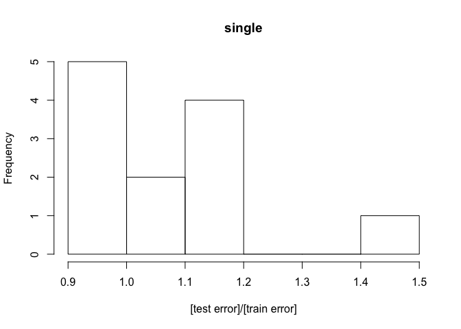

step3
================
Tiam Heydari

### Libraries

``` r
library(pheatmap)
library(reshape2)
library(tidyverse)
```

    ## ── Attaching packages ─────────────────────────────────────────────────────────────────────────────────────────────────────────── tidyverse 1.2.1 ──

    ## ✔ ggplot2 2.2.1     ✔ purrr   0.2.4
    ## ✔ tibble  1.4.2     ✔ dplyr   0.7.4
    ## ✔ tidyr   0.8.0     ✔ stringr 1.3.0
    ## ✔ readr   1.1.1     ✔ forcats 0.3.0

    ## ── Conflicts ────────────────────────────────────────────────────────────────────────────────────────────────────────────── tidyverse_conflicts() ──
    ## ✖ dplyr::filter() masks stats::filter()
    ## ✖ dplyr::lag()    masks stats::lag()

``` r
library(GEOquery)
```

    ## Loading required package: Biobase

    ## Loading required package: BiocGenerics

    ## Loading required package: parallel

    ## 
    ## Attaching package: 'BiocGenerics'

    ## The following objects are masked from 'package:parallel':
    ## 
    ##     clusterApply, clusterApplyLB, clusterCall, clusterEvalQ,
    ##     clusterExport, clusterMap, parApply, parCapply, parLapply,
    ##     parLapplyLB, parRapply, parSapply, parSapplyLB

    ## The following objects are masked from 'package:dplyr':
    ## 
    ##     combine, intersect, setdiff, union

    ## The following objects are masked from 'package:stats':
    ## 
    ##     IQR, mad, sd, var, xtabs

    ## The following objects are masked from 'package:base':
    ## 
    ##     anyDuplicated, append, as.data.frame, cbind, colMeans,
    ##     colnames, colSums, do.call, duplicated, eval, evalq, Filter,
    ##     Find, get, grep, grepl, intersect, is.unsorted, lapply,
    ##     lengths, Map, mapply, match, mget, order, paste, pmax,
    ##     pmax.int, pmin, pmin.int, Position, rank, rbind, Reduce,
    ##     rowMeans, rownames, rowSums, sapply, setdiff, sort, table,
    ##     tapply, union, unique, unsplit, which, which.max, which.min

    ## Welcome to Bioconductor
    ## 
    ##     Vignettes contain introductory material; view with
    ##     'browseVignettes()'. To cite Bioconductor, see
    ##     'citation("Biobase")', and for packages 'citation("pkgname")'.

    ## Setting options('download.file.method.GEOquery'='auto')

    ## Setting options('GEOquery.inmemory.gpl'=FALSE)

``` r
library(RColorBrewer)
library(cluster)
library(pvclust)
library(xtable)
library(limma)
```

    ## 
    ## Attaching package: 'limma'

    ## The following object is masked from 'package:BiocGenerics':
    ## 
    ##     plotMA

``` r
library(dplyr)
library(lattice)
library(RCurl)
```

    ## Loading required package: bitops

    ## 
    ## Attaching package: 'RCurl'

    ## The following object is masked from 'package:tidyr':
    ## 
    ##     complete

``` r
library(GEOquery)
library(knitr)
library(pheatmap)#
library(reshape2)#
library(purrr)
library(Hmisc)
```

    ## Loading required package: survival

    ## Loading required package: Formula

    ## 
    ## Attaching package: 'Hmisc'

    ## The following objects are masked from 'package:xtable':
    ## 
    ##     label, label<-

    ## The following object is masked from 'package:Biobase':
    ## 
    ##     contents

    ## The following objects are masked from 'package:dplyr':
    ## 
    ##     src, summarize

    ## The following objects are masked from 'package:base':
    ## 
    ##     format.pval, units

``` r
library(psych)
```

    ## 
    ## Attaching package: 'psych'

    ## The following object is masked from 'package:Hmisc':
    ## 
    ##     describe

    ## The following objects are masked from 'package:ggplot2':
    ## 
    ##     %+%, alpha

``` r
library(MASS)
```

    ## 
    ## Attaching package: 'MASS'

    ## The following object is masked from 'package:dplyr':
    ## 
    ##     select

``` r
library(DAAG)
```

    ## 
    ## Attaching package: 'DAAG'

    ## The following object is masked from 'package:MASS':
    ## 
    ##     hills

    ## The following object is masked from 'package:psych':
    ## 
    ##     cities

    ## The following object is masked from 'package:survival':
    ## 
    ##     lung

``` r
library(olsrr)
```

    ## 
    ## Attaching package: 'olsrr'

    ## The following object is masked from 'package:MASS':
    ## 
    ##     cement

    ## The following object is masked from 'package:datasets':
    ## 
    ##     rivers

``` r
library(corrplot) # We'll use corrplot later on in this example too.
```

    ## corrplot 0.84 loaded

``` r
#library(rgl)#3D plot not working yet
#library(scatterplot3d)#3D plot not working yet
#library(visreg)
library(glmnet)
```

    ## Loading required package: Matrix

    ## 
    ## Attaching package: 'Matrix'

    ## The following object is masked from 'package:tidyr':
    ## 
    ##     expand

    ## Loading required package: foreach

    ## 
    ## Attaching package: 'foreach'

    ## The following objects are masked from 'package:purrr':
    ## 
    ##     accumulate, when

    ## Loaded glmnet 2.0-13

``` r
 library(lars)
```

    ## Loaded lars 1.2

    ## 
    ## Attaching package: 'lars'

    ## The following object is masked from 'package:psych':
    ## 
    ##     error.bars

``` r
set.seed(123)
```

put all functions here:
=======================

``` r
#-----------------------------------------------------------------
                #plot the correlation between probes, genes ect
                plot_correlation <- function(designated.dataframe.for.specific.gene,number.of.picked.probes){
                plot(designated.dataframe.for.specific.gene[,1:min(number.of.picked.probes,5)], pch=1,main=gene.name)
                #linear.model <-lm(expression~.,data=designated.dataframe.for.specific.gene)
                #summary( linear.model)
                datacor = cor(designated.dataframe.for.specific.gene[1:number.of.picked.probes])
                corrplot(datacor, method = "color",addCoef.col="grey",number.cex= 7/ncol(designated.dataframe.for.specific.gene))
                #quick visualizing data
                auto.sel <- designated.dataframe.for.specific.gene[,1:number.of.picked.probes]
                #plot : distribution , linear , and correlation:
                pairs.panels(auto.sel, col="red")
                }
#-----------------------------------------------------------------
#-----------------------------------------------------------------
#-----------------------------------------------------------------
#-----------------------------------------------------------------
#-----------------------------------------------------------------
#-----------------------------------------------------------------
#-----------------------------------------------------------------
```

1- Here we load the data from a local directoty.
------------------------------------------------

``` r
rawdata<- readRDS("~/Desktop/BIOF/Group project/Step3-multiple regression/cor_test_results_PCA_lapply_V4.rds")

load("~/Desktop/BIOF/Group project/Step3-multiple regression/rosmap_postprocV2.RData")

probes_subjects<- as.data.frame( readRDS("~/Desktop/BIOF/Group project/Step3-multiple regression/probes_subjects_PCA_adjusted_V4.RDS"))

subjects_genes<- as.data.frame(  readRDS("~/Desktop/BIOF/Group project/Step3-multiple regression/subjects_genes_PCA_adjusted_V4.RDS"))
```

``` r
head(rawdata)
```

    ##                          gene      probe    estimate    pvalue
    ## cor  RAB4B:ENSG00000167578.11 cg25697727  0.04075525 0.3724587
    ## cor1 RAB4B:ENSG00000167578.11 cg02686662 -0.01476077 0.7467678
    ## cor2 RAB4B:ENSG00000167578.11 cg14319773  0.04823112 0.2911267
    ## cor3 RAB4B:ENSG00000167578.11 cg05498041 -0.05633210 0.2174921
    ## cor4 RAB4B:ENSG00000167578.11 cg14583103  0.06417159 0.1599679
    ## cor5 RAB4B:ENSG00000167578.11 cg18074151  0.03974841 0.3843954
    ##      adjusted.pvalue
    ## cor        0.9794159
    ## cor1       0.9957041
    ## cor2       0.9728284
    ## cor3       0.9633156
    ## cor4       0.9527597
    ## cor5       0.9801636

``` r
head(subjects_genes)
```

    ##          RAB4B:ENSG00000167578.11 ZNF708:ENSG00000182141.4
    ## 10101327              -0.02892608             0.0471578596
    ## 10101589               0.09960465            -0.2032808981
    ## 10202345              -0.16541889            -0.0004044653
    ## 10203224              -0.03413898            -0.0753546650
    ## 10205244              -0.02284861            -0.0137480978
    ## 10208143               0.03986186             0.0789018885
    ##          RAD23A:ENSG00000179262.4 ARFGAP1:ENSG00000101199.8
    ## 10101327              -0.10683189                0.07519224
    ## 10101589              -0.16172610                0.15317211
    ## 10202345               0.04192914               -0.03735308
    ## 10203224               0.13902743                0.04949363
    ## 10205244              -0.02435662               -0.09659549
    ## 10208143               0.19871261                0.04028222
    ##          CTSA:ENSG00000064601.11 TMEM143:ENSG00000161558.5
    ## 10101327            -0.002433015               -0.06059698
    ## 10101589             0.013500125                0.07592142
    ## 10202345            -0.009005636               -0.04112134
    ## 10203224            -0.138773719               -0.23095309
    ## 10205244             0.063002123                0.14076716
    ## 10208143             0.041297363               -0.07096652
    ##          RTN2:ENSG00000125744.7 BCL3:ENSG00000069399.8
    ## 10101327             0.04160804            -0.03951507
    ## 10101589             0.00942011            -0.36308023
    ## 10202345            -0.07605100             0.02508921
    ## 10203224            -0.02685212             0.53837208
    ## 10205244            -0.19677342             0.15715994
    ## 10208143             0.03501754             0.09075186
    ##          ZNF781:ENSG00000196381.5 TH1L:ENSG00000101158.7
    ## 10101327               0.05607076             0.08178244
    ## 10101589               0.10207629            -0.12264881
    ## 10202345               0.15393961            -0.08195491
    ## 10203224              -0.46751570            -0.09698632
    ## 10205244               0.36994119             0.07240260
    ## 10208143              -0.20727242             0.07104184
    ##          MAP2K7:ENSG00000076984.12 RP4-697K14.7:ENSG00000130589.11
    ## 10101327                0.09443496                    -0.007412854
    ## 10101589                0.07177981                    -0.291984580
    ## 10202345               -0.11944333                    -0.019835699
    ## 10203224                0.15790831                    -0.175665117
    ## 10205244                0.01690643                    -0.056944532
    ## 10208143               -0.04627398                     0.092859771
    ##          VRK3:ENSG00000105053.5 AP5S1:ENSG00000125843.6
    ## 10101327            0.006185652              0.08466628
    ## 10101589           -0.274232408             -0.13970805
    ## 10202345            0.332354009             -0.26403161
    ## 10203224           -0.067544166             -0.08950154
    ## 10205244            0.096698897             -0.07386333
    ## 10208143            0.075841752              0.02706732
    ##          RP1-269M15.3:ENSG00000233508.1 TNNT1:ENSG00000105048.11
    ## 10101327                    -0.06162687               0.52337007
    ## 10101589                    -0.10096713              -0.21157686
    ## 10202345                     0.40950093               0.50880134
    ## 10203224                    -0.20507830               0.29994172
    ## 10205244                    -0.08696784               0.04792895
    ## 10208143                    -0.08552182              -0.38707066
    ##          FAM217B:ENSG00000196227.6 IL27RA:ENSG00000104998.2
    ## 10101327                0.06108524             -0.010836891
    ## 10101589                0.14263316             -0.241927552
    ## 10202345               -0.01734590             -0.310199066
    ## 10203224               -0.12093155             -0.193074936
    ## 10205244               -0.05212727              0.224296507
    ## 10208143               -0.02852758             -0.009188705
    ##          SHKBP1:ENSG00000160410.9 PLIN4:ENSG00000167676.3
    ## 10101327             -0.005874056              0.20281151
    ## 10101589              0.199048990              0.05263126
    ## 10202345             -0.026565029             -0.35393693
    ## 10203224             -0.256976127             -0.16900384
    ## 10205244              0.119623369             -0.03661874
    ## 10208143              0.104360151             -0.25754852
    ##          PES1:ENSG00000100029.12 CYP2D6:ENSG00000100197.16
    ## 10101327              0.06074545                 0.2228108
    ## 10101589              0.27067108                -0.6637924
    ## 10202345             -0.02646209                -1.0669033
    ## 10203224             -0.09861177                 0.1102482
    ## 10205244              0.03881105                 0.6045423
    ## 10208143              0.02962037                -0.5323568
    ##          ZBTB45:ENSG00000119574.7 RCN3:ENSG00000142552.2
    ## 10101327               0.04665256             0.04901434
    ## 10101589              -0.07427590             0.11893241
    ## 10202345               0.05551954             0.11606999
    ## 10203224               0.04324699            -0.11570003
    ## 10205244               0.03308915            -0.23460340
    ## 10208143               0.19748154             0.14113536
    ##          ZNF667:ENSG00000198046.7 RNF24:ENSG00000101236.11
    ## 10101327              -0.02704349             -0.000832377
    ## 10101589              -0.08246229              0.096656489
    ## 10202345               0.19192089              0.001576230
    ## 10203224               0.19744678              0.083576659
    ## 10205244              -0.04517212              0.118844589
    ## 10208143              -0.01804597             -0.005904800
    ##          LSR:ENSG00000105699.9 RP11-465L10.7:ENSG00000240742.1
    ## 10101327           -0.27426965                     -0.78736044
    ## 10101589           -0.06893956                      0.36759602
    ## 10202345           -0.21479159                      0.28062439
    ## 10203224           -0.24013741                      0.07176033
    ## 10205244           -0.16551953                      0.20959156
    ## 10208143           -0.17744589                      0.05727420
    ##          PCBP3:ENSG00000183570.10 USP18:ENSG00000184979.9
    ## 10101327              0.034932471              0.03841844
    ## 10101589              0.371539997             -0.39491985
    ## 10202345              0.033078828              0.04405805
    ## 10203224              0.288687365              0.06620686
    ## 10205244              0.002201417              0.05710063
    ## 10208143              0.301280787              0.28163083
    ##          ZCCHC3:ENSG00000177764.6 TMEM86B:ENSG00000180089.4
    ## 10101327              -0.01800285                -0.1093005
    ## 10101589               0.29900828                -0.1375619
    ## 10202345              -0.20429699                -0.1096763
    ## 10203224               0.32662788                -0.0201958
    ## 10205244               0.02873791                -0.2048009
    ## 10208143              -0.03116019                -0.1170822
    ##          C21orf119:ENSG00000256073.1 EML2:ENSG00000125746.10
    ## 10101327                 -0.12415339           -0.0130883484
    ## 10101589                  0.24389491           -0.1029744590
    ## 10202345                 -0.01968917           -0.0229272443
    ## 10203224                  0.13077339           -0.1058032998
    ## 10205244                  0.03378713            0.0300467500
    ## 10208143                 -0.29769425            0.0003122452
    ##          PRPF31:ENSG00000105618.9 ANKRD27:ENSG00000105186.8
    ## 10101327              -0.05382072               -0.09078486
    ## 10101589              -0.05082162               -0.06432503
    ## 10202345              -0.03340336                0.06608811
    ## 10203224              -0.02911972                0.05301115
    ## 10205244               0.05988943                0.03077910
    ## 10208143               0.08873510               -0.02275417
    ##          ZNF566:ENSG00000186017.10 SYNJ1:ENSG00000159082.12
    ## 10101327                0.12473703             -0.004181205
    ## 10101589                0.14349462             -0.029926912
    ## 10202345               -0.02955563             -0.055661175
    ## 10203224               -0.20414266              0.132681217
    ## 10205244                0.09028559             -0.073608583
    ## 10208143               -0.24060347             -0.050570261
    ##          BLCAP:ENSG00000166619.7 LINC00662:ENSG00000261824.2
    ## 10101327              0.11907532                0.1256005283
    ## 10101589             -0.02243779               -0.1882886200
    ## 10202345              0.03384889               -0.0000663266
    ## 10203224             -0.04329449                0.2934406443
    ## 10205244             -0.07515245                0.0880965482
    ## 10208143             -0.01735568               -0.0594942098
    ##          SUGP1:ENSG00000105705.9 PPARA:ENSG00000186951.12
    ## 10101327             -0.06143747               0.22691821
    ## 10101589             -0.11818547              -0.02335392
    ## 10202345             -0.10523518              -0.14982930
    ## 10203224             -0.14427384              -0.27323619
    ## 10205244             -0.10710563               0.00108564
    ## 10208143              0.04319248               0.09537951
    ##          PCMTD2:ENSG00000203880.6 RBM12:ENSG00000244462.3
    ## 10101327               0.06921736             -0.16545115
    ## 10101589               0.32085603             -0.21687924
    ## 10202345              -0.10471162             -0.18036305
    ## 10203224              -0.03593043              0.05587697
    ## 10205244               0.04321185              0.03982830
    ## 10208143               0.02023067              0.08046962
    ##          TTLL1:ENSG00000100271.11 SBNO2:ENSG00000064932.11
    ## 10101327              0.097933866              0.105688940
    ## 10101589             -0.045961135             -0.031245107
    ## 10202345             -0.555472121             -0.001765612
    ## 10203224              0.127774447              0.283783723
    ## 10205244              0.001878434              0.077836647
    ## 10208143              0.120870245             -0.048608235
    ##          HAUS5:ENSG00000249115.3 PHACTR3:ENSG00000087495.12
    ## 10101327              0.20753064                -0.03609230
    ## 10101589             -0.06593426                -0.08415811
    ## 10202345             -0.14468224                -0.16201563
    ## 10203224              0.08690772                -0.02784066
    ## 10205244             -0.09699977                -0.12213650
    ## 10208143              0.03002293                -0.16715519
    ##          RASD2:ENSG00000100302.6 NCAPH2:ENSG00000025770.13
    ## 10101327            -0.051197224                0.12221298
    ## 10101589             0.032957350                0.27183521
    ## 10202345            -0.118277895               -0.13087844
    ## 10203224             0.008262334                0.21676826
    ## 10205244            -0.061748093               -0.05585870
    ## 10208143            -0.117634177                0.01545775
    ##          FXYD3:ENSG00000089356.11 C19orf73:ENSG00000221916.2
    ## 10101327               -0.2843707                -0.26702369
    ## 10101589                0.1238444                 0.25744358
    ## 10202345               -0.2419986                 0.10644181
    ## 10203224                0.2153323                -0.18346938
    ## 10205244               -0.5944624                -0.11052650
    ## 10208143               -0.3128780                -0.07158307
    ##          ZNF880:ENSG00000221923.3 APOL2:ENSG00000128335.9
    ## 10101327              -0.06773059              0.21314975
    ## 10101589              -0.13042736             -0.11265111
    ## 10202345               0.04227845              0.24998481
    ## 10203224              -0.37621877             -0.08144565
    ## 10205244              -0.21679329              0.08670099
    ## 10208143               0.07906292              0.02056853
    ##          RTEL1-TNFRSF6B:ENSG00000026036.16 CACNG2:ENSG00000166862.6
    ## 10101327                        0.18147136              0.263047143
    ## 10101589                       -0.02534392              0.142560229
    ## 10202345                       -0.01514423              0.001883417
    ## 10203224                       -0.13421776             -0.159345306
    ## 10205244                       -0.26437802              0.118588849
    ## 10208143                       -0.16753729             -0.117544877
    ##          ZNF700:ENSG00000196757.2 STRN4:ENSG00000090372.7
    ## 10101327               0.07371991            -0.008298329
    ## 10101589               0.26510063             0.027222414
    ## 10202345              -0.06179573            -0.001482421
    ## 10203224              -0.08294779            -0.037254284
    ## 10205244              -0.06295348            -0.017610006
    ## 10208143              -0.07610192            -0.189003526
    ##          AC012615.1:ENSG00000198683.2 ZC3H4:ENSG00000130749.4
    ## 10101327                   0.08418941             -0.04636067
    ## 10101589                   0.09999255             -0.04666213
    ## 10202345                   0.32074427             -0.23519369
    ## 10203224                  -0.24202293             -0.05243503
    ## 10205244                   0.39671801             -0.11155792
    ## 10208143                   0.05035974             -0.09916666
    ##          ZFP28:ENSG00000196867.2 UBE2V1:ENSG00000244687.6
    ## 10101327             0.124014638               0.03105111
    ## 10101589            -0.004738078              -0.02756138
    ## 10202345             0.083693329              -0.13528598
    ## 10203224             0.213670757              -0.11543481
    ## 10205244            -0.114086951               0.13435624
    ## 10208143             0.078624980              -0.01345695
    ##          TNRC6B:ENSG00000100354.15 RASSF2:ENSG00000101265.10
    ## 10101327                0.09494916               -0.41750261
    ## 10101589                0.22000350                0.16946670
    ## 10202345               -0.08900779                0.33429220
    ## 10203224               -0.01539893               -0.03408719
    ## 10205244               -0.12212111               -0.01806623
    ## 10208143               -0.04906325               -0.03722736
    ##          AGPAT3:ENSG00000160216.13 KLF16:ENSG00000129911.4
    ## 10101327                0.17089862             -0.05147389
    ## 10101589               -0.02442878              0.03214572
    ## 10202345                0.09917398             -0.05706000
    ## 10203224                0.05367794             -0.05757341
    ## 10205244               -0.01791829              0.29157505
    ## 10208143                0.07017313             -0.11502603
    ##          DYRK1B:ENSG00000105204.8 SRRD:ENSG00000100104.7
    ## 10101327              -0.03925122             0.01968873
    ## 10101589               0.04809185            -0.29229446
    ## 10202345              -0.13803347            -0.09554055
    ## 10203224               0.02092274             0.14726079
    ## 10205244               0.04250476             0.16061573
    ## 10208143              -0.17485908             0.16590352
    ##          MAPRE1:ENSG00000101367.8 PKIG:ENSG00000168734.9
    ## 10101327               0.12145942             0.05288291
    ## 10101589              -0.12540045            -0.21545646
    ## 10202345              -0.01763650             0.05534347
    ## 10203224               0.21217702             0.07535483
    ## 10205244               0.10092529            -0.06006820
    ## 10208143              -0.09246212             0.07782265
    ##          CSDC2:ENSG00000172346.9 RIN2:ENSG00000132669.8
    ## 10101327               0.2731127              0.0821636
    ## 10101589               0.8831117             -0.1036068
    ## 10202345              -0.2189423             -0.2228459
    ## 10203224               0.7595522              0.1062663
    ## 10205244              -0.4182890             -0.1923061
    ## 10208143               0.7369337             -0.1293887
    ##          ATP6V1E1:ENSG00000131100.8 SIRT6:ENSG00000077463.9
    ## 10101327                0.004447700             -0.12378726
    ## 10101589               -0.006270217             -0.03659966
    ## 10202345               -0.140437581              0.03694818
    ## 10203224               -0.114369730              0.42471222
    ## 10205244               -0.115384778             -0.13179669
    ## 10208143                0.066348956              0.11029905
    ##          ILF3:ENSG00000129351.13 LIPE:ENSG00000079435.4
    ## 10101327              0.07786092           -0.021096840
    ## 10101589              0.17903638           -0.193795436
    ## 10202345             -0.01994249            0.104162737
    ## 10203224             -0.01216282            0.066990476
    ## 10205244             -0.04511933            0.009771856
    ## 10208143              0.14876922            0.167314890
    ##          C20orf112:ENSG00000197183.8 ZNF329:ENSG00000181894.9
    ## 10101327                 -0.03689173              -0.05198799
    ## 10101589                  0.04212778              -0.06072401
    ## 10202345                 -0.19174535              -0.05227872
    ## 10203224                 -0.09937129              -0.11383628
    ## 10205244                 -0.04542308              -0.08942520
    ## 10208143                 -0.04816194              -0.23955834
    ##          CTC-435M10.3:ENSG00000255730.1 SIRT2:ENSG00000068903.15
    ## 10101327                     0.49533216             -0.009779529
    ## 10101589                     1.03765524              0.017137373
    ## 10202345                     0.24909130             -0.009339135
    ## 10203224                     0.91038722             -0.133001983
    ## 10205244                     0.24106695              0.027393170
    ## 10208143                     0.06002931             -0.017163338
    ##          CELF5:ENSG00000161082.8 NAT14:ENSG00000090971.4
    ## 10101327              0.06255697            -0.039689412
    ## 10101589              0.08918783             0.038583914
    ## 10202345             -0.13192090             0.003705936
    ## 10203224             -0.01719147             0.077603252
    ## 10205244              0.07198550            -0.067802326
    ## 10208143             -0.18473270            -0.013212219
    ##          KLK6:ENSG00000167755.8 OPA3:ENSG00000125741.4
    ## 10101327              0.1838094           0.0491939570
    ## 10101589              0.1292798          -0.0399914664
    ## 10202345              0.2396209          -0.0009081119
    ## 10203224              0.1200653           0.0710431513
    ## 10205244              0.0593341           0.0637031156
    ## 10208143             -0.2183932           0.1514202582
    ##          CCNE1:ENSG00000105173.9 JAM2:ENSG00000154721.9
    ## 10101327              0.06109999             0.23244766
    ## 10101589              0.15206844             0.27476189
    ## 10202345              0.01005732            -0.27692634
    ## 10203224             -0.04109631            -0.09630570
    ## 10205244             -0.41159852            -0.05215080
    ## 10208143             -0.07801613            -0.02991943
    ##          CCDC124:ENSG00000007080.5 BX322557.10:ENSG00000215447.3
    ## 10101327               -0.05611904                    -0.6460271
    ## 10101589                0.06543505                    -0.2376679
    ## 10202345               -0.17099375                    -0.1649318
    ## 10203224               -0.10588773                    -0.2632718
    ## 10205244               -0.03834461                     0.3427633
    ## 10208143               -0.08168139                     0.3227122
    ##          PRAM1:ENSG00000133246.6 PIK3IP1:ENSG00000100100.8
    ## 10101327             -0.12345547                0.13452307
    ## 10101589             -0.14005747               -0.12470759
    ## 10202345             -0.01776731               -0.19903073
    ## 10203224             -0.01664410                0.02001208
    ## 10205244              0.05689875                0.42755869
    ## 10208143             -0.04603967               -0.45480349
    ##          MED26:ENSG00000105085.5 CDH4:ENSG00000179242.10
    ## 10101327             -0.02625827            -0.104887588
    ## 10101589             -0.02209201            -0.001528735
    ## 10202345              0.04795831            -0.175739609
    ## 10203224             -0.04998521            -0.114406959
    ## 10205244             -0.10239069             0.128559049
    ## 10208143             -0.05843261             0.014943800
    ##          C22orf29:ENSG00000215012.4 PRR14L:ENSG00000183530.9
    ## 10101327                0.027999402               0.05181212
    ## 10101589               -0.008930203              -0.01859793
    ## 10202345                0.133111576               0.02550953
    ## 10203224                0.069509600              -0.14138270
    ## 10205244               -0.091979435               0.02901363
    ## 10208143               -0.027300850               0.02835962
    ##          NFS1:ENSG00000244005.6 PPM1F:ENSG00000100034.9
    ## 10101327             0.08998681              0.01744321
    ## 10101589            -0.19271407             -0.11219377
    ## 10202345            -0.11202376             -0.01616345
    ## 10203224             0.07223681             -0.07777308
    ## 10205244             0.09975972              0.04942112
    ## 10208143            -0.07433490             -0.01347383
    ##          NRSN2:ENSG00000125841.7 FAM98C:ENSG00000130244.8
    ## 10101327             0.137994700               0.02212944
    ## 10101589            -0.184769271              -0.37121393
    ## 10202345             0.147686897               0.19362760
    ## 10203224            -0.033735984               0.04101349
    ## 10205244            -0.087481698               0.02054946
    ## 10208143             0.000976835              -0.06159226
    ##          CDC37:ENSG00000105401.2 LAMP5:ENSG00000125869.4
    ## 10101327              0.04537100              0.07765203
    ## 10101589              0.07251390             -0.01275618
    ## 10202345             -0.05670723             -0.35468400
    ## 10203224              0.07351722             -0.25265773
    ## 10205244              0.01502689              0.40549768
    ## 10208143             -0.02440220              0.13845235
    ##          RP5-1119A7.17:ENSG00000261675.1 ZHX3:ENSG00000174306.15
    ## 10101327                      0.17246862              0.03259784
    ## 10101589                      0.03050489              0.13709664
    ## 10202345                      0.01515313              0.28923009
    ## 10203224                     -0.20375236             -0.08328114
    ## 10205244                      0.07948480             -0.34339138
    ## 10208143                     -0.04144663             -0.06719058
    ##          ADRM1:ENSG00000130706.8 CTB-50L17.10:ENSG00000167674.9
    ## 10101327             -0.05844704                     0.12834326
    ## 10101589             -0.05675801                    -0.08194674
    ## 10202345             -0.02701428                    -0.05628514
    ## 10203224              0.06485802                    -0.11315058
    ## 10205244             -0.06109732                    -0.02881548
    ## 10208143              0.14085008                    -0.18670581
    ##          MADCAM1:ENSG00000099866.9 MORC2:ENSG00000133422.7
    ## 10101327              -0.009047114             -0.16352596
    ## 10101589               0.174899082              0.34834430
    ## 10202345               0.117032671             -0.01926525
    ## 10203224              -0.021770510             -0.15052163
    ## 10205244              -0.197889080              0.09444584
    ## 10208143              -0.029048429              0.05571643
    ##          ZNF776:ENSG00000152443.8 MAG:ENSG00000105695.9
    ## 10101327             -0.036576376            0.19024475
    ## 10101589             -0.030747680           -0.34932191
    ## 10202345             -0.107816773            0.07291089
    ## 10203224             -0.069010666            0.05307006
    ## 10205244             -0.007575142            0.05701691
    ## 10208143             -0.239899392            0.22181812
    ##          CDC25B:ENSG00000101224.13 LPHN1:ENSG00000072071.12
    ## 10101327                0.04678671               0.09389421
    ## 10101589                0.06562958               0.16989804
    ## 10202345                0.12146593              -0.02579478
    ## 10203224               -0.25610944              -0.09462834
    ## 10205244               -0.02412608              -0.01366034
    ## 10208143                0.01693896              -0.09355819
    ##          TSPY26P:ENSG00000235217.5 EIF3D:ENSG00000100353.13
    ## 10101327               0.043489071               0.00648631
    ## 10101589               0.005302178              -0.18048154
    ## 10202345              -0.171895265               0.20140428
    ## 10203224              -0.003503076              -0.03535769
    ## 10205244              -0.015917295               0.05345201
    ## 10208143               0.111560599              -0.08700442
    ##          THAP8:ENSG00000161277.7 MRPS12:ENSG00000128626.6
    ## 10101327             0.018195341               0.18516586
    ## 10101589            -0.009572804               0.14783149
    ## 10202345             0.097817123              -0.05841395
    ## 10203224            -0.073613209              -0.22004792
    ## 10205244             0.196054130               0.03886500
    ## 10208143             0.066962564              -0.01943166
    ##          MCAT:ENSG00000100294.7 PET117:ENSG00000232838.2
    ## 10101327             0.15248352               0.40301933
    ## 10101589             0.10360994              -0.11656849
    ## 10202345             0.01921581              -0.42723904
    ## 10203224             0.07066612              -0.31898567
    ## 10205244             0.03857148               0.04573535
    ## 10208143             0.25241242              -0.26452871
    ##          DESI1:ENSG00000100418.7 UCKL1:ENSG00000198276.8
    ## 10101327            0.1154218850             0.169791787
    ## 10101589            0.0001821672            -0.106513209
    ## 10202345           -0.0113621633             0.020756190
    ## 10203224           -0.0149213936            -0.002330633
    ## 10205244           -0.0118182621            -0.036775284
    ## 10208143            0.0655031409            -0.098899346
    ##          ZSCAN5A:ENSG00000131848.5 ZNF415:ENSG00000170954.6
    ## 10101327              -0.039224078            -0.0122497155
    ## 10101589               0.405074437             0.1625522224
    ## 10202345               0.005137995             0.1766832306
    ## 10203224              -0.186802769             0.1607590260
    ## 10205244              -0.243882239             0.0009081907
    ## 10208143               0.042461318            -0.0910504263
    ##          IRGQ:ENSG00000167378.3 MLC1:ENSG00000100427.11
    ## 10101327             0.10783479              0.27435920
    ## 10101589            -0.06998743              0.11148929
    ## 10202345             0.07263011             -0.12094711
    ## 10203224             0.01268043             -0.01467621
    ## 10205244            -0.04183255              0.10191430
    ## 10208143             0.01793600              0.10798024
    ##          BRD1:ENSG00000100425.14 TBC1D22A:ENSG00000054611.9
    ## 10101327              -0.1378575               -0.049110993
    ## 10101589               0.1011864               -0.066519311
    ## 10202345              -0.0645766               -0.101438515
    ## 10203224               0.1142116               -0.002127071
    ## 10205244              -0.1334333               -0.003180986
    ## 10208143              -0.1312957                0.110301249
    ##          IL17RA:ENSG00000177663.8 ZNF583:ENSG00000198440.4
    ## 10101327               0.01657100               0.03611775
    ## 10101589              -0.16265969               0.02526705
    ## 10202345               0.13077540               0.13702934
    ## 10203224               0.03705566               0.34229422
    ## 10205244               0.17189430              -0.19020367
    ## 10208143              -0.15270387              -0.06176793
    ##          BLVRB:ENSG00000090013.4 ZNF585A:ENSG00000196967.5
    ## 10101327              0.11690875                0.32350251
    ## 10101589              0.15502099                0.07665284
    ## 10202345              0.04278799               -0.28280885
    ## 10203224             -0.17354696                0.11247525
    ## 10205244             -0.11080425                0.06171672
    ## 10208143              0.01368066                0.06355746
    ##          SCARF2:ENSG00000244486.3 PI4KA:ENSG00000241973.6
    ## 10101327               0.03387974              0.10787998
    ## 10101589               0.12506954              0.08823868
    ## 10202345               0.18872713              0.04519959
    ## 10203224              -0.04371627             -0.13379615
    ## 10205244              -0.09731405             -0.06772676
    ## 10208143              -0.08811523             -0.09021551
    ##          C2CD2:ENSG00000157617.12 ADNP:ENSG00000101126.9
    ## 10101327              -0.19297001           -0.030481871
    ## 10101589               0.18245552            0.071993207
    ## 10202345               0.19380423           -0.064190844
    ## 10203224              -0.11613804            0.011192707
    ## 10205244               0.17653174            0.008825161
    ## 10208143               0.08849877           -0.050964414
    ##          ARHGAP33:ENSG00000004777.11 ZNFX1-AS1:ENSG00000177410.8
    ## 10101327                  0.08127440                 -0.08817353
    ## 10101589                 -0.01052096                  0.20952555
    ## 10202345                  0.01084289                 -0.25793773
    ## 10203224                  0.05286418                  0.09626491
    ## 10205244                  0.03144389                  0.09423950
    ## 10208143                  0.00623145                 -0.26299168
    ##          YTHDF1:ENSG00000149658.13 CHD6:ENSG00000124177.10
    ## 10101327               -0.06820262             0.265481472
    ## 10101589               -0.10377008            -0.068721945
    ## 10202345                0.16248351            -0.005284526
    ## 10203224               -0.18492466             0.027229368
    ## 10205244               -0.15760956             0.104552041
    ## 10208143                0.07507445            -0.356456241
    ##          ZNF573:ENSG00000189144.8 C19orf53:ENSG00000104979.4
    ## 10101327               0.02898208                 0.07927797
    ## 10101589              -0.09660402                -0.11949507
    ## 10202345               0.53781038                 0.23072701
    ## 10203224              -0.38854078                 0.01883035
    ## 10205244               0.08156605                -0.18641584
    ## 10208143               0.31993644                 0.05014482
    ##          DBNDD2:ENSG00000244274.3 GNG7:ENSG00000176533.8
    ## 10101327             0.0003249367            -0.08825806
    ## 10101589            -0.2219039128             0.18460954
    ## 10202345            -0.0541668600             0.09244740
    ## 10203224            -0.2124494857            -0.19862849
    ## 10205244             0.1093778332             0.01589233
    ## 10208143             0.0742551166            -0.03636165
    ##          ZNF528:ENSG00000167555.8 TYMP:ENSG00000025708.8
    ## 10101327             -0.211867646             -0.1628663
    ## 10101589              0.132603185             -0.6184958
    ## 10202345             -0.009569425             -0.0658493
    ## 10203224              0.382901126              0.0766001
    ## 10205244             -0.233011242             -0.0888203
    ## 10208143             -0.421745697              0.2834574
    ##          SIGLEC10:ENSG00000142512.9 TRMU:ENSG00000100416.8
    ## 10101327                 0.06018918            -0.04134307
    ## 10101589                -0.03416936             0.04207840
    ## 10202345                -0.22603497             0.15912014
    ## 10203224                -0.11824528            -0.09393135
    ## 10205244                 0.23265087            -0.02997384
    ## 10208143                -0.07175699             0.01965369
    ##          CAPS:ENSG00000105519.7 GEMIN7:ENSG00000142252.6
    ## 10101327            -0.13825261              -0.01805373
    ## 10101589            -0.31133782               0.23153889
    ## 10202345             0.78724582               0.10665343
    ## 10203224             0.01115555              -0.03099445
    ## 10205244             0.26897113              -0.07345928
    ## 10208143            -0.41936963              -0.14492401
    ##          ZNF8:ENSG00000083842.8 PTPRA:ENSG00000132670.15
    ## 10101327             0.18868033              -0.03200361
    ## 10101589            -0.15309675               0.08578818
    ## 10202345            -0.13530129               0.03687692
    ## 10203224            -0.02571636               0.05559671
    ## 10205244             0.02019833              -0.06464775
    ## 10208143            -0.23918127               0.15562596
    ##          CERS1:ENSG00000223802.2 CACTIN:ENSG00000105298.9
    ## 10101327              0.11938258              -0.05002220
    ## 10101589              0.30281514              -0.06418800
    ## 10202345              0.18485472               0.06583603
    ## 10203224             -0.11549596               0.15207411
    ## 10205244             -0.06835757              -0.12883782
    ## 10208143              0.08896572               0.11848322
    ##          TIAM1:ENSG00000156299.7 SLC52A3:ENSG00000101276.10
    ## 10101327             -0.06558735                 0.02094846
    ## 10101589              0.23382509                -0.13013440
    ## 10202345              0.09222393                 0.05945244
    ## 10203224             -0.27255869                 0.15862850
    ## 10205244             -0.19615971                 0.28022142
    ## 10208143             -0.21488113                -0.10216058
    ##          RBM38:ENSG00000132819.12 SPPL2B:ENSG00000005206.10
    ## 10101327               0.00881925               -0.07701053
    ## 10101589               0.01371456                0.06700750
    ## 10202345               0.15371094                0.08951324
    ## 10203224               0.05346160                0.12083450
    ## 10205244              -0.05780079               -0.01143022
    ## 10208143              -0.09097348                0.05381959
    ##          C22orf25:ENSG00000183597.11 RAE1:ENSG00000101146.8
    ## 10101327                 -0.06920653             0.01912538
    ## 10101589                 -0.02347397             0.07834130
    ## 10202345                  0.07504334             0.02770926
    ## 10203224                 -0.15874102            -0.14799831
    ## 10205244                 -0.21035120             0.07149881
    ## 10208143                 -0.06599667             0.07859790
    ##          TRMT6:ENSG00000089195.10 SNAP25:ENSG00000132639.8
    ## 10101327               0.15407496               0.05626020
    ## 10101589              -0.10318401              -0.05883289
    ## 10202345              -0.01001104              -0.03993852
    ## 10203224               0.33668293               0.39343214
    ## 10205244              -0.03910107              -0.08844537
    ## 10208143              -0.02557536               0.02548956
    ##          SUN2:ENSG00000100242.11 RNF126:ENSG00000070423.12
    ## 10101327              0.10857534              -0.013173869
    ## 10101589             -0.02621412              -0.004790884
    ## 10202345             -0.37796102               0.012140941
    ## 10203224             -0.03022562              -0.053606287
    ## 10205244             -0.09808845               0.051305150
    ## 10208143             -0.06896429               0.079171143
    ##          AP2S1:ENSG00000042753.6 HOMER3:ENSG00000051128.13
    ## 10101327              0.07027854               -0.17293097
    ## 10101589              0.04620343                0.07938036
    ## 10202345             -0.19082370                0.03956156
    ## 10203224             -0.06947990               -0.12577745
    ## 10205244             -0.14011907                0.09321289
    ## 10208143              0.07470509               -0.03378199
    ##          C19orf60:ENSG00000006015.12 EIF4ENIF1:ENSG00000184708.12
    ## 10101327                  0.08448144                  -0.05228989
    ## 10101589                 -0.30944328                   0.11572266
    ## 10202345                  0.02777589                  -0.11122035
    ## 10203224                  0.11978006                  -0.19254100
    ## 10205244                 -0.03146778                  -0.02497363
    ## 10208143                  0.24953783                  -0.11671258
    ##          ZNF211:ENSG00000121417.9 NSFL1C:ENSG00000088833.11
    ## 10101327              -0.13092244                0.00072654
    ## 10101589              -0.16216489               -0.08772833
    ## 10202345              -0.06211441                0.08783552
    ## 10203224              -0.01351226                0.06152977
    ## 10205244              -0.14987362                0.04179688
    ## 10208143              -0.05615918                0.10786170
    ##          TMEM161A:ENSG00000064545.9 DSN1:ENSG00000149636.10
    ## 10101327                 0.10148789              0.08154199
    ## 10101589                -0.17889200             -0.12138978
    ## 10202345                -0.12093612             -0.08868859
    ## 10203224                 0.01361718              0.25697536
    ## 10205244                 0.19258229              0.05699285
    ## 10208143                 0.02716414              0.02389134
    ##          ATP5O:ENSG00000241837.2 ZNF577:ENSG00000161551.8
    ## 10101327              0.08355125              -0.21812764
    ## 10101589             -0.02887166              -0.10535870
    ## 10202345              0.05688544              -0.19990155
    ## 10203224             -0.09488200               0.06041665
    ## 10205244             -0.02516604              -0.32522161
    ## 10208143              0.08809386               0.47020788
    ##          LRRC4B:ENSG00000131409.7 TUBB4A:ENSG00000104833.5
    ## 10101327               0.03528530             -0.027779223
    ## 10101589               0.20127448              0.260076067
    ## 10202345              -0.05245398             -0.007250437
    ## 10203224               0.03697130             -0.222008486
    ## 10205244              -0.12708548              0.105196192
    ## 10208143               0.13685665             -0.028654231
    ##          ECH1:ENSG00000104823.3 NFKBID:ENSG00000167604.8
    ## 10101327            -0.05071861               0.05892291
    ## 10101589            -0.15795974               0.17854175
    ## 10202345            -0.08042908               0.08992411
    ## 10203224            -0.14840231              -0.10661305
    ## 10205244             0.02517904              -0.02069318
    ## 10208143             0.02765156              -0.14827038
    ##          EBI3:ENSG00000105246.4 NXT1:ENSG00000132661.3
    ## 10101327            0.105939118            -0.29024507
    ## 10101589           -0.053666586            -0.12873072
    ## 10202345           -0.002986231             0.05678343
    ## 10203224           -0.022807459             0.15046585
    ## 10205244           -0.250280381            -0.02314439
    ## 10208143            0.295590533             0.11092692
    ##          GNA11:ENSG00000088256.4 ZNF324B:ENSG00000249471.2
    ## 10101327             0.033469901               -0.05850849
    ## 10101589            -0.042830340               -0.20444236
    ## 10202345             0.096796213               -0.06334266
    ## 10203224             0.159278480                0.15704301
    ## 10205244            -0.003666508               -0.08802960
    ## 10208143            -0.145687791               -0.08150259
    ##          CTD-3184A7.4:ENSG00000232442.1 ZNF574:ENSG00000105732.8
    ## 10101327                  -0.0013050602             -0.134754302
    ## 10101589                  -0.3379735741              0.070975390
    ## 10202345                   0.1009332086             -0.045181506
    ## 10203224                  -0.1210170517             -0.006111168
    ## 10205244                  -0.1589191416             -0.089642796
    ## 10208143                   0.0004208877              0.092171252
    ##          SEPT5:ENSG00000184702.13 C3:ENSG00000125730.10
    ## 10101327               0.13881176             0.3458690
    ## 10101589              -0.13441795             0.3776102
    ## 10202345              -0.11544744            -0.1916196
    ## 10203224              -0.27449872            -0.1810575
    ## 10205244               0.03413922            -0.2971621
    ## 10208143               0.12352558             0.3320085
    ##          PIAS4:ENSG00000105229.1 RAB3A:ENSG00000105649.3
    ## 10101327              0.02619655             0.027781700
    ## 10101589              0.03818849            -0.007255129
    ## 10202345             -0.06497813            -0.036922785
    ## 10203224              0.06230298             0.027099082
    ## 10205244              0.04812240            -0.085253930
    ## 10208143             -0.04862692            -0.026730318
    ##          ZNF540:ENSG00000171817.12 TMEM160:ENSG00000130748.5
    ## 10101327               -0.09071576               0.008733144
    ## 10101589                0.09893498              -0.159988594
    ## 10202345               -0.01530212              -0.294378487
    ## 10203224               -0.12562761              -0.069807135
    ## 10205244               -0.03666569              -0.170029290
    ## 10208143               -0.04540900              -0.105054670
    ##          NEURL2:ENSG00000124257.6 DLL3:ENSG00000090932.5
    ## 10101327              -0.24984649             0.10828217
    ## 10101589              -0.11440396             0.06094895
    ## 10202345               0.10665342             0.21267353
    ## 10203224              -0.10021930            -0.10307933
    ## 10205244              -0.12943574            -0.03322232
    ## 10208143              -0.06085432            -0.08405585
    ##          MRPL40:ENSG00000185608.4 ILF3-AS1:ENSG00000267100.1
    ## 10101327              0.020878159                -0.04738841
    ## 10101589              0.031232548                -0.10716831
    ## 10202345             -0.078423882                 0.03391236
    ## 10203224             -0.069034514                -0.02275781
    ## 10205244              0.005510272                -0.09512422
    ## 10208143             -0.043479664                -0.15963101
    ##          GGT5:ENSG00000099998.13 CTD-2162K18.5:ENSG00000267254.1
    ## 10101327             -0.01873052                     -0.03791994
    ## 10101589             -0.11210378                      0.06165981
    ## 10202345             -0.12290200                     -0.23308123
    ## 10203224             -0.17935994                     -0.31481723
    ## 10205244             -0.02816966                     -0.16419825
    ## 10208143             -0.12813381                     -0.05144688
    ##          RALGAPB:ENSG00000170471.10 C19orf10:ENSG00000074842.2
    ## 10101327                -0.05012223                 0.02438349
    ## 10101589                -0.05497978                -0.06389465
    ## 10202345                 0.06573279                -0.06368540
    ## 10203224                -0.11690307                -0.03920500
    ## 10205244                -0.12419692                 0.14419835
    ## 10208143                 0.13796367                -0.01828238
    ##          GDAP1L1:ENSG00000124194.11 AC004258.1:ENSG00000226593.2
    ## 10101327                -0.06984754                    0.3731726
    ## 10101589                 0.10706178                    0.4518014
    ## 10202345                 0.09195444                    0.3272989
    ## 10203224                 0.13404870                   -0.7422722
    ## 10205244                -0.05755694                    0.3181856
    ## 10208143                -0.12299294                    0.1726514
    ##          TPM4:ENSG00000167460.10 TRMT2A:ENSG00000099899.9
    ## 10101327            -0.007408606             -0.112827498
    ## 10101589             0.014285484              0.046862558
    ## 10202345             0.138152264             -0.110877075
    ## 10203224            -0.160864419              0.003175589
    ## 10205244            -0.142612774             -0.131645738
    ## 10208143            -0.214710006              0.043847024
    ##          SCAF4:ENSG00000156304.9 SIK1:ENSG00000142178.7
    ## 10101327            -0.160861241            0.599411449
    ## 10101589            -0.016913752            0.352431669
    ## 10202345             0.040047815            0.014342346
    ## 10203224            -0.004438737           -0.567932889
    ## 10205244            -0.081444328           -0.005644225
    ## 10208143            -0.172072575           -0.200279731
    ##          ZNF266:ENSG00000174652.13 C20orf196:ENSG00000171984.10
    ## 10101327               -0.22022599                   0.54918177
    ## 10101589                0.39035774                  -0.67456503
    ## 10202345               -0.08611538                  -0.01593681
    ## 10203224                0.14349942                  -0.20553766
    ## 10205244               -0.33400985                  -0.35179039
    ## 10208143                0.22636562                  -0.24625854
    ##          GADD45GIP1:ENSG00000179271.1 CTA-445C9.14:ENSG00000261188.1
    ## 10101327                   0.01894279                     0.06396566
    ## 10101589                  -0.01818192                    -0.55802630
    ## 10202345                   0.09571650                    -0.17785521
    ## 10203224                  -0.02802532                     0.26533190
    ## 10205244                  -0.03440926                    -0.06138134
    ## 10208143                   0.01591010                     0.14105731
    ##          AHCY:ENSG00000101444.7 HMGN1:ENSG00000205581.6
    ## 10101327             0.03560573              0.10596262
    ## 10101589            -0.26694029             -0.11182024
    ## 10202345            -0.05655083             -0.22355738
    ## 10203224            -0.02620776             -0.08324714
    ## 10205244            -0.15193159              0.05666754
    ## 10208143            -0.02326651              0.21069586
    ##          VASP:ENSG00000125753.9 ZFP82:ENSG00000181007.7
    ## 10101327             0.16006121             -0.30139196
    ## 10101589            -0.02501292             -0.04469998
    ## 10202345             0.06976728             -0.10444050
    ## 10203224             0.06379948              0.23134832
    ## 10205244             0.14191077              0.05506412
    ## 10208143            -0.04556463             -0.16218213
    ##          ERVK3-1:ENSG00000142396.5 C19orf47:ENSG00000160392.9
    ## 10101327              -0.082355684                -0.01966706
    ## 10101589              -0.034430896                -0.11460559
    ## 10202345               0.008819664                -0.01503781
    ## 10203224               0.107284305                -0.02402267
    ## 10205244               0.003652900                -0.01535431
    ## 10208143              -0.120263913                 0.02441129
    ##          SNRPD2:ENSG00000125743.6 CTC-425O23.2:ENSG00000205041.1
    ## 10101327               0.12320662                     -0.4331445
    ## 10101589              -0.02936264                     -0.3786304
    ## 10202345              -0.12346815                      0.4720197
    ## 10203224               0.01819510                     -0.3191949
    ## 10205244               0.02562002                     -0.1988464
    ## 10208143               0.12671422                      0.2282613
    ##          NFIX:ENSG00000008441.12 GABPA:ENSG00000154727.6
    ## 10101327              0.08755730             0.048188273
    ## 10101589              0.07540290             0.247157772
    ## 10202345             -0.18864150             0.001788628
    ## 10203224              0.02522229             0.010027073
    ## 10205244             -0.01744722             0.020467935
    ## 10208143              0.06416438            -0.143354819
    ##          MED29:ENSG00000063322.7 DACT3:ENSG00000197380.5
    ## 10101327             0.043167262             0.129346228
    ## 10101589            -0.150672008            -0.013410300
    ## 10202345             0.002292219             0.001362806
    ## 10203224             0.121503533             0.020929828
    ## 10205244            -0.027641731             0.174232896
    ## 10208143            -0.029852877             0.011748564
    ##          GID8:ENSG00000101193.6 NEFH:ENSG00000100285.9
    ## 10101327            0.127856144             0.03510808
    ## 10101589            0.124853415            -0.15291415
    ## 10202345            0.149950587             0.10005174
    ## 10203224            0.004190358             0.48249511
    ## 10205244            0.008584212             0.03285986
    ## 10208143            0.074005666             0.08434968
    ##          RPL3:ENSG00000100316.11 ATP13A1:ENSG00000105726.11
    ## 10101327              0.07100800                0.037869791
    ## 10101589              0.01761676               -0.008930921
    ## 10202345             -0.07045760               -0.082232497
    ## 10203224              0.07951142                0.109082286
    ## 10205244              0.08519208               -0.094769949
    ## 10208143             -0.11257373                0.147667196
    ##          SYT3:ENSG00000213023.4 PAFAH1B3:ENSG00000079462.2
    ## 10101327            -0.01073393                 0.14257204
    ## 10101589            -0.23138145                 0.09933914
    ## 10202345             0.22209251                 0.02595542
    ## 10203224             0.04729955                 0.01265108
    ## 10205244             0.12679984                -0.02465271
    ## 10208143             0.07851070                 0.31914058
    ##          CTC-503J8.6:ENSG00000267427.1 TICAM1:ENSG00000127666.8
    ## 10101327                    0.19687422               0.01765727
    ## 10101589                   -0.10458172               0.03073786
    ## 10202345                    0.07620252              -0.02462198
    ## 10203224                   -0.17692202               0.28093414
    ## 10205244                    0.09838672              -0.05145839
    ## 10208143                    0.12219878               0.01298472
    ##          TFPT:ENSG00000105619.8 LILRB1:ENSG00000104972.10
    ## 10101327           -0.038282231                0.05625082
    ## 10101589            0.280349471               -0.04641507
    ## 10202345           -0.117104993               -0.57814409
    ## 10203224           -0.003269443                0.10477460
    ## 10205244           -0.268198167                0.00441227
    ## 10208143            0.057193904                0.05178730
    ##          CTXN1:ENSG00000178531.3 UBXN6:ENSG00000167671.7
    ## 10101327              0.06126641              0.08786329
    ## 10101589             -0.03317212             -0.04481101
    ## 10202345              0.21717295             -0.04302477
    ## 10203224             -0.13860893              0.10876688
    ## 10205244             -0.04024490             -0.02313569
    ## 10208143              0.18878761              0.05834152
    ##          ZNF607:ENSG00000198182.7 TMEM145:ENSG00000167619.6
    ## 10101327               0.15756523               0.081694447
    ## 10101589               0.05890375               0.179714750
    ## 10202345               0.07406928               0.093063926
    ## 10203224              -0.23804188               0.079842575
    ## 10205244              -0.07855752              -0.007314359
    ## 10208143              -0.03206433               0.080563890
    ##          PCIF1:ENSG00000100982.7 OSBPL2:ENSG00000130703.10
    ## 10101327             -0.09521687               -0.09132726
    ## 10101589              0.02296305                0.07893371
    ## 10202345             -0.08136893               -0.03799288
    ## 10203224             -0.04863427               -0.11854142
    ## 10205244             -0.25003142               -0.21170146
    ## 10208143              0.36747375                0.03540775
    ##          HSPBP1:ENSG00000133265.6 STK11:ENSG00000118046.10
    ## 10101327              0.004658243               0.04716301
    ## 10101589             -0.027408280               0.14344734
    ## 10202345             -0.056103154              -0.07424059
    ## 10203224              0.061759129              -0.09477174
    ## 10205244              0.036126160               0.13336495
    ## 10208143             -0.031343482              -0.04150902
    ##          AC023490.2:ENSG00000235704.1 HIRA:ENSG00000100084.10
    ## 10101327                  -0.05027022             -0.01147902
    ## 10101589                  -0.28284520              0.03674199
    ## 10202345                  -0.41305655              0.01777942
    ## 10203224                  -0.59753812             -0.08297161
    ## 10205244                   0.41950372             -0.15030202
    ## 10208143                  -0.39218509              0.02446959
    ##          RALGAPA2:ENSG00000188559.8 PIN1:ENSG00000127445.9
    ## 10101327                -0.15450809          -0.0522951514
    ## 10101589                 0.01194478          -0.0397421090
    ## 10202345                 0.04767691          -0.0919965233
    ## 10203224                 0.22642958           0.1124576240
    ## 10205244                 0.05702308           0.0677158231
    ## 10208143                -0.09631531           0.0003656376
    ##          CCDC94:ENSG00000105248.10 ELL:ENSG00000105656.5
    ## 10101327                0.06250642           -0.08540618
    ## 10101589                0.27131618            0.27834746
    ## 10202345               -0.15787190           -0.08722671
    ## 10203224                0.25456697            0.09501355
    ## 10205244                0.18010649           -0.17093190
    ## 10208143               -0.11518644            0.12308510
    ##          PSMA7:ENSG00000101182.10 GPX4:ENSG00000167468.11
    ## 10101327              0.129786470             -0.09122157
    ## 10101589             -0.040328853             -0.03897266
    ## 10202345             -0.015032313             -0.01195489
    ## 10203224              0.006142406              0.04051910
    ## 10205244              0.099613194             -0.19102812
    ## 10208143              0.099966695              0.02516690
    ##          MEF2BNB:ENSG00000254901.2 TBC1D20:ENSG00000125875.9
    ## 10101327                0.03709537              -0.010783428
    ## 10101589               -0.24453157               0.097552089
    ## 10202345               -0.11759851               0.030772679
    ## 10203224                0.05657073               0.007761847
    ## 10205244                0.15267229              -0.072579182
    ## 10208143               -0.12920621               0.057103131
    ##          CARD8:ENSG00000105483.10 WDR83:ENSG00000123154.7
    ## 10101327              -0.18399331             -0.00906433
    ## 10101589              -0.04486119             -0.40159910
    ## 10202345              -0.18566132             -0.00317669
    ## 10203224               0.18137751             -0.16557205
    ## 10205244               0.02623879             -0.17569211
    ## 10208143               0.06327708             -0.01535474
    ##          HAMP:ENSG00000105697.2 ESF1:ENSG00000089048.10
    ## 10101327             0.01914895             0.171121402
    ## 10101589             0.05708147             0.009853380
    ## 10202345             0.92358736             0.008002609
    ## 10203224             0.89158175             0.114372245
    ## 10205244            -0.16646060             0.156456775
    ## 10208143            -0.12957262            -0.184805467
    ##          AP1B1:ENSG00000100280.12 SLC24A3:ENSG00000185052.6
    ## 10101327              0.040314535                0.11628498
    ## 10101589              0.011123110               -0.01859226
    ## 10202345              0.076160333               -0.19031835
    ## 10203224             -0.006452294               -0.04439999
    ## 10205244             -0.069837365                0.09922189
    ## 10208143              0.127115262               -0.18129629
    ##          U2AF1L4:ENSG00000161265.8 OSBP2:ENSG00000184792.11
    ## 10101327               -0.21422732              -0.09938929
    ## 10101589                0.28465362              -0.03409765
    ## 10202345                0.05666383              -0.01057012
    ## 10203224               -0.12335346               0.17459724
    ## 10205244               -0.24084931              -0.20971762
    ## 10208143                0.09424922               0.06340628
    ##          FARSA:ENSG00000179115.6 ZNF558:ENSG00000167785.3
    ## 10101327              0.03361681               0.03488915
    ## 10101589             -0.11969553               0.10519362
    ## 10202345             -0.11029651              -0.17525268
    ## 10203224              0.04198359               0.07489712
    ## 10205244              0.01506586              -0.21676807
    ## 10208143              0.12858357               0.09044642
    ##          SFI1:ENSG00000198089.10 ZNF626:ENSG00000188171.9
    ## 10101327             -0.18511647               0.05937703
    ## 10101589              0.39351518               0.24461245
    ## 10202345              0.02117488              -0.27935672
    ## 10203224              0.13763955              -0.06918353
    ## 10205244             -0.20143603               0.06151472
    ## 10208143              0.13724926               0.08151124
    ##          U2AF2:ENSG00000063244.7 ZNF446:ENSG00000083838.10
    ## 10101327            -0.056988532                0.04504352
    ## 10101589             0.057640402                0.14146603
    ## 10202345            -0.003140601                0.02863702
    ## 10203224             0.067476800                0.11243574
    ## 10205244            -0.009840267               -0.02707054
    ## 10208143             0.111293237                0.11149181
    ##          GAMT:ENSG00000130005.7 PLCB1:ENSG00000182621.12
    ## 10101327            0.055861655               0.12543183
    ## 10101589           -0.169406038               0.26912026
    ## 10202345           -0.005922309               0.03940947
    ## 10203224            0.072087111              -0.36084551
    ## 10205244           -0.132081892              -0.14696657
    ## 10208143           -0.020005886               0.04037061
    ##          PRKCG:ENSG00000126583.6 BCAS4:ENSG00000124243.12
    ## 10101327              0.06628760              0.176679007
    ## 10101589             -0.04369875             -0.048760910
    ## 10202345             -0.24641553             -0.263040019
    ## 10203224             -0.02204628             -0.138983524
    ## 10205244              0.29314735              0.035834714
    ## 10208143             -0.22787207              0.008503198
    ##          NIPSNAP1:ENSG00000184117.7 DIP2A:ENSG00000160305.13
    ## 10101327                -0.09451211              0.044037575
    ## 10101589                 0.06422914             -0.005311048
    ## 10202345                -0.01945765             -0.241468753
    ## 10203224                -0.06683358             -0.166710919
    ## 10205244                -0.01069635             -0.059617845
    ## 10208143                 0.05267638             -0.071869732
    ##          RRP1B:ENSG00000160208.11 PPP1R12C:ENSG00000125503.7
    ## 10101327             -0.061243982                 0.05851663
    ## 10101589              0.011893523                -0.02442448
    ## 10202345              0.137245914                 0.10820423
    ## 10203224              0.248678351                 0.05026762
    ## 10205244             -0.002946496                 0.06953457
    ## 10208143             -0.024802714                 0.14029159
    ##          U2AF1:ENSG00000160201.7 CECR6:ENSG00000183307.3
    ## 10101327             -0.07273537              0.21989169
    ## 10101589              0.05766574             -0.02690701
    ## 10202345             -0.02092157              0.16967247
    ## 10203224              0.04132417              0.12698105
    ## 10205244             -0.01097652              0.06221209
    ## 10208143             -0.08349450             -0.03806933
    ##          NOVA2:ENSG00000104967.4 C19orf70:ENSG00000174917.4
    ## 10101327            0.0009263465                 0.08594925
    ## 10101589            0.0805277640                -0.17071631
    ## 10202345           -0.0715106731                -0.18508630
    ## 10203224            0.0266528111                -0.06545602
    ## 10205244            0.1509063912                -0.06923933
    ## 10208143           -0.0064112091                 0.17928695
    ##          EHD2:ENSG00000024422.6 SRXN1:ENSG00000172070.5
    ## 10101327            -0.06036487              0.15132327
    ## 10101589            -0.08351112              0.09049385
    ## 10202345            -0.04012157             -0.15520386
    ## 10203224             0.13776553              0.13127484
    ## 10205244            -0.27527564             -0.14622278
    ## 10208143            -0.08281692             -0.15841124
    ##          CSNK2A1:ENSG00000101266.11 TMEM50B:ENSG00000142188.11
    ## 10101327                -0.03200597                -0.29771800
    ## 10101589                 0.10041092                -0.03887915
    ## 10202345                -0.12010926                 0.23955235
    ## 10203224                -0.03243909                 0.09110866
    ## 10205244                -0.06840434                 0.38941118
    ## 10208143                 0.04393971                -0.22102169
    ##          DOPEY2:ENSG00000142197.7 FAM125A:ENSG00000141971.7
    ## 10101327               0.09600223                0.15131278
    ## 10101589              -0.12752211                0.13153063
    ## 10202345               0.34412841                0.03717640
    ## 10203224               0.09995824                0.12160236
    ## 10205244               0.06436993               -0.08041889
    ## 10208143               0.10102028                0.09970062
    ##          PHLDB3:ENSG00000176531.5 FEM1A:ENSG00000141965.3
    ## 10101327              -0.22428358             -0.02871929
    ## 10101589               0.51857848             -0.17347441
    ## 10202345               0.27200726              0.02774424
    ## 10203224              -0.38065786             -0.24605094
    ## 10205244               0.09169817             -0.26980099
    ## 10208143               0.02471593              0.04441348
    ##          ZNF264:ENSG00000083844.5 POLR3H:ENSG00000100413.12
    ## 10101327              -0.11463570               0.105560963
    ## 10101589              -0.18095478               0.006164997
    ## 10202345               0.01931155              -0.061481255
    ## 10203224               0.01314736              -0.058007839
    ## 10205244               0.07526459              -0.100243860
    ## 10208143               0.19804388               0.213044829
    ##          RFX2:ENSG00000087903.8 SOGA1:ENSG00000149639.8
    ## 10101327             0.02596347             0.044433345
    ## 10101589             0.01583802            -0.170750057
    ## 10202345            -0.08168297             0.050966298
    ## 10203224             0.17804565            -0.006076239
    ## 10205244            -0.11752293            -0.032020062
    ## 10208143            -0.09574184             0.054840256
    ##          C19orf44:ENSG00000105072.3 RPL36:ENSG00000130255.8
    ## 10101327                -0.09309883             -0.05182755
    ## 10101589                -0.07398375             -0.01455678
    ## 10202345                 0.12200932              0.08038520
    ## 10203224                -0.03115831             -0.12516615
    ## 10205244                -0.16737656              0.08912915
    ## 10208143                 0.09781368              0.13628027
    ##          SPRED3:ENSG00000188766.6 ZNF580:ENSG00000213015.4
    ## 10101327               0.41316569              -0.25275352
    ## 10101589              -0.04680199              -0.03569178
    ## 10202345               0.09580416              -0.09666869
    ## 10203224               0.06873675               0.12557860
    ## 10205244              -0.07552207              -0.11752946
    ## 10208143               0.35334362               0.04502217
    ##          LINC00493:ENSG00000232388.1 ELAVL1:ENSG00000066044.8
    ## 10101327                 -0.02355376             -0.028505768
    ## 10101589                  0.10671146             -0.094663219
    ## 10202345                  0.04680579              0.006090435
    ## 10203224                 -0.08839084              0.167227934
    ## 10205244                  0.17446005             -0.020336599
    ## 10208143                 -0.07109918              0.015932141
    ##          ZNF587:ENSG00000198466.6 RAB8A:ENSG00000167461.7
    ## 10101327               0.19199889              0.05376660
    ## 10101589              -0.02207218             -0.09150991
    ## 10202345              -0.12098647             -0.10913942
    ## 10203224              -0.11255782             -0.12977028
    ## 10205244              -0.10672676              0.07998000
    ## 10208143              -0.14121255              0.19697649
    ##          ZNF772:ENSG00000197128.6 C20orf201:ENSG00000171695.6
    ## 10101327               0.07978282                  0.07002017
    ## 10101589               0.01160599                 -0.32726165
    ## 10202345              -0.04433372                 -0.02622544
    ## 10203224               0.01820286                 -0.07200278
    ## 10205244              -0.24428125                  0.28744979
    ## 10208143               0.02916677                 -0.04509345
    ##          LRP5L:ENSG00000100068.7 FIZ1:ENSG00000179943.6
    ## 10101327             -0.05224590           -0.003768942
    ## 10101589             -0.25915317           -0.014261226
    ## 10202345              0.27435897           -0.014959015
    ## 10203224             -0.04921784           -0.111587410
    ## 10205244             -0.09496955            0.113827578
    ## 10208143              0.20905267            0.289785654
    ##          DNAJB1:ENSG00000132002.2 IFT27:ENSG00000100360.10
    ## 10101327               0.01137598               0.10500789
    ## 10101589              -0.03213375               0.07760345
    ## 10202345              -0.26775291               0.44877026
    ## 10203224              -0.11845765               0.16110636
    ## 10205244               0.06222185               0.01968207
    ## 10208143               0.02086027              -0.05607676
    ##          YWHAB:ENSG00000166913.8 C22orf39:ENSG00000242259.3
    ## 10101327               0.2750117                -0.02342505
    ## 10101589              -0.1130880                -0.02174007
    ## 10202345               0.2143045                 0.11020681
    ## 10203224               0.1797048                 0.12249575
    ## 10205244              -0.1060161                 0.02033510
    ## 10208143               0.1474766                -0.03537837
    ##          SMG9:ENSG00000105771.8 PMEPA1:ENSG00000124225.11
    ## 10101327            -0.02456682               -0.25120229
    ## 10101589            -0.04194434                0.04383216
    ## 10202345             0.01027284                0.08571733
    ## 10203224            -0.04237474               -0.15767571
    ## 10205244            -0.12763182               -0.26224763
    ## 10208143             0.02803586                0.45323673
    ##          POLR3F:ENSG00000132664.7 ATF5:ENSG00000169136.3
    ## 10101327             -0.109041994             0.04971906
    ## 10101589              0.008995007             0.09121736
    ## 10202345             -0.138289334             0.04687197
    ## 10203224              0.116109535             0.18457672
    ## 10205244             -0.015657783             0.36283189
    ## 10208143              0.105951858             0.15572407
    ##          SLCO4A1:ENSG00000101187.11 BABAM1:ENSG00000105393.10
    ## 10101327                  0.2986297                0.08830026
    ## 10101589                 -0.4819970                0.09685232
    ## 10202345                  0.2048582               -0.02423917
    ## 10203224                  0.3473556                0.03477459
    ## 10205244                  0.2112400                0.05386257
    ## 10208143                  0.2168271                0.08732955
    ##          RALY:ENSG00000125970.7 AKT2:ENSG00000105221.10
    ## 10101327           -0.030898396             -0.01582569
    ## 10101589           -0.004762717              0.13942549
    ## 10202345           -0.006581406              0.08459857
    ## 10203224            0.157066875              0.01711269
    ## 10205244            0.014609975             -0.02585568
    ## 10208143           -0.095840325              0.02900971
    ##          EP300:ENSG00000100393.9 XXbac-B476C20.13:ENSG00000234913.1
    ## 10101327             0.069974532                         0.07566946
    ## 10101589             0.002192401                        -0.28934069
    ## 10202345             0.086940205                         0.04573689
    ## 10203224             0.103031740                         0.03291920
    ## 10205244            -0.211208747                        -0.06019088
    ## 10208143             0.003220373                         0.06217360
    ##          HSPB6:ENSG00000004776.7 POU2F2:ENSG00000028277.12
    ## 10101327              0.25291331               0.259774874
    ## 10101589             -0.16310404               0.052951460
    ## 10202345             -0.38318946               0.029367041
    ## 10203224             -0.17732495              -0.003267419
    ## 10205244             -0.17381125               0.009005533
    ## 10208143              0.08516546               0.024033242
    ##          KCNQ2:ENSG00000075043.12 SERTAD1:ENSG00000197019.4
    ## 10101327              -0.02523229                0.02483755
    ## 10101589              -0.12427881               -0.13853220
    ## 10202345               0.01126258                0.25749751
    ## 10203224              -0.06120609                0.06305518
    ## 10205244               0.03114221                0.09091318
    ## 10208143              -0.20284744                0.01289186
    ##          ZNF343:ENSG00000088876.7 AC008993.5:ENSG00000225373.2
    ## 10101327                0.1572008                  -0.07439746
    ## 10101589               -0.2446363                   0.36018982
    ## 10202345               -0.3273098                  -0.01858787
    ## 10203224                0.1097671                  -0.46658648
    ## 10205244                0.2008957                   0.02596693
    ## 10208143               -0.3013782                  -0.21301226
    ##          HCN2:ENSG00000099822.2 VSTM2B:ENSG00000187135.7
    ## 10101327             0.02510428               0.08417178
    ## 10101589             0.12079608              -0.07340010
    ## 10202345            -0.02065374               0.01454445
    ## 10203224            -0.14566769               0.01979223
    ## 10205244            -0.10443527               0.39769878
    ## 10208143             0.14143616              -0.09127569
    ##          PEX26:ENSG00000215193.6 ZNF787:ENSG00000142409.4
    ## 10101327             -0.23836776              -0.07154720
    ## 10101589              0.11330390               0.13193615
    ## 10202345             -0.02714236              -0.02648212
    ## 10203224             -0.27060540               0.01328691
    ## 10205244              0.11420253               0.20136940
    ## 10208143              0.01634427               0.14962913
    ##          QTRT1:ENSG00000213339.4 FAM65C:ENSG00000042062.7
    ## 10101327             0.180755168              -0.32249484
    ## 10101589            -0.058258278              -0.84324501
    ## 10202345            -0.118693072              -0.27597777
    ## 10203224             0.093638744              -0.24659118
    ## 10205244            -0.067860305               0.06177681
    ## 10208143            -0.008205978              -0.08078167
    ##          SNRPA:ENSG00000077312.3 HPS4:ENSG00000100099.15
    ## 10101327           -0.0697218787             -0.02407891
    ## 10101589           -0.0005833069              0.12670117
    ## 10202345           -0.0687464139              0.05097875
    ## 10203224            0.0943636557             -0.21504208
    ## 10205244           -0.0266817080              0.10408380
    ## 10208143           -0.1671228002              0.07309532
    ##          AP000356.1:ENSG00000240906.2 RRP7A:ENSG00000189306.6
    ## 10101327                  -0.27783656            -0.300052605
    ## 10101589                   0.14423728             0.013268797
    ## 10202345                  -0.04453353            -0.534918678
    ## 10203224                  -0.04388697             0.007158737
    ## 10205244                  -0.22630813            -0.079107554
    ## 10208143                   0.31146400            -0.177401290
    ##          GDF1:ENSG00000130283.6 EIF6:ENSG00000242372.2
    ## 10101327             0.16802457            -0.07921716
    ## 10101589             0.33123808            -0.11575096
    ## 10202345             0.15384029             0.02579787
    ## 10203224            -0.02203689             0.16646343
    ## 10205244             0.04048522             0.09252845
    ## 10208143             0.03858310             0.20613289
    ##          MEIS3:ENSG00000105419.11 POLRMT:ENSG00000099821.7
    ## 10101327               0.11744787              -0.03121455
    ## 10101589               0.37109094              -0.17217834
    ## 10202345               0.05817687              -0.24758073
    ## 10203224               0.23629768               0.04650798
    ## 10205244               0.13902131              -0.16030691
    ## 10208143              -0.01269078               0.04312831
    ##          TP53TG5:ENSG00000124251.6 ZNF224:ENSG00000267680.1
    ## 10101327                0.42999016              -0.15767298
    ## 10101589               -0.38624296               0.08487108
    ## 10202345               -0.12448447               0.07959832
    ## 10203224               -0.45397867               0.09445523
    ## 10205244                0.07851693              -0.26430581
    ## 10208143                0.08816359               0.04232608
    ##          C22orf32:ENSG00000183172.6 ZDHHC8:ENSG00000099904.11
    ## 10101327                -0.16168034               0.202396361
    ## 10101589                -0.08369682              -0.039167730
    ## 10202345                -0.03090077              -0.007757243
    ## 10203224                 0.09027286              -0.036428315
    ## 10205244                 0.15348636              -0.194960139
    ## 10208143                -0.05084531               0.090163777
    ##          PIGP:ENSG00000185808.8 BMP7:ENSG00000101144.8
    ## 10101327             0.16007024             0.19402948
    ## 10101589             0.53862702            -0.14667759
    ## 10202345             0.21126063             0.20280134
    ## 10203224             0.23079435             0.08791824
    ## 10205244             0.09340635            -0.19870184
    ## 10208143             0.06305391            -0.21879811
    ##          ARFGEF2:ENSG00000124198.8 ALG12:ENSG00000182858.8
    ## 10101327             -0.0878527988              0.10836746
    ## 10101589              0.0575214900             -0.24801194
    ## 10202345             -0.0008042607              0.01538644
    ## 10203224              0.2030118414              0.05726470
    ## 10205244             -0.0822518198              0.16703149
    ## 10208143              0.2444273057             -0.13897182
    ##          RP3-430N8.8:ENSG00000237977.1 NPTXR:ENSG00000221890.2
    ## 10101327                    0.28326450              0.15039486
    ## 10101589                   -0.29734226             -0.22770804
    ## 10202345                    0.31044450              0.15006454
    ## 10203224                   -0.08954747             -0.01431086
    ## 10205244                   -0.21682930             -0.01566227
    ## 10208143                    0.01551572             -0.09352214
    ##          SLC32A1:ENSG00000101438.3 ECSIT:ENSG00000130159.8
    ## 10101327               -0.12722794              0.13087569
    ## 10101589               -0.21097701              0.03469210
    ## 10202345                0.04863675             -0.04145578
    ## 10203224               -0.20358585              0.06253001
    ## 10205244                0.58247008              0.04165967
    ## 10208143               -0.15033240              0.01580273
    ##          SEPW1:ENSG00000178980.9 PPIL2:ENSG00000100023.12
    ## 10101327              0.03754647              0.006940162
    ## 10101589             -0.13050031              0.172378022
    ## 10202345             -0.02930329              0.096124491
    ## 10203224             -0.04737871             -0.154466500
    ## 10205244             -0.16333477             -0.222121474
    ## 10208143              0.03015712              0.075997771
    ##          SCAF1:ENSG00000126461.9 ADA:ENSG00000196839.8
    ## 10101327             -0.01389551             0.1583316
    ## 10101589             -0.01961296             0.2530320
    ## 10202345              0.08754225            -0.4939304
    ## 10203224             -0.01323336            -0.5342943
    ## 10205244              0.01493279            -0.4446357
    ## 10208143              0.05775712            -0.1683876
    ##          COL6A2:ENSG00000142173.10 CTA-445C9.15:ENSG00000260065.1
    ## 10101327               -0.06744419                      0.3811421
    ## 10101589               -0.06117119                      0.5641056
    ## 10202345               -0.31994570                     -0.1575232
    ## 10203224                0.19562927                      0.3024447
    ## 10205244               -0.14375141                     -0.4704986
    ## 10208143                0.19497872                      0.3539010
    ##          ZNF784:ENSG00000179922.4 AP000275.65:ENSG00000265590.1
    ## 10101327              -0.05459817                   -0.31274244
    ## 10101589               0.40847430                   -0.05740846
    ## 10202345              -0.03653106                   -0.08152467
    ## 10203224               0.20716946                    0.02306072
    ## 10205244               0.11956764                    0.43970180
    ## 10208143               0.15407359                    0.26937334
    ##          MCM5:ENSG00000100297.8 RPS19BP1:ENSG00000187051.4
    ## 10101327             0.13957503                 0.02193184
    ## 10101589             0.06228798                -0.04075718
    ## 10202345            -0.18625886                -0.02756224
    ## 10203224             0.17920297                -0.08908209
    ## 10205244            -0.07061113                 0.07039183
    ## 10208143             0.02535202                 0.11056454
    ##          DHX34:ENSG00000134815.13 MAMSTR:ENSG00000176909.6
    ## 10101327              -0.24724157               0.09884217
    ## 10101589              -0.19724526               0.04373201
    ## 10202345              -0.28251471              -0.15210441
    ## 10203224               0.10048945              -0.04715660
    ## 10205244               0.06235721               0.14659387
    ## 10208143              -0.04109793              -0.17281158
    ##          RPS21:ENSG00000171858.12 AC012309.5:ENSG00000226686.2
    ## 10101327               0.12313006                   -0.9968377
    ## 10101589              -0.01261767                   -0.6764867
    ## 10202345              -0.25787341                    0.2975985
    ## 10203224              -0.06366965                    0.8306973
    ## 10205244               0.09917988                    0.8571141
    ## 10208143              -0.25206818                    0.5918991
    ##          PNMAL2:ENSG00000204851.4 MYL9:ENSG00000101335.5
    ## 10101327              -0.09589903            -0.09406399
    ## 10101589               0.13133682             0.01335250
    ## 10202345               0.23994949             0.19585052
    ## 10203224               0.12029183             0.18777760
    ## 10205244               0.09020682            -0.39726544
    ## 10208143              -0.10911607             0.28752280
    ##          RTDR1:ENSG00000100218.7 CRELD2:ENSG00000184164.10
    ## 10101327              0.03690250                0.13395083
    ## 10101589             -0.15794478                0.11733182
    ## 10202345             -0.00761926               -0.17844956
    ## 10203224             -0.29937189                0.14298286
    ## 10205244             -0.10865092                0.17163285
    ## 10208143             -0.28977398               -0.04295926
    ##          MAST3:ENSG00000099308.4 ZNF675:ENSG00000197372.4
    ## 10101327              0.03853425              -0.10805843
    ## 10101589              0.01552697               0.25934112
    ## 10202345             -0.17500353               0.22162623
    ## 10203224             -0.09317876               0.07258610
    ## 10205244             -0.08610530              -0.05032518
    ## 10208143             -0.07920825              -0.03628322
    ##          SMARCB1:ENSG00000099956.13 NOP56:ENSG00000101361.10
    ## 10101327                0.094006026               0.02358402
    ## 10101589               -0.004401799              -0.04520804
    ## 10202345               -0.043603788              -0.07074017
    ## 10203224               -0.062753780               0.17084839
    ## 10205244               -0.057911636               0.11736298
    ## 10208143               -0.027239234              -0.06323409
    ##          POLDIP3:ENSG00000100227.13 RBM42:ENSG00000126254.7
    ## 10101327                0.055663828             0.002952944
    ## 10101589                0.005747626            -0.054950401
    ## 10202345                0.013741133            -0.089337368
    ## 10203224               -0.047781680             0.216242688
    ## 10205244                0.003958077            -0.003134436
    ## 10208143                0.025481564             0.019054234
    ##          LAMA5:ENSG00000130702.9 HCST:ENSG00000126264.5
    ## 10101327             0.088352722            0.088682848
    ## 10101589            -0.121368262           -0.217155697
    ## 10202345            -0.006096533           -0.365173535
    ## 10203224             0.006466937            0.284080910
    ## 10205244             0.063406276            0.001703324
    ## 10208143             0.120399031           -0.139485517
    ##          ZNF561:ENSG00000171469.6 CIC:ENSG00000079432.2
    ## 10101327              -0.01668271           -0.06663139
    ## 10101589              -0.10385643            0.18413869
    ## 10202345               0.09797359            0.05457483
    ## 10203224               0.01482736           -0.15679216
    ## 10205244              -0.42271032           -0.06124608
    ## 10208143              -0.04508910            0.06099424
    ##          APOC1:ENSG00000130208.5 YIF1B:ENSG00000167645.12
    ## 10101327             -0.45234784              -0.06707141
    ## 10101589             -0.08823258               0.11152991
    ## 10202345              0.23537525               0.02967306
    ## 10203224             -0.67479513              -0.06635149
    ## 10205244             -0.30407825              -0.16651856
    ## 10208143             -0.04181215               0.02191297
    ##          TSEN34:ENSG00000170892.6 DYNLRB1:ENSG00000125971.12
    ## 10101327             -0.028897802               -0.106137844
    ## 10101589              0.020159560               -0.172178378
    ## 10202345              0.061036432                0.132830293
    ## 10203224              0.105206751                0.071016081
    ## 10205244              0.005165102                0.081957768
    ## 10208143              0.032981068               -0.004104954
    ##          VPREB3:ENSG00000128218.7 CHMP4B:ENSG00000101421.3
    ## 10101327              -0.45020404              0.023520347
    ## 10101589              -0.06952820              0.043605579
    ## 10202345              -0.07048879             -0.004451206
    ## 10203224               0.27930996             -0.141407416
    ## 10205244              -0.41784086              0.089351641
    ## 10208143              -0.30849544             -0.130116235
    ##          ISYNA1:ENSG00000105655.11 TSHZ3:ENSG00000121297.6
    ## 10101327                -0.0639627            -0.002671568
    ## 10101589                -0.3099096             0.142567932
    ## 10202345                -0.1295541            -0.247462009
    ## 10203224                -0.1194897             0.089901923
    ## 10205244                -0.1129358            -0.325433516
    ## 10208143                 0.0623023             0.012523264
    ##          C1QTNF6:ENSG00000133466.9 PWP2:ENSG00000241945.2
    ## 10101327               0.083762239             0.03448160
    ## 10101589              -0.520953266            -0.07167263
    ## 10202345              -0.272198680            -0.15976730
    ## 10203224              -0.090636749             0.16477882
    ## 10205244              -0.004097995             0.02821663
    ## 10208143              -0.427081172             0.13607092
    ##          GPR108:ENSG00000125734.8 OPRL1:ENSG00000125510.11
    ## 10101327              -0.43669052              -0.01802684
    ## 10101589               0.14051182               0.06222604
    ## 10202345               0.25200831               0.05977818
    ## 10203224               0.09917757               0.04955046
    ## 10205244              -0.07806170               0.11588827
    ## 10208143               0.04825993              -0.21198101
    ##          MRPL4:ENSG00000105364.9 MPND:ENSG00000008382.10
    ## 10101327             -0.03495816             -0.04733999
    ## 10101589             -0.05687879              0.07476288
    ## 10202345              0.11891826             -0.07801713
    ## 10203224              0.04842550             -0.19684245
    ## 10205244              0.08396545             -0.14206412
    ## 10208143             -0.10301665              0.02098005
    ##          MED25:ENSG00000104973.9 ANKRD20A11P:ENSG00000215559.4
    ## 10101327            -0.077218924                   -0.09650825
    ## 10101589             0.001070086                    0.06255443
    ## 10202345             0.139317689                    0.12361876
    ## 10203224             0.072480626                    0.31769639
    ## 10205244            -0.005103525                    0.02247814
    ## 10208143             0.078247365                    0.02561163
    ##          ZNF471:ENSG00000196263.3 TRIOBP:ENSG00000100106.15
    ## 10101327             0.2059250919                0.06882464
    ## 10101589             0.0098850180                0.20785975
    ## 10202345            -0.0590751130                0.02120942
    ## 10203224            -0.0007648452               -0.17707714
    ## 10205244             0.1946918070               -0.22610454
    ## 10208143            -0.2712062912                0.12866053
    ##          CD40:ENSG00000101017.9 RBM11:ENSG00000185272.9
    ## 10101327            0.031053099             -0.14301008
    ## 10101589            0.232401236             -0.09913143
    ## 10202345           -0.003781023             -0.17127570
    ## 10203224           -0.265524831              0.01422184
    ## 10205244           -0.285359439             -0.09020244
    ## 10208143           -0.228905570             -0.09003752
    ##          RP3-412A9.10:ENSG00000248603.1 AIFM3:ENSG00000183773.10
    ## 10101327                    -0.20722446               0.07926992
    ## 10101589                    -0.22724352               0.17593291
    ## 10202345                     0.26431692               0.18306949
    ## 10203224                    -0.03448523              -0.17913256
    ## 10205244                     0.17343429              -0.05282730
    ## 10208143                    -0.41542592               0.07767422
    ##          B4GALT5:ENSG00000158470.5 AC068499.6:ENSG00000250638.1
    ## 10101327               0.076842523                   0.01238985
    ## 10101589               0.006499556                   0.56367161
    ## 10202345              -0.057701722                  -0.33051827
    ## 10203224              -0.039112735                   0.23803257
    ## 10205244               0.035488075                  -0.27648825
    ## 10208143               0.013141714                   0.15599341
    ##          NDUFA6:ENSG00000184983.4 P2RY11:ENSG00000244165.1
    ## 10101327             -0.083013512               0.15450443
    ## 10101589             -0.057146477               0.05880092
    ## 10202345             -0.042547240               0.09669834
    ## 10203224              0.085367658               0.30815677
    ## 10205244             -0.008793794              -0.00466971
    ## 10208143             -0.124919311               0.05590980
    ##          PLIN5:ENSG00000214456.4 COL18A1:ENSG00000182871.10
    ## 10101327              0.22529113               -0.264348139
    ## 10101589             -0.07796607               -0.008785452
    ## 10202345             -0.39930812               -0.100164188
    ## 10203224              0.11275727               -0.103247327
    ## 10205244              0.39189705                0.141807837
    ## 10208143              0.13364041               -0.123968129
    ##          IFT52:ENSG00000101052.8 PRR24:ENSG00000257704.1
    ## 10101327              0.05310867              0.01525650
    ## 10101589              0.09961714              0.18700280
    ## 10202345              0.06398664             -0.09329183
    ## 10203224             -0.09812975              0.07585399
    ## 10205244              0.16939693             -0.01906794
    ## 10208143              0.02340129              0.03911960
    ##          RP1-211D12.3:ENSG00000240848.1 AJ006998.2:ENSG00000229425.1
    ## 10101327                    -0.13669522                   0.22771288
    ## 10101589                     0.40807818                  -0.42086639
    ## 10202345                     0.03963656                  -0.73030353
    ## 10203224                    -0.46537800                  -0.03241287
    ## 10205244                    -0.22911955                   0.23790561
    ## 10208143                    -0.56151942                   0.21292803
    ##          CCDC9:ENSG00000105321.7 ELFN2:ENSG00000166897.9
    ## 10101327              0.02241410              0.01365465
    ## 10101589              0.06477541              0.09417676
    ## 10202345             -0.14566635             -0.04428451
    ## 10203224              0.03305757             -0.05071250
    ## 10205244              0.22896909              0.12467186
    ## 10208143              0.01857321             -0.23886391
    ##          YIPF2:ENSG00000130733.6 ATP5D:ENSG00000099624.3
    ## 10101327            -0.017855271             0.179247382
    ## 10101589            -0.115240161            -0.000558722
    ## 10202345             0.035818878            -0.046644820
    ## 10203224             0.026198669            -0.027340707
    ## 10205244            -0.002007751            -0.081356496
    ## 10208143            -0.021597169             0.082965349
    ##          PDCD2L:ENSG00000126249.2 PPP1R14A:ENSG00000167641.6
    ## 10101327              -0.16607549                  0.1200784
    ## 10101589               0.39720180                  0.3970720
    ## 10202345              -0.10122279                  0.2061515
    ## 10203224               0.36890013                 -0.1668839
    ## 10205244              -0.08651812                 -0.2012799
    ## 10208143              -0.28527607                  0.2304575
    ##          GZF1:ENSG00000125812.11 GMEB2:ENSG00000101216.6
    ## 10101327              0.01608185              0.03898941
    ## 10101589             -0.28671133              0.29536901
    ## 10202345              0.04296217             -0.03080022
    ## 10203224              0.11789893             -0.15987714
    ## 10205244              0.15009725             -0.04754858
    ## 10208143             -0.17457106             -0.15217059
    ##          ZNF512B:ENSG00000196700.3 ZNF280B:ENSG00000198477.3
    ## 10101327              0.0050486689               0.070523649
    ## 10101589              0.0962612645              -0.212399012
    ## 10202345             -0.0107070380               0.087050864
    ## 10203224              0.0089288631               0.050728277
    ## 10205244              0.0058611945               0.043771009
    ## 10208143             -0.0006814237              -0.001950314
    ##          USF2:ENSG00000105698.9 MANBAL:ENSG00000101363.8
    ## 10101327             0.03534560              0.011380205
    ## 10101589             0.02050507              0.009018205
    ## 10202345            -0.08132156             -0.018006758
    ## 10203224            -0.04070198              0.027363637
    ## 10205244            -0.10116527              0.140362562
    ## 10208143            -0.13361258             -0.005918786
    ##          BAX:ENSG00000087088.14 SULT4A1:ENSG00000130540.9
    ## 10101327             0.02038013                0.10566121
    ## 10101589            -0.06720378               -0.02972526
    ## 10202345             0.04409322                0.04004760
    ## 10203224             0.03030084                0.16764767
    ## 10205244             0.26892572                0.04909724
    ## 10208143            -0.05717460               -0.07281488
    ##          ZMYND8:ENSG00000101040.14 PMM1:ENSG00000100417.7
    ## 10101327               -0.10831483             0.11930782
    ## 10101589               -0.03675131             0.12107333
    ## 10202345               -0.14303633            -0.01417314
    ## 10203224                0.06615416             0.09783313
    ## 10205244               -0.06087942            -0.11293330
    ## 10208143               -0.10291008             0.09452992
    ##          PLAUR:ENSG00000011422.6 WTIP:ENSG00000142279.7
    ## 10101327            -0.157065206            -0.11364150
    ## 10101589            -0.008061493            -0.49522497
    ## 10202345            -0.273426198             0.03683282
    ## 10203224            -0.038432669            -0.16458914
    ## 10205244            -0.061735659             0.23635225
    ## 10208143             0.019631884            -0.07701681
    ##          MFSD12:ENSG00000161091.8 CD22:ENSG00000012124.9
    ## 10101327             -0.007064806           -0.001908836
    ## 10101589             -0.118337944           -0.008657669
    ## 10202345              0.008328931            0.212527585
    ## 10203224              0.056805191           -0.172393337
    ## 10205244              0.049021811           -0.138548360
    ## 10208143              0.099309690            0.232423341
    ##          FAM108A1:ENSG00000129968.11 ZNF568:ENSG00000198453.8
    ## 10101327                  0.12035129              0.074559202
    ## 10101589                 -0.25294228             -0.070525988
    ## 10202345                  0.02612473             -0.024815551
    ## 10203224                 -0.22112809             -0.007424271
    ## 10205244                  0.05581219              0.094987573
    ## 10208143                  0.08558256              0.131782761
    ##          CHAF1A:ENSG00000167670.11 C19orf6:ENSG00000182087.7
    ## 10101327               0.158505427                0.07064165
    ## 10101589              -0.047292818                0.07335169
    ## 10202345              -0.007267907                0.15858016
    ## 10203224               0.220364320                0.06551799
    ## 10205244               0.178881581               -0.03684912
    ## 10208143              -0.085706291                0.11195546
    ##          CECR1:ENSG00000093072.10 TM9SF4:ENSG00000101337.11
    ## 10101327               0.14231642                0.06714721
    ## 10101589               0.23071141                0.05385848
    ## 10202345               0.29255451                0.04687812
    ## 10203224              -0.24201071               -0.09977095
    ## 10205244               0.01364898               -0.02405345
    ## 10208143               0.09106418                0.10051546
    ##          ASXL1:ENSG00000171456.12 ZNF738:ENSG00000172687.8
    ## 10101327               0.07114811                0.2535449
    ## 10101589               0.18251647               -0.2213943
    ## 10202345              -0.03361833               -0.1100506
    ## 10203224              -0.11506871                0.3182321
    ## 10205244              -0.19694465                0.2389019
    ## 10208143               0.10066173               -0.2882642
    ##          ZFR2:ENSG00000105278.6 CACNA1I:ENSG00000100346.13
    ## 10101327           0.0973781668                 0.07974635
    ## 10101589           0.0006780876                 0.05349456
    ## 10202345           0.1805405004                 0.02239245
    ## 10203224           0.1860518000                -0.07866376
    ## 10205244           0.2796421599                -0.02465631
    ## 10208143          -0.1786479692                -0.04804403
    ##          GGT1:ENSG00000100031.14 SLC12A5:ENSG00000124140.7
    ## 10101327              0.06271663              7.125001e-05
    ## 10101589              0.22125993              2.593467e-01
    ## 10202345             -0.33170139              9.342538e-02
    ## 10203224              0.02876646             -1.041544e-01
    ## 10205244             -0.36850724              2.095898e-01
    ## 10208143              0.04539572              7.485211e-02
    ##          RAB36:ENSG00000100228.8 CDPF1:ENSG00000205643.6
    ## 10101327             0.078618161               0.1952634
    ## 10101589             0.007747103              -0.2118053
    ## 10202345            -0.083970061              -0.2671764
    ## 10203224             0.018957284              -0.2919738
    ## 10205244             0.072230210               0.2132105
    ## 10208143            -0.074816796               0.1308738
    ##          ZNF285:ENSG00000267508.1 ZNF524:ENSG00000171443.6
    ## 10101327              0.237592029              0.004003239
    ## 10101589              0.114721582             -0.330478059
    ## 10202345             -0.030687878             -0.075035453
    ## 10203224             -0.053238076              0.165972598
    ## 10205244             -0.224131864             -0.090178423
    ## 10208143              0.005814297             -0.050121929
    ##          SLC37A1:ENSG00000160190.8 NNAT:ENSG00000053438.7
    ## 10101327               -0.09231976             0.05160692
    ## 10101589                0.16313143            -0.02209562
    ## 10202345                0.09526280             0.05817122
    ## 10203224               -0.23235233             0.08705241
    ## 10205244                0.18413210             0.15475729
    ## 10208143               -0.02348247            -0.25967085
    ##          RP3-412A9.11:ENSG00000198832.6 PPP5C:ENSG00000011485.8
    ## 10101327                     0.06779551            -0.068399537
    ## 10101589                    -0.21679148             0.138197431
    ## 10202345                    -0.01922889            -0.036651617
    ## 10203224                    -0.02752794            -0.068884544
    ## 10205244                    -0.13415591            -0.004434017
    ## 10208143                     0.04558370            -0.035867291
    ##          ZNF808:ENSG00000198482.5 TPM3P9:ENSG00000241015.2
    ## 10101327               -0.1616259               0.24811267
    ## 10101589               -0.2958108               0.02834482
    ## 10202345               -0.1497425               0.17711026
    ## 10203224                0.0915408              -0.33337207
    ## 10205244                0.1588681              -0.17265360
    ## 10208143                0.0565399              -0.31348117
    ##          TCF3:ENSG00000071564.10 DHPS:ENSG00000095059.10
    ## 10101327             -0.04624975            -0.033456514
    ## 10101589             -0.05291215             0.177011249
    ## 10202345              0.20729956             0.003837184
    ## 10203224              0.13716583            -0.037329945
    ## 10205244              0.08018377            -0.180552091
    ## 10208143             -0.07262728             0.026635866
    ##          LINGO3:ENSG00000220008.2 PIH1D1:ENSG00000104872.5
    ## 10101327              -0.04148647              0.026990368
    ## 10101589               0.60255453             -0.051731883
    ## 10202345               0.35411170             -0.001598989
    ## 10203224              -0.04122786             -0.025423554
    ## 10205244               0.24099783             -0.061853518
    ## 10208143               0.25171862              0.097198409
    ##          MAVS:ENSG00000088888.13 EIF3K:ENSG00000178982.5
    ## 10101327              0.18297508             0.090916494
    ## 10101589             -0.12059112            -0.033605456
    ## 10202345              0.08741124             0.097585862
    ## 10203224              0.26244378             0.003372545
    ## 10205244              0.05027010            -0.038310855
    ## 10208143             -0.11855506             0.027546540
    ##          EGLN2:ENSG00000171570.5 CTC-559E9.5:ENSG00000267481.1
    ## 10101327             0.007806382                  0.2231910063
    ## 10101589             0.106664557                  0.3230312443
    ## 10202345            -0.040126289                  0.0002585651
    ## 10203224             0.025180263                  0.1704454650
    ## 10205244             0.075596570                 -0.0962204429
    ## 10208143             0.060065765                  0.1242006833
    ##          FAM182B:ENSG00000175170.9 LENG8:ENSG00000167615.12
    ## 10101327               -0.25865040             -0.100867842
    ## 10101589                0.22289816             -0.133793605
    ## 10202345                0.23064676             -0.004040143
    ## 10203224                0.05027927             -0.098918427
    ## 10205244               -1.03893518             -0.008976577
    ## 10208143                0.03171789              0.201380342
    ##          MIDN:ENSG00000167470.7 WIZ:ENSG00000011451.9
    ## 10101327             0.05823287          -0.039006407
    ## 10101589             0.01432305          -0.095278872
    ## 10202345             0.16835053          -0.118346221
    ## 10203224             0.10729264          -0.216015039
    ## 10205244             0.20918122           0.009868721
    ## 10208143            -0.09486277           0.007664855
    ##          EPS15L1:ENSG00000127527.8 PNMAL1:ENSG00000182013.12
    ## 10101327               -0.07479909                0.10302679
    ## 10101589                0.09235364               -0.01361992
    ## 10202345                0.01463252               -0.02217338
    ## 10203224               -0.15383007               -0.09714140
    ## 10205244                0.02811424               -0.01965740
    ## 10208143               -0.06593660                0.08100039
    ##          SPAG4:ENSG00000061656.5 RNASEH2A:ENSG00000104889.4
    ## 10101327             -0.07357360                 0.34198920
    ## 10101589             -0.08180936                -0.35110387
    ## 10202345              0.22019123                -0.31069001
    ## 10203224             -0.30439176                 0.25535133
    ## 10205244              0.39007916                 0.01460718
    ## 10208143             -0.34072529                 0.03094745
    ##          PINLYP:ENSG00000234465.4 RIMS4:ENSG00000101098.7
    ## 10101327                0.1183158              0.16309245
    ## 10101589               -0.2658258              0.09675096
    ## 10202345               -0.2713339             -0.22944395
    ## 10203224               -0.2388838             -0.04010126
    ## 10205244                0.2732049              0.17663709
    ## 10208143               -0.2511137             -0.18018017
    ##          AAR2:ENSG00000131043.7 CDC42EP5:ENSG00000167617.2
    ## 10101327             0.04021469                0.009455389
    ## 10101589             0.24229824                0.233282456
    ## 10202345             0.16919050                0.742879881
    ## 10203224             0.07944894               -0.442402664
    ## 10205244            -0.15084723                0.099000712
    ## 10208143             0.11819384                0.151764037
    ##          TAF4:ENSG00000130699.10 FSD1:ENSG00000105255.5
    ## 10101327              0.04832011           -0.006082498
    ## 10101589              0.17731682           -0.029553397
    ## 10202345              0.02446992           -0.054255862
    ## 10203224             -0.04308834            0.070504438
    ## 10205244              0.06189742           -0.308244090
    ## 10208143             -0.00449590           -0.066569321
    ##          SAMHD1:ENSG00000101347.7 CTA-217C2.1:ENSG00000226328.1
    ## 10101327               -0.1071927                   -0.04449819
    ## 10101589               -0.1817033                    0.02134918
    ## 10202345               -0.1737186                    0.12541830
    ## 10203224               -0.1917934                   -0.43669146
    ## 10205244               -0.0467769                    0.10991812
    ## 10208143               -0.1509042                   -0.10087790
    ##          C20orf20:ENSG00000101189.5 ZNF780B:ENSG00000128000.10
    ## 10101327               -0.074318824               -0.014735988
    ## 10101589               -0.085175333               -0.047200528
    ## 10202345               -0.002572141                0.011059199
    ## 10203224                0.061538609               -0.007819828
    ## 10205244                0.013864951               -0.103916640
    ## 10208143               -0.129863317               -0.110435649
    ##          E2F1:ENSG00000101412.9 KHSRP:ENSG00000088247.10
    ## 10101327            0.159705709               0.08010125
    ## 10101589            0.183819839               0.04168858
    ## 10202345           -0.028272147              -0.09469498
    ## 10203224            0.112572904               0.11846070
    ## 10205244           -0.013388386               0.06100544
    ## 10208143           -0.009719836               0.08021247
    ##          RPS28:ENSG00000233927.2 RPS15:ENSG00000115268.4
    ## 10101327              0.05088999             0.014361703
    ## 10101589              0.06683425            -0.007061876
    ## 10202345              0.03640885            -0.034218593
    ## 10203224              0.10481062             0.051239949
    ## 10205244             -0.03508603            -0.165264205
    ## 10208143              0.08200934             0.087547157
    ##          PPM1N:ENSG00000213889.6 C20orf72:ENSG00000125871.9
    ## 10101327              0.09695293                -0.02464225
    ## 10101589             -0.58149505                 0.24502330
    ## 10202345             -0.13494433                -0.13940244
    ## 10203224              0.13570835                 0.23921929
    ## 10205244              0.13543970                 0.02405134
    ## 10208143             -0.31705608                 0.21669370
    ##          DPF1:ENSG00000011332.15 LPAR2:ENSG00000064547.9
    ## 10101327              0.04942366              0.10337465
    ## 10101589              0.07325373              0.09083905
    ## 10202345             -0.22669879             -0.05151383
    ## 10203224              0.12924937              0.41969563
    ## 10205244             -0.02759470             -0.14790801
    ## 10208143             -0.13889742             -0.29701898
    ##          ELMO2:ENSG00000062598.12 AC008738.1:ENSG00000230259.2
    ## 10101327               0.03842141                   -0.4051449
    ## 10101589               0.01671162                   -0.4268858
    ## 10202345               0.04237874                    0.6632139
    ## 10203224              -0.05705610                   -0.5151577
    ## 10205244              -0.07325843                    0.1586125
    ## 10208143              -0.14494540                   -0.1089120
    ##          CECR5:ENSG00000069998.8 BRWD1:ENSG00000185658.9
    ## 10101327             -0.06212470             0.066028016
    ## 10101589              0.15949733            -0.020956381
    ## 10202345             -0.11690620             0.051120026
    ## 10203224              0.05036098            -0.004496009
    ## 10205244             -0.14697189             0.044017194
    ## 10208143              0.15064820             0.154122422
    ##          CCDC157:ENSG00000187860.6 REEP6:ENSG00000115255.6
    ## 10101327              -0.247680161              0.14993320
    ## 10101589               0.102837030             -0.63359152
    ## 10202345               0.086845221             -0.06088707
    ## 10203224              -0.025817939              0.02223095
    ## 10205244               0.009709617              0.11057745
    ## 10208143               0.152149094              0.09658023
    ##          ITCH:ENSG00000078747.7 MACROD2:ENSG00000172264.12
    ## 10101327            -0.06434674               -0.181382525
    ## 10101589            -0.13879484                0.130170387
    ## 10202345            -0.06033087                0.293483869
    ## 10203224            -0.08282146                0.107848119
    ## 10205244            -0.14677038                0.004482019
    ## 10208143            -0.08790167               -0.181077121
    ##          RGS19:ENSG00000171700.9 PRR12:ENSG00000126464.8
    ## 10101327              0.05409914           -0.1252140315
    ## 10101589             -0.20982083            0.0552392653
    ## 10202345              0.05110340            0.0003427467
    ## 10203224              0.01789269            0.0424152765
    ## 10205244              0.02548753           -0.0674489130
    ## 10208143              0.09565740            0.0527058140
    ##          CLDN5:ENSG00000184113.8 CTA-292E10.6:ENSG00000226471.2
    ## 10101327              -0.2329797                   -0.292281259
    ## 10101589              -0.1333756                    0.225461760
    ## 10202345              -0.1474286                   -0.121020317
    ## 10203224              -0.3394279                   -0.343972123
    ## 10205244               0.1097220                    0.007976499
    ## 10208143              -0.2953935                   -0.360059452
    ##          FOSB:ENSG00000125740.9 PARVB:ENSG00000188677.9
    ## 10101327           -0.004917043              0.03860153
    ## 10101589            0.021019068              0.11998866
    ## 10202345           -0.163856423              0.09073988
    ## 10203224           -0.056316842             -0.30342437
    ## 10205244            0.327745706             -0.15043295
    ## 10208143            0.051596006              0.02080319
    ##          DMKN:ENSG00000161249.13 ZNF433:ENSG00000197647.7
    ## 10101327              0.15473690               0.17261623
    ## 10101589             -0.59229434              -0.10128237
    ## 10202345             -0.20031537               0.16420622
    ## 10203224              0.07780203              -0.02192426
    ## 10205244              0.27214680               0.06348597
    ## 10208143             -0.22616984              -0.05789607
    ##          YWHAH:ENSG00000128245.9 LIG1:ENSG00000105486.8
    ## 10101327             0.078240105             0.09215081
    ## 10101589            -0.093113232            -0.45498782
    ## 10202345            -0.206768007             0.19154424
    ## 10203224             0.063808365             0.09508460
    ## 10205244             0.161175638            -0.13672881
    ## 10208143            -0.007284199            -0.06589304
    ##          GIPR:ENSG00000010310.4 RASIP1:ENSG00000105538.3
    ## 10101327             -0.2957580              0.006534825
    ## 10101589             -0.1738826             -0.024764270
    ## 10202345             -0.4287094             -0.166405066
    ## 10203224             -0.3998182             -0.008909029
    ## 10205244              0.4504181              0.086905534
    ## 10208143             -0.4944518              0.025706878
    ##          AC016629.2:ENSG00000213753.4 BCL2L1:ENSG00000171552.8
    ## 10101327                    0.1872640              -0.06852649
    ## 10101589                   -0.1062306               0.08023364
    ## 10202345                   -0.4315794               0.03712658
    ## 10203224                   -0.7227190              -0.02958274
    ## 10205244                    0.1781120               0.02785793
    ## 10208143                   -0.3560336               0.02589782
    ##          MAFB:ENSG00000204103.2 HSCB:ENSG00000100209.5
    ## 10101327            -0.03594878             0.09298889
    ## 10101589            -0.30146614             0.12839694
    ## 10202345            -0.20645134             0.03004084
    ## 10203224            -0.05180283            -0.44892129
    ## 10205244             0.45411288             0.11953880
    ## 10208143             0.08270874             0.15572280
    ##          UQCRFS1P1:ENSG00000226085.2 IFNGR2:ENSG00000159128.9
    ## 10101327                 -0.88499572              -0.09989332
    ## 10101589                  0.07875227              -0.20711637
    ## 10202345                 -0.25851501               0.08278381
    ## 10203224                  0.17452727               0.01186904
    ## 10205244                 -0.00115576               0.01558468
    ## 10208143                  0.06300123               0.03484299
    ##          TRPC4AP:ENSG00000100991.6 FBXL12:ENSG00000127452.4
    ## 10101327               -0.08021615              -0.07585532
    ## 10101589                0.09111383              -0.01897475
    ## 10202345                0.03837904               0.05028727
    ## 10203224                0.01107343               0.07235297
    ## 10205244               -0.09813176              -0.13543528
    ## 10208143                0.01759277              -0.09794095
    ##          ZNF440:ENSG00000171295.8 CBS:ENSG00000160200.13
    ## 10101327             -0.167463234             -0.1226774
    ## 10101589              0.342458463              0.1036524
    ## 10202345             -0.147237609             -0.1309871
    ## 10203224             -0.089559794              0.1293766
    ## 10205244              0.169861929              0.2636352
    ## 10208143             -0.009447631             -0.2201806
    ##          STX16-NPEPL1:ENSG00000254995.4 ZNF341:ENSG00000131061.9
    ## 10101327                     0.04004735             -0.008694465
    ## 10101589                     0.34884467             -0.051230944
    ## 10202345                     0.61982902              0.015484537
    ## 10203224                    -0.11266508             -0.095206847
    ## 10205244                     0.03789542             -0.001491166
    ## 10208143                     0.54786718             -0.024036668
    ##          UBE2M:ENSG00000130725.2 EEF1A2:ENSG00000101210.6
    ## 10101327             -0.00954670               0.10458766
    ## 10101589             -0.08639891              -0.04335773
    ## 10202345              0.07664069              -0.27377570
    ## 10203224              0.15673956              -0.02130100
    ## 10205244              0.03983237              -0.03445530
    ## 10208143              0.01297681               0.11170656
    ##          ST13:ENSG00000100380.8 FGF22:ENSG00000070388.6
    ## 10101327            -0.05920061              0.29419256
    ## 10101589            -0.04641044             -0.26701140
    ## 10202345             0.04728437              0.06874686
    ## 10203224             0.11982828              0.33332162
    ## 10205244            -0.05711319              0.22940425
    ## 10208143            -0.13713590             -0.10363418
    ##          TBC1D10A:ENSG00000099992.11 CATSPERG:ENSG00000099338.15
    ## 10101327                 -0.05326485                 0.001919821
    ## 10101589                 -0.15135779                -0.069176631
    ## 10202345                  0.13478869                -0.182486840
    ## 10203224                 -0.06999499                -0.165415486
    ## 10205244                  0.21440072                 0.173153119
    ## 10208143                  0.11919021                 0.003015218
    ##          PVR:ENSG00000073008.9 FKBP8:ENSG00000105701.7
    ## 10101327           -0.10599939            0.0903371852
    ## 10101589           -0.11879030            0.0185677803
    ## 10202345           -0.13197708            0.0211234634
    ## 10203224            0.11982179            0.1545809068
    ## 10205244            0.13869127            0.0587746266
    ## 10208143            0.04468698           -0.0009952205
    ##          CHGB:ENSG00000089199.5 PHF21B:ENSG00000056487.11
    ## 10101327             0.12643642                0.09301816
    ## 10101589             0.48538805                0.15593086
    ## 10202345             0.27739704               -0.04983287
    ## 10203224             0.25684081                0.04905833
    ## 10205244            -0.02156550                0.21917956
    ## 10208143            -0.07865552                0.30686306
    ##          RPRD1B:ENSG00000101413.7 C19orf43:ENSG00000123144.6
    ## 10101327               0.02737258                -0.06898120
    ## 10101589              -0.02431318                 0.02687608
    ## 10202345              -0.03198293                -0.11984241
    ## 10203224               0.03359681                -0.01960066
    ## 10205244              -0.06610290                 0.08861074
    ## 10208143              -0.10090924                -0.11733208
    ##          ZFP64:ENSG00000020256.15 TEAD2:ENSG00000074219.8
    ## 10101327               0.05774681             -0.29047654
    ## 10101589              -0.18697402             -0.05882635
    ## 10202345              -0.26616921              0.38258388
    ## 10203224               0.21891268             -0.30806683
    ## 10205244              -0.10906844             -0.09335867
    ## 10208143              -0.12471575             -0.02997024
    ##          APC2:ENSG00000115266.7 NR2C2AP:ENSG00000184162.8
    ## 10101327             0.18818445               -0.01120621
    ## 10101589             0.20765248               -0.14938725
    ## 10202345            -0.07533492                0.03626012
    ## 10203224             0.06354795                0.20228278
    ## 10205244             0.22133406               -0.02178895
    ## 10208143            -0.12051319               -0.12161630
    ##          PET100:ENSG00000229833.2 INSR:ENSG00000171105.8
    ## 10101327              -0.04346645            0.008296848
    ## 10101589              -0.01358737           -0.186412482
    ## 10202345               0.03258217           -0.228880815
    ## 10203224              -0.07836925            0.088575035
    ## 10205244              -0.10583131            0.143691242
    ## 10208143               0.12688908           -0.073930842
    ##          ZFP30:ENSG00000120784.11 KCNB1:ENSG00000158445.6
    ## 10101327               0.06341300             -0.02617836
    ## 10101589               0.17205367             -0.20071101
    ## 10202345               0.05791572             -0.07558318
    ## 10203224              -0.14058121             -0.24003087
    ## 10205244              -0.18653871             -0.15789143
    ## 10208143              -0.01182691              0.10290662
    ##          SNAPC2:ENSG00000104976.6 MATK:ENSG00000007264.9
    ## 10101327               0.18424300           0.1225202433
    ## 10101589               0.15597391          -0.1920590009
    ## 10202345              -0.10459122           0.0513327077
    ## 10203224               0.16867062          -0.0004410014
    ## 10205244              -0.09925836           0.0289282269
    ## 10208143              -0.03773487          -0.0702825104
    ##          CBX6:ENSG00000183741.7 FUZ:ENSG00000010361.8
    ## 10101327            0.186823202           -0.08834343
    ## 10101589            0.007972369            0.01085314
    ## 10202345           -0.042287487            0.15454546
    ## 10203224           -0.090524117           -0.11228324
    ## 10205244            0.164653995           -0.01426525
    ## 10208143           -0.081676058           -0.02567998
    ##          HSPA13:ENSG00000155304.4 ZNF223:ENSG00000178386.7
    ## 10101327              -0.08297585               0.01085829
    ## 10101589              -0.17781902               0.11512880
    ## 10202345              -0.01558043               0.03236480
    ## 10203224               0.05189274              -0.22712582
    ## 10205244              -0.22151225               0.09864610
    ## 10208143               0.12460356              -0.13128315
    ##          ZNF439:ENSG00000171291.4 PEX11G:ENSG00000104883.2
    ## 10101327              0.003566814              -0.08261506
    ## 10101589              0.209854811              -0.22772233
    ## 10202345              0.079704899              -0.52411279
    ## 10203224             -0.246757353              -0.27983125
    ## 10205244             -0.141967382               0.12928307
    ## 10208143              0.066384347               0.23498122
    ##          NCAN:ENSG00000130287.7 ZNF506:ENSG00000081665.8
    ## 10101327             0.25118712               0.37799402
    ## 10101589            -0.20852521               0.20543822
    ## 10202345             0.04901901              -0.08450980
    ## 10203224             0.36503451               0.09891495
    ## 10205244             0.13257356               0.11755168
    ## 10208143            -0.09071064               0.02543376
    ##          KCNS1:ENSG00000124134.4 TMEM147:ENSG00000105677.6
    ## 10101327              0.07193206               -0.02746981
    ## 10101589             -0.17431612               -0.17615200
    ## 10202345              0.02628047               -0.05472972
    ## 10203224              0.04268076                0.07388545
    ## 10205244             -0.15536134               -0.09193857
    ## 10208143              0.08337566                0.12645897
    ##          TCEA2:ENSG00000171703.12 RTEL1:ENSG00000258366.2
    ## 10101327              -0.03717028              0.03514450
    ## 10101589              -0.08657839             -0.29325047
    ## 10202345              -0.07460532              0.08767171
    ## 10203224              -0.01580062             -0.27173969
    ## 10205244              -0.10417409             -0.01168283
    ## 10208143               0.01738023              0.08659865
    ##          GAS2L1:ENSG00000185340.11 RTBDN:ENSG00000132026.9
    ## 10101327               0.047631208             -0.02874885
    ## 10101589               0.139427093             -0.02530080
    ## 10202345               0.025928424              0.04323418
    ## 10203224              -0.103647269             -0.16625720
    ## 10205244               0.001407089              0.28864271
    ## 10208143               0.080173052              0.03874687
    ##          RNF185:ENSG00000138942.10 C19orf55:ENSG00000167595.9
    ## 10101327              4.088628e-02                 0.13355897
    ## 10101589             -3.925344e-02                -0.02373105
    ## 10202345              2.426570e-02                 0.14978010
    ## 10203224             -8.364403e-05                 0.17538531
    ## 10205244              7.250055e-02                 0.07766156
    ## 10208143              1.480421e-01                -0.02541199
    ##          SNRPD3:ENSG00000100028.7 HNRNPUL1:ENSG00000105323.11
    ## 10101327              -0.01670428                 -0.04010466
    ## 10101589              -0.09126379                 -0.02977188
    ## 10202345               0.04194373                 -0.14125447
    ## 10203224              -0.00810269                  0.10922682
    ## 10205244              -0.06830390                  0.01684567
    ## 10208143              -0.02500121                  0.03082379
    ##          SPATA25:ENSG00000149634.4 FCGRT:ENSG00000104870.7
    ## 10101327                0.02377780              0.10784391
    ## 10101589                0.35464074             -0.20792318
    ## 10202345                0.16718899             -0.06909930
    ## 10203224                0.03699045              0.07942218
    ## 10205244                0.08419526              0.11968456
    ## 10208143               -0.06502413              0.19873568
    ##          BBC3:ENSG00000105327.10 EYA2:ENSG00000064655.13
    ## 10101327             -0.29866961             -0.05929407
    ## 10101589             -0.29348068             -0.15132516
    ## 10202345             -0.05422647              0.04619619
    ## 10203224             -0.09734089             -0.13422362
    ## 10205244              0.16877929             -0.02554959
    ## 10208143             -0.10535450             -0.30501842
    ##          TGM2:ENSG00000198959.6 MCHR1:ENSG00000128285.4
    ## 10101327              0.3526651             0.038996614
    ## 10101589             -0.2269181            -0.194409396
    ## 10202345             -0.1007043             0.200849113
    ## 10203224              0.3382935             0.213284335
    ## 10205244              0.6066704             0.057495369
    ## 10208143              0.1804777            -0.007872359
    ##          SLC2A11:ENSG00000133460.14 NDUFA13:ENSG00000186010.10
    ## 10101327                -0.19918689                0.180564097
    ## 10101589                -0.42579664               -0.086234209
    ## 10202345                 0.09483997                0.055390184
    ## 10203224                -0.21541271                0.013743228
    ## 10205244                 0.04314179               -0.006705279
    ## 10208143                 0.11388656                0.139242956
    ##          ADORA2A:ENSG00000128271.12 MAFF:ENSG00000185022.7
    ## 10101327                 0.22738950             0.01287356
    ## 10101589                -0.32636230            -0.20715683
    ## 10202345                -0.12417527             0.05496254
    ## 10203224                -0.04278497            -0.57566651
    ## 10205244                -0.22931578             0.15704579
    ## 10208143                 0.07929927            -0.18643468
    ##          MAN2B1:ENSG00000104774.7 IER2:ENSG00000160888.6
    ## 10101327               0.28208267           -0.066221966
    ## 10101589               0.01562330           -0.004897339
    ## 10202345               0.08543258            0.018424467
    ## 10203224              -0.23337394           -0.028185530
    ## 10205244               0.12668308           -0.260419429
    ## 10208143              -0.06207701           -0.035414700
    ##          TASP1:ENSG00000089123.11 NCOA6:ENSG00000198646.8
    ## 10101327               0.08018723              0.06431479
    ## 10101589              -0.08427529              0.36376777
    ## 10202345              -0.35508700              0.01286194
    ## 10203224               0.08603968             -0.10596864
    ## 10205244              -0.05111291             -0.01702167
    ## 10208143               0.06427264              0.22799772
    ##          LPIN3:ENSG00000132793.7 HRH3:ENSG00000101180.11
    ## 10101327            0.0006528177             -0.12422519
    ## 10101589           -0.7218263347              0.05616928
    ## 10202345           -0.1509164173             -0.03254850
    ## 10203224            0.3194735458              0.10950251
    ## 10205244            0.5659509386              0.24673300
    ## 10208143           -0.1319750331             -0.02706940
    ##          NR1H2:ENSG00000131408.8 LENG1:ENSG00000105617.3
    ## 10101327            -0.013758738             -0.05049638
    ## 10101589             0.065125686             -0.14204407
    ## 10202345             0.105907257             -0.29626787
    ## 10203224            -0.059096489             -0.23512348
    ## 10205244            -0.117155158              0.02359195
    ## 10208143            -0.002425591             -0.05167593
    ##          COX4I2:ENSG00000131055.4 STMN3:ENSG00000197457.5
    ## 10101327              -0.24922890              0.09334464
    ## 10101589               0.63858348              0.07852245
    ## 10202345              -0.22075780             -0.03035570
    ## 10203224               0.34335096             -0.11224791
    ## 10205244               0.07143124              0.07729036
    ## 10208143               0.28034862             -0.18271997
    ##          NCF4:ENSG00000100365.10 GGT7:ENSG00000131067.12
    ## 10101327             -0.09675758              0.02948044
    ## 10101589             -0.39265860             -0.21966095
    ## 10202345              0.14968363             -0.04358667
    ## 10203224              0.31279893             -0.11365082
    ## 10205244              0.07450857             -0.14988247
    ## 10208143              0.02684320             -0.13841363
    ##          GNB1L:ENSG00000185838.9 C19orf68:ENSG00000185453.7
    ## 10101327             -0.15531733               -0.008845291
    ## 10101589             -0.39753417                0.021599018
    ## 10202345             -0.16483926               -0.260175165
    ## 10203224              0.12178632               -0.024768797
    ## 10205244             -0.01512093                0.087044070
    ## 10208143              0.11329525               -0.100674734
    ##          SNRPB:ENSG00000125835.13 AC023490.1:ENSG00000206176.5
    ## 10101327              0.035481606                  -0.29460307
    ## 10101589             -0.195953571                   0.23918869
    ## 10202345             -0.069561604                  -0.08465415
    ## 10203224              0.006039689                   0.41140616
    ## 10205244              0.033938241                  -0.03248675
    ## 10208143             -0.026719439                  -0.26164982
    ##          GSK3A:ENSG00000105723.7 LL22NC03-86G7.1:ENSG00000224086.3
    ## 10101327              0.07634474                        0.34229415
    ## 10101589              0.10799935                       -0.21319161
    ## 10202345              0.07831615                       -0.05109469
    ## 10203224              0.08669497                       -0.56454982
    ## 10205244              0.23672168                        0.01554651
    ## 10208143              0.01993920                       -0.15150126
    ##          ASNA1:ENSG00000198356.7 SNTA1:ENSG00000101400.5
    ## 10101327             0.007648746             -0.10501683
    ## 10101589             0.119888144             -0.06336497
    ## 10202345             0.016317300              0.03193524
    ## 10203224            -0.037939422             -0.07792707
    ## 10205244            -0.098959176             -0.12345943
    ## 10208143             0.005760715             -0.12047395
    ##          MYH7B:ENSG00000078814.11 DDT:ENSG00000099977.9
    ## 10101327               0.16066402            0.21355267
    ## 10101589              -0.07156357           -0.30377009
    ## 10202345               0.06792031           -0.02854466
    ## 10203224              -0.10464478           -0.07604035
    ## 10205244               0.04145189            0.03893134
    ## 10208143              -0.19556771           -0.10047087
    ##          TIMM44:ENSG00000104980.2 HMHA1:ENSG00000180448.6
    ## 10101327               0.01990252             0.014548107
    ## 10101589              -0.14237005             0.012836576
    ## 10202345               0.08488001             0.003720228
    ## 10203224               0.09797479             0.393353596
    ## 10205244              -0.13158250            -0.030396583
    ## 10208143              -0.16783536            -0.181044960
    ##          STXBP2:ENSG00000076944.8 LINC00205:ENSG00000223768.1
    ## 10101327               0.07238543                 -0.44962515
    ## 10101589              -0.28902636                 -0.20758021
    ## 10202345              -0.22703915                 -0.14050563
    ## 10203224              -0.01458854                 -0.09898729
    ## 10205244              -0.01056570                  0.29423795
    ## 10208143               0.27961534                  0.07042341
    ##          LRP3:ENSG00000130881.8 ZNF493:ENSG00000196268.6
    ## 10101327             0.11827051             -0.037492924
    ## 10101589             0.05693646              0.303689866
    ## 10202345             0.02430664             -0.380152383
    ## 10203224            -0.12164987              0.206773773
    ## 10205244            -0.07464794             -0.006921996
    ## 10208143             0.11904424             -0.307608368
    ##          KIAA0355:ENSG00000166398.7 CTC-439O9.2:ENSG00000267753.1
    ## 10101327                -0.17698179                    0.17238206
    ## 10101589                -0.06795510                    0.05614220
    ## 10202345                 0.13220276                    0.05755370
    ## 10203224                 0.86468270                    0.35336581
    ## 10205244                 0.13784425                   -0.01467023
    ## 10208143                 0.04068188                    0.11085254
    ##          LDOC1L:ENSG00000188636.3 HM13:ENSG00000101294.11
    ## 10101327               0.01100894             0.075983884
    ## 10101589              -0.05586051             0.101436371
    ## 10202345               0.19860164            -0.007008783
    ## 10203224               0.08368554             0.022205688
    ## 10205244              -0.03889136             0.100790966
    ## 10208143              -0.03267163            -0.083803748
    ##          AP3D1:ENSG00000065000.11 PPP1R16B:ENSG00000101445.4
    ## 10101327               0.13560208                 0.01359143
    ## 10101589              -0.04610742                 0.02807086
    ## 10202345               0.02554296                 0.02013328
    ## 10203224               0.04547692                -0.13994384
    ## 10205244              -0.02127089                -0.09210415
    ## 10208143               0.03754089                 0.04956520
    ##          RANBP1:ENSG00000099901.12 CYYR1:ENSG00000166265.7
    ## 10101327                0.03014191              0.01303952
    ## 10101589                0.03504534              0.20724375
    ## 10202345                0.04086620             -0.18512517
    ## 10203224                0.05055688             -0.01509374
    ## 10205244                0.12848504              0.27230498
    ## 10208143               -0.38459764             -0.19503461
    ##          TUBA3FP:ENSG00000161149.7 BCAM:ENSG00000187244.5
    ## 10101327              -0.336297586            -0.06635421
    ## 10101589               0.500807156            -0.22073686
    ## 10202345               0.154098753             0.09123003
    ## 10203224               0.227848927             0.06096145
    ## 10205244              -0.165756273             0.25528865
    ## 10208143              -0.008557394             0.12314467
    ##          GRWD1:ENSG00000105447.7 CBR3-AS1:ENSG00000236830.1
    ## 10101327              0.05805968               -0.139867103
    ## 10101589             -0.15054824               -0.061269433
    ## 10202345             -0.01380601               -0.035675544
    ## 10203224              0.09575018                0.043547550
    ## 10205244             -0.06874618               -0.163198514
    ## 10208143              0.01006110                0.007010639
    ##          SLC1A5:ENSG00000105281.7 FCHO1:ENSG00000130475.9
    ## 10101327               0.08931102             -0.06163329
    ## 10101589              -0.09380829             -0.19641959
    ## 10202345               0.52885404             -0.34029096
    ## 10203224               0.59209047             -0.22198917
    ## 10205244               0.18102620             -0.13731641
    ## 10208143              -0.01338269              0.07274114
    ##          ZFP14:ENSG00000142065.9 PDRG1:ENSG00000088356.4
    ## 10101327              0.24104426             -0.03582442
    ## 10101589             -0.34677654             -0.05843108
    ## 10202345             -0.08211675              0.04631912
    ## 10203224              0.44239593             -0.06631448
    ## 10205244              0.29953061              0.09484699
    ## 10208143              0.07595137             -0.04905716
    ##          OLIG1:ENSG00000184221.8 CCDC8:ENSG00000169515.5
    ## 10101327             -0.06186547            -0.240662818
    ## 10101589              0.15971898             0.008193896
    ## 10202345              0.32088236            -0.278608521
    ## 10203224             -0.10837711             0.362321025
    ## 10205244             -0.02643746             0.269324459
    ## 10208143              0.17326636            -0.180666682
    ##          ATG4D:ENSG00000130734.5 ZNF606:ENSG00000166704.7
    ## 10101327              0.14530509              -0.04611921
    ## 10101589              0.14999026              -0.02699393
    ## 10202345             -0.01562424              -0.08776022
    ## 10203224              0.11587601              -0.03509344
    ## 10205244             -0.09539788              -0.05305421
    ## 10208143              0.05435388              -0.05957200
    ##          CLIP3:ENSG00000105270.9 SLC27A1:ENSG00000130304.11
    ## 10101327             -0.01635450                 0.00239025
    ## 10101589             -0.08101692                 0.02856642
    ## 10202345             -0.10115864                -0.15269399
    ## 10203224              0.16504172                 0.19070362
    ## 10205244             -0.13236141                 0.05505341
    ## 10208143             -0.07081996                 0.08959179
    ##          GSS:ENSG00000100983.5 AP000347.4:ENSG00000234353.2
    ## 10101327           0.006625597                   -0.2004303
    ## 10101589          -0.189979417                    0.4852737
    ## 10202345           0.117110384                   -0.1832575
    ## 10203224          -0.046139717                   -0.6809785
    ## 10205244           0.107296792                    0.6015334
    ## 10208143           0.070063945                    0.3010332
    ##          BCR:ENSG00000186716.15 ZNF331:ENSG00000130844.11
    ## 10101327            -0.01916869              -0.007565595
    ## 10101589            -0.12103479              -0.040697869
    ## 10202345             0.03947570              -0.024378845
    ## 10203224            -0.42529656              -0.104441313
    ## 10205244            -0.05211307              -0.082656185
    ## 10208143             0.07471184              -0.165833889
    ##          POLD1:ENSG00000062822.7 CAPNS1:ENSG00000126247.5
    ## 10101327              0.05106822              -0.17915514
    ## 10101589             -0.08363487              -0.08864814
    ## 10202345             -0.03789506               0.01481951
    ## 10203224              0.14065786               0.07666545
    ## 10205244             -0.01838989              -0.24920294
    ## 10208143              0.06851988               0.02353414
    ##          ZNF30:ENSG00000168661.9 TMEM59L:ENSG00000105696.3
    ## 10101327             -0.02246224               0.001586782
    ## 10101589              0.13459344               0.052404201
    ## 10202345             -0.05571092              -0.023247663
    ## 10203224             -0.06988644              -0.243758969
    ## 10205244             -0.15700401              -0.055545570
    ## 10208143             -0.11160076              -0.188416778
    ##          MX1:ENSG00000157601.9 ZNF526:ENSG00000167625.5
    ## 10101327           -0.07123564              -0.09715252
    ## 10101589           -0.27558161               0.04823677
    ## 10202345            0.25356943               0.07251813
    ## 10203224           -0.15327277               0.21417282
    ## 10205244            0.29398338               0.03427856
    ## 10208143           -0.11318120               0.08645364
    ##          TOP3B:ENSG00000100038.15 ETHE1:ENSG00000105755.2
    ## 10101327               0.31096301              0.12317089
    ## 10101589               0.21368027              0.04917160
    ## 10202345              -0.16918129              0.18695197
    ## 10203224              -0.10584922              0.05946760
    ## 10205244              -0.05333413             -0.27803687
    ## 10208143               0.09673878             -0.05668508
    ##          DONSON:ENSG00000159147.12 GRIN2D:ENSG00000105464.2
    ## 10101327                0.13006978             -0.043508096
    ## 10101589                0.23384741             -0.095449946
    ## 10202345               -0.19212789              0.256835951
    ## 10203224               -0.09051118             -0.109616234
    ## 10205244                0.16236023              0.171336719
    ## 10208143               -0.14998248              0.006583657
    ##          CYTH2:ENSG00000105443.8 SYS1-DBNDD2:ENSG00000254806.1
    ## 10101327            0.1349249549                   -0.05832066
    ## 10101589            0.0004209362                   -0.17377954
    ## 10202345            0.0112509568                    0.34491524
    ## 10203224            0.0431542033                   -0.15690284
    ## 10205244           -0.1130572999                    0.11667151
    ## 10208143            0.0399506193                   -0.45273211
    ##          ZNF846:ENSG00000196605.3 SOD1:ENSG00000142168.10
    ## 10101327              -0.14555520             -0.07567167
    ## 10101589               0.01282565              0.08795417
    ## 10202345              -0.00479619             -0.04302455
    ## 10203224              -0.17173411             -0.13192122
    ## 10205244               0.22221078             -0.08261240
    ## 10208143              -0.13074819             -0.27951730
    ##          GSTT1:ENSG00000184674.8 RDH13:ENSG00000160439.10
    ## 10101327            -0.187653225             -0.017025983
    ## 10101589             0.191414320              0.005489729
    ## 10202345            -0.005760485              0.061115286
    ## 10203224            -0.445081978              0.080852530
    ## 10205244             0.159317534              0.205727820
    ## 10208143            -0.016846560              0.129047095
    ##          PRMT2:ENSG00000160310.12 MAP1LC3A:ENSG00000101460.8
    ## 10101327             -0.228794527                 0.14613420
    ## 10101589             -0.002924084                 0.04951493
    ## 10202345              0.150178663                 0.20673496
    ## 10203224             -0.070113332                -0.12394363
    ## 10205244             -0.141533730                -0.03394469
    ## 10208143              0.025484448                 0.02254805
    ##          NAPSB:ENSG00000131401.7 WRB:ENSG00000182093.8
    ## 10101327              -0.1116878           -0.22304573
    ## 10101589               0.9476226            0.12902049
    ## 10202345              -0.4329378            0.16261574
    ## 10203224              -0.7825248            0.18159768
    ## 10205244              -0.3794239            0.04887366
    ## 10208143              -0.7562262           -0.19729293
    ##          SYMPK:ENSG00000125755.12 TBC1D17:ENSG00000104946.4
    ## 10101327              0.102511159               0.003423552
    ## 10101589              0.020688557               0.007602807
    ## 10202345             -0.009201644               0.079462341
    ## 10203224             -0.004152888              -0.077866895
    ## 10205244              0.047293167              -0.125647900
    ## 10208143             -0.007457870               0.064288547
    ##          GTPBP3:ENSG00000130299.11 PSMF1:ENSG00000125818.11
    ## 10101327                0.02987825               0.03922273
    ## 10101589               -0.39041427               0.04611665
    ## 10202345               -0.15883560               0.03941541
    ## 10203224                0.02617860               0.18631424
    ## 10205244                0.14599139               0.13566156
    ## 10208143               -0.07361219               0.23262914
    ##          ROMO1:ENSG00000125995.11 SYNDIG1:ENSG00000101463.5
    ## 10101327               0.22765894              -0.101974323
    ## 10101589              -0.01358119              -0.119054860
    ## 10202345               0.15140479               0.158285156
    ## 10203224              -0.20491000               0.077166776
    ## 10205244              -0.09330524              -0.006069673
    ## 10208143               0.07646539              -0.004445209
    ##          CD37:ENSG00000104894.6 ADAMTS10:ENSG00000142303.7
    ## 10101327            -0.29630404                0.073001244
    ## 10101589             0.21756397                0.012953318
    ## 10202345            -0.20971765                0.221710825
    ## 10203224            -0.14773279               -0.016110304
    ## 10205244             0.02672993               -0.069317346
    ## 10208143            -0.09801275                0.009802509
    ##          COPE:ENSG00000105669.7 C20orf24:ENSG00000101084.12
    ## 10101327            -0.02256039                  0.08117530
    ## 10101589             0.08108156                 -0.15031760
    ## 10202345             0.13769064                 -0.04263898
    ## 10203224            -0.07731558                 -0.15031084
    ## 10205244            -0.01087578                 -0.02234824
    ## 10208143             0.07729722                  0.11826943
    ##          SLC25A18:ENSG00000182902.8 KANK3:ENSG00000186994.6
    ## 10101327                -0.04530544              0.09111407
    ## 10101589                -0.06666845              0.23492569
    ## 10202345                 0.06265390              0.17853210
    ## 10203224                -0.15447898              0.05631670
    ## 10205244                -0.19945186              0.27446418
    ## 10208143                -0.28046609              0.09809879
    ##          GPCPD1:ENSG00000125772.8 SPTBN4:ENSG00000160460.10
    ## 10101327              -0.10793815               0.018381777
    ## 10101589               0.66406780               0.132030091
    ## 10202345               0.13350709              -0.043283278
    ## 10203224              -0.13334609              -0.049713325
    ## 10205244              -0.24205337               0.005600638
    ## 10208143              -0.02914618               0.030105693
    ##          LMNB2:ENSG00000176619.5 ADCK4:ENSG00000123815.6
    ## 10101327             0.136443581              0.16919202
    ## 10101589             0.005513405             -0.00645014
    ## 10202345             0.002090671              0.13750069
    ## 10203224             0.112528685              0.08614112
    ## 10205244             0.052749924              0.09461488
    ## 10208143            -0.043210944              0.24771204
    ##          FBXO46:ENSG00000177051.5 SAFB2:ENSG00000130254.7
    ## 10101327               0.03617093              0.04613279
    ## 10101589              -0.06959807             -0.10818799
    ## 10202345              -0.21578293              0.09243159
    ## 10203224              -0.06469971              0.13547983
    ## 10205244              -0.07192641              0.02160082
    ## 10208143              -0.06126298              0.09340632
    ##          CPT1B:ENSG00000205560.8 EMP3:ENSG00000142227.5
    ## 10101327             0.097366932             0.22264043
    ## 10101589             0.218191260            -0.03820262
    ## 10202345            -0.011966473             0.37775653
    ## 10203224             0.067927585             0.06779551
    ## 10205244            -0.222340549             0.13247330
    ## 10208143             0.003751514             0.12918663
    ##          ZSCAN1:ENSG00000152467.4 ZSCAN18:ENSG00000121413.7
    ## 10101327               0.03731822              -0.070133231
    ## 10101589              -0.19339316              -0.146578593
    ## 10202345               0.14163196               0.039731142
    ## 10203224               0.31627255               0.004285348
    ## 10205244              -0.10915442               0.029088904
    ## 10208143              -0.19518753              -0.087303756
    ##          SCAMP4:ENSG00000227500.5 USHBP1:ENSG00000130307.6
    ## 10101327              -0.04590134             -0.276237112
    ## 10101589               0.06926300              0.183659571
    ## 10202345               0.24745068             -0.078859829
    ## 10203224               0.34341959             -0.007846069
    ## 10205244              -0.05825344              0.213375956
    ## 10208143               0.27135144             -0.091411978
    ##          ZSWIM4:ENSG00000132003.5 LGALS1:ENSG00000100097.7
    ## 10101327               0.04015718               0.19903946
    ## 10101589               0.25661141               0.08634794
    ## 10202345               0.02362447               0.20059812
    ## 10203224              -0.12380310              -0.20355203
    ## 10205244              -0.05372543              -0.09502950
    ## 10208143               0.14249684               0.02427587
    ##          RRP7B:ENSG00000182841.8 C19orf76:ENSG00000224420.2
    ## 10101327             0.119114585                -0.04000597
    ## 10101589            -0.073176688                 0.13503810
    ## 10202345            -0.044160468                 0.19172772
    ## 10203224            -0.123683857                 0.79491705
    ## 10205244            -0.006554596                -0.10226864
    ## 10208143             0.316738887                 0.44040144
    ##          DSCAM:ENSG00000171587.10 A1BG:ENSG00000121410.6
    ## 10101327              -0.03257711            0.009805496
    ## 10101589               0.10659351           -0.214923469
    ## 10202345               0.08664235            0.247603690
    ## 10203224               0.05644205            0.048108187
    ## 10205244              -0.17820898           -0.041952127
    ## 10208143              -0.03829542           -0.102802692
    ##          ATXN10:ENSG00000130638.11 STK4:ENSG00000101109.7
    ## 10101327               0.039584225             0.02715672
    ## 10101589              -0.001625993            -0.13008873
    ## 10202345              -0.037378030             0.08674605
    ## 10203224              -0.161582056             0.19062750
    ## 10205244              -0.159659693            -0.02371511
    ## 10208143               0.033500157             0.12607011
    ##          HNRNPL:ENSG00000104824.9 COL9A3:ENSG00000092758.11
    ## 10101327              0.123700748                0.38673446
    ## 10101589              0.005190439                0.09835316
    ## 10202345             -0.081625271                0.21709884
    ## 10203224             -0.014540258                0.10698542
    ## 10205244              0.026459967               -0.06497049
    ## 10208143              0.054504775               -0.17447239
    ##          SLC13A3:ENSG00000158296.9 SNHG11:ENSG00000174365.14
    ## 10101327               0.053478761               -0.03122264
    ## 10101589              -0.128771632               -0.14510543
    ## 10202345               0.002304164               -0.01350904
    ## 10203224               0.075451975                0.31610896
    ## 10205244               0.137351687                0.20405452
    ## 10208143              -0.022242792               -0.16168566
    ##          NUMBL:ENSG00000105245.4 CCDC97:ENSG00000142039.2
    ## 10101327              0.05661461              -0.01078609
    ## 10101589             -0.10991743               0.12276469
    ## 10202345             -0.14982162               0.01128224
    ## 10203224             -0.12118881               0.09164319
    ## 10205244              0.02360652               0.23501715
    ## 10208143             -0.24067167               0.04861898
    ##          CACNG8:ENSG00000142408.2 SHD:ENSG00000105251.5
    ## 10101327               0.15895130         -0.0073454152
    ## 10101589              -0.06252228          0.0002598168
    ## 10202345              -0.05167012          0.4380379676
    ## 10203224              -0.21482702          0.1502181465
    ## 10205244               0.09446473         -0.0621259221
    ## 10208143              -0.10177420         -0.0820742686
    ##          CRNKL1:ENSG00000101343.10 FAM176C:ENSG00000166979.8
    ## 10101327                0.15149634               -0.06184101
    ## 10101589                0.03142069                0.16382372
    ## 10202345               -0.19495702                0.14094618
    ## 10203224               -0.08972136               -0.13132564
    ## 10205244               -0.15517554                0.17917774
    ## 10208143               -0.10312446               -0.16055749
    ##          EXOSC5:ENSG00000077348.3 POFUT2:ENSG00000186866.12
    ## 10101327              0.118906743               -0.22378747
    ## 10101589             -0.238052156                0.09068189
    ## 10202345              0.056529982               -0.02140681
    ## 10203224             -0.182180781               -0.08854937
    ## 10205244             -0.027633395               -0.11916159
    ## 10208143              0.006879533               -0.08948068
    ##          NCOA5:ENSG00000124160.7 ARFGAP3:ENSG00000242247.5
    ## 10101327             0.187382981               -0.03499553
    ## 10101589            -0.160242015               -0.04700668
    ## 10202345             0.019894756                0.14847622
    ## 10203224             0.009146012               -0.04505708
    ## 10205244             0.224408359               -0.09900234
    ## 10208143            -0.175264216               -0.06882290
    ##          APMAP:ENSG00000101474.7 NFKBIB:ENSG00000104825.12
    ## 10101327             0.013996281               0.070197091
    ## 10101589             0.235896887              -0.069320970
    ## 10202345            -0.008326478               0.066494951
    ## 10203224            -0.079378281              -0.000280838
    ## 10205244            -0.171087032               0.129579864
    ## 10208143             0.159043368              -0.191794074
    ##          SS18L1:ENSG00000184402.9 ZNF302:ENSG00000089335.14
    ## 10101327               0.06314280               -0.08515586
    ## 10101589              -0.00131213                0.16108656
    ## 10202345               0.14175011               -0.05618777
    ## 10203224              -0.00305598                0.07165391
    ## 10205244               0.06148850                0.06871951
    ## 10208143              -0.08141081                0.02825259
    ##          CHST8:ENSG00000124302.6 DEDD2:ENSG00000160570.8
    ## 10101327            -0.006876694             -0.14450056
    ## 10101589             0.042982419              0.21274287
    ## 10202345            -0.004227421             -0.04547430
    ## 10203224             0.091875941              0.02567754
    ## 10205244            -0.009771989             -0.09600709
    ## 10208143            -0.150053048              0.04434965
    ##          FLT3LG:ENSG00000090554.6 ADRBK2:ENSG00000100077.8
    ## 10101327             -0.287344373              -0.20188849
    ## 10101589              0.283314752              -0.03371543
    ## 10202345             -0.007345718               0.19721499
    ## 10203224             -0.555063046              -0.31438983
    ## 10205244              0.133302626              -0.31975665
    ## 10208143             -0.107366355               0.40088870
    ##          PLEKHF1:ENSG00000166289.5 YBEY:ENSG00000182362.9
    ## 10101327               -0.13557117            -0.02064022
    ## 10101589               -0.12834151            -0.24591605
    ## 10202345                0.14074430            -0.17556802
    ## 10203224                0.21254455            -0.29930124
    ## 10205244                0.19054355             0.67086781
    ## 10208143               -0.07078446            -0.40069060
    ##          FXYD1:ENSG00000266964.1 ZNF671:ENSG00000083814.7
    ## 10101327              0.01135670               0.07609261
    ## 10101589             -0.06550654               0.24703735
    ## 10202345              0.13180202               0.19063798
    ## 10203224             -0.18943241               0.03273560
    ## 10205244             -0.08362021              -0.02920559
    ## 10208143              0.16039821               0.05194183
    ##          DRG1:ENSG00000185721.6 TRABD:ENSG00000170638.5
    ## 10101327             0.02963342              0.23638006
    ## 10101589            -0.02535981             -0.04989449
    ## 10202345            -0.07360703              0.08649823
    ## 10203224             0.18647093             -0.02645430
    ## 10205244             0.09634769              0.11032472
    ## 10208143            -0.04610322              0.06875662
    ##          CTD-2528L19.6:ENSG00000267152.1 SLC39A3:ENSG00000141873.6
    ## 10101327                      0.10306374              -0.055024058
    ## 10101589                      0.23960534              -0.049007358
    ## 10202345                      0.06250078              -0.009653677
    ## 10203224                      0.22249003               0.105263294
    ## 10205244                      0.26563568              -0.009427010
    ## 10208143                     -0.30576475               0.126786768
    ##          KLF2:ENSG00000127528.5 DPM1:ENSG00000000419.8
    ## 10101327             -0.1852367            0.009039684
    ## 10101589             -0.3087570           -0.115165572
    ## 10202345             -0.2415015           -0.105828346
    ## 10203224              0.7587569            0.129092597
    ## 10205244              0.1144436           -0.177410794
    ## 10208143             -0.2255807            0.165288789
    ##          PPP1R37:ENSG00000104866.6 PRKD2:ENSG00000105287.7
    ## 10101327               0.007184693              0.09311960
    ## 10101589              -0.032634794             -0.02569164
    ## 10202345              -0.064132107              0.06874138
    ## 10203224               0.013182877             -0.11943285
    ## 10205244              -0.022680750             -0.22168229
    ## 10208143              -0.045387283              0.15115084
    ##          CHAF1B:ENSG00000159259.5 UNC13A:ENSG00000130477.9
    ## 10101327               0.08922373               0.05170396
    ## 10101589              -0.05773192              -0.05438103
    ## 10202345               0.05498915               0.05022091
    ## 10203224               0.20415276              -0.05243400
    ## 10205244               0.15540240              -0.13046527
    ## 10208143               0.07841173              -0.16633945
    ##          IRF3:ENSG00000126456.10 ZNF91:ENSG00000167232.8
    ## 10101327             -0.12430919             -0.04275681
    ## 10101589              0.09459442             -0.08925144
    ## 10202345             -0.03681591             -0.04408895
    ## 10203224              0.16208770              0.05243514
    ## 10205244              0.16784296              0.02590243
    ## 10208143              0.18739998              0.20456618
    ##          TTYH1:ENSG00000167614.8 TCFL5:ENSG00000101190.8
    ## 10101327              0.01312385              -0.2576826
    ## 10101589             -0.10254638              -0.1270168
    ## 10202345              0.06498243              -0.1012675
    ## 10203224              0.03708715               0.1875217
    ## 10205244              0.19814325               0.2478547
    ## 10208143              0.28183021              -0.3314228
    ##          PLCB4:ENSG00000101333.11 CTA-407F11.6:ENSG00000224003.1
    ## 10101327               0.07246864                   -0.130437905
    ## 10101589               0.18674882                    0.003104428
    ## 10202345               0.11129018                    0.058777715
    ## 10203224              -0.19921657                   -0.176106320
    ## 10205244              -0.09397579                   -0.071439164
    ## 10208143               0.06396870                    0.178623813
    ##          AC004696.2:ENSG00000166770.5 ZNF575:ENSG00000176472.5
    ## 10101327                  -0.18987481               0.03216750
    ## 10101589                  -0.15883890               0.13121469
    ## 10202345                   0.10357358              -0.08606966
    ## 10203224                   0.26150633               0.02415716
    ## 10205244                  -0.15374719              -0.04677966
    ## 10208143                   0.02669293               0.11141763
    ##          ZNFX1:ENSG00000124201.10 COL6A1:ENSG00000142156.10
    ## 10101327              -0.13286494               -0.19089968
    ## 10101589              -0.09382485                0.05785074
    ## 10202345               0.11293960                0.19591939
    ## 10203224               0.07971456               -0.12748982
    ## 10205244               0.01970723               -0.20144861
    ## 10208143              -0.11596401               -0.54259575
    ##          GPI:ENSG00000105220.9 TRIB3:ENSG00000101255.6
    ## 10101327           -0.06913226             -0.05867756
    ## 10101589           -0.14242052             -0.10686532
    ## 10202345           -0.02488140             -0.11382673
    ## 10203224            0.05471609              0.09928509
    ## 10205244           -0.10602977             -0.12121811
    ## 10208143            0.07959686             -0.23861753
    ##          CTB-31O20.2:ENSG00000261526.1 PHF5A:ENSG00000100410.3
    ## 10101327                   -0.19207221              0.12751409
    ## 10101589                   -0.19470934              0.06771584
    ## 10202345                    0.01575080             -0.12361176
    ## 10203224                   -0.07322808              0.16942565
    ## 10205244                   -0.17507919             -0.08121308
    ## 10208143                   -0.20397238             -0.01837398
    ##          NCAM2:ENSG00000154654.9 TGFB1:ENSG00000105329.4
    ## 10101327           -0.0244247927              0.19020234
    ## 10101589           -0.1980042774              0.07945862
    ## 10202345           -0.0008156088              0.15424818
    ## 10203224           -0.0380402093              0.11601203
    ## 10205244           -0.4027539793              0.05889103
    ## 10208143            0.1049483881              0.18831913
    ##          RHPN2:ENSG00000131941.3 CSE1L:ENSG00000124207.11
    ## 10101327             -0.06060227              -0.04760589
    ## 10101589              0.13379376              -0.10841970
    ## 10202345              0.09653007              -0.08936433
    ## 10203224             -0.08829351              -0.06833471
    ## 10205244              0.05936059               0.06578442
    ## 10208143             -0.09654710               0.08156153
    ##          ZNF426:ENSG00000130818.6 UBOX5:ENSG00000185019.12
    ## 10101327              -0.01094442             -0.120556171
    ## 10101589               0.22840247              0.166497032
    ## 10202345              -0.02901281             -0.207525747
    ## 10203224               0.00996422             -0.023893333
    ## 10205244               0.21876784             -0.004333964
    ## 10208143               0.11681264              0.053424127
    ##          PRMT1:ENSG00000126457.16 SYT5:ENSG00000129990.9
    ## 10101327              -0.02501568             0.05655314
    ## 10101589              -0.05691927            -0.08476973
    ## 10202345              -0.02785368            -0.01609336
    ## 10203224              -0.06782604             0.10694675
    ## 10205244              -0.10135226            -0.09085010
    ## 10208143              -0.06257877            -0.15444400
    ##          S1PR5:ENSG00000180739.12 PKN1:ENSG00000123143.8
    ## 10101327              -0.13634328            -0.11939864
    ## 10101589               0.14589689            -0.15685107
    ## 10202345              -0.06461542             0.20525501
    ## 10203224              -0.01598094            -0.06911693
    ## 10205244               0.15250132             0.08424883
    ## 10208143              -0.14323178            -0.01466901
    ##          ZNF134:ENSG00000213762.5 MPST:ENSG00000128309.12
    ## 10101327              -0.07920919             0.200804995
    ## 10101589              -0.04574698            -0.007746042
    ## 10202345               0.10338585            -0.105595945
    ## 10203224               0.04829084             0.022826148
    ## 10205244               0.01695652            -0.012780476
    ## 10208143              -0.10881103             0.062667312
    ##          AP2A1:ENSG00000196961.7 ASPHD2:ENSG00000128203.6
    ## 10101327             -0.04337559              0.075625342
    ## 10101589              0.18288050              0.077949171
    ## 10202345             -0.04757341             -0.081235787
    ## 10203224             -0.12580637              0.247563425
    ## 10205244             -0.10862180              0.004396727
    ## 10208143             -0.08043032              0.020596425
    ##          ZMAT5:ENSG00000100319.11 MARK4:ENSG00000007047.10
    ## 10101327               0.17911975               0.02531474
    ## 10101589              -0.09817107              -0.01877387
    ## 10202345              -0.02941203               0.01221797
    ## 10203224              -0.14446909              -0.04117452
    ## 10205244              -0.14301716              -0.07085862
    ## 10208143              -0.02576746              -0.06567484
    ##          MAPK8IP2:ENSG00000008735.10 NOTCH3:ENSG00000074181.3
    ## 10101327                 -0.01218167               0.13369811
    ## 10101589                  0.06982840              -0.20999278
    ## 10202345                 -0.24289117              -0.20084798
    ## 10203224                  0.14356656               0.14799585
    ## 10205244                  0.07803191              -0.24070165
    ## 10208143                 -0.07099685               0.06193216
    ##          AC005943.5:ENSG00000267161.1 SCN1B:ENSG00000105711.5
    ## 10101327                 0.0887457031             -0.01352179
    ## 10101589                 0.0067225780             -0.31276436
    ## 10202345                 0.0456721290              0.20112010
    ## 10203224                 0.1508944294             -0.03890635
    ## 10205244                -0.0009763568              0.20164433
    ## 10208143                -0.0573269229             -0.04550839
    ##          PALM3:ENSG00000187867.4 ZNF382:ENSG00000161298.12
    ## 10101327            0.0536280827               0.001173834
    ## 10101589           -0.2961447255              -0.432681059
    ## 10202345            0.2155071139               0.301440523
    ## 10203224            0.1114995277              -0.267967392
    ## 10205244            0.0379366264               0.125781941
    ## 10208143            0.0008951681              -0.256687756
    ##          PSMC4:ENSG00000013275.2 CTC-459F4.3:ENSG00000267575.1
    ## 10101327              0.05863290                   0.008812779
    ## 10101589             -0.02361161                  -0.009215600
    ## 10202345              0.04048192                   0.088800497
    ## 10203224              0.13919783                   0.137347156
    ## 10205244              0.03135512                  -0.183183044
    ## 10208143              0.06795348                  -0.114815614
    ##          JOSD1:ENSG00000100221.6 QPCTL:ENSG00000011478.7
    ## 10101327            1.601032e-01             -0.22644564
    ## 10101589           -7.851811e-05              0.17774610
    ## 10202345            3.012538e-02              0.26255251
    ## 10203224            4.394940e-02             -0.15193952
    ## 10205244           -1.036376e-01             -0.34496501
    ## 10208143            1.123227e-01              0.04052739
    ##          ZNF253:ENSG00000256771.2 ZNF761:ENSG00000160336.10
    ## 10101327              -0.34395570              1.891941e-01
    ## 10101589              -0.01113997              2.362894e-01
    ## 10202345              -0.05493613             -3.311826e-02
    ## 10203224               0.26782746              7.014578e-02
    ## 10205244              -0.30235090              2.905669e-01
    ## 10208143              -0.04589108             -3.834121e-05
    ##          APLP1:ENSG00000105290.5 SIPA1L3:ENSG00000105738.5
    ## 10101327              0.05728607              -0.085736876
    ## 10101589             -0.04004977               0.206503802
    ## 10202345              0.01464683              -0.032669665
    ## 10203224             -0.04821572              -0.019111763
    ## 10205244              0.08926923               0.130007386
    ## 10208143             -0.12940376              -0.009166517
    ##          TOB2:ENSG00000183864.4 VAPB:ENSG00000124164.11
    ## 10101327            0.114793665            -0.004816325
    ## 10101589           -0.140705177             0.157384580
    ## 10202345           -0.043246965            -0.038934011
    ## 10203224            0.293157480            -0.224002761
    ## 10205244            0.095797892            -0.171139335
    ## 10208143           -0.006875723             0.062739180
    ##          ABCA7:ENSG00000064687.8 DAPK3:ENSG00000167657.6
    ## 10101327             0.167165935              0.05017246
    ## 10101589            -0.001990528              0.07142764
    ## 10202345            -0.052489259             -0.02363891
    ## 10203224             0.153173425              0.21826709
    ## 10205244            -0.211662854             -0.10126626
    ## 10208143             0.058456541              0.07854926
    ##          ZNF420:ENSG00000197050.6 C19orf66:ENSG00000130813.13
    ## 10101327                0.0162356                  0.03641544
    ## 10101589               -0.2198214                 -0.20910323
    ## 10202345                0.2911895                  0.06714092
    ## 10203224                0.1792062                  0.02152022
    ## 10205244               -0.1128889                  0.09272633
    ## 10208143                0.1532529                  0.05357967
    ##          LINC00657:ENSG00000260032.1 MRPL34:ENSG00000130312.1
    ## 10101327                 0.019094238              0.040775144
    ## 10101589                 0.066381959             -0.060143108
    ## 10202345                 0.002003875             -0.038832319
    ## 10203224                -0.166457548              0.042376193
    ## 10205244                -0.008321970             -0.110339285
    ## 10208143                 0.076374293             -0.007581967
    ##          LSM14A:ENSG00000257103.3 TRPM4:ENSG00000130529.10
    ## 10101327              -0.13399799            -0.0003645666
    ## 10101589              -0.25296460             0.0765935768
    ## 10202345               0.02747187             0.0355946476
    ## 10203224               0.07537563            -0.1368391036
    ## 10205244              -0.20299153             0.0974314933
    ## 10208143               0.02743659             0.0350081844
    ##          CTD-3162L10.1:ENSG00000267053.1 MEGF8:ENSG00000105429.7
    ## 10101327                     -0.43067598             -0.03827545
    ## 10101589                      0.37248430              0.17196270
    ## 10202345                     -0.09982629             -0.08956538
    ## 10203224                     -0.25036071             -0.13734191
    ## 10205244                      0.34271431             -0.05281085
    ## 10208143                     -0.55808431              0.17778759
    ##          RELB:ENSG00000104856.9 MOB3A:ENSG00000172081.9
    ## 10101327              0.1562906              0.18887875
    ## 10101589              0.4470608             -0.07287147
    ## 10202345             -0.1720802             -0.11924855
    ## 10203224             -0.3724078              0.07590885
    ## 10205244             -0.2491554              0.13234142
    ## 10208143             -0.1951486              0.01048083
    ##          HMG20B:ENSG00000064961.14 TMEM189:ENSG00000240849.6
    ## 10101327                0.02157325                0.12428637
    ## 10101589               -0.03818056               -0.03571744
    ## 10202345               -0.08668030               -0.16178504
    ## 10203224               -0.02439912               -0.01158834
    ## 10205244               -0.09117511                0.09963670
    ## 10208143                0.16214869               -0.05380350
    ##          LMTK3:ENSG00000142235.3 ATCAY:ENSG00000167654.12
    ## 10101327              0.08352732               0.11016178
    ## 10101589              0.08192425               0.17484054
    ## 10202345             -0.15835979              -0.03182101
    ## 10203224              0.03715686               0.12654355
    ## 10205244              0.10920759              -0.09358214
    ## 10208143             -0.05381500              -0.01604224
    ##          C19orf26:ENSG00000099625.8 PDXK:ENSG00000160209.12
    ## 10101327                0.097902453              0.01980380
    ## 10101589                0.177302582              0.20640722
    ## 10202345                0.055977720              0.15697452
    ## 10203224                0.001762197             -0.04516282
    ## 10205244               -0.014746333             -0.17319259
    ## 10208143                0.293214442              0.19818222
    ##          GPATCH1:ENSG00000076650.2 SEC14L2:ENSG00000100003.12
    ## 10101327                0.02669958                -0.17536913
    ## 10101589               -0.04003558                -0.06067955
    ## 10202345                0.03190568                 0.32424440
    ## 10203224                0.29685892                -0.32209203
    ## 10205244                0.17972902                -0.08504999
    ## 10208143                0.01353536                -0.10806649
    ##          DDA1:ENSG00000130311.5 MBOAT7:ENSG00000125505.10
    ## 10101327            -0.04893620                0.01481814
    ## 10101589            -0.01129875                0.22247673
    ## 10202345             0.08036529                0.08058166
    ## 10203224            -0.06167311               -0.35491547
    ## 10205244             0.14619388               -0.29804084
    ## 10208143            -0.01612525               -0.03077880
    ##          TTC9B:ENSG00000174521.6 TP53RK:ENSG00000172315.5
    ## 10101327              0.17198755              0.083623766
    ## 10101589              0.02808072             -0.016787073
    ## 10202345             -0.03846025              0.015723382
    ## 10203224              0.14466768             -0.056057849
    ## 10205244             -0.18231397             -0.128178503
    ## 10208143              0.02280490              0.009827607
    ##          FUT1:ENSG00000174951.5 RBM39:ENSG00000131051.15
    ## 10101327             0.10360894             -0.009379566
    ## 10101589            -0.14670929              0.098254870
    ## 10202345            -0.17714308              0.001915027
    ## 10203224            -0.03286782              0.188485208
    ## 10205244             0.27585302             -0.076480799
    ## 10208143             0.20910319             -0.112292400
    ##          RWDD2B:ENSG00000156253.2 JUNB:ENSG00000171223.4
    ## 10101327               0.08341831           0.5365163700
    ## 10101589               0.16801734          -0.0008153072
    ## 10202345              -0.00445360          -0.1604019220
    ## 10203224              -0.15046251           0.0969935094
    ## 10205244               0.28758697           0.0678198633
    ## 10208143              -0.43070517           0.0919002668
    ##          CERK:ENSG00000100422.9 NDUFA11:ENSG00000174886.8
    ## 10101327             0.03277799               0.074204273
    ## 10101589            -0.19499381               0.082650723
    ## 10202345             0.19674661               0.126050062
    ## 10203224            -0.25492354              -0.006121049
    ## 10205244            -0.14487968              -0.030225804
    ## 10208143             0.03347257              -0.052407677
    ##          APOC4:ENSG00000224916.3 ZNF296:ENSG00000170684.4
    ## 10101327             -0.36611662               -0.1996905
    ## 10101589              0.39280133               -0.2339767
    ## 10202345              0.03252541                0.1980394
    ## 10203224              0.04346764               -0.1660586
    ## 10205244             -0.04181165                0.1161845
    ## 10208143             -0.79894948                0.1229725
    ##          CTC-260E6.6:ENSG00000267383.1 FXYD7:ENSG00000221946.3
    ## 10101327                    0.11088892             -0.03081207
    ## 10101589                    0.14772522             -0.20055836
    ## 10202345                    0.21747477             -0.10906291
    ## 10203224                    0.01883737              0.02959316
    ## 10205244                    0.21753939             -0.24052245
    ## 10208143                   -0.17135346             -0.24674129
    ##          IRF2BP1:ENSG00000170604.3 ZNF404:ENSG00000176222.7
    ## 10101327               0.113657214               0.24942906
    ## 10101589               0.015432248               0.02796774
    ## 10202345              -0.105239999               0.11354985
    ## 10203224              -0.243248916              -0.15902174
    ## 10205244               0.087758054               0.30873352
    ## 10208143              -0.003506744               0.09739321
    ##          ACO2:ENSG00000100412.11 RFPL2:ENSG00000128253.9
    ## 10101327              0.11323197              -0.3245621
    ## 10101589              0.01686858              -0.4872812
    ## 10202345             -0.13686252               0.5496867
    ## 10203224              0.03880384              -0.2957850
    ## 10205244             -0.09223130              -1.1020324
    ## 10208143              0.04129272              -0.1765672
    ##          C19orf42:ENSG00000214046.3 PRTN3:ENSG00000196415.4
    ## 10101327                0.064798124               0.4061691
    ## 10101589                0.112148604              -0.1715325
    ## 10202345                0.018912478               0.9054535
    ## 10203224               -0.084788459              -0.7488214
    ## 10205244                0.003167475              -0.3780366
    ## 10208143               -0.057765280               0.3282359
    ##          EPB41L1:ENSG00000088367.15 GRIK5:ENSG00000105737.4
    ## 10101327              -0.0008795843             0.001096203
    ## 10101589              -0.0718127471             0.194427829
    ## 10202345               0.1220025857            -0.054918222
    ## 10203224              -0.0707264719            -0.031599549
    ## 10205244               0.0142164176             0.006383231
    ## 10208143               0.0436830146             0.074041479
    ##          DBP:ENSG00000105516.5 ARVCF:ENSG00000099889.9
    ## 10101327            0.20959643            -0.009657991
    ## 10101589            0.47250573            -0.009379106
    ## 10202345           -0.15103546             0.097221958
    ## 10203224            0.33950336             0.084766108
    ## 10205244           -0.04724738             0.082925752
    ## 10208143           -0.03480815            -0.155236663
    ##          ARHGAP35:ENSG00000160007.12 ZNF628:ENSG00000197483.7
    ## 10101327                -0.052623703               0.04665382
    ## 10101589                 0.018526100               0.08051663
    ## 10202345                 0.056952847               0.02990489
    ## 10203224                -0.029222182              -0.09318880
    ## 10205244                -0.110220471               0.07621530
    ## 10208143                -0.006644367              -0.03079635
    ##          MIR7-3HG:ENSG00000176840.7 DAZAP1:ENSG00000071626.11
    ## 10101327               -0.002786895              -0.021333098
    ## 10101589                0.285180202               0.033138926
    ## 10202345               -0.149827019              -0.076719208
    ## 10203224               -0.108041045              -0.002144975
    ## 10205244               -0.133030061               0.102114961
    ## 10208143               -0.507214995               0.047838004
    ##          EPOR:ENSG00000187266.8 KCNN1:ENSG00000105642.8
    ## 10101327             0.11908875             -0.12645372
    ## 10101589             0.03978228              0.05092186
    ## 10202345             0.01685525             -0.15606311
    ## 10203224             0.18597387             -0.10324735
    ## 10205244            -0.22974425             -0.10260925
    ## 10208143            -0.03314635              0.03720227
    ##          MAFIPL:ENSG00000188681.7 C19orf77:ENSG00000095932.5
    ## 10101327                0.0018614                 0.68231295
    ## 10101589               -0.2143732                 0.29951241
    ## 10202345                0.2264058                -0.05425351
    ## 10203224               -0.0145909                 0.17956041
    ## 10205244                0.3619029                -0.65778096
    ## 10208143                0.2528121                -0.18352640
    ##          ODF3B:ENSG00000177989.9 MTMR3:ENSG00000100330.10
    ## 10101327             -0.02094547              -0.04820232
    ## 10101589             -0.49758327               0.05870805
    ## 10202345              0.27147958               0.03234070
    ## 10203224             -0.67838809               0.14047404
    ## 10205244             -0.25402532              -0.18295867
    ## 10208143              0.36901846              -0.17605140
    ##          H1F0:ENSG00000189060.4 C2CD4C:ENSG00000183186.5
    ## 10101327            -0.17049631             0.2094929781
    ## 10101589            -0.05907234             0.1200998202
    ## 10202345            -0.08291229             0.0683735820
    ## 10203224             0.10036791             0.0008005632
    ## 10205244            -0.06295991             0.1168207088
    ## 10208143            -0.14463230            -0.0984001768
    ##          PSMD8:ENSG00000099341.6 P2RX6P:ENSG00000206145.4
    ## 10101327             -0.03479319              -0.20914853
    ## 10101589              0.02292959               0.12546617
    ## 10202345             -0.09891569              -0.22286881
    ## 10203224             -0.10796329               0.13976964
    ## 10205244             -0.02691708              -0.03696917
    ## 10208143              0.11777051              -0.75888158
    ##          LONP1:ENSG00000196365.7 DPP9:ENSG00000142002.11
    ## 10101327             -0.08090468              0.08977168
    ## 10101589              0.12534424             -0.05570070
    ## 10202345             -0.06292898             -0.01485982
    ## 10203224             -0.15307872              0.20948021
    ## 10205244             -0.07830256              0.09483906
    ## 10208143              0.08653884             -0.03567045
    ##          C19orf25:ENSG00000119559.11 LIN7B:ENSG00000104863.5
    ## 10101327               -0.0614989247             0.009660143
    ## 10101589                0.0006791497            -0.134314981
    ## 10202345                0.2080131875             0.334692132
    ## 10203224                0.1603478361             0.124201519
    ## 10205244                0.0317463826             0.037523162
    ## 10208143                0.0911280739             0.124083977
    ##          CLPTM1:ENSG00000104853.11 SYS1:ENSG00000204070.5
    ## 10101327               0.101848235             0.16135516
    ## 10101589              -0.072036967             0.01227710
    ## 10202345               0.053970880            -0.01393931
    ## 10203224              -0.117642062             0.07774884
    ## 10205244              -0.005531792            -0.19447759
    ## 10208143               0.083032350             0.01662965
    ##          ZNF324:ENSG00000083812.6 CRLS1:ENSG00000088766.6
    ## 10101327              -0.24198127             0.203163483
    ## 10101589               0.18773764             0.214354062
    ## 10202345               0.07375247             0.163052631
    ## 10203224              -0.14817177            -0.101838891
    ## 10205244              -0.05138291             0.006151985
    ## 10208143               0.08106499             0.051949007
    ##          GCDH:ENSG00000105607.7 RCAN1:ENSG00000159200.12
    ## 10101327            0.182312960               0.07053138
    ## 10101589            0.019115876               0.19651534
    ## 10202345           -0.203029343              -0.10064272
    ## 10203224            0.236498850              -0.21672026
    ## 10205244            0.064827600              -0.19072989
    ## 10208143           -0.006957442               0.11108541
    ##          ZNF529:ENSG00000186020.8 ZNF74:ENSG00000185252.13
    ## 10101327              -0.23815935              -0.02178928
    ## 10101589               0.06310873               0.26972274
    ## 10202345               0.04610871               0.05418848
    ## 10203224              -0.11738293               0.28406352
    ## 10205244               0.19447180              -0.13931000
    ## 10208143              -0.11559077              -0.07180788
    ##          SLC35E1:ENSG00000127526.8 CTD-3116E22.4:ENSG00000267106.1
    ## 10101327              0.0006040349                      0.15478086
    ## 10101589             -0.0103817126                     -0.24197725
    ## 10202345             -0.0065087633                      0.37568141
    ## 10203224             -0.0524105814                      0.28542320
    ## 10205244             -0.0247264219                     -0.17522856
    ## 10208143              0.0970270573                      0.04944245
    ##          GCAT:ENSG00000100116.12 USE1:ENSG00000053501.7
    ## 10101327             -0.14738052             0.08422251
    ## 10101589              0.05847024            -0.08952971
    ## 10202345              0.06102410             0.12093654
    ## 10203224             -0.05610104             0.14580949
    ## 10205244              0.00332747            -0.20099530
    ## 10208143              0.12370100             0.08776530
    ##          XRN2:ENSG00000088930.6 CPNE1:ENSG00000214078.6
    ## 10101327            0.069358151              0.04528282
    ## 10101589           -0.090342909              0.06164901
    ## 10202345           -0.113310314              0.12098745
    ## 10203224            0.009075131              0.08510629
    ## 10205244           -0.080454136              0.01290350
    ## 10208143            0.073272743             -0.24553030
    ##          XRCC6:ENSG00000196419.7 GCFC1:ENSG00000159086.10
    ## 10101327              0.07208577              0.082831829
    ## 10101589              0.07457432             -0.004882074
    ## 10202345              0.07741980              0.084175888
    ## 10203224             -0.13774456             -0.033191665
    ## 10205244             -0.10108016              0.173997536
    ## 10208143             -0.10957609              0.067994765
    ##          ICOSLG:ENSG00000160223.12 TMEM74B:ENSG00000125895.5
    ## 10101327              -0.116132915                0.14704938
    ## 10101589               0.065844040               -0.02127401
    ## 10202345              -0.445894172                0.26443982
    ## 10203224              -0.009493724               -0.26136387
    ## 10205244              -0.073726746                0.28570680
    ## 10208143               0.136869604               -0.18335096
    ##          CTD-3220F14.1:ENSG00000267605.1 CHADL:ENSG00000100399.11
    ## 10101327                     -0.35221120               0.32647952
    ## 10101589                     -0.39411407               0.09315269
    ## 10202345                     -0.40129059               0.06396604
    ## 10203224                     -0.09004288              -0.01832356
    ## 10205244                     -0.70751407              -0.01577637
    ## 10208143                     -0.58887709               0.04145614
    ##          DSCR3:ENSG00000157538.8 GATAD2A:ENSG00000167491.11
    ## 10101327             0.055956784                -0.01860162
    ## 10101589            -0.236653136                -0.10320093
    ## 10202345             0.044337916                -0.09067245
    ## 10203224             0.017003568                -0.18075700
    ## 10205244            -0.089743584                 0.11111126
    ## 10208143            -0.001675285                -0.02363424
    ##          SLC17A7:ENSG00000104888.4 RP5-1103G7.4:ENSG00000225377.1
    ## 10101327                0.08839305                     0.34122645
    ## 10101589                0.09448335                    -0.08713568
    ## 10202345               -0.05621144                     0.15237125
    ## 10203224                0.17990767                     0.02957120
    ## 10205244                0.04387306                    -0.33464002
    ## 10208143               -0.10903187                    -0.83194674
    ##          A4GALT:ENSG00000128274.11 ERCC2:ENSG00000104884.10
    ## 10101327               -0.21475207             -0.005474601
    ## 10101589               -0.07559455              0.142582542
    ## 10202345               -0.18143543             -0.033424547
    ## 10203224                0.01735620             -0.358930195
    ## 10205244               -0.14019899             -0.082468921
    ## 10208143               -0.37582710              0.066871403
    ##          PRR5:ENSG00000186654.15 CLASRP:ENSG00000104859.10
    ## 10101327             -0.28476109               0.011473000
    ## 10101589              0.31951183               0.096401388
    ## 10202345             -0.02639621              -0.090775879
    ## 10203224              0.20053746               0.003743261
    ## 10205244             -0.01342407              -0.100241218
    ## 10208143             -0.18390356               0.030710852
    ##          SERTAD3:ENSG00000167565.7 TBCB:ENSG00000105254.6
    ## 10101327               0.045881270           -0.128910817
    ## 10101589              -0.005174022           -0.090100414
    ## 10202345               0.121542101           -0.181955453
    ## 10203224              -0.252831154            0.162366843
    ## 10205244               0.032593075           -0.001182938
    ## 10208143               0.087876244            0.087818476
    ##          POFUT1:ENSG00000101346.6 DTD1:ENSG00000125821.7
    ## 10101327               0.04330292             0.12189993
    ## 10101589               0.12033287             0.01209923
    ## 10202345               0.12649781             0.03437891
    ## 10203224              -0.01690870            -0.04762709
    ## 10205244               0.10797354            -0.04081879
    ## 10208143              -0.03845153             0.09350965
    ##          CTD-2085J24.4:ENSG00000266930.1 RP4-669P10.18:ENSG00000237037.3
    ## 10101327                     -0.26565651                     -0.01832029
    ## 10101589                      0.05863991                      0.25240746
    ## 10202345                     -0.33135615                      0.36798167
    ## 10203224                      0.03616287                     -0.25739066
    ## 10205244                      0.07502379                      0.33264039
    ## 10208143                      0.26678784                     -0.43864762
    ##          DDRGK1:ENSG00000198171.8 SETD4:ENSG00000185917.9
    ## 10101327               0.03554945            -0.243651858
    ## 10101589               0.12015630             0.255533239
    ## 10202345              -0.20469913            -0.007020072
    ## 10203224               0.11552364            -0.093766608
    ## 10205244               0.10701698             0.008902771
    ## 10208143              -0.16143489             0.105208190
    ##          ANKRD54:ENSG00000100124.7 FLRT3:ENSG00000125848.9
    ## 10101327               -0.09909466            0.0982331769
    ## 10101589                0.06482402            0.0854984541
    ## 10202345                0.02250023            0.0476514641
    ## 10203224                0.02302630           -0.0192005213
    ## 10205244                0.08661678            0.0260518848
    ## 10208143                0.05126095            0.0002666645
    ##          CEP250:ENSG00000126001.11 CYB5R3:ENSG00000100243.15
    ## 10101327              -0.051909747               -0.01705622
    ## 10101589               0.010885409                0.08649103
    ## 10202345              -0.175780643               -0.01607685
    ## 10203224               0.056947960               -0.11290427
    ## 10205244              -0.004603468                0.10543112
    ## 10208143              -0.130127746                0.10016752
    ##          ARSA:ENSG00000100299.12 SNRPB2:ENSG00000125870.6
    ## 10101327            -0.076542349               0.17153894
    ## 10101589            -0.609196699               0.03027320
    ## 10202345             0.002231544              -0.07552369
    ## 10203224            -0.137862724               0.18614356
    ## 10205244             0.031362521               0.12528630
    ## 10208143             0.047846720              -0.08483716
    ##          GADD45B:ENSG00000099860.4 JOSD2:ENSG00000161677.6
    ## 10101327               -0.30197911           -0.2500610139
    ## 10101589                0.54893794            0.0001490135
    ## 10202345                0.72203515            0.0499897547
    ## 10203224                0.20326146            0.0272052362
    ## 10205244                0.22943308            0.2254926969
    ## 10208143                0.07408806            0.0156208633
    ##          RP11-15A1.3:ENSG00000267058.1 BST2:ENSG00000130303.8
    ## 10101327                    0.38132237             0.14182656
    ## 10101589                   -0.40405638             0.03052306
    ## 10202345                    0.23643145             0.17972393
    ## 10203224                   -0.81152443            -0.19246556
    ## 10205244                    0.09519875             0.28323313
    ## 10208143                   -0.02554746            -0.05019486
    ##          ABHD12:ENSG00000100997.13 LIMK2:ENSG00000182541.13
    ## 10101327               -0.13352177              -0.02763375
    ## 10101589               -0.20265828              -0.38347285
    ## 10202345                0.02897373              -0.15913211
    ## 10203224               -0.52602386               0.18545310
    ## 10205244               -0.06560794               0.01543345
    ## 10208143               -0.04700452              -0.20670882
    ##          SRC:ENSG00000197122.6 PI4KAP1:ENSG00000215513.4
    ## 10101327           -0.07654802                0.20578364
    ## 10101589           -0.05408318               -0.09385791
    ## 10202345            0.08524589               -0.19187823
    ## 10203224           -0.07666418                0.30433023
    ## 10205244            0.04335789               -0.51495663
    ## 10208143            0.03746049               -0.11833402
    ##          DDX39A:ENSG00000123136.10 ICAM3:ENSG00000076662.5
    ## 10101327               0.023946513             0.288572198
    ## 10101589               0.098333621             0.438007767
    ## 10202345              -0.042482005            -0.100165578
    ## 10203224               0.218355502            -0.324770998
    ## 10205244              -0.008117165            -0.248332685
    ## 10208143               0.138152010            -0.001603934
    ##          SH3GL1:ENSG00000141985.4 ARHGEF18:ENSG00000104880.12
    ## 10101327              -0.11216859                 -0.03728091
    ## 10101589               0.07231008                  0.14584486
    ## 10202345               0.02612693                  0.04437650
    ## 10203224               0.03906210                  0.06656377
    ## 10205244              -0.04738274                 -0.04687150
    ## 10208143              -0.02444426                 -0.08536547
    ##          RTN4R:ENSG00000040608.9 SLC23A2:ENSG00000089057.10
    ## 10101327              0.09048037                -0.07520751
    ## 10101589              0.21570683                 0.10937457
    ## 10202345             -0.02613745                 0.03279923
    ## 10203224              0.21606827                -0.04941461
    ## 10205244             -0.13605741                -0.07101633
    ## 10208143             -0.16082160                 0.02948047
    ##          GRAMD1A:ENSG00000089351.8 MRI1:ENSG00000037757.9
    ## 10101327              -0.061274681            0.127901039
    ## 10101589               0.051664806            0.054385225
    ## 10202345               0.019996414            0.070391018
    ## 10203224               0.086791043            0.399246493
    ## 10205244              -0.096877058           -0.006500681
    ## 10208143              -0.007098114           -0.259548639
    ##          ABHD8:ENSG00000127220.4 DHX35:ENSG00000101452.9
    ## 10101327              0.14705067             -0.06534462
    ## 10101589              0.11706348              0.04462226
    ## 10202345             -0.13434903              0.13535711
    ## 10203224              0.05750941             -0.13874806
    ## 10205244             -0.06827377             -0.09275328
    ## 10208143             -0.11303337              0.12799806
    ##          TMEM38A:ENSG00000072954.1 CTB-151G24.1:ENSG00000267696.1
    ## 10101327                0.20414427                   -0.562087740
    ## 10101589                0.22028018                   -0.307135600
    ## 10202345                0.05624991                   -0.007453775
    ## 10203224                0.14065998                    0.211341416
    ## 10205244               -0.16843029                   -0.377464025
    ## 10208143                0.11571678                   -0.327379875
    ##          ZNF429:ENSG00000197013.4 C19orf81:ENSG00000235034.2
    ## 10101327              -0.13209133                 -0.1185308
    ## 10101589              -0.04678558                 -0.1035537
    ## 10202345               0.41108751                 -0.3034392
    ## 10203224              -0.04441503                 -0.1133096
    ## 10205244              -0.34706636                 -0.3860208
    ## 10208143               0.20761995                  0.3167144
    ##          WFDC2:ENSG00000101443.13 HNRNPM:ENSG00000099783.6
    ## 10101327              -0.11419285               0.02141212
    ## 10101589              -0.17681745               0.03219987
    ## 10202345               0.08816434              -0.08452140
    ## 10203224               0.13996981               0.11539202
    ## 10205244              -0.04405480               0.09068437
    ## 10208143              -0.37037105              -0.16161042
    ##          ZNF175:ENSG00000105497.2 PTPRT:ENSG00000196090.7
    ## 10101327              -0.19850934              0.02986923
    ## 10101589               0.31935872             -0.02659549
    ## 10202345               0.02412111              0.02619942
    ## 10203224               0.33940073              0.06637876
    ## 10205244               0.20311027             -0.17652546
    ## 10208143              -0.07489254              0.11249518
    ##          RRP1:ENSG00000160214.7 KIAA1755:ENSG00000149633.7
    ## 10101327             0.03511594                 0.09911940
    ## 10101589            -0.08711386                 0.34509233
    ## 10202345            -0.13528498                -0.04463817
    ## 10203224             0.03153637                 0.12410364
    ## 10205244             0.05945443                 0.06251451
    ## 10208143            -0.10045832                 0.14098418
    ##          PLXNB2:ENSG00000196576.10 STX10:ENSG00000104915.10
    ## 10101327                0.03683987               0.03909844
    ## 10101589                0.08231219              -0.02582609
    ## 10202345                0.15091608               0.07850497
    ## 10203224                0.02651685               0.02320415
    ## 10205244               -0.06251549               0.03751697
    ## 10208143                0.17040495               0.11373672
    ##          DGCR8:ENSG00000128191.9 ZNF582:ENSG00000018869.11
    ## 10101327             0.112814694               -0.07094481
    ## 10101589             0.078863620               -0.17029762
    ## 10202345             0.004034534                0.34693791
    ## 10203224             0.189554991                0.40137957
    ## 10205244            -0.117828626               -0.22302360
    ## 10208143            -0.015862264                0.10155292
    ##          PDE4C:ENSG00000105650.13 CNN1:ENSG00000130176.3
    ## 10101327              0.051891957             0.14060527
    ## 10101589             -0.410576673             0.09217894
    ## 10202345              0.028572951            -0.29062729
    ## 10203224             -0.005417828             0.20077155
    ## 10205244              0.090764850            -0.27196375
    ## 10208143              0.082042674            -0.09281869
    ##          SAE1:ENSG00000142230.6 ZNF559:ENSG00000188321.8
    ## 10101327            0.184054005               0.26497675
    ## 10101589            0.007503232               0.46103363
    ## 10202345            0.005410151              -0.18927564
    ## 10203224            0.050202092               0.25448311
    ## 10205244            0.161353160              -0.23985717
    ## 10208143           -0.040936602              -0.02096844
    ##          TTC3:ENSG00000182670.9 DNM2:ENSG00000079805.11
    ## 10101327             0.17964647            -0.064708232
    ## 10101589             0.03545823             0.003236609
    ## 10202345            -0.27129421             0.080280062
    ## 10203224             0.27692098             0.084288038
    ## 10205244            -0.09867359             0.009405665
    ## 10208143             0.04814491            -0.055649049
    ##          ITSN1:ENSG00000205726.9 HIC2:ENSG00000169635.5
    ## 10101327              0.01678509            -0.01644328
    ## 10101589             -0.24046153            -0.09668618
    ## 10202345              0.24069537             0.03434943
    ## 10203224              0.27785076             0.09753117
    ## 10205244              0.07217154            -0.07331904
    ## 10208143             -0.09786574            -0.25174700
    ##          CTD-2518G19.3:ENSG00000267410.1 FBXW9:ENSG00000132004.8
    ## 10101327                    -0.088396340             -0.06781902
    ## 10101589                     0.067230033             -0.33746473
    ## 10202345                     0.003670053              0.16511213
    ## 10203224                    -0.273244994             -0.12631259
    ## 10205244                     0.134682233              0.03678095
    ## 10208143                     0.031580060              0.12867855
    ##          SIRPA:ENSG00000198053.7 NFIC:ENSG00000141905.13
    ## 10101327            6.853976e-02              0.18254302
    ## 10101589            8.895339e-02              0.06844392
    ## 10202345            3.780767e-02             -0.11598942
    ## 10203224            2.722548e-02              0.24172400
    ## 10205244           -6.628875e-02              0.06968248
    ## 10208143           -8.028833e-05              0.05687729
    ##          SF3A2:ENSG00000104897.4 CTD-2368P22.1:ENSG00000176593.3
    ## 10101327             -0.07128795                     -0.09320521
    ## 10101589             -0.11320666                     -0.20785488
    ## 10202345              0.15953032                      0.05006871
    ## 10203224              0.12721562                      0.10821184
    ## 10205244             -0.10211650                      0.15439537
    ## 10208143             -0.13418764                     -0.48205578
    ##          CHMP2A:ENSG00000130724.3 JAG1:ENSG00000101384.6
    ## 10101327               0.04482332            -0.05127388
    ## 10101589              -0.12712853             0.60875241
    ## 10202345               0.12067791            -0.04472079
    ## 10203224              -0.14301510            -0.29231366
    ## 10205244              -0.10068650             0.04294258
    ## 10208143              -0.01891814            -0.13849663
    ##          ATP5SL:ENSG00000105341.13 CTB-171A8.1:ENSG00000266903.1
    ## 10101327               0.007358676                    0.11873580
    ## 10101589               0.406746918                   -0.66782694
    ## 10202345              -0.050819112                    0.56703834
    ## 10203224              -0.158702450                   -0.30227907
    ## 10205244               0.065724262                   -0.06602776
    ## 10208143              -0.077381325                   -0.59014444
    ##          DLGAP4:ENSG00000080845.12 SUPT5H:ENSG00000196235.8
    ## 10101327                0.10987470             -0.025057816
    ## 10101589                0.29057119             -0.062015680
    ## 10202345                0.24202468              0.047028112
    ## 10203224               -0.07009851             -0.004983677
    ## 10205244               -0.04313343              0.094472951
    ## 10208143                0.16559629             -0.028989324
    ##          LSS:ENSG00000160285.9 PDXP:ENSG00000241360.1
    ## 10101327           -0.13683116          -0.0006666756
    ## 10101589           -0.02959465          -0.0841741155
    ## 10202345            0.04061873          -0.0181011426
    ## 10203224            0.08805011           0.0830153104
    ## 10205244           -0.22694813           0.0193220962
    ## 10208143            0.07428358          -0.1941196845
    ##          C19orf48:ENSG00000167747.8 ANKRD24:ENSG00000089847.7
    ## 10101327                 0.01931847                0.11801013
    ## 10101589                -0.07182560               -0.32893551
    ## 10202345                 0.16040010               -0.06384708
    ## 10203224                 0.04162870               -0.07437479
    ## 10205244                -0.07759918               -0.25160641
    ## 10208143                 0.02245942               -0.18517947
    ##          TXN2:ENSG00000100348.5 NHP2L1:ENSG00000100138.9
    ## 10101327             0.11477740              -0.04579751
    ## 10101589            -0.02347259              -0.13007889
    ## 10202345            -0.17078712              -0.13992829
    ## 10203224             0.13379130               0.01217253
    ## 10205244             0.04246185               0.10748459
    ## 10208143             0.09251862               0.03893961
    ##          KXD1:ENSG00000105700.5 CTD-2086O20.3:ENSG00000267381.1
    ## 10101327          -0.0277850730                     0.002451511
    ## 10101589          -0.1078058989                     0.277448565
    ## 10202345          -0.0194463177                     0.401019971
    ## 10203224           0.0009766386                     0.031045294
    ## 10205244          -0.0418253244                    -0.201294873
    ## 10208143          -0.1173111019                     0.071709744
    ##          CHERP:ENSG00000085872.9 ZNF544:ENSG00000198131.8
    ## 10101327              0.05535485              0.152226770
    ## 10101589             -0.05614267             -0.002312844
    ## 10202345             -0.04023862             -0.245294280
    ## 10203224              0.03631634             -0.213166903
    ## 10205244             -0.02822381             -0.144868855
    ## 10208143             -0.04038012             -0.079349555
    ##          DPY19L3:ENSG00000178904.11 MYO1F:ENSG00000142347.11
    ## 10101327               -0.012568757              -0.16494303
    ## 10101589               -0.112893238               0.13448726
    ## 10202345                0.177068210               0.19025440
    ## 10203224                0.022233092              -0.02342259
    ## 10205244               -0.004151578               0.04942863
    ## 10208143                0.096129341               0.15825980
    ##          WBP2NL:ENSG00000183066.10 TOMM22:ENSG00000100216.4
    ## 10101327                0.26440825              0.135510490
    ## 10101589               -0.00919818             -0.056841995
    ## 10202345               -0.38939530             -0.029069176
    ## 10203224                0.04228157              0.162764178
    ## 10205244               -0.29563993             -0.004013084
    ## 10208143               -0.02689463              0.093583878
    ##          CBX7:ENSG00000100307.8 GMIP:ENSG00000089639.6
    ## 10101327            -0.03593455            -0.01441106
    ## 10101589             0.10279014             0.06620371
    ## 10202345             0.06877615            -0.11215463
    ## 10203224            -0.11174593            -0.01383990
    ## 10205244             0.01297234            -0.14227869
    ## 10208143            -0.02526313            -0.03990083
    ##          RPS9:ENSG00000170889.9 HCK:ENSG00000101336.8
    ## 10101327             0.07103462            0.03903239
    ## 10101589             0.16473277            0.12199735
    ## 10202345            -0.25024917            0.12373589
    ## 10203224             0.13459943            0.20246604
    ## 10205244             0.08361384            0.05044974
    ## 10208143            -0.21092371            0.20172921
    ##          RAB3D:ENSG00000105514.3 TNNC2:ENSG00000101470.5
    ## 10101327             -0.04528841             -0.12249620
    ## 10101589              0.19722585             -0.13175324
    ## 10202345             -0.03417412              0.05638365
    ## 10203224             -0.02883731              0.27840373
    ## 10205244              0.10191864             -0.10404805
    ## 10208143              0.13745697             -0.05329312
    ##          SPEF1:ENSG00000101222.8 TGFBR3L:ENSG00000260001.1
    ## 10101327             -0.07016232                 0.1499581
    ## 10101589             -0.34045340                -0.1567994
    ## 10202345             -0.10374688                 0.2381290
    ## 10203224             -0.22749260                 0.1436225
    ## 10205244             -0.28461572                -0.1786428
    ## 10208143             -0.14322392                 0.1316173
    ##          RPL18A:ENSG00000105640.6 ARMC6:ENSG00000105676.8
    ## 10101327               0.06768794            -0.149665768
    ## 10101589              -0.09936826            -0.014039205
    ## 10202345              -0.22204448            -0.125122698
    ## 10203224               0.12072557            -0.105755885
    ## 10205244              -0.09995159            -0.057649970
    ## 10208143              -0.01411382             0.009703542
    ##          THAP7:ENSG00000184436.7 CBY1:ENSG00000100211.6
    ## 10101327             -0.04014674             0.03954811
    ## 10101589              0.06395089             0.13384315
    ## 10202345             -0.12264667            -0.08089839
    ## 10203224              0.01558417             0.18029476
    ## 10205244             -0.25816523            -0.16559169
    ## 10208143             -0.01840359            -0.09480023
    ##          ZNF235:ENSG00000159917.10 DEPDC5:ENSG00000100150.11
    ## 10101327                0.19242411                0.03134056
    ## 10101589               -0.33494177               -0.06562323
    ## 10202345               -0.06740715               -0.13984567
    ## 10203224               -0.19622426                0.13347559
    ## 10205244                0.20227957                0.13513940
    ## 10208143                0.19077895                0.30290555
    ##          UBE2G2:ENSG00000184787.14 KREMEN1:ENSG00000183762.8
    ## 10101327               -0.08219183                0.05985868
    ## 10101589               -0.23750580               -0.05192912
    ## 10202345                0.18452489                0.16815166
    ## 10203224                0.16797670               -0.06789904
    ## 10205244                0.11444731                0.08695934
    ## 10208143                0.04607912                0.03624691
    ##          ZDHHC8P1:ENSG00000133519.8 CBR1:ENSG00000159228.8
    ## 10101327               -0.119866170             0.08114651
    ## 10101589                0.237510825            -0.06265360
    ## 10202345                0.004406281            -0.12482478
    ## 10203224                0.290269207             0.17478595
    ## 10205244                0.329933841            -0.07630995
    ## 10208143               -0.169159943            -0.06578491
    ##          RUVBL2:ENSG00000183207.7 KDELR1:ENSG00000105438.3
    ## 10101327              -0.12278966               0.01074797
    ## 10101589               0.03287832              -0.01469128
    ## 10202345               0.05682337              -0.17837380
    ## 10203224               0.02057208               0.06490774
    ## 10205244              -0.18725683               0.18909540
    ## 10208143              -0.05962738               0.04619451
    ##          LINC00085:ENSG00000182310.7 SMTN:ENSG00000183963.13
    ## 10101327                 -0.29447778             -0.26484169
    ## 10101589                 -0.21871043              0.05007603
    ## 10202345                 -0.05466168             -0.11429213
    ## 10203224                 -0.06520714             -0.21853752
    ## 10205244                  0.09302684              0.38084548
    ## 10208143                 -0.19573806             -0.16356224
    ##          SRSF6:ENSG00000124193.9 OGFR:ENSG00000060491.11
    ## 10101327             -0.28635418              0.04030606
    ## 10101589             -0.09586575             -0.05701323
    ## 10202345              0.14589854             -0.03740150
    ## 10203224              0.13859460             -0.09177521
    ## 10205244              0.04892455             -0.02372016
    ## 10208143              0.09605032             -0.20180259
    ##          JUND:ENSG00000130522.3 DYRK1A:ENSG00000157540.14
    ## 10101327            -0.02803202                0.02550492
    ## 10101589             0.15136805                0.15917573
    ## 10202345            -0.03316150               -0.09363270
    ## 10203224             0.02993367               -0.21691586
    ## 10205244            -0.04204448               -0.04287804
    ## 10208143             0.07572182                0.06037145
    ##          EMID1:ENSG00000186998.11 OAZ1:ENSG00000104904.6
    ## 10101327              -0.07381255           0.0002200214
    ## 10101589               0.01060539          -0.0412653054
    ## 10202345              -0.03043617          -0.0049661211
    ## 10203224              -0.31191683          -0.0456189739
    ## 10205244               0.12227457           0.0904316286
    ## 10208143               0.32690894          -0.0036500465
    ##          TCF20:ENSG00000100207.14 MPV17L2:ENSG00000254858.2
    ## 10101327               0.09096530               -0.13182134
    ## 10101589              -0.05230698                0.06848469
    ## 10202345               0.05765857               -0.07041526
    ## 10203224               0.21943933                0.26196145
    ## 10205244               0.05707443               -0.17295667
    ## 10208143              -0.13676656                0.18348254
    ##          CACNG7:ENSG00000105605.3 CTD-2538C1.2:ENSG00000267475.1
    ## 10101327              0.053691247                      0.2485743
    ## 10101589              0.192688701                     -0.1939692
    ## 10202345             -0.006981611                     -0.3116806
    ## 10203224              0.031429746                     -0.4474595
    ## 10205244              0.028558752                      0.2506114
    ## 10208143             -0.086244011                      0.2818425
    ##          MAPK1:ENSG00000100030.10 MED15:ENSG00000099917.13
    ## 10101327             5.134991e-05             -0.035848904
    ## 10101589             1.179936e-01              0.002789598
    ## 10202345            -3.502065e-02              0.046981836
    ## 10203224            -9.280686e-02              0.117215984
    ## 10205244            -1.002306e-01             -0.075113708
    ## 10208143             3.772463e-02              0.008403839
    ##          LAIR1:ENSG00000167613.9 AC005306.3:ENSG00000267283.1
    ## 10101327            -0.072918949                   -0.1127706
    ## 10101589             0.002314255                    0.1634159
    ## 10202345            -0.031655449                    0.6980770
    ## 10203224             0.169478917                    0.4695057
    ## 10205244             0.198644359                   -0.2328552
    ## 10208143             0.277954009                    0.6356527
    ##          ZNF383:ENSG00000188283.7 DDX17:ENSG00000100201.14
    ## 10101327              -0.24347375              0.032499702
    ## 10101589              -0.04305194              0.058192860
    ## 10202345              -0.11273446             -0.141235435
    ## 10203224              -0.32482434             -0.012845886
    ## 10205244              -0.34527218              0.026129092
    ## 10208143               0.39608552             -0.005182219
    ##          PIGU:ENSG00000101464.6 ZNF576:ENSG00000124444.10
    ## 10101327             0.16365038                0.15645576
    ## 10101589             0.01886989                0.06758584
    ## 10202345            -0.03852804                0.27550761
    ## 10203224             0.13025274                0.16394086
    ## 10205244             0.17767971                0.13659609
    ## 10208143             0.09796094                0.08492388
    ##          LINC00634:ENSG00000205704.5 ZNF419:ENSG00000105136.14
    ## 10101327                 -0.02319330              -0.024303493
    ## 10101589                  0.09240619               0.147087182
    ## 10202345                  0.33428985              -0.008792489
    ## 10203224                 -0.07097978              -0.129747635
    ## 10205244                 -0.11300517               0.067386780
    ## 10208143                  0.03902632              -0.188522570
    ##          RANBP3:ENSG00000031823.10 PLEKHJ1:ENSG00000104886.4
    ## 10101327             -3.432260e-02               0.050195221
    ## 10101589             -6.040509e-02              -0.009866649
    ## 10202345              5.184445e-04              -0.056783762
    ## 10203224             -7.105815e-03               0.047220642
    ## 10205244             -6.433064e-02              -0.102847691
    ## 10208143              5.652808e-05               0.205541224
    ##          PPDPF:ENSG00000125534.4 TRMT1:ENSG00000104907.8
    ## 10101327              0.10886193              0.05872068
    ## 10101589             -0.28290512             -0.14055897
    ## 10202345             -0.10714543             -0.17831045
    ## 10203224             -0.06584184              0.15581725
    ## 10205244              0.11832114             -0.08862860
    ## 10208143              0.14227298              0.00372282
    ##          CBFA2T2:ENSG00000078699.16 FASTKD5:ENSG00000215251.3
    ## 10101327                 0.07175790               0.070313194
    ## 10101589                 0.01103475               0.121872592
    ## 10202345                -0.14294849              -0.109251013
    ## 10203224                 0.04579447               0.002913100
    ## 10205244                 0.01371023              -0.016579223
    ## 10208143                 0.07319529               0.003483138
    ##          BTBD3:ENSG00000132640.10 NDUFB7:ENSG00000099795.1
    ## 10101327              0.127313174               0.12345087
    ## 10101589             -0.033396890              -0.03559339
    ## 10202345             -0.006264042               0.10392028
    ## 10203224             -0.267142623              -0.00158242
    ## 10205244              0.083664286              -0.09157965
    ## 10208143             -0.103828072              -0.00183786
    ##          PCNT:ENSG00000160299.12 CTC-360G5.1:ENSG00000262484.1
    ## 10101327             -0.13678181                   -0.06885575
    ## 10101589              0.31881743                   -0.33448231
    ## 10202345             -0.16291543                    0.03836582
    ## 10203224             -0.04828053                    0.27523753
    ## 10205244             -0.06716672                    0.14366208
    ## 10208143              0.08245452                   -0.07222803
    ##          SNX5:ENSG00000089006.11 ADAT3:ENSG00000213638.3
    ## 10101327             0.003371727            -0.157983675
    ## 10101589             0.073096496            -0.168588323
    ## 10202345            -0.053079045            -0.003030016
    ## 10203224             0.099544765            -0.013555310
    ## 10205244            -0.069159019             0.015691072
    ## 10208143             0.086074723            -0.041064951
    ##          FSTL3:ENSG00000070404.4 ERF:ENSG00000105722.4
    ## 10101327              0.02595805           0.120658670
    ## 10101589              0.06422526          -0.027525807
    ## 10202345              0.02714501           0.046815457
    ## 10203224             -0.08126948           0.022026391
    ## 10205244             -0.40953492           0.008599909
    ## 10208143              0.06872066           0.046058199
    ##          ZNF334:ENSG00000198185.6 CD3EAP:ENSG00000117877.6
    ## 10101327               -0.1028876               0.01991225
    ## 10101589               -0.1453113              -0.01037005
    ## 10202345                0.1862429              -0.02204782
    ## 10203224                0.1965003               0.33334048
    ## 10205244               -0.1419299               0.10829668
    ## 10208143               -0.1778896              -0.09843660
    ##          EBF4:ENSG00000088881.14 AC005943.2:ENSG00000267059.1
    ## 10101327            0.1956917917                    0.3513557
    ## 10101589            0.1382992650                    0.9494725
    ## 10202345            0.1211858848                   -1.6385219
    ## 10203224            0.0002149959                   -0.4556825
    ## 10205244           -0.0874070804                    0.6322178
    ## 10208143           -0.0711344843                   -0.5069558
    ##          ATRN:ENSG00000088812.13 FITM2:ENSG00000197296.5
    ## 10101327              0.08164175            5.358357e-02
    ## 10101589              0.05131349           -9.370117e-02
    ## 10202345             -0.09893936            6.015145e-02
    ## 10203224             -0.20088460            4.152792e-01
    ## 10205244              0.01677300            2.612007e-02
    ## 10208143              0.02134052           -8.397561e-05
    ##          FAM118A:ENSG00000100376.7 FBLN1:ENSG00000077942.13
    ## 10101327               -0.54028260              0.039825702
    ## 10101589               -0.61602784             -0.005166625
    ## 10202345               -0.01701628             -0.258045618
    ## 10203224                0.36730382              0.391475083
    ## 10205244               -0.50995759              0.301131848
    ## 10208143               -0.41733911              0.189615168
    ##          NKX2-2:ENSG00000125820.5 TMEM221:ENSG00000188051.5
    ## 10101327              -0.14454057                0.08497016
    ## 10101589               0.29924862                0.05729711
    ## 10202345              -0.03207903                0.17040446
    ## 10203224               0.09760317               -0.06425601
    ## 10205244              -0.01736283                0.10304922
    ## 10208143              -0.08254038               -0.06856266
    ##          ZNF432:ENSG00000256087.1 CBR3:ENSG00000159231.5
    ## 10101327              -0.08411368            -0.43611694
    ## 10101589               0.21259033             0.06884810
    ## 10202345              -0.12723299            -0.16258904
    ## 10203224               0.32231358            -0.34823380
    ## 10205244               0.13759766            -0.03691422
    ## 10208143              -0.26728907             0.24729726
    ##          MAP4K1:ENSG00000104814.8 BAIAP2L2:ENSG00000128298.12
    ## 10101327             -0.003609589                -0.141079362
    ## 10101589             -0.370281802                -0.128594552
    ## 10202345             -0.210846027                 0.020358861
    ## 10203224             -0.344993564                -0.029060819
    ## 10205244             -0.227351268                -0.300982468
    ## 10208143             -0.114764361                 0.004910483
    ##          XXbac-B135H6.15:ENSG00000237476.1 UBE2S:ENSG00000108106.9
    ## 10101327                        0.21149402              0.16880508
    ## 10101589                        0.13757630             -0.04268859
    ## 10202345                       -0.08626256             -0.15305747
    ## 10203224                        0.27631140             -0.23772708
    ## 10205244                       -0.12579023              0.06816803
    ## 10208143                       -0.11900301             -0.06152705
    ##          SLC27A5:ENSG00000083807.4 ZNF582-AS1:ENSG00000267454.1
    ## 10101327               -0.15682505                  -0.24984695
    ## 10101589               -0.09423669                  -0.08149837
    ## 10202345               -0.05023806                   0.27734900
    ## 10203224               -0.16829029                  -0.22981190
    ## 10205244                0.24983877                  -0.01817351
    ## 10208143               -0.14868958                   0.28141329
    ##          CSTF1:ENSG00000101138.7 SLC25A17:ENSG00000100372.10
    ## 10101327             -0.13238495                  0.06850654
    ## 10101589              0.22139936                 -0.01577753
    ## 10202345             -0.02119029                  0.05857544
    ## 10203224              0.39724642                  0.16464829
    ## 10205244             -0.07785113                 -0.03796603
    ## 10208143             -0.14801103                  0.06558330
    ##          SEC23B:ENSG00000101310.10 RBX1:ENSG00000100387.8
    ## 10101327                0.11197199           0.0484866631
    ## 10101589               -0.10170940           0.0277767338
    ## 10202345                0.01956946           0.0796476043
    ## 10203224                0.19178489           0.0509037553
    ## 10205244               -0.05043637          -0.0055129306
    ## 10208143               -0.21268856          -0.0001808941
    ##          RPL13A:ENSG00000142541.11 KCTD15:ENSG00000153885.9
    ## 10101327               0.069670061               0.03788372
    ## 10101589               0.092652561              -0.19699763
    ## 10202345               0.001449348              -0.11968497
    ## 10203224              -0.057266794              -0.05262712
    ## 10205244              -0.017448241               0.24570270
    ## 10208143               0.069227103               0.08235246
    ##          TMX4:ENSG00000125827.4 KPTN:ENSG00000118162.8
    ## 10101327            -0.03626675           -0.082791447
    ## 10101589             0.01811895           -0.004146548
    ## 10202345             0.27859801           -0.098461755
    ## 10203224            -0.02460395           -0.010098374
    ## 10205244            -0.03745042            0.004420954
    ## 10208143             0.20067133            0.275458285
    ##          MARCH2:ENSG00000099785.5 GAL3ST1:ENSG00000128242.8
    ## 10101327               0.34585426              -0.050984996
    ## 10101589              -0.05637102              -0.119966963
    ## 10202345               0.19061285               0.003252367
    ## 10203224              -0.11176698               0.131211702
    ## 10205244              -0.24557387              -0.058726919
    ## 10208143              -0.30891982               0.039571136
    ##          CCDC106:ENSG00000173581.3 PDGFB:ENSG00000100311.12
    ## 10101327               -0.11314320               0.15387664
    ## 10101589                0.04702655               0.30458562
    ## 10202345               -0.07657219               0.15172533
    ## 10203224                0.03747250               0.12871459
    ## 10205244                0.07352573              -0.14627722
    ## 10208143               -0.02151382              -0.04176813
    ##          ZNF44:ENSG00000197857.8 GGA1:ENSG00000100083.14
    ## 10101327             -0.15135337              0.07427699
    ## 10101589             -0.04290626             -0.01753586
    ## 10202345              0.10826129             -0.13537650
    ## 10203224             -0.12532132             -0.04152827
    ## 10205244              0.03635991              0.01803900
    ## 10208143             -0.09179406              0.05545997
    ##          SNORD17:ENSG00000212232.1 NANOS3:ENSG00000187556.6
    ## 10101327               -0.02441474               0.01487964
    ## 10101589               -0.30451245              -0.26221848
    ## 10202345               -0.04450914              -0.18799808
    ## 10203224               -0.82905075               0.25375852
    ## 10205244               -1.44087401               0.06181437
    ## 10208143               -1.11596129              -0.10252349
    ##          PAK7:ENSG00000101349.12 MYH9:ENSG00000100345.15
    ## 10101327              0.08265036            -0.022822706
    ## 10101589              0.17174057             0.108613596
    ## 10202345             -0.16868617             0.001901338
    ## 10203224             -0.15442144            -0.043976250
    ## 10205244              0.08798001             0.061954765
    ## 10208143             -0.07766019            -0.070767400
    ##          TTLL12:ENSG00000100304.11 SHANK3:ENSG00000251322.3
    ## 10101327               0.001086063             -0.053541913
    ## 10101589               0.012798745             -0.025089838
    ## 10202345               0.023700337             -0.001623065
    ## 10203224              -0.045893931             -0.263174084
    ## 10205244               0.210278792              0.081544551
    ## 10208143               0.121949950             -0.013829219
    ##          CNN2:ENSG00000064666.9 RSPH1:ENSG00000160188.5
    ## 10101327            0.005552318              0.04506677
    ## 10101589           -0.244965866              0.02808654
    ## 10202345            0.028798548             -0.06759780
    ## 10203224            0.078727272              0.17143079
    ## 10205244           -0.441992743              0.27285771
    ## 10208143           -0.373228106             -0.14069835
    ##          SLC19A1:ENSG00000173638.14 AMH:ENSG00000104899.3
    ## 10101327                  0.3084001           -0.75246543
    ## 10101589                  0.3081704            0.35335250
    ## 10202345                  0.2715085            0.46715005
    ## 10203224                  0.3653129           -0.38478269
    ## 10205244                 -0.1503071            0.21257419
    ## 10208143                 -0.3654462            0.07155153
    ##          IGFLR1:ENSG00000126246.5 PGPEP1:ENSG00000130517.5
    ## 10101327               0.34198926              0.004671459
    ## 10101589              -0.13841638              0.242199215
    ## 10202345               0.22890904              0.243909510
    ## 10203224              -0.25570896             -0.043392521
    ## 10205244              -0.06599937              0.124012434
    ## 10208143              -0.19826022             -0.072519478
    ##          RAB22A:ENSG00000124209.3 GLT25D1:ENSG00000130309.5
    ## 10101327              0.049911481                0.06412183
    ## 10101589             -0.059941657               -0.07749180
    ## 10202345              0.096452177               -0.06844542
    ## 10203224              0.006044999                0.04634696
    ## 10205244              0.002374334               -0.03316971
    ## 10208143              0.063736514                0.04214313
    ##          CTD-2630F21.1:ENSG00000267309.1 TNFRSF6B:ENSG00000243509.4
    ## 10101327                     -0.01721650                  0.4755450
    ## 10101589                      0.09742202                 -0.2983264
    ## 10202345                     -0.19770521                 -0.6483109
    ## 10203224                      0.37983377                 -0.3303070
    ## 10205244                      0.06237840                 -0.3623946
    ## 10208143                     -0.04197530                 -0.1280343
    ##          CERS4:ENSG00000090661.6 DUS3L:ENSG00000141994.10
    ## 10101327              0.17827321              -0.08509273
    ## 10101589             -0.12638238              -0.10289228
    ## 10202345             -0.15454169              -0.08413599
    ## 10203224              0.20571953               0.12630180
    ## 10205244              0.05320814              -0.13167505
    ## 10208143             -0.08573720               0.11351756
    ##          PDE9A:ENSG00000160191.13 EMC10:ENSG00000161671.11
    ## 10101327               0.26292212              0.072436835
    ## 10101589               0.18562485             -0.029533736
    ## 10202345              -0.03564073             -0.160867890
    ## 10203224               0.27412495              0.101952669
    ## 10205244               0.20258215              0.105253026
    ## 10208143               0.16395241             -0.007870772
    ##          L3MBTL1:ENSG00000185513.9 MAPK11:ENSG00000185386.10
    ## 10101327               0.087341194                0.10531702
    ## 10101589              -0.002537645                0.21931468
    ## 10202345               0.205912020               -0.13767727
    ## 10203224               0.202743368               -0.01187606
    ## 10205244              -0.104240685                0.13945521
    ## 10208143              -0.109403386               -0.05350332
    ##          AC010507.5:ENSG00000206082.5 XBP1:ENSG00000100219.11
    ## 10101327                  -0.65321168             -0.13825258
    ## 10101589                   0.08714918             -0.22369275
    ## 10202345                  -0.28777196             -0.13019535
    ## 10203224                  -0.24744542              0.10842775
    ## 10205244                   0.20192604              0.08431651
    ## 10208143                   0.78400220             -0.32603368
    ##          KRI1:ENSG00000129347.15 TEF:ENSG00000167074.9
    ## 10101327             0.002211781           0.275444656
    ## 10101589             0.229018401           0.246561274
    ## 10202345            -0.006624933          -0.251709050
    ## 10203224             0.086376750          -0.004790309
    ## 10205244             0.031164969           0.018475099
    ## 10208143             0.246222337          -0.161536291
    ##          DMWD:ENSG00000185800.5 C20orf96:ENSG00000196476.7
    ## 10101327             0.11274427                -0.19457104
    ## 10101589            -0.03780616                -0.18400910
    ## 10202345            -0.09500994                 0.04392136
    ## 10203224            -0.02463412                -0.10850325
    ## 10205244            -0.03833963                 0.09361294
    ## 10208143             0.05986145                -0.04631121
    ##          PABPC1L:ENSG00000101104.7 CSRP2BP:ENSG00000149474.7
    ## 10101327                0.04651277                0.09095238
    ## 10101589               -0.45188303               -0.06410418
    ## 10202345                0.00616178               -0.07208825
    ## 10203224                0.17344677               -0.21933429
    ## 10205244               -0.11261314               -0.04651392
    ## 10208143               -0.15559543                0.01873020
    ##          HLCS:ENSG00000159267.9 COMMD7:ENSG00000149600.6
    ## 10101327            -0.12901298               0.13263414
    ## 10101589            -0.12908294              -0.13259159
    ## 10202345             0.10474439               0.04720136
    ## 10203224             0.12624008               0.02875290
    ## 10205244            -0.07663796               0.06310427
    ## 10208143            -0.01788219               0.01893316
    ##          RP11-445H22.3:ENSG00000132832.4 TIMP3:ENSG00000100234.10
    ## 10101327                       0.5373063             0.1962993005
    ## 10101589                      -0.5807027            -0.1830226508
    ## 10202345                       0.6096629            -0.1620269727
    ## 10203224                      -0.1579514             0.2403551039
    ## 10205244                       0.4689138            -0.0045776182
    ## 10208143                      -0.1606511            -0.0001199576
    ##          SDC4:ENSG00000124145.5 CHRNA4:ENSG00000101204.11
    ## 10101327             0.12363916                0.13284713
    ## 10101589            -0.17251417                0.37844493
    ## 10202345            -0.06693847                0.07319525
    ## 10203224             0.23394105                0.19394203
    ## 10205244            -0.37552171                0.11319337
    ## 10208143            -0.18489621               -0.09918403
    ##          PIGT:ENSG00000124155.11 SOX10:ENSG00000100146.12
    ## 10101327             0.117526548              0.106740543
    ## 10101589             0.169970513              0.201129547
    ## 10202345             0.048645170              0.045895987
    ## 10203224            -0.006473128             -0.002433678
    ## 10205244             0.008085461              0.031722163
    ## 10208143            -0.021284263             -0.147804515
    ##          TOM1:ENSG00000100284.14 ITGB2:ENSG00000160255.12
    ## 10101327             -0.10747613                0.6959983
    ## 10101589              0.02629139                0.1282026
    ## 10202345              0.01767069               -0.6747573
    ## 10203224              0.11835906                0.7498278
    ## 10205244              0.15518431               -0.2716685
    ## 10208143              0.03524707               -0.2560298
    ##          THOP1:ENSG00000172009.10 PPAN:ENSG00000130810.15
    ## 10101327              0.008077482             -0.07063614
    ## 10101589              0.062076880             -0.07367572
    ## 10202345              0.087089037             -0.12714014
    ## 10203224              0.041703279              0.14395041
    ## 10205244              0.007247263              0.09548810
    ## 10208143              0.021066038             -0.09617484
    ##          ARID3A:ENSG00000116017.5 RHBDD3:ENSG00000100263.9
    ## 10101327              -0.16274829              0.007714843
    ## 10101589               0.05198646              0.098880331
    ## 10202345              -0.01371564              0.081394025
    ## 10203224              -0.01085637              0.255284535
    ## 10205244              -0.08330835              0.058335813
    ## 10208143               0.06354442              0.027343262
    ##          CTD-3064H18.6:ENSG00000267470.1 LILRB4:ENSG00000186818.6
    ## 10101327                     -0.20311554               0.35470091
    ## 10101589                      0.35129663              -0.20812471
    ## 10202345                      0.01525011              -0.09972961
    ## 10203224                      0.50772723              -0.44060871
    ## 10205244                      0.33729114              -0.21658769
    ## 10208143                     -0.32313543               0.10139011
    ##          TOMM40:ENSG00000130204.8 FAM210B:ENSG00000124098.9
    ## 10101327              -0.03380932              -0.110253613
    ## 10101589               0.01015019              -0.086607372
    ## 10202345              -0.04246947               0.090547611
    ## 10203224               0.06835434              -0.039959337
    ## 10205244              -0.18319117               0.021523398
    ## 10208143               0.01291983               0.008260141
    ##          SAFB:ENSG00000160633.8 ELAVL3:ENSG00000196361.4
    ## 10101327             0.07815914               0.03438954
    ## 10101589            -0.02822802              -0.02724089
    ## 10202345             0.02163177              -0.11248541
    ## 10203224            -0.08045269              -0.02171269
    ## 10205244            -0.06323762               0.09044733
    ## 10208143             0.03395873              -0.06070590
    ##          PLIN3:ENSG00000105355.4 LSM4:ENSG00000130520.3
    ## 10101327             -0.06178113             0.08990568
    ## 10101589              0.14907756            -0.12320531
    ## 10202345             -0.02818166            -0.11785585
    ## 10203224              0.03203464             0.06969665
    ## 10205244              0.12106575             0.09883256
    ## 10208143             -0.01757011             0.08399716
    ##          C20orf43:ENSG00000022277.8 BRD4:ENSG00000141867.11
    ## 10101327                0.005680723              0.05274907
    ## 10101589               -0.188415159             -0.10950162
    ## 10202345               -0.016041134             -0.05842709
    ## 10203224                0.089041040              0.02310118
    ## 10205244                0.152166993              0.06603511
    ## 10208143               -0.223090053             -0.06948885
    ##          PARVG:ENSG00000138964.10 ABCG1:ENSG00000160179.13
    ## 10101327               -0.2224872               0.10854931
    ## 10101589                0.1689692              -0.06981430
    ## 10202345                0.2064679              -0.02719989
    ## 10203224               -0.2944349              -0.23977533
    ## 10205244                0.2340172              -0.19383111
    ## 10208143               -0.1093314              -0.07855667
    ##          AXL:ENSG00000167601.6 GTF2F1:ENSG00000125651.8
    ## 10101327            0.35790464             -0.064822243
    ## 10101589           -0.07095629              0.005202405
    ## 10202345            0.02877633              0.036748005
    ## 10203224            0.20703339              0.129367019
    ## 10205244           -0.28316922             -0.021372015
    ## 10208143            0.03471599             -0.088650542
    ##          PIP5K1C:ENSG00000186111.4 CYP2D7P1:ENSG00000205702.6
    ## 10101327               -0.01007803                -0.11715305
    ## 10101589                0.23877891                -0.08850783
    ## 10202345                0.02892186                -0.17848567
    ## 10203224                0.01164103                 0.23445766
    ## 10205244               -0.10897619                 0.18446688
    ## 10208143                0.18027190                 0.09399090
    ##          LL22NC03-80A10.6:ENSG00000236850.3 NDUFAF5:ENSG00000101247.13
    ## 10101327                         -0.1098277              -0.0002467345
    ## 10101589                         -0.2429825               0.2267860901
    ## 10202345                         -0.3302068              -0.0038242712
    ## 10203224                          0.1226662               0.1774338162
    ## 10205244                          0.1887861              -0.1260276934
    ## 10208143                         -0.1243849               0.0846123981
    ##          EIF3G:ENSG00000130811.6 AC002116.8:ENSG00000248101.2
    ## 10101327             -0.01353806                   -0.0386451
    ## 10101589              0.08564379                    0.1691563
    ## 10202345             -0.05944578                   -0.2756529
    ## 10203224             -0.04975944                    0.3441643
    ## 10205244              0.04762451                    0.9492538
    ## 10208143              0.07156477                    0.2416125
    ##          PI4KAP2:ENSG00000183506.10 PRPF6:ENSG00000101161.6
    ## 10101327               -0.250687104             -0.04620703
    ## 10101589               -0.005466903             -0.09577624
    ## 10202345                0.382887779              0.06642740
    ## 10203224                0.061879061              0.18246292
    ## 10205244               -0.112242012              0.03806498
    ## 10208143                0.164942284              0.13723692
    ##          PIM3:ENSG00000198355.4 ATF4:ENSG00000128272.10
    ## 10101327            0.009558203              0.05850687
    ## 10101589            0.060118659             -0.12549104
    ## 10202345           -0.165878003             -0.19348400
    ## 10203224           -0.243706793             -0.08324504
    ## 10205244           -0.079749628             -0.01831035
    ## 10208143           -0.017032237              0.09148114
    ##          RABAC1:ENSG00000105404.5 SF3A1:ENSG00000099995.13
    ## 10101327              0.085116419               0.05899393
    ## 10101589              0.006848863              -0.07549843
    ## 10202345             -0.011584621              -0.01752727
    ## 10203224             -0.166740956               0.10072798
    ## 10205244             -0.041778152              -0.06490968
    ## 10208143              0.141881851              -0.09681975
    ##          CHCHD10:ENSG00000250479.3 ZNF333:ENSG00000160961.6
    ## 10101327              -0.089979902             -0.035088732
    ## 10101589               0.173921852             -0.242284127
    ## 10202345              -0.212640607             -0.039213234
    ## 10203224              -0.056974024             -0.076207687
    ## 10205244              -0.006188349              0.002343151
    ## 10208143              -0.048582092             -0.147606690
    ##          SNPH:ENSG00000101298.9 PISD:ENSG00000241878.5
    ## 10101327           -0.030662793            -0.02989304
    ## 10101589            0.034277774            -0.14503403
    ## 10202345           -0.064433655            -0.04098202
    ## 10203224            0.008164663             0.07454486
    ## 10205244           -0.055730674             0.01786244
    ## 10208143           -0.119090076            -0.16494133
    ##          GTPBP5:ENSG00000101181.12 DOK5:ENSG00000101134.7
    ## 10101327              -0.084308951            0.008364778
    ## 10101589              -0.092007818           -0.205176086
    ## 10202345               0.001681305            0.067757763
    ## 10203224               0.261824142            0.198357551
    ## 10205244               0.053992228            0.170548312
    ## 10208143              -0.089971797           -0.036885047
    ##          SEZ6L:ENSG00000100095.14 EIF3L:ENSG00000100129.11
    ## 10101327             -0.009692286              -0.06092570
    ## 10101589              0.043583726               0.09553107
    ## 10202345             -0.046705495              -0.11999911
    ## 10203224             -0.100958964              -0.07299845
    ## 10205244              0.121476448              -0.11508295
    ## 10208143              0.021192872               0.12384877
    ##          KIAA0930:ENSG00000100364.13 SSBP4:ENSG00000130511.8
    ## 10101327                 -0.16324792            0.1940759098
    ## 10101589                 -0.15184792           -0.0128068702
    ## 10202345                 -0.01132796           -0.0157250501
    ## 10203224                 -0.10858728           -0.0646526955
    ## 10205244                 -0.03075957           -0.0016789984
    ## 10208143                 -0.10945953           -0.0006620572
    ##          TOMM34:ENSG00000025772.7 KDM4B:ENSG00000127663.9
    ## 10101327              0.067264897            -0.005451182
    ## 10101589              0.234313985             0.052920512
    ## 10202345              0.005102542            -0.071089010
    ## 10203224              0.024030866            -0.001869303
    ## 10205244              0.041243544            -0.049474945
    ## 10208143             -0.091414127            -0.126170043
    ##          RP4-791K14.2:ENSG00000260124.1 TECR:ENSG00000099797.6
    ## 10101327                    0.253109065            -0.23062065
    ## 10101589                    0.001584370             0.35398648
    ## 10202345                   -0.104968978             0.02446104
    ## 10203224                    0.057243649            -0.01168576
    ## 10205244                    0.003036864            -0.02232363
    ## 10208143                   -0.010305669             0.11877781
    ##          MCOLN1:ENSG00000090674.10 C21orf2:ENSG00000160226.11
    ## 10101327                0.00774475                0.009844223
    ## 10101589                0.08895123                0.036182569
    ## 10202345               -0.03403136                0.159786339
    ## 10203224                0.04701846               -0.160135604
    ## 10205244                0.08696907               -0.067490417
    ## 10208143                0.17915998                0.070267008
    ##          MRPL39:ENSG00000154719.9 ZNF14:ENSG00000105708.8
    ## 10101327             -0.043623591             -0.04710695
    ## 10101589             -0.085106296              0.02085898
    ## 10202345              0.007910586             -0.03293580
    ## 10203224              0.079872774              0.17434133
    ## 10205244             -0.029539275             -0.17245210
    ## 10208143              0.113691220              0.22213674
    ##          SLC5A3:ENSG00000198743.5 SLC1A6:ENSG00000105143.7
    ## 10101327               0.15511672              0.191230120
    ## 10101589               0.17548858              0.346673190
    ## 10202345              -0.16392389              0.005310172
    ## 10203224              -0.25449201              0.079415873
    ## 10205244               0.18247937              0.151995746
    ## 10208143              -0.02670364             -0.181815729
    ##          S100B:ENSG00000160307.5 CENPB:ENSG00000125817.7
    ## 10101327             -0.09569200              0.06379649
    ## 10101589              0.23142281              0.05189955
    ## 10202345              0.10991050             -0.11992661
    ## 10203224             -0.04363311             -0.04361417
    ## 10205244              0.11507282              0.08041833
    ## 10208143             -0.06507316             -0.09773940
    ##          CIRBP:ENSG00000099622.9 ZNF135:ENSG00000176293.13
    ## 10101327             -0.08350310               0.007891562
    ## 10101589             -0.12796249               0.137988044
    ## 10202345             -0.21555664              -0.099310916
    ## 10203224              0.04200160              -0.011715652
    ## 10205244              0.02945705               0.093703966
    ## 10208143             -0.11456706               0.155598863
    ##          LRFN3:ENSG00000126243.4 LENG8-AS1:ENSG00000226696.1
    ## 10101327              0.06897018                 0.007581756
    ## 10101589              0.36114142                -0.137774520
    ## 10202345             -0.15126098                -0.335760521
    ## 10203224             -0.17923713                 0.159250560
    ## 10205244             -0.18240037                -0.110031866
    ## 10208143              0.17434953                -0.317932904
    ##          ZNF564:ENSG00000249709.1 ZNF136:ENSG00000196646.7
    ## 10101327              -0.04595990               0.12730251
    ## 10101589              -0.27133981               0.26302234
    ## 10202345               0.11434916              -0.11692398
    ## 10203224              -0.17840754               0.09300573
    ## 10205244              -0.02606850              -0.08605995
    ## 10208143              -0.09246553              -0.05282905
    ##          CCDC61:ENSG00000104983.3 PYGB:ENSG00000100994.7
    ## 10101327             -0.019611251           -0.030628437
    ## 10101589              0.059479161            0.010571330
    ## 10202345             -0.170969430            0.002939036
    ## 10203224              0.006205535            0.024232594
    ## 10205244             -0.174992246            0.091392053
    ## 10208143              0.179455180           -0.042234226
    ##          DNMT1:ENSG00000130816.10 PCSK4:ENSG00000115257.10
    ## 10101327              0.101599424              -0.02461657
    ## 10101589              0.003594781              -0.23320037
    ## 10202345             -0.193738031              -0.11929472
    ## 10203224             -0.011848610              -0.09927053
    ## 10205244             -0.110490819               0.29069480
    ## 10208143             -0.010244486              -0.17268563
    ##          FER1L4:ENSG00000088340.11 SLC44A2:ENSG00000129353.10
    ## 10101327               -0.08269404                 0.08317178
    ## 10101589                0.20842274                -0.18284714
    ## 10202345               -0.38174544                 0.09064179
    ## 10203224                0.29409309                -0.01264689
    ## 10205244                0.33162502                 0.05539173
    ## 10208143               -0.31866528                 0.11276472
    ##          GLTSCR2:ENSG00000105373.13 RPL18:ENSG00000063177.8
    ## 10101327                -0.05924489             0.082114651
    ## 10101589                -0.06975334            -0.001482049
    ## 10202345                -0.06942335             0.029389449
    ## 10203224                -0.09053938             0.130598806
    ## 10205244                 0.05535218            -0.095968742
    ## 10208143                -0.09767725            -0.033727544
    ##          AF038458.5:ENSG00000267388.1 OCEL1:ENSG00000099330.3
    ## 10101327                  0.400657304            -0.002098496
    ## 10101589                 -0.002374412            -0.007886486
    ## 10202345                 -0.185611579             0.180100786
    ## 10203224                  0.124836197            -0.068782401
    ## 10205244                 -0.106397687            -0.090426025
    ## 10208143                 -0.378683413             0.152812821
    ##          MOCS3:ENSG00000124217.3 HSPA12B:ENSG00000132622.6
    ## 10101327             -0.17775090               -0.12828988
    ## 10101589              0.02537907               -0.01149370
    ## 10202345             -0.11092055               -0.03258235
    ## 10203224              0.08105891               -0.11326314
    ## 10205244             -0.07727654                0.36470715
    ## 10208143             -0.08078298               -0.03311999
    ##          UQCRFS1:ENSG00000169021.4 YPEL1:ENSG00000100027.10
    ## 10101327                 0.2033630              -0.17259573
    ## 10101589                -0.1249202              -0.11770494
    ## 10202345                -0.1034127               0.03421446
    ## 10203224                 0.0849899              -0.00606790
    ## 10205244                -0.1251417               0.07633777
    ## 10208143                -0.2025158               0.05582249
    ##          SLC25A42:ENSG00000181035.8 AC074138.3:ENSG00000225975.2
    ## 10101327                -0.07809793                  -0.02932886
    ## 10101589                -0.03420523                  -0.26716636
    ## 10202345                -0.01255243                  -0.41946375
    ## 10203224                -0.05568578                  -0.24320813
    ## 10205244                -0.06889731                   0.25699759
    ## 10208143                -0.19984798                  -0.45490240
    ##          MAP2K2:ENSG00000126934.7 C21orf56:ENSG00000160284.10
    ## 10101327              0.003893259                 -0.66290045
    ## 10101589              0.163336181                 -0.04739236
    ## 10202345              0.021037894                  0.37150966
    ## 10203224             -0.095772211                 -0.37199633
    ## 10205244             -0.117198531                  0.07917321
    ## 10208143             -0.061445703                 -0.01733456
    ##          USP25:ENSG00000155313.11 NUCB1:ENSG00000104805.10
    ## 10101327              -0.16721105              -0.03512248
    ## 10101589               0.01821638               0.01533067
    ## 10202345              -0.10746112              -0.14499991
    ## 10203224              -0.45713196              -0.02940610
    ## 10205244              -0.34978998              -0.01546047
    ## 10208143              -0.00109540               0.11289366
    ##          RP11-234K24.3:ENSG00000232406.1 HIF3A:ENSG00000124440.10
    ## 10101327                      0.10815705               0.20210164
    ## 10101589                     -0.01794486              -0.02961594
    ## 10202345                     -0.11175010              -0.29864776
    ## 10203224                     -0.02069666               0.28065490
    ## 10205244                      0.05828883               0.06974068
    ## 10208143                     -0.13531109               0.01152446
    ##          DDX49:ENSG00000105671.6 ENTPD6:ENSG00000197586.8
    ## 10101327              0.06522082              0.056120644
    ## 10101589              0.01878998              0.050231809
    ## 10202345              0.01664424              0.087443303
    ## 10203224              0.04644458             -0.002404739
    ## 10205244             -0.14710230             -0.137180466
    ## 10208143             -0.01250142             -0.011686554
    ##          C22orf28:ENSG00000100220.7 AC007842.1:ENSG00000187534.4
    ## 10101327               -0.116999397                  -0.25475860
    ## 10101589               -0.026662951                  -0.21920259
    ## 10202345                0.045083200                   0.32767328
    ## 10203224               -0.003339328                  -0.05123413
    ## 10205244                0.020573000                  -0.03519100
    ## 10208143               -0.117349488                  -0.21193240
    ##          AL121758.1:ENSG00000234516.1 PAF1:ENSG00000006712.9
    ## 10101327                   0.50634870             0.02279760
    ## 10101589                  -0.02511046             0.14179180
    ## 10202345                  -0.25266551             0.05543110
    ## 10203224                   0.07855088             0.13861791
    ## 10205244                   0.13616569             0.15049867
    ## 10208143                   0.09120077            -0.06218606
    ##          ZNF835:ENSG00000127903.11 FBL:ENSG00000105202.2
    ## 10101327               0.041354282            0.07393685
    ## 10101589               0.076621117           -0.01223118
    ## 10202345               0.282149789           -0.06965123
    ## 10203224               0.166569293           -0.10945483
    ## 10205244               0.059353526            0.02298087
    ## 10208143              -0.005346181           -0.15396723
    ##          MKKS:ENSG00000125863.12 CSTB:ENSG00000160213.5
    ## 10101327            -0.044601836           -0.008779927
    ## 10101589             0.041110512            0.038385254
    ## 10202345             0.111346253            0.023598769
    ## 10203224             0.091698574            0.097206709
    ## 10205244            -0.048389390            0.055962329
    ## 10208143            -0.007545136           -0.010004049
    ##          PFKL:ENSG00000141959.12 DGCR14:ENSG00000100056.7
    ## 10101327              0.05631814              -0.06773927
    ## 10101589             -0.00096881              -0.03482190
    ## 10202345              0.17201675              -0.16452202
    ## 10203224             -0.11749073               0.08753003
    ## 10205244              0.12797426              -0.16510819
    ## 10208143              0.13535534               0.04352988
    ##          SGSM1:ENSG00000167037.14 PAK4:ENSG00000130669.12
    ## 10101327             -0.034718274            -0.036359063
    ## 10101589             -0.168338987            -0.116475993
    ## 10202345              0.165828961            -0.157902567
    ## 10203224              0.238381532            -0.253207984
    ## 10205244              0.044226152             0.233482195
    ## 10208143             -0.000948477             0.002554401
    ##          MED16:ENSG00000175221.9 PRKCSH:ENSG00000130175.5
    ## 10101327             -0.13249940              0.048023081
    ## 10101589             -0.02449115              0.030720129
    ## 10202345             -0.19606421             -0.090970774
    ## 10203224              0.18557489              0.084404928
    ## 10205244             -0.11854554              0.009731574
    ## 10208143              0.05404212              0.207590528
    ##          PREX1:ENSG00000124126.9 NAGA:ENSG00000198951.6
    ## 10101327              0.04110920             0.05126718
    ## 10101589              0.06663239            -0.16726208
    ## 10202345              0.14893562            -0.01556202
    ## 10203224              0.06909538             0.25501969
    ## 10205244             -0.01342476            -0.10870835
    ## 10208143             -0.09040245             0.03679879
    ##          MAST1:ENSG00000105613.5 INPP5J:ENSG00000185133.9
    ## 10101327            -0.069027761                0.1233870
    ## 10101589             0.168107714                0.1387461
    ## 10202345            -0.043231889               -0.1073468
    ## 10203224             0.196829160                0.2813397
    ## 10205244            -0.005951311                0.0996668
    ## 10208143            -0.116813435               -0.1035950
    ##          ZNF444:ENSG00000167685.9 SCRT2:ENSG00000215397.2
    ## 10101327            -0.0002482591             -0.11868492
    ## 10101589             0.1483759204              0.07417886
    ## 10202345            -0.1101388433              0.23159249
    ## 10203224            -0.0629574291              0.11870415
    ## 10205244             0.1361599914              0.09044554
    ## 10208143             0.0349125822              0.04824883
    ##          PGLS:ENSG00000130313.1 LMF2:ENSG00000100258.12
    ## 10101327            0.082392332             -0.01578901
    ## 10101589           -0.008814638             -0.10520527
    ## 10202345            0.074035814             -0.00145522
    ## 10203224            0.055097402              0.03718246
    ## 10205244           -0.046094534              0.01520083
    ## 10208143            0.068226034              0.16748909
    ##          C20orf27:ENSG00000101220.12 CDK5RAP1:ENSG00000101391.15
    ## 10101327                 -0.17672962                 0.091702883
    ## 10101589                 -0.04894779                 0.063968649
    ## 10202345                  0.01939241                -0.095408952
    ## 10203224                 -0.02853238                -0.007672528
    ## 10205244                  0.02208899                 0.006460049
    ## 10208143                 -0.13919907                -0.029811239
    ##          DCAF15:ENSG00000132017.6 ZNF335:ENSG00000198026.6
    ## 10101327             -0.154646059             2.157377e-05
    ## 10101589              0.008790673            -1.842518e-01
    ## 10202345             -0.128542389            -5.798433e-02
    ## 10203224              0.110620461            -1.725467e-01
    ## 10205244             -0.006583905            -8.208196e-02
    ## 10208143              0.028297159             6.747177e-02
    ##          AC012313.1:ENSG00000232098.1 PKNOX1:ENSG00000160199.8
    ## 10101327                   0.01237992              -0.08173904
    ## 10101589                   0.10289821               0.18887268
    ## 10202345                  -0.07364451               0.02823352
    ## 10203224                  -0.07093663               0.08564067
    ## 10205244                   0.03530613              -0.17960690
    ## 10208143                   0.09910615              -0.15556636
    ##          GUSBP11:ENSG00000228315.5 TMPRSS3:ENSG00000160183.9
    ## 10101327                0.07242302               -0.12261169
    ## 10101589               -0.13047349               -0.02700221
    ## 10202345               -0.01601873               -0.40230874
    ## 10203224                0.11440159               -0.05711423
    ## 10205244               -0.02089403               -0.30897107
    ## 10208143                0.14030555                0.01465011
    ##          PRR22:ENSG00000212123.3 LINC00663:ENSG00000266904.1
    ## 10101327             -0.05418413                 -0.22821030
    ## 10101589              0.30071544                  0.39804405
    ## 10202345             -0.17536515                 -0.21266733
    ## 10203224              0.14807479                 -0.45268325
    ## 10205244             -0.02308170                  0.10024552
    ## 10208143             -0.09865793                  0.01399931
    ##          DDX27:ENSG00000124228.10 FAM207A:ENSG00000160256.8
    ## 10101327              -0.07334617               -0.08708844
    ## 10101589              -0.13392224               -0.12234355
    ## 10202345               0.02731678                0.10078310
    ## 10203224               0.23305402               -0.01289388
    ## 10205244               0.04702765               -0.09239593
    ## 10208143              -0.16894542               -0.14965635
    ##          KIF3B:ENSG00000101350.6 XPNPEP3:ENSG00000196236.6
    ## 10101327              0.10501405                0.06424088
    ## 10101589             -0.11993191                0.12280935
    ## 10202345              0.10910236                0.25366242
    ## 10203224             -0.15303811               -0.06219236
    ## 10205244              0.03531842               -0.05737547
    ## 10208143              0.00413667               -0.06560104
    ##          CSNK1E:ENSG00000213923.5 PEPD:ENSG00000124299.8
    ## 10101327              0.003493048            -0.04695017
    ## 10101589              0.205774560             0.15971155
    ## 10202345             -0.031279421             0.11616259
    ## 10203224              0.225855339            -0.12552155
    ## 10205244              0.127068981             0.10008682
    ## 10208143              0.032988512             0.11089721
    ##          SCAND1:ENSG00000171222.6 KRT18P5:ENSG00000236670.1
    ## 10101327               0.12804376               -0.24859693
    ## 10101589              -0.07695981                0.28123819
    ## 10202345               0.04272532                0.25083449
    ## 10203224               0.11127750                0.09871934
    ## 10205244              -0.13280750                0.09182383
    ## 10208143               0.01773195                0.21425972
    ##          TNFSF9:ENSG00000125657.2 RP5-1085F17.3:ENSG00000260257.1
    ## 10101327              -0.18890232                       0.1588348
    ## 10101589              -0.08465525                       0.3773734
    ## 10202345              -0.01499933                      -0.1026370
    ## 10203224              -0.05282073                      -0.2118449
    ## 10205244              -0.15934811                      -0.1737782
    ## 10208143               0.13588834                       0.1897441
    ##          BSG:ENSG00000172270.13 FOXRED2:ENSG00000100350.10
    ## 10101327             0.08425018                 0.07628910
    ## 10101589            -0.22956591                -0.19283050
    ## 10202345            -0.02939064                 0.23609216
    ## 10203224             0.06905609                 0.57768706
    ## 10205244             0.07687517                -0.07582879
    ## 10208143             0.18001569                -0.06319653
    ##          ITPA:ENSG00000125877.6 LDLR:ENSG00000130164.6
    ## 10101327             0.08177611             0.33407708
    ## 10101589             0.02219425            -0.22575241
    ## 10202345             0.20596759            -0.09620034
    ## 10203224             0.14028669             0.23628400
    ## 10205244             0.15261297             0.12820129
    ## 10208143            -0.01982712            -0.06219674
    ##          ZNF160:ENSG00000170949.12 DNASE2:ENSG00000105612.4
    ## 10101327               0.022799089               0.06319989
    ## 10101589               0.006274199               0.10923338
    ## 10202345              -0.130473214               0.04191446
    ## 10203224              -0.271774622               0.03495878
    ## 10205244               0.050478871              -0.02823981
    ## 10208143               0.122343140               0.08061106
    ##          CCDC159:ENSG00000183401.7 DGCR2:ENSG00000070413.13
    ## 10101327                0.06967991             -0.055300840
    ## 10101589               -0.22863078              0.156580150
    ## 10202345               -0.19005917             -0.008636971
    ## 10203224               -0.01049059             -0.076089849
    ## 10205244               -0.06856046             -0.022955747
    ## 10208143                0.20015387              0.031481621
    ##          TMED1:ENSG00000099203.2 N6AMT1:ENSG00000156239.7
    ## 10101327             0.193193229             -0.198678885
    ## 10101589             0.017664551             -0.084883742
    ## 10202345            -0.034897841              0.134270670
    ## 10203224            -0.075717514              0.031594674
    ## 10205244             0.054272755              0.062616830
    ## 10208143             0.006029097             -0.004376395
    ##          TMEM184B:ENSG00000198792.7 CDC34:ENSG00000099804.3
    ## 10101327                0.008261051             0.102597061
    ## 10101589                0.100754997             0.165946000
    ## 10202345                0.136727260            -0.018809944
    ## 10203224                0.101686152             0.004854526
    ## 10205244                0.010907556             0.018541772
    ## 10208143               -0.025579042            -0.055137209
    ##          SDCBP2:ENSG00000125775.10 KCTD17:ENSG00000100379.13
    ## 10101327               -0.09525185              -0.025438473
    ## 10101589               -0.13366322               0.028521399
    ## 10202345               -0.01028063              -0.113285137
    ## 10203224                0.05232720               0.091668971
    ## 10205244                0.17142169               0.003762549
    ## 10208143               -0.28674135               0.011885912
    ##          RBCK1:ENSG00000125826.15 ERGIC3:ENSG00000125991.13
    ## 10101327              -0.04082241               -0.18122095
    ## 10101589              -0.06153265                0.11285235
    ## 10202345               0.04315979                0.09080333
    ## 10203224              -0.16257678               -0.18053209
    ## 10205244              -0.01435810               -0.09854433
    ## 10208143              -0.04154375                0.09202960
    ##          CTD-3064H18.1:ENSG00000266916.1 ARRDC2:ENSG00000105643.3
    ## 10101327                      0.44450369              -0.12165312
    ## 10101589                      0.11716827              -0.16424508
    ## 10202345                     -0.27960130              -0.11493211
    ## 10203224                      0.16631695               0.02783312
    ## 10205244                     -0.06604933               0.31091769
    ## 10208143                      0.10722190              -0.18637450
    ##          FRG1B:ENSG00000149531.9 ZNF579:ENSG00000218891.2
    ## 10101327             -0.08413520               0.09536746
    ## 10101589             -0.13262746              -0.03163784
    ## 10202345             -0.13247696               0.11330907
    ## 10203224              0.04640036              -0.03889981
    ## 10205244             -0.27210655               0.09433314
    ## 10208143              0.11115406               0.11708053
    ##          PRX:ENSG00000105227.9 MCM3AP:ENSG00000160294.6
    ## 10101327            -0.2064436               0.03140133
    ## 10101589            -0.1349603               0.03703114
    ## 10202345             0.3593526               0.01474106
    ## 10203224             0.1668733              -0.09986112
    ## 10205244             0.2102243               0.10186009
    ## 10208143             0.1779969              -0.10520287
    ##          ZNF584:ENSG00000171574.12 GATSL3:ENSG00000239282.3
    ## 10101327               -0.04356838               -0.4676057
    ## 10101589                0.12370308               -0.4649210
    ## 10202345                0.15346617               -0.1045408
    ## 10203224                0.19168070                0.3164941
    ## 10205244                0.04392802                0.3193979
    ## 10208143                0.13451025                0.3988078
    ##          PSMG1:ENSG00000183527.6 TXNRD2:ENSG00000184470.14
    ## 10101327              0.02174197                0.04284616
    ## 10101589              0.15485589               -0.25433155
    ## 10202345              0.01129946               -0.01952273
    ## 10203224              0.07356759               -0.18315957
    ## 10205244             -0.08338906               -0.33348170
    ## 10208143              0.01560685                0.06189206
    ##          ZNF222:ENSG00000159885.8 PITPNB:ENSG00000180957.12
    ## 10101327               0.04078301               -0.07990088
    ## 10101589               0.15915337               -0.09679992
    ## 10202345              -0.09871390                0.10494027
    ## 10203224               0.14600863               -0.10654076
    ## 10205244              -0.19955436                0.01698244
    ## 10208143               0.04144994                0.06946126
    ##          TRAPPC6A:ENSG00000007255.6 LIME1:ENSG00000203896.5
    ## 10101327               -0.074949528              0.12646967
    ## 10101589               -0.006378001              0.02383948
    ## 10202345                0.144646728             -0.03482683
    ## 10203224               -0.054284373              0.04466509
    ## 10205244               -0.047321900              0.25733451
    ## 10208143                0.011887432              0.14524730
    ##          TPD52L2:ENSG00000101150.11 CCDC151:ENSG00000198003.7
    ## 10101327               -0.083195652              -0.071519858
    ## 10101589               -0.023176916               0.358703332
    ## 10202345               -0.035090786              -0.018266628
    ## 10203224                0.008356691              -0.068984457
    ## 10205244                0.008340633              -0.008272097
    ## 10208143               -0.129114417              -0.112142826
    ##          SIN3B:ENSG00000127511.4 LINC00478:ENSG00000215386.5
    ## 10101327             -0.06019245                 -0.26592189
    ## 10101589              0.05012927                 -0.34593347
    ## 10202345              0.03106248                  0.87227068
    ## 10203224              0.05088749                  0.45558687
    ## 10205244              0.02868320                 -0.04779901
    ## 10208143             -0.11956240                 -0.10309229
    ##          TPTEP1:ENSG00000100181.16 PLA2G4C:ENSG00000105499.8
    ## 10101327                0.07791382                0.25042530
    ## 10101589               -0.64113315                0.12306733
    ## 10202345                0.02146403               -0.22727274
    ## 10203224                0.24214411                0.08222960
    ## 10205244                0.01698083               -0.23423574
    ## 10208143                0.10537907                0.07043601
    ##          TRAPPC2P1:ENSG00000256060.1 ETFB:ENSG00000105379.4
    ## 10101327                  0.12970819              0.0680830
    ## 10101589                  0.15096363              0.0162923
    ## 10202345                  0.15557855             -0.2181040
    ## 10203224                  0.33898954             -0.1530568
    ## 10205244                 -0.05638915              0.1572042
    ## 10208143                 -0.31940012             -0.1514256
    ##          FAM32A:ENSG00000105058.7 PRODH:ENSG00000100033.11
    ## 10101327              0.100968428              -0.21304252
    ## 10101589              0.043206866               0.11626921
    ## 10202345              0.127048367              -0.04365867
    ## 10203224             -0.042206629               0.22823701
    ## 10205244             -0.104456030               0.17126308
    ## 10208143             -0.008404806               0.20674764
    ##          hsa-mir-3187:ENSG00000129951.13 HOOK2:ENSG00000095066.7
    ## 10101327                      0.01223257              0.08837803
    ## 10101589                      0.04317180             -0.13986704
    ## 10202345                      0.01625013              0.03615601
    ## 10203224                      0.02659373              0.01765440
    ## 10205244                      0.23499486             -0.07458602
    ## 10208143                     -0.23420047              0.10416396
    ##          ZNF565:ENSG00000196357.7 AC002055.4:ENSG00000184319.11
    ## 10101327               0.01835815                    0.07384245
    ## 10101589               0.04142769                   -0.18972571
    ## 10202345              -0.02614626                    0.06841325
    ## 10203224              -0.21268893                    0.25808917
    ## 10205244              -0.41273218                   -0.17361226
    ## 10208143              -0.13933624                   -0.14936819
    ##          ZNF227:ENSG00000131115.11 AD000090.2:ENSG00000236144.2
    ## 10101327                0.01031993                  -0.07827497
    ## 10101589               -0.06471629                   0.27584777
    ## 10202345                0.33214449                   0.15164209
    ## 10203224               -0.05243785                  -0.05698825
    ## 10205244                0.01154658                  -0.20654207
    ## 10208143               -0.11795550                  -0.08288195
    ##          PHF20:ENSG00000025293.11 NWD1:ENSG00000188039.9
    ## 10101327              0.032967856            -0.22379958
    ## 10101589             -0.035046641             0.04745000
    ## 10202345              0.001777331             0.28060991
    ## 10203224              0.077656059             0.56892794
    ## 10205244              0.135567874            -0.44488404
    ## 10208143             -0.029599483            -0.02164478
    ##          TNPO2:ENSG00000105576.11 LPPR2:ENSG00000105520.6
    ## 10101327              0.051446501              0.02343295
    ## 10101589              0.055008663              0.13789338
    ## 10202345             -0.007298842              0.06874306
    ## 10203224              0.031792847              0.11041967
    ## 10205244              0.022106570              0.04411700
    ## 10208143              0.034457590             -0.04725185
    ##          ZNF345:ENSG00000251247.5 GLTSCR1:ENSG00000063169.5
    ## 10101327               0.06540104               -0.03698255
    ## 10101589              -0.22939849               -0.13305389
    ## 10202345               0.09864258               -0.06803960
    ## 10203224              -0.19115743               -0.01659584
    ## 10205244               0.06198447               -0.08471113
    ## 10208143              -0.12898058               -0.12449113
    ##          CTD-2006C1.2:ENSG00000219665.4 MYH14:ENSG00000105357.10
    ## 10101327                     0.22901089               0.08323608
    ## 10101589                     0.30185829               0.07600316
    ## 10202345                     0.28224342              -0.07030495
    ## 10203224                     0.10234372              -0.10847778
    ## 10205244                    -0.03132776              -0.04678669
    ## 10208143                     0.14949146              -0.14384640
    ##          TRIP10:ENSG00000125733.11 FKRP:ENSG00000181027.5
    ## 10101327               0.114391297            0.073125139
    ## 10101589              -0.063403185           -0.061645713
    ## 10202345              -0.001716036            0.213623227
    ## 10203224               0.060104149           -0.006542942
    ## 10205244               0.312911722           -0.034947891
    ## 10208143               0.116831091            0.021532611
    ##          CC2D1A:ENSG00000132024.13 TRAPPC5:ENSG00000181029.6
    ## 10101327                0.07346963              -0.009837316
    ## 10101589                0.02112049               0.098186889
    ## 10202345                0.08754092              -0.061186411
    ## 10203224               -0.09251794              -0.054302015
    ## 10205244                0.03655308              -0.151975384
    ## 10208143                0.09111591               0.116207596
    ##          ZNF841:ENSG00000197608.6 CEACAM19:ENSG00000186567.8
    ## 10101327              -0.09898428                 0.31076694
    ## 10101589              -0.03675926                -0.22771941
    ## 10202345              -0.10700989                 0.27976718
    ## 10203224              -0.25625190                 0.06162320
    ## 10205244              -0.08468527                 0.20503921
    ## 10208143               0.04232021                -0.09625171
    ##          SPINT2:ENSG00000167642.7 FAM110A:ENSG00000125898.7
    ## 10101327              0.111275151              -0.006739654
    ## 10101589              0.177408648               0.112887002
    ## 10202345             -0.099280523              -0.155487097
    ## 10203224             -0.015609938              -0.047861997
    ## 10205244              0.185210541               0.219722448
    ## 10208143             -0.004190295               0.389770582
    ##          RABL2B:ENSG00000079974.13 PACSIN2:ENSG00000100266.11
    ## 10101327                0.03940614                -0.02421699
    ## 10101589               -0.03000143                -0.01264382
    ## 10202345               -0.09896939                 0.16867559
    ## 10203224               -0.12713217                -0.05075999
    ## 10205244                0.01799811                -0.05062328
    ## 10208143                0.01393525                -0.06355782
    ##          HDAC10:ENSG00000100429.13 SOX12:ENSG00000177732.6
    ## 10101327              -0.001511387              0.01491028
    ## 10101589              -0.016892145              0.13477090
    ## 10202345               0.028711648              0.19078774
    ## 10203224               0.076415102             -0.01137178
    ## 10205244               0.018524834              0.11860313
    ## 10208143              -0.058632145             -0.02826621
    ##          DGCR6:ENSG00000183628.7 SIX5:ENSG00000177045.4
    ## 10101327             -0.41661323            0.103186587
    ## 10101589             -0.26790406            0.056849538
    ## 10202345              0.30908904            0.005617231
    ## 10203224              0.15257448            0.079457592
    ## 10205244              0.06128940           -0.148074675
    ## 10208143              0.06266336           -0.249251962
    ##          CRYBB2P1:ENSG00000100058.7 DNAJC5:ENSG00000101152.6
    ## 10101327                -0.53721831              0.091118818
    ## 10101589                 0.01256472              0.080656196
    ## 10202345                -0.88035335              0.003576131
    ## 10203224                 0.15682355             -0.188549450
    ## 10205244                 0.07550484             -0.083943849
    ## 10208143                -0.24291711              0.061042627
    ##          C19orf24:ENSG00000228300.8 FXYD5:ENSG00000089327.9
    ## 10101327                -0.06443152             -0.32928715
    ## 10101589                -0.06286855             -0.01992705
    ## 10202345                -0.28219805              0.24348826
    ## 10203224                 0.67035492              0.10708145
    ## 10205244                 0.03103225              0.09415204
    ## 10208143                -0.16256909              0.33747164
    ##          SIGLEC8:ENSG00000105366.9 SCO2:ENSG00000130489.8
    ## 10101327                0.06719921             0.20949823
    ## 10101589               -0.30134607            -0.31038023
    ## 10202345                0.03409253             0.25241951
    ## 10203224               -0.16303895             0.39638954
    ## 10205244                0.09051968             0.27198811
    ## 10208143                0.17493683            -0.01761071
    ##          UBE2L3:ENSG00000185651.10 ERCC1:ENSG00000012061.11
    ## 10101327               0.049016600              -0.21366108
    ## 10101589               0.011995023              -0.14821234
    ## 10202345               0.096807550              -0.13486038
    ## 10203224               0.076173740              -0.04971114
    ## 10205244               0.004036826               0.03491621
    ## 10208143               0.189035780              -0.05750802
    ##          SNRNP70:ENSG00000104852.9 AL034548.1:ENSG00000247315.2
    ## 10101327                0.04512531                   0.09616232
    ## 10101589               -0.03388894                  -0.06646631
    ## 10202345               -0.03275450                   0.06413793
    ## 10203224                0.11230006                   0.28205208
    ## 10205244               -0.06544460                   0.27580391
    ## 10208143                0.01846812                  -0.26600709
    ##          FAM211B:ENSG00000178026.8 NDRG3:ENSG00000101079.15
    ## 10101327                0.01385606               0.07719313
    ## 10101589                0.12285521               0.12248454
    ## 10202345                0.09485352              -0.03270478
    ## 10203224                0.04898243              -0.21490934
    ## 10205244               -0.01970382               0.01662827
    ## 10208143               -0.12474017               0.01360959
    ##          CYP4F11:ENSG00000171903.11 MIER2:ENSG00000105556.4
    ## 10101327                 0.47579804            -0.006995332
    ## 10101589                -0.13018727            -0.148192160
    ## 10202345                 0.03926930             0.123470981
    ## 10203224                 0.02523320             0.090262356
    ## 10205244                -0.06594652             0.093245540
    ## 10208143                -0.24694443            -0.057861613
    ##          TRIM28:ENSG00000130726.6 DZANK1:ENSG00000089091.11
    ## 10101327             -0.034313984               -0.05764812
    ## 10101589              0.051743151               -0.22439884
    ## 10202345              0.022555120               -0.04543725
    ## 10203224             -0.008011451               -0.12529244
    ## 10205244             -0.029718320                0.01513565
    ## 10208143              0.039250587               -0.13459582
    ##          GRAMD4:ENSG00000075240.12 SLC25A1:ENSG00000100075.5
    ## 10101327                0.05967105                0.23119233
    ## 10101589               -0.11994445                0.09105866
    ## 10202345                0.05636121                0.01644449
    ## 10203224               -0.18415982               -0.04641476
    ## 10205244               -0.11834880               -0.25137208
    ## 10208143                0.04772193                0.21853523
    ##          DUSP15:ENSG00000149599.11 ZNF547:ENSG00000152433.9
    ## 10101327                0.26379520               0.16197309
    ## 10101589                0.12508352               0.35552044
    ## 10202345               -0.05451425               0.01927009
    ## 10203224                0.07297024               0.04645015
    ## 10205244                0.35625735              -0.14469510
    ## 10208143                0.04404264               0.13558061
    ##          CARM1:ENSG00000142453.7 ZBTB7A:ENSG00000178951.3
    ## 10101327             0.002706808               0.11093774
    ## 10101589             0.049142253              -0.05982333
    ## 10202345            -0.020391744              -0.16794816
    ## 10203224             0.069221113               0.05983654
    ## 10205244            -0.123866399               0.14593636
    ## 10208143             0.081398162               0.11097571
    ##          B9D2:ENSG00000123810.2 CTB-55O6.8:ENSG00000141854.3
    ## 10101327              0.1849232                   0.05787688
    ## 10101589              0.3378249                  -0.37520531
    ## 10202345             -0.3778369                  -0.03598976
    ## 10203224             -0.1988486                   0.12024969
    ## 10205244             -0.1630620                   0.11802208
    ## 10208143             -0.1429946                   0.24687963
    ##          RFX1:ENSG00000132005.4 RPS11:ENSG00000142534.1
    ## 10101327            -0.04124930            0.0006414415
    ## 10101589             0.11433947            0.0451614324
    ## 10202345            -0.08687509            0.2040079256
    ## 10203224             0.18514990            0.0253307074
    ## 10205244            -0.10887152           -0.1694435105
    ## 10208143             0.16554679            0.1168545849
    ##          PTBP1:ENSG00000011304.11 ADARB1:ENSG00000197381.11
    ## 10101327               0.06003151                0.07135501
    ## 10101589               0.18564935                0.17787130
    ## 10202345               0.15381615                0.12990714
    ## 10203224               0.13572026               -0.13392840
    ## 10205244               0.06947088               -0.01542673
    ## 10208143              -0.17168251                0.22858582
    ##          PLCG1:ENSG00000124181.7 SLC4A11:ENSG00000088836.7
    ## 10101327              0.18816881                -0.1722418
    ## 10101589             -0.03386242                -0.5784175
    ## 10202345              0.16624528                -0.3494004
    ## 10203224              0.19588683                 0.3652763
    ## 10205244              0.17062494                 0.4262290
    ## 10208143              0.15019627                -0.1409248
    ##          RFPL1-AS1:ENSG00000225465.4 PDE4A:ENSG00000065989.11
    ## 10101327                 0.054121212              -0.01846538
    ## 10101589                -0.063955523              -0.05542503
    ## 10202345                -0.060618095               0.08081770
    ## 10203224                 0.008940724               0.21681318
    ## 10205244                 0.214829944               0.16638619
    ## 10208143                -0.142641496              -0.08137048
    ##          ZNF585B:ENSG00000245680.5 ACSS2:ENSG00000131069.14
    ## 10101327                0.07827626              0.158104239
    ## 10101589                0.19979547              0.164288081
    ## 10202345               -0.06803600              0.157782871
    ## 10203224               -0.11491724              0.008358007
    ## 10205244               -0.09491614             -0.145209567
    ## 10208143               -0.09144163              0.112331120
    ##          NDUFV3:ENSG00000160194.12 AES:ENSG00000104964.10
    ## 10101327              -0.002869039            -0.03935517
    ## 10101589              -0.046466552            -0.03335290
    ## 10202345               0.040793213             0.03216969
    ## 10203224               0.037906478             0.05290208
    ## 10205244               0.060475673             0.15681583
    ## 10208143              -0.021551228            -0.12858060
    ##          RP11-157P1.4:ENSG00000226332.1 SAMD10:ENSG00000130590.9
    ## 10101327                     0.08858366               -0.1494972
    ## 10101589                     0.17268768               -0.1045822
    ## 10202345                    -0.07463825                0.1266724
    ## 10203224                     0.33369015               -0.1042039
    ## 10205244                    -0.28856877                0.1246305
    ## 10208143                     0.37100998                0.2046841
    ##          BID:ENSG00000015475.14 UQCC:ENSG00000101019.16
    ## 10101327             0.11589391              0.01703360
    ## 10101589             0.03833677              0.05777733
    ## 10202345            -0.11009341             -0.03856646
    ## 10203224             0.29292699              0.11653265
    ## 10205244            -0.01725799             -0.08961846
    ## 10208143            -0.18052858             -0.10712178
    ##          APBA3:ENSG00000011132.7 RNF114:ENSG00000124226.7
    ## 10101327               0.2641299             -0.027398199
    ## 10101589              -0.1333843             -0.024706508
    ## 10202345               0.1714618             -0.103294483
    ## 10203224               0.1248196              0.007273481
    ## 10205244              -0.1011215              0.041326357
    ## 10208143               0.1869112             -0.028660234
    ##          SSTR3:ENSG00000183473.5 ISOC2:ENSG00000063241.3
    ## 10101327              0.08398066              0.05338884
    ## 10101589              0.11160996              0.39723322
    ## 10202345              0.03934114             -0.27968675
    ## 10203224              0.17186178             -0.18379510
    ## 10205244              0.22879532             -0.03952740
    ## 10208143              0.07163427             -0.16375685
    ##          GP1BB:ENSG00000203618.5 FBXO17:ENSG00000104835.9
    ## 10101327              0.08610131               0.08302080
    ## 10101589              0.10678675              -0.01577275
    ## 10202345             -0.12662277               0.04680274
    ## 10203224              0.05459224               0.12172550
    ## 10205244             -0.08692381               0.19097557
    ## 10208143              0.15659625              -0.10760790
    ##          PPAP2C:ENSG00000141934.4 CLTCL1:ENSG00000070371.11
    ## 10101327               0.32143267                0.25274973
    ## 10101589              -0.17442078               -0.15849051
    ## 10202345              -0.21587395                0.42639437
    ## 10203224              -0.12010377                0.39024521
    ## 10205244              -0.05345918               -0.17607999
    ## 10208143              -0.10460472               -0.07052703
    ##          AKAP8L:ENSG00000011243.10 SLMO2:ENSG00000101166.11
    ## 10101327              -0.026171135               0.04221515
    ## 10101589               0.209228601              -0.01347436
    ## 10202345               0.007981296              -0.22032850
    ## 10203224              -0.015896075              -0.06988700
    ## 10205244              -0.146803656              -0.19315071
    ## 10208143              -0.043679518              -0.02352911
    ##          COL20A1:ENSG00000101203.11 FPR1:ENSG00000171051.3
    ## 10101327                 -0.2625012             0.16386571
    ## 10101589                  0.4895661             0.04615194
    ## 10202345                  0.2502881            -0.24021935
    ## 10203224                  0.1090946            -0.18363960
    ## 10205244                  0.2648728            -0.04137704
    ## 10208143                  0.2590134             0.47889065
    ##          KANK2:ENSG00000197256.6 SERHL2:ENSG00000183569.13
    ## 10101327            -0.045990954              -0.396723859
    ## 10101589             0.016723108              -0.493124171
    ## 10202345            -0.160918272              -0.457022906
    ## 10203224             0.103269018              -0.003516448
    ## 10205244             0.005028037               0.228456697
    ## 10208143            -0.125587557              -0.704431512
    ##          CPT1C:ENSG00000169169.9 MBD3:ENSG00000071655.10
    ## 10101327             0.086138456             0.022068922
    ## 10101589            -0.137041624            -0.004190214
    ## 10202345             0.026417413             0.056934274
    ## 10203224             0.167449976            -0.128320460
    ## 10205244            -0.072509309            -0.079356538
    ## 10208143            -0.001988251             0.094673885
    ##          GSTT2:ENSG00000099984.6 FDX1L:ENSG00000267673.1
    ## 10101327              -0.7611010            -0.004415495
    ## 10101589               0.4649674            -0.290649045
    ## 10202345               0.1634426            -0.133476310
    ## 10203224              -1.5869721            -0.092015834
    ## 10205244               0.2629566             0.089248679
    ## 10208143              -0.5831186            -0.030261672
    ##          KIAA1644:ENSG00000138944.7 SHC2:ENSG00000129946.5
    ## 10101327                0.146593609             0.21871944
    ## 10101589               -0.175493715             0.25838309
    ## 10202345                0.015642530             0.37583481
    ## 10203224               -0.096669386             0.02611884
    ## 10205244                0.009455247            -0.05356601
    ## 10208143               -0.181832582            -0.04925029
    ##          CLEC11A:ENSG00000105472.7 RPS19:ENSG00000105372.1
    ## 10101327               -0.13603850              0.10912284
    ## 10101589                0.04213019             -0.03329293
    ## 10202345                0.03213049              0.03404232
    ## 10203224                0.16486705             -0.13143728
    ## 10205244               -0.03228456              0.09746682
    ## 10208143                0.26322812             -0.09375801
    ##          GIPC1:ENSG00000123159.10 GRIK1:ENSG00000171189.12
    ## 10101327              -0.02204937             -0.235343430
    ## 10101589              -0.06067932              0.083769159
    ## 10202345               0.03747586             -0.001445843
    ## 10203224              -0.04868326             -0.107281659
    ## 10205244               0.14662509              0.379255523
    ## 10208143               0.07437265             -0.103823717
    ##          PALM:ENSG00000099864.11 FAM19A5:ENSG00000219438.4
    ## 10101327             0.141521457                0.02792094
    ## 10101589             0.114067775               -0.15173707
    ## 10202345             0.002017021               -0.05334763
    ## 10203224            -0.007607978               -0.02798008
    ## 10205244             0.002199832               -0.07587288
    ## 10208143            -0.019436883                0.10703607
    ##          RAB11B:ENSG00000185236.6 MICALL1:ENSG00000100139.9
    ## 10101327              -0.09454150                0.05439886
    ## 10101589               0.11315174                0.19771432
    ## 10202345               0.04387434                0.18938553
    ## 10203224              -0.07444967               -0.21590371
    ## 10205244              -0.06451052                0.17177038
    ## 10208143              -0.13537322               -0.07738358
    ##          ZNF177:ENSG00000188629.6 ZNF226:ENSG00000167380.12
    ## 10101327             -0.008621442               0.138647017
    ## 10101589              0.099908644              -0.087121746
    ## 10202345              0.135061753              -0.008228036
    ## 10203224             -0.213831549               0.191409702
    ## 10205244              0.034915076              -0.035832435
    ## 10208143              0.068136374              -0.221034407
    ##          ZNF430:ENSG00000118620.7 ZNF793:ENSG00000188227.8
    ## 10101327              0.009484091             -0.006441338
    ## 10101589              0.082286459              0.064936167
    ## 10202345             -0.008054775             -0.106519957
    ## 10203224             -0.058268787             -0.013901823
    ## 10205244             -0.029693110             -0.047426309
    ## 10208143              0.147871315              0.096451118
    ##          SDF2L1:ENSG00000128228.4 ACTR5:ENSG00000101442.8
    ## 10101327               0.07941452             -0.07955096
    ## 10101589              -0.23469761              0.16912961
    ## 10202345              -0.17338235             -0.02600248
    ## 10203224               0.44828374             -0.02282966
    ## 10205244               0.14550740             -0.02826031
    ## 10208143              -0.25628408             -0.05729311
    ##          ALKBH7:ENSG00000125652.2 APOL6:ENSG00000221963.4
    ## 10101327              0.061146888              0.04010808
    ## 10101589              0.211126352             -0.09256072
    ## 10202345              0.008558904             -0.03049672
    ## 10203224              0.007061331             -0.30685754
    ## 10205244              0.103091080              0.28606070
    ## 10208143              0.037566764             -0.03287662
    ##          KLHL26:ENSG00000167487.6 SLC7A4:ENSG00000099960.8
    ## 10101327              -0.12521735              0.006013762
    ## 10101589               0.01304755              0.045781995
    ## 10202345              -0.19490790             -0.075336834
    ## 10203224               0.07157589              0.174304997
    ## 10205244              -0.17832028              0.135156997
    ## 10208143              -0.17538814              0.022847593
    ##          ZNF562:ENSG00000171466.5 C19orf54:ENSG00000188493.8
    ## 10101327               0.17254099                 0.15670375
    ## 10101589              -0.16526970                 0.30311651
    ## 10202345               0.15546733                 0.03250426
    ## 10203224              -0.09426043                -0.03749206
    ## 10205244              -0.02773106                -0.14837293
    ## 10208143               0.07769572                -0.28860478
    ##          RRAS:ENSG00000126458.2 ZNF358:ENSG00000198816.4
    ## 10101327             0.18978632              0.012228481
    ## 10101589            -0.02438936             -0.009606877
    ## 10202345            -0.12441085              0.251587191
    ## 10203224             0.06057244             -0.122801901
    ## 10205244             0.04872724             -0.003076534
    ## 10208143            -0.01783716              0.073719038
    ##          APOE:ENSG00000130203.5 IGLON5:ENSG00000142549.9
    ## 10101327             0.29555370              -0.03667704
    ## 10101589            -0.02443902               0.07299444
    ## 10202345            -0.30582707               0.08359733
    ## 10203224            -0.17397241               0.03019379
    ## 10205244            -0.05102144              -0.02446860
    ## 10208143             0.36752855              -0.09362169
    ##          ZBTB46:ENSG00000130584.5 ZNF615:ENSG00000197619.8
    ## 10101327              -0.06195348              -0.04822641
    ## 10101589              -0.07829086               0.20732489
    ## 10202345               0.10955843              -0.06466713
    ## 10203224               0.02546364               0.22781266
    ## 10205244               0.02916944              -0.15714784
    ## 10208143              -0.17303207               0.10553225
    ##          BTG3:ENSG00000154640.10 ZNF17:ENSG00000186272.7
    ## 10101327             -0.13777097              0.01516569
    ## 10101589             -0.06748448              0.05954816
    ## 10202345             -0.07086688              0.05473533
    ## 10203224              0.05308851             -0.02324298
    ## 10205244             -0.39041010             -0.06464619
    ## 10208143              0.03802611             -0.01751471
    ##          MIS18A:ENSG00000159055.3 TMEM230:ENSG00000089063.10
    ## 10101327               0.05798667                0.010842181
    ## 10101589               0.28583430                0.163334450
    ## 10202345               0.17541934               -0.139624048
    ## 10203224               0.14392411                0.182664677
    ## 10205244              -0.06487956               -0.063583162
    ## 10208143              -0.16462216               -0.006321135
    ##          ZNF304:ENSG00000131845.9 IFNAR2:ENSG00000159110.14
    ## 10101327              -0.09089972               -0.04928505
    ## 10101589              -0.02238898                0.13984829
    ## 10202345               0.17730900                0.30104103
    ## 10203224               0.08739147                0.02410870
    ## 10205244               0.07563506                0.11183484
    ## 10208143              -0.09001687               -0.13589394
    ##          DIRAS1:ENSG00000176490.4 DSTN:ENSG00000125868.10
    ## 10101327              0.066760681             -0.02943278
    ## 10101589             -0.190563561             -0.01078707
    ## 10202345              0.138989086              0.04967180
    ## 10203224              0.139586068             -0.02800098
    ## 10205244              0.008637032              0.04287728
    ## 10208143              0.094792557              0.09371860
    ##          KCNJ6:ENSG00000157542.7 DGCR6L:ENSG00000128185.5
    ## 10101327             -0.05630044               0.00108088
    ## 10101589              0.06028013               0.03536053
    ## 10202345             -0.07558066               0.04968603
    ## 10203224              0.05413018              -0.04219256
    ## 10205244              0.02879195               0.14836159
    ## 10208143              0.16719181               0.01941465
    ##          C22orf46:ENSG00000184208.10 SLC25A23:ENSG00000125648.9
    ## 10101327                 -0.30554481               -0.062051413
    ## 10101589                 -0.13538043               -0.246475964
    ## 10202345                  0.10861540               -0.006395448
    ## 10203224                 -0.09149073               -0.013585619
    ## 10205244                  0.04961238                0.045299713
    ## 10208143                 -0.09970291               -0.167374693
    ##          TRAPPC10:ENSG00000160218.8 MAPK12:ENSG00000188130.9
    ## 10101327              -0.0321450069              -0.06270012
    ## 10101589               0.0003970708              -0.02297867
    ## 10202345              -0.0159912030               0.01645414
    ## 10203224              -0.1131885921              -0.04320884
    ## 10205244              -0.0699875319              -0.10991104
    ## 10208143              -0.0318933563              -0.13615592
    ##          PDCD5:ENSG00000105185.6 ZNF155:ENSG00000204920.6
    ## 10101327             -0.21505241              -0.34997701
    ## 10101589              0.27848253               0.42312846
    ## 10202345              0.08465121               0.07336675
    ## 10203224              0.12765224               0.06335490
    ## 10205244              0.28557999               0.01334517
    ## 10208143             -0.07594697               0.19393401
    ##          RPL28:ENSG00000108107.7 GNAS:ENSG00000087460.16
    ## 10101327             -0.11572626             -0.07462983
    ## 10101589             -0.14168077              0.08831060
    ## 10202345             -0.02505512             -0.01085594
    ## 10203224              0.09183461              0.26107919
    ## 10205244             -0.06907666             -0.04594795
    ## 10208143             -0.02048881             -0.15305900
    ##          SEMA6B:ENSG00000167680.11 MIAT:ENSG00000225783.2
    ## 10101327                0.02689112            -0.03959829
    ## 10101589                0.02318222            -0.11615169
    ## 10202345               -0.08564859             0.14760884
    ## 10203224                0.01767043            -0.15360035
    ## 10205244               -0.03137152            -0.02753851
    ## 10208143               -0.05599855            -0.28125326
    ##          STAU1:ENSG00000124214.14 COL5A3:ENSG00000080573.6
    ## 10101327              -0.05663159              -0.32205785
    ## 10101589               0.11351903               0.01767180
    ## 10202345              -0.07277946              -0.11523788
    ## 10203224               0.17418046              -0.03395765
    ## 10205244               0.08463185              -0.03112577
    ## 10208143              -0.08175395              -0.30117583
    ##          CTD-2666L21.1:ENSG00000234773.1 C20orf194:ENSG00000088854.11
    ## 10101327                     -0.09503386                  -0.10420066
    ## 10101589                     -0.17642312                  -0.02069150
    ## 10202345                     -0.07848653                   0.09332543
    ## 10203224                     -0.32525763                   0.19679612
    ## 10205244                      0.04024472                   0.11483755
    ## 10208143                     -0.04338495                   0.10134083
    ##          SOX18:ENSG00000203883.5 DNAL4:ENSG00000100246.7
    ## 10101327             -0.05238676              0.03685846
    ## 10101589              0.17964812             -0.19868151
    ## 10202345              0.12594976              0.13635693
    ## 10203224              0.26507268              0.29236241
    ## 10205244             -0.29418949              0.07802528
    ## 10208143             -0.38206419             -0.01972173
    ##          CTA-29F11.1:ENSG00000260708.1 RANGAP1:ENSG00000100401.14
    ## 10101327                    0.34707290                 0.06056318
    ## 10101589                   -0.69656675                 0.09158737
    ## 10202345                   -0.09002887                -0.02689825
    ## 10203224                   -0.36766933                -0.03529178
    ## 10205244                   -0.11367064                -0.06924074
    ## 10208143                   -0.01589702                -0.03044708
    ##          ZC3H7B:ENSG00000100403.10 TP53INP2:ENSG00000078804.8
    ## 10101327               0.115014277                -0.46053791
    ## 10101589               0.152190603                 0.31674563
    ## 10202345               0.002734457                -0.01983785
    ## 10203224              -0.084353952                 0.28197888
    ## 10205244              -0.069406872                 0.07787593
    ## 10208143              -0.078750653                 0.09727395
    ##          SH3BP1:ENSG00000100092.15 CEBPB:ENSG00000172216.4
    ## 10101327                0.02986410            -0.142860850
    ## 10101589               -0.01101508             0.135184984
    ## 10202345                0.02233835            -0.005390762
    ## 10203224                0.23862396             0.347596093
    ## 10205244                0.24249893             0.187017963
    ## 10208143               -0.05516668             0.090154486
    ##          KCNG1:ENSG00000026559.8 ERG:ENSG00000157554.14
    ## 10101327             -0.31016266            -0.03924593
    ## 10101589             -0.27302975             0.32787409
    ## 10202345              0.30509929             0.28511449
    ## 10203224             -0.02654134             0.22423472
    ## 10205244              0.07010495             0.17475680
    ## 10208143             -0.09959045             0.01499952
    ##          AC010336.1:ENSG00000183248.5 JAK3:ENSG00000105639.14
    ## 10101327                   0.19082308            -0.032980641
    ## 10101589                  -0.14875885            -0.002543101
    ## 10202345                  -0.08961941             0.027456244
    ## 10203224                   0.15038785             0.063546518
    ## 10205244                   0.21381209             0.108652605
    ## 10208143                   0.03781247            -0.071953808
    ##          PBX4:ENSG00000105717.6 SERINC3:ENSG00000132824.9
    ## 10101327            -0.03000844               0.004612732
    ## 10101589            -0.03921493               0.133588523
    ## 10202345             0.03338607              -0.383555024
    ## 10203224            -0.24339952              -0.170334644
    ## 10205244            -0.02119056              -0.166783235
    ## 10208143             0.01405599               0.047811516
    ##          ZNF507:ENSG00000168813.10 PNPLA6:ENSG00000032444.10
    ## 10101327               -0.03562269               0.014335093
    ## 10101589               -0.01716205               0.004950984
    ## 10202345                0.09044429              -0.079405241
    ## 10203224                0.04741204              -0.164464656
    ## 10205244                0.08482115              -0.020594459
    ## 10208143               -0.02335821               0.135913108
    ##          CRLF1:ENSG00000006016.5 FBXO7:ENSG00000100225.13
    ## 10101327             -0.17182349               0.04831733
    ## 10101589              0.58388275               0.07928395
    ## 10202345             -0.24025412              -0.15266617
    ## 10203224             -0.31846504              -0.13339486
    ## 10205244             -0.20434154               0.11318212
    ## 10208143              0.08368853               0.01502689
    ##          CLEC4G:ENSG00000182566.7 PRKACA:ENSG00000072062.8
    ## 10101327               0.61594885               0.02220860
    ## 10101589               0.06259227               0.10489243
    ## 10202345               0.47066377               0.04949011
    ## 10203224               0.05960677               0.07018548
    ## 10205244              -0.38369742               0.08586308
    ## 10208143              -0.37790601              -0.07025854
    ##          SAMD1:ENSG00000141858.7 GNAZ:ENSG00000128266.7
    ## 10101327             0.107885811          -0.0259322626
    ## 10101589             0.093192073          -0.0006376347
    ## 10202345            -0.003321855          -0.0250900783
    ## 10203224             0.002008182          -0.1292747021
    ## 10205244             0.173148006          -0.1980773739
    ## 10208143             0.082865191           0.0816652937
    ##          PLTP:ENSG00000100979.10 NCOA3:ENSG00000124151.12
    ## 10101327             -0.04135938              -0.07724131
    ## 10101589              0.17710746              -0.13146895
    ## 10202345             -0.22181805              -0.19472886
    ## 10203224              0.05118966              -0.10880477
    ## 10205244             -0.12389390              -0.11999299
    ## 10208143              0.26190097               0.09742831
    ##          PPP1R13L:ENSG00000104881.10 KLK7:ENSG00000169035.6
    ## 10101327                  0.49955903             -0.1863023
    ## 10101589                  0.25762597              0.1748894
    ## 10202345                  0.62482303             -0.0459626
    ## 10203224                  0.55967262              0.4584839
    ## 10205244                  0.02926523              0.3482326
    ## 10208143                  0.12511729             -0.1685281
    ##          HMOX1:ENSG00000100292.12 SLC9A8:ENSG00000197818.7
    ## 10101327              -0.13399138              -0.03790522
    ## 10101589               0.21778134              -0.03940829
    ## 10202345              -0.19738027               0.11030945
    ## 10203224               0.30136185              -0.17292807
    ## 10205244               0.08018659              -0.02968139
    ## 10208143              -0.06564703               0.16409886
    ##          AC010335.1:ENSG00000256989.1 DOT1L:ENSG00000104885.11
    ## 10101327                   0.03881609              0.198657930
    ## 10101589                  -0.11307689             -0.002227426
    ## 10202345                   0.29729017             -0.194341893
    ## 10203224                  -0.27673671              0.082142952
    ## 10205244                   0.19303540             -0.060268927
    ## 10208143                  -0.78941469              0.046552472
    ##          SHISA7:ENSG00000187902.7 EIF2S2:ENSG00000125977.6
    ## 10101327               0.14895349              0.177428450
    ## 10101589               0.05377040              0.006703796
    ## 10202345               0.02845779             -0.090872950
    ## 10203224               0.02895520              0.070114902
    ## 10205244              -0.10155968              0.067999850
    ## 10208143              -0.09405242             -0.036392207
    ##          RP6-109B7.3:ENSG00000241990.1 RBBP9:ENSG00000089050.10
    ## 10101327                    -0.3250467              -0.04727967
    ## 10101589                     0.1165807               0.15910148
    ## 10202345                     0.1587054              -0.25180008
    ## 10203224                    -0.4515519               0.05534389
    ## 10205244                    -0.1819207              -0.05902905
    ## 10208143                     0.2724755               0.05766776
    ##          RGL3:ENSG00000205517.8 SON:ENSG00000159140.13
    ## 10101327            0.040741666            -0.01193411
    ## 10101589            0.280411159             0.21900615
    ## 10202345           -0.173660832            -0.08947478
    ## 10203224           -0.176969748             0.17378338
    ## 10205244            0.005869305             0.01312884
    ## 10208143            0.088710951             0.01129596
    ##          ZNF428:ENSG00000131116.6 NDUFA7:ENSG00000167774.1
    ## 10101327              0.093566715               0.07660901
    ## 10101589              0.142214607              -0.34440147
    ## 10202345              0.095763049              -0.03948255
    ## 10203224             -0.062290639               0.19237649
    ## 10205244              0.084332799              -0.14894303
    ## 10208143             -0.005181178              -0.17351555
    ##          FTCD:ENSG00000160282.9 MYT1:ENSG00000196132.7
    ## 10101327            -0.60813243            -0.06150352
    ## 10101589            -0.08464073             0.25807934
    ## 10202345             0.57187789            -0.08704220
    ## 10203224             0.04385335            -0.17943779
    ## 10205244             0.47089877            -0.18268064
    ## 10208143             0.11574893             0.05954327
    ##          NLRP2:ENSG00000022556.11 YDJC:ENSG00000161179.9
    ## 10101327                0.1214088             0.04318978
    ## 10101589               -0.1156754            -0.39799110
    ## 10202345               -0.7355984            -0.05402529
    ## 10203224               -0.2726852             0.07641983
    ## 10205244               -1.4851456            -0.11878546
    ## 10208143               -0.6237285             0.01199779
    ##          GTPBP1:ENSG00000100226.11 SPECC1L:ENSG00000100014.14
    ## 10101327                0.03494685                -0.05428178
    ## 10101589                0.02067975                 0.05589997
    ## 10202345                0.13863750                 0.19721664
    ## 10203224               -0.02257498                 0.04471270
    ## 10205244               -0.11437117                 0.05380363
    ## 10208143                0.06969412                 0.04292357
    ##          PLK5:ENSG00000185988.7 BLOC1S3:ENSG00000189114.6
    ## 10101327             0.07982897                0.02122696
    ## 10101589             0.05868440                0.09817213
    ## 10202345            -0.24198214                0.08262300
    ## 10203224             0.07403675                0.02506286
    ## 10205244             0.10473230               -0.23509311
    ## 10208143             0.27810467                0.05896294
    ##          CDH22:ENSG00000149654.5 PICK1:ENSG00000100151.11
    ## 10101327              0.08492166             -0.009372215
    ## 10101589              0.04027630             -0.130097152
    ## 10202345             -0.11201583              0.101139164
    ## 10203224             -0.30021447             -0.070814029
    ## 10205244              0.07426391             -0.096348521
    ## 10208143              0.16804541              0.019418322
    ##          VN1R1:ENSG00000178201.3 ZNRF3:ENSG00000183579.11
    ## 10101327               0.1262176               0.25243789
    ## 10101589               0.5900286              -0.07619520
    ## 10202345               0.1637229              -0.16074738
    ## 10203224              -0.2406402               0.42676772
    ## 10205244              -0.2869087              -0.11652088
    ## 10208143              -0.1238494              -0.01822531
    ##          PLEKHG2:ENSG00000090924.8 HAR1A:ENSG00000225978.1
    ## 10101327               0.001131167              0.09912188
    ## 10101589               0.120376091             -0.15234101
    ## 10202345              -0.579068358              0.28116904
    ## 10203224               0.040220922              0.06692136
    ## 10205244              -0.356671482              0.24666867
    ## 10208143              -0.115246221             -0.50006554
    ##          BACE2:ENSG00000182240.10 SH3BGR:ENSG00000185437.9
    ## 10101327             -0.068631989               -0.1784971
    ## 10101589             -0.007158162               -0.1620135
    ## 10202345             -0.236433405                0.0913609
    ## 10203224             -0.552383608               -0.1361190
    ## 10205244             -0.182832015                0.2303083
    ## 10208143             -0.340943973               -0.3038562
    ##          ZNF414:ENSG00000133250.8 XAB2:ENSG00000076924.6
    ## 10101327               0.03609495           -0.053723353
    ## 10101589               0.04774519           -0.160399054
    ## 10202345              -0.10462222           -0.106858974
    ## 10203224               0.09077336           -0.009186295
    ## 10205244               0.09101582           -0.064494400
    ## 10208143               0.07167263            0.098826383
    ##          SMARCA4:ENSG00000127616.11 ZNF441:ENSG00000197044.6
    ## 10101327               -0.108047381             -0.080694102
    ## 10101589                0.224199203              0.007411358
    ## 10202345               -0.023358613              0.026299500
    ## 10203224                0.208127059              0.003233676
    ## 10205244                0.006558021             -0.229706519
    ## 10208143               -0.108048074              0.111913179
    ##          CYP4F24P:ENSG00000267594.1 CTA-963H5.5:ENSG00000250318.1
    ## 10101327                 -1.0723824                    0.13079218
    ## 10101589                 -1.3825329                   -0.29467398
    ## 10202345                 -0.6468974                    0.02388516
    ## 10203224                  1.0758980                    0.15762823
    ## 10205244                 -1.2745426                   -0.20211509
    ## 10208143                 -1.4090431                    0.56324452
    ##          RBFOX2:ENSG00000100320.17 TIMM13:ENSG00000099800.3
    ## 10101327                0.08494987              0.103620007
    ## 10101589                0.02333389              0.032346549
    ## 10202345               -0.04597980             -0.003416326
    ## 10203224               -0.08307953             -0.074506034
    ## 10205244                0.08936680             -0.247129638
    ## 10208143                0.09093701              0.076182149
    ##          USP16:ENSG00000156256.10 MAU2:ENSG00000129933.13
    ## 10101327              0.132540529              0.23838828
    ## 10101589             -0.098315737             -0.07687325
    ## 10202345              0.033698430             -0.06553642
    ## 10203224              0.187181835             -0.05532586
    ## 10205244             -0.011584455              0.06632928
    ## 10208143             -0.006344805             -0.17040025
    ##          BRSK1:ENSG00000160469.11 PIK3R2:ENSG00000105647.8
    ## 10101327              0.003440116              0.193379235
    ## 10101589             -0.082908663             -0.109513123
    ## 10202345             -0.092849808             -0.003357288
    ## 10203224             -0.051755795             -0.003599852
    ## 10205244              0.073556065             -0.069857489
    ## 10208143             -0.066349860              0.144497246
    ##          ICAM1:ENSG00000090339.4 ALDH16A1:ENSG00000161618.4
    ## 10101327             -0.19095971                 0.10410037
    ## 10101589              0.19265045                 0.47476332
    ## 10202345              0.00411933                 0.03432189
    ## 10203224             -0.01833635                 0.11964137
    ## 10205244             -0.25478229                -0.16231391
    ## 10208143             -0.18297338                 0.23899319
    ##          CALM3:ENSG00000160014.11 POLR2F:ENSG00000100142.8
    ## 10101327              -0.02202881               0.06266508
    ## 10101589               0.09833285              -0.05197641
    ## 10202345              -0.12152496               0.06657296
    ## 10203224              -0.07693102               0.07180294
    ## 10205244               0.13624750              -0.10753936
    ## 10208143              -0.11772075              -0.05993540
    ##          PXMP4:ENSG00000101417.7 MIF:ENSG00000240972.1
    ## 10101327              0.05345826          -0.171699728
    ## 10101589             -0.26869837          -0.149311048
    ## 10202345              0.23739855          -0.001729182
    ## 10203224             -0.20020949          -0.115268717
    ## 10205244              0.06902961          -0.214216046
    ## 10208143              0.05604918          -0.003513876
    ##          PANK2:ENSG00000125779.16 CXADR:ENSG00000154639.14
    ## 10101327              -0.06495890              0.040774725
    ## 10101589              -0.11719186             -0.005651828
    ## 10202345              -0.03068003             -0.185551775
    ## 10203224              -0.18307927              0.140375157
    ## 10205244               0.17037140              0.100359362
    ## 10208143               0.08925908             -0.050102868
    ##          LIN37:ENSG00000267796.1 TMEM191C:ENSG00000206140.5
    ## 10101327             -0.13815582                -0.25528366
    ## 10101589              0.14482132                -0.26202231
    ## 10202345              0.11815345                -0.11193681
    ## 10203224              0.02489202                 0.01855238
    ## 10205244             -0.09395609                -0.14281919
    ## 10208143             -0.02319063                -0.29949207
    ##          GPR4:ENSG00000177464.4 SYNGR1:ENSG00000100321.10
    ## 10101327             -0.0177846               0.029183689
    ## 10101589              0.5860273               0.032874842
    ## 10202345             -0.2274973               0.082369989
    ## 10203224             -0.2113503              -0.040565507
    ## 10205244             -0.0569264               0.002826878
    ## 10208143              0.1979592              -0.058296804
    ##          ACSS1:ENSG00000154930.10 LTBP4:ENSG00000090006.12
    ## 10101327              0.316804240               0.03757590
    ## 10101589             -0.058619046               0.05498870
    ## 10202345              0.035022767              -0.15446812
    ## 10203224              0.199248123               0.12045393
    ## 10205244             -0.632426450              -0.07249613
    ## 10208143              0.002168559              -0.12340680
    ##          ZNF581:ENSG00000171425.5 LYL1:ENSG00000104903.4
    ## 10101327             -0.037248715             -0.2327435
    ## 10101589             -0.188529008              0.1094485
    ## 10202345              0.005516167              0.3144285
    ## 10203224             -0.133379668              0.3488023
    ## 10205244             -0.061469443             -0.2514079
    ## 10208143             -0.357478737              0.2155387
    ##          CRTC1:ENSG00000105662.10 TLE2:ENSG00000065717.10
    ## 10101327             0.0329128832             -0.05826666
    ## 10101589            -0.0703620724             -0.13842288
    ## 10202345            -0.1013990756             -0.11389926
    ## 10203224            -0.0344613145             -0.01073011
    ## 10205244             0.2658660387             -0.18027332
    ## 10208143            -0.0008074419              0.07165120
    ##          ITPKC:ENSG00000086544.1 PPP2R1A:ENSG00000105568.12
    ## 10101327              0.09082994                 0.07300928
    ## 10101589             -0.03619391                -0.02075161
    ## 10202345              0.18231550                -0.02140085
    ## 10203224             -0.14213527                 0.09166073
    ## 10205244              0.11555335                 0.02874287
    ## 10208143             -0.08293829                -0.02027652
    ##          HSD17B14:ENSG00000087076.3 URI1:ENSG00000105176.13
    ## 10101327                -0.01473528              0.05021112
    ## 10101589                 0.06382689             -0.02381384
    ## 10202345                -0.24080018             -0.07843355
    ## 10203224                 0.19490495             -0.10425476
    ## 10205244                -0.34590947             -0.03802825
    ## 10208143                -0.27372630             -0.02785621
    ##          GMFG:ENSG00000130755.7 TNFAIP8L1:ENSG00000185361.3
    ## 10101327             0.20147093                 -0.13991021
    ## 10101589            -0.12163507                  0.14899349
    ## 10202345            -0.15453097                 -0.21883955
    ## 10203224            -0.35769145                 -0.13168048
    ## 10205244             0.18569213                 -0.03336314
    ## 10208143             0.08897994                 -0.02013481
    ##          AC008992.2:ENSG00000267553.1 CEBPA:ENSG00000245848.2
    ## 10101327                   0.05393031              0.41532177
    ## 10101589                   0.19206416             -0.20252916
    ## 10202345                  -0.55740266              0.30933140
    ## 10203224                   0.30268546              0.07310272
    ## 10205244                  -0.10616291              0.20093529
    ## 10208143                   0.01097266              0.01027854
    ##          PVALB:ENSG00000100362.8 TFIP11:ENSG00000100109.12
    ## 10101327            0.0003734422               -0.01772190
    ## 10101589            0.1104519558                0.09639598
    ## 10202345           -0.2438814795                0.04747491
    ## 10203224            0.1567252284                0.05109412
    ## 10205244            0.1923815686                0.07032275
    ## 10208143            0.1196019995                0.02877203
    ##          PRDX2:ENSG00000167815.7 PATZ1:ENSG00000100105.13
    ## 10101327             0.001760785             -0.073755180
    ## 10101589            -0.001263794             -0.229378401
    ## 10202345            -0.031195420             -0.007247529
    ## 10203224            -0.043642572              0.051985917
    ## 10205244            -0.140243175              0.118738767
    ## 10208143             0.140699286             -0.035436578
    ##          CHKB:ENSG00000100288.15 MKL1:ENSG00000196588.9
    ## 10101327             -0.16737952            -0.06226669
    ## 10101589              0.03282289             0.08384913
    ## 10202345             -0.14748471            -0.12016553
    ## 10203224             -0.09849515             0.06427838
    ## 10205244             -0.51453987            -0.14577428
    ## 10208143              0.14490310            -0.03106580
    ##          XXbac-B461K10.4:ENSG00000093100.13 KCNC3:ENSG00000131398.9
    ## 10101327                         0.06515449             -0.04354344
    ## 10101589                         0.29521113             -0.07677337
    ## 10202345                        -0.06299014              0.17258032
    ## 10203224                         0.03672694             -0.25476352
    ## 10205244                        -0.22284838             -0.08514204
    ## 10208143                        -0.27316472              0.12438362
    ##          SLC25A41:ENSG00000181240.8 NDUFS7:ENSG00000115286.14
    ## 10101327                 -0.1272889               0.027531734
    ## 10101589                  0.1895302              -0.013775228
    ## 10202345                  0.1926225               0.082829808
    ## 10203224                 -0.1270781               0.007187903
    ## 10205244                 -0.3741682              -0.023931786
    ## 10208143                 -0.4989734               0.095527919
    ##          ADAM33:ENSG00000149451.12 CTSZ:ENSG00000101160.9
    ## 10101327               -0.08472326             0.12508780
    ## 10101589               -0.02568134             0.19534046
    ## 10202345               -0.16212818            -0.03852712
    ## 10203224               -0.27210216            -0.17365727
    ## 10205244                0.42767190             0.08016733
    ## 10208143               -0.15167870             0.11096461
    ##          POLR2E:ENSG00000099817.7 FTL:ENSG00000087086.8
    ## 10101327               0.02206509            0.10615670
    ## 10101589              -0.03904076            0.09407098
    ## 10202345              -0.10807124           -0.08923511
    ## 10203224               0.21092839            0.13393554
    ## 10205244              -0.02654419            0.10198707
    ## 10208143               0.01853933            0.31234553
    ##          ANO8:ENSG00000074855.5 MFNG:ENSG00000100060.12
    ## 10101327             0.13352935            -0.005593572
    ## 10101589             0.14278000            -0.049944837
    ## 10202345             0.15852775             0.210822504
    ## 10203224             0.03506693            -0.329039084
    ## 10205244            -0.13675277            -0.053928331
    ## 10208143             0.10567855             0.210962431
    ##          TCP10L:ENSG00000242220.1 ZFP36:ENSG00000128016.3
    ## 10101327               0.32938688             -0.38464978
    ## 10101589              -0.62537276             -0.06401688
    ## 10202345               0.04827437              0.08431480
    ## 10203224               0.45184107              0.52219339
    ## 10205244               0.42720663             -0.08354472
    ## 10208143               0.51323580             -0.54497623
    ##          TTC28:ENSG00000100154.10 KEAP1:ENSG00000079999.9
    ## 10101327              -0.08673918              0.19905099
    ## 10101589               0.09352428              0.04457675
    ## 10202345               0.08515095              0.09063319
    ## 10203224              -0.10562829             -0.11699785
    ## 10205244              -0.05452849             -0.03933295
    ## 10208143              -0.09387876             -0.04982199
    ##          KLHL22:ENSG00000099910.12 HKR1:ENSG00000181666.13
    ## 10101327                0.03704320              0.08556670
    ## 10101589                0.11108665             -0.09651915
    ## 10202345                0.05612393              0.04758244
    ## 10203224                0.11938321              0.16274484
    ## 10205244               -0.04915852              0.05996988
    ## 10208143               -0.14062520             -0.01703830
    ##          YJEFN3:ENSG00000250067.4 TIMM50:ENSG00000105197.4
    ## 10101327               0.01062299               0.09514413
    ## 10101589              -0.09439527              -0.12624634
    ## 10202345              -0.19429620              -0.01796457
    ## 10203224               0.16356816              -0.02788070
    ## 10205244              -0.26166612              -0.16498557
    ## 10208143              -0.04423239               0.01986964
    ##          CCT8:ENSG00000156261.7 ZNF791:ENSG00000173875.8
    ## 10101327             0.02006478              -0.07093745
    ## 10101589            -0.08327215               0.24992905
    ## 10202345            -0.04456299               0.10387214
    ## 10203224            -0.09274522               0.02198523
    ## 10205244            -0.04440609               0.10976587
    ## 10208143            -0.12065049              -0.06160790
    ##          CBLN4:ENSG00000054803.3 MYADM:ENSG00000179820.11
    ## 10101327              0.20643356               0.03461945
    ## 10101589             -0.04027137              -0.05891783
    ## 10202345             -0.12119752              -0.24536592
    ## 10203224             -0.17925259              -0.04801499
    ## 10205244              0.17167153               0.04594430
    ## 10208143              0.23460496               0.13038733
    ##          SPATA2:ENSG00000158480.6 C21orf58:ENSG00000160298.13
    ## 10101327              -0.15611262                 -0.02353732
    ## 10101589              -0.05658516                  0.04249532
    ## 10202345               0.20363612                 -0.03899969
    ## 10203224              -0.02826926                  0.02091130
    ## 10205244              -0.06366068                 -0.10569387
    ## 10208143               0.15733566                  0.19362233
    ##          ZNF320:ENSG00000182986.7 SHANK1:ENSG00000161681.9
    ## 10101327               0.25512623             -0.085920575
    ## 10101589              -0.15505337             -0.001450426
    ## 10202345              -0.14933394             -0.175778298
    ## 10203224               0.07140709              0.421337647
    ## 10205244              -0.11298476              0.246072726
    ## 10208143              -0.03570263             -0.071078136
    ##          PPIAP22:ENSG00000198618.4 AC006538.1:ENSG00000261342.1
    ## 10101327                -1.3968705                   0.34321276
    ## 10101589                -0.3825550                   0.09360594
    ## 10202345                 0.4829529                   0.09026205
    ## 10203224                -0.3583614                   0.06140550
    ## 10205244                -0.5920732                   0.09992105
    ## 10208143                 0.4693355                   0.11938413
    ##          ZNF181:ENSG00000197841.8 MLL4:ENSG00000105663.9
    ## 10101327              0.262383128            -0.14005311
    ## 10101589              0.042911302             0.25562278
    ## 10202345              0.146079828            -0.21961252
    ## 10203224             -0.029680883             0.25910812
    ## 10205244             -0.004968105             0.14206299
    ## 10208143              0.190865791            -0.09746785
    ##          LZTR1:ENSG00000099949.14 EDEM2:ENSG00000088298.7
    ## 10101327               0.04966029             -0.38308125
    ## 10101589               0.01730497             -0.05468300
    ## 10202345               0.11379576             -0.05742325
    ## 10203224              -0.10405376              0.12047755
    ## 10205244              -0.06905709              0.06923221
    ## 10208143               0.01883058             -0.07346155
    ##          DNTTIP1:ENSG00000101457.8 MKNK2:ENSG00000099875.10
    ## 10101327                0.00897304                0.0214830
    ## 10101589               -0.07950985               -0.2629479
    ## 10202345               -0.02450700               -0.3715047
    ## 10203224               -0.14825745                0.1561708
    ## 10205244               -0.07939399                0.2769944
    ## 10208143                0.08806199               -0.1553950
    ##          ASPDH:ENSG00000204653.4 SPHK2:ENSG00000063176.10
    ## 10101327              -0.1136161               0.05745153
    ## 10101589              -0.3917406              -0.06661226
    ## 10202345              -0.1440921              -0.06588897
    ## 10203224              -0.1969539              -0.04377960
    ## 10205244              -0.4626052               0.14156290
    ## 10208143              -0.1188794              -0.07342779
    ##          ZSWIM1:ENSG00000168612.4 FKBP1A:ENSG00000088832.10
    ## 10101327             -0.115082124              -0.042652910
    ## 10101589              0.118221418              -0.081644512
    ## 10202345              0.004414329              -0.005992624
    ## 10203224              0.240929568              -0.063526950
    ## 10205244              0.018441546              -0.002145316
    ## 10208143             -0.034778928               0.143053300
    ##          DGCR5:ENSG00000237517.3 IFNAR1:ENSG00000142166.8
    ## 10101327              0.15539908               0.04408212
    ## 10101589              0.14416619               0.05095047
    ## 10202345             -0.04354746               0.10498281
    ## 10203224              0.10409395               0.10026887
    ## 10205244              0.16970125               0.08493437
    ## 10208143              0.08673761               0.02318330
    ##          Z83851.1:ENSG00000229891.1 PPFIA3:ENSG00000177380.8
    ## 10101327                -0.03365818               0.02675500
    ## 10101589                -0.31108786              -0.06944574
    ## 10202345                -0.09657966              -0.04877433
    ## 10203224                 0.06251212               0.17046469
    ## 10205244                 0.30103414               0.04433134
    ## 10208143                 0.01634529              -0.09225014
    ##          DUSP18:ENSG00000167065.9 CD97:ENSG00000123146.14
    ## 10101327               0.07647942             -0.02280672
    ## 10101589              -0.10004906              0.09158367
    ## 10202345              -0.07318069              0.31001593
    ## 10203224               0.08473509              0.25130156
    ## 10205244               0.13013868              0.04059199
    ## 10208143               0.02236161             -0.13846684
    ##          HSD11B1L:ENSG00000167733.9 ATP1A3:ENSG00000105409.9
    ## 10101327                0.009426306             -0.009920579
    ## 10101589               -0.132135857             -0.019627530
    ## 10202345               -0.054071978              0.214296649
    ## 10203224               -0.044484087              0.097125519
    ## 10205244                0.036086527              0.179195115
    ## 10208143               -0.052159247             -0.072351454
    ##          ATP9A:ENSG00000054793.9 DIDO1:ENSG00000101191.11
    ## 10101327             -0.11998743               0.01208315
    ## 10101589             -0.02112637              -0.17215139
    ## 10202345             -0.03056719               0.02481957
    ## 10203224             -0.06382354              -0.22739244
    ## 10205244             -0.05453343               0.03604274
    ## 10208143              0.04956126              -0.08215663
    ##          HAPLN4:ENSG00000187664.7 ACTN4:ENSG00000130402.7
    ## 10101327               0.09724064             -0.02680083
    ## 10101589               0.14581478             -0.06258754
    ## 10202345               0.11519506              0.08783170
    ## 10203224               0.12880195              0.06545908
    ## 10205244              -0.07838917             -0.07050529
    ## 10208143               0.14879059             -0.01643372
    ##          CTD-2527I21.4:ENSG00000221857.3 PCP4:ENSG00000183036.6
    ## 10101327                     -0.18133616             0.25383358
    ## 10101589                     -0.68198361            -0.15568423
    ## 10202345                     -0.29385457            -0.07998564
    ## 10203224                     -0.09335825            -0.12053541
    ## 10205244                     -0.05539017             0.19767805
    ## 10208143                      0.30076364             0.12459623
    ##          RPS16:ENSG00000105193.3 CDKN2D:ENSG00000129355.6
    ## 10101327              0.03184859              0.065357242
    ## 10101589             -0.08170371              0.034999664
    ## 10202345             -0.03822777             -0.148805456
    ## 10203224              0.06206973              0.066531153
    ## 10205244             -0.06388234              0.131986621
    ## 10208143             -0.08772974             -0.004927172
    ##          SYN3:ENSG00000185666.10 MYO9B:ENSG00000099331.8
    ## 10101327             -0.17417482             0.001328862
    ## 10101589             -0.38439991             0.108027266
    ## 10202345             -0.36746222             0.028988194
    ## 10203224             -0.22033938            -0.158535703
    ## 10205244              0.14661783            -0.017441025
    ## 10208143              0.09444563            -0.007319415
    ##          NUP50:ENSG00000093000.13 ANGPTL4:ENSG00000167772.6
    ## 10101327             -0.097313323               -0.66992005
    ## 10101589              0.104766746                0.27139891
    ## 10202345             -0.013103915               -0.12432602
    ## 10203224             -0.139739754               -0.37744721
    ## 10205244             -0.029735047               -0.07444966
    ## 10208143             -0.004600553                0.46345543
    ##          ETS2:ENSG00000157557.7 AC005003.1:ENSG00000213888.2
    ## 10101327            -0.07358735                  -0.21063242
    ## 10101589             0.17755328                  -0.11275451
    ## 10202345             0.22586210                   0.13276616
    ## 10203224             0.10483315                   0.07289736
    ## 10205244            -0.30482625                  -0.02751206
    ## 10208143            -0.03804801                  -0.06928538
    ##          C20orf160:ENSG00000101331.11 BTBD2:ENSG00000133243.4
    ## 10101327                  -0.06410563            -0.045722110
    ## 10101589                  -0.05734221            -0.040134485
    ## 10202345                  -0.22329610            -0.033447037
    ## 10203224                  -0.01787733            -0.004613681
    ## 10205244                  -0.04340536            -0.032215818
    ## 10208143                  -0.01734951             0.010361556
    ##          EID2B:ENSG00000176401.4 OLFM2:ENSG00000105088.4
    ## 10101327             -0.12165021              0.01197978
    ## 10101589             -0.13075658              0.14893893
    ## 10202345              0.01550955              0.36024778
    ## 10203224             -0.26695049             -0.01109796
    ## 10205244              0.08241815             -0.09137696
    ## 10208143             -0.14259148             -0.17305792
    ##          KCNJ4:ENSG00000168135.4 PTPRS:ENSG00000105426.10
    ## 10101327             0.207727929               0.14227108
    ## 10101589            -0.135110382               0.15655942
    ## 10202345             0.270709769               0.04483783
    ## 10203224             0.251536451               0.03528093
    ## 10205244            -0.173111350              -0.10872843
    ## 10208143            -0.002495608              -0.07661660
    ##          RINL:ENSG00000187994.7 MGAT3:ENSG00000128268.11
    ## 10101327            -0.10446157              0.067502244
    ## 10101589            -0.02578855              0.235857720
    ## 10202345            -0.03557788             -0.024011090
    ## 10203224            -0.24860147             -0.006166758
    ## 10205244             0.14444642              0.011797952
    ## 10208143             0.00968556             -0.052183083
    ##          POLR2I:ENSG00000105258.4 TOX2:ENSG00000124191.12
    ## 10101327              0.035429310             -0.00449992
    ## 10101589              0.043412334             -0.01065692
    ## 10202345              0.006597929             -0.05101166
    ## 10203224             -0.083522821              0.15951482
    ## 10205244             -0.260822765              0.21569569
    ## 10208143              0.173099685             -0.17326091
    ##          SNX21:ENSG00000124104.14 LINC00320:ENSG00000224924.1
    ## 10101327              -0.00242831                  0.02802663
    ## 10101589               0.03870352                 -0.18755384
    ## 10202345              -0.05935964                  0.15453009
    ## 10203224               0.13308815                 -0.09559581
    ## 10205244              -0.06886188                 -0.03855294
    ## 10208143               0.08355230                 -0.15479180
    ##          MLLT1:ENSG00000130382.7 hsa-mir-4763:ENSG00000197182.8
    ## 10101327           -0.0489201285                    -0.12976770
    ## 10101589            0.1502020440                    -0.07157885
    ## 10202345            0.0940342945                     0.08746415
    ## 10203224            0.0008651808                     0.11255728
    ## 10205244           -0.0110902234                     0.11643258
    ## 10208143            0.1510960999                     0.14615299
    ##          CTNNBL1:ENSG00000132792.14 CTC-359D24.3:ENSG00000242615.1
    ## 10101327                 -0.1009678                      0.3509048
    ## 10101589                  0.2470770                     -0.3035101
    ## 10202345                 -0.1752733                     -0.1548523
    ## 10203224                 -0.1762424                      0.2114295
    ## 10205244                 -0.1458617                      0.2487921
    ## 10208143                  0.1576521                      0.1148381
    ##          VSTM2L:ENSG00000132821.7 ZNF418:ENSG00000196724.7
    ## 10101327              0.134406783              0.009756787
    ## 10101589             -0.152170490              0.170454207
    ## 10202345              0.045902701             -0.032065635
    ## 10203224             -0.002548523             -0.087840727
    ## 10205244              0.054715636             -0.004663072
    ## 10208143             -0.038611580             -0.116897496
    ##          ZNF790:ENSG00000197863.4 TST:ENSG00000128311.9
    ## 10101327              -0.24553225            0.06154713
    ## 10101589               0.06655341           -0.18995665
    ## 10202345               0.21348568           -0.47759400
    ## 10203224              -0.39164018           -0.03814586
    ## 10205244               0.17726593            0.20829061
    ## 10208143               0.13492361           -0.30099507
    ##          CALR:ENSG00000179218.8 KIAA1671:ENSG00000197077.7
    ## 10101327            -0.06633534                 0.04464849
    ## 10101589            -0.09022898                -0.01561627
    ## 10202345            -0.22123356                 0.14295773
    ## 10203224             0.13389936                 0.10370911
    ## 10205244             0.02407750                -0.15115229
    ## 10208143            -0.23741440                 0.03721401
    ##          MEF2B:ENSG00000213999.8 CACNA1A:ENSG00000141837.13
    ## 10101327             -0.01393793                0.017465680
    ## 10101589              0.11696260                0.089052341
    ## 10202345             -0.05339049                0.001660836
    ## 10203224              0.01408082                0.041002248
    ## 10205244              0.08393546               -0.065835694
    ## 10208143              0.24121872               -0.165469008
    ##          CDS2:ENSG00000101290.9 PPP6R2:ENSG00000100239.10
    ## 10101327            -0.02629173               0.001851035
    ## 10101589             0.10241377               0.071556851
    ## 10202345             0.14200614               0.043485993
    ## 10203224            -0.09387177              -0.079449286
    ## 10205244            -0.14720149               0.013186714
    ## 10208143             0.07875801              -0.013197617
    ##          ZNF653:ENSG00000161914.4 ZNF865:ENSG00000261221.1
    ## 10101327              -0.11157840              0.196591849
    ## 10101589              -0.23072984              0.002490325
    ## 10202345              -0.16127448             -0.047709654
    ## 10203224              -0.01158927             -0.053180713
    ## 10205244              -0.23037110             -0.048235470
    ## 10208143               0.07311814              0.154299454
    ##          AC005789.11:ENSG00000267473.1 C19orf57:ENSG00000132016.7
    ## 10101327                    0.08886819                0.001939196
    ## 10101589                    0.04471015               -0.152552875
    ## 10202345                    0.37171509                0.119792670
    ## 10203224                    0.45945762                0.263264093
    ## 10205244                   -0.02172171                0.152365813
    ## 10208143                   -0.16094502                0.071155657
    ##          PLEKHA4:ENSG00000105559.5 PLK1S1:ENSG00000088970.10
    ## 10101327                0.10246707                0.12330950
    ## 10101589               -0.08171010                0.33376000
    ## 10202345                0.47823994               -0.02818141
    ## 10203224               -0.71731437                0.09992287
    ## 10205244                0.08272218                0.01141236
    ## 10208143               -0.35594243                0.04132900
    ##          BCL2L13:ENSG00000099968.13 ICAM5:ENSG00000105376.4
    ## 10101327                -0.03059578              0.02737593
    ## 10101589                 0.15984655              0.03266360
    ## 10202345                 0.04866958             -0.03650207
    ## 10203224                -0.03273248             -0.05759064
    ## 10205244                -0.18658314              0.09069622
    ## 10208143                 0.11953576              0.17783272
    ##          GYS1:ENSG00000104812.8 ADAMTS1:ENSG00000154734.9
    ## 10101327            -0.16871560               -0.00968855
    ## 10101589            -0.06336889                0.41105395
    ## 10202345             0.02011465               -0.48097088
    ## 10203224            -0.13078420               -0.13167073
    ## 10205244            -0.06829755                0.12307376
    ## 10208143             0.02042800                0.18671915
    ##          CNOT3:ENSG00000088038.13 ID1:ENSG00000125968.7
    ## 10101327              -0.02665205             0.2296355
    ## 10101589               0.18578595             0.3732762
    ## 10202345              -0.25354313             0.6493135
    ## 10203224              -0.08400752             0.4422927
    ## 10205244               0.05981876            -0.4459967
    ## 10208143              -0.02163305            -0.2709643
    ##          ZNF844:ENSG00000223547.5 SUV420H2:ENSG00000133247.9
    ## 10101327               0.11036516                 0.24449260
    ## 10101589              -0.13696090                -0.17604992
    ## 10202345              -0.14449190                -0.13705108
    ## 10203224               0.18120871                -0.14709049
    ## 10205244               0.05492674                -0.22182148
    ## 10208143               0.05823315                -0.08490674
    ##          AP1M1:ENSG00000072958.4 LINC00665:ENSG00000232677.2
    ## 10101327              0.07036570                 -0.06683901
    ## 10101589              0.08613242                 -0.11479557
    ## 10202345             -0.07684338                  0.39108460
    ## 10203224              0.01143565                  0.24109070
    ## 10205244              0.01869776                  0.40625070
    ## 10208143              0.15315745                  0.15187235
    ##          FAM165B:ENSG00000205670.6 ZNF554:ENSG00000172006.7
    ## 10101327               0.035600132               0.10282379
    ## 10101589               0.083324291               0.01209158
    ## 10202345               0.096863131              -0.21697501
    ## 10203224               0.055968972               0.17063600
    ## 10205244               0.003123912               0.02620355
    ## 10208143              -0.133847087              -0.05115672
    ##          TYK2:ENSG00000105397.9 CA11:ENSG00000063180.3
    ## 10101327           -0.126930230           0.1125326067
    ## 10101589            0.003368296           0.0006660493
    ## 10202345           -0.103323223          -0.1418502645
    ## 10203224           -0.132355021          -0.0452567979
    ## 10205244            0.058113720           0.0791635741
    ## 10208143            0.086258960          -0.0952003042
    ##          CLPP:ENSG00000125656.3 POP4:ENSG00000105171.5
    ## 10101327            -0.03316363            -0.07847879
    ## 10101589            -0.12665877             0.10279002
    ## 10202345            -0.03936886             0.14929651
    ## 10203224             0.11996592             0.23548474
    ## 10205244            -0.02482478             0.11951787
    ## 10208143            -0.11992242             0.03745574
    ##          RP1-63G5.5:ENSG00000243902.1 EWSR1:ENSG00000182944.13
    ## 10101327                   0.06004147              -0.05858760
    ## 10101589                  -0.59812752              -0.06940192
    ## 10202345                  -0.12311799              -0.05934664
    ## 10203224                  -0.26587994              -0.02458923
    ## 10205244                  -0.17847277               0.08722085
    ## 10208143                  -0.23594253              -0.17090671
    ##          EEF2:ENSG00000167658.10 C22orf13:ENSG00000138867.12
    ## 10101327            -0.008126631                -0.207078703
    ## 10101589            -0.049755235                 0.113810116
    ## 10202345            -0.198481214                -0.006553368
    ## 10203224            -0.130744466                -0.240485848
    ## 10205244             0.014997698                -0.304252760
    ## 10208143            -0.128844735                 0.088929300
    ##          CAMSAP3:ENSG00000076826.4 NAA20:ENSG00000173418.7
    ## 10101327                0.02438774              0.04769298
    ## 10101589               -0.03520816              0.12391884
    ## 10202345               -0.05871307             -0.24922544
    ## 10203224                0.19838222             -0.04368753
    ## 10205244               -0.18752507             -0.23722539
    ## 10208143                0.04637862             -0.02208812
    ##          TTI1:ENSG00000101407.8 CRKL:ENSG00000099942.8
    ## 10101327             0.15195182            -0.13061540
    ## 10101589            -0.35318944             0.09876514
    ## 10202345            -0.03042438             0.06334000
    ## 10203224            -0.08273638             0.20702805
    ## 10205244             0.03627047            -0.03947016
    ## 10208143             0.22245747             0.15068743
    ##          UPF1:ENSG00000005007.7 CEP89:ENSG00000121289.12
    ## 10101327           -0.037557211             -0.125846135
    ## 10101589            0.090688680             -0.002131656
    ## 10202345            0.035948054              0.045353983
    ## 10203224            0.099863806             -0.153646128
    ## 10205244           -0.048157081              0.038270408
    ## 10208143           -0.009563523              0.055561407
    ##          UBA2:ENSG00000126261.7 PCED1A:ENSG00000132635.11
    ## 10101327           -0.055214155               -0.12510091
    ## 10101589            0.059363937                0.08117796
    ## 10202345           -0.076534466                0.03532219
    ## 10203224            0.110692485                0.11998574
    ## 10205244           -0.006026795                0.03333224
    ## 10208143           -0.084708415                0.06248872
    ##          ZNF254:ENSG00000213096.4 TPGS1:ENSG00000141933.8
    ## 10101327               0.10349657             -0.17363749
    ## 10101589              -0.11837694              0.09162014
    ## 10202345               0.01207336              0.10277878
    ## 10203224               0.22395102              0.02213478
    ## 10205244              -0.03165064             -0.04584307
    ## 10208143              -0.05236594              0.26138346
    ##          REXO1:ENSG00000079313.7 CTB-55O6.12:ENSG00000267169.1
    ## 10101327              0.15329806                   -0.24314022
    ## 10101589              0.07516278                   -0.37384348
    ## 10202345              0.01697172                    0.03420141
    ## 10203224             -0.01692262                    0.18369192
    ## 10205244             -0.12070177                   -0.20602078
    ## 10208143              0.03971249                    0.13961336
    ##          ALKBH6:ENSG00000239382.5 EVI5L:ENSG00000142459.3
    ## 10101327               0.08642617             0.124131888
    ## 10101589              -0.03661445            -0.027160677
    ## 10202345               0.22395614             0.085276728
    ## 10203224               0.07128624             0.016717921
    ## 10205244              -0.06947488            -0.003880423
    ## 10208143               0.14411691            -0.036934484
    ##          AKT1S1:ENSG00000204673.5 RNF215:ENSG00000099999.9
    ## 10101327             -0.155690025               0.11435395
    ## 10101589             -0.078722344              -0.26943568
    ## 10202345             -0.077904809              -0.14719340
    ## 10203224              0.072429516               0.02019683
    ## 10205244              0.104094288               0.07014795
    ## 10208143             -0.006393548              -0.15487991
    ##          SUGP2:ENSG00000064607.11 CEBPG:ENSG00000153879.3
    ## 10101327             -0.008406247             -0.09807647
    ## 10101589              0.031803894              0.02194483
    ## 10202345              0.104362910              0.02213240
    ## 10203224             -0.066361854              0.13209456
    ## 10205244             -0.015228718             -0.03918062
    ## 10208143             -0.041673918              0.03447902
    ##          APOL3:ENSG00000128284.15 MRPL54:ENSG00000183617.4
    ## 10101327              -0.22490044              0.188083929
    ## 10101589               0.22091990              0.108902482
    ## 10202345              -0.01516795              0.009806042
    ## 10203224              -0.70317205              0.032240073
    ## 10205244               0.13210939             -0.018169241
    ## 10208143              -0.10325329             -0.078028985
    ##          TRPM2:ENSG00000142185.12 PPP1R15A:ENSG00000087074.6
    ## 10101327               0.13103185                0.006851753
    ## 10101589              -0.30796560               -0.033840663
    ## 10202345               0.09768146               -0.118942900
    ## 10203224              -0.05973373               -0.101043198
    ## 10205244               0.08802077                0.226196046
    ## 10208143               0.03116411                0.118181982
    ##          ARFRP1:ENSG00000101246.13 NOL12:ENSG00000256872.1
    ## 10101327               0.047425694              0.12909789
    ## 10101589              -0.040348196              0.08440790
    ## 10202345              -0.103322859             -0.06224589
    ## 10203224              -0.012698675             -0.01446135
    ## 10205244              -0.001216825             -0.05138418
    ## 10208143               0.084913799             -0.07495306
    ##          PTOV1:ENSG00000104960.10 SGTA:ENSG00000104969.5
    ## 10101327               0.04446971            -0.08433418
    ## 10101589               0.03011749             0.13202775
    ## 10202345               0.06576973             0.04356108
    ## 10203224              -0.13134378             0.03383838
    ## 10205244              -0.09702392            -0.10272306
    ## 10208143               0.12910965            -0.02277375
    ##          RPN2:ENSG00000118705.12 SLC8A2:ENSG00000118160.8
    ## 10101327              0.31872284             -0.004122965
    ## 10101589              0.28034158              0.089603049
    ## 10202345             -0.03846709             -0.018915461
    ## 10203224             -0.03489164             -0.062426140
    ## 10205244              0.07300021             -0.060267200
    ## 10208143              0.27312174             -0.089640189
    ##          RAVER1:ENSG00000161847.9 CTD-2369P2.12:ENSG00000267303.1
    ## 10101327               0.24430291                       0.1938307
    ## 10101589              -0.24610033                       0.5912314
    ## 10202345              -0.02698226                      -0.2993913
    ## 10203224               0.09657526                      -0.3545136
    ## 10205244               0.01594272                      -0.1789510
    ## 10208143               0.12241555                      -0.1406947
    ##          IDH3B:ENSG00000101365.14 SMOX:ENSG00000088826.12
    ## 10101327               0.01909710              0.18311788
    ## 10101589              -0.21255051             -0.20874032
    ## 10202345              -0.02901736              0.29656046
    ## 10203224               0.05865089              0.07509477
    ## 10205244               0.04351893              0.08761812
    ## 10208143               0.11892439              0.01236529
    ##          PEG3:ENSG00000198300.7 STX16:ENSG00000124222.15
    ## 10101327             0.04924603               0.09637881
    ## 10101589            -0.16815053              -0.12940042
    ## 10202345             0.25300077              -0.08451973
    ## 10203224            -0.19878265               0.17073032
    ## 10205244             0.03882868               0.12041346
    ## 10208143            -0.10026776              -0.02986766
    ##          TMEM205:ENSG00000105518.8 EPN1:ENSG00000063245.9
    ## 10101327               0.135539754            0.029942927
    ## 10101589              -0.130997315           -0.043849958
    ## 10202345              -0.029253228           -0.005901525
    ## 10203224               0.007137584           -0.042419819
    ## 10205244              -0.018490056            0.023515629
    ## 10208143              -0.044143784            0.215970606
    ##          SUMO3:ENSG00000184900.10 DOHH:ENSG00000129932.3
    ## 10101327             -0.094713620            -0.11439530
    ## 10101589             -0.009383562             0.10368186
    ## 10202345             -0.022082822             0.21483273
    ## 10203224              0.005672950             0.04915519
    ## 10205244              0.020482298            -0.12149057
    ## 10208143              0.119628573             0.04218768
    ##          ATP5E:ENSG00000124172.5 RP3-449O17.1:ENSG00000244627.1
    ## 10101327              0.07418205                   -0.051520819
    ## 10101589              0.04815944                   -0.043577362
    ## 10202345             -0.01072685                   -0.002254064
    ## 10203224             -0.11649055                    0.062089198
    ## 10205244              0.10493544                   -0.101390869
    ## 10208143              0.01961046                   -0.284899980
    ##          VMAC:ENSG00000187650.3 LYPD5:ENSG00000159871.9
    ## 10101327             0.15679621              0.01185745
    ## 10101589            -0.13112470             -0.22283203
    ## 10202345            -0.16686309              0.06560832
    ## 10203224             0.24174209             -0.14066901
    ## 10205244            -0.01145129              0.24020886
    ## 10208143            -0.12189101              0.21662331
    ##          RP1-130H16.16:ENSG00000241528.1 L3MBTL2:ENSG00000100395.10
    ## 10101327                     -0.26148552                -0.02649228
    ## 10101589                     -0.70009643                 0.16840073
    ## 10202345                      0.03719214                -0.20192110
    ## 10203224                     -0.29662750                 0.08919279
    ## 10205244                      0.21393328                 0.08974621
    ## 10208143                     -0.07705489                 0.13921893
    ##          TTC38:ENSG00000075234.12 ZNF337:ENSG00000130684.9
    ## 10101327              -0.01996461              0.078721718
    ## 10101589              -0.02622585              0.121813097
    ## 10202345              -0.03368024             -0.008030688
    ## 10203224              -0.04596182              0.198634605
    ## 10205244              -0.04285746              0.008384794
    ## 10208143               0.07368106              0.020989875
    ##          CHKB-CPT1B:ENSG00000254413.4 MYPOP:ENSG00000176182.4
    ## 10101327                  -0.06585227              0.07272835
    ## 10101589                   0.31716543              0.01960206
    ## 10202345                   0.21804630              0.04755376
    ## 10203224                   0.32898947              0.20253726
    ## 10205244                  -0.06833998              0.12870674
    ## 10208143                   0.25591410              0.01525852
    ##          BCKDHA:ENSG00000248098.3 RRBP1:ENSG00000125844.10
    ## 10101327               0.04382911              0.071925426
    ## 10101589              -0.08088655              0.043873591
    ## 10202345              -0.49865870             -0.006646275
    ## 10203224              -0.13002633              0.281285790
    ## 10205244              -0.45538238              0.083243285
    ## 10208143               0.03630341             -0.025174416
    ##          ZNF133:ENSG00000125846.11 AC092295.7:ENSG00000233527.3
    ## 10101327               0.053779698                 -0.475303684
    ## 10101589              -0.172663324                 -0.125310888
    ## 10202345               0.009464457                  0.003602668
    ## 10203224               0.015154614                  0.533162834
    ## 10205244               0.018256665                 -0.254219045
    ## 10208143              -0.030695957                 -0.779326268
    ##          NKAIN4:ENSG00000101198.10 RP3-402G11.5:ENSG00000073169.9
    ## 10101327               -0.20489230                    0.006202749
    ## 10101589                0.69090036                    0.023258257
    ## 10202345                0.02959291                   -0.021353267
    ## 10203224               -0.73922308                    0.015904545
    ## 10205244                0.65693995                   -0.168600532
    ## 10208143               -0.29808812                    0.057682722
    ##          WNT7B:ENSG00000188064.5 ZNF536:ENSG00000198597.3
    ## 10101327            -0.008958962               0.05349584
    ## 10101589             0.215636907              -0.39141045
    ## 10202345             0.564068686              -0.09553438
    ## 10203224            -0.156097305              -0.02926391
    ## 10205244             0.342731088              -0.03365128
    ## 10208143             0.175683058               0.22574452
    ##          PVRL2:ENSG00000130202.5 PNKP:ENSG00000039650.4
    ## 10101327             0.048191227            -0.05389912
    ## 10101589            -0.251911949             0.01136805
    ## 10202345            -0.338935140            -0.05979816
    ## 10203224             0.045317667            -0.05718761
    ## 10205244            -0.001628118            -0.05289823
    ## 10208143             0.004577097            -0.04483839
    ##          ZNF146:ENSG00000167635.7 NECAB3:ENSG00000125967.11
    ## 10101327               0.06006592                0.11043745
    ## 10101589              -0.16666062                0.02928912
    ## 10202345              -0.14781453               -0.03444922
    ## 10203224               0.14458311                0.02114988
    ## 10205244              -0.04324522               -0.06612446
    ## 10208143              -0.16518687               -0.04757538
    ##          C21orf33:ENSG00000160221.11 WDR18:ENSG00000065268.4
    ## 10101327                  0.08395859           -0.0445269180
    ## 10101589                 -0.06249245           -0.1472607821
    ## 10202345                 -0.12296545           -0.0669658372
    ## 10203224                 -0.04580154           -0.1789662233
    ## 10205244                  0.06490744           -0.0040403006
    ## 10208143                  0.06413451            0.0002061107
    ##          ELOF1:ENSG00000130165.6 ZNF83:ENSG00000167766.11
    ## 10101327             -0.04177382             -0.004236304
    ## 10101589             -0.13728776             -0.024394155
    ## 10202345              0.09888550             -0.395803169
    ## 10203224              0.10759399             -0.095763549
    ## 10205244             -0.16215916              0.412918780
    ## 10208143              0.05758703              0.034301665
    ##          AKAP8:ENSG00000105127.2 TAB1:ENSG00000100324.8
    ## 10101327              0.02039298            0.105052675
    ## 10101589             -0.07090058           -0.092809802
    ## 10202345             -0.07638670            0.001400913
    ## 10203224              0.01318766            0.041022549
    ## 10205244             -0.05575774            0.033928884
    ## 10208143              0.05660697            0.053822617
    ##          MT1P3:ENSG00000126005.10 TMEM91:ENSG00000142046.9
    ## 10101327               0.04608741               0.05584681
    ## 10101589               0.20088508               0.25609553
    ## 10202345              -0.07225356              -0.28626640
    ## 10203224              -0.05086397               0.24260618
    ## 10205244              -0.09415027              -0.12760268
    ## 10208143              -0.05750356              -0.02921439
    ##          ZNF71:ENSG00000197951.3 C20orf111:ENSG00000132823.5
    ## 10101327            -0.078669951                  0.06115073
    ## 10101589            -0.060350433                  0.12327445
    ## 10202345             0.172609614                 -0.06326344
    ## 10203224            -0.042578528                  0.13466776
    ## 10205244            -0.331399109                  0.08592700
    ## 10208143             0.004673609                 -0.12578591
    ##          CTU1:ENSG00000142544.5 RP5-1187M17.10:ENSG00000088899.10
    ## 10101327             0.03312151                        0.08774945
    ## 10101589            -0.17275439                        0.07877447
    ## 10202345            -0.33291760                       -0.04846800
    ## 10203224             0.04064031                        0.17166053
    ## 10205244            -0.09677850                        0.13475562
    ## 10208143             0.05917748                       -0.06779753
    ##          SBF1:ENSG00000100241.15 RP5-995J12.2:ENSG00000223891.1
    ## 10101327              0.08086260                    -0.05205517
    ## 10101589              0.09213916                    -0.02591781
    ## 10202345             -0.05318692                     0.13496610
    ## 10203224             -0.20972434                    -0.09419341
    ## 10205244             -0.18872808                     0.13023527
    ## 10208143              0.16221458                     0.43695105
    ##          XRCC1:ENSG00000073050.6 ARHGEF1:ENSG00000076928.12
    ## 10101327              0.09338482                 0.05112479
    ## 10101589             -0.04512058                -0.05143528
    ## 10202345              0.14132720                 0.01718207
    ## 10203224              0.11241469                -0.10557751
    ## 10205244             -0.13473976                 0.12175535
    ## 10208143              0.09718071                 0.03140884
    ##          DMPK:ENSG00000104936.11 P2RX6:ENSG00000099957.12
    ## 10101327              0.15294515               0.01999705
    ## 10101589             -0.01622990              -0.12154152
    ## 10202345             -0.04140828              -0.19083794
    ## 10203224             -0.03407612              -0.06954950
    ## 10205244              0.06094271               0.24285079
    ## 10208143             -0.02769849              -0.23367324
    ##          PANX2:ENSG00000073150.9 PSENEN:ENSG00000205155.2
    ## 10101327             -0.02846491               0.08912615
    ## 10101589              0.07963073              -0.12207036
    ## 10202345             -0.07350230               0.01780416
    ## 10203224             -0.09530362              -0.17842625
    ## 10205244             -0.03308824               0.02981975
    ## 10208143             -0.01890877              -0.02373819
    ##          NCLN:ENSG00000125912.6 RASL10A:ENSG00000100276.8
    ## 10101327             -0.1248366                0.21938105
    ## 10101589              0.2721428                0.29965599
    ## 10202345             -0.1629950               -0.16146177
    ## 10203224              0.2075884                0.15566538
    ## 10205244              0.1360003               -0.47954510
    ## 10208143              0.1502608               -0.09675864
    ##          NPEPL1:ENSG00000215440.7 ZNF461:ENSG00000197808.7
    ## 10101327               0.18183901               0.02199708
    ## 10101589               0.17841435              -0.04976502
    ## 10202345               0.05568434               0.12024611
    ## 10203224              -0.15029860              -0.01791304
    ## 10205244               0.13818078               0.06674863
    ## 10208143               0.02677523              -0.32993114
    ##          NACC1:ENSG00000160877.5 NUDT19:ENSG00000213965.3
    ## 10101327             0.044467557              -0.16521235
    ## 10101589             0.064687573               0.26255338
    ## 10202345             0.173101455               0.19721560
    ## 10203224             0.007551936               0.27768597
    ## 10205244            -0.043320158               0.12424662
    ## 10208143             0.074485968               0.02675912
    ##          GNA15:ENSG00000060558.3 LARGE:ENSG00000133424.14
    ## 10101327              -0.3381837            -0.0005814034
    ## 10101589              -0.2826248             0.1101134695
    ## 10202345              -0.1938440            -0.0916470778
    ## 10203224               0.3404914             0.0251828749
    ## 10205244              -0.1022331             0.0257926548
    ## 10208143              -0.5579665             0.0498710738
    ##          NPAS1:ENSG00000130751.4 ZNF121:ENSG00000197961.6
    ## 10101327              -0.2500107               0.06566908
    ## 10101589              -0.3085027               0.32013137
    ## 10202345              -0.1501847               0.07432254
    ## 10203224              -0.2592153               0.04884883
    ## 10205244              -0.1356433              -0.07777439
    ## 10208143              -0.3708109              -0.02846892
    ##          UFD1L:ENSG00000070010.13 ADSL:ENSG00000239900.5
    ## 10101327               0.17745858            -0.06714671
    ## 10101589              -0.07703003            -0.13793705
    ## 10202345               0.12077692            -0.28818057
    ## 10203224               0.00655711             0.11075572
    ## 10205244              -0.03905828            -0.06278673
    ## 10208143               0.01986470             0.01525375
    ##          AC138430.4:ENSG00000267629.1 NAPA:ENSG00000105402.2
    ## 10101327                  -0.07567398           0.0066773946
    ## 10101589                  -0.01359088           0.0501718150
    ## 10202345                   0.16191668           0.0118396436
    ## 10203224                  -0.23734995          -0.0008387121
    ## 10205244                   0.09952798           0.0154924132
    ## 10208143                   0.14121295           0.1118385083
    ##          SLC7A10:ENSG00000130876.6 MRPS26:ENSG00000125901.5
    ## 10101327                0.11747296              0.033769970
    ## 10101589                0.04276001              0.028958722
    ## 10202345                0.16499980             -0.019262266
    ## 10203224                0.08025371              0.014964973
    ## 10205244               -0.23578804             -0.142613985
    ## 10208143                0.26469150              0.008692182
    ##          SNAP29:ENSG00000099940.6 ZNF627:ENSG00000198551.5
    ## 10101327               -0.2983565              -0.01125115
    ## 10101589               -0.1766154              -0.01236643
    ## 10202345                0.1935043              -0.01163275
    ## 10203224                0.2929774               0.17065811
    ## 10205244               -0.2538418               0.15021225
    ## 10208143               -0.1133185              -0.28939954
    ##          ACOT8:ENSG00000101473.12 ASCC2:ENSG00000100325.10
    ## 10101327             -0.140061565               0.03040164
    ## 10101589              0.027689711               0.03059228
    ## 10202345             -0.001918794               0.02534843
    ## 10203224             -0.162156972              -0.04540204
    ## 10205244              0.078170913               0.10625798
    ## 10208143              0.050745001               0.05702508
    ##          COX6B1:ENSG00000126267.4 TOP1:ENSG00000198900.5
    ## 10101327               0.03013928             0.08122896
    ## 10101589               0.02769350             0.12533334
    ## 10202345               0.01405454             0.08965577
    ## 10203224              -0.06805516             0.12148863
    ## 10205244              -0.18287252             0.08304789
    ## 10208143               0.03134190            -0.04413767
    ##          DNAJC28:ENSG00000177692.7 ZNF274:ENSG00000171606.12
    ## 10101327               -0.14840763               -0.13550341
    ## 10101589               -0.17375606               -0.02717644
    ## 10202345               -0.21718675               -0.06497667
    ## 10203224               -0.05360440                0.20480383
    ## 10205244               -0.13774384               -0.02439594
    ## 10208143                0.03645585                0.07635049
    ##          TSPO:ENSG00000100300.13 RPSAP58:ENSG00000205246.4
    ## 10101327              0.16757514                0.02359305
    ## 10101589             -0.16783335                0.15365500
    ## 10202345             -0.01595352               -0.01032425
    ## 10203224             -0.01699694                0.52735764
    ## 10205244             -0.10518422               -0.27226030
    ## 10208143             -0.03700230               -0.22723530
    ##          IL10RB:ENSG00000243646.4 PFDN4:ENSG00000101132.5
    ## 10101327              -0.23343339              0.01231244
    ## 10101589               0.06340376             -0.03649624
    ## 10202345              -0.03900143              0.04078324
    ## 10203224               0.18093288              0.21674367
    ## 10205244              -0.09591518             -0.19853455
    ## 10208143               0.22355325              0.15574343
    ##          BCAS1:ENSG00000064787.8 LGI4:ENSG00000153902.9
    ## 10101327              -0.2637931            -0.25060529
    ## 10101589               0.3550184            -0.10102027
    ## 10202345               0.1856825             0.03695554
    ## 10203224               0.1957679            -0.15659005
    ## 10205244               0.2092763            -0.14732409
    ## 10208143              -0.1088497            -0.26907236
    ##          ZNF350:ENSG00000256683.1 MICAL3:ENSG00000243156.3
    ## 10101327             -0.004822765              -0.14953515
    ## 10101589              0.074897489              -0.06093353
    ## 10202345             -0.067055029               0.02410185
    ## 10203224             -0.317095434               0.15277999
    ## 10205244             -0.274715352              -0.18817489
    ## 10208143              0.038411855               0.02889603
    ##          LSM14B:ENSG00000149657.14 FAM116B:ENSG00000205593.5
    ## 10101327                0.01239993               0.122654608
    ## 10101589                0.13907658              -0.024118611
    ## 10202345               -0.10888088               0.015910760
    ## 10203224               -0.23405578              -0.028323961
    ## 10205244               -0.14645532              -0.067728513
    ## 10208143                0.04989237               0.002914547
    ##          COX7A1:ENSG00000161281.6 TPST2:ENSG00000128294.11
    ## 10101327               0.10099316              -0.06946577
    ## 10101589               0.55733715              -0.24513053
    ## 10202345               0.09259901               0.03193629
    ## 10203224               0.04426593               0.13077274
    ## 10205244              -0.78519862               0.08275793
    ## 10208143               0.12593564               0.07607856
    ##          ZNF542:ENSG00000240225.4 EID2:ENSG00000176396.9
    ## 10101327             -0.024371682            -0.07920084
    ## 10101589             -0.004176357             0.10119577
    ## 10202345             -0.017047341            -0.09782162
    ## 10203224             -0.144504968             0.02304270
    ## 10205244              0.022996289             0.07075827
    ## 10208143              0.201919167             0.13171801
    ##          TUG1:ENSG00000253352.3 CABLES2:ENSG00000149679.7
    ## 10101327            -0.00930535                0.13464022
    ## 10101589             0.11934578                0.12585554
    ## 10202345             0.06239590                0.02147798
    ## 10203224             0.08578541                0.01931919
    ## 10205244            -0.07871968               -0.04746131
    ## 10208143             0.09416253               -0.08354766
    ##          CTA-221G9.10:ENSG00000236650.1 NINL:ENSG00000101004.9
    ## 10101327                    -0.18680612            -0.01958846
    ## 10101589                    -0.10506164            -0.31799642
    ## 10202345                    -0.12039534             0.01745231
    ## 10203224                     0.08763757            -0.41631045
    ## 10205244                    -0.07323861            -0.31880432
    ## 10208143                     0.06723496            -0.06895711
    ##          SGSM3:ENSG00000100359.15 ZGPAT:ENSG00000197114.6
    ## 10101327               0.13484635              0.13108834
    ## 10101589               0.11066331              0.01926390
    ## 10202345               0.09593347             -0.09313429
    ## 10203224              -0.39762149             -0.02089438
    ## 10205244              -0.03787197             -0.10272871
    ## 10208143              -0.13564409              0.10769215
    ##          RYR1:ENSG00000196218.6 MORC3:ENSG00000159256.8
    ## 10101327            -0.29577128            -0.010895199
    ## 10101589            -0.12109039            -0.118437665
    ## 10202345            -0.10060056            -0.106936012
    ## 10203224             0.09106618            -0.157937618
    ## 10205244            -0.04179299             0.001163585
    ## 10208143            -0.08008225            -0.001404491
    ##          MUM1:ENSG00000160953.10 TMEM191A:ENSG00000226287.3
    ## 10101327              0.23495004                -0.05556210
    ## 10101589              0.03714198                -0.25890431
    ## 10202345             -0.04250928                -0.31164573
    ## 10203224              0.07449082                -0.02855769
    ## 10205244             -0.12170525                 0.07925100
    ## 10208143             -0.02008489                -0.18222515
    ##          R3HDM4:ENSG00000198858.5 RPS5:ENSG00000083845.3
    ## 10101327              -0.03338160            -0.06677711
    ## 10101589               0.11055040             0.05440483
    ## 10202345              -0.10527596            -0.03787099
    ## 10203224               0.02558237            -0.09007574
    ## 10205244               0.18676363            -0.30115835
    ## 10208143               0.06309304             0.07611000
    ##          SLC2A4RG:ENSG00000125520.8 PCSK2:ENSG00000125851.5
    ## 10101327                 0.07065723              0.07234050
    ## 10101589                 0.08223684              0.09646183
    ## 10202345                -0.18427430              0.22092524
    ## 10203224                 0.01344305              0.22910800
    ## 10205244                 0.12393770             -0.20907851
    ## 10208143                 0.07777414             -0.16454217
    ##          CYP4F29P:ENSG00000228314.1 TSHZ2:ENSG00000182463.7
    ## 10101327                -0.10354347              0.24608736
    ## 10101589                -0.05692776              0.15922404
    ## 10202345                -0.28519457              0.17529127
    ## 10203224                 0.15849593              0.32172707
    ## 10205244                -0.09230491             -0.21561934
    ## 10208143                 0.11668792              0.02831582
    ##          CCDC117:ENSG00000159873.5 TYROBP:ENSG00000011600.5
    ## 10101327                0.08378269               0.14019965
    ## 10101589               -0.01485761              -0.18207106
    ## 10202345               -0.14157642               0.17556548
    ## 10203224               -0.14265197              -0.06834926
    ## 10205244               -0.01964941              -0.41369160
    ## 10208143                0.03614733               0.05196930
    ##          CECR5-AS1:ENSG00000185837.3 PLAC2:ENSG00000223573.2
    ## 10101327                  -0.4971788              0.14324319
    ## 10101589                   0.7325406             -0.34812929
    ## 10202345                   0.1287492              0.05636132
    ## 10203224                  -0.4591212             -0.11286926
    ## 10205244                  -0.2138724             -0.54319586
    ## 10208143                   0.4887746              0.15450932
    ##          URB1:ENSG00000142207.5 UQCR10:ENSG00000184076.10
    ## 10101327            -0.05138837                0.10278015
    ## 10101589            -0.17332078               -0.19065216
    ## 10202345             0.10887787                0.05682155
    ## 10203224            -0.04465745                0.09844436
    ## 10205244             0.15610570               -0.18794368
    ## 10208143            -0.05114044                0.13787926
    ##          ZNF714:ENSG00000160352.10 TUBGCP6:ENSG00000128159.7
    ## 10101327               -0.29454593               -0.08844524
    ## 10101589               -0.20434558               -0.10735519
    ## 10202345                0.04882394               -0.01161209
    ## 10203224                0.34267673               -0.03188371
    ## 10205244               -0.10472774               -0.28757936
    ## 10208143                0.30774504                0.24663630
    ##          ZNF317:ENSG00000130803.10 TCN2:ENSG00000185339.4
    ## 10101327                -0.1732548             0.05175041
    ## 10101589                 0.2243297             0.01014315
    ## 10202345                 0.2426233             0.01381235
    ## 10203224                -0.1022289            -0.25982658
    ## 10205244                -0.1814990             0.15729631
    ## 10208143                 0.2379039             0.03225935
    ##          RP11-618P17.3:ENSG00000267236.1 BCRP2:ENSG00000169668.7
    ## 10101327                     -0.46210795               0.4828724
    ## 10101589                      0.11062681               0.3510106
    ## 10202345                      0.41499808               0.1421422
    ## 10203224                      0.44743587              -0.4099439
    ## 10205244                      0.09121019               0.3373294
    ## 10208143                     -0.58741938              -0.4349825
    ##          VPS16:ENSG00000215305.4 FZR1:ENSG00000105325.9
    ## 10101327             -0.02675780           -0.010490415
    ## 10101589              0.13858062           -0.005810365
    ## 10202345              0.16735285            0.054740837
    ## 10203224             -0.20891386           -0.008089499
    ## 10205244             -0.04947219           -0.218006548
    ## 10208143             -0.03762218           -0.036745876
    ##          LRFN1:ENSG00000128011.4 FAM182A:ENSG00000125804.8
    ## 10101327              0.16044821                0.05137126
    ## 10101589              0.15997829               -0.45767513
    ## 10202345              0.06009798                0.01717775
    ## 10203224              0.08135322               -0.03375626
    ## 10205244             -0.01768801                0.26864134
    ## 10208143              0.12547075                0.30941008
    ##          TUBA8:ENSG00000183785.9 OLIG2:ENSG00000205927.4
    ## 10101327              0.15183588              0.14970337
    ## 10101589             -0.15277004              0.05332140
    ## 10202345             -0.04706978             -0.01970436
    ## 10203224              0.15110619              0.18111210
    ## 10205244             -0.26525866              0.10668086
    ## 10208143              0.06065871             -0.09275401
    ##          RP4-564F22.2:ENSG00000196756.5 STK35:ENSG00000125834.8
    ## 10101327                    -0.27984714             0.007642827
    ## 10101589                     0.06111966             0.286284253
    ## 10202345                    -0.79113263             0.008984022
    ## 10203224                     0.38898402             0.050501092
    ## 10205244                    -0.92717537            -0.070056446
    ## 10208143                     0.30441600            -0.010991292
    ##          MAP3K10:ENSG00000130758.2 WDR83OS:ENSG00000105583.4
    ## 10101327               0.065880863               -0.05134265
    ## 10101589              -0.021868776                0.02809251
    ## 10202345              -0.003878512               -0.02116544
    ## 10203224              -0.105282521               -0.03036634
    ## 10205244              -0.073231810               -0.08831507
    ## 10208143               0.065925343                0.03491075
    ##          SLC35E4:ENSG00000100036.11 MTFP1:ENSG00000242114.1
    ## 10101327                -0.10854602              0.14980787
    ## 10101589                -0.10210154              0.02730271
    ## 10202345                -0.14593450             -0.05282850
    ## 10203224                 0.37919290             -0.02382623
    ## 10205244                -0.05114644             -0.13977039
    ## 10208143                 0.14199599             -0.19881893
    ##          UBL5:ENSG00000198258.6 RFXANK:ENSG00000064490.7
    ## 10101327            -0.01844490               0.06634507
    ## 10101589             0.07008227              -0.18242754
    ## 10202345             0.33201985              -0.10805023
    ## 10203224             0.03169511              -0.01825059
    ## 10205244            -0.21007576               0.20103072
    ## 10208143             0.04128802               0.24264939
    ##          TTC28-AS1:ENSG00000235954.2 APP:ENSG00000142192.14
    ## 10101327                 -0.20506893           -0.032173436
    ## 10101589                 -0.11456574            0.065154711
    ## 10202345                 -0.11506831            0.007939168
    ## 10203224                 -0.01628614           -0.070263727
    ## 10205244                 -0.02443744           -0.144356163
    ## 10208143                  0.01670178           -0.110353856
    ##          LINC00515:ENSG00000260583.1 HPN:ENSG00000105707.8
    ## 10101327                  -0.5007548            0.07675592
    ## 10101589                   0.2279517           -0.17311184
    ## 10202345                  -0.1014180            0.05729523
    ## 10203224                  -0.4750094           -0.11619685
    ## 10205244                   0.2637997           -0.12061734
    ## 10208143                   0.1974695           -0.18936125
    ##          IFI30:ENSG00000216490.1 MAP1S:ENSG00000130479.5
    ## 10101327              0.05720864              0.08449561
    ## 10101589             -0.13123892             -0.04545954
    ## 10202345              0.08369697             -0.15741098
    ## 10203224             -0.08451904              0.02634630
    ## 10205244              0.07405292             -0.06841285
    ## 10208143              0.22374755             -0.01259079
    ##          CTD-3252C9.4:ENSG00000267519.1 MEX3D:ENSG00000181588.14
    ## 10101327                   -0.005392414              0.004671607
    ## 10101589                   -0.086771041              0.358164091
    ## 10202345                    0.101134558              0.217134820
    ## 10203224                   -0.092938031             -0.063531422
    ## 10205244                    0.109749094              0.047768145
    ## 10208143                    0.133483167              0.251808170
    ##          NR2F6:ENSG00000160113.4 PTPN1:ENSG00000196396.5
    ## 10101327             -0.06319692              0.03626149
    ## 10101589              0.07108986              0.18410252
    ## 10202345              0.01675807             -0.06243063
    ## 10203224             -0.08010641             -0.13437914
    ## 10205244             -0.11447696             -0.02806172
    ## 10208143              0.10797751             -0.04290703
    ##          SYDE1:ENSG00000105137.7 NOSIP:ENSG00000142546.8
    ## 10101327             -0.17891786              0.05625210
    ## 10101589             -0.01392070              0.12724249
    ## 10202345              0.15702781             -0.02584710
    ## 10203224              0.03740549              0.08731588
    ## 10205244             -0.03584221             -0.03184090
    ## 10208143             -0.02714815              0.08810266
    ##          WDR4:ENSG00000160193.7 C19orf12:ENSG00000131943.13
    ## 10101327          -0.2159284749                 -0.04558095
    ## 10101589          -0.0495282706                  0.16440476
    ## 10202345          -0.2720795348                  0.06036484
    ## 10203224           0.0557810771                 -0.09101407
    ## 10205244           0.0008453654                  0.07030788
    ## 10208143          -0.0131262733                  0.06846317
    ##          FAM71E1:ENSG00000142530.4 PTTG1IP:ENSG00000183255.7
    ## 10101327               0.062478593               -0.01848512
    ## 10101589              -0.276677194                0.03236901
    ## 10202345              -0.152716697                0.43214652
    ## 10203224               0.055801418               -0.05403837
    ## 10205244              -0.003786781               -0.08496684
    ## 10208143              -0.193131486                0.05957383
    ##          BCAT2:ENSG00000105552.8 PPP1R3D:ENSG00000132825.5
    ## 10101327              0.10060293                0.09167645
    ## 10101589              0.08165350               -0.08034255
    ## 10202345              0.04902054               -0.07681782
    ## 10203224              0.03908535                0.22083007
    ## 10205244             -0.08373152                0.13150515
    ## 10208143             -0.09347546               -0.07964716
    ##          MPPED1:ENSG00000186732.8 HAS1:ENSG00000105509.5
    ## 10101327              0.067540439            -0.04324958
    ## 10101589             -0.001682818            -0.15119389
    ## 10202345              0.023064209             0.20488099
    ## 10203224              0.287950962             0.58368249
    ## 10205244              0.132492003            -0.20676441
    ## 10208143             -0.097907791            -0.08959631
    ##          FBXO27:ENSG00000161243.3 NAPB:ENSG00000125814.13
    ## 10101327              0.157294555              0.06996653
    ## 10101589             -0.092987736              0.04618669
    ## 10202345             -0.009332188              0.11506260
    ## 10203224              0.028464002              0.07984216
    ## 10205244             -0.186088110             -0.12794380
    ## 10208143              0.051893799              0.09435495
    ##          ILVBL:ENSG00000105135.10 CST3:ENSG00000101439.4
    ## 10101327               0.12293237             0.15788848
    ## 10101589               0.00253126            -0.19886103
    ## 10202345              -0.09586005            -0.15297145
    ## 10203224               0.19823288            -0.05972609
    ## 10205244               0.03132993             0.12978040
    ## 10208143               0.09421704             0.09745685
    ##          NDUFA3:ENSG00000170906.9 DOCK6:ENSG00000130158.9
    ## 10101327             -0.114291369              0.08366310
    ## 10101589              0.006524444             -0.05893568
    ## 10202345              0.048651344              0.03092600
    ## 10203224             -0.145406218             -0.20537313
    ## 10205244              0.027485984              0.27807310
    ## 10208143             -0.066391197              0.10791946
    ##          COMT:ENSG00000093010.7 C19orf52:ENSG00000142444.6
    ## 10101327              0.1448778                -0.16015771
    ## 10101589             -0.1311253                 0.18817146
    ## 10202345              0.2135593                -0.07199384
    ## 10203224              0.2697042                -0.12642549
    ## 10205244              0.1410639                 0.22890892
    ## 10208143              0.3014489                -0.09366592
    ##          GSTT2B:ENSG00000133433.6 MRPS6:ENSG00000243927.1
    ## 10101327              -0.36153682             -0.09230440
    ## 10101589               0.79537701             -0.18101121
    ## 10202345              -0.26506707             -0.22979570
    ## 10203224               0.21612905             -0.05144466
    ## 10205244               0.08889624              0.06080233
    ## 10208143               0.82800725             -0.19909347
    ##          CSNK1G2:ENSG00000133275.11 UQCR11:ENSG00000127540.5
    ## 10101327                 0.14159638              -0.17484969
    ## 10101589                -0.01775565              -0.26269917
    ## 10202345                 0.02596791               0.29294921
    ## 10203224                 0.06872498               0.11903907
    ## 10205244                -0.12572175              -0.04372504
    ## 10208143                 0.01045818               0.20285921
    ##          ZNF234:ENSG00000263002.3 LSM7:ENSG00000130332.9
    ## 10101327              0.008931895            -0.03179785
    ## 10101589             -0.069113249            -0.04853405
    ## 10202345              0.086133503            -0.08838470
    ## 10203224             -0.121448194            -0.01489548
    ## 10205244             -0.035711279            -0.15735805
    ## 10208143              0.005954327            -0.04497017
    ##          GART:ENSG00000159131.11 NF2:ENSG00000186575.13
    ## 10101327              0.06198321             0.01107527
    ## 10101589              0.21098963             0.03011814
    ## 10202345              0.06731709            -0.04308565
    ## 10203224             -0.38400828            -0.10074873
    ## 10205244             -0.14809995             0.04764606
    ## 10208143             -0.04522864             0.03078647
    ##          MMP24:ENSG00000125966.8 MZF1:ENSG00000099326.3
    ## 10101327              0.02791328            0.023538184
    ## 10101589             -0.18587070            0.005608762
    ## 10202345              0.09952119           -0.009265262
    ## 10203224             -0.08684924            0.124270136
    ## 10205244              0.03086600           -0.079385457
    ## 10208143              0.14045470           -0.066479551
    ##          ZNF599:ENSG00000153896.12 THOC5:ENSG00000100296.9
    ## 10101327                0.04086636              0.12680040
    ## 10101589               -0.21006591             -0.13317965
    ## 10202345               -0.32331225             -0.03678825
    ## 10203224                0.25475856             -0.23562987
    ## 10205244                0.06051552             -0.10005984
    ## 10208143                0.13183119              0.19406986
    ##          PLA2G6:ENSG00000184381.12 CADM4:ENSG00000105767.1
    ## 10101327               -0.04984875              0.17928794
    ## 10101589               -0.12754629              0.03123462
    ## 10202345               -0.12188068             -0.07605714
    ## 10203224                0.07844040             -0.01733670
    ## 10205244               -0.23983562             -0.02847394
    ## 10208143               -0.10666621             -0.09278449
    ##          NUP62:ENSG00000213024.5 PCNA:ENSG00000132646.6
    ## 10101327             0.098575686             0.04780680
    ## 10101589             0.131762829            -0.06037457
    ## 10202345            -0.003156185            -0.21161048
    ## 10203224             0.086807912             0.14765090
    ## 10205244            -0.112794791             0.01122964
    ## 10208143             0.144057959            -0.13899791
    ##          CD320:ENSG00000167775.5 CDC42EP1:ENSG00000128283.6
    ## 10101327              0.06521067                 0.32648056
    ## 10101589              0.46292894                 0.01217388
    ## 10202345              0.07019637                 0.12207146
    ## 10203224              0.09608587                 0.04913366
    ## 10205244             -0.02253074                 0.11683216
    ## 10208143             -0.02066531                 0.07051028
    ##          ZNF417:ENSG00000173480.5 SULF2:ENSG00000196562.9
    ## 10101327                0.1548572             -0.04776322
    ## 10101589                0.2181769              0.40415618
    ## 10202345               -0.2019966              0.12517105
    ## 10203224               -0.1417115              0.12046443
    ## 10205244                0.3450857              0.24863430
    ## 10208143                0.1591029             -0.16823179
    ##          SREBF2:ENSG00000198911.7 TTPAL:ENSG00000124120.6
    ## 10101327              -0.14410981            -0.026940689
    ## 10101589               0.03377137            -0.063044144
    ## 10202345              -0.07219759             0.078790806
    ## 10203224               0.03041352            -0.163569640
    ## 10205244              -0.03008669            -0.061273504
    ## 10208143              -0.19993120            -0.004674304
    ##          SAMM50:ENSG00000100347.10 CRYZL1:ENSG00000205758.7
    ## 10101327               -0.06056504             -0.134038191
    ## 10101589                0.16308424              0.118320874
    ## 10202345                0.12897253             -0.100600371
    ## 10203224               -0.13025167             -0.006032559
    ## 10205244                0.07491534              0.027247108
    ## 10208143                0.05631791             -0.079588474
    ##          UBA52:ENSG00000221983.2 ZGLP1:ENSG00000220201.3
    ## 10101327            -0.099607367              0.02478397
    ## 10101589             0.065104488              0.21659088
    ## 10202345            -0.009558216             -0.14713547
    ## 10203224            -0.049854656              0.37793479
    ## 10205244            -0.176258851             -0.11865694
    ## 10208143             0.050453960             -0.14645853
    ##          ZNF571:ENSG00000180479.9 C21orf59:ENSG00000159079.14
    ## 10101327               0.11334991                 -0.07360283
    ## 10101589              -0.10774826                 -0.14121505
    ## 10202345               0.03074325                  0.02796589
    ## 10203224              -0.02945025                 -0.10035053
    ## 10205244               0.19382255                  0.19728964
    ## 10208143               0.06475125                 -0.22208800
    ##          NRIP1:ENSG00000180530.5 SMCR7L:ENSG00000100335.8
    ## 10101327            -0.060745785             -0.001873208
    ## 10101589            -0.076850576              0.059171962
    ## 10202345             0.001129359              0.151252126
    ## 10203224            -0.014214457              0.058066483
    ## 10205244             0.079950603             -0.100777906
    ## 10208143             0.073158776              0.154304050
    ##          PLD3:ENSG00000105223.13 SAMD4B:ENSG00000179134.9
    ## 10101327              0.06916491               0.06214142
    ## 10101589              0.05028816              -0.17444635
    ## 10202345             -0.06786303               0.06983936
    ## 10203224              0.09807772               0.08667544
    ## 10205244              0.06745520               0.04324348
    ## 10208143             -0.02917103               0.10237345
    ##          CCDC130:ENSG00000104957.9 CNFN:ENSG00000105427.4
    ## 10101327                0.16669235            -0.23527185
    ## 10101589                0.06226939             0.10845726
    ## 10202345               -0.02110241            -0.09668930
    ## 10203224                0.11816720            -0.04241599
    ## 10205244               -0.09695075            -0.11503066
    ## 10208143               -0.13447862             0.32837193
    ##          SLC35C2:ENSG00000080189.10 ZNF101:ENSG00000181896.7
    ## 10101327                 0.10404006              -0.05335625
    ## 10101589                 0.24320589              -0.33655428
    ## 10202345                -0.04738277              -0.02572193
    ## 10203224                -0.22132543               0.05996876
    ## 10205244                 0.16113643               0.05519839
    ## 10208143                 0.15082736               0.01019262
    ##          EMILIN3:ENSG00000183798.4 C20orf132:ENSG00000101353.10
    ## 10101327              0.1623388603                  -0.02427977
    ## 10101589             -0.0003985436                  -0.18066596
    ## 10202345             -0.1223790382                   0.22427940
    ## 10203224              0.0093438584                  -0.29889152
    ## 10205244             -0.1886669393                  -0.20837353
    ## 10208143              0.4334474497                   0.25790563
    ##          ZNF260:ENSG00000254004.2 SDHAF1:ENSG00000205138.2
    ## 10101327              -0.29902871               0.07197664
    ## 10101589              -0.17457280              -0.20965082
    ## 10202345               0.19765136              -0.16117847
    ## 10203224              -0.08227917              -0.21131861
    ## 10205244               0.44074677              -0.11081092
    ## 10208143               0.09485277              -0.07428258
    ##          IZUMO4:ENSG00000099840.8 CYTH4:ENSG00000100055.15
    ## 10101327                0.2306615              0.096496856
    ## 10101589               -0.2370035              0.200718949
    ## 10202345               -0.5723192              0.407174904
    ## 10203224                0.1798360              0.560994851
    ## 10205244                0.1055655              0.218454270
    ## 10208143               -0.1043396             -0.009316421
    ##          APOL1:ENSG00000100342.15 SEPT3:ENSG00000100167.15
    ## 10101327               0.13417830             -0.053006724
    ## 10101589               0.27867041             -0.015691135
    ## 10202345              -0.32817544             -0.011968650
    ## 10203224              -0.14877299              0.048493770
    ## 10205244               0.12159845              0.008404155
    ## 10208143               0.07163807              0.020512315
    ##          ATP5J:ENSG00000154723.8 PRNP:ENSG00000171867.12
    ## 10101327            -0.071343585             -0.10026820
    ## 10101589             0.005538548              0.18056979
    ## 10202345             0.093292281             -0.12099883
    ## 10203224             0.022110058              0.16469381
    ## 10205244             0.188350601             -0.10908215
    ## 10208143            -0.025162010              0.04560775
    ##          ZNF766:ENSG00000196214.5 CABIN1:ENSG00000099991.12
    ## 10101327               0.06054321               -0.02700157
    ## 10101589              -0.05299541               -0.14118430
    ## 10202345               0.06254660               -0.06652703
    ## 10203224              -0.03756340                0.05611442
    ## 10205244              -0.06284448               -0.02439234
    ## 10208143               0.04665696               -0.06218263
    ##          HMGXB4:ENSG00000100281.9 KIF16B:ENSG00000089177.13
    ## 10101327               0.26815124               -0.04553009
    ## 10101589              -0.14159771                0.21113054
    ## 10202345               0.05735012                0.18371704
    ## 10203224              -0.03071220                0.33404874
    ## 10205244               0.03134452               -0.09010478
    ## 10208143               0.16574179               -0.03598932
    ##          PPP6R1:ENSG00000105063.14
    ## 10101327                0.06760822
    ## 10101589                0.08620843
    ## 10202345               -0.08730705
    ## 10203224                0.25006675
    ## 10205244               -0.08772928
    ## 10208143                0.12203798

``` r
head(probes_subjects)
```

    ##                10101327     10101589      10202345      10203224
    ## cg15886596 -0.001305872  0.007102578 -0.0060181355 -0.0074651270
    ## cg12261117  0.019031501  0.039149183  0.0134333355  0.0281681693
    ## cg25433760 -0.028018182 -0.052564350  0.0329305719  0.0323176079
    ## cg23278040  0.003401449 -0.014466527 -0.0185229151 -0.0097831488
    ## cg14324693  0.021093305 -0.031759792 -0.0051759479  0.0172293297
    ## cg06501515  0.002005208 -0.001205940 -0.0003395899 -0.0002591815
    ##                 10205244      10208143     10218339     10222853
    ## cg15886596  0.0007179051  0.0009255325 -0.010481329 -0.014773483
    ## cg12261117  0.0436532443  0.0125555779  0.043963219  0.072996043
    ## cg25433760 -0.0381744942  0.0290215230 -0.043719420 -0.096758800
    ## cg23278040  0.0180826333 -0.0102396739 -0.006012321 -0.018249936
    ## cg14324693 -0.0029916100  0.0086742716  0.012820870  0.001053137
    ## cg06501515 -0.0053837538  0.0011795263 -0.004431981 -0.003348792
    ##                 10246987     10248033     10249336     10253148
    ## cg15886596 -0.0113282244 -0.016558812 -0.007737504  0.003808703
    ## cg12261117  0.0288846441  0.003859130 -0.009879801 -0.019116810
    ## cg25433760  0.0235494952  0.032846390 -0.001439851  0.010794491
    ## cg23278040  0.0007248476 -0.005695416 -0.004286044  0.023141307
    ## cg14324693  0.0161228670  0.010221485 -0.020697585  0.022097976
    ## cg06501515  0.0009171045  0.002660812  0.003765666  0.005621760
    ##                 10260309     10271474      10277308     10288185
    ## cg15886596 -0.0141699777 -0.007672857 -0.0214186319 -0.007112994
    ## cg12261117 -0.0207772120 -0.007273152 -0.0241568099  0.008401875
    ## cg25433760 -0.0131121532  0.015857138 -0.0081484568  0.005401991
    ## cg23278040  0.0049430220  0.003154893  0.0130590155 -0.003517656
    ## cg14324693  0.0223096721 -0.045731557 -0.0260752304  0.009112320
    ## cg06501515  0.0007768409 -0.006693704  0.0001384799 -0.001830057
    ##                 10290427      10291856     10292311      10300914
    ## cg15886596  0.0085827109 -0.0075011945 -0.009352564  0.0020190978
    ## cg12261117 -0.0192672491  0.0194099398 -0.005350688  0.0099526893
    ## cg25433760  0.0517323415  0.0091662451 -0.046587989 -0.0805190606
    ## cg23278040  0.0174642111 -0.0153470046 -0.014219296 -0.0026171057
    ## cg14324693 -0.0277114706  0.0215452579 -0.031486195  0.0002480034
    ## cg06501515  0.0006066249  0.0008315787  0.010474506 -0.0001200938
    ##                 10345561     10383017      10394182     10395197
    ## cg15886596  0.0110426467 -0.001308520 -0.0004843701 -0.003083983
    ## cg12261117 -0.0042210872 -0.001929601  0.0089543046 -0.003839283
    ## cg25433760 -0.0153794201 -0.015255867 -0.0583410925 -0.032469638
    ## cg23278040  0.0212427988  0.003278682 -0.0068142443  0.034870823
    ## cg14324693 -0.0127101014 -0.006572522 -0.0204100930  0.015686153
    ## cg06501515 -0.0001631287 -0.002996368  0.0055089547  0.005638221
    ##                10424475      10433070      10435090      10436131
    ## cg15886596 -0.009410275 -5.975865e-04 -0.0070074813 -0.0009123629
    ## cg12261117 -0.008495179  2.653783e-02  0.0521040304  0.0267616243
    ## cg25433760  0.021701097  3.037782e-02  0.0034966139  0.0066571813
    ## cg23278040  0.014551698 -9.821145e-03 -0.0121261154 -0.0161724957
    ## cg14324693  0.020582625 -1.210258e-03 -0.0385299968 -0.0223263594
    ## cg06501515 -0.002232661  4.060056e-06 -0.0007226792  0.0048012202
    ##                10447620     10460587      10473384     10478041
    ## cg15886596  0.022420108  0.010943198  5.526620e-04  0.034276527
    ## cg12261117 -0.003159866 -0.024421420 -1.492751e-02 -0.041441048
    ## cg25433760  0.035350715 -0.038938978 -3.181867e-02  0.075037472
    ## cg23278040 -0.005575126 -0.008481471 -2.689100e-02  0.020696013
    ## cg14324693  0.020965660  0.012058051  1.317021e-02  0.006320888
    ## cg06501515 -0.002751529 -0.002665840 -9.139056e-05  0.001031261
    ##                10480383      10490993      10502798     10510090
    ## cg15886596 -0.013266172 -0.0157689528  0.0246630728 -0.008020434
    ## cg12261117 -0.021763329 -0.0342959467 -0.0115415146 -0.040553298
    ## cg25433760 -0.028470609 -0.0601992155 -0.0100957510  0.052075312
    ## cg23278040  0.009001962 -0.0110022358 -0.0126984491 -0.022100663
    ## cg14324693 -0.012831328  0.0020700694 -0.0137479132  0.032951871
    ## cg06501515 -0.001366497 -0.0005092208 -0.0003682335 -0.003150314
    ##                 10516762     10518782     10536568     10551157
    ## cg15886596 -0.0022887215 -0.005442340 -0.013558576 -0.002201128
    ## cg12261117 -0.0208946857  0.044029215  0.018166336  0.014812444
    ## cg25433760  0.0103539842  0.046958529 -0.040336756 -0.044096905
    ## cg23278040  0.0130364234  0.006576780  0.035321690  0.012165897
    ## cg14324693 -0.0116189070  0.002533600  0.003069273 -0.012531663
    ## cg06501515  0.0002309877 -0.001059314 -0.001898800 -0.002297312
    ##                10557081      10577337     10589255      10669174
    ## cg15886596 -0.003747231 -0.0021409184 -0.001173346  9.291117e-03
    ## cg12261117 -0.040603186  0.0326390289 -0.008233166 -5.678823e-02
    ## cg25433760  0.052980714  0.0364720656  0.001517761  2.966389e-02
    ## cg23278040 -0.041883282 -0.0053418764  0.002312325  7.462033e-03
    ## cg14324693  0.017526460 -0.0179830802 -0.004982135  3.893503e-05
    ## cg06501515 -0.002703173  0.0005973959 -0.003758807  2.349726e-03
    ##                 10684501     10850171      10866165     10885370
    ## cg15886596  0.0052760262  0.006937961  0.0029094209 -0.008983120
    ## cg12261117 -0.0290609088 -0.081734089  0.0621835801 -0.036898579
    ## cg25433760 -0.0125723400  0.011805569  0.0246915626  0.020645650
    ## cg23278040  0.0215516357  0.005569219 -0.0142905009 -0.006481012
    ## cg14324693  0.0063157139  0.027935518  0.0276063219  0.014171563
    ## cg06501515 -0.0008230678 -0.002070266 -0.0001244618  0.002423655
    ##                10901987     10929637     11157783     11165535
    ## cg15886596 -0.003527961  0.026522337 -0.003443199  0.004456053
    ## cg12261117  0.022347635 -0.001831153 -0.030703276 -0.011266117
    ## cg25433760 -0.006064141  0.050450997  0.002501821  0.028931871
    ## cg23278040  0.010948969 -0.008988587 -0.005143994 -0.016768420
    ## cg14324693 -0.014408049 -0.016318493 -0.003027221  0.004161398
    ## cg06501515 -0.006643953 -0.001421048  0.001523010 -0.002330396
    ##                11200645      11259716     11302830      11310844
    ## cg15886596 -0.001109396 -0.0077352678 -0.014692897 -0.0132390151
    ## cg12261117  0.014643386 -0.0227216192 -0.017416767  0.0130496450
    ## cg25433760  0.046433699 -0.0420012785 -0.004833177  0.0362558264
    ## cg23278040 -0.003888038 -0.0038146034  0.031606311  0.0248033143
    ## cg14324693  0.015961762 -0.0102289323  0.017935888 -0.0099598805
    ## cg06501515 -0.002489908  0.0008179078 -0.008490415  0.0003009481
    ##                11319389      11326252      11327005     11331231
    ## cg15886596 -0.006796219  0.0018601486  0.0282044618  0.018671187
    ## cg12261117 -0.015966120  0.0216231873 -0.0436197002 -0.013358615
    ## cg25433760  0.036770403 -0.0418306294  0.0031726618  0.027833863
    ## cg23278040  0.041084443 -0.0013493834 -0.0158057507  0.016010696
    ## cg14324693  0.010717667  0.0173235985 -0.0007402906 -0.007272281
    ## cg06501515 -0.001390131 -0.0003066667  0.0024387676  0.011338546
    ##                11336574      11342432      11345331     11349119
    ## cg15886596 -0.003899475 -0.0027675182 -0.0053850520  0.005134648
    ## cg12261117  0.041826199 -0.0188411508  0.0280636554 -0.014040860
    ## cg25433760  0.049381551  0.0468793067 -0.0198792530  0.062193805
    ## cg23278040 -0.016632014  0.0054565913  0.0045981198  0.004644815
    ## cg14324693 -0.015130832  0.0123619832  0.0037329201  0.007721478
    ## cg06501515 -0.001200683  0.0009273826  0.0004367341  0.001421642
    ##                 11353057      11395417     11399321      11409232
    ## cg15886596 -0.0067836665 -0.0048766336  0.007026190 -0.0009009176
    ## cg12261117  0.1122508825  0.0001004482  0.003321344 -0.0140446379
    ## cg25433760 -0.0291910172  0.0008203347  0.008380848 -0.0144272447
    ## cg23278040  0.0139704612 -0.0087023528  0.003696110  0.0007410811
    ## cg14324693 -0.0044678460 -0.0012047109 -0.027909664  0.0005516354
    ## cg06501515 -0.0007670518 -0.0005809091  0.001572489  0.0030484707
    ##                 11413170      11430815     11440263     11444465
    ## cg15886596  1.193493e-02 -0.0047095805 -0.010587237  0.014145030
    ## cg12261117 -8.132731e-03 -0.0160269232 -0.010539374 -0.024400946
    ## cg25433760  4.042030e-03 -0.0538902125 -0.023044694  0.001881976
    ## cg23278040 -6.954181e-03  0.0172932821 -0.030107616  0.031419107
    ## cg14324693 -1.426503e-02 -0.0050351591  0.011478769  0.003723842
    ## cg06501515 -3.529166e-05 -0.0003745596 -0.001612531 -0.004283759
    ##                11453772     11455530      11460357     11466579
    ## cg15886596 -0.011619063  0.009462866 -0.0003441417  0.004455849
    ## cg12261117  0.037921033 -0.035689411  0.0144847412  0.022892314
    ## cg25433760  0.082847535  0.004062386 -0.0056031783  0.021237877
    ## cg23278040  0.027390934  0.016913014  0.0097486476  0.025863006
    ## cg14324693  0.038080938 -0.009505405 -0.0194960276 -0.032007893
    ## cg06501515 -0.004422224  0.001271172 -0.0022353974 -0.001051763
    ##                 11467746      11469504      11471260      11606935
    ## cg15886596  0.0010231317 -0.0042202420 -0.0147485945  0.0099872112
    ## cg12261117 -0.0525526510 -0.0099992128  0.0081969357  0.0148461520
    ## cg25433760 -0.0176960781 -0.0193571616  0.0207153615 -0.0257754785
    ## cg23278040 -0.0121039337  0.0076802971 -0.0579280578 -0.0050771078
    ## cg14324693 -0.0094058877  0.0008969509 -0.0044597568  0.0075556686
    ## cg06501515 -0.0008471792  0.0019913334  0.0006082021 -0.0006452472
    ##                11615242     11616707     11619606     11624423
    ## cg15886596  0.008494617  0.004123659  0.008473442  0.004145510
    ## cg12261117 -0.061230911 -0.023858240  0.031432797  0.042536925
    ## cg25433760 -0.019895609 -0.050633486  0.009617674 -0.033076987
    ## cg23278040 -0.016924182  0.005559794  0.014338956  0.007643067
    ## cg14324693  0.008136999 -0.010870741 -0.009335013 -0.042021729
    ## cg06501515  0.004473067  0.004457930  0.000134233  0.002276241
    ##                 11631558     11632851     11652071     11681508
    ## cg15886596 -0.0004003846 -0.017356934  0.018639410  0.004086742
    ## cg12261117  0.0110043567 -0.013800260 -0.036972904  0.006372359
    ## cg25433760  0.0672326828 -0.003308981 -0.013143147  0.014576523
    ## cg23278040  0.0131109887  0.017347786 -0.017167608 -0.005171460
    ## cg14324693  0.0287437475  0.014330372 -0.006189422  0.009676242
    ## cg06501515  0.0060421306 -0.001809599  0.001130973  0.002142679
    ##                11697592      12365619      1243685     14184286
    ## cg15886596 -0.013105920  0.0002908583 -0.001746631 -0.007359133
    ## cg12261117 -0.010286897  0.0016401738  0.051010839  0.041824914
    ## cg25433760  0.047047586  0.0460541030  0.028304636 -0.004807117
    ## cg23278040  0.011860551 -0.0023606226 -0.009134945 -0.008114364
    ## cg14324693 -0.004743619  0.0061807355  0.002672220  0.014143520
    ## cg06501515 -0.004850341  0.0047426468  0.008478396  0.002591702
    ##                14498577     15113169     15114174     15121461
    ## cg15886596 -0.011877044  0.004884769  0.001629850 -0.013384110
    ## cg12261117  0.007186738  0.004149785 -0.019606968 -0.020757135
    ## cg25433760 -0.029051199 -0.042709004  0.020221886 -0.021720371
    ## cg23278040  0.025834718 -0.010024286 -0.020587773  0.014557728
    ## cg14324693  0.020749311  0.008182381 -0.022582233  0.001811447
    ## cg06501515  0.001261633  0.002903334 -0.004906994 -0.007384880
    ##                 15138884     15144878      15161351     15176592
    ## cg15886596 -0.0002268899 -0.006954577  2.246464e-02 -0.012155974
    ## cg12261117 -0.0048250983  0.008265611 -3.115651e-02 -0.049917849
    ## cg25433760  0.0009853999 -0.037831159 -3.093302e-03 -0.003334867
    ## cg23278040 -0.0182716325  0.001165444  2.727622e-02  0.017518326
    ## cg14324693 -0.0119723973 -0.010226080  2.403944e-03 -0.005827891
    ## cg06501515 -0.0062723627  0.001025046 -1.191607e-05 -0.001205073
    ##                 15218541      15387421      15420223     15495024
    ## cg15886596  0.0027746660 -0.0009892374  0.0174603960 -0.007789760
    ## cg12261117 -0.0336466175 -0.0037936381 -0.0186557526  0.009366600
    ## cg25433760 -0.0049473662  0.0550047164  0.0020046064  0.044205968
    ## cg23278040 -0.0121199187 -0.0031499110 -0.0142864806 -0.014867601
    ## cg14324693 -0.0002921279  0.0056253811  0.0077913145 -0.009149656
    ## cg06501515  0.0046046958  0.0031156605 -0.0008883255  0.004035293
    ##                15712086      15738428     15844425     16513683
    ## cg15886596  0.011444276 -1.454729e-02  0.003775204  0.006377917
    ## cg12261117 -0.014883903  4.604385e-03 -0.007887594  0.007585392
    ## cg25433760 -0.028999369  1.039861e-01 -0.026428399  0.023012956
    ## cg23278040 -0.003106126 -8.436168e-05  0.042978777  0.012510588
    ## cg14324693 -0.023821723  2.785822e-03  0.013960260  0.020067958
    ## cg06501515  0.005970494  6.363820e-03  0.001008552 -0.001135790
    ##                17219510      17929065      18414513     20102505
    ## cg15886596  0.004114312 -0.0019253544 -4.739812e-03 -0.003969176
    ## cg12261117  0.016550147 -0.0633661739 -4.059765e-03  0.018133820
    ## cg25433760  0.102415331 -0.0202796256  4.630832e-03  0.069954911
    ## cg23278040 -0.016823774  0.0153806033  3.676977e-03 -0.010297053
    ## cg14324693 -0.019900520  0.0007740014 -1.299467e-02  0.014404826
    ## cg06501515  0.001371543  0.0026136197 -4.108918e-05  0.001265228
    ##                 20104101     20105242     20120255     20124321
    ## cg15886596 -0.0061366660  0.003154260 -0.005289475  0.002073130
    ## cg12261117  0.0414589587  0.024122433  0.001378160  0.059144576
    ## cg25433760  0.0024770909  0.020932594  0.044648874  0.009848711
    ## cg23278040  0.0114927496 -0.028891556  0.004428208 -0.024621078
    ## cg14324693  0.0074438738 -0.007225030 -0.002248643  0.023697193
    ## cg06501515  0.0007729552  0.001950264  0.000567546 -0.003113369
    ##                20139562     20139850     20143248     20147026
    ## cg15886596 -0.008676921  0.005323294  0.003667456 -0.014699352
    ## cg12261117  0.001715129  0.005900079 -0.064825664 -0.011135282
    ## cg25433760 -0.031902267  0.014461659  0.035181253 -0.027116234
    ## cg23278040  0.002842555 -0.002905810 -0.001417894  0.035161586
    ## cg14324693 -0.003590257  0.002698617 -0.012452282 -0.002125820
    ## cg06501515  0.004443986 -0.001940982  0.002510372  0.001213775
    ##                 20148879     20149910     20151388      20152393
    ## cg15886596  0.0025705326  0.004293642  0.015369515  0.0090818743
    ## cg12261117 -0.0076036723 -0.008004819 -0.015303038 -0.0059097623
    ## cg25433760 -0.0250853119  0.005896785  0.030743388 -0.0180088511
    ## cg23278040 -0.0175939251  0.019019514 -0.013815220 -0.0096825699
    ## cg14324693 -0.0123106687  0.005187146  0.016198802 -0.0079968793
    ## cg06501515  0.0004013107  0.001115829  0.005985924 -0.0001545221
    ##                 20154287     20156469      20173942      20174533
    ## cg15886596 -5.241688e-04  0.013744720 -0.0148045038 -0.0193361597
    ## cg12261117  2.430213e-02 -0.009287685  0.0492697540 -0.0273774304
    ## cg25433760 -6.009078e-03  0.006158776  0.0362145797 -0.0391001784
    ## cg23278040 -1.194783e-02  0.011424302  0.0111542051  0.0353501420
    ## cg14324693  6.433227e-03 -0.006832694 -0.0006997968  0.0063339770
    ## cg06501515 -7.502278e-05  0.005650258 -0.0004884773 -0.0005096568
    ##                20177982     20178447      20179164     20185860
    ## cg15886596 -0.007217168 -0.001809250  0.0055605910  0.009430605
    ## cg12261117 -0.058766161  0.025786895  0.0020427406 -0.004566491
    ## cg25433760 -0.065565806 -0.020614287  0.0249867982 -0.047414347
    ## cg23278040  0.010084278  0.010612851 -0.0201059679 -0.013005618
    ## cg14324693  0.005606785 -0.008320512 -0.0060965816 -0.007629222
    ## cg06501515  0.011284248 -0.002280900  0.0003484756  0.002052259
    ##                20187042     20195344     20197364     20201189
    ## cg15886596 -0.007234655 -0.005096155  0.002030604 -0.009409539
    ## cg12261117 -0.040022341 -0.011538220  0.005937612  0.061601557
    ## cg25433760  0.039685391  0.033254849  0.011141244 -0.004455519
    ## cg23278040  0.016832900 -0.007004901  0.011924119  0.023916610
    ## cg14324693  0.005811888  0.015980268 -0.022511484 -0.006305451
    ## cg06501515 -0.001795884  0.003744673  0.005560401  0.008074766
    ##                20201927     20204538      20205705      20207013
    ## cg15886596  0.007312026 -0.001638573 -0.0009045249  0.0008980738
    ## cg12261117 -0.009743981 -0.010965393 -0.0300688424  0.0138469949
    ## cg25433760  0.049303376  0.030799323 -0.0142375583 -0.0603926630
    ## cg23278040  0.005014182  0.001643792  0.0132287964 -0.0109134471
    ## cg14324693 -0.022403515 -0.038797918  0.0042762732 -0.0119056390
    ## cg06501515 -0.004957372 -0.001994303 -0.0045132844  0.0014680063
    ##                20221273     20225925     20232474      20233939
    ## cg15886596  0.004600145 -0.009183364  0.003132636 -0.0056959073
    ## cg12261117 -0.019290653  0.032761406  0.054258603 -0.0204537742
    ## cg25433760  0.044527083  0.012793318  0.065011258 -0.0727876224
    ## cg23278040  0.006924684  0.025071402 -0.019099063 -0.0127024318
    ## cg14324693  0.005929920  0.016720676 -0.050324107  0.0167197978
    ## cg06501515 -0.002295376 -0.001083610  0.002036917 -0.0006126896
    ##                20240514     20242958      20244554     20249897
    ## cg15886596 -0.010696154 -0.003475492  2.954620e-03  0.005482749
    ## cg12261117  0.015434624  0.028846839  1.548816e-02  0.031055465
    ## cg25433760 -0.013970100 -0.108680009  1.839557e-02  0.031533938
    ## cg23278040  0.045516572 -0.022686371  8.237151e-03  0.003031104
    ## cg14324693  0.007280830 -0.012398105  4.429290e-03  0.024478880
    ## cg06501515 -0.009908261 -0.002739261 -6.815377e-06 -0.003091424
    ##                20251553     20254876      20254902      20260284
    ## cg15886596 -0.021979666 -0.008587799 -0.0001939557 -7.986658e-04
    ## cg12261117  0.022397983 -0.011464020  0.0072347025 -7.083760e-03
    ## cg25433760 -0.012332322 -0.034051078 -0.0254905195 -9.269198e-03
    ## cg23278040  0.009349059  0.014373537  0.0321166441 -3.853753e-05
    ## cg14324693  0.007962340 -0.023824574 -0.0231300346 -2.606392e-02
    ## cg06501515 -0.000502380  0.002356480 -0.0015066341  8.034589e-04
    ##                20260734     20261901      20263921      20264936
    ## cg15886596  0.014613151 -0.005811640  0.0062058455 -0.0012209423
    ## cg12261117  0.014639609  0.016486555 -0.0520271403  0.0448624330
    ## cg25433760  0.057745935  0.099766421 -0.0154295486 -0.0507529247
    ## cg23278040  0.002069730  0.022849364 -0.0009072924 -0.0058044353
    ## cg14324693 -0.018011168  0.009523603 -0.0051240752 -0.0074867600
    ## cg06501515 -0.001812767  0.001659347 -0.0025842497 -0.0007692247
    ##                 20267709     20270768      20270920      20271359
    ## cg15886596  0.0183148329  0.001584158  0.0048342885  0.0026966507
    ## cg12261117 -0.0078252988 -0.040266889 -0.0249138221  0.0066756738
    ## cg25433760  0.0238242751 -0.002376642  0.0428608580  0.0183949430
    ## cg23278040 -0.0010744934  0.002970040 -0.0112116271  0.0059543886
    ## cg14324693 -0.0293296436 -0.027815496 -0.0005974571 -0.0041649143
    ## cg06501515  0.0003240951 -0.002868568 -0.0007430944  0.0007560686
    ##                 20275399    20280666     20297791     20299973
    ## cg15886596 -0.0074895688 0.003958330  0.002343370  0.023210980
    ## cg12261117 -0.0422398870 0.003559826 -0.004820584  0.003210326
    ## cg25433760 -0.0128165798 0.036715861 -0.030401988  0.003207323
    ## cg23278040 -0.0050935599 0.000736351  0.015918091 -0.003663387
    ## cg14324693 -0.0349494423 0.009205846 -0.011476731  0.009123755
    ## cg06501515 -0.0009841651 0.001390356  0.002888153 -0.002125117
    ##                 20311676      20344143     20358955      20365116
    ## cg15886596 -0.0016636297  0.0173547980 -0.006291801 -0.0178520660
    ## cg12261117 -0.0008489551  0.0068978868 -0.073055624  0.0430577339
    ## cg25433760  0.0141700265  0.0226933193 -0.046646192  0.0056673070
    ## cg23278040 -0.0326663539  0.0007031103 -0.006526122 -0.0004468066
    ## cg14324693  0.0136271820  0.0056048671  0.012841209  0.0192642669
    ## cg06501515  0.0006823360 -0.0039177649 -0.001046421 -0.0038057198
    ##                 20376029     20390027     20399274     20416210
    ## cg15886596 -0.0136296391  0.002844890 -0.012596622 -0.007931774
    ## cg12261117  0.0147765321  0.040607276  0.039398471 -0.041235608
    ## cg25433760 -0.0209968466  0.070886330 -0.139371445 -0.068996285
    ## cg23278040 -0.0236978009  0.027724840  0.014450835 -0.005678862
    ## cg14324693 -0.0086502636 -0.009634875 -0.007675580  0.012804754
    ## cg06501515 -0.0002896885 -0.006011447 -0.002407657  0.003122138
    ##                 20431359     20453625     20455807      20487369
    ## cg15886596 -0.0065832920  0.006051836 -0.019417455  0.0064357287
    ## cg12261117  0.0110298306  0.006962419 -0.025065080  0.0361848326
    ## cg25433760 -0.0037655957  0.042396348 -0.019985909  0.0504574454
    ## cg23278040 -0.0041298178 -0.007188175 -0.003472708 -0.0188154154
    ## cg14324693 -0.0098733137 -0.000526225  0.021535279  0.0016242959
    ## cg06501515 -0.0008570041 -0.002797379 -0.003043982 -0.0007383873
    ##                20494368     20500815      20501668     20504017
    ## cg15886596  0.010701211 -0.008232945 -1.221640e-02 -0.006845122
    ## cg12261117  0.001426288  0.013597558  5.497455e-02  0.022144446
    ## cg25433760 -0.009202889  0.015814379  1.139286e-03  0.075838582
    ## cg23278040  0.017303078 -0.009018967  1.996546e-02  0.002186647
    ## cg14324693 -0.004323895 -0.025574109 -1.794200e-02  0.011471610
    ## cg06501515  0.001077039  0.001027179  9.882250e-06  0.004252268
    ##                20521752     20532115      20559562      20561642
    ## cg15886596 -0.004443823  0.018333799 -0.0008666718 -3.129384e-03
    ## cg12261117  0.009460675 -0.008197606 -0.0438811153  9.393175e-03
    ## cg25433760 -0.005994755 -0.019332657  0.0429481766  2.358521e-02
    ## cg23278040  0.017619564 -0.012575025 -0.0138713194 -1.252270e-02
    ## cg14324693  0.006153969 -0.014666551 -0.0247574670 -1.902501e-02
    ## cg06501515 -0.005209364 -0.003173705 -0.0019707610 -3.853341e-05
    ##                 20569910     20583594     20584923     20594407
    ## cg15886596  0.0021356524  0.005206958  0.010180175 -0.009317763
    ## cg12261117 -0.0102215120  0.017637922  0.013195954 -0.046450082
    ## cg25433760  0.0044240655  0.020750036  0.058594461 -0.081766532
    ## cg23278040  0.0036952845 -0.010543081 -0.001656208 -0.017284737
    ## cg14324693  0.0090269913  0.010174563  0.004902450 -0.006462621
    ## cg06501515 -0.0007825965 -0.002745945 -0.003587510 -0.001226850
    ##                20602974      20603141    20610726      20611993
    ## cg15886596  0.009533611 -4.176354e-03  0.01116262  0.0115146110
    ## cg12261117 -0.046817374 -9.517664e-03 -0.02502069  0.0163979311
    ## cg25433760  0.029069696 -3.559125e-02  0.01860061 -0.0348362291
    ## cg23278040  0.010427963 -2.460773e-04 -0.01701661 -0.0154332923
    ## cg14324693  0.020647131 -3.990864e-03 -0.01471731 -0.0008599817
    ## cg06501515 -0.004092893 -9.827931e-05  0.01368743 -0.0025985829
    ##                20630946     20646778      20656964      20665307
    ## cg15886596 -0.000539750  0.001643588  0.0063424035 -0.0001026946
    ## cg12261117  0.024449101  0.029418505 -0.0534119597 -0.0111201475
    ## cg25433760 -0.008456474  0.039316878 -0.0349589791 -0.0170575719
    ## cg23278040  0.004241834 -0.004960637  0.0023202715 -0.0257857986
    ## cg14324693  0.019211656 -0.001607261 -0.0209055905  0.0188568849
    ## cg06501515 -0.001073402 -0.004122839  0.0009575483 -0.0025125853
    ##                 20674902     20683921      20706215     20726273
    ## cg15886596 -0.0048420317 -0.013129434  0.0015892822 -0.005991058
    ## cg12261117  0.0298273947 -0.018176270 -0.0370398620 -0.038739241
    ## cg25433760 -0.0918563750  0.000411806 -0.0008654961 -0.033309330
    ## cg23278040  0.0037967138 -0.021116416 -0.0147458004 -0.013060404
    ## cg14324693  0.0006490979 -0.007434305  0.0296053139  0.024688021
    ## cg06501515  0.0033582562  0.001627695  0.0004164541 -0.001376277
    ##                20730959      20767628      20774339      20779834
    ## cg15886596 -0.002340286  1.033958e-03 -0.0006665354 -0.0005617053
    ## cg12261117 -0.024608131 -4.743526e-02  0.0243722574 -0.0277326055
    ## cg25433760 -0.017535910  5.487419e-03  0.0199270596  0.0796799307
    ## cg23278040  0.009134525 -7.659537e-04 -0.0211480584  0.0083232799
    ## cg14324693  0.003135944  4.475991e-03 -0.0138863906  0.0044178343
    ## cg06501515 -0.002773644  2.441049e-05  0.0031966072 -0.0001069504
    ##                20780035      20798913      20800682     20821943
    ## cg15886596  0.002761563  0.0036097788 -0.0039535681 -0.001153661
    ## cg12261117 -0.021514017  0.0214945094 -0.0223164198  0.001279850
    ## cg25433760  0.011583437  0.0198722217 -0.0501492206  0.062073959
    ## cg23278040 -0.001465068  0.0009618959  0.0255348515  0.037781890
    ## cg14324693  0.002571465 -0.0027651632 -0.0228471572 -0.009945673
    ## cg06501515 -0.002250519  0.0004704571  0.0009436158  0.005989410
    ##                 20865035      20898476      20904509      20906079
    ## cg15886596 -0.0019846247 -5.609336e-03  0.0030474948 -0.0043048547
    ## cg12261117  0.0079768023 -1.311026e-02 -0.0065046305 -0.0358480649
    ## cg25433760  0.0346285534 -2.744494e-02  0.0216707722 -0.0265840988
    ## cg23278040  0.0257912775  1.517154e-02 -0.0071075262 -0.0025201411
    ## cg14324693 -0.0235137476  2.920723e-05 -0.0457142147  0.0080084612
    ## cg06501515 -0.0002067872  3.588018e-03 -0.0004174491 -0.0006611088
    ##                20906493     20907246     20922259     20925996
    ## cg15886596 -0.001517950  0.013638388  0.025187092 -0.005969544
    ## cg12261117 -0.001452189 -0.020661346 -0.025767432  0.018134052
    ## cg25433760  0.032707599  0.036683136  0.007940372 -0.013602636
    ## cg23278040  0.005107119 -0.023528514 -0.015024984  0.019074027
    ## cg14324693  0.014930526  0.007355561  0.023460226  0.004285548
    ## cg06501515  0.002011972 -0.002948965 -0.004123513  0.001399125
    ##                20933324     20939708     20942767      20944237
    ## cg15886596 -0.002226551 -0.004099443 -0.004104779  0.0083050096
    ## cg12261117 -0.003387223 -0.027391420  0.010280799  0.0142126310
    ## cg25433760  0.065384463 -0.063844747 -0.001947107  0.0186542601
    ## cg23278040  0.018389535  0.001213015  0.005554161 -0.0166130446
    ## cg14324693  0.022550032 -0.006290379  0.008422443 -0.0103740612
    ## cg06501515 -0.001281019  0.005258146  0.003340708  0.0005134268
    ##                 20945666    20946257     20946545      20956605
    ## cg15886596 -0.0021630218 0.009782787 -0.015285720  0.0008021958
    ## cg12261117  0.0288555747 0.007757995  0.011929960  0.0135807730
    ## cg25433760  0.0086573188 0.004008920  0.009531706 -0.0277184137
    ## cg23278040  0.0276323018 0.020318324  0.002946361 -0.0110159032
    ## cg14324693  0.0054395389 0.011402645  0.029275334  0.0265456513
    ## cg06501515 -0.0005958509 0.003686140  0.003981513  0.0029922231
    ##                20956867      20963578      20966477     20969088
    ## cg15886596 -0.012259335  0.0006541025  0.0067121470  0.012328975
    ## cg12261117 -0.005321455  0.0400578778 -0.0361504289 -0.019144395
    ## cg25433760 -0.007105636  0.0331025633  0.0402901164  0.030619527
    ## cg23278040 -0.021027570  0.0349112616  0.0008507347  0.003904089
    ## cg14324693 -0.013411950 -0.0096453212  0.0144834970 -0.003411689
    ## cg06501515 -0.007817099 -0.0022104791  0.0013886357 -0.001231179
    ##                 20970441     20974481     20977678     20983400
    ## cg15886596 -0.0118635533  0.003666294 -0.002500504 -0.014007608
    ## cg12261117  0.0158544935  0.001443091  0.021312064 -0.002288177
    ## cg25433760 -0.0253179201 -0.076211191  0.006023591  0.045152906
    ## cg23278040 -0.0107519322  0.020856553  0.005443193 -0.009890031
    ## cg14324693  0.0189858097  0.018031077  0.019687917 -0.025127635
    ## cg06501515 -0.0007719724  0.002789502  0.002172164 -0.002735197
    ##                20989910      20993308     20996621      20998065
    ## cg15886596  0.021579765 -0.0018040365 -0.003780707  0.0026480731
    ## cg12261117  0.028635417 -0.0126200241  0.028189810 -0.0087867571
    ## cg25433760 -0.019020073  0.0151945210 -0.019660504 -0.0159606400
    ## cg23278040 -0.004505782 -0.0080899871 -0.031284818 -0.0218794242
    ## cg14324693  0.010305280 -0.0007358802  0.018596937 -0.0038122085
    ## cg06501515 -0.002452598  0.0010287459  0.001054223  0.0009652688
    ##                21000180    21000504     21000630     21001519     21001807
    ## cg15886596  0.007703301 -0.01016010 -0.006524386  0.013324422  0.013092566
    ## cg12261117 -0.012417405  0.01262488 -0.013149068  0.009107423  0.029060348
    ## cg25433760  0.002280658 -0.02093018 -0.042837954  0.006098087  0.003318777
    ## cg23278040  0.003371069 -0.01764776 -0.006568935  0.008847177  0.010561969
    ## cg14324693 -0.002672195 -0.01266838  0.005164662  0.008430075  0.008695790
    ## cg06501515 -0.003775157  0.00167560 -0.001046361 -0.002668879 -0.002751565
    ##                21001933     21002524     21101658     21112011
    ## cg15886596  0.002265302  0.002067331 -0.008253804  0.010378596
    ## cg12261117  0.013191676 -0.017608124 -0.036301964  0.007078737
    ## cg25433760 -0.003602509  0.026986544 -0.005155044 -0.006131283
    ## cg23278040  0.006696530 -0.004124844 -0.003553855 -0.012881275
    ## cg14324693 -0.005528533 -0.005759797 -0.006537598 -0.005484021
    ## cg06501515 -0.001629537  0.008611628 -0.003230626 -0.003710096
    ##                 21117192     21126085      21138877     21140119
    ## cg15886596 -0.0002033604  0.014914274  0.0004901430  0.002011780
    ## cg12261117  0.0153606887  0.025792621  0.0315995647  0.032046959
    ## cg25433760 -0.0410724651  0.057800045 -0.0692062110  0.011435602
    ## cg23278040 -0.0053567663 -0.005427810 -0.0062758768 -0.015541888
    ## cg14324693 -0.0052381287 -0.001460412 -0.0046757822  0.010419984
    ## cg06501515 -0.0026789375 -0.004803494 -0.0007706436 -0.001579779
    ##                21155350     21157370      21174303      21176459
    ## cg15886596 -0.010317695 -0.007532198 -0.0032586050 -0.0165997366
    ## cg12261117  0.015228823 -0.022752688 -0.0177797609 -0.0137051536
    ## cg25433760 -0.038490944 -0.021581168  0.0852645496  0.0200037651
    ## cg23278040  0.003914324 -0.022091593 -0.0072759938  0.0083842578
    ## cg14324693 -0.002104396 -0.037862605 -0.0128596314 -0.0002153691
    ## cg06501515  0.007695139 -0.003088583 -0.0009765593  0.0043051284
    ##                 21181988     21183160     21185180     21189544
    ## cg15886596  0.0006616299 -0.002217075 -0.008393292  0.020788612
    ## cg12261117  0.0107476315 -0.023692666 -0.014173906 -0.010009545
    ## cg25433760  0.0249705009 -0.032598578  0.028483439  0.013989259
    ## cg23278040  0.0068284209  0.031795605 -0.027294938  0.022105177
    ## cg14324693 -0.0160570593  0.011514878  0.042650668  0.022366471
    ## cg06501515 -0.0041787565 -0.002890524  0.001875092 -0.002103341
    ##                 21191200      21193068      21232244      21272396
    ## cg15886596 -0.0001450282  0.0039288506 -4.779848e-05  1.666507e-02
    ## cg12261117  0.0069044705  0.0261099853 -1.416864e-02 -3.696864e-03
    ## cg25433760 -0.0199335718 -0.0086364132 -2.561835e-03 -8.390171e-03
    ## cg23278040  0.0072749869 -0.0177504944 -7.656347e-03 -3.918665e-02
    ## cg14324693  0.0027523568  0.0088612060  1.529500e-03 -1.933865e-06
    ## cg06501515 -0.0018927577  0.0003091645  2.717410e-03  3.881184e-03
    ##                 21274280     21274866      21293107      21362537
    ## cg15886596 -0.0009868474  0.011006711  0.0117707639  0.0004501137
    ## cg12261117 -0.0287290087 -0.021011195  0.0113408295 -0.0223254987
    ## cg25433760  0.0237245155  0.002909788 -0.0006402882 -0.0332517137
    ## cg23278040 -0.0292089715  0.013537491 -0.0091925727 -0.0278606515
    ## cg14324693 -0.0048838576 -0.012672361  0.0032013428  0.0013171654
    ## cg06501515  0.0015521349 -0.001419462  0.0007446840 -0.0025643811
    ##                21402016     21402304      21403733      21405627
    ## cg15886596 -0.016506174 -0.010907303  1.328395e-02  0.0025318654
    ## cg12261117  0.005284238 -0.026080180  2.008892e-02  0.0498359653
    ## cg25433760  0.051431507 -0.016150623 -6.236442e-02  0.0247834631
    ## cg23278040 -0.012053710 -0.008803332 -1.881332e-05  0.0022914348
    ## cg14324693 -0.006005706 -0.007192675  6.841942e-03 -0.0268944940
    ## cg06501515  0.003149855 -0.002728008  2.251921e-03  0.0006095906
    ##                21407511     21411297     21411323     21411459
    ## cg15886596 -0.016612323  0.001208844 0.0159175194 -0.005886052
    ## cg12261117  0.011673734  0.002112153 0.0239545315  0.015969909
    ## cg25433760  0.033840223 -0.028258570 0.0105922363 -0.006315830
    ## cg23278040  0.017491337 -0.020715376 0.0036394205 -0.023490625
    ## cg14324693 -0.017368903 -0.002642314 0.0098062924 -0.030748931
    ## cg06501515 -0.003391737  0.002555213 0.0001168434  0.004037844
    ##                 21412752      21413181     22101842      22776575
    ## cg15886596 -0.0038990779  0.0105563875  0.014366027 -0.0104555997
    ## cg12261117  0.0172913480 -0.0367247942 -0.006623838  0.0096356554
    ## cg25433760  0.0177675627 -0.0568769408  0.025176393 -0.0293273083
    ## cg23278040  0.0133813737 -0.0415406266 -0.006353101 -0.0307653142
    ## cg14324693  0.0391464676  0.0114877939 -0.013633901  0.0190393275
    ## cg06501515  0.0004298783  0.0008161263 -0.004484312  0.0003257224
    ##                 22868024      23004922      24039289     24310553
    ## cg15886596  0.0151024241 -1.453496e-02  0.0005291227  0.000532772
    ## cg12261117 -0.0201478499  6.405628e-02  0.0344818004  0.063853174
    ## cg25433760 -0.0757828148  8.182465e-03 -0.0280313000 -0.010341934
    ## cg23278040  0.0003549314 -5.629415e-03  0.0004061517  0.006726090
    ## cg14324693 -0.0119729148 -2.734083e-03  0.0257036681  0.008372955
    ## cg06501515 -0.0012030017 -9.353218e-06 -0.0009592165 -0.001512401
    ##                  2525608     25580771      27313862      2899847
    ## cg15886596 -0.0006136222  0.006754806  0.0013513200  0.004871715
    ## cg12261117  0.0047164550  0.009623765  0.0012120743  0.018125723
    ## cg25433760 -0.0039938010 -0.027492929  0.0304317471 -0.019351517
    ## cg23278040 -0.0068014769  0.017458211  0.0199476555 -0.019991921
    ## cg14324693  0.0046395050 -0.007369795  0.0006955119  0.018573121
    ## cg06501515 -0.0024124649 -0.002711242 -0.0025601682  0.002347412
    ##                29933130      30819298     31509843     31756046
    ## cg15886596 -0.006131981 -0.0052329654 -0.015889041  0.001612465
    ## cg12261117  0.049483004  0.0184355990 -0.014930038 -0.013180439
    ## cg25433760 -0.012227692  0.0203183147 -0.030837688  0.005299563
    ## cg23278040 -0.003200617  0.0008444181  0.024359542  0.013544132
    ## cg14324693 -0.010615226  0.0057980073  0.014663357 -0.067320965
    ## cg06501515  0.004029258  0.0008560650  0.004207982  0.002816927
    ##                31908032     32971269     33411712     33477756
    ## cg15886596 -0.013962826  0.017890784  0.009846304  0.002014344
    ## cg12261117  0.001040638 -0.090969481  0.005776350  0.009395277
    ## cg25433760  0.034576457  0.024251144  0.054454479  0.009935751
    ## cg23278040  0.004597768 -0.008109545 -0.021732506 -0.002729838
    ## cg14324693 -0.005473307  0.002774000  0.007449364 -0.038565206
    ## cg06501515 -0.001749823 -0.003228951 -0.002103279 -0.007767058
    ##                35286551      35941263      36379623     36830117
    ## cg15886596 0.0091542769 -0.0128301780  0.0171654732 -0.001388439
    ## cg12261117 0.0049990352  0.0104966336 -0.0006126797 -0.037144784
    ## cg25433760 0.0180735156 -0.0529883935 -0.0187851794  0.068050460
    ## cg23278040 0.0180263615 -0.0111008411  0.0197728117 -0.006302348
    ## cg14324693 0.0138523057  0.0005529569  0.0146404307 -0.010185101
    ## cg06501515 0.0008870025  0.0005177176 -0.0026800934 -0.002699984
    ##                 37065652     37178462      37527863      39316600
    ## cg15886596  0.0021042204 -0.007675775  0.0009518186 -0.0103629990
    ## cg12261117  0.0051286168  0.025946442  0.0012057214 -0.0083203878
    ## cg25433760 -0.0269261455  0.001892184  0.0163020720  0.0244898002
    ## cg23278040  0.0008487443 -0.026556312 -0.0104506317 -0.0006048984
    ## cg14324693 -0.0109827967  0.005337354 -0.0106152132 -0.0194295332
    ## cg06501515 -0.0001099866  0.003136653  0.0003849754  0.0011794381
    ##                39484737     39989287     43074402     43485807    44019405
    ## cg15886596  0.001996498 -0.004795592  0.015456649 -0.001236080  0.01371594
    ## cg12261117  0.001935236  0.024752558 -0.009571202 -0.035193848  0.01358076
    ## cg25433760 -0.127247295 -0.024747929  0.001229785 -0.023157877  0.03655116
    ## cg23278040  0.006514541 -0.009213778 -0.007654381  0.034513556  0.01470606
    ## cg14324693 -0.006773341  0.004654135 -0.010614939  0.007053763  0.01052214
    ## cg06501515  0.004317312  0.004951569 -0.005682274  0.001759711 -0.00233849
    ##                44299049      45115248     45566083      45800230
    ## cg15886596  0.006475626 -0.0138903005  0.015812735 -0.0013883632
    ## cg12261117 -0.007224359 -0.0033846524 -0.035558969 -0.0477498546
    ## cg25433760 -0.087153820 -0.0289008210 -0.022779061  0.0403701808
    ## cg23278040 -0.003223458  0.0008652962  0.009086173  0.0126758545
    ## cg14324693  0.003374697 -0.0097768671 -0.009650312  0.0150290324
    ## cg06501515  0.001681338  0.0017243644 -0.006090447 -0.0009057809
    ##                46000440     46246604      46251007      46369736
    ## cg15886596 -0.002336703  0.001336091  0.0024026512 -0.0010712068
    ## cg12261117  0.017004640 -0.007232405  0.0257058205  0.0313455388
    ## cg25433760 -0.055659413  0.040025741  0.0230063092 -0.0305541335
    ## cg23278040 -0.012093209  0.001146810  0.0262852891  0.0160592620
    ## cg14324693  0.014854362 -0.011374076  0.0314846661  0.0072500223
    ## cg06501515 -0.001224248 -0.005569389 -0.0009131438 -0.0005106035
    ##                  482428      4879843     50100482      50100770
    ## cg15886596 -0.005140599  0.012068736 -0.001587433 -0.0024496846
    ## cg12261117  0.015899959 -0.076993591  0.011305779  0.0166003318
    ## cg25433760  0.017284288 -0.026616033 -0.013202008  0.0445866227
    ## cg23278040  0.018607937  0.033128533  0.019876200 -0.0378329584
    ## cg14324693 -0.027242261 -0.017251777  0.003919082  0.0005514052
    ## cg06501515  0.002473162  0.002550519 -0.004626636  0.0033476086
    ##                 50100806     50100932      50101073     50101523
    ## cg15886596 -0.0005347048  0.014415130 -0.0104916153 -0.009203859
    ## cg12261117 -0.0116413549  0.017692906  0.0121692155 -0.022309744
    ## cg25433760 -0.0531830691  0.017354289 -0.0409171909  0.027073706
    ## cg23278040  0.0081819306 -0.008051229 -0.0245618492 -0.007961204
    ## cg14324693 -0.0144484063  0.010108250 -0.0183734880 -0.033163080
    ## cg06501515  0.0002982643 -0.009026155  0.0004181337  0.001789109
    ##                50101659     50101785     50102088     50102240
    ## cg15886596 -0.010270282 -0.017317918  0.005403990  0.008783122
    ## cg12261117 -0.003178061  0.038011302 -0.014417976  0.011741660
    ## cg25433760 -0.026142430  0.003551224  0.005102518  0.035309052
    ## cg23278040 -0.011399260 -0.007776131  0.002653616 -0.015193571
    ## cg14324693  0.006420649  0.011584857  0.013014347  0.006514626
    ## cg06501515 -0.005057789 -0.004517362  0.001063106  0.003162005
    ##                50102376     50102952      50103129      50104008
    ## cg15886596 -0.013774310 -0.003975957  0.0005260463 -0.0008959102
    ## cg12261117  0.014639200 -0.020991629  0.0157342256 -0.0084222556
    ## cg25433760  0.066066109 -0.025653386  0.0624760328  0.0251141579
    ## cg23278040  0.008630428  0.004640174 -0.0186165100 -0.0047500778
    ## cg14324693  0.004092956  0.022616292  0.0076291225  0.0127652322
    ## cg06501515  0.005057268 -0.004280042  0.0049118227 -0.0019206157
    ##                50104134     50104684      50104846     50105437
    ## cg15886596 -0.006145861 -0.003165596  0.0145013277 -0.022517555
    ## cg12261117 -0.015377893  0.037208306 -0.0193573373  0.024273671
    ## cg25433760 -0.001650225 -0.009025434  0.0331606413 -0.012990017
    ## cg23278040 -0.001391850 -0.025490441  0.0052546722  0.015852345
    ## cg14324693  0.008538018  0.003025299 -0.0092324761 -0.004540181
    ## cg06501515  0.001982558 -0.003098268 -0.0007770904  0.003856312
    ##                50105699     50105725     50105987     50106280
    ## cg15886596  0.005235026 -0.004373296  0.001711153 -0.001105917
    ## cg12261117 -0.010733942  0.035876047  0.007676575 -0.020760138
    ## cg25433760 -0.013763418 -0.062165762 -0.072792145 -0.021569957
    ## cg23278040  0.001844030  0.007066441 -0.011565064 -0.006673810
    ## cg14324693 -0.003765666  0.009893637 -0.002487622  0.012589187
    ## cg06501515 -0.004359911 -0.001856041  0.004955256  0.001987968
    ##                 50106578      50106730     50106992      50107583
    ## cg15886596  0.0066652849 -0.0002517593 -0.003808759  8.502514e-03
    ## cg12261117 -0.0020482208 -0.0157663193  0.049999530  4.764906e-03
    ## cg25433760  0.0888397405  0.0037476410  0.060909285  3.487665e-02
    ## cg23278040 -0.0329109630  0.0189086325  0.003465652 -1.431063e-02
    ## cg14324693 -0.0524298088 -0.0370841292  0.003130363  2.936414e-05
    ## cg06501515 -0.0004956005 -0.0052099060  0.001228666 -6.817685e-04
    ##                 50107619     50107745    50107871      50107907
    ## cg15886596  0.0054655117  0.002884821 -0.01289860  0.0010605754
    ## cg12261117 -0.0370289218  0.002764186  0.02820414 -0.0219831861
    ## cg25433760  0.0006735509  0.036310741  0.07428177 -0.0092747215
    ## cg23278040 -0.0042538179 -0.020522057  0.03161025  0.0139298147
    ## cg14324693 -0.0011027376  0.025743425 -0.01006241 -0.0002537183
    ## cg06501515 -0.0011436691 -0.006005931 -0.00410309 -0.0013048765
    ##                50108048     50108200      50108462     50108598
    ## cg15886596 -0.023540839 -0.003105475  0.0164195979 -0.003914500
    ## cg12261117  0.016807752 -0.031983753  0.0144268414 -0.003203007
    ## cg25433760 -0.100369070  0.027225903  0.0241669693 -0.012035642
    ## cg23278040  0.006105360 -0.004609552  0.0019526738 -0.038342677
    ## cg14324693 -0.001824672  0.011596297  0.0019039100  0.011111086
    ## cg06501515 -0.003713221 -0.001200529 -0.0001149093  0.001388104
    ##                50108886     50108912      50109189     50109477
    ## cg15886596  0.016219475 -0.005434002 -0.0131867335 -0.011800960
    ## cg12261117 -0.052218551  0.004901637  0.0215801461  0.015855244
    ## cg25433760 -0.012733729 -0.008252028 -0.0203098220 -0.016650920
    ## cg23278040 -0.013775541 -0.001049917  0.0009405054  0.024513114
    ## cg14324693 -0.002642720 -0.005429975 -0.0153047426  0.029196385
    ## cg06501515  0.000101363 -0.002325105 -0.0014762314 -0.006039208
    ##                 50109927      50197261      50300408      50300822
    ## cg15886596 -0.0003749271 -0.0068287909  0.0152993725 -0.0003553015
    ## cg12261117 -0.0404724742 -0.0689395303 -0.0353185478  0.0203589828
    ## cg25433760 -0.0357523643 -0.1007626174 -0.0343297298 -0.0117979118
    ## cg23278040  0.0319538628  0.0008760038  0.0185395168  0.0168520300
    ## cg14324693 -0.0085907484 -0.0066170402  0.0165742812  0.0045966091
    ## cg06501515 -0.0061365759 -0.0015461777  0.0001334335 -0.0020097735
    ##                50301099      50301387     50301963     50302004
    ## cg15886596  0.001202997 -0.0026157014 -0.010559938 -0.011417263
    ## cg12261117  0.067612572 -0.0059742580  0.002508086  0.044219564
    ## cg25433760  0.036415982 -0.0136560049  0.031251945  0.004785762
    ## cg23278040  0.009489412  0.0008610931  0.017954400  0.025612475
    ## cg14324693 -0.006795039  0.0029898060 -0.018349308 -0.005182730
    ## cg06501515  0.004699031  0.0012007928 -0.001239964  0.003148608
    ##                50302266     50302428      50302554     50302978
    ## cg15886596 -0.002646978 -0.006053419 -0.0022359198  0.001865370
    ## cg12261117  0.020335474 -0.017430903  0.0118751962 -0.002008291
    ## cg25433760  0.017212959 -0.039167663 -0.0338374492  0.010621026
    ## cg23278040  0.011167166 -0.001349444  0.0002154220 -0.016170013
    ## cg14324693 -0.005844242 -0.019507655 -0.0009914059 -0.029960460
    ## cg06501515 -0.002645471 -0.003719291  0.0002452494  0.003276077
    ##                50303145      50305165     50400385     50400835
    ## cg15886596 -0.006650214 -0.0024148593  0.017588969  0.008950768
    ## cg12261117 -0.001948543 -0.0228506695  0.002717056 -0.027134667
    ## cg25433760  0.007916388  0.0055154397  0.016743214 -0.028173811
    ## cg23278040  0.023388028 -0.0006638651  0.001956783 -0.001590943
    ## cg14324693  0.013216077 -0.0007291159  0.009039212  0.008736074
    ## cg06501515 -0.001194670 -0.0015532064 -0.002079319 -0.001661729
    ##                50401002     50401264     50402017     50402567
    ## cg15886596 -0.001318187  0.004571850 -0.002491371 -0.008830246
    ## cg12261117  0.064764908 -0.011252084  0.022745916  0.023410777
    ## cg25433760 -0.023962483  0.022646687 -0.001693811  0.032368852
    ## cg23278040  0.024522691 -0.012652097  0.013140831 -0.024346309
    ## cg14324693 -0.005754614 -0.027001621  0.006387040 -0.001826810
    ## cg06501515  0.003618749 -0.003299448  0.004548428  0.001760063
    ##                50402729     50403446      50403860     50404163
    ## cg15886596 -0.007697099 -0.004522594 -0.0003068562  0.005958844
    ## cg12261117 -0.013768073 -0.011565472 -0.0351739247  0.048439481
    ## cg25433760  0.002132853 -0.049570658 -0.0429635647  0.037982266
    ## cg23278040  0.022483548 -0.015735416 -0.0164470392 -0.019590957
    ## cg14324693 -0.009752221  0.015983614  0.0060522719  0.020202016
    ## cg06501515 -0.002429969  0.001447943 -0.0026019785 -0.003336152
    ##                50404299     50404749     50405042     50405330
    ## cg15886596 -0.005984674 -0.001234470 -0.007408657 -0.006683409
    ## cg12261117  0.011032205  0.028395345  0.016639845  0.025068859
    ## cg25433760  0.008603407 -0.011366305 -0.036804657 -0.052250170
    ## cg23278040 -0.028096292 -0.002666265 -0.002149271 -0.016874700
    ## cg14324693  0.002145110  0.028050171  0.006102075 -0.014398360
    ## cg06501515 -0.001316215  0.005241045  0.004488005 -0.001968036
    ##                 50406057      50409532      50410283      50410319
    ## cg15886596  0.0034946535 -0.0053659484  0.0007733645 -0.0002510658
    ## cg12261117 -0.0201454844  0.0434816111 -0.0298363356 -0.0008193999
    ## cg25433760 -0.0318815322 -0.0392249964  0.0493754110 -0.0113357406
    ## cg23278040 -0.0315726217  0.0250740634  0.0012918378 -0.0237455977
    ## cg14324693  0.0287339539  0.0208628304  0.0166958170  0.0240177996
    ## cg06501515 -0.0005603449  0.0003528188  0.0061742403  0.0006496084
    ##                 50500136      51400993      51624179     51815338
    ## cg15886596 -0.0002311823 -0.0113390994  0.0090223327 -0.014313909
    ## cg12261117 -0.0714344296 -0.0076130411  0.0304749110 -0.008582127
    ## cg25433760  0.0097209023  0.0065632178 -0.0455093302  0.019368267
    ## cg23278040 -0.0033794320 -0.0095643259  0.0028580151  0.022219067
    ## cg14324693  0.0363441336  0.0044508236 -0.0114925303  0.007111845
    ## cg06501515  0.0033875747  0.0008746957 -0.0009266151  0.002367978
    ##                52311825     52509923     53772202     54122640
    ## cg15886596  0.002615311  0.003181822 -0.004294189 -0.004914441
    ## cg12261117 -0.029206642 -0.012860506 -0.024812076 -0.016668553
    ## cg25433760 -0.012353673  0.046972647  0.010808889 -0.023765136
    ## cg23278040  0.009496528  0.006727272 -0.012667113  0.019140078
    ## cg14324693 -0.002369846 -0.013933188 -0.010992165 -0.002246092
    ## cg06501515 -0.001211774 -0.006128365 -0.001699945 -0.004551301
    ##                54458919     56102646       5689621      5779736
    ## cg15886596  0.008116487 -0.002254646  0.0217026652 -0.003321080
    ## cg12261117 -0.017117865 -0.042989797 -0.0376595879  0.021208286
    ## cg25433760  0.049125648  0.023392273 -0.0263073794 -0.045308599
    ## cg23278040  0.003822125  0.022492808 -0.0233289931  0.022877168
    ## cg14324693 -0.012261431  0.013726128 -0.0278937735  0.005802820
    ## cg06501515  0.001454241 -0.005249820  0.0009440877  0.004759036
    ##                 57978756     60725338      60747316     60848460
    ## cg15886596  0.0066247293 -0.009674464 -0.0013227427  0.000340834
    ## cg12261117  0.0274326014  0.025925956 -0.0028910576  0.015028989
    ## cg25433760  0.0243361503 -0.058622457 -0.0448964834  0.001229082
    ## cg23278040 -0.0108991487 -0.009906944 -0.0261039395 -0.027584428
    ## cg14324693  0.0276613543  0.001871665 -0.0017917587  0.025507366
    ## cg06501515  0.0008320305 -0.002139898 -0.0001866067  0.002424810
    ##                 6107196      61142759     61344957      62367972
    ## cg15886596  0.005533636  0.0118106867 -0.003673483  0.0168639661
    ## cg12261117  0.031220847 -0.0028793938  0.003964297 -0.0527268049
    ## cg25433760  0.014458883 -0.0044477608 -0.024233885 -0.0004373825
    ## cg23278040 -0.011503254 -0.0293253306 -0.015025859 -0.0095472471
    ## cg14324693  0.004806839  0.0124653811  0.017060718 -0.0221956471
    ## cg06501515 -0.002556777  0.0001582123 -0.001024421 -0.0024045052
    ##                62404688     62483327      64291829      64358179
    ## cg15886596  0.013261224 -0.003606189 -1.284055e-02 -0.0005925877
    ## cg12261117  0.026556575  0.010954669 -9.214641e-03 -0.0513756898
    ## cg25433760  0.022292914 -0.026964353 -3.315258e-02  0.0355718337
    ## cg23278040 -0.013770031  0.020334647  1.095554e-02 -0.0053571594
    ## cg14324693 -0.033965514 -0.009680984 -1.060828e-03  0.0141553668
    ## cg06501515  0.003198789  0.005978785  2.868782e-05  0.0004969896
    ##               65001607     65292866      65652206     65736039
    ## cg15886596  0.02155531  0.001616881 -0.0089108023 -0.007048389
    ## cg12261117  0.02130675 -0.030531157  0.0354618621  0.004619796
    ## cg25433760 -0.04116671 -0.004673131  0.0831569415 -0.018194857
    ## cg23278040  0.02492104  0.016847128  0.0342831333 -0.013167304
    ## cg14324693  0.01395509  0.026373859  0.0004614556  0.001987893
    ## cg06501515  0.00322365 -0.003355366 -0.0011442044  0.002138527
    ##                 66406040      66754397     66924745     67185070
    ## cg15886596 -0.0076847013  0.0043321025 -0.005206140  0.015254517
    ## cg12261117 -0.0084431599  0.0094170439 -0.015739026 -0.014492794
    ## cg25433760 -0.0540685741  0.0327416838  0.033737591  0.006548457
    ## cg23278040  0.0052266284  0.0043003044 -0.005293043 -0.013982981
    ## cg14324693 -0.0124888316  0.0082956430  0.029572511  0.030373048
    ## cg06501515  0.0007202175 -0.0002736915  0.003662177  0.001637427
    ##                 67429065     68015667      68745332      69982533
    ## cg15886596  0.0003274153  0.003334558  0.0022390285 -0.0041301414
    ## cg12261117  0.0127720549 -0.062414824 -0.0112975208 -0.0131853875
    ## cg25433760  0.0002256811 -0.048509156 -0.0358782916 -0.0080207859
    ## cg23278040  0.0029681866  0.002628370  0.0053085280 -0.0021846508
    ## cg14324693 -0.0017588497  0.009738717 -0.0096919101 -0.0002519568
    ## cg06501515  0.0102448562  0.001667015 -0.0006051427 -0.0001360804
    ##               70816595     70883578      70917649      71626373
    ## cg15886596  0.01044016  0.016882244 -0.0025558440 -0.0058959674
    ## cg12261117 -0.01605447  0.034874859  0.0204432701  0.0337240655
    ## cg25433760  0.06417423  0.089467777  0.0061082334  0.0546640827
    ## cg23278040 -0.01528546  0.003108595 -0.0065465288  0.0208652960
    ## cg14324693 -0.02203741 -0.002646669  0.0120849230 -0.0168189293
    ## cg06501515  0.00392152 -0.001362749 -0.0008554291  0.0005803777
    ##                71727427     72188804      7253015      72650337
    ## cg15886596 -0.008252838  0.008437283  0.009012030  0.0063520784
    ## cg12261117  0.083859899  0.009959768  0.023346542 -0.0026664521
    ## cg25433760  0.006929843 -0.053605495 -0.008685167  0.0004596188
    ## cg23278040  0.007161717  0.012150617 -0.011002865 -0.0211946258
    ## cg14324693  0.016517522 -0.012072343  0.004225772  0.0004963746
    ## cg06501515  0.002561991  0.001285647 -0.002612148  0.0060828124
    ##                 7287209      7311370      73549281     75990666
    ## cg15886596  0.005856384 0.0082932812 -0.0067534256  0.012754482
    ## cg12261117 -0.034377944 0.0116377757  0.0088255056 -0.023492856
    ## cg25433760 -0.016494203 0.0100328773 -0.0019633094  0.017453006
    ## cg23278040 -0.011350478 0.0089055773  0.0177488085 -0.016156048
    ## cg14324693  0.012584769 0.0086780264 -0.0025132520 -0.004744012
    ## cg06501515  0.003855546 0.0003679947  0.0006326133 -0.002769967
    ##                76867532      77143621     77330002     77891596
    ## cg15886596 -0.006041357 -0.0104027458 -0.006414105 -0.012139468
    ## cg12261117 -0.021714122 -0.0055447228  0.018291174 -0.056564257
    ## cg25433760  0.008229999 -0.0441304402 -0.051617871  0.023499836
    ## cg23278040  0.016001441 -0.0067478375  0.013766312 -0.008399775
    ## cg14324693  0.004013888  0.0058642140 -0.002916366  0.007329213
    ## cg06501515 -0.003258456  0.0001692123 -0.001105856 -0.003524641
    ##                 8109170       8132197     81852640      82317494
    ## cg15886596  0.010149037  0.0002728105 -0.002838150 -0.0043534727
    ## cg12261117  0.028743480 -0.0299467467  0.025589516  0.0009953318
    ## cg25433760 -0.039111373 -0.0025465008 -0.014423893  0.0685529120
    ## cg23278040 -0.016646957  0.0110635983 -0.002453445 -0.0002303379
    ## cg14324693 -0.025078350  0.0156616218  0.023898362 -0.0294192103
    ## cg06501515 -0.002635143  0.0020389409  0.002482321  0.0043898568
    ##                82624422     82684406      83034844      83984043
    ## cg15886596 -0.001657465  0.003721886 -0.0005723482  0.0262726848
    ## cg12261117 -0.026577343  0.066055310  0.0106658685  0.0275220372
    ## cg25433760  0.012208039  0.052626353 -0.0307127632  0.0020206961
    ## cg23278040 -0.013730639 -0.010341667  0.0215581769  0.0015371178
    ## cg14324693 -0.006911929  0.022966720 -0.0497960936 -0.0006831715
    ## cg06501515  0.003518959  0.004575228 -0.0013394859  0.0018966737
    ##                 84417209      84642424     84653463     85065193
    ## cg15886596  0.0025345957 -0.0004876259 -0.013295358 -0.008629222
    ## cg12261117  0.0002949736  0.0506375260  0.020584507  0.018348254
    ## cg25433760 -0.0250128860 -0.0336575866 -0.008885689  0.012124894
    ## cg23278040 -0.0365379466  0.0099721681 -0.004578524 -0.017816673
    ## cg14324693  0.0078815675 -0.0241063145 -0.016721268  0.058682582
    ## cg06501515 -0.0011583485 -0.0014254289 -0.004322856 -0.002333517
    ##                 85171938     86071821    86177506      86408244
    ## cg15886596  0.0010057616  0.002394247 0.011144809 -0.0150716886
    ## cg12261117 -0.0213136211 -0.008977315 0.018483742  0.0099945097
    ## cg25433760  0.0195221968  0.028890287 0.015003389 -0.0160123017
    ## cg23278040  0.0275621779  0.009821064 0.004337440  0.0014587241
    ## cg14324693  0.0007471083  0.038000507 0.006438640  0.0081147316
    ## cg06501515  0.0005139599 -0.001599514 0.002179117 -0.0008042258
    ##                86903794     87038802     87410220     87779516
    ## cg15886596 -0.004868193  0.009616449 -0.009552068  0.005241850
    ## cg12261117 -0.002021780 -0.024800116  0.015623381 -0.036935070
    ## cg25433760 -0.007518888  0.002780927  0.017251685 -0.006348587
    ## cg23278040 -0.003343588 -0.008325740 -0.023111515 -0.026922456
    ## cg14324693  0.002038967  0.014548791  0.005345685 -0.025696156
    ## cg06501515 -0.000818979 -0.001342135 -0.001992325 -0.001438741
    ##                 89001223     89164957      89614402     89903942
    ## cg15886596 -0.0065982364 -0.004022201 -3.417554e-03 -0.004877174
    ## cg12261117  0.0159466602  0.016326502  1.134749e-02 -0.022882970
    ## cg25433760 -0.0168879586  0.025272203 -3.629015e-02 -0.031945803
    ## cg23278040  0.0125885500  0.009784865 -9.387285e-03  0.021304420
    ## cg14324693  0.0051105142 -0.012546685  4.175981e-03 -0.015593697
    ## cg06501515  0.0003545569  0.001563510  7.557474e-05 -0.003099594
    ##                 90267190      90447310      90942860      91018909
    ## cg15886596  7.645592e-04 -0.0069808057 -0.0019381529  0.0212023290
    ## cg12261117  4.241619e-02 -0.0635454235 -0.0119882228  0.0502045728
    ## cg25433760 -9.851302e-03 -0.0106923205 -0.0210728404 -0.0299731643
    ## cg23278040  1.143883e-02  0.0009636263  0.0067263846  0.0122714352
    ## cg14324693 -6.931713e-05  0.0487979549 -0.0063874286 -0.0157768541
    ## cg06501515  2.576735e-03  0.0032750805  0.0003118047 -0.0002690087
    ##                91707643     91921829     92113025      92393245
    ## cg15886596 -0.003321597 -0.002681185  0.016349456 -0.0062118854
    ## cg12261117 -0.024308816  0.001386467 -0.007052511 -0.0469557348
    ## cg25433760  0.034520267 -0.006933984 -0.004107505  0.0158918620
    ## cg23278040 -0.020464667  0.001949012  0.019928650  0.0102390216
    ## cg14324693 -0.013494093 -0.017311794  0.005135812  0.0087076182
    ## cg06501515  0.003058881 -0.002454643 -0.001929915  0.0007997925
    ##                92613520      92996364     93462021      93815598
    ## cg15886596  0.011703078  0.0020928743 -0.001711260  1.582477e-02
    ## cg12261117 -0.032036990 -0.0333587407  0.045501144 -5.724678e-04
    ## cg25433760  0.023236002 -0.0036474845 -0.064590474  8.768566e-02
    ## cg23278040  0.004495733 -0.0172705464 -0.012423389  1.496175e-02
    ## cg14324693  0.037103486 -0.0069117868  0.029137107  3.002953e-02
    ## cg06501515 -0.002914448 -0.0006962232  0.002216297 -6.782598e-05
    ##                94092977     94430339      94722642      95491648
    ## cg15886596  0.002539815  0.001178462 -0.0032244833  0.0077397544
    ## cg12261117  0.021077267 -0.018542041  0.0370370628 -0.0410289913
    ## cg25433760 -0.030053985 -0.001732243  0.0016035264 -0.0309312918
    ## cg23278040  0.002562152  0.003518210 -0.0065807330  0.0203427670
    ## cg14324693  0.033534114 -0.018258020  0.0063534913 -0.0117063127
    ## cg06501515  0.001828513  0.003779596  0.0009199641 -0.0004566254
    ##                 95919181      9650662       9841821
    ## cg15886596  0.0008783833  0.011960336  0.0003363121
    ## cg12261117 -0.0446200773 -0.015557062  0.0230592605
    ## cg25433760  0.0139518067 -0.045431683  0.0281205559
    ## cg23278040 -0.0001674550  0.026248876 -0.0339168193
    ## cg14324693 -0.0577576366 -0.008637338  0.0060806546
    ## cg06501515  0.0037279282 -0.001739377  0.0049549388

``` r
hist(rawdata$pvalue)
```


1.Selecting only genes that has a probe with P value greater than the P.val.tresh:
==================================================================================

``` r
P.val.tresh <- 0.05
max.number.of.probes <- 20
number.of.genes <- ncol(subjects_genes)
significance.of.gene.probes <- lapply(1:number.of.genes, function(i){
                gene.number <- i # then we can put the whole thing in a function
                gene.name  <- names(subjects_genes)[gene.number]
                # exclude of subse of raw data which is for this gene
                rawdata.for.specific.gene <-rawdata %>% filter(gene==gene.name)
                # sort the raws (which are prob numbers) due to P value:
                rawdata.for.specific.gene <-          
                rawdata.for.specific.gene[order(rawdata.for.specific.gene$adjusted.pvalue),]
                #gene.expressions<-data.frame(expression=subjects_genes[,gene.name])
                #names.of.ordered.probes<-rawdata.for.specific.gene$probe
                #ordered.probe.value<-as.data.frame(t(probes_subjects[as.character(names.of.ordered.probes),]))
                #designated.dataframe.for.specific.gene<-cbind(gene.expressions,ordered.probe.value)
                #head(rawdata.for.specific.gene,30)
                #head(designated.dataframe.for.specific.gene)
                if(rawdata.for.specific.gene[1,"adjusted.pvalue"] < P.val.tresh){
                     number.of.sig.probes <- 0
                     for(j in 1:max.number.of.probes) 
                       {
                         if(rawdata.for.specific.gene[j,"adjusted.pvalue"] <P.val.tresh)
                          {
                           number.of.sig.probes <- (number.of.sig.probes+1)
                         }
                       else{ break }
                     }
                     
                   return(c(gene.number,number.of.sig.probes))
                }
                else{ return(c(0,0))}
                
})
significance.of.gene.probes<-as.data.frame(t(as.data.frame(significance.of.gene.probes)))
#row.id.sig.genes<-as.matrix(row.id.sig.genes)
names(significance.of.gene.probes) <- c("gene_number", "number_probes")
#row.id.sig.genes<-filter(significance.of.gene.probes,gene_number!=0)
significance.of.gene.probes<-filter(significance.of.gene.probes,gene_number!=0)
significance.of.gene.probes
```

    ##     gene_number number_probes
    ## 1             1             6
    ## 2             9             8
    ## 3            10             1
    ## 4            12             4
    ## 5            18             1
    ## 6            19             1
    ## 7            20             3
    ## 8            22            20
    ## 9            24             1
    ## 10           25             3
    ## 11           28            10
    ## 12           29             8
    ## 13           35             2
    ## 14           36             4
    ## 15           39             1
    ## 16           43             5
    ## 17           45             1
    ## 18           54             2
    ## 19           58             3
    ## 20           59             9
    ## 21           60             1
    ## 22           65             1
    ## 23           66             7
    ## 24           68             1
    ## 25           71            17
    ## 26           74             3
    ## 27           81             2
    ## 28           82             3
    ## 29           84             2
    ## 30           88             9
    ## 31           91             1
    ## 32           93             1
    ## 33           96             1
    ## 34          105             4
    ## 35          109             2
    ## 36          113             3
    ## 37          115             1
    ## 38          117             1
    ## 39          124             1
    ## 40          127             2
    ## 41          128             1
    ## 42          129             1
    ## 43          138             2
    ## 44          139             1
    ## 45          140             1
    ## 46          145             2
    ## 47          146             3
    ## 48          150             8
    ## 49          162             3
    ## 50          165             1
    ## 51          170             4
    ## 52          173             3
    ## 53          175             2
    ## 54          183             1
    ## 55          186             2
    ## 56          196             1
    ## 57          201             3
    ## 58          204             1
    ## 59          206             2
    ## 60          208             4
    ## 61          210             1
    ## 62          212             7
    ## 63          225             5
    ## 64          226             1
    ## 65          228             2
    ## 66          229             1
    ## 67          231             1
    ## 68          232             1
    ## 69          240            16
    ## 70          242             2
    ## 71          243             1
    ## 72          251             4
    ## 73          253             2
    ## 74          255             4
    ## 75          258             1
    ## 76          262             1
    ## 77          264             1
    ## 78          265             1
    ## 79          268             1
    ## 80          271             2
    ## 81          272             2
    ## 82          277             9
    ## 83          278             2
    ## 84          280            15
    ## 85          283             2
    ## 86          284             1
    ## 87          285             1
    ## 88          286             4
    ## 89          291             1
    ## 90          293             4
    ## 91          296             2
    ## 92          297             8
    ## 93          299             1
    ## 94          305             1
    ## 95          311             3
    ## 96          315             1
    ## 97          318             4
    ## 98          324            11
    ## 99          326             2
    ## 100         329             1
    ## 101         331            14
    ## 102         333             3
    ## 103         337             2
    ## 104         342             5
    ## 105         344             1
    ## 106         345             3
    ## 107         346             3
    ## 108         351             1
    ## 109         352            10
    ## 110         354             9
    ## 111         355             5
    ## 112         359             1
    ## 113         361             3
    ## 114         365             1
    ## 115         371             1
    ## 116         373             4
    ## 117         377             3
    ## 118         379             4
    ## 119         380             1
    ## 120         385             1
    ## 121         386            12
    ## 122         387             2
    ## 123         391             1
    ## 124         393             9
    ## 125         394             4
    ## 126         396             5
    ## 127         419             8
    ## 128         422             1
    ## 129         423             5
    ## 130         424             1
    ## 131         425             5
    ## 132         428             2
    ## 133         429             2
    ## 134         430             2
    ## 135         432             1
    ## 136         434             7
    ## 137         437             1
    ## 138         439             2
    ## 139         442             1
    ## 140         445             1
    ## 141         451             7
    ## 142         456             5
    ## 143         459             1
    ## 144         463             1
    ## 145         470             1
    ## 146         473             1
    ## 147         482             6
    ## 148         487             1
    ## 149         489             1
    ## 150         497            15
    ## 151         506             8
    ## 152         507             2
    ## 153         522             2
    ## 154         523             3
    ## 155         529             2
    ## 156         535             1
    ## 157         536             3
    ## 158         538             1
    ## 159         543             4
    ## 160         544             1
    ## 161         550             1
    ## 162         551             1
    ## 163         554             3
    ## 164         562             1
    ## 165         563             4
    ## 166         566             1
    ## 167         567             1
    ## 168         574             1
    ## 169         576             4
    ## 170         580             3
    ## 171         581             5
    ## 172         583             1
    ## 173         584             8
    ## 174         586             5
    ## 175         590             5
    ## 176         591             3
    ## 177         597             1
    ## 178         604             9
    ## 179         615             4
    ## 180         616            11
    ## 181         617             3
    ## 182         619             1
    ## 183         627             6
    ## 184         628            10
    ## 185         630            10
    ## 186         631             1
    ## 187         632             3
    ## 188         633             4
    ## 189         639             1
    ## 190         641             1
    ## 191         646             1
    ## 192         651            16
    ## 193         655             1
    ## 194         659             6
    ## 195         662             4
    ## 196         667             4
    ## 197         671             7
    ## 198         676             1
    ## 199         678             3
    ## 200         679             1
    ## 201         680             1
    ## 202         683             1
    ## 203         688            13
    ## 204         692             9
    ## 205         698            13
    ## 206         701             2
    ## 207         707             2
    ## 208         710             8
    ## 209         712             1
    ## 210         717             1
    ## 211         722             3
    ## 212         726             1
    ## 213         727             2
    ## 214         730             1
    ## 215         740             2
    ## 216         741             3
    ## 217         742             1
    ## 218         743             1
    ## 219         746             1
    ## 220         747             1
    ## 221         752            11
    ## 222         754             4
    ## 223         755             8
    ## 224         767             1
    ## 225         768             4
    ## 226         769             1
    ## 227         770             1
    ## 228         771             2
    ## 229         773            11
    ## 230         777             1
    ## 231         782            15
    ## 232         784             3
    ## 233         786             1
    ## 234         793             6
    ## 235         797             1
    ## 236         798             3
    ## 237         800             1
    ## 238         802             1
    ## 239         804             2
    ## 240         805             7
    ## 241         808             3
    ## 242         811             1
    ## 243         812             1
    ## 244         813             2
    ## 245         814             1
    ## 246         822             8
    ## 247         829             1
    ## 248         833             2
    ## 249         837             1
    ## 250         840             2
    ## 251         842             3
    ## 252         844             1
    ## 253         847             3
    ## 254         848             6
    ## 255         849             1
    ## 256         853            14
    ## 257         854             3
    ## 258         855             9
    ## 259         856             1
    ## 260         859             1
    ## 261         860             1
    ## 262         864             1
    ## 263         865             2
    ## 264         866             5
    ## 265         867             2
    ## 266         869             2
    ## 267         871             4
    ## 268         883             1
    ## 269         886             4
    ## 270         887             3
    ## 271         896             4
    ## 272         897             1
    ## 273         899             1
    ## 274         902             4
    ## 275         903            10
    ## 276         908             8
    ## 277         915             8
    ## 278         919             4
    ## 279         920             1
    ## 280         923             3
    ## 281         932             1
    ## 282         933             2
    ## 283         934             7
    ## 284         940             9
    ## 285         941             4
    ## 286         943             2
    ## 287         951             1
    ## 288         954             1
    ## 289         957            12
    ## 290         958             9
    ## 291         963             1
    ## 292         968             1
    ## 293         971             1
    ## 294         973             1
    ## 295         974             1
    ## 296         975             3
    ## 297         979             1
    ## 298         980             1
    ## 299         984             2
    ## 300         986             3
    ## 301         987             1
    ## 302         989             3
    ## 303         990             5
    ## 304         992             1
    ## 305         993             1
    ## 306         996             2
    ## 307         999             5
    ## 308        1001             4
    ## 309        1003             2
    ## 310        1009             2
    ## 311        1011             3
    ## 312        1013             2
    ## 313        1014             9
    ## 314        1015             1
    ## 315        1016             1
    ## 316        1022             3
    ## 317        1023             1
    ## 318        1025            20
    ## 319        1029             4
    ## 320        1030             2
    ## 321        1033             5
    ## 322        1036             3
    ## 323        1040             7
    ## 324        1042             2
    ## 325        1049             3
    ## 326        1051             2
    ## 327        1055             2
    ## 328        1062             3
    ## 329        1064             1
    ## 330        1065             5
    ## 331        1069             3
    ## 332        1070             1
    ## 333        1073             1
    ## 334        1076             2
    ## 335        1077             1
    ## 336        1078             1
    ## 337        1079             5
    ## 338        1087             1
    ## 339        1090             5
    ## 340        1095             5
    ## 341        1109             1
    ## 342        1112             2
    ## 343        1115             1
    ## 344        1116             4
    ## 345        1119             2
    ## 346        1120            19
    ## 347        1134             1
    ## 348        1135             5
    ## 349        1138             1
    ## 350        1142            11
    ## 351        1148             1
    ## 352        1157             1
    ## 353        1160             1
    ## 354        1162             2
    ## 355        1168             1
    ## 356        1170             3
    ## 357        1171             2
    ## 358        1173             1
    ## 359        1176             5
    ## 360        1184             1
    ## 361        1186             1
    ## 362        1187            16
    ## 363        1190             2
    ## 364        1191             5
    ## 365        1194             3
    ## 366        1195             1
    ## 367        1197             1
    ## 368        1200             1
    ## 369        1203             1
    ## 370        1204             2
    ## 371        1208             5
    ## 372        1209             2
    ## 373        1222             1
    ## 374        1223             2
    ## 375        1224             1
    ## 376        1232             1
    ## 377        1235             5
    ## 378        1239             1
    ## 379        1241             1
    ## 380        1242             3
    ## 381        1244             1
    ## 382        1250             5
    ## 383        1251             1
    ## 384        1254             4
    ## 385        1255             2
    ## 386        1257             1
    ## 387        1264             1
    ## 388        1266             3
    ## 389        1267             1
    ## 390        1271             1
    ## 391        1273             2
    ## 392        1274             8
    ## 393        1276             1
    ## 394        1280             3
    ## 395        1283             3
    ## 396        1284             5
    ## 397        1286             1
    ## 398        1287             2
    ## 399        1290             2
    ## 400        1291             4
    ## 401        1292             1
    ## 402        1293             7
    ## 403        1296             9
    ## 404        1304             1
    ## 405        1305             3
    ## 406        1313             2
    ## 407        1315             8
    ## 408        1316             4
    ## 409        1324             1
    ## 410        1326             1
    ## 411        1332             1
    ## 412        1336            16
    ## 413        1337             4
    ## 414        1338             1
    ## 415        1349             1
    ## 416        1363             4
    ## 417        1374             1
    ## 418        1375             2
    ## 419        1385            15
    ## 420        1386             1
    ## 421        1387            16
    ## 422        1391             3
    ## 423        1392             1
    ## 424        1394             1
    ## 425        1395             7
    ## 426        1398             3
    ## 427        1399             2
    ## 428        1400             1
    ## 429        1402             5
    ## 430        1405             3
    ## 431        1412             4
    ## 432        1414             5
    ## 433        1429             1
    ## 434        1430             2
    ## 435        1431             1
    ## 436        1439             1
    ## 437        1443             8
    ## 438        1447             2
    ## 439        1449             1
    ## 440        1451             4
    ## 441        1452             1
    ## 442        1460             1
    ## 443        1464             1
    ## 444        1469             1
    ## 445        1472             3
    ## 446        1473             1
    ## 447        1475             2
    ## 448        1477             1
    ## 449        1478             3
    ## 450        1479             2
    ## 451        1481             2
    ## 452        1483             3
    ## 453        1489             1
    ## 454        1492             2
    ## 455        1493             1
    ## 456        1497             2
    ## 457        1500             1
    ## 458        1504             1
    ## 459        1506             1
    ## 460        1508             1
    ## 461        1509             1
    ## 462        1510             1
    ## 463        1511             2
    ## 464        1512             6
    ## 465        1513             3
    ## 466        1518             1
    ## 467        1521             1
    ## 468        1522             1
    ## 469        1530             1
    ## 470        1534             2
    ## 471        1546             1
    ## 472        1550             1
    ## 473        1566             3
    ## 474        1567             2
    ## 475        1576             1
    ## 476        1577             5
    ## 477        1579             1
    ## 478        1580             2
    ## 479        1581             1
    ## 480        1582             1
    ## 481        1594             2
    ## 482        1597             1
    ## 483        1599             3
    ## 484        1600             2
    ## 485        1603             3
    ## 486        1605             1
    ## 487        1606             1
    ## 488        1608             1
    ## 489        1609            16
    ## 490        1610             1
    ## 491        1614             7
    ## 492        1617             8
    ## 493        1618             6
    ## 494        1620             2
    ## 495        1621             2
    ## 496        1623             7
    ## 497        1629             1
    ## 498        1631             4
    ## 499        1634             2
    ## 500        1637             1
    ## 501        1639             1
    ## 502        1642             1
    ## 503        1643             2
    ## 504        1653             1
    ## 505        1657            12
    ## 506        1663             1
    ## 507        1666             6
    ## 508        1667             1
    ## 509        1671             8
    ## 510        1673             1
    ## 511        1678             2
    ## 512        1681             4
    ## 513        1683             6
    ## 514        1686             6
    ## 515        1689             1
    ## 516        1695             2
    ## 517        1697             5
    ## 518        1698             6
    ## 519        1704             2
    ## 520        1706             1
    ## 521        1709            12
    ## 522        1710             1
    ## 523        1721             1
    ## 524        1736             4
    ## 525        1738             4
    ## 526        1743             4
    ## 527        1745             3
    ## 528        1747             1
    ## 529        1750             8
    ## 530        1756             1
    ## 531        1757             4
    ## 532        1759             3
    ## 533        1763             1
    ## 534        1766             2
    ## 535        1777             1
    ## 536        1783             2

``` r
significance.of.gene.probes_raw<- significance.of.gene.probes
significance.of.gene.probes
```

    ##     gene_number number_probes
    ## 1             1             6
    ## 2             9             8
    ## 3            10             1
    ## 4            12             4
    ## 5            18             1
    ## 6            19             1
    ## 7            20             3
    ## 8            22            20
    ## 9            24             1
    ## 10           25             3
    ## 11           28            10
    ## 12           29             8
    ## 13           35             2
    ## 14           36             4
    ## 15           39             1
    ## 16           43             5
    ## 17           45             1
    ## 18           54             2
    ## 19           58             3
    ## 20           59             9
    ## 21           60             1
    ## 22           65             1
    ## 23           66             7
    ## 24           68             1
    ## 25           71            17
    ## 26           74             3
    ## 27           81             2
    ## 28           82             3
    ## 29           84             2
    ## 30           88             9
    ## 31           91             1
    ## 32           93             1
    ## 33           96             1
    ## 34          105             4
    ## 35          109             2
    ## 36          113             3
    ## 37          115             1
    ## 38          117             1
    ## 39          124             1
    ## 40          127             2
    ## 41          128             1
    ## 42          129             1
    ## 43          138             2
    ## 44          139             1
    ## 45          140             1
    ## 46          145             2
    ## 47          146             3
    ## 48          150             8
    ## 49          162             3
    ## 50          165             1
    ## 51          170             4
    ## 52          173             3
    ## 53          175             2
    ## 54          183             1
    ## 55          186             2
    ## 56          196             1
    ## 57          201             3
    ## 58          204             1
    ## 59          206             2
    ## 60          208             4
    ## 61          210             1
    ## 62          212             7
    ## 63          225             5
    ## 64          226             1
    ## 65          228             2
    ## 66          229             1
    ## 67          231             1
    ## 68          232             1
    ## 69          240            16
    ## 70          242             2
    ## 71          243             1
    ## 72          251             4
    ## 73          253             2
    ## 74          255             4
    ## 75          258             1
    ## 76          262             1
    ## 77          264             1
    ## 78          265             1
    ## 79          268             1
    ## 80          271             2
    ## 81          272             2
    ## 82          277             9
    ## 83          278             2
    ## 84          280            15
    ## 85          283             2
    ## 86          284             1
    ## 87          285             1
    ## 88          286             4
    ## 89          291             1
    ## 90          293             4
    ## 91          296             2
    ## 92          297             8
    ## 93          299             1
    ## 94          305             1
    ## 95          311             3
    ## 96          315             1
    ## 97          318             4
    ## 98          324            11
    ## 99          326             2
    ## 100         329             1
    ## 101         331            14
    ## 102         333             3
    ## 103         337             2
    ## 104         342             5
    ## 105         344             1
    ## 106         345             3
    ## 107         346             3
    ## 108         351             1
    ## 109         352            10
    ## 110         354             9
    ## 111         355             5
    ## 112         359             1
    ## 113         361             3
    ## 114         365             1
    ## 115         371             1
    ## 116         373             4
    ## 117         377             3
    ## 118         379             4
    ## 119         380             1
    ## 120         385             1
    ## 121         386            12
    ## 122         387             2
    ## 123         391             1
    ## 124         393             9
    ## 125         394             4
    ## 126         396             5
    ## 127         419             8
    ## 128         422             1
    ## 129         423             5
    ## 130         424             1
    ## 131         425             5
    ## 132         428             2
    ## 133         429             2
    ## 134         430             2
    ## 135         432             1
    ## 136         434             7
    ## 137         437             1
    ## 138         439             2
    ## 139         442             1
    ## 140         445             1
    ## 141         451             7
    ## 142         456             5
    ## 143         459             1
    ## 144         463             1
    ## 145         470             1
    ## 146         473             1
    ## 147         482             6
    ## 148         487             1
    ## 149         489             1
    ## 150         497            15
    ## 151         506             8
    ## 152         507             2
    ## 153         522             2
    ## 154         523             3
    ## 155         529             2
    ## 156         535             1
    ## 157         536             3
    ## 158         538             1
    ## 159         543             4
    ## 160         544             1
    ## 161         550             1
    ## 162         551             1
    ## 163         554             3
    ## 164         562             1
    ## 165         563             4
    ## 166         566             1
    ## 167         567             1
    ## 168         574             1
    ## 169         576             4
    ## 170         580             3
    ## 171         581             5
    ## 172         583             1
    ## 173         584             8
    ## 174         586             5
    ## 175         590             5
    ## 176         591             3
    ## 177         597             1
    ## 178         604             9
    ## 179         615             4
    ## 180         616            11
    ## 181         617             3
    ## 182         619             1
    ## 183         627             6
    ## 184         628            10
    ## 185         630            10
    ## 186         631             1
    ## 187         632             3
    ## 188         633             4
    ## 189         639             1
    ## 190         641             1
    ## 191         646             1
    ## 192         651            16
    ## 193         655             1
    ## 194         659             6
    ## 195         662             4
    ## 196         667             4
    ## 197         671             7
    ## 198         676             1
    ## 199         678             3
    ## 200         679             1
    ## 201         680             1
    ## 202         683             1
    ## 203         688            13
    ## 204         692             9
    ## 205         698            13
    ## 206         701             2
    ## 207         707             2
    ## 208         710             8
    ## 209         712             1
    ## 210         717             1
    ## 211         722             3
    ## 212         726             1
    ## 213         727             2
    ## 214         730             1
    ## 215         740             2
    ## 216         741             3
    ## 217         742             1
    ## 218         743             1
    ## 219         746             1
    ## 220         747             1
    ## 221         752            11
    ## 222         754             4
    ## 223         755             8
    ## 224         767             1
    ## 225         768             4
    ## 226         769             1
    ## 227         770             1
    ## 228         771             2
    ## 229         773            11
    ## 230         777             1
    ## 231         782            15
    ## 232         784             3
    ## 233         786             1
    ## 234         793             6
    ## 235         797             1
    ## 236         798             3
    ## 237         800             1
    ## 238         802             1
    ## 239         804             2
    ## 240         805             7
    ## 241         808             3
    ## 242         811             1
    ## 243         812             1
    ## 244         813             2
    ## 245         814             1
    ## 246         822             8
    ## 247         829             1
    ## 248         833             2
    ## 249         837             1
    ## 250         840             2
    ## 251         842             3
    ## 252         844             1
    ## 253         847             3
    ## 254         848             6
    ## 255         849             1
    ## 256         853            14
    ## 257         854             3
    ## 258         855             9
    ## 259         856             1
    ## 260         859             1
    ## 261         860             1
    ## 262         864             1
    ## 263         865             2
    ## 264         866             5
    ## 265         867             2
    ## 266         869             2
    ## 267         871             4
    ## 268         883             1
    ## 269         886             4
    ## 270         887             3
    ## 271         896             4
    ## 272         897             1
    ## 273         899             1
    ## 274         902             4
    ## 275         903            10
    ## 276         908             8
    ## 277         915             8
    ## 278         919             4
    ## 279         920             1
    ## 280         923             3
    ## 281         932             1
    ## 282         933             2
    ## 283         934             7
    ## 284         940             9
    ## 285         941             4
    ## 286         943             2
    ## 287         951             1
    ## 288         954             1
    ## 289         957            12
    ## 290         958             9
    ## 291         963             1
    ## 292         968             1
    ## 293         971             1
    ## 294         973             1
    ## 295         974             1
    ## 296         975             3
    ## 297         979             1
    ## 298         980             1
    ## 299         984             2
    ## 300         986             3
    ## 301         987             1
    ## 302         989             3
    ## 303         990             5
    ## 304         992             1
    ## 305         993             1
    ## 306         996             2
    ## 307         999             5
    ## 308        1001             4
    ## 309        1003             2
    ## 310        1009             2
    ## 311        1011             3
    ## 312        1013             2
    ## 313        1014             9
    ## 314        1015             1
    ## 315        1016             1
    ## 316        1022             3
    ## 317        1023             1
    ## 318        1025            20
    ## 319        1029             4
    ## 320        1030             2
    ## 321        1033             5
    ## 322        1036             3
    ## 323        1040             7
    ## 324        1042             2
    ## 325        1049             3
    ## 326        1051             2
    ## 327        1055             2
    ## 328        1062             3
    ## 329        1064             1
    ## 330        1065             5
    ## 331        1069             3
    ## 332        1070             1
    ## 333        1073             1
    ## 334        1076             2
    ## 335        1077             1
    ## 336        1078             1
    ## 337        1079             5
    ## 338        1087             1
    ## 339        1090             5
    ## 340        1095             5
    ## 341        1109             1
    ## 342        1112             2
    ## 343        1115             1
    ## 344        1116             4
    ## 345        1119             2
    ## 346        1120            19
    ## 347        1134             1
    ## 348        1135             5
    ## 349        1138             1
    ## 350        1142            11
    ## 351        1148             1
    ## 352        1157             1
    ## 353        1160             1
    ## 354        1162             2
    ## 355        1168             1
    ## 356        1170             3
    ## 357        1171             2
    ## 358        1173             1
    ## 359        1176             5
    ## 360        1184             1
    ## 361        1186             1
    ## 362        1187            16
    ## 363        1190             2
    ## 364        1191             5
    ## 365        1194             3
    ## 366        1195             1
    ## 367        1197             1
    ## 368        1200             1
    ## 369        1203             1
    ## 370        1204             2
    ## 371        1208             5
    ## 372        1209             2
    ## 373        1222             1
    ## 374        1223             2
    ## 375        1224             1
    ## 376        1232             1
    ## 377        1235             5
    ## 378        1239             1
    ## 379        1241             1
    ## 380        1242             3
    ## 381        1244             1
    ## 382        1250             5
    ## 383        1251             1
    ## 384        1254             4
    ## 385        1255             2
    ## 386        1257             1
    ## 387        1264             1
    ## 388        1266             3
    ## 389        1267             1
    ## 390        1271             1
    ## 391        1273             2
    ## 392        1274             8
    ## 393        1276             1
    ## 394        1280             3
    ## 395        1283             3
    ## 396        1284             5
    ## 397        1286             1
    ## 398        1287             2
    ## 399        1290             2
    ## 400        1291             4
    ## 401        1292             1
    ## 402        1293             7
    ## 403        1296             9
    ## 404        1304             1
    ## 405        1305             3
    ## 406        1313             2
    ## 407        1315             8
    ## 408        1316             4
    ## 409        1324             1
    ## 410        1326             1
    ## 411        1332             1
    ## 412        1336            16
    ## 413        1337             4
    ## 414        1338             1
    ## 415        1349             1
    ## 416        1363             4
    ## 417        1374             1
    ## 418        1375             2
    ## 419        1385            15
    ## 420        1386             1
    ## 421        1387            16
    ## 422        1391             3
    ## 423        1392             1
    ## 424        1394             1
    ## 425        1395             7
    ## 426        1398             3
    ## 427        1399             2
    ## 428        1400             1
    ## 429        1402             5
    ## 430        1405             3
    ## 431        1412             4
    ## 432        1414             5
    ## 433        1429             1
    ## 434        1430             2
    ## 435        1431             1
    ## 436        1439             1
    ## 437        1443             8
    ## 438        1447             2
    ## 439        1449             1
    ## 440        1451             4
    ## 441        1452             1
    ## 442        1460             1
    ## 443        1464             1
    ## 444        1469             1
    ## 445        1472             3
    ## 446        1473             1
    ## 447        1475             2
    ## 448        1477             1
    ## 449        1478             3
    ## 450        1479             2
    ## 451        1481             2
    ## 452        1483             3
    ## 453        1489             1
    ## 454        1492             2
    ## 455        1493             1
    ## 456        1497             2
    ## 457        1500             1
    ## 458        1504             1
    ## 459        1506             1
    ## 460        1508             1
    ## 461        1509             1
    ## 462        1510             1
    ## 463        1511             2
    ## 464        1512             6
    ## 465        1513             3
    ## 466        1518             1
    ## 467        1521             1
    ## 468        1522             1
    ## 469        1530             1
    ## 470        1534             2
    ## 471        1546             1
    ## 472        1550             1
    ## 473        1566             3
    ## 474        1567             2
    ## 475        1576             1
    ## 476        1577             5
    ## 477        1579             1
    ## 478        1580             2
    ## 479        1581             1
    ## 480        1582             1
    ## 481        1594             2
    ## 482        1597             1
    ## 483        1599             3
    ## 484        1600             2
    ## 485        1603             3
    ## 486        1605             1
    ## 487        1606             1
    ## 488        1608             1
    ## 489        1609            16
    ## 490        1610             1
    ## 491        1614             7
    ## 492        1617             8
    ## 493        1618             6
    ## 494        1620             2
    ## 495        1621             2
    ## 496        1623             7
    ## 497        1629             1
    ## 498        1631             4
    ## 499        1634             2
    ## 500        1637             1
    ## 501        1639             1
    ## 502        1642             1
    ## 503        1643             2
    ## 504        1653             1
    ## 505        1657            12
    ## 506        1663             1
    ## 507        1666             6
    ## 508        1667             1
    ## 509        1671             8
    ## 510        1673             1
    ## 511        1678             2
    ## 512        1681             4
    ## 513        1683             6
    ## 514        1686             6
    ## 515        1689             1
    ## 516        1695             2
    ## 517        1697             5
    ## 518        1698             6
    ## 519        1704             2
    ## 520        1706             1
    ## 521        1709            12
    ## 522        1710             1
    ## 523        1721             1
    ## 524        1736             4
    ## 525        1738             4
    ## 526        1743             4
    ## 527        1745             3
    ## 528        1747             1
    ## 529        1750             8
    ## 530        1756             1
    ## 531        1757             4
    ## 532        1759             3
    ## 533        1763             1
    ## 534        1766             2
    ## 535        1777             1
    ## 536        1783             2

``` r
hist(significance.of.gene.probes$number_probes,20, main = "distribution of probes with p value lower than 0.05")
```


``` r
pdf("~/Desktop/BIOF/Group project/Step3-multiple regression/results/plot/histogram.number.of.probes.pdf")
hist(significance.of.gene.probes$number_probes,20, main = "distribution of probes with p value lower than 0.05")
dev.off()
```

    ## quartz_off_screen 
    ##                 2

now we found the row number of genes that at least had a one fignificant probe with the p value less than the treshold and the number of fignificant probes that each gene has. Before that note that to access the genes: significance.of.gene.probes$gene\_number is used

before that here we filter only genes that have more than 1 significant probe:

``` r
significance.of.gene.probes<-filter(significance.of.gene.probes,number_probes > 1)
hist(significance.of.gene.probes$number_probes,100)
```


``` r
nrow(significance.of.gene.probes)
```

    ## [1] 312

``` r
row.names(significance.of.gene.probes) <-as.character((names(subjects_genes)[(significance.of.gene.probes[,1])]))
significance.of.gene.probes
```

    ##                                    gene_number number_probes
    ## RAB4B:ENSG00000167578.11                     1             6
    ## ZNF781:ENSG00000196381.5                     9             8
    ## RP4-697K14.7:ENSG00000130589.11             12             4
    ## PLIN4:ENSG00000167676.3                     20             3
    ## CYP2D6:ENSG00000100197.16                   22            20
    ## ZNF667:ENSG00000198046.7                    25             3
    ## RP11-465L10.7:ENSG00000240742.1             28            10
    ## PCBP3:ENSG00000183570.10                    29             8
    ## PRPF31:ENSG00000105618.9                    35             2
    ## ANKRD27:ENSG00000105186.8                   36             4
    ## PCMTD2:ENSG00000203880.6                    43             5
    ## APOL2:ENSG00000128335.9                     54             2
    ## STRN4:ENSG00000090372.7                     58             3
    ## AC012615.1:ENSG00000198683.2                59             9
    ## KLF16:ENSG00000129911.4                     66             7
    ## CSDC2:ENSG00000172346.9                     71            17
    ## SIRT6:ENSG00000077463.9                     74             3
    ## CELF5:ENSG00000161082.8                     81             2
    ## NAT14:ENSG00000090971.4                     82             3
    ## OPA3:ENSG00000125741.4                      84             2
    ## BX322557.10:ENSG00000215447.3               88             9
    ## MADCAM1:ENSG00000099866.9                  105             4
    ## CDC25B:ENSG00000101224.13                  109             2
    ## THAP8:ENSG00000161277.7                    113             3
    ## BLVRB:ENSG00000090013.4                    127             2
    ## C19orf53:ENSG00000104979.4                 138             2
    ## CAPS:ENSG00000105519.7                     145             2
    ## GEMIN7:ENSG00000142252.6                   146             3
    ## CACTIN:ENSG00000105298.9                   150             8
    ## HOMER3:ENSG00000051128.13                  162             3
    ## ZNF577:ENSG00000161551.8                   170             4
    ## ECH1:ENSG00000104823.3                     173             3
    ## EBI3:ENSG00000105246.4                     175             2
    ## TMEM160:ENSG00000130748.5                  186             2
    ## ZNF266:ENSG00000174652.13                  201             3
    ## HMGN1:ENSG00000205581.6                    206             2
    ## ZFP82:ENSG00000181007.7                    208             4
    ## CTC-425O23.2:ENSG00000205041.1             212             7
    ## TFPT:ENSG00000105619.8                     225             5
    ## UBXN6:ENSG00000167671.7                    228             2
    ## ELL:ENSG00000105656.5                      240            16
    ## GPX4:ENSG00000167468.11                    242             2
    ## U2AF1L4:ENSG00000161265.8                  251             4
    ## FARSA:ENSG00000179115.6                    253             2
    ## SFI1:ENSG00000198089.10                    255             4
    ## EHD2:ENSG00000024422.6                     271             2
    ## SRXN1:ENSG00000172070.5                    272             2
    ## PHLDB3:ENSG00000176531.5                   277             9
    ## FEM1A:ENSG00000141965.3                    278             2
    ## POLR3H:ENSG00000100413.12                  280            15
    ## C19orf44:ENSG00000105072.3                 283             2
    ## ZNF580:ENSG00000213015.4                   286             4
    ## LRP5L:ENSG00000100068.7                    293             4
    ## IFT27:ENSG00000100360.10                   296             2
    ## YWHAB:ENSG00000166913.8                    297             8
    ## KCNQ2:ENSG00000075043.12                   311             3
    ## ZNF787:ENSG00000142409.4                   318             4
    ## RRP7A:ENSG00000189306.6                    324            11
    ## EIF6:ENSG00000242372.2                     326             2
    ## C22orf32:ENSG00000183172.6                 331            14
    ## PIGP:ENSG00000185808.8                     333             3
    ## RP3-430N8.8:ENSG00000237977.1              337             2
    ## PPIL2:ENSG00000100023.12                   342             5
    ## COL6A2:ENSG00000142173.10                  345             3
    ## CTA-445C9.15:ENSG00000260065.1             346             3
    ## MAMSTR:ENSG00000176909.6                   352            10
    ## AC012309.5:ENSG00000226686.2               354             9
    ## PNMAL2:ENSG00000204851.4                   355             5
    ## SMARCB1:ENSG00000099956.13                 361             3
    ## VPREB3:ENSG00000128218.7                   373             4
    ## C1QTNF6:ENSG00000133466.9                  377             3
    ## GPR108:ENSG00000125734.8                   379             4
    ## TRIOBP:ENSG00000100106.15                  386            12
    ## CD40:ENSG00000101017.9                     387             2
    ## NDUFA6:ENSG00000184983.4                   393             9
    ## P2RY11:ENSG00000244165.1                   394             4
    ## COL18A1:ENSG00000182871.10                 396             5
    ## MFSD12:ENSG00000161091.8                   419             8
    ## CHAF1A:ENSG00000167670.11                  423             5
    ## CECR1:ENSG00000093072.10                   425             5
    ## ZNF738:ENSG00000172687.8                   428             2
    ## ZFR2:ENSG00000105278.6                     429             2
    ## CACNA1I:ENSG00000100346.13                 430             2
    ## CDPF1:ENSG00000205643.6                    434             7
    ## RP3-412A9.11:ENSG00000198832.6             439             2
    ## FAM182B:ENSG00000175170.9                  451             7
    ## PNMAL1:ENSG00000182013.12                  456             5
    ## REEP6:ENSG00000115255.6                    482             6
    ## AC016629.2:ENSG00000213753.4               497            15
    ## CBS:ENSG00000160200.13                     506             8
    ## STX16-NPEPL1:ENSG00000254995.4             507             2
    ## TEAD2:ENSG00000074219.8                    522             2
    ## APC2:ENSG00000115266.7                     523             3
    ## SNAPC2:ENSG00000104976.6                   529             2
    ## PEX11G:ENSG00000104883.2                   536             3
    ## GAS2L1:ENSG00000185340.11                  543             4
    ## MCHR1:ENSG00000128285.4                    554             3
    ## LPIN3:ENSG00000132793.7                    563             4
    ## LL22NC03-86G7.1:ENSG00000224086.3          576             4
    ## DDT:ENSG00000099977.9                      580             3
    ## TIMM44:ENSG00000104980.2                   581             5
    ## LINC00205:ENSG00000223768.1                584             8
    ## ZNF493:ENSG00000196268.6                   586             5
    ## HM13:ENSG00000101294.11                    590             5
    ## AP3D1:ENSG00000065000.11                   591             3
    ## CCDC8:ENSG00000169515.5                    604             9
    ## ZNF30:ENSG00000168661.9                    615             4
    ## TMEM59L:ENSG00000105696.3                  616            11
    ## MX1:ENSG00000157601.9                      617             3
    ## GSTT1:ENSG00000184674.8                    627             6
    ## RDH13:ENSG00000160439.10                   628            10
    ## MAP1LC3A:ENSG00000101460.8                 630            10
    ## WRB:ENSG00000182093.8                      632             3
    ## SYMPK:ENSG00000125755.12                   633             4
    ## CPT1B:ENSG00000205560.8                    651            16
    ## RRP7B:ENSG00000182841.8                    659             6
    ## A1BG:ENSG00000121410.6                     662             4
    ## SLC13A3:ENSG00000158296.9                  667             4
    ## CACNG8:ENSG00000142408.2                   671             7
    ## ARFGAP3:ENSG00000242247.5                  678             3
    ## YBEY:ENSG00000182362.9                     688            13
    ## TRABD:ENSG00000170638.5                    692             9
    ## PRKD2:ENSG00000105287.7                    698            13
    ## IRF3:ENSG00000126456.10                    701             2
    ## AC004696.2:ENSG00000166770.5               707             2
    ## COL6A1:ENSG00000142156.10                  710             8
    ## SYT5:ENSG00000129990.9                     722             3
    ## AP2A1:ENSG00000196961.7                    727             2
    ## QPCTL:ENSG00000011478.7                    740             2
    ## ZNF253:ENSG00000256771.2                   741             3
    ## MRPL34:ENSG00000130312.1                   752            11
    ## TRPM4:ENSG00000130529.10                   754             4
    ## CTD-3162L10.1:ENSG00000267053.1            755             8
    ## MBOAT7:ENSG00000125505.10                  768             4
    ## FUT1:ENSG00000174951.5                     771             2
    ## RWDD2B:ENSG00000156253.2                   773            11
    ## ZNF404:ENSG00000176222.7                   782            15
    ## RFPL2:ENSG00000128253.9                    784             3
    ## MIR7-3HG:ENSG00000176840.7                 793             6
    ## C19orf77:ENSG00000095932.5                 798             3
    ## P2RX6P:ENSG00000206145.4                   804             2
    ## LONP1:ENSG00000196365.7                    805             7
    ## LIN7B:ENSG00000104863.5                    808             3
    ## GCDH:ENSG00000105607.7                     813             2
    ## CPNE1:ENSG00000214078.6                    822             8
    ## A4GALT:ENSG00000128274.11                  833             2
    ## DTD1:ENSG00000125821.7                     840             2
    ## RP4-669P10.18:ENSG00000237037.3            842             3
    ## CEP250:ENSG00000126001.11                  847             3
    ## CYB5R3:ENSG00000100243.15                  848             6
    ## RP11-15A1.3:ENSG00000267058.1              853            14
    ## BST2:ENSG00000130303.8                     854             3
    ## ABHD12:ENSG00000100997.13                  855             9
    ## GRAMD1A:ENSG00000089351.8                  865             2
    ## MRI1:ENSG00000037757.9                     866             5
    ## ABHD8:ENSG00000127220.4                    867             2
    ## TMEM38A:ENSG00000072954.1                  869             2
    ## ZNF429:ENSG00000197013.4                   871             4
    ## ZNF559:ENSG00000188321.8                   886             4
    ## TTC3:ENSG00000182670.9                     887             3
    ## CTD-2368P22.1:ENSG00000176593.3            896             4
    ## SUPT5H:ENSG00000196235.8                   902             4
    ## LSS:ENSG00000160285.9                      903            10
    ## NHP2L1:ENSG00000100138.9                   908             8
    ## WBP2NL:ENSG00000183066.10                  915             8
    ## RPS9:ENSG00000170889.9                     919             4
    ## SPEF1:ENSG00000101222.8                    923             3
    ## ZDHHC8P1:ENSG00000133519.8                 933             2
    ## CBR1:ENSG00000159228.8                     934             7
    ## OGFR:ENSG00000060491.11                    940             9
    ## JUND:ENSG00000130522.3                     941             4
    ## EMID1:ENSG00000186998.11                   943             2
    ## LINC00634:ENSG00000205704.5                957            12
    ## ZNF419:ENSG00000105136.14                  958             9
    ## EBF4:ENSG00000088881.14                    975             3
    ## CBR3:ENSG00000159231.5                     984             2
    ## BAIAP2L2:ENSG00000128298.12                986             3
    ## SLC27A5:ENSG00000083807.4                  989             3
    ## ZNF582-AS1:ENSG00000267454.1               990             5
    ## KCTD15:ENSG00000153885.9                   996             2
    ## MARCH2:ENSG00000099785.5                   999             5
    ## CCDC106:ENSG00000173581.3                 1001             4
    ## ZNF44:ENSG00000197857.8                   1003             2
    ## TTLL12:ENSG00000100304.11                 1009             2
    ## CNN2:ENSG00000064666.9                    1011             3
    ## SLC19A1:ENSG00000173638.14                1013             2
    ## AMH:ENSG00000104899.3                     1014             9
    ## DUS3L:ENSG00000141994.10                  1022             3
    ## L3MBTL1:ENSG00000185513.9                 1025            20
    ## KRI1:ENSG00000129347.15                   1029             4
    ## TEF:ENSG00000167074.9                     1030             2
    ## PABPC1L:ENSG00000101104.7                 1033             5
    ## COMMD7:ENSG00000149600.6                  1036             3
    ## CHRNA4:ENSG00000101204.11                 1040             7
    ## SOX10:ENSG00000100146.12                  1042             2
    ## CTD-3064H18.6:ENSG00000267470.1           1049             3
    ## TOMM40:ENSG00000130204.8                  1051             2
    ## PLIN3:ENSG00000105355.4                   1055             2
    ## GTF2F1:ENSG00000125651.8                  1062             3
    ## LL22NC03-80A10.6:ENSG00000236850.3        1065             5
    ## PI4KAP2:ENSG00000183506.10                1069             3
    ## ZNF333:ENSG00000160961.6                  1076             2
    ## GTPBP5:ENSG00000101181.12                 1079             5
    ## C21orf2:ENSG00000160226.11                1090             5
    ## S100B:ENSG00000160307.5                   1095             5
    ## OCEL1:ENSG00000099330.3                   1112             2
    ## YPEL1:ENSG00000100027.10                  1116             4
    ## MAP2K2:ENSG00000126934.7                  1119             2
    ## C21orf56:ENSG00000160284.10               1120            19
    ## PFKL:ENSG00000141959.12                   1135             5
    ## NAGA:ENSG00000198951.6                    1142            11
    ## XPNPEP3:ENSG00000196236.6                 1162             2
    ## FOXRED2:ENSG00000100350.10                1170             3
    ## ITPA:ENSG00000125877.6                    1171             2
    ## DGCR2:ENSG00000070413.13                  1176             5
    ## FRG1B:ENSG00000149531.9                   1187            16
    ## MCM3AP:ENSG00000160294.6                  1190             2
    ## ZNF584:ENSG00000171574.12                 1191             5
    ## TXNRD2:ENSG00000184470.14                 1194             3
    ## PLA2G4C:ENSG00000105499.8                 1204             2
    ## PRODH:ENSG00000100033.11                  1208             5
    ## hsa-mir-3187:ENSG00000129951.13           1209             2
    ## TRIP10:ENSG00000125733.11                 1223             2
    ## DGCR6:ENSG00000183628.7                   1235             5
    ## SCO2:ENSG00000130489.8                    1242             3
    ## MIER2:ENSG00000105556.4                   1250             5
    ## SLC25A1:ENSG00000100075.5                 1254             4
    ## DUSP15:ENSG00000149599.11                 1255             2
    ## SLC4A11:ENSG00000088836.7                 1266             3
    ## RP11-157P1.4:ENSG00000226332.1            1273             2
    ## SAMD10:ENSG00000130590.9                  1274             8
    ## ISOC2:ENSG00000063241.3                   1280             3
    ## PPAP2C:ENSG00000141934.4                  1283             3
    ## CLTCL1:ENSG00000070371.11                 1284             5
    ## COL20A1:ENSG00000101203.11                1287             2
    ## SERHL2:ENSG00000183569.13                 1290             2
    ## CPT1C:ENSG00000169169.9                   1291             4
    ## GSTT2:ENSG00000099984.6                   1293             7
    ## SHC2:ENSG00000129946.5                    1296             9
    ## ZNF177:ENSG00000188629.6                  1305             3
    ## KLHL26:ENSG00000167487.6                  1313             2
    ## ZNF562:ENSG00000171466.5                  1315             8
    ## C19orf54:ENSG00000188493.8                1316             4
    ## MAPK12:ENSG00000188130.9                  1336            16
    ## PDCD5:ENSG00000105185.6                   1337             4
    ## CRLF1:ENSG00000006016.5                   1363             4
    ## AC010335.1:ENSG00000256989.1              1375             2
    ## FTCD:ENSG00000160282.9                    1385            15
    ## NLRP2:ENSG00000022556.11                  1387            16
    ## PLK5:ENSG00000185988.7                    1391             3
    ## VN1R1:ENSG00000178201.3                   1395             7
    ## HAR1A:ENSG00000225978.1                   1398             3
    ## BACE2:ENSG00000182240.10                  1399             2
    ## XAB2:ENSG00000076924.6                    1402             5
    ## CYP4F24P:ENSG00000267594.1                1405             3
    ## PIK3R2:ENSG00000105647.8                  1412             4
    ## ALDH16A1:ENSG00000161618.4                1414             5
    ## TLE2:ENSG00000065717.10                   1430             2
    ## CHKB:ENSG00000100288.15                   1443             8
    ## SLC25A41:ENSG00000181240.8                1447             2
    ## POLR2E:ENSG00000099817.7                  1451             4
    ## AC006538.1:ENSG00000261342.1              1472             3
    ## LZTR1:ENSG00000099949.14                  1475             2
    ## MKNK2:ENSG00000099875.10                  1478             3
    ## ASPDH:ENSG00000204653.4                   1479             2
    ## ZSWIM1:ENSG00000168612.4                  1481             2
    ## DGCR5:ENSG00000237517.3                   1483             3
    ## DIDO1:ENSG00000101191.11                  1492             2
    ## RPS16:ENSG00000105193.3                   1497             2
    ## RINL:ENSG00000187994.7                    1511             2
    ## MGAT3:ENSG00000128268.11                  1512             6
    ## POLR2I:ENSG00000105258.4                  1513             3
    ## C19orf57:ENSG00000132016.7                1534             2
    ## TPGS1:ENSG00000141933.8                   1566             3
    ## REXO1:ENSG00000079313.7                   1567             2
    ## TRPM2:ENSG00000142185.12                  1577             5
    ## NOL12:ENSG00000256872.1                   1580             2
    ## DOHH:ENSG00000129932.3                    1594             2
    ## RP1-130H16.16:ENSG00000241528.1           1599             3
    ## L3MBTL2:ENSG00000100395.10                1600             2
    ## CHKB-CPT1B:ENSG00000254413.4              1603             3
    ## NKAIN4:ENSG00000101198.10                 1609            16
    ## PNKP:ENSG00000039650.4                    1614             7
    ## C21orf33:ENSG00000160221.11               1617             8
    ## WDR18:ENSG00000065268.4                   1618             6
    ## ZNF83:ENSG00000167766.11                  1620             2
    ## AKAP8:ENSG00000105127.2                   1621             2
    ## MT1P3:ENSG00000126005.10                  1623             7
    ## XRCC1:ENSG00000073050.6                   1631             4
    ## P2RX6:ENSG00000099957.12                  1634             2
    ## GNA15:ENSG00000060558.3                   1643             2
    ## COX6B1:ENSG00000126267.4                  1657            12
    ## LGI4:ENSG00000153902.9                    1666             6
    ## COX7A1:ENSG00000161281.6                  1671             8
    ## NINL:ENSG00000101004.9                    1678             2
    ## RYR1:ENSG00000196218.6                    1681             4
    ## MUM1:ENSG00000160953.10                   1683             6
    ## RPS5:ENSG00000083845.3                    1686             6
    ## URB1:ENSG00000142207.5                    1695             2
    ## ZNF714:ENSG00000160352.10                 1697             5
    ## TUBGCP6:ENSG00000128159.7                 1698             6
    ## FZR1:ENSG00000105325.9                    1704             2
    ## RP4-564F22.2:ENSG00000196756.5            1709            12
    ## HAS1:ENSG00000105509.5                    1736             4
    ## NAPB:ENSG00000125814.13                   1738             4
    ## COMT:ENSG00000093010.7                    1743             4
    ## GSTT2B:ENSG00000133433.6                  1745             3
    ## LSM7:ENSG00000130332.9                    1750             8
    ## PLA2G6:ENSG00000184381.12                 1757             4
    ## NUP62:ENSG00000213024.5                   1759             3
    ## TTPAL:ENSG00000124120.6                   1766             2
    ## ZNF260:ENSG00000254004.2                  1783             2

------------------------------------------------------------------------

2 fit models to a single gene
=============================

2.1 extract matrixes for each gene :
------------------------------------

2.2 fit linear models to each significant gene
----------------------------------------------

``` r
                k <-1 # k could be between [ 1,nrow(significance.of.gene.probes) ]
                gene.number <-significance.of.gene.probes[k,1]
                gene.name  <- names(subjects_genes)[gene.number]
                number.of.picked.probes <- significance.of.gene.probes[k,2]
               number.of.picked.probes
```

    ## [1] 6

``` r
                 # exclude of subse of raw data which is for this gene
                rawdata.for.specific.gene <-rawdata %>% filter(gene==gene.name)
                
                # sort the raws (which are prob numbers) due to P value:
                rawdata.for.specific.gene <-          
                rawdata.for.specific.gene[order(rawdata.for.specific.gene$adjusted.pvalue),]
                gene.expressions<-data.frame(expression=subjects_genes[,gene.name])
                names.of.ordered.probes<-rawdata.for.specific.gene$probe
                ordered.probe.value<-as.data.frame(t(probes_subjects[as.character(names.of.ordered.probes),]))
                designated.dataframe.for.specific.gene<-cbind(gene.expressions,ordered.probe.value)
                rawdata.for.specific.gene<-rawdata.for.specific.gene[1:number.of.picked.probes,]
                designated.dataframe.for.specific.gene<- designated.dataframe.for.specific.gene[,1:(number.of.picked.probes+1)]
                head(rawdata.for.specific.gene)
```

    ##                         gene      probe   estimate       pvalue
    ## 791 RAB4B:ENSG00000167578.11 cg20176532  0.2710827 1.509350e-09
    ## 298 RAB4B:ENSG00000167578.11 cg18434718  0.2638529 4.199497e-09
    ## 741 RAB4B:ENSG00000167578.11 cg15744492  0.2168167 1.586627e-06
    ## 64  RAB4B:ENSG00000167578.11 cg08800497  0.2113251 2.931403e-06
    ## 261 RAB4B:ENSG00000167578.11 cg05033529  0.2049259 5.874577e-06
    ## 524 RAB4B:ENSG00000167578.11 cg00524108 -0.2014860 8.460544e-06
    ##     adjusted.pvalue
    ## 791    4.226004e-06
    ## 298    1.054311e-05
    ## 741    2.160051e-03
    ## 64     3.728588e-03
    ## 261    6.769418e-03
    ## 524    9.307602e-03

``` r
                head(designated.dataframe.for.specific.gene)
```

    ##           expression   cg20176532   cg18434718   cg15744492   cg08800497
    ## 10101327 -0.02892608  0.018972617 -0.005041018 -0.016747571 -0.024448123
    ## 10101589  0.09960465 -0.034246222 -0.004080686  0.064574240 -0.029412452
    ## 10202345 -0.16541889 -0.023449737 -0.060462762 -0.026610992  0.014502308
    ## 10203224 -0.03413898 -0.021368587 -0.043869322 -0.001268444 -0.002621160
    ## 10205244 -0.02284861  0.007199345  0.053465447 -0.004221907  0.026990090
    ## 10208143  0.03986186  0.029829057  0.015231149 -0.009790368  0.009955363
    ##            cg05033529   cg00524108
    ## 10101327  0.002876703 -0.026916911
    ## 10101589  0.021734037 -0.012084093
    ## 10202345 -0.019313400 -0.019431891
    ## 10203224  0.008186882  0.008424444
    ## 10205244 -0.009007920  0.007592303
    ## 10208143  0.021270586 -0.045340424

``` r
                #k
                #head(rawdata.for.specific.gene)
                #head(designated.dataframe.for.specific.gene)

                  number.of.picked.probes <- significance.of.gene.probes[k,2]
                #change the name of the dataframe colums from V1 to Vn  to make fitting easy:
                make.no.names <- as.data.frame( matrix(nrow = 1,ncol =number.of.picked.probes ) )
                designated.dataframe.for.specific.gene_NOname <- designated.dataframe.for.specific.gene
                names(designated.dataframe.for.specific.gene_NOname) <- c("expression",names(make.no.names))
                
               train.designated.dataframe.for.specific.gene_NOname <-designated.dataframe.for.specific.gene_NOname[1:385,]
               test.designated.dataframe.for.specific.gene_NOname <-designated.dataframe.for.specific.gene_NOname[386:481,]

               
               
                #_______________stepwise/forward/backwar_______________________
                fit.full <- lm(expression~.,data=train.designated.dataframe.for.specific.gene_NOname)
                fit_single <- lm(expression~V1,data=train.designated.dataframe.for.specific.gene_NOname)
                step_forward <- stepAIC(fit_single, direction="forward",trace = F)
                step_backward <- stepAIC(fit.full, direction="backward",trace = F)
                #step_backward$anova # display results
                #step_forward$anova # display results
                fit_forward<- lm(step_forward)
                fit_backward<- lm(step_backward)

                #_______________stepwise/forward/backwar_______________________
                
                #_______________LASSO_______________________
                #https://www.youtube.com/watch?v=fAPCaue8UKQ
                matrix_of_predictors_train <- as.matrix(train.designated.dataframe.for.specific.gene_NOname[,-1])
                 matrix_of_predictors_test <- as.matrix(test.designated.dataframe.for.specific.gene_NOname[,-1])
                response <- as.matrix(train.designated.dataframe.for.specific.gene_NOname[,1])
                lasso.fit <- glmnet(matrix_of_predictors_train,response)
                lasso.cv <- cv.glmnet(matrix_of_predictors_train,response,n=3)
                msp_cv_fit_lasso <- lasso.cv$cvm[lasso.cv$lambda == lasso.cv$lambda.min]
                #_______________LASSO_______________________
                
                
                #--------------find the number of probes in each model-------
                n_probes_single<-(dim(as.matrix(fit_single$coefficients))[1]-1)
                n_probes_full<-(dim(as.matrix(fit.full$coefficients))[1]-1)
                n_probes_forward<-(dim(as.matrix(fit_forward$coefficients))[1]-1)
                n_probes_backward<-(dim(as.matrix(fit_backward$coefficients))[1]-1)
                
                #for lasso 
                temp.coefficient<-as.data.frame(as.matrix(   coef(lasso.cv, s = "lambda.min")) ) 
                names(temp.coefficient) <- "coef"
                n_probes_lasso<-nrow(filter(temp.coefficient,coef!=0))
                #--------------find the number of probes in each model-------
                
                
                
                #------------------ MSP on train data -----------------------------------
                #from:  https://stackoverflow.com/questions/39811656/r-calculate-test-mse-given-a-trained-model-from-a-training-set-and-a-test-set
                msp_train_fit_single<-mean((train.designated.dataframe.for.specific.gene_NOname$expression -predict.lm(fit_single, train.designated.dataframe.for.specific.gene_NOname)) ^ 2)
                msp_train_fit_full<-mean((train.designated.dataframe.for.specific.gene_NOname$expression -predict.lm(fit.full, train.designated.dataframe.for.specific.gene_NOname)) ^ 2)
                msp_train_fit_forward<-mean((train.designated.dataframe.for.specific.gene_NOname$expression -predict.lm(fit_forward, train.designated.dataframe.for.specific.gene_NOname)) ^ 2)
                msp_train_fit_backward<-mean((train.designated.dataframe.for.specific.gene_NOname$expression -predict.lm(fit_backward, train.designated.dataframe.for.specific.gene_NOname)) ^ 2)
                msp_train_fit_lasso<-mean((train.designated.dataframe.for.specific.gene_NOname$expression -predict.glmnet(lasso.fit,matrix_of_predictors_train)) ^ 2)
                #------------------ MSP on train data -----------------------------------  
                
                                
                
                #------------------ MSP on test data -----------------------------------
                #from:  https://stackoverflow.com/questions/39811656/r-calculate-test-mse-given-a-trained-model-from-a-training-set-and-a-test-set
                
                msp_test_fit_single<-mean((test.designated.dataframe.for.specific.gene_NOname$expression -predict.lm(fit_single, test.designated.dataframe.for.specific.gene_NOname)) ^ 2)
                msp_test_fit_full<-mean((test.designated.dataframe.for.specific.gene_NOname$expression -predict.lm(fit.full, test.designated.dataframe.for.specific.gene_NOname)) ^ 2)
                msp_test_fit_forward<-mean((test.designated.dataframe.for.specific.gene_NOname$expression -predict.lm(fit_forward, test.designated.dataframe.for.specific.gene_NOname)) ^ 2)
                msp_test_fit_backward<-mean((test.designated.dataframe.for.specific.gene_NOname$expression -predict.lm(fit_backward, test.designated.dataframe.for.specific.gene_NOname)) ^ 2)
                msp_test_fit_lasso<-mean((test.designated.dataframe.for.specific.gene_NOname$expression -predict.glmnet(lasso.fit,matrix_of_predictors_test)) ^ 2)
                #------------------ MSP on test data -----------------------------------                
                
                #cross validating the resutls_______________________
                cv_fit_single<-cv.lm(train.designated.dataframe.for.specific.gene_NOname,fit_single, m=3,seed = 2018,printit = F,plotit =  F)
                msp_cv_fit_single <-attr(cv_fit_single, "ms")
                
                cv_fit_full<-cv.lm(train.designated.dataframe.for.specific.gene_NOname,fit.full, m=3,seed = 2018,printit = F,plotit =  F)
                msp_cv_fit_full <-attr(cv_fit_full, "ms")
                
                cv_fit_forward<-cv.lm(train.designated.dataframe.for.specific.gene_NOname,fit_forward, m=3,seed = 2018,printit = F,plotit =  F)
                msp_cv_fit_forward <-attr(cv_fit_forward, "ms")
                
                cv_fit_backward<-cv.lm(train.designated.dataframe.for.specific.gene_NOname,fit_backward, m=3,seed = 2018,printit = F,plotit =  F)
                msp_cv_fit_backward<-attr(cv_fit_backward, "ms")
                 #cross validating the resutls_______________________
                
                
                                    
                       #------------------ abs on test data -----------------------------------
                #from:  https://stackoverflow.com/questions/39811656/r-calculate-test-mse-given-a-trained-model-from-a-training-set-and-a-test-set
                
                abs_test_fit_single<-mean(abs(test.designated.dataframe.for.specific.gene_NOname$expression -predict.lm(fit_single, test.designated.dataframe.for.specific.gene_NOname))/test.designated.dataframe.for.specific.gene_NOname$expression)
                abs_test_fit_full<-mean(abs(test.designated.dataframe.for.specific.gene_NOname$expression -predict.lm(fit.full, test.designated.dataframe.for.specific.gene_NOname))/test.designated.dataframe.for.specific.gene_NOname$expression)
                abs_test_fit_forward<-mean(abs(test.designated.dataframe.for.specific.gene_NOname$expression -predict.lm(fit_forward, test.designated.dataframe.for.specific.gene_NOname))/test.designated.dataframe.for.specific.gene_NOname$expression)
                abs_test_fit_backward<-mean(abs(test.designated.dataframe.for.specific.gene_NOname$expression -predict.lm(fit_backward, test.designated.dataframe.for.specific.gene_NOname))/test.designated.dataframe.for.specific.gene_NOname$expression)
                abs_test_fit_lasso<-mean(abs(test.designated.dataframe.for.specific.gene_NOname$expression -predict.glmnet(lasso.fit,matrix_of_predictors_test))/test.designated.dataframe.for.specific.gene_NOname$expression)
                #------------------ abs on test data -----------------------------------      
```

non linear models:
------------------

``` r
                   #----------------higher degree fitting--------------------------------
                   higher_deg <- lapply(1:20, function(i){
                    degree <- i
                    fit_x <- lm(expression~ poly(V1,degree) ,data=train.designated.dataframe.for.specific.gene_NOname)
                    msp_train_x<-mean((train.designated.dataframe.for.specific.gene_NOname$expression -predict.lm(fit_x, train.designated.dataframe.for.specific.gene_NOname)) ^ 2)
                    msp_test_x<-mean((test.designated.dataframe.for.specific.gene_NOname$expression -predict.lm(fit_x, test.designated.dataframe.for.specific.gene_NOname)) ^ 2)                    
                    return(c(degree,msp_train_x,msp_test_x))
                  })
                  higher_deg<-as.data.frame(t(as.data.frame(higher_deg)))
                  names(higher_deg) <- c("degree","train","test")
                  higher_msp<-min(higher_deg$test)
                  degree<-which(higher_deg$test==higher_msp)
                  #----------------higher degree fitting--------------------------------                  
                  #plot
                  ggplot(higher_deg, aes(degree,test)) +
                      geom_line(aes(degree,test), colour="blue") + 
                      geom_line(aes(degree,train), colour = "grey") +
                        geom_point(aes(degree,test), colour="blue") + 
                      geom_point(aes(degree,train), colour = "grey") +
                      ylab("erroe") + 
                      xlab("degree")+
                      theme(axis.line = element_line(colour = "black"),
                      panel.grid.major = element_blank(),
                      panel.grid.minor = element_blank(),
                      panel.border = element_blank(),
                      panel.background = element_blank()) 
```


``` r
#ggplot(train.designated.dataframe.for.specific.gene_NOname, aes(expression,V1)) + geom_point() + stat_smooth(method = "lm")+
#stat_smooth(method = "lm", formula = y~ poly(x,degree), size = 1,col = "red")
```

outputs:
--------

``` r
                n_probes_single
```

    ## [1] 1

``` r
                msp_train_fit_single
```

    ## [1] 0.01112028

``` r
                msp_cv_fit_single
```

    ## [1] 0.01117672

``` r
                msp_test_fit_single
```

    ## [1] 0.01070652

``` r
                n_probes_full
```

    ## [1] 6

``` r
                msp_train_fit_full
```

    ## [1] 0.009704189

``` r
                msp_cv_fit_full
```

    ## [1] 0.01033456

``` r
                msp_test_fit_full
```

    ## [1] 0.008806419

``` r
                n_probes_forward
```

    ## [1] 1

``` r
                msp_train_fit_forward
```

    ## [1] 0.01112028

``` r
                msp_cv_fit_forward
```

    ## [1] 0.01117672

``` r
                msp_test_fit_forward
```

    ## [1] 0.01070652

``` r
                n_probes_backward
```

    ## [1] 6

``` r
                msp_train_fit_backward
```

    ## [1] 0.009704189

``` r
                msp_cv_fit_backward
```

    ## [1] 0.01033456

``` r
                msp_test_fit_backward
```

    ## [1] 0.008806419

``` r
                n_probes_lasso
```

    ## [1] 7

``` r
                msp_train_fit_lasso
```

    ## [1] 0.01002143

``` r
                msp_cv_fit_lasso
```

    ## [1] 0.01021099

``` r
                msp_test_fit_lasso
```

    ## [1] 0.009246948

Plots:

``` r
                #plot the correlation between probes, genes ect
                plot_correlation(designated.dataframe.for.specific.gene,number.of.picked.probes)
```


``` r
                plot(lasso.fit)
```


``` r
                plot(lasso.cv)
```


------------------------------------------------------------------------

3 fit linear models to all genes:
=================================

``` r
 MS.of.fitts.for.all.sig.genes   <- lapply(1:nrow(significance.of.gene.probes), function(i){
# MS.of.fitts.for.all.sig.genes   <- lapply(1:5, function(i){
                k <-i # k could be between [ 1,nrow(significance.of.gene.probes) ]
                gene.number <-significance.of.gene.probes[k,1]
                gene.name  <- names(subjects_genes)[gene.number]
                number.of.picked.probes <- significance.of.gene.probes[k,2]
                #number.of.picked.probes
                 # exclude of subse of raw data which is for this gene
                rawdata.for.specific.gene <-rawdata %>% filter(gene==gene.name)
                
                # sort the raws (which are prob numbers) due to P value:
                rawdata.for.specific.gene <-          
                rawdata.for.specific.gene[order(rawdata.for.specific.gene$adjusted.pvalue),]
                gene.expressions<-data.frame(expression=subjects_genes[,gene.name])
                names.of.ordered.probes<-rawdata.for.specific.gene$probe
                ordered.probe.value<-as.data.frame(t(probes_subjects[as.character(names.of.ordered.probes),]))
                designated.dataframe.for.specific.gene<-cbind(gene.expressions,ordered.probe.value)
                rawdata.for.specific.gene<-rawdata.for.specific.gene[1:number.of.picked.probes,]
                designated.dataframe.for.specific.gene<- designated.dataframe.for.specific.gene[,1:(number.of.picked.probes+1)]
                #head(rawdata.for.specific.gene)
                #head(designated.dataframe.for.specific.gene)
                #k
                #head(rawdata.for.specific.gene)
                #head(designated.dataframe.for.specific.gene)
                #head(rawdata.for.specific.gene)
                #head(designated.dataframe.for.specific.gene)
                #change the name of the dataframe colums from V1 to Vn  to make fitting easy:
                make.no.names <- as.data.frame( matrix(nrow = 1,ncol =number.of.picked.probes ) )
                designated.dataframe.for.specific.gene_NOname <- designated.dataframe.for.specific.gene
                names(designated.dataframe.for.specific.gene_NOname) <- c("expression",names(make.no.names))
               train.designated.dataframe.for.specific.gene_NOname <-designated.dataframe.for.specific.gene_NOname[1:385,]
               test.designated.dataframe.for.specific.gene_NOname <-designated.dataframe.for.specific.gene_NOname[386:481,]

                #_______________stepwise/forward/backwar_______________________
                fit.full <- lm(expression~.,data=train.designated.dataframe.for.specific.gene_NOname)
                fit_single <- lm(expression~V1,data=train.designated.dataframe.for.specific.gene_NOname) 
               step_forward <- stepAIC(fit_single, direction="forward",trace = F)
                step_backward <- stepAIC(fit.full, direction="backward",trace = F)
                #step_backward$anova # display results
                #step_forward$anova # display results
                fit_forward<- lm(step_forward)
                fit_backward<- lm(step_backward)

                #_______________stepwise/forward/backwar_______________________
                
                #_______________LASSO_______________________
                #https://www.youtube.com/watch?v=fAPCaue8UKQ
                matrix_of_predictors_train <- as.matrix(train.designated.dataframe.for.specific.gene_NOname[,-1])
                 matrix_of_predictors_test <- as.matrix(test.designated.dataframe.for.specific.gene_NOname[,-1])
                response <- as.matrix(train.designated.dataframe.for.specific.gene_NOname[,1])
                lasso.fit <- glmnet(matrix_of_predictors_train,response)
                lasso.cv <- cv.glmnet(matrix_of_predictors_train,response,n=3)
                msp_cv_fit_lasso <- lasso.cv$cvm[lasso.cv$lambda == lasso.cv$lambda.min]
                #_______________LASSO_______________________
                
                
                #--------------find the number of probes in each model-------
                n_probes_single<-(dim(as.matrix(fit_single$coefficients))[1]-1)
                n_probes_full<-(dim(as.matrix(fit.full$coefficients))[1]-1)
                n_probes_forward<-(dim(as.matrix(fit_forward$coefficients))[1]-1)
                n_probes_backward<-(dim(as.matrix(fit_backward$coefficients))[1]-1)
                
                #for lasso 
                temp.coefficient<-as.data.frame(as.matrix(   coef(lasso.cv, s = "lambda.min")) ) 
                names(temp.coefficient) <- "coef"
                n_probes_lasso<-nrow(filter(temp.coefficient,coef!=0))
                #--------------find the number of probes in each model-------
                
                
                
                #------------------ MSP on train data -----------------------------------
                #from:  https://stackoverflow.com/questions/39811656/r-calculate-test-mse-given-a-trained-model-from-a-training-set-and-a-test-set
                msp_train_fit_single<-mean((train.designated.dataframe.for.specific.gene_NOname$expression -predict.lm(fit_single, train.designated.dataframe.for.specific.gene_NOname)) ^ 2)
                msp_train_fit_full<-mean((train.designated.dataframe.for.specific.gene_NOname$expression -predict.lm(fit.full, train.designated.dataframe.for.specific.gene_NOname)) ^ 2)
                msp_train_fit_forward<-mean((train.designated.dataframe.for.specific.gene_NOname$expression -predict.lm(fit_forward, train.designated.dataframe.for.specific.gene_NOname)) ^ 2)
                msp_train_fit_backward<-mean((train.designated.dataframe.for.specific.gene_NOname$expression -predict.lm(fit_backward, train.designated.dataframe.for.specific.gene_NOname)) ^ 2)
                msp_train_fit_lasso<-mean((train.designated.dataframe.for.specific.gene_NOname$expression -predict.glmnet(lasso.fit,matrix_of_predictors_train)) ^ 2)
                #------------------ MSP on train data -----------------------------------  
                
                                
                
                #------------------ MSP on test data -----------------------------------
                #from:  https://stackoverflow.com/questions/39811656/r-calculate-test-mse-given-a-trained-model-from-a-training-set-and-a-test-set
                
                msp_test_fit_single<-mean((test.designated.dataframe.for.specific.gene_NOname$expression -predict.lm(fit_single, test.designated.dataframe.for.specific.gene_NOname)) ^ 2)
                msp_test_fit_full<-mean((test.designated.dataframe.for.specific.gene_NOname$expression -predict.lm(fit.full, test.designated.dataframe.for.specific.gene_NOname)) ^ 2)
                msp_test_fit_forward<-mean((test.designated.dataframe.for.specific.gene_NOname$expression -predict.lm(fit_forward, test.designated.dataframe.for.specific.gene_NOname)) ^ 2)
                msp_test_fit_backward<-mean((test.designated.dataframe.for.specific.gene_NOname$expression -predict.lm(fit_backward, test.designated.dataframe.for.specific.gene_NOname)) ^ 2)
                msp_test_fit_lasso<-mean((test.designated.dataframe.for.specific.gene_NOname$expression -predict.glmnet(lasso.fit,matrix_of_predictors_test)) ^ 2)
                #------------------ MSP on test data -----------------------------------                
                
                #cross validating the resutls_______________________
                cv_fit_single<-cv.lm(train.designated.dataframe.for.specific.gene_NOname,fit_single, m=3,seed = 2018,printit = F,plotit =  F)
                msp_cv_fit_single <-attr(cv_fit_single, "ms")
                
                cv_fit_full<-cv.lm(train.designated.dataframe.for.specific.gene_NOname,fit.full, m=3,seed = 2018,printit = F,plotit =  F)
                msp_cv_fit_full <-attr(cv_fit_full, "ms")
                
                cv_fit_forward<-cv.lm(train.designated.dataframe.for.specific.gene_NOname,fit_forward, m=3,seed = 2018,printit = F,plotit =  F)
                msp_cv_fit_forward <-attr(cv_fit_forward, "ms")
                
                cv_fit_backward<-cv.lm(train.designated.dataframe.for.specific.gene_NOname,fit_backward, m=3,seed = 2018,printit = F,plotit =  F)
                msp_cv_fit_backward<-attr(cv_fit_backward, "ms")
                 #cross validating the resutls_______________________

                
                  #----------------higher degree fitting--------------------------------
                   higher_deg <- lapply(2:7, function(k){
                    degree <- k
                    fit_x <- lm(expression~ poly(V1,degree) ,data=train.designated.dataframe.for.specific.gene_NOname)
                    msp_train_x<-mean((train.designated.dataframe.for.specific.gene_NOname$expression -predict.lm(fit_x, train.designated.dataframe.for.specific.gene_NOname)) ^ 2)
                    msp_test_x<-mean((test.designated.dataframe.for.specific.gene_NOname$expression -predict.lm(fit_x, test.designated.dataframe.for.specific.gene_NOname)) ^ 2)                    
                    return(c(degree,msp_train_x,msp_test_x))
                  })
                  higher_deg<-as.data.frame(t(as.data.frame(higher_deg)))
                  names(higher_deg) <- c("degree","train","test")
                  higher_msp<-min(higher_deg$test)
                  degree<-(which(higher_deg$test==higher_msp)+1)
                  #----------------higher degree fitting--------------------------------   
                
                  #----------other outputs:----------------------------
                    highes_Pvalue <-rawdata.for.specific.gene$adjusted.pvalue[1]
                    best_model <- "single"
                    best_msp <-msp_test_fit_single
                    if(msp_test_fit_full<best_msp){best_model <- "full"
                                       best_msp <-msp_test_fit_full }
                    if(msp_test_fit_forward<best_msp){best_model <- "forward"
                                       best_msp <-msp_test_fit_forward }
                    if(msp_test_fit_backward<best_msp){best_model <- "backward"
                                       best_msp <-msp_test_fit_backward }
                    if(msp_test_fit_lasso<best_msp){best_model <- "lasso"
                                       best_msp <-msp_test_fit_lasso }
                    if(higher_msp<best_msp){best_model <- "higher"
                                       best_msp <-higher_msp }

                #----------other outputs:----------------------------
                  
                  
                
                return(as.data.frame(c(number.of.picked.probes,highes_Pvalue,best_model,best_msp,n_probes_single,msp_train_fit_single,msp_cv_fit_single,msp_test_fit_single,n_probes_full,msp_train_fit_full,msp_cv_fit_full, msp_test_fit_full,n_probes_forward, msp_train_fit_forward,msp_cv_fit_forward,msp_test_fit_forward,n_probes_backward,msp_train_fit_backward,msp_cv_fit_backward,msp_test_fit_backward,n_probes_lasso,msp_train_fit_lasso,msp_cv_fit_lasso,msp_test_fit_lasso,higher_msp,degree)))
                })
                

MS.of.fitts.for.all.sig.genes<-as.data.frame(t(as.data.frame(MS.of.fitts.for.all.sig.genes)))
names(MS.of.fitts.for.all.sig.genes) <- c("number_significant_probes","highes_Pvalue","best_model","best_msp","single_n","single_train","single_cv","single_test","full_n","full_train","full_cv","full_test", "forward_n","forward_train","forward_cv","forward_test", "backward_n","backward_train","backward_cv","backward_test","lasso_n", "lasso_train","lasso_cv","lasso_test","higher_msp","higher_degree")
row.names(MS.of.fitts.for.all.sig.genes) <-as.character((names(subjects_genes)[(significance.of.gene.probes[,1])]))
```

``` r
MS.of.fitts.for.all.sig.genes
```

    ##                                    number_significant_probes
    ## RAB4B:ENSG00000167578.11                                   6
    ## ZNF781:ENSG00000196381.5                                   8
    ## RP4-697K14.7:ENSG00000130589.11                            4
    ## PLIN4:ENSG00000167676.3                                    3
    ## CYP2D6:ENSG00000100197.16                                 20
    ## ZNF667:ENSG00000198046.7                                   3
    ## RP11-465L10.7:ENSG00000240742.1                           10
    ## PCBP3:ENSG00000183570.10                                   8
    ## PRPF31:ENSG00000105618.9                                   2
    ## ANKRD27:ENSG00000105186.8                                  4
    ## PCMTD2:ENSG00000203880.6                                   5
    ## APOL2:ENSG00000128335.9                                    2
    ## STRN4:ENSG00000090372.7                                    3
    ## AC012615.1:ENSG00000198683.2                               9
    ## KLF16:ENSG00000129911.4                                    7
    ## CSDC2:ENSG00000172346.9                                   17
    ## SIRT6:ENSG00000077463.9                                    3
    ## CELF5:ENSG00000161082.8                                    2
    ## NAT14:ENSG00000090971.4                                    3
    ## OPA3:ENSG00000125741.4                                     2
    ## BX322557.10:ENSG00000215447.3                              9
    ## MADCAM1:ENSG00000099866.9                                  4
    ## CDC25B:ENSG00000101224.13                                  2
    ## THAP8:ENSG00000161277.7                                    3
    ## BLVRB:ENSG00000090013.4                                    2
    ## C19orf53:ENSG00000104979.4                                 2
    ## CAPS:ENSG00000105519.7                                     2
    ## GEMIN7:ENSG00000142252.6                                   3
    ## CACTIN:ENSG00000105298.9                                   8
    ## HOMER3:ENSG00000051128.13                                  3
    ## ZNF577:ENSG00000161551.8                                   4
    ## ECH1:ENSG00000104823.3                                     3
    ## EBI3:ENSG00000105246.4                                     2
    ## TMEM160:ENSG00000130748.5                                  2
    ## ZNF266:ENSG00000174652.13                                  3
    ## HMGN1:ENSG00000205581.6                                    2
    ## ZFP82:ENSG00000181007.7                                    4
    ## CTC-425O23.2:ENSG00000205041.1                             7
    ## TFPT:ENSG00000105619.8                                     5
    ## UBXN6:ENSG00000167671.7                                    2
    ## ELL:ENSG00000105656.5                                     16
    ## GPX4:ENSG00000167468.11                                    2
    ## U2AF1L4:ENSG00000161265.8                                  4
    ## FARSA:ENSG00000179115.6                                    2
    ## SFI1:ENSG00000198089.10                                    4
    ## EHD2:ENSG00000024422.6                                     2
    ## SRXN1:ENSG00000172070.5                                    2
    ## PHLDB3:ENSG00000176531.5                                   9
    ## FEM1A:ENSG00000141965.3                                    2
    ## POLR3H:ENSG00000100413.12                                 15
    ## C19orf44:ENSG00000105072.3                                 2
    ## ZNF580:ENSG00000213015.4                                   4
    ## LRP5L:ENSG00000100068.7                                    4
    ## IFT27:ENSG00000100360.10                                   2
    ## YWHAB:ENSG00000166913.8                                    8
    ## KCNQ2:ENSG00000075043.12                                   3
    ## ZNF787:ENSG00000142409.4                                   4
    ## RRP7A:ENSG00000189306.6                                   11
    ## EIF6:ENSG00000242372.2                                     2
    ## C22orf32:ENSG00000183172.6                                14
    ## PIGP:ENSG00000185808.8                                     3
    ## RP3-430N8.8:ENSG00000237977.1                              2
    ## PPIL2:ENSG00000100023.12                                   5
    ## COL6A2:ENSG00000142173.10                                  3
    ## CTA-445C9.15:ENSG00000260065.1                             3
    ## MAMSTR:ENSG00000176909.6                                  10
    ## AC012309.5:ENSG00000226686.2                               9
    ## PNMAL2:ENSG00000204851.4                                   5
    ## SMARCB1:ENSG00000099956.13                                 3
    ## VPREB3:ENSG00000128218.7                                   4
    ## C1QTNF6:ENSG00000133466.9                                  3
    ## GPR108:ENSG00000125734.8                                   4
    ## TRIOBP:ENSG00000100106.15                                 12
    ## CD40:ENSG00000101017.9                                     2
    ## NDUFA6:ENSG00000184983.4                                   9
    ## P2RY11:ENSG00000244165.1                                   4
    ## COL18A1:ENSG00000182871.10                                 5
    ## MFSD12:ENSG00000161091.8                                   8
    ## CHAF1A:ENSG00000167670.11                                  5
    ## CECR1:ENSG00000093072.10                                   5
    ## ZNF738:ENSG00000172687.8                                   2
    ## ZFR2:ENSG00000105278.6                                     2
    ## CACNA1I:ENSG00000100346.13                                 2
    ## CDPF1:ENSG00000205643.6                                    7
    ## RP3-412A9.11:ENSG00000198832.6                             2
    ## FAM182B:ENSG00000175170.9                                  7
    ## PNMAL1:ENSG00000182013.12                                  5
    ## REEP6:ENSG00000115255.6                                    6
    ## AC016629.2:ENSG00000213753.4                              15
    ## CBS:ENSG00000160200.13                                     8
    ## STX16-NPEPL1:ENSG00000254995.4                             2
    ## TEAD2:ENSG00000074219.8                                    2
    ## APC2:ENSG00000115266.7                                     3
    ## SNAPC2:ENSG00000104976.6                                   2
    ## PEX11G:ENSG00000104883.2                                   3
    ## GAS2L1:ENSG00000185340.11                                  4
    ## MCHR1:ENSG00000128285.4                                    3
    ## LPIN3:ENSG00000132793.7                                    4
    ## LL22NC03-86G7.1:ENSG00000224086.3                          4
    ## DDT:ENSG00000099977.9                                      3
    ## TIMM44:ENSG00000104980.2                                   5
    ## LINC00205:ENSG00000223768.1                                8
    ## ZNF493:ENSG00000196268.6                                   5
    ## HM13:ENSG00000101294.11                                    5
    ## AP3D1:ENSG00000065000.11                                   3
    ## CCDC8:ENSG00000169515.5                                    9
    ## ZNF30:ENSG00000168661.9                                    4
    ## TMEM59L:ENSG00000105696.3                                 11
    ## MX1:ENSG00000157601.9                                      3
    ## GSTT1:ENSG00000184674.8                                    6
    ## RDH13:ENSG00000160439.10                                  10
    ## MAP1LC3A:ENSG00000101460.8                                10
    ## WRB:ENSG00000182093.8                                      3
    ## SYMPK:ENSG00000125755.12                                   4
    ## CPT1B:ENSG00000205560.8                                   16
    ## RRP7B:ENSG00000182841.8                                    6
    ## A1BG:ENSG00000121410.6                                     4
    ## SLC13A3:ENSG00000158296.9                                  4
    ## CACNG8:ENSG00000142408.2                                   7
    ## ARFGAP3:ENSG00000242247.5                                  3
    ## YBEY:ENSG00000182362.9                                    13
    ## TRABD:ENSG00000170638.5                                    9
    ## PRKD2:ENSG00000105287.7                                   13
    ## IRF3:ENSG00000126456.10                                    2
    ## AC004696.2:ENSG00000166770.5                               2
    ## COL6A1:ENSG00000142156.10                                  8
    ## SYT5:ENSG00000129990.9                                     3
    ## AP2A1:ENSG00000196961.7                                    2
    ## QPCTL:ENSG00000011478.7                                    2
    ## ZNF253:ENSG00000256771.2                                   3
    ## MRPL34:ENSG00000130312.1                                  11
    ## TRPM4:ENSG00000130529.10                                   4
    ## CTD-3162L10.1:ENSG00000267053.1                            8
    ## MBOAT7:ENSG00000125505.10                                  4
    ## FUT1:ENSG00000174951.5                                     2
    ## RWDD2B:ENSG00000156253.2                                  11
    ## ZNF404:ENSG00000176222.7                                  15
    ## RFPL2:ENSG00000128253.9                                    3
    ## MIR7-3HG:ENSG00000176840.7                                 6
    ## C19orf77:ENSG00000095932.5                                 3
    ## P2RX6P:ENSG00000206145.4                                   2
    ## LONP1:ENSG00000196365.7                                    7
    ## LIN7B:ENSG00000104863.5                                    3
    ## GCDH:ENSG00000105607.7                                     2
    ## CPNE1:ENSG00000214078.6                                    8
    ## A4GALT:ENSG00000128274.11                                  2
    ## DTD1:ENSG00000125821.7                                     2
    ## RP4-669P10.18:ENSG00000237037.3                            3
    ## CEP250:ENSG00000126001.11                                  3
    ## CYB5R3:ENSG00000100243.15                                  6
    ## RP11-15A1.3:ENSG00000267058.1                             14
    ## BST2:ENSG00000130303.8                                     3
    ## ABHD12:ENSG00000100997.13                                  9
    ## GRAMD1A:ENSG00000089351.8                                  2
    ## MRI1:ENSG00000037757.9                                     5
    ## ABHD8:ENSG00000127220.4                                    2
    ## TMEM38A:ENSG00000072954.1                                  2
    ## ZNF429:ENSG00000197013.4                                   4
    ## ZNF559:ENSG00000188321.8                                   4
    ## TTC3:ENSG00000182670.9                                     3
    ## CTD-2368P22.1:ENSG00000176593.3                            4
    ## SUPT5H:ENSG00000196235.8                                   4
    ## LSS:ENSG00000160285.9                                     10
    ## NHP2L1:ENSG00000100138.9                                   8
    ## WBP2NL:ENSG00000183066.10                                  8
    ## RPS9:ENSG00000170889.9                                     4
    ## SPEF1:ENSG00000101222.8                                    3
    ## ZDHHC8P1:ENSG00000133519.8                                 2
    ## CBR1:ENSG00000159228.8                                     7
    ## OGFR:ENSG00000060491.11                                    9
    ## JUND:ENSG00000130522.3                                     4
    ## EMID1:ENSG00000186998.11                                   2
    ## LINC00634:ENSG00000205704.5                               12
    ## ZNF419:ENSG00000105136.14                                  9
    ## EBF4:ENSG00000088881.14                                    3
    ## CBR3:ENSG00000159231.5                                     2
    ## BAIAP2L2:ENSG00000128298.12                                3
    ## SLC27A5:ENSG00000083807.4                                  3
    ## ZNF582-AS1:ENSG00000267454.1                               5
    ## KCTD15:ENSG00000153885.9                                   2
    ## MARCH2:ENSG00000099785.5                                   5
    ## CCDC106:ENSG00000173581.3                                  4
    ## ZNF44:ENSG00000197857.8                                    2
    ## TTLL12:ENSG00000100304.11                                  2
    ## CNN2:ENSG00000064666.9                                     3
    ## SLC19A1:ENSG00000173638.14                                 2
    ## AMH:ENSG00000104899.3                                      9
    ## DUS3L:ENSG00000141994.10                                   3
    ## L3MBTL1:ENSG00000185513.9                                 20
    ## KRI1:ENSG00000129347.15                                    4
    ## TEF:ENSG00000167074.9                                      2
    ## PABPC1L:ENSG00000101104.7                                  5
    ## COMMD7:ENSG00000149600.6                                   3
    ## CHRNA4:ENSG00000101204.11                                  7
    ## SOX10:ENSG00000100146.12                                   2
    ## CTD-3064H18.6:ENSG00000267470.1                            3
    ## TOMM40:ENSG00000130204.8                                   2
    ## PLIN3:ENSG00000105355.4                                    2
    ## GTF2F1:ENSG00000125651.8                                   3
    ## LL22NC03-80A10.6:ENSG00000236850.3                         5
    ## PI4KAP2:ENSG00000183506.10                                 3
    ## ZNF333:ENSG00000160961.6                                   2
    ## GTPBP5:ENSG00000101181.12                                  5
    ## C21orf2:ENSG00000160226.11                                 5
    ## S100B:ENSG00000160307.5                                    5
    ## OCEL1:ENSG00000099330.3                                    2
    ## YPEL1:ENSG00000100027.10                                   4
    ## MAP2K2:ENSG00000126934.7                                   2
    ## C21orf56:ENSG00000160284.10                               19
    ## PFKL:ENSG00000141959.12                                    5
    ## NAGA:ENSG00000198951.6                                    11
    ## XPNPEP3:ENSG00000196236.6                                  2
    ## FOXRED2:ENSG00000100350.10                                 3
    ## ITPA:ENSG00000125877.6                                     2
    ## DGCR2:ENSG00000070413.13                                   5
    ## FRG1B:ENSG00000149531.9                                   16
    ## MCM3AP:ENSG00000160294.6                                   2
    ## ZNF584:ENSG00000171574.12                                  5
    ## TXNRD2:ENSG00000184470.14                                  3
    ## PLA2G4C:ENSG00000105499.8                                  2
    ## PRODH:ENSG00000100033.11                                   5
    ## hsa-mir-3187:ENSG00000129951.13                            2
    ## TRIP10:ENSG00000125733.11                                  2
    ## DGCR6:ENSG00000183628.7                                    5
    ## SCO2:ENSG00000130489.8                                     3
    ## MIER2:ENSG00000105556.4                                    5
    ## SLC25A1:ENSG00000100075.5                                  4
    ## DUSP15:ENSG00000149599.11                                  2
    ## SLC4A11:ENSG00000088836.7                                  3
    ## RP11-157P1.4:ENSG00000226332.1                             2
    ## SAMD10:ENSG00000130590.9                                   8
    ## ISOC2:ENSG00000063241.3                                    3
    ## PPAP2C:ENSG00000141934.4                                   3
    ## CLTCL1:ENSG00000070371.11                                  5
    ## COL20A1:ENSG00000101203.11                                 2
    ## SERHL2:ENSG00000183569.13                                  2
    ## CPT1C:ENSG00000169169.9                                    4
    ## GSTT2:ENSG00000099984.6                                    7
    ## SHC2:ENSG00000129946.5                                     9
    ## ZNF177:ENSG00000188629.6                                   3
    ## KLHL26:ENSG00000167487.6                                   2
    ## ZNF562:ENSG00000171466.5                                   8
    ## C19orf54:ENSG00000188493.8                                 4
    ## MAPK12:ENSG00000188130.9                                  16
    ## PDCD5:ENSG00000105185.6                                    4
    ## CRLF1:ENSG00000006016.5                                    4
    ## AC010335.1:ENSG00000256989.1                               2
    ## FTCD:ENSG00000160282.9                                    15
    ## NLRP2:ENSG00000022556.11                                  16
    ## PLK5:ENSG00000185988.7                                     3
    ## VN1R1:ENSG00000178201.3                                    7
    ## HAR1A:ENSG00000225978.1                                    3
    ## BACE2:ENSG00000182240.10                                   2
    ## XAB2:ENSG00000076924.6                                     5
    ## CYP4F24P:ENSG00000267594.1                                 3
    ## PIK3R2:ENSG00000105647.8                                   4
    ## ALDH16A1:ENSG00000161618.4                                 5
    ## TLE2:ENSG00000065717.10                                    2
    ## CHKB:ENSG00000100288.15                                    8
    ## SLC25A41:ENSG00000181240.8                                 2
    ## POLR2E:ENSG00000099817.7                                   4
    ## AC006538.1:ENSG00000261342.1                               3
    ## LZTR1:ENSG00000099949.14                                   2
    ## MKNK2:ENSG00000099875.10                                   3
    ## ASPDH:ENSG00000204653.4                                    2
    ## ZSWIM1:ENSG00000168612.4                                   2
    ## DGCR5:ENSG00000237517.3                                    3
    ## DIDO1:ENSG00000101191.11                                   2
    ## RPS16:ENSG00000105193.3                                    2
    ## RINL:ENSG00000187994.7                                     2
    ## MGAT3:ENSG00000128268.11                                   6
    ## POLR2I:ENSG00000105258.4                                   3
    ## C19orf57:ENSG00000132016.7                                 2
    ## TPGS1:ENSG00000141933.8                                    3
    ## REXO1:ENSG00000079313.7                                    2
    ## TRPM2:ENSG00000142185.12                                   5
    ## NOL12:ENSG00000256872.1                                    2
    ## DOHH:ENSG00000129932.3                                     2
    ## RP1-130H16.16:ENSG00000241528.1                            3
    ## L3MBTL2:ENSG00000100395.10                                 2
    ## CHKB-CPT1B:ENSG00000254413.4                               3
    ## NKAIN4:ENSG00000101198.10                                 16
    ## PNKP:ENSG00000039650.4                                     7
    ## C21orf33:ENSG00000160221.11                                8
    ## WDR18:ENSG00000065268.4                                    6
    ## ZNF83:ENSG00000167766.11                                   2
    ## AKAP8:ENSG00000105127.2                                    2
    ## MT1P3:ENSG00000126005.10                                   7
    ## XRCC1:ENSG00000073050.6                                    4
    ## P2RX6:ENSG00000099957.12                                   2
    ## GNA15:ENSG00000060558.3                                    2
    ## COX6B1:ENSG00000126267.4                                  12
    ## LGI4:ENSG00000153902.9                                     6
    ## COX7A1:ENSG00000161281.6                                   8
    ## NINL:ENSG00000101004.9                                     2
    ## RYR1:ENSG00000196218.6                                     4
    ## MUM1:ENSG00000160953.10                                    6
    ## RPS5:ENSG00000083845.3                                     6
    ## URB1:ENSG00000142207.5                                     2
    ## ZNF714:ENSG00000160352.10                                  5
    ## TUBGCP6:ENSG00000128159.7                                  6
    ## FZR1:ENSG00000105325.9                                     2
    ## RP4-564F22.2:ENSG00000196756.5                            12
    ## HAS1:ENSG00000105509.5                                     4
    ## NAPB:ENSG00000125814.13                                    4
    ## COMT:ENSG00000093010.7                                     4
    ## GSTT2B:ENSG00000133433.6                                   3
    ## LSM7:ENSG00000130332.9                                     8
    ## PLA2G6:ENSG00000184381.12                                  4
    ## NUP62:ENSG00000213024.5                                    3
    ## TTPAL:ENSG00000124120.6                                    2
    ## ZNF260:ENSG00000254004.2                                   2
    ##                                           highes_Pvalue best_model
    ## RAB4B:ENSG00000167578.11           4.22600414716484e-06       full
    ## ZNF781:ENSG00000196381.5           2.41836281075066e-05   backward
    ## RP4-697K14.7:ENSG00000130589.11    7.39456220277079e-05       full
    ## PLIN4:ENSG00000167676.3              0.0332883881222259     higher
    ## CYP2D6:ENSG00000100197.16          8.19223152115392e-43       full
    ## ZNF667:ENSG00000198046.7            0.00141688018230361     higher
    ## RP11-465L10.7:ENSG00000240742.1    1.05760064601889e-21   backward
    ## PCBP3:ENSG00000183570.10           5.39779269368517e-06       full
    ## PRPF31:ENSG00000105618.9            0.00231589429996893       full
    ## ANKRD27:ENSG00000105186.8          8.50408319514843e-20     higher
    ## PCMTD2:ENSG00000203880.6            0.00391284373570173       full
    ## APOL2:ENSG00000128335.9            1.08440622985858e-14     single
    ## STRN4:ENSG00000090372.7             0.00131467155277644       full
    ## AC012615.1:ENSG00000198683.2       2.60524491098058e-20       full
    ## KLF16:ENSG00000129911.4            1.54190501289209e-16       full
    ## CSDC2:ENSG00000172346.9            2.07927993082502e-33       full
    ## SIRT6:ENSG00000077463.9            5.62460383243407e-21     higher
    ## CELF5:ENSG00000161082.8            6.34363699880749e-05       full
    ## NAT14:ENSG00000090971.4              0.0162021859820535       full
    ## OPA3:ENSG00000125741.4             0.000393480013757742       full
    ## BX322557.10:ENSG00000215447.3      4.29528344901801e-36       full
    ## MADCAM1:ENSG00000099866.9          7.79752866791842e-06     higher
    ## CDC25B:ENSG00000101224.13          1.34392025843916e-10       full
    ## THAP8:ENSG00000161277.7            1.30065149105059e-12     higher
    ## BLVRB:ENSG00000090013.4              0.0258154202413338       full
    ## C19orf53:ENSG00000104979.4         9.55121387698684e-17     single
    ## CAPS:ENSG00000105519.7               0.0227418944907734     single
    ## GEMIN7:ENSG00000142252.6           2.42489387078227e-10       full
    ## CACTIN:ENSG00000105298.9           1.08875875005917e-06       full
    ## HOMER3:ENSG00000051128.13          7.39366943199771e-07       full
    ## ZNF577:ENSG00000161551.8           1.99351218040007e-07     higher
    ## ECH1:ENSG00000104823.3             8.57985332547746e-07      lasso
    ## EBI3:ENSG00000105246.4              0.00647155768013855       full
    ## TMEM160:ENSG00000130748.5          0.000107792848808708       full
    ## ZNF266:ENSG00000174652.13          3.64956005481789e-21       full
    ## HMGN1:ENSG00000205581.6              0.0112348979132407       full
    ## ZFP82:ENSG00000181007.7            5.03230031491098e-10       full
    ## CTC-425O23.2:ENSG00000205041.1     3.42392578148063e-18       full
    ## TFPT:ENSG00000105619.8             1.37686793324048e-13   backward
    ## UBXN6:ENSG00000167671.7            2.88198716242294e-08       full
    ## ELL:ENSG00000105656.5              2.07927993082502e-33   backward
    ## GPX4:ENSG00000167468.11            1.62513186418697e-09     higher
    ## U2AF1L4:ENSG00000161265.8          5.92398931487583e-05      lasso
    ## FARSA:ENSG00000179115.6              0.0301071499583226       full
    ## SFI1:ENSG00000198089.10             0.00166440024000342       full
    ## EHD2:ENSG00000024422.6             9.79920361259145e-06       full
    ## SRXN1:ENSG00000172070.5             0.00893285004001798       full
    ## PHLDB3:ENSG00000176531.5           1.47624635892784e-07       full
    ## FEM1A:ENSG00000141965.3            0.000120013362028049       full
    ## POLR3H:ENSG00000100413.12          2.62780832029791e-14       full
    ## C19orf44:ENSG00000105072.3         3.10264123037837e-07     higher
    ## ZNF580:ENSG00000213015.4           2.31687662422197e-42     higher
    ## LRP5L:ENSG00000100068.7             0.00032482385149347     higher
    ## IFT27:ENSG00000100360.10           3.05436427878457e-09     higher
    ## YWHAB:ENSG00000166913.8            5.47719418705919e-40   backward
    ## KCNQ2:ENSG00000075043.12            8.0605170554519e-08   backward
    ## ZNF787:ENSG00000142409.4           7.56877012034096e-07       full
    ## RRP7A:ENSG00000189306.6            2.76905645634217e-45       full
    ## EIF6:ENSG00000242372.2               0.0107931644698136     higher
    ## C22orf32:ENSG00000183172.6         9.18969633074204e-16       full
    ## PIGP:ENSG00000185808.8             2.07074645112378e-12     single
    ## RP3-430N8.8:ENSG00000237977.1      8.15297844719351e-06       full
    ## PPIL2:ENSG00000100023.12           6.24751198799405e-09     higher
    ## COL6A2:ENSG00000142173.10           5.6496178648739e-11     higher
    ## CTA-445C9.15:ENSG00000260065.1     9.74395515286049e-07       full
    ## MAMSTR:ENSG00000176909.6           6.80227878615563e-12   backward
    ## AC012309.5:ENSG00000226686.2       3.28031901356254e-10       full
    ## PNMAL2:ENSG00000204851.4            3.3821249569587e-10     higher
    ## SMARCB1:ENSG00000099956.13         1.03935859446655e-15      lasso
    ## VPREB3:ENSG00000128218.7           1.10622146899613e-06       full
    ## C1QTNF6:ENSG00000133466.9          7.84704537929855e-07   backward
    ## GPR108:ENSG00000125734.8           2.65832431760071e-06     higher
    ## TRIOBP:ENSG00000100106.15          1.18686499061527e-21   backward
    ## CD40:ENSG00000101017.9             2.95553057609589e-17     higher
    ## NDUFA6:ENSG00000184983.4           3.35279062189496e-42     higher
    ## P2RY11:ENSG00000244165.1             2.952570140392e-06       full
    ## COL18A1:ENSG00000182871.10         0.000459898677718146      lasso
    ## MFSD12:ENSG00000161091.8           7.00558247420389e-10       full
    ## CHAF1A:ENSG00000167670.11          7.59245589126398e-27     higher
    ## CECR1:ENSG00000093072.10           5.76674452506276e-28       full
    ## ZNF738:ENSG00000172687.8           1.43201431859377e-09       full
    ## ZFR2:ENSG00000105278.6             1.29583477396898e-13       full
    ## CACNA1I:ENSG00000100346.13           0.0026852314090925       full
    ## CDPF1:ENSG00000205643.6             0.00108161819940429       full
    ## RP3-412A9.11:ENSG00000198832.6       0.0186638276790644       full
    ## FAM182B:ENSG00000175170.9          3.00802822692153e-09       full
    ## PNMAL1:ENSG00000182013.12          1.79362684634995e-08       full
    ## REEP6:ENSG00000115255.6            1.62975419511421e-08       full
    ## AC016629.2:ENSG00000213753.4       2.57470559771402e-09       full
    ## CBS:ENSG00000160200.13             1.15692724384102e-13       full
    ## STX16-NPEPL1:ENSG00000254995.4       0.0215748012291232     higher
    ## TEAD2:ENSG00000074219.8             0.00376016308818528       full
    ## APC2:ENSG00000115266.7             0.000232721631717377     higher
    ## SNAPC2:ENSG00000104976.6             0.0184750957902195       full
    ## PEX11G:ENSG00000104883.2           0.000668770395631952       full
    ## GAS2L1:ENSG00000185340.11          0.000232721631717377       full
    ## MCHR1:ENSG00000128285.4            8.00928937219564e-09     higher
    ## LPIN3:ENSG00000132793.7            6.28106915147576e-11       full
    ## LL22NC03-86G7.1:ENSG00000224086.3  6.24751198799405e-09       full
    ## DDT:ENSG00000099977.9              1.81633462623221e-06       full
    ## TIMM44:ENSG00000104980.2           5.08332578526352e-18     higher
    ## LINC00205:ENSG00000223768.1        7.97853645321915e-33       full
    ## ZNF493:ENSG00000196268.6            4.0930863240342e-36     higher
    ## HM13:ENSG00000101294.11            9.94943130975244e-10     single
    ## AP3D1:ENSG00000065000.11           1.33224076118592e-06     higher
    ## CCDC8:ENSG00000169515.5            7.14425762631483e-26       full
    ## ZNF30:ENSG00000168661.9            5.65272011016216e-15       full
    ## TMEM59L:ENSG00000105696.3          5.51185332919905e-14       full
    ## MX1:ENSG00000157601.9               2.3947808582004e-06     higher
    ## GSTT1:ENSG00000184674.8            9.18969633074204e-16     higher
    ## RDH13:ENSG00000160439.10           1.20902100937199e-09       full
    ## MAP1LC3A:ENSG00000101460.8         1.20998969450922e-39      lasso
    ## WRB:ENSG00000182093.8              1.93152754562351e-09      lasso
    ## SYMPK:ENSG00000125755.12           9.99213325337119e-26     higher
    ## CPT1B:ENSG00000205560.8            6.61941759306488e-17       full
    ## RRP7B:ENSG00000182841.8            1.15071375072356e-25     higher
    ## A1BG:ENSG00000121410.6               0.0119419721263282       full
    ## SLC13A3:ENSG00000158296.9          4.86771438058816e-06       full
    ## CACNG8:ENSG00000142408.2           5.85166748228669e-09     higher
    ## ARFGAP3:ENSG00000242247.5          0.000149462754866983     higher
    ## YBEY:ENSG00000182362.9             1.49381464471134e-42   backward
    ## TRABD:ENSG00000170638.5            5.35495910219145e-05       full
    ## PRKD2:ENSG00000105287.7            4.07569387310301e-10       full
    ## IRF3:ENSG00000126456.10            0.000203457654718489     higher
    ## AC004696.2:ENSG00000166770.5       2.61503208898509e-12       full
    ## COL6A1:ENSG00000142156.10           2.6686641511778e-13   backward
    ## SYT5:ENSG00000129990.9             0.000870717588908583     single
    ## AP2A1:ENSG00000196961.7              0.0151999236392769      lasso
    ## QPCTL:ENSG00000011478.7              0.0102636909667322       full
    ## ZNF253:ENSG00000256771.2           6.67719286685194e-06       full
    ## MRPL34:ENSG00000130312.1           7.85723263321807e-33       full
    ## TRPM4:ENSG00000130529.10            0.00456460550476984       full
    ## CTD-3162L10.1:ENSG00000267053.1    2.95553057609589e-17       full
    ## MBOAT7:ENSG00000125505.10          4.83215507892034e-05     higher
    ## FUT1:ENSG00000174951.5               0.0112726583347789       full
    ## RWDD2B:ENSG00000156253.2           6.51947553090359e-44       full
    ## ZNF404:ENSG00000176222.7           1.06608627884161e-20   backward
    ## RFPL2:ENSG00000128253.9            5.66922966069098e-35     higher
    ## MIR7-3HG:ENSG00000176840.7         1.44699106874779e-12       full
    ## C19orf77:ENSG00000095932.5         2.59675568631479e-24      lasso
    ## P2RX6P:ENSG00000206145.4           2.39019913962253e-10     higher
    ## LONP1:ENSG00000196365.7            7.50926804534616e-11       full
    ## LIN7B:ENSG00000104863.5            9.53537543008182e-14     higher
    ## GCDH:ENSG00000105607.7             0.000760609020280257       full
    ## CPNE1:ENSG00000214078.6            3.47544830148159e-07   backward
    ## A4GALT:ENSG00000128274.11          0.000149788319950943       full
    ## DTD1:ENSG00000125821.7               0.0258355730094999       full
    ## RP4-669P10.18:ENSG00000237037.3    2.58472619509004e-08      lasso
    ## CEP250:ENSG00000126001.11          7.55132500748074e-05   backward
    ## CYB5R3:ENSG00000100243.15          5.09969773571289e-06      lasso
    ## RP11-15A1.3:ENSG00000267058.1      1.24893695509443e-15     higher
    ## BST2:ENSG00000130303.8              0.00403116286752513      lasso
    ## ABHD12:ENSG00000100997.13          2.18782832800479e-13       full
    ## GRAMD1A:ENSG00000089351.8          0.000217590227028206       full
    ## MRI1:ENSG00000037757.9             3.32553932308443e-47   backward
    ## ABHD8:ENSG00000127220.4              0.0001601088346373     higher
    ## TMEM38A:ENSG00000072954.1             0.020127558359546      lasso
    ## ZNF429:ENSG00000197013.4           2.18625835931248e-11   backward
    ## ZNF559:ENSG00000188321.8              0.020054178968683       full
    ## TTC3:ENSG00000182670.9             1.19396467532835e-05     higher
    ## CTD-2368P22.1:ENSG00000176593.3    2.80628441085943e-08       full
    ## SUPT5H:ENSG00000196235.8           1.10359693662425e-06       full
    ## LSS:ENSG00000160285.9              6.52925872324516e-06       full
    ## NHP2L1:ENSG00000100138.9           1.15634775782055e-28     higher
    ## WBP2NL:ENSG00000183066.10          4.60358000243938e-22       full
    ## RPS9:ENSG00000170889.9             3.07761243880712e-35       full
    ## SPEF1:ENSG00000101222.8             0.00102096441947497     higher
    ## ZDHHC8P1:ENSG00000133519.8          0.00368321779660007     higher
    ## CBR1:ENSG00000159228.8             3.36722558005042e-08     higher
    ## OGFR:ENSG00000060491.11             8.0901143626845e-06       full
    ## JUND:ENSG00000130522.3             1.12821403866554e-07       full
    ## EMID1:ENSG00000186998.11            0.00434690447514088     single
    ## LINC00634:ENSG00000205704.5        1.72030585925199e-14   backward
    ## ZNF419:ENSG00000105136.14          1.60337932268055e-11       full
    ## EBF4:ENSG00000088881.14            5.10287282005107e-06     higher
    ## CBR3:ENSG00000159231.5             2.30749424674371e-05      lasso
    ## BAIAP2L2:ENSG00000128298.12          0.0141349805321641       full
    ## SLC27A5:ENSG00000083807.4           0.00513072363322288       full
    ## ZNF582-AS1:ENSG00000267454.1         1.018641440371e-07      lasso
    ## KCTD15:ENSG00000153885.9           1.68297317705742e-05     higher
    ## MARCH2:ENSG00000099785.5            0.00081529880993496       full
    ## CCDC106:ENSG00000173581.3          1.22046559527127e-12       full
    ## ZNF44:ENSG00000197857.8              0.0181086849377226       full
    ## TTLL12:ENSG00000100304.11          0.000536855717856574       full
    ## CNN2:ENSG00000064666.9             0.000260832928517476       full
    ## SLC19A1:ENSG00000173638.14           0.0117094503268543       full
    ## AMH:ENSG00000104899.3              1.69353700697804e-12       full
    ## DUS3L:ENSG00000141994.10           4.76320165509144e-07     higher
    ## L3MBTL1:ENSG00000185513.9          1.37095870207625e-06      lasso
    ## KRI1:ENSG00000129347.15            2.51357353109737e-07       full
    ## TEF:ENSG00000167074.9                0.0308407691155125       full
    ## PABPC1L:ENSG00000101104.7          3.19258490615105e-12     higher
    ## COMMD7:ENSG00000149600.6            1.8376282187948e-05       full
    ## CHRNA4:ENSG00000101204.11           1.3482769681754e-09      lasso
    ## SOX10:ENSG00000100146.12            0.00221858866813118     higher
    ## CTD-3064H18.6:ENSG00000267470.1     0.00244448193507643     higher
    ## TOMM40:ENSG00000130204.8           1.65576640312829e-08       full
    ## PLIN3:ENSG00000105355.4            5.01474041234631e-05      lasso
    ## GTF2F1:ENSG00000125651.8           1.20842360249959e-06       full
    ## LL22NC03-80A10.6:ENSG00000236850.3  0.00124923742083555   backward
    ## PI4KAP2:ENSG00000183506.10          2.9773085298841e-05       full
    ## ZNF333:ENSG00000160961.6            0.00795371723853285     higher
    ## GTPBP5:ENSG00000101181.12          0.000843956733240274       full
    ## C21orf2:ENSG00000160226.11         2.89308386302486e-05       full
    ## S100B:ENSG00000160307.5            2.72715723285755e-06   backward
    ## OCEL1:ENSG00000099330.3            8.98637181610695e-10     higher
    ## YPEL1:ENSG00000100027.10           0.000959878373101631      lasso
    ## MAP2K2:ENSG00000126934.7           1.32651573932731e-05     higher
    ## C21orf56:ENSG00000160284.10        3.50960953460703e-63     higher
    ## PFKL:ENSG00000141959.12            1.53887911614273e-09       full
    ## NAGA:ENSG00000198951.6             3.04064576959654e-11       full
    ## XPNPEP3:ENSG00000196236.6          6.38076845415123e-06       full
    ## FOXRED2:ENSG00000100350.10         0.000766673724398248     higher
    ## ITPA:ENSG00000125877.6              0.00495510920571779     higher
    ## DGCR2:ENSG00000070413.13            4.3993748349549e-09     higher
    ## FRG1B:ENSG00000149531.9            7.26300003495835e-82   backward
    ## MCM3AP:ENSG00000160294.6           3.95252460629126e-05     higher
    ## ZNF584:ENSG00000171574.12          1.59101952283265e-05      lasso
    ## TXNRD2:ENSG00000184470.14          3.01536817437527e-10     higher
    ## PLA2G4C:ENSG00000105499.8          3.42659763245178e-08     higher
    ## PRODH:ENSG00000100033.11            1.0026115192452e-06       full
    ## hsa-mir-3187:ENSG00000129951.13      0.0299996366717268       full
    ## TRIP10:ENSG00000125733.11           0.00540964231591741     higher
    ## DGCR6:ENSG00000183628.7            1.78206799286464e-05   backward
    ## SCO2:ENSG00000130489.8             9.71564273900301e-06   backward
    ## MIER2:ENSG00000105556.4            7.33904377639799e-10     higher
    ## SLC25A1:ENSG00000100075.5          5.55160757322148e-62     higher
    ## DUSP15:ENSG00000149599.11           0.00263652104328263     higher
    ## SLC4A11:ENSG00000088836.7             0.018586889967513      lasso
    ## RP11-157P1.4:ENSG00000226332.1      0.00425451694506514     single
    ## SAMD10:ENSG00000130590.9            3.5470360800514e-06       full
    ## ISOC2:ENSG00000063241.3            9.86000861786273e-08       full
    ## PPAP2C:ENSG00000141934.4            0.00700438763691268       full
    ## CLTCL1:ENSG00000070371.11          1.15705918016637e-06       full
    ## COL20A1:ENSG00000101203.11          0.00891841695119825      lasso
    ## SERHL2:ENSG00000183569.13           0.00287608689390321     higher
    ## CPT1C:ENSG00000169169.9             0.00118746464739271       full
    ## GSTT2:ENSG00000099984.6             1.2583005985886e-20     higher
    ## SHC2:ENSG00000129946.5             2.74852930977856e-09   backward
    ## ZNF177:ENSG00000188629.6            0.00046691693065045       full
    ## KLHL26:ENSG00000167487.6            0.00450563447433059     higher
    ## ZNF562:ENSG00000171466.5           2.36336016239846e-10     higher
    ## C19orf54:ENSG00000188493.8          1.6107365542816e-05       full
    ## MAPK12:ENSG00000188130.9           1.92653252160678e-17   backward
    ## PDCD5:ENSG00000105185.6            1.11269164618106e-11       full
    ## CRLF1:ENSG00000006016.5            1.46974780849264e-06     higher
    ## AC010335.1:ENSG00000256989.1         0.0106941395580833     single
    ## FTCD:ENSG00000160282.9             2.30120278512567e-37       full
    ## NLRP2:ENSG00000022556.11           2.78959683427815e-72   backward
    ## PLK5:ENSG00000185988.7              0.00146750355175192       full
    ## VN1R1:ENSG00000178201.3             1.1379803264949e-42       full
    ## HAR1A:ENSG00000225978.1             0.00753510006887096     higher
    ## BACE2:ENSG00000182240.10            1.7476919812127e-22       full
    ## XAB2:ENSG00000076924.6             1.28965621322245e-08       full
    ## CYP4F24P:ENSG00000267594.1         4.82123768787247e-22     single
    ## PIK3R2:ENSG00000105647.8           5.36986416748557e-05     higher
    ## ALDH16A1:ENSG00000161618.4         4.47175765656093e-23     higher
    ## TLE2:ENSG00000065717.10            0.000211429348219158     higher
    ## CHKB:ENSG00000100288.15            6.29540237150638e-09   backward
    ## SLC25A41:ENSG00000181240.8         2.99507700154818e-10       full
    ## POLR2E:ENSG00000099817.7           1.31552928988385e-06       full
    ## AC006538.1:ENSG00000261342.1       0.000137838196469992      lasso
    ## LZTR1:ENSG00000099949.14            2.1280238223212e-05       full
    ## MKNK2:ENSG00000099875.10           0.000737142524099058     single
    ## ASPDH:ENSG00000204653.4            9.32565015146748e-10     higher
    ## ZSWIM1:ENSG00000168612.4             0.0252357093393539       full
    ## DGCR5:ENSG00000237517.3             0.00263328495525082       full
    ## DIDO1:ENSG00000101191.11           1.12316938265884e-05       full
    ## RPS16:ENSG00000105193.3            0.000323295128147955       full
    ## RINL:ENSG00000187994.7             5.79881816197875e-10     higher
    ## MGAT3:ENSG00000128268.11           1.16640787236843e-07     higher
    ## POLR2I:ENSG00000105258.4            3.2748423219917e-06     higher
    ## C19orf57:ENSG00000132016.7           0.0103418754233993      lasso
    ## TPGS1:ENSG00000141933.8            3.34861999901335e-05       full
    ## REXO1:ENSG00000079313.7            0.000113910064900845       full
    ## TRPM2:ENSG00000142185.12           3.05436427878457e-09     higher
    ## NOL12:ENSG00000256872.1            1.83757385999958e-07       full
    ## DOHH:ENSG00000129932.3               0.0308218959499475       full
    ## RP1-130H16.16:ENSG00000241528.1    7.01632761633251e-13       full
    ## L3MBTL2:ENSG00000100395.10          0.00569441388983491       full
    ## CHKB-CPT1B:ENSG00000254413.4        0.00136053188938804       full
    ## NKAIN4:ENSG00000101198.10          4.37088997693027e-14       full
    ## PNKP:ENSG00000039650.4             7.45675665567327e-07     higher
    ## C21orf33:ENSG00000160221.11        1.03554341712837e-07   backward
    ## WDR18:ENSG00000065268.4             9.6205485773711e-09     higher
    ## ZNF83:ENSG00000167766.11            3.7365149166275e-11       full
    ## AKAP8:ENSG00000105127.2            0.000700844339227121       full
    ## MT1P3:ENSG00000126005.10           3.91946780925781e-07       full
    ## XRCC1:ENSG00000073050.6            0.000336786961541689       full
    ## P2RX6:ENSG00000099957.12           5.10776483949731e-26     higher
    ## GNA15:ENSG00000060558.3              0.0172714037561322       full
    ## COX6B1:ENSG00000126267.4           1.90661157929273e-24       full
    ## LGI4:ENSG00000153902.9             5.71156345786064e-07       full
    ## COX7A1:ENSG00000161281.6           1.77518947674828e-27       full
    ## NINL:ENSG00000101004.9              0.00365529921061995     higher
    ## RYR1:ENSG00000196218.6             0.000168322220080256      lasso
    ## MUM1:ENSG00000160953.10            5.16439999427664e-22      lasso
    ## RPS5:ENSG00000083845.3             6.26222156726675e-07       full
    ## URB1:ENSG00000142207.5              0.00127078235705773       full
    ## ZNF714:ENSG00000160352.10          8.13887487940861e-68     higher
    ## TUBGCP6:ENSG00000128159.7          6.61146677119591e-07       full
    ## FZR1:ENSG00000105325.9             0.000985767881864916     higher
    ## RP4-564F22.2:ENSG00000196756.5     1.89114470808949e-44       full
    ## HAS1:ENSG00000105509.5             7.99719281523692e-07   backward
    ## NAPB:ENSG00000125814.13            1.30187972222139e-06       full
    ## COMT:ENSG00000093010.7             7.07631610154992e-10       full
    ## GSTT2B:ENSG00000133433.6           1.02719443595268e-07       full
    ## LSM7:ENSG00000130332.9             6.41070508156001e-14       full
    ## PLA2G6:ENSG00000184381.12          0.000207794279522611       full
    ## NUP62:ENSG00000213024.5            0.000301341838011543       full
    ## TTPAL:ENSG00000124120.6            0.000922203088418876     higher
    ## ZNF260:ENSG00000254004.2           0.000985767881864916     single
    ##                                               best_msp single_n
    ## RAB4B:ENSG00000167578.11           0.00880641902560203        1
    ## ZNF781:ENSG00000196381.5            0.0789998014779956        1
    ## RP4-697K14.7:ENSG00000130589.11     0.0495263770246164        1
    ## PLIN4:ENSG00000167676.3             0.0597809312773834        1
    ## CYP2D6:ENSG00000100197.16           0.0818012669076272        1
    ## ZNF667:ENSG00000198046.7            0.0141971932516864        1
    ## RP11-465L10.7:ENSG00000240742.1     0.0588692899792619        1
    ## PCBP3:ENSG00000183570.10            0.0256903864267046        1
    ## PRPF31:ENSG00000105618.9           0.00904240219069208        1
    ## ANKRD27:ENSG00000105186.8           0.0134568451536314        1
    ## PCMTD2:ENSG00000203880.6            0.0161411155706629        1
    ## APOL2:ENSG00000128335.9             0.0266680314092009        1
    ## STRN4:ENSG00000090372.7             0.0058629503712778        1
    ## AC012615.1:ENSG00000198683.2        0.0778801632072518        1
    ## KLF16:ENSG00000129911.4            0.00757833210634581        1
    ## CSDC2:ENSG00000172346.9             0.0807115664402308        1
    ## SIRT6:ENSG00000077463.9            0.00878730776320879        1
    ## CELF5:ENSG00000161082.8             0.0100655582934169        1
    ## NAT14:ENSG00000090971.4             0.0124760454681094        1
    ## OPA3:ENSG00000125741.4              0.0157551121855665        1
    ## BX322557.10:ENSG00000215447.3        0.140823958499086        1
    ## MADCAM1:ENSG00000099866.9           0.0437849681930116        1
    ## CDC25B:ENSG00000101224.13           0.0108811188762474        1
    ## THAP8:ENSG00000161277.7             0.0158326942953142        1
    ## BLVRB:ENSG00000090013.4             0.0184209793380726        1
    ## C19orf53:ENSG00000104979.4          0.0114316478576361        1
    ## CAPS:ENSG00000105519.7              0.0555033476537592        1
    ## GEMIN7:ENSG00000142252.6            0.0192341354023689        1
    ## CACTIN:ENSG00000105298.9            0.0125214494696725        1
    ## HOMER3:ENSG00000051128.13           0.0221942115253292        1
    ## ZNF577:ENSG00000161551.8              0.08194706697183        1
    ## ECH1:ENSG00000104823.3               0.012716936963563        1
    ## EBI3:ENSG00000105246.4              0.0451152809548706        1
    ## TMEM160:ENSG00000130748.5            0.019735701652814        1
    ## ZNF266:ENSG00000174652.13           0.0371852162148752        1
    ## HMGN1:ENSG00000205581.6             0.0118632070210662        1
    ## ZFP82:ENSG00000181007.7             0.0176216847733072        1
    ## CTC-425O23.2:ENSG00000205041.1      0.0458225299576758        1
    ## TFPT:ENSG00000105619.8              0.0198939951608649        1
    ## UBXN6:ENSG00000167671.7            0.00875418205974039        1
    ## ELL:ENSG00000105656.5               0.0114857136761754        1
    ## GPX4:ENSG00000167468.11            0.00643157392298525        1
    ## U2AF1L4:ENSG00000161265.8            0.038188339546741        1
    ## FARSA:ENSG00000179115.6            0.00793299983128854        1
    ## SFI1:ENSG00000198089.10             0.0163407611758699        1
    ## EHD2:ENSG00000024422.6              0.0237102042205811        1
    ## SRXN1:ENSG00000172070.5             0.0321003544312259        1
    ## PHLDB3:ENSG00000176531.5            0.0320436022905835        1
    ## FEM1A:ENSG00000141965.3             0.0143274899378218        1
    ## POLR3H:ENSG00000100413.12           0.0078091237537891        1
    ## C19orf44:ENSG00000105072.3          0.0161216209542121        1
    ## ZNF580:ENSG00000213015.4            0.0135424670228381        1
    ## LRP5L:ENSG00000100068.7             0.0395111019258702        1
    ## IFT27:ENSG00000100360.10            0.0127943605092234        1
    ## YWHAB:ENSG00000166913.8             0.0171743426347599        1
    ## KCNQ2:ENSG00000075043.12            0.0264561056514185        1
    ## ZNF787:ENSG00000142409.4            0.0143141918343409        1
    ## RRP7A:ENSG00000189306.6             0.0276367685649246        1
    ## EIF6:ENSG00000242372.2             0.00784315673569231        1
    ## C22orf32:ENSG00000183172.6           0.010555534352328        1
    ## PIGP:ENSG00000185808.8              0.0311252753000256        1
    ## RP3-430N8.8:ENSG00000237977.1        0.176851183887015        1
    ## PPIL2:ENSG00000100023.12           0.00954931116502016        1
    ## COL6A2:ENSG00000142173.10            0.051905221875413        1
    ## CTA-445C9.15:ENSG00000260065.1      0.0808315817715734        1
    ## MAMSTR:ENSG00000176909.6             0.025183730976774        1
    ## AC012309.5:ENSG00000226686.2          0.41096541601078        1
    ## PNMAL2:ENSG00000204851.4            0.0130201793702378        1
    ## SMARCB1:ENSG00000099956.13         0.00948674397346485        1
    ## VPREB3:ENSG00000128218.7            0.0847026667685318        1
    ## C1QTNF6:ENSG00000133466.9           0.0439124189631433        1
    ## GPR108:ENSG00000125734.8            0.0296201230877071        1
    ## TRIOBP:ENSG00000100106.15           0.0221927639369489        1
    ## CD40:ENSG00000101017.9               0.036790186616902        1
    ## NDUFA6:ENSG00000184983.4           0.00632236751434536        1
    ## P2RY11:ENSG00000244165.1            0.0200543005871367        1
    ## COL18A1:ENSG00000182871.10          0.0498796521085169        1
    ## MFSD12:ENSG00000161091.8           0.00870467862992505        1
    ## CHAF1A:ENSG00000167670.11           0.0244038082626584        1
    ## CECR1:ENSG00000093072.10            0.0265477716695716        1
    ## ZNF738:ENSG00000172687.8            0.0366973720124837        1
    ## ZFR2:ENSG00000105278.6                 0.0271558683657        1
    ## CACNA1I:ENSG00000100346.13           0.016021407650853        1
    ## CDPF1:ENSG00000205643.6              0.020927349532386        1
    ## RP3-412A9.11:ENSG00000198832.6      0.0149050572092916        1
    ## FAM182B:ENSG00000175170.9           0.0635918862951843        1
    ## PNMAL1:ENSG00000182013.12           0.0181956039331177        1
    ## REEP6:ENSG00000115255.6             0.0218488874394309        1
    ## AC016629.2:ENSG00000213753.4        0.0446932270270678        1
    ## CBS:ENSG00000160200.13              0.0233479008127015        1
    ## STX16-NPEPL1:ENSG00000254995.4       0.088424664697847        1
    ## TEAD2:ENSG00000074219.8             0.0319117968509083        1
    ## APC2:ENSG00000115266.7              0.0290331869829584        1
    ## SNAPC2:ENSG00000104976.6            0.0121077472144179        1
    ## PEX11G:ENSG00000104883.2            0.0451170122115138        1
    ## GAS2L1:ENSG00000185340.11           0.0133601686027918        1
    ## MCHR1:ENSG00000128285.4              0.023138457355511        1
    ## LPIN3:ENSG00000132793.7             0.0356282551033164        1
    ## LL22NC03-86G7.1:ENSG00000224086.3    0.065619661818935        1
    ## DDT:ENSG00000099977.9               0.0148412875116155        1
    ## TIMM44:ENSG00000104980.2           0.00960136203938534        1
    ## LINC00205:ENSG00000223768.1         0.0886693184457379        1
    ## ZNF493:ENSG00000196268.6            0.0196900785319328        1
    ## HM13:ENSG00000101294.11             0.0083742680454431        1
    ## AP3D1:ENSG00000065000.11           0.00690084073435397        1
    ## CCDC8:ENSG00000169515.5             0.0374722461779794        1
    ## ZNF30:ENSG00000168661.9             0.0173642968277294        1
    ## TMEM59L:ENSG00000105696.3           0.0163625445685147        1
    ## MX1:ENSG00000157601.9               0.0716477312051684        1
    ## GSTT1:ENSG00000184674.8             0.0266295141879632        1
    ## RDH13:ENSG00000160439.10            0.0169113133921956        1
    ## MAP1LC3A:ENSG00000101460.8            0.01826863213744        1
    ## WRB:ENSG00000182093.8               0.0157466906150871        1
    ## SYMPK:ENSG00000125755.12            0.0100726481665503        1
    ## CPT1B:ENSG00000205560.8             0.0242112841927319        1
    ## RRP7B:ENSG00000182841.8             0.0323283411088018        1
    ## A1BG:ENSG00000121410.6              0.0243990118244275        1
    ## SLC13A3:ENSG00000158296.9           0.0486199606464615        1
    ## CACNG8:ENSG00000142408.2             0.012408212136628        1
    ## ARFGAP3:ENSG00000242247.5           0.0102233568362241        1
    ## YBEY:ENSG00000182362.9              0.0846139391123397        1
    ## TRABD:ENSG00000170638.5             0.0108757387184695        1
    ## PRKD2:ENSG00000105287.7              0.030132745493977        1
    ## IRF3:ENSG00000126456.10             0.0101797532533275        1
    ## AC004696.2:ENSG00000166770.5        0.0410670687326915        1
    ## COL6A1:ENSG00000142156.10           0.0341501031097314        1
    ## SYT5:ENSG00000129990.9              0.0178086267712698        1
    ## AP2A1:ENSG00000196961.7            0.00505470396465908        1
    ## QPCTL:ENSG00000011478.7              0.021025575004404        1
    ## ZNF253:ENSG00000256771.2            0.0271194863746429        1
    ## MRPL34:ENSG00000130312.1            0.0106314580009837        1
    ## TRPM4:ENSG00000130529.10            0.0294974801819497        1
    ## CTD-3162L10.1:ENSG00000267053.1      0.137840861957561        1
    ## MBOAT7:ENSG00000125505.10           0.0151927470179809        1
    ## FUT1:ENSG00000174951.5              0.0136787770548872        1
    ## RWDD2B:ENSG00000156253.2            0.0570756686790757        1
    ## ZNF404:ENSG00000176222.7            0.0500664303469829        1
    ## RFPL2:ENSG00000128253.9             0.0726863550394388        1
    ## MIR7-3HG:ENSG00000176840.7          0.0834974014604361        1
    ## C19orf77:ENSG00000095932.5           0.134549352492508        1
    ## P2RX6P:ENSG00000206145.4             0.166247637237808        1
    ## LONP1:ENSG00000196365.7             0.0147146386208172        1
    ## LIN7B:ENSG00000104863.5             0.0189219422093976        1
    ## GCDH:ENSG00000105607.7              0.0238384808933037        1
    ## CPNE1:ENSG00000214078.6             0.0141808836122659        1
    ## A4GALT:ENSG00000128274.11           0.0540923481014273        1
    ## DTD1:ENSG00000125821.7              0.0153945820289798        1
    ## RP4-669P10.18:ENSG00000237037.3     0.0273780291722022        1
    ## CEP250:ENSG00000126001.11           0.0154293848288884        1
    ## CYB5R3:ENSG00000100243.15           0.0139900260929231        1
    ## RP11-15A1.3:ENSG00000267058.1       0.0741542387423201        1
    ## BST2:ENSG00000130303.8              0.0802675062807273        1
    ## ABHD12:ENSG00000100997.13          0.00725914055150653        1
    ## GRAMD1A:ENSG00000089351.8           0.0134980505409632        1
    ## MRI1:ENSG00000037757.9              0.0289898464560841        1
    ## ABHD8:ENSG00000127220.4             0.0106979702471687        1
    ## TMEM38A:ENSG00000072954.1           0.0211358180972396        1
    ## ZNF429:ENSG00000197013.4            0.0260394823805992        1
    ## ZNF559:ENSG00000188321.8            0.0525887479043538        1
    ## TTC3:ENSG00000182670.9              0.0167743662989552        1
    ## CTD-2368P22.1:ENSG00000176593.3     0.0363538164847018        1
    ## SUPT5H:ENSG00000196235.8           0.00722716351051225        1
    ## LSS:ENSG00000160285.9               0.0217450338040311        1
    ## NHP2L1:ENSG00000100138.9           0.00859296068060576        1
    ## WBP2NL:ENSG00000183066.10           0.0352386153555261        1
    ## RPS9:ENSG00000170889.9              0.0133736642633898        1
    ## SPEF1:ENSG00000101222.8             0.0328673654475122        1
    ## ZDHHC8P1:ENSG00000133519.8          0.0437154923542667        1
    ## CBR1:ENSG00000159228.8              0.0148396402457951        1
    ## OGFR:ENSG00000060491.11             0.0101499628035358        1
    ## JUND:ENSG00000130522.3               0.016846965484955        1
    ## EMID1:ENSG00000186998.11            0.0251177226113602        1
    ## LINC00634:ENSG00000205704.5         0.0447764892441836        1
    ## ZNF419:ENSG00000105136.14           0.0236398656237316        1
    ## EBF4:ENSG00000088881.14             0.0179997666309578        1
    ## CBR3:ENSG00000159231.5              0.0344011580595711        1
    ## BAIAP2L2:ENSG00000128298.12         0.0520136367839365        1
    ## SLC27A5:ENSG00000083807.4           0.0171417196138968        1
    ## ZNF582-AS1:ENSG00000267454.1        0.0353343061886774        1
    ## KCTD15:ENSG00000153885.9            0.0292976849501363        1
    ## MARCH2:ENSG00000099785.5            0.0319946849637344        1
    ## CCDC106:ENSG00000173581.3          0.00668399944444236        1
    ## ZNF44:ENSG00000197857.8             0.0277499142705678        1
    ## TTLL12:ENSG00000100304.11           0.0144477905549856        1
    ## CNN2:ENSG00000064666.9              0.0711578173783785        1
    ## SLC19A1:ENSG00000173638.14          0.0527075857009459        1
    ## AMH:ENSG00000104899.3               0.0846713861420058        1
    ## DUS3L:ENSG00000141994.10            0.0172788565171265        1
    ## L3MBTL1:ENSG00000185513.9            0.018315893659573        1
    ## KRI1:ENSG00000129347.15             0.0167506295368123        1
    ## TEF:ENSG00000167074.9               0.0262186915666945        1
    ## PABPC1L:ENSG00000101104.7           0.0424981035926203        1
    ## COMMD7:ENSG00000149600.6           0.00561698000228551        1
    ## CHRNA4:ENSG00000101204.11           0.0261132280035535        1
    ## SOX10:ENSG00000100146.12            0.0254495115843314        1
    ## CTD-3064H18.6:ENSG00000267470.1     0.0331041280462422        1
    ## TOMM40:ENSG00000130204.8           0.00952096248422536        1
    ## PLIN3:ENSG00000105355.4             0.0208934502363297        1
    ## GTF2F1:ENSG00000125651.8           0.00432617392288123        1
    ## LL22NC03-80A10.6:ENSG00000236850.3  0.0248510025245801        1
    ## PI4KAP2:ENSG00000183506.10           0.130840381164208        1
    ## ZNF333:ENSG00000160961.6            0.0115736623783586        1
    ## GTPBP5:ENSG00000101181.12           0.0203594306469834        1
    ## C21orf2:ENSG00000160226.11          0.0201783196230667        1
    ## S100B:ENSG00000160307.5             0.0531392259543259        1
    ## OCEL1:ENSG00000099330.3             0.0268600923887771        1
    ## YPEL1:ENSG00000100027.10            0.0162814930027945        1
    ## MAP2K2:ENSG00000126934.7           0.00598209742406733        1
    ## C21orf56:ENSG00000160284.10         0.0767796292740434        1
    ## PFKL:ENSG00000141959.12             0.0122156185157525        1
    ## NAGA:ENSG00000198951.6              0.0141792450695541        1
    ## XPNPEP3:ENSG00000196236.6            0.017842260102526        1
    ## FOXRED2:ENSG00000100350.10          0.0193300121660282        1
    ## ITPA:ENSG00000125877.6              0.0252197190325537        1
    ## DGCR2:ENSG00000070413.13            0.0059803370676597        1
    ## FRG1B:ENSG00000149531.9             0.0572042680281876        1
    ## MCM3AP:ENSG00000160294.6           0.00730679948564237        1
    ## ZNF584:ENSG00000171574.12           0.0195486214341405        1
    ## TXNRD2:ENSG00000184470.14            0.017977004880547        1
    ## PLA2G4C:ENSG00000105499.8           0.0309405060419081        1
    ## PRODH:ENSG00000100033.11            0.0703968632846099        1
    ## hsa-mir-3187:ENSG00000129951.13     0.0370776909543693        1
    ## TRIP10:ENSG00000125733.11           0.0275062084514034        1
    ## DGCR6:ENSG00000183628.7             0.0575847164032365        1
    ## SCO2:ENSG00000130489.8              0.0396079528088867        1
    ## MIER2:ENSG00000105556.4            0.00987880312879459        1
    ## SLC25A1:ENSG00000100075.5           0.0160950191048357        1
    ## DUSP15:ENSG00000149599.11           0.0449094798433502        1
    ## SLC4A11:ENSG00000088836.7           0.0855786430504623        1
    ## RP11-157P1.4:ENSG00000226332.1      0.0842571978309576        1
    ## SAMD10:ENSG00000130590.9            0.0156422303290001        1
    ## ISOC2:ENSG00000063241.3              0.015576469159561        1
    ## PPAP2C:ENSG00000141934.4            0.0235696785358515        1
    ## CLTCL1:ENSG00000070371.11           0.0489653050043504        1
    ## COL20A1:ENSG00000101203.11           0.125468255876505        1
    ## SERHL2:ENSG00000183569.13           0.0716119467300504        1
    ## CPT1C:ENSG00000169169.9            0.00911729271983166        1
    ## GSTT2:ENSG00000099984.6              0.318531179910169        1
    ## SHC2:ENSG00000129946.5              0.0165073094827934        1
    ## ZNF177:ENSG00000188629.6             0.029812150619845        1
    ## KLHL26:ENSG00000167487.6            0.0151295451798328        1
    ## ZNF562:ENSG00000171466.5            0.0111300273593195        1
    ## C19orf54:ENSG00000188493.8          0.0172642466936828        1
    ## MAPK12:ENSG00000188130.9            0.0281316029030991        1
    ## PDCD5:ENSG00000105185.6             0.0197475918472269        1
    ## CRLF1:ENSG00000006016.5              0.147718804577844        1
    ## AC010335.1:ENSG00000256989.1         0.148498198315756        1
    ## FTCD:ENSG00000160282.9              0.0895696331769626        1
    ## NLRP2:ENSG00000022556.11            0.0966609305536329        1
    ## PLK5:ENSG00000185988.7              0.0526459822853846        1
    ## VN1R1:ENSG00000178201.3             0.0425591009619915        1
    ## HAR1A:ENSG00000225978.1               0.05265970044913        1
    ## BACE2:ENSG00000182240.10            0.0442522219853415        1
    ## XAB2:ENSG00000076924.6             0.00879077833341684        1
    ## CYP4F24P:ENSG00000267594.1           0.301351445461312        1
    ## PIK3R2:ENSG00000105647.8           0.00620383693555416        1
    ## ALDH16A1:ENSG00000161618.4          0.0389080687581819        1
    ## TLE2:ENSG00000065717.10             0.0197886046703174        1
    ## CHKB:ENSG00000100288.15             0.0208288681135433        1
    ## SLC25A41:ENSG00000181240.8          0.0499007334626988        1
    ## POLR2E:ENSG00000099817.7            0.0135660823350129        1
    ## AC006538.1:ENSG00000261342.1        0.0288060645332077        1
    ## LZTR1:ENSG00000099949.14             0.012309266617729        1
    ## MKNK2:ENSG00000099875.10            0.0267066563762706        1
    ## ASPDH:ENSG00000204653.4             0.0471768341443746        1
    ## ZSWIM1:ENSG00000168612.4            0.0152814822724009        1
    ## DGCR5:ENSG00000237517.3             0.0215183546387413        1
    ## DIDO1:ENSG00000101191.11           0.00912733869375145        1
    ## RPS16:ENSG00000105193.3            0.00966515227970307        1
    ## RINL:ENSG00000187994.7              0.0149814217954243        1
    ## MGAT3:ENSG00000128268.11           0.00630274454362166        1
    ## POLR2I:ENSG00000105258.4            0.0152546460052244        1
    ## C19orf57:ENSG00000132016.7          0.0412390866149614        1
    ## TPGS1:ENSG00000141933.8             0.0210049842951621        1
    ## REXO1:ENSG00000079313.7            0.00716870264493545        1
    ## TRPM2:ENSG00000142185.12             0.012823112199005        1
    ## NOL12:ENSG00000256872.1             0.0118684763476758        1
    ## DOHH:ENSG00000129932.3              0.0126561611643008        1
    ## RP1-130H16.16:ENSG00000241528.1     0.0314264278985142        1
    ## L3MBTL2:ENSG00000100395.10          0.0107811161578808        1
    ## CHKB-CPT1B:ENSG00000254413.4        0.0435010962817898        1
    ## NKAIN4:ENSG00000101198.10            0.136832073392407        1
    ## PNKP:ENSG00000039650.4              0.0147770962922871        1
    ## C21orf33:ENSG00000160221.11        0.00922777557781041        1
    ## WDR18:ENSG00000065268.4             0.0218274475222578        1
    ## ZNF83:ENSG00000167766.11            0.0280612724414935        1
    ## AKAP8:ENSG00000105127.2             0.0161671044845948        1
    ## MT1P3:ENSG00000126005.10            0.0159405032906108        1
    ## XRCC1:ENSG00000073050.6             0.0142155140098011        1
    ## P2RX6:ENSG00000099957.12            0.0287469277943058        1
    ## GNA15:ENSG00000060558.3             0.0619131595243117        1
    ## COX6B1:ENSG00000126267.4           0.00859353205846328        1
    ## LGI4:ENSG00000153902.9              0.0224467301040871        1
    ## COX7A1:ENSG00000161281.6            0.0609882712398432        1
    ## NINL:ENSG00000101004.9              0.0273222995403945        1
    ## RYR1:ENSG00000196218.6              0.0154787196344136        1
    ## MUM1:ENSG00000160953.10             0.0128918425714805        1
    ## RPS5:ENSG00000083845.3              0.0157039841439662        1
    ## URB1:ENSG00000142207.5              0.0102960817122069        1
    ## ZNF714:ENSG00000160352.10           0.0439148037789351        1
    ## TUBGCP6:ENSG00000128159.7           0.0133494563854121        1
    ## FZR1:ENSG00000105325.9             0.00665067481907701        1
    ## RP4-564F22.2:ENSG00000196756.5       0.156106636542309        1
    ## HAS1:ENSG00000105509.5              0.0369823571764728        1
    ## NAPB:ENSG00000125814.13             0.0217359858711783        1
    ## COMT:ENSG00000093010.7              0.0156649774203759        1
    ## GSTT2B:ENSG00000133433.6             0.254624919776667        1
    ## LSM7:ENSG00000130332.9              0.0133847484537868        1
    ## PLA2G6:ENSG00000184381.12           0.0178030957261277        1
    ## NUP62:ENSG00000213024.5            0.00530489204989161        1
    ## TTPAL:ENSG00000124120.6            0.00977118803048976        1
    ## ZNF260:ENSG00000254004.2            0.0200333947886963        1
    ##                                           single_train           single_cv
    ## RAB4B:ENSG00000167578.11            0.0111202756714903  0.0111767175595027
    ## ZNF781:ENSG00000196381.5            0.0801439597945889  0.0807077520135302
    ## RP4-697K14.7:ENSG00000130589.11     0.0616356830288824  0.0624476196829633
    ## PLIN4:ENSG00000167676.3             0.0514611513330922  0.0519228354740456
    ## CYP2D6:ENSG00000100197.16           0.0989015366703022  0.0990102218812202
    ## ZNF667:ENSG00000198046.7            0.0125920551047767  0.0127715900441415
    ## RP11-465L10.7:ENSG00000240742.1     0.0643206645658105  0.0647532161562242
    ## PCBP3:ENSG00000183570.10            0.0356469840528704   0.035795719078521
    ## PRPF31:ENSG00000105618.9           0.00626289681978014 0.00634775332101966
    ## ANKRD27:ENSG00000105186.8           0.0161869023314725  0.0162119769777799
    ## PCMTD2:ENSG00000203880.6            0.0143319296508415  0.0152191769005355
    ## APOL2:ENSG00000128335.9             0.0335723900725717  0.0340544072741952
    ## STRN4:ENSG00000090372.7            0.00628584674561396 0.00634671729296565
    ## AC012615.1:ENSG00000198683.2        0.0960905067531216  0.0962369817047054
    ## KLF16:ENSG00000129911.4            0.00934166829308114 0.00945277753908855
    ## CSDC2:ENSG00000172346.9             0.0849204640506347  0.0855879919482766
    ## SIRT6:ENSG00000077463.9             0.0134562502568949  0.0136563375479127
    ## CELF5:ENSG00000161082.8              0.012837562025139  0.0128823254466933
    ## NAT14:ENSG00000090971.4             0.0148491665716242   0.015131187903889
    ## OPA3:ENSG00000125741.4               0.013372560998743  0.0134754386551651
    ## BX322557.10:ENSG00000215447.3        0.145300545360823   0.147008516430186
    ## MADCAM1:ENSG00000099866.9           0.0398179177009344  0.0400400619320036
    ## CDC25B:ENSG00000101224.13           0.0130832464368439  0.0135551113547362
    ## THAP8:ENSG00000161277.7             0.0194873902210302  0.0200531607993945
    ## BLVRB:ENSG00000090013.4             0.0174859684727841  0.0175303312781827
    ## C19orf53:ENSG00000104979.4          0.0123172062147507   0.012402611577289
    ## CAPS:ENSG00000105519.7              0.0593047876089677  0.0595916507015235
    ## GEMIN7:ENSG00000142252.6            0.0279321967658218  0.0281674257935766
    ## CACTIN:ENSG00000105298.9            0.0108073994752698  0.0108705298710659
    ## HOMER3:ENSG00000051128.13           0.0247368607977036  0.0249615512546416
    ## ZNF577:ENSG00000161551.8             0.069062291298647  0.0694735544555736
    ## ECH1:ENSG00000104823.3              0.0135447118399364  0.0139759785517471
    ## EBI3:ENSG00000105246.4              0.0557154177597858  0.0565729834241466
    ## TMEM160:ENSG00000130748.5           0.0205294004328496  0.0210307550605978
    ## ZNF266:ENSG00000174652.13           0.0564867766119917  0.0568315224286427
    ## HMGN1:ENSG00000205581.6             0.0171066321536734  0.0171332005170719
    ## ZFP82:ENSG00000181007.7             0.0208367841861609  0.0213612413777654
    ## CTC-425O23.2:ENSG00000205041.1      0.0601594830850739  0.0608812653783531
    ## TFPT:ENSG00000105619.8                0.02643413712485  0.0272591420458881
    ## UBXN6:ENSG00000167671.7            0.00905048305932438 0.00909049698557462
    ## ELL:ENSG00000105656.5                0.015068690359855  0.0152275444544831
    ## GPX4:ENSG00000167468.11            0.00857048892234824 0.00865304353976561
    ## U2AF1L4:ENSG00000161265.8           0.0325368018350668  0.0331156073501781
    ## FARSA:ENSG00000179115.6            0.00619227954369715 0.00628115132134414
    ## SFI1:ENSG00000198089.10             0.0189553852289893  0.0191135692570492
    ## EHD2:ENSG00000024422.6              0.0265439222406296  0.0266937522313805
    ## SRXN1:ENSG00000172070.5             0.0294139084366221  0.0300066410704571
    ## PHLDB3:ENSG00000176531.5             0.028433236999618  0.0290169788861649
    ## FEM1A:ENSG00000141965.3             0.0161228114573576  0.0163036242094618
    ## POLR3H:ENSG00000100413.12            0.011963031248191  0.0120032807418478
    ## C19orf44:ENSG00000105072.3          0.0124436805904103  0.0125910275917285
    ## ZNF580:ENSG00000213015.4            0.0161827810153249  0.0165039034551061
    ## LRP5L:ENSG00000100068.7             0.0426173224478347   0.043436400767546
    ## IFT27:ENSG00000100360.10            0.0183350864297538  0.0184077298570506
    ## YWHAB:ENSG00000166913.8              0.029370572458554  0.0300454124489118
    ## KCNQ2:ENSG00000075043.12            0.0274271847757357   0.027824914660023
    ## ZNF787:ENSG00000142409.4            0.0156452302279788  0.0158000033401422
    ## RRP7A:ENSG00000189306.6             0.0518394592083988  0.0523017877406736
    ## EIF6:ENSG00000242372.2             0.00855096941455295 0.00856802960427148
    ## C22orf32:ENSG00000183172.6           0.012931779562847  0.0131193292042775
    ## PIGP:ENSG00000185808.8              0.0303547991494173  0.0305989204738632
    ## RP3-430N8.8:ENSG00000237977.1        0.153864439281711   0.155736519314739
    ## PPIL2:ENSG00000100023.12            0.0121680840820851  0.0125586064232303
    ## COL6A2:ENSG00000142173.10           0.0810467224569674  0.0813181043779396
    ## CTA-445C9.15:ENSG00000260065.1      0.0843814935778621  0.0857169694973457
    ## MAMSTR:ENSG00000176909.6            0.0304040814433696  0.0305766127869244
    ## AC012309.5:ENSG00000226686.2         0.427195985801324   0.428883963316458
    ## PNMAL2:ENSG00000204851.4            0.0161899674237217   0.016378685075021
    ## SMARCB1:ENSG00000099956.13         0.00794951666126323 0.00797199082889319
    ## VPREB3:ENSG00000128218.7             0.116829261562529   0.119791769705602
    ## C1QTNF6:ENSG00000133466.9           0.0405886197705769  0.0406743242333705
    ## GPR108:ENSG00000125734.8            0.0281675080215255  0.0286827810277261
    ## TRIOBP:ENSG00000100106.15           0.0188126624576168  0.0190275910820957
    ## CD40:ENSG00000101017.9              0.0439138953012264   0.044397589051057
    ## NDUFA6:ENSG00000184983.4           0.00800837515174866 0.00804526328445499
    ## P2RY11:ENSG00000244165.1            0.0169321993045986  0.0170993861689689
    ## COL18A1:ENSG00000182871.10          0.0410084126437519  0.0418674538944543
    ## MFSD12:ENSG00000161091.8           0.00905630900137534 0.00914614808307172
    ## CHAF1A:ENSG00000167670.11           0.0242433486572205   0.024403213141955
    ## CECR1:ENSG00000093072.10             0.032673358671023  0.0330157008443617
    ## ZNF738:ENSG00000172687.8            0.0401363382063874  0.0405046851526399
    ## ZFR2:ENSG00000105278.6              0.0254696760256763  0.0257130861172809
    ## CACNA1I:ENSG00000100346.13          0.0126269888193463   0.012691254924517
    ## CDPF1:ENSG00000205643.6             0.0240368538874809  0.0242103647071009
    ## RP3-412A9.11:ENSG00000198832.6       0.018132309140322  0.0183090698074552
    ## FAM182B:ENSG00000175170.9           0.0801419444040342  0.0808334359811092
    ## PNMAL1:ENSG00000182013.12           0.0118628236112456  0.0119778351781947
    ## REEP6:ENSG00000115255.6             0.0266288549858472  0.0269854363168854
    ## AC016629.2:ENSG00000213753.4        0.0603069201544242   0.060659950928123
    ## CBS:ENSG00000160200.13              0.0289785228559869  0.0295848016505952
    ## STX16-NPEPL1:ENSG00000254995.4      0.0919992800367127  0.0923477666479486
    ## TEAD2:ENSG00000074219.8             0.0436279404192992   0.043823585501383
    ## APC2:ENSG00000115266.7              0.0252355157873107  0.0252727641504258
    ## SNAPC2:ENSG00000104976.6            0.0124356017192836  0.0125326546236998
    ## PEX11G:ENSG00000104883.2            0.0395520916646768  0.0398717571481587
    ## GAS2L1:ENSG00000185340.11           0.0119854145274253  0.0120266871104403
    ## MCHR1:ENSG00000128285.4             0.0232676504190501  0.0235894613911859
    ## LPIN3:ENSG00000132793.7             0.0503844644137547  0.0512271732439707
    ## LL22NC03-86G7.1:ENSG00000224086.3   0.0662310982836948   0.066497031155208
    ## DDT:ENSG00000099977.9               0.0160017198392493  0.0161789458229466
    ## TIMM44:ENSG00000104980.2            0.0110258203424602  0.0111758663600096
    ## LINC00205:ENSG00000223768.1         0.0751313212336139  0.0760682707289897
    ## ZNF493:ENSG00000196268.6            0.0161526549868453  0.0163247220880411
    ## HM13:ENSG00000101294.11             0.0100531224722702  0.0101499340763449
    ## AP3D1:ENSG00000065000.11           0.00761927177616417 0.00776272755743611
    ## CCDC8:ENSG00000169515.5             0.0326296905505099  0.0328947572649822
    ## ZNF30:ENSG00000168661.9             0.0219690391151671  0.0223572053788308
    ## TMEM59L:ENSG00000105696.3           0.0189015699875374  0.0192481291931596
    ## MX1:ENSG00000157601.9               0.0945702701922056  0.0958382709176941
    ## GSTT1:ENSG00000184674.8             0.0243813660868739  0.0245036317025314
    ## RDH13:ENSG00000160439.10            0.0159956851432314  0.0161702981026129
    ## MAP1LC3A:ENSG00000101460.8          0.0221055628123037  0.0222046720882431
    ## WRB:ENSG00000182093.8               0.0213485493613737  0.0215735470716966
    ## SYMPK:ENSG00000125755.12            0.0103207765928649  0.0104759572446113
    ## CPT1B:ENSG00000205560.8             0.0356564946482711  0.0363769198024244
    ## RRP7B:ENSG00000182841.8              0.041937590222387  0.0453723246630309
    ## A1BG:ENSG00000121410.6               0.023104054524556   0.023611745692063
    ## SLC13A3:ENSG00000158296.9           0.0349638572693182  0.0352307499635086
    ## CACNG8:ENSG00000142408.2            0.0120210067443415  0.0120812310538899
    ## ARFGAP3:ENSG00000242247.5           0.0117668698511031  0.0120095827367983
    ## YBEY:ENSG00000182362.9              0.0871375460877672  0.0885101926573501
    ## TRABD:ENSG00000170638.5             0.0120744278387513  0.0125194672519417
    ## PRKD2:ENSG00000105287.7             0.0294847486880422   0.029909622035741
    ## IRF3:ENSG00000126456.10             0.0101959961760156  0.0103268540237436
    ## AC004696.2:ENSG00000166770.5        0.0405646197559321   0.041212139323157
    ## COL6A1:ENSG00000142156.10           0.0418306758791724  0.0424418674645341
    ## SYT5:ENSG00000129990.9              0.0207648842200293  0.0210983286396559
    ## AP2A1:ENSG00000196961.7            0.00621794044533615 0.00655406356844202
    ## QPCTL:ENSG00000011478.7             0.0273464853757357  0.0276079820954818
    ## ZNF253:ENSG00000256771.2            0.0242950307874611  0.0243749266115513
    ## MRPL34:ENSG00000130312.1            0.0127267610123737  0.0128751834486175
    ## TRPM4:ENSG00000130529.10            0.0228782716127816  0.0232478529077456
    ## CTD-3162L10.1:ENSG00000267053.1       0.23207499568308   0.233340648107434
    ## MBOAT7:ENSG00000125505.10           0.0142515833998926  0.0145241785105792
    ## FUT1:ENSG00000174951.5              0.0176466199092204  0.0178497885410549
    ## RWDD2B:ENSG00000156253.2            0.0526084894069903  0.0529469298013728
    ## ZNF404:ENSG00000176222.7            0.0468387846004648  0.0475117595798299
    ## RFPL2:ENSG00000128253.9             0.0920307983335316  0.0926096105455406
    ## MIR7-3HG:ENSG00000176840.7           0.104290561081234   0.104588982218124
    ## C19orf77:ENSG00000095932.5           0.125926248645893   0.127431470284657
    ## P2RX6P:ENSG00000206145.4             0.178366797995499     0.1819592848474
    ## LONP1:ENSG00000196365.7             0.0265249999814807  0.0265887208309295
    ## LIN7B:ENSG00000104863.5             0.0142553883063391  0.0144677801920793
    ## GCDH:ENSG00000105607.7              0.0284387928440857  0.0287538027720332
    ## CPNE1:ENSG00000214078.6              0.017016766671994  0.0171808211485357
    ## A4GALT:ENSG00000128274.11           0.0577955668332047  0.0587987367709758
    ## DTD1:ENSG00000125821.7              0.0139829701439853  0.0140691946263899
    ## RP4-669P10.18:ENSG00000237037.3     0.0270072135618206  0.0284358087437848
    ## CEP250:ENSG00000126001.11           0.0156229360163166  0.0160316542827616
    ## CYB5R3:ENSG00000100243.15           0.0165304780909269  0.0167677473214893
    ## RP11-15A1.3:ENSG00000267058.1       0.0883026018467961  0.0890252533129039
    ## BST2:ENSG00000130303.8              0.0838325535890067   0.084695380813539
    ## ABHD12:ENSG00000100997.13           0.0105056777802184  0.0105855384309668
    ## GRAMD1A:ENSG00000089351.8           0.0110474966893124  0.0112628471466971
    ## MRI1:ENSG00000037757.9              0.0275068988347032  0.0277322301231058
    ## ABHD8:ENSG00000127220.4             0.0088391507440998  0.0088745696867231
    ## TMEM38A:ENSG00000072954.1           0.0327747704767337  0.0328854032225141
    ## ZNF429:ENSG00000197013.4            0.0274245037347936  0.0277135669999538
    ## ZNF559:ENSG00000188321.8             0.061730764762112  0.0628385169138038
    ## TTC3:ENSG00000182670.9              0.0204449853587411  0.0204746751672419
    ## CTD-2368P22.1:ENSG00000176593.3     0.0365562828440249  0.0371527675330146
    ## SUPT5H:ENSG00000196235.8            0.0078856391010198 0.00800212959422479
    ## LSS:ENSG00000160285.9               0.0250905682353708  0.0255468491883314
    ## NHP2L1:ENSG00000100138.9           0.00801977026233715 0.00852619961815118
    ## WBP2NL:ENSG00000183066.10           0.0295806467815069  0.0301510803240029
    ## RPS9:ENSG00000170889.9              0.0126181116503574   0.012897638128921
    ## SPEF1:ENSG00000101222.8             0.0328651499690246    0.03289153960521
    ## ZDHHC8P1:ENSG00000133519.8          0.0542362274608225  0.0546917450998246
    ## CBR1:ENSG00000159228.8              0.0219652127606806   0.022570180998162
    ## OGFR:ENSG00000060491.11              0.010216455016194  0.0103012909086623
    ## JUND:ENSG00000130522.3              0.0166759871063217  0.0168993386110617
    ## EMID1:ENSG00000186998.11            0.0272821531178248   0.027611938376965
    ## LINC00634:ENSG00000205704.5         0.0508118966607729  0.0513721368299185
    ## ZNF419:ENSG00000105136.14           0.0267970212405299  0.0270219087354656
    ## EBF4:ENSG00000088881.14             0.0205785173840768  0.0206680152190452
    ## CBR3:ENSG00000159231.5              0.0486497186015581  0.0492158664770161
    ## BAIAP2L2:ENSG00000128298.12          0.058129774029366   0.058603833568434
    ## SLC27A5:ENSG00000083807.4           0.0193967023396885  0.0199644787301674
    ## ZNF582-AS1:ENSG00000267454.1        0.0280992263137314   0.028479445447555
    ## KCTD15:ENSG00000153885.9            0.0263239124417658  0.0268327769793113
    ## MARCH2:ENSG00000099785.5            0.0272313853064905  0.0282859569200918
    ## CCDC106:ENSG00000173581.3          0.00822478978726161 0.00826705546817235
    ## ZNF44:ENSG00000197857.8             0.0231671090385973  0.0232638573092128
    ## TTLL12:ENSG00000100304.11           0.0156541384531422  0.0159241560772501
    ## CNN2:ENSG00000064666.9              0.0744051710499795  0.0754187896329136
    ## SLC19A1:ENSG00000173638.14          0.0598665465481592  0.0600140361844072
    ## AMH:ENSG00000104899.3                0.145191170232344   0.149489579578504
    ## DUS3L:ENSG00000141994.10            0.0202142860729631  0.0203263495169827
    ## L3MBTL1:ENSG00000185513.9           0.0141812906827114  0.0156804991759237
    ## KRI1:ENSG00000129347.15             0.0195063433489697  0.0196944509009022
    ## TEF:ENSG00000167074.9               0.0180899035178672   0.018106846851761
    ## PABPC1L:ENSG00000101104.7           0.0366777603459706  0.0371157126759764
    ## COMMD7:ENSG00000149600.6           0.00756160156609077 0.00797031018905515
    ## CHRNA4:ENSG00000101204.11           0.0321642492746841  0.0326292598093678
    ## SOX10:ENSG00000100146.12            0.0208072414423883  0.0209302598466008
    ## CTD-3064H18.6:ENSG00000267470.1     0.0426633702361029  0.0429558941895215
    ## TOMM40:ENSG00000130204.8           0.00960044443001188 0.00974732261662839
    ## PLIN3:ENSG00000105355.4             0.0213672013396367   0.021815141818781
    ## GTF2F1:ENSG00000125651.8             0.006557980617049 0.00665506351422949
    ## LL22NC03-80A10.6:ENSG00000236850.3   0.030416592918243  0.0306927171383833
    ## PI4KAP2:ENSG00000183506.10           0.099919938105727   0.101936192704307
    ## ZNF333:ENSG00000160961.6            0.0142673669129169  0.0144640658003316
    ## GTPBP5:ENSG00000101181.12           0.0171648941591838  0.0178329654067969
    ## C21orf2:ENSG00000160226.11          0.0175406713953125  0.0177314276489314
    ## S100B:ENSG00000160307.5             0.0447006581072224  0.0449779944967695
    ## OCEL1:ENSG00000099330.3             0.0241160257130753  0.0242707179522752
    ## YPEL1:ENSG00000100027.10            0.0160341017245468  0.0161595066357122
    ## MAP2K2:ENSG00000126934.7           0.00666544508671761 0.00678580325076402
    ## C21orf56:ENSG00000160284.10         0.0986177390792368   0.101287301669265
    ## PFKL:ENSG00000141959.12               0.01518823148205  0.0153312070416493
    ## NAGA:ENSG00000198951.6              0.0181158806226888   0.018457247974475
    ## XPNPEP3:ENSG00000196236.6           0.0202349408624229  0.0203281353149872
    ## FOXRED2:ENSG00000100350.10          0.0171607037009292  0.0173826729272602
    ## ITPA:ENSG00000125877.6              0.0210869360070331  0.0216315689016887
    ## DGCR2:ENSG00000070413.13            0.0075817743285414 0.00774298074739567
    ## FRG1B:ENSG00000149531.9             0.0717823273394996  0.0733075900913182
    ## MCM3AP:ENSG00000160294.6           0.00799028170475711 0.00817036994590314
    ## ZNF584:ENSG00000171574.12           0.0197305111266367  0.0199517255590012
    ## TXNRD2:ENSG00000184470.14           0.0305453777586768  0.0373070916133786
    ## PLA2G4C:ENSG00000105499.8           0.0312893982947153  0.0315561308669622
    ## PRODH:ENSG00000100033.11            0.0794968303514522  0.0796674843060831
    ## hsa-mir-3187:ENSG00000129951.13     0.0356607991318371  0.0359368755239259
    ## TRIP10:ENSG00000125733.11           0.0339956977929212  0.0340907873735765
    ## DGCR6:ENSG00000183628.7             0.0565439751578276   0.057614933622058
    ## SCO2:ENSG00000130489.8              0.0328282054076087  0.0329533048350759
    ## MIER2:ENSG00000105556.4            0.00942729896570091 0.00960192105673092
    ## SLC25A1:ENSG00000100075.5           0.0214857149095266  0.0216797024465582
    ## DUSP15:ENSG00000149599.11           0.0429811076869521  0.0431894859401995
    ## SLC4A11:ENSG00000088836.7           0.0915651462413716  0.0924278542089255
    ## RP11-157P1.4:ENSG00000226332.1        0.10064749203706   0.100776664252992
    ## SAMD10:ENSG00000130590.9            0.0199425006514266  0.0201116074475456
    ## ISOC2:ENSG00000063241.3             0.0169280173214387  0.0170973818992826
    ## PPAP2C:ENSG00000141934.4            0.0315446650669372  0.0320945645246748
    ## CLTCL1:ENSG00000070371.11            0.045674571624103  0.0475268460937091
    ## COL20A1:ENSG00000101203.11           0.109425541816819   0.113716836736747
    ## SERHL2:ENSG00000183569.13           0.0807446331844072  0.0865769231002553
    ## CPT1C:ENSG00000169169.9             0.0117108581399578  0.0117942537821274
    ## GSTT2:ENSG00000099984.6              0.358082070852402   0.360036753039993
    ## SHC2:ENSG00000129946.5               0.021468955543585  0.0215464455169256
    ## ZNF177:ENSG00000188629.6            0.0381329767031537   0.038359199459142
    ## KLHL26:ENSG00000167487.6            0.0152596825282192  0.0157016174445872
    ## ZNF562:ENSG00000171466.5            0.0130006763331025   0.013151029891764
    ## C19orf54:ENSG00000188493.8          0.0232808735965446  0.0236163074280599
    ## MAPK12:ENSG00000188130.9            0.0275929237975504  0.0277398213053331
    ## PDCD5:ENSG00000105185.6             0.0204222779255648  0.0205458899319976
    ## CRLF1:ENSG00000006016.5              0.178709443594593   0.179498899265086
    ## AC010335.1:ENSG00000256989.1         0.148209354496627   0.151465220261654
    ## FTCD:ENSG00000160282.9               0.130492727636553   0.133558288941306
    ## NLRP2:ENSG00000022556.11             0.123349273176716   0.124769587050621
    ## PLK5:ENSG00000185988.7              0.0558662129256275  0.0565830072938954
    ## VN1R1:ENSG00000178201.3             0.0396248697441896  0.0402452828934915
    ## HAR1A:ENSG00000225978.1             0.0595687521046292   0.061417397779639
    ## BACE2:ENSG00000182240.10            0.0554186314797463  0.0559582569253671
    ## XAB2:ENSG00000076924.6             0.00891892950117444 0.00898322048459018
    ## CYP4F24P:ENSG00000267594.1           0.374138529160392   0.375491180410826
    ## PIK3R2:ENSG00000105647.8           0.00867589821695418 0.00988328571445863
    ## ALDH16A1:ENSG00000161618.4          0.0327534911787469  0.0330029592097084
    ## TLE2:ENSG00000065717.10              0.026330418690367  0.0267397903546324
    ## CHKB:ENSG00000100288.15             0.0240973132868127  0.0242404572049618
    ## SLC25A41:ENSG00000181240.8          0.0495488666168082  0.0497798569909246
    ## POLR2E:ENSG00000099817.7            0.0169957419247243  0.0171221532818496
    ## AC006538.1:ENSG00000261342.1        0.0270616180538999  0.0273205609879038
    ## LZTR1:ENSG00000099949.14            0.0137482014239268  0.0137988205678306
    ## MKNK2:ENSG00000099875.10             0.028800761771116  0.0291482212268079
    ## ASPDH:ENSG00000204653.4             0.0412854829716526  0.0414505312415904
    ## ZSWIM1:ENSG00000168612.4            0.0162495491778411  0.0163710849248337
    ## DGCR5:ENSG00000237517.3             0.0246333443828284    0.02501156333779
    ## DIDO1:ENSG00000101191.11            0.0102207073757078  0.0102779885556929
    ## RPS16:ENSG00000105193.3             0.0110719888154935  0.0111502998706981
    ## RINL:ENSG00000187994.7              0.0194974225577971  0.0199931085547236
    ## MGAT3:ENSG00000128268.11            0.0103299168292329   0.010423092523413
    ## POLR2I:ENSG00000105258.4            0.0184708598935087  0.0187167737899302
    ## C19orf57:ENSG00000132016.7          0.0389362089852859  0.0391216272777106
    ## TPGS1:ENSG00000141933.8             0.0149894453131488  0.0150768156293647
    ## REXO1:ENSG00000079313.7            0.00659538648684384 0.00667000379464864
    ## TRPM2:ENSG00000142185.12            0.0169360352509729  0.0170773276871067
    ## NOL12:ENSG00000256872.1             0.0131133753276602  0.0132049643051482
    ## DOHH:ENSG00000129932.3              0.0126284850053813  0.0128225698325943
    ## RP1-130H16.16:ENSG00000241528.1     0.0387641155944015  0.0389420449774806
    ## L3MBTL2:ENSG00000100395.10         0.00947308685144903 0.00954480961195696
    ## CHKB-CPT1B:ENSG00000254413.4        0.0662139754295382   0.066585887581173
    ## NKAIN4:ENSG00000101198.10            0.150389131991199   0.150561751181526
    ## PNKP:ENSG00000039650.4               0.017219468555441  0.0174364047518477
    ## C21orf33:ENSG00000160221.11         0.0069984620868576 0.00704492524275684
    ## WDR18:ENSG00000065268.4             0.0245316566703402  0.0246551816377531
    ## ZNF83:ENSG00000167766.11            0.0408893993738377  0.0415571781662176
    ## AKAP8:ENSG00000105127.2             0.0147098392484375  0.0150158864472984
    ## MT1P3:ENSG00000126005.10            0.0185559323001385  0.0191555543511575
    ## XRCC1:ENSG00000073050.6             0.0118939798309712  0.0119187252636212
    ## P2RX6:ENSG00000099957.12            0.0358655533764713  0.0363442538894541
    ## GNA15:ENSG00000060558.3             0.0688670040248158  0.0695472476269855
    ## COX6B1:ENSG00000126267.4            0.0102321860752771  0.0103416425944554
    ## LGI4:ENSG00000153902.9              0.0218687351477713  0.0219573292688523
    ## COX7A1:ENSG00000161281.6            0.0618847731182297  0.0621246011336732
    ## NINL:ENSG00000101004.9              0.0318692650058537  0.0319455242777054
    ## RYR1:ENSG00000196218.6              0.0204782354100796  0.0207732085795276
    ## MUM1:ENSG00000160953.10             0.0101855752752461  0.0103490189985385
    ## RPS5:ENSG00000083845.3              0.0149455918230804  0.0154120272419039
    ## URB1:ENSG00000142207.5             0.00982005595936018  0.0100231659364585
    ## ZNF714:ENSG00000160352.10           0.0380494302889199  0.0384108647578078
    ## TUBGCP6:ENSG00000128159.7           0.0140315810671413  0.0144933751121914
    ## FZR1:ENSG00000105325.9             0.00490663256577667 0.00493575468712704
    ## RP4-564F22.2:ENSG00000196756.5       0.143314080850259   0.145021744269919
    ## HAS1:ENSG00000105509.5              0.0458787550313763  0.0465029458091817
    ## NAPB:ENSG00000125814.13              0.019773014765218   0.019922297154823
    ## COMT:ENSG00000093010.7              0.0200673286983169  0.0201905232230345
    ## GSTT2B:ENSG00000133433.6             0.282417132898652   0.283990615903777
    ## LSM7:ENSG00000130332.9              0.0156715307550744   0.015861889149981
    ## PLA2G6:ENSG00000184381.12           0.0177977714993654  0.0181365642826715
    ## NUP62:ENSG00000213024.5            0.00796295937404971 0.00799148696820798
    ## TTPAL:ENSG00000124120.6             0.0131481030758353  0.0135097985774316
    ## ZNF260:ENSG00000254004.2            0.0291304235848667   0.029510322974087
    ##                                            single_test full_n
    ## RAB4B:ENSG00000167578.11            0.0107065246172943      6
    ## ZNF781:ENSG00000196381.5            0.0984261000743553      8
    ## RP4-697K14.7:ENSG00000130589.11     0.0507133173617674      4
    ## PLIN4:ENSG00000167676.3             0.0599227680723896      3
    ## CYP2D6:ENSG00000100197.16           0.0987073350576753     20
    ## ZNF667:ENSG00000198046.7             0.014540340993307      3
    ## RP11-465L10.7:ENSG00000240742.1     0.0616654929575819     10
    ## PCBP3:ENSG00000183570.10            0.0278938803499831      8
    ## PRPF31:ENSG00000105618.9           0.00922255988714332      2
    ## ANKRD27:ENSG00000105186.8            0.014179543328789      4
    ## PCMTD2:ENSG00000203880.6            0.0169471591954733      5
    ## APOL2:ENSG00000128335.9             0.0266680314092009      2
    ## STRN4:ENSG00000090372.7            0.00613265189998743      3
    ## AC012615.1:ENSG00000198683.2         0.098203884687558      9
    ## KLF16:ENSG00000129911.4            0.00783385161930335      7
    ## CSDC2:ENSG00000172346.9             0.0962968692306048     17
    ## SIRT6:ENSG00000077463.9            0.00895004974445968      3
    ## CELF5:ENSG00000161082.8             0.0106289786081512      2
    ## NAT14:ENSG00000090971.4             0.0135032377292804      3
    ## OPA3:ENSG00000125741.4              0.0159952770916798      2
    ## BX322557.10:ENSG00000215447.3        0.186385748251493      9
    ## MADCAM1:ENSG00000099866.9           0.0439421550015273      4
    ## CDC25B:ENSG00000101224.13           0.0110320812932148      2
    ## THAP8:ENSG00000161277.7             0.0161272023294728      3
    ## BLVRB:ENSG00000090013.4             0.0188980695968579      2
    ## C19orf53:ENSG00000104979.4          0.0114316478576361      2
    ## CAPS:ENSG00000105519.7              0.0555033476537592      2
    ## GEMIN7:ENSG00000142252.6            0.0214598083784113      3
    ## CACTIN:ENSG00000105298.9            0.0139148289515134      8
    ## HOMER3:ENSG00000051128.13           0.0243212413463391      3
    ## ZNF577:ENSG00000161551.8            0.0957140096241094      4
    ## ECH1:ENSG00000104823.3              0.0129477370649003      3
    ## EBI3:ENSG00000105246.4              0.0457361017704538      2
    ## TMEM160:ENSG00000130748.5           0.0197495252570739      2
    ## ZNF266:ENSG00000174652.13           0.0444106942567382      3
    ## HMGN1:ENSG00000205581.6             0.0119200994267844      2
    ## ZFP82:ENSG00000181007.7             0.0182944318215451      4
    ## CTC-425O23.2:ENSG00000205041.1      0.0504091800997861      7
    ## TFPT:ENSG00000105619.8              0.0245403087786732      5
    ## UBXN6:ENSG00000167671.7             0.0100756034292532      2
    ## ELL:ENSG00000105656.5               0.0126618844006101     16
    ## GPX4:ENSG00000167468.11            0.00649816531289495      2
    ## U2AF1L4:ENSG00000161265.8           0.0401032428279728      4
    ## FARSA:ENSG00000179115.6            0.00811789163512248      2
    ## SFI1:ENSG00000198089.10             0.0180750500730369      4
    ## EHD2:ENSG00000024422.6              0.0242807800007339      2
    ## SRXN1:ENSG00000172070.5             0.0332526698605627      2
    ## PHLDB3:ENSG00000176531.5            0.0356633235924273      9
    ## FEM1A:ENSG00000141965.3             0.0155081659374388      2
    ## POLR3H:ENSG00000100413.12          0.00922608511412114     15
    ## C19orf44:ENSG00000105072.3          0.0168495546903903      2
    ## ZNF580:ENSG00000213015.4            0.0144050784314584      4
    ## LRP5L:ENSG00000100068.7             0.0418150364331652      4
    ## IFT27:ENSG00000100360.10            0.0132625147057908      2
    ## YWHAB:ENSG00000166913.8             0.0208604000773124      8
    ## KCNQ2:ENSG00000075043.12            0.0279760383071341      3
    ## ZNF787:ENSG00000142409.4            0.0161854401726226      4
    ## RRP7A:ENSG00000189306.6             0.0357871976712437     11
    ## EIF6:ENSG00000242372.2             0.00824654007535731      2
    ## C22orf32:ENSG00000183172.6          0.0108618262381923     14
    ## PIGP:ENSG00000185808.8              0.0311252753000256      3
    ## RP3-430N8.8:ENSG00000237977.1        0.183181135396087      2
    ## PPIL2:ENSG00000100023.12           0.00963955377067353      5
    ## COL6A2:ENSG00000142173.10            0.052312452912775      3
    ## CTA-445C9.15:ENSG00000260065.1      0.0868552591772925      3
    ## MAMSTR:ENSG00000176909.6             0.025569071256615     10
    ## AC012309.5:ENSG00000226686.2         0.439414502105121      9
    ## PNMAL2:ENSG00000204851.4             0.013347842113655      5
    ## SMARCB1:ENSG00000099956.13         0.00959323874912858      3
    ## VPREB3:ENSG00000128218.7            0.0925071536430099      4
    ## C1QTNF6:ENSG00000133466.9           0.0463984017780714      3
    ## GPR108:ENSG00000125734.8            0.0296421889090147      4
    ## TRIOBP:ENSG00000100106.15            0.024632637563153     12
    ## CD40:ENSG00000101017.9              0.0368770694953157      2
    ## NDUFA6:ENSG00000184983.4           0.00634194063197865      9
    ## P2RY11:ENSG00000244165.1             0.020454897688076      4
    ## COL18A1:ENSG00000182871.10          0.0518181599090167      5
    ## MFSD12:ENSG00000161091.8            0.0103627953077639      8
    ## CHAF1A:ENSG00000167670.11            0.024834224835202      5
    ## CECR1:ENSG00000093072.10            0.0286957974946573      5
    ## ZNF738:ENSG00000172687.8            0.0396553043928882      2
    ## ZFR2:ENSG00000105278.6              0.0278445905913654      2
    ## CACNA1I:ENSG00000100346.13          0.0165481600735149      2
    ## CDPF1:ENSG00000205643.6             0.0238907143923416      7
    ## RP3-412A9.11:ENSG00000198832.6      0.0161842590189008      2
    ## FAM182B:ENSG00000175170.9           0.0698895758995109      7
    ## PNMAL1:ENSG00000182013.12           0.0185400408288632      5
    ## REEP6:ENSG00000115255.6             0.0222344692800751      6
    ## AC016629.2:ENSG00000213753.4        0.0590512841468388     15
    ## CBS:ENSG00000160200.13              0.0301360748221335      8
    ## STX16-NPEPL1:ENSG00000254995.4      0.0886885793146486      2
    ## TEAD2:ENSG00000074219.8             0.0341825388240864      2
    ## APC2:ENSG00000115266.7              0.0298616892022181      3
    ## SNAPC2:ENSG00000104976.6            0.0128992730504166      2
    ## PEX11G:ENSG00000104883.2            0.0460519494944883      3
    ## GAS2L1:ENSG00000185340.11           0.0150235177031131      4
    ## MCHR1:ENSG00000128285.4             0.0235941462467826      3
    ## LPIN3:ENSG00000132793.7             0.0386263094491932      4
    ## LL22NC03-86G7.1:ENSG00000224086.3    0.071562644019041      4
    ## DDT:ENSG00000099977.9               0.0149604842142962      3
    ## TIMM44:ENSG00000104980.2            0.0103390227058174      5
    ## LINC00205:ENSG00000223768.1          0.111963539649244      8
    ## ZNF493:ENSG00000196268.6            0.0212391587662106      5
    ## HM13:ENSG00000101294.11             0.0083742680454431      5
    ## AP3D1:ENSG00000065000.11           0.00712379775382875      3
    ## CCDC8:ENSG00000169515.5              0.041832875131084      9
    ## ZNF30:ENSG00000168661.9             0.0203571646527071      4
    ## TMEM59L:ENSG00000105696.3             0.01898502995635     11
    ## MX1:ENSG00000157601.9               0.0731633315788731      3
    ## GSTT1:ENSG00000184674.8             0.0270834477728726      6
    ## RDH13:ENSG00000160439.10            0.0186080902854087     10
    ## MAP1LC3A:ENSG00000101460.8          0.0186600712428173     10
    ## WRB:ENSG00000182093.8               0.0164365049230122      3
    ## SYMPK:ENSG00000125755.12            0.0110837237056511      4
    ## CPT1B:ENSG00000205560.8             0.0316931792882117     16
    ## RRP7B:ENSG00000182841.8             0.0421224142749081      6
    ## A1BG:ENSG00000121410.6              0.0261197088984372      4
    ## SLC13A3:ENSG00000158296.9           0.0499818263188623      4
    ## CACNG8:ENSG00000142408.2            0.0129402472366995      7
    ## ARFGAP3:ENSG00000242247.5           0.0103816179326913      3
    ## YBEY:ENSG00000182362.9               0.100847346753139     13
    ## TRABD:ENSG00000170638.5             0.0110811351560495      9
    ## PRKD2:ENSG00000105287.7             0.0424890241268773     13
    ## IRF3:ENSG00000126456.10             0.0102573253356889      2
    ## AC004696.2:ENSG00000166770.5        0.0462025487346124      2
    ## COL6A1:ENSG00000142156.10           0.0392072498250098      8
    ## SYT5:ENSG00000129990.9              0.0178086267712698      3
    ## AP2A1:ENSG00000196961.7            0.00539278443926046      2
    ## QPCTL:ENSG00000011478.7             0.0222496756245367      2
    ## ZNF253:ENSG00000256771.2            0.0287402034005872      3
    ## MRPL34:ENSG00000130312.1            0.0111326157167196     11
    ## TRPM4:ENSG00000130529.10            0.0310706040677507      4
    ## CTD-3162L10.1:ENSG00000267053.1      0.192113756860624      8
    ## MBOAT7:ENSG00000125505.10           0.0156660206114542      4
    ## FUT1:ENSG00000174951.5              0.0144346586991014      2
    ## RWDD2B:ENSG00000156253.2            0.0685191541637435     11
    ## ZNF404:ENSG00000176222.7            0.0548186296613506     15
    ## RFPL2:ENSG00000128253.9             0.0763421980761859      3
    ## MIR7-3HG:ENSG00000176840.7          0.0949530184744574      6
    ## C19orf77:ENSG00000095932.5           0.135370176482908      3
    ## P2RX6P:ENSG00000206145.4             0.186374136716386      2
    ## LONP1:ENSG00000196365.7             0.0225587508464251      7
    ## LIN7B:ENSG00000104863.5             0.0194532216892802      3
    ## GCDH:ENSG00000105607.7              0.0243199324888919      2
    ## CPNE1:ENSG00000214078.6             0.0158386669368467      8
    ## A4GALT:ENSG00000128274.11           0.0545306167803873      2
    ## DTD1:ENSG00000125821.7              0.0157882019501358      2
    ## RP4-669P10.18:ENSG00000237037.3     0.0293446480717209      3
    ## CEP250:ENSG00000126001.11           0.0156461322514945      3
    ## CYB5R3:ENSG00000100243.15           0.0151735302568226      6
    ## RP11-15A1.3:ENSG00000267058.1       0.0747947192535957     14
    ## BST2:ENSG00000130303.8              0.0805215510743869      3
    ## ABHD12:ENSG00000100997.13          0.00773634901597923      9
    ## GRAMD1A:ENSG00000089351.8           0.0138541907280278      2
    ## MRI1:ENSG00000037757.9              0.0306131763671646      5
    ## ABHD8:ENSG00000127220.4             0.0109422648885628      2
    ## TMEM38A:ENSG00000072954.1           0.0223571483574345      2
    ## ZNF429:ENSG00000197013.4            0.0265928990430345      4
    ## ZNF559:ENSG00000188321.8            0.0682095621551401      4
    ## TTC3:ENSG00000182670.9              0.0168796262507308      3
    ## CTD-2368P22.1:ENSG00000176593.3     0.0385309211047158      4
    ## SUPT5H:ENSG00000196235.8           0.00788834163822907      4
    ## LSS:ENSG00000160285.9               0.0284170140407465     10
    ## NHP2L1:ENSG00000100138.9           0.00933038896923099      8
    ## WBP2NL:ENSG00000183066.10           0.0390245998191681      8
    ## RPS9:ENSG00000170889.9              0.0163448242816629      4
    ## SPEF1:ENSG00000101222.8             0.0340659040396789      3
    ## ZDHHC8P1:ENSG00000133519.8          0.0465896229975896      2
    ## CBR1:ENSG00000159228.8              0.0148705510512404      7
    ## OGFR:ENSG00000060491.11             0.0119372683394433      9
    ## JUND:ENSG00000130522.3              0.0196722003468196      4
    ## EMID1:ENSG00000186998.11            0.0251177226113602      2
    ## LINC00634:ENSG00000205704.5         0.0476350087831128     12
    ## ZNF419:ENSG00000105136.14           0.0256167933920809      9
    ## EBF4:ENSG00000088881.14               0.01806663030974      3
    ## CBR3:ENSG00000159231.5              0.0356554281431067      2
    ## BAIAP2L2:ENSG00000128298.12         0.0551934016003644      3
    ## SLC27A5:ENSG00000083807.4            0.017872916350637      3
    ## ZNF582-AS1:ENSG00000267454.1        0.0365847313546641      5
    ## KCTD15:ENSG00000153885.9            0.0296919846494372      2
    ## MARCH2:ENSG00000099785.5            0.0350474478370129      5
    ## CCDC106:ENSG00000173581.3          0.00675585237791402      4
    ## ZNF44:ENSG00000197857.8             0.0297857422150801      2
    ## TTLL12:ENSG00000100304.11           0.0157990737108564      2
    ## CNN2:ENSG00000064666.9              0.0757004042460808      3
    ## SLC19A1:ENSG00000173638.14          0.0528775407940221      2
    ## AMH:ENSG00000104899.3                0.131885592200261      9
    ## DUS3L:ENSG00000141994.10            0.0178630436497404      3
    ## L3MBTL1:ENSG00000185513.9           0.0186176911700579     20
    ## KRI1:ENSG00000129347.15             0.0171603433488156      4
    ## TEF:ENSG00000167074.9               0.0270318006089408      2
    ## PABPC1L:ENSG00000101104.7           0.0428990903999566      5
    ## COMMD7:ENSG00000149600.6           0.00607663766088527      3
    ## CHRNA4:ENSG00000101204.11           0.0269288608387263      7
    ## SOX10:ENSG00000100146.12            0.0261847467486231      2
    ## CTD-3064H18.6:ENSG00000267470.1     0.0336295385840803      3
    ## TOMM40:ENSG00000130204.8           0.00965735277259821      2
    ## PLIN3:ENSG00000105355.4             0.0210395886248913      2
    ## GTF2F1:ENSG00000125651.8           0.00471261885501417      3
    ## LL22NC03-80A10.6:ENSG00000236850.3  0.0261096075243561      5
    ## PI4KAP2:ENSG00000183506.10           0.148367761667559      3
    ## ZNF333:ENSG00000160961.6            0.0117380477886678      2
    ## GTPBP5:ENSG00000101181.12           0.0215979308233585      5
    ## C21orf2:ENSG00000160226.11          0.0223670662618397      5
    ## S100B:ENSG00000160307.5             0.0571195935132371      5
    ## OCEL1:ENSG00000099330.3               0.02848516497224      2
    ## YPEL1:ENSG00000100027.10            0.0169195281925613      4
    ## MAP2K2:ENSG00000126934.7           0.00599225069670551      2
    ## C21orf56:ENSG00000160284.10         0.0851205459332794     19
    ## PFKL:ENSG00000141959.12             0.0145040689242195      5
    ## NAGA:ENSG00000198951.6               0.015741317996631     11
    ## XPNPEP3:ENSG00000196236.6           0.0180003666329392      2
    ## FOXRED2:ENSG00000100350.10          0.0197741041448077      3
    ## ITPA:ENSG00000125877.6              0.0256293682100414      2
    ## DGCR2:ENSG00000070413.13           0.00626105244588439      5
    ## FRG1B:ENSG00000149531.9             0.0653207229245913     16
    ## MCM3AP:ENSG00000160294.6            0.0073709482776482      2
    ## ZNF584:ENSG00000171574.12           0.0214498877318401      5
    ## TXNRD2:ENSG00000184470.14           0.0195885765744286      3
    ## PLA2G4C:ENSG00000105499.8           0.0324668788562739      2
    ## PRODH:ENSG00000100033.11             0.082433463876559      5
    ## hsa-mir-3187:ENSG00000129951.13     0.0383070613324416      2
    ## TRIP10:ENSG00000125733.11           0.0280846292298919      2
    ## DGCR6:ENSG00000183628.7             0.0613918280836755      5
    ## SCO2:ENSG00000130489.8              0.0419668050688257      3
    ## MIER2:ENSG00000105556.4            0.00988407085321711      5
    ## SLC25A1:ENSG00000100075.5            0.016876216512096      4
    ## DUSP15:ENSG00000149599.11           0.0451524511564093      2
    ## SLC4A11:ENSG00000088836.7           0.0877730337126053      3
    ## RP11-157P1.4:ENSG00000226332.1      0.0842571978309576      2
    ## SAMD10:ENSG00000130590.9            0.0220329179419442      8
    ## ISOC2:ENSG00000063241.3             0.0159478572141312      3
    ## PPAP2C:ENSG00000141934.4            0.0241729034404126      3
    ## CLTCL1:ENSG00000070371.11           0.0559503000052387      5
    ## COL20A1:ENSG00000101203.11            0.12677039679029      2
    ## SERHL2:ENSG00000183569.13           0.0743521895608559      2
    ## CPT1C:ENSG00000169169.9             0.0100314137459207      4
    ## GSTT2:ENSG00000099984.6              0.333812212407172      7
    ## SHC2:ENSG00000129946.5              0.0193097451137133      9
    ## ZNF177:ENSG00000188629.6            0.0331042241172452      3
    ## KLHL26:ENSG00000167487.6            0.0152710506093133      2
    ## ZNF562:ENSG00000171466.5            0.0112792917250567      8
    ## C19orf54:ENSG00000188493.8          0.0189491348770302      4
    ## MAPK12:ENSG00000188130.9            0.0372436037483493     16
    ## PDCD5:ENSG00000105185.6             0.0211587482647884      4
    ## CRLF1:ENSG00000006016.5              0.154468385559387      4
    ## AC010335.1:ENSG00000256989.1         0.148498198315756      2
    ## FTCD:ENSG00000160282.9               0.103371369978323     15
    ## NLRP2:ENSG00000022556.11             0.114101951125742     16
    ## PLK5:ENSG00000185988.7              0.0556232757086061      3
    ## VN1R1:ENSG00000178201.3              0.048202273215805      7
    ## HAR1A:ENSG00000225978.1             0.0561408621337581      3
    ## BACE2:ENSG00000182240.10            0.0448880918432419      2
    ## XAB2:ENSG00000076924.6             0.00995684459807902      5
    ## CYP4F24P:ENSG00000267594.1           0.301351445461312      3
    ## PIK3R2:ENSG00000105647.8           0.00630006370413026      4
    ## ALDH16A1:ENSG00000161618.4          0.0397128422227663      5
    ## TLE2:ENSG00000065717.10             0.0200011840359259      2
    ## CHKB:ENSG00000100288.15             0.0215670210858631      8
    ## SLC25A41:ENSG00000181240.8          0.0544395526913831      2
    ## POLR2E:ENSG00000099817.7             0.015497880451166      4
    ## AC006538.1:ENSG00000261342.1         0.030395573005743      3
    ## LZTR1:ENSG00000099949.14            0.0129439338709428      2
    ## MKNK2:ENSG00000099875.10            0.0267066563762706      3
    ## ASPDH:ENSG00000204653.4             0.0485508574297599      2
    ## ZSWIM1:ENSG00000168612.4            0.0161538955572548      2
    ## DGCR5:ENSG00000237517.3             0.0234621164039095      3
    ## DIDO1:ENSG00000101191.11           0.00946555505785011      2
    ## RPS16:ENSG00000105193.3            0.00968168681592343      2
    ## RINL:ENSG00000187994.7              0.0157026208142044      2
    ## MGAT3:ENSG00000128268.11           0.00656301845424278      6
    ## POLR2I:ENSG00000105258.4            0.0160629516025009      3
    ## C19orf57:ENSG00000132016.7          0.0416280518360286      2
    ## TPGS1:ENSG00000141933.8             0.0220934388627694      3
    ## REXO1:ENSG00000079313.7            0.00721986879675219      2
    ## TRPM2:ENSG00000142185.12            0.0139672673670119      5
    ## NOL12:ENSG00000256872.1             0.0122361538767885      2
    ## DOHH:ENSG00000129932.3              0.0130422782133478      2
    ## RP1-130H16.16:ENSG00000241528.1     0.0318465873190809      3
    ## L3MBTL2:ENSG00000100395.10          0.0112305792593097      2
    ## CHKB-CPT1B:ENSG00000254413.4        0.0440789742482821      3
    ## NKAIN4:ENSG00000101198.10             0.15413715324599     16
    ## PNKP:ENSG00000039650.4              0.0148144670396744      7
    ## C21orf33:ENSG00000160221.11         0.0104119753034091      8
    ## WDR18:ENSG00000065268.4             0.0221869984985588      6
    ## ZNF83:ENSG00000167766.11            0.0289018589399711      2
    ## AKAP8:ENSG00000105127.2              0.017326476689949      2
    ## MT1P3:ENSG00000126005.10            0.0191828936678414      7
    ## XRCC1:ENSG00000073050.6              0.015045019537048      4
    ## P2RX6:ENSG00000099957.12            0.0293245239202821      2
    ## GNA15:ENSG00000060558.3             0.0648189105988874      2
    ## COX6B1:ENSG00000126267.4           0.00889595356265993     12
    ## LGI4:ENSG00000153902.9              0.0237699892753336      6
    ## COX7A1:ENSG00000161281.6            0.0710813180874649      8
    ## NINL:ENSG00000101004.9              0.0274454845228268      2
    ## RYR1:ENSG00000196218.6              0.0161514287543811      4
    ## MUM1:ENSG00000160953.10              0.013608789112764      6
    ## RPS5:ENSG00000083845.3              0.0166511221880188      6
    ## URB1:ENSG00000142207.5              0.0106249404688488      2
    ## ZNF714:ENSG00000160352.10           0.0445026516360463      5
    ## TUBGCP6:ENSG00000128159.7           0.0136419880163232      6
    ## FZR1:ENSG00000105325.9             0.00666751458960512      2
    ## RP4-564F22.2:ENSG00000196756.5       0.183093182438135     12
    ## HAS1:ENSG00000105509.5              0.0416778520495039      4
    ## NAPB:ENSG00000125814.13             0.0229577100849823      4
    ## COMT:ENSG00000093010.7               0.016779934284731      4
    ## GSTT2B:ENSG00000133433.6             0.255457470486788      3
    ## LSM7:ENSG00000130332.9              0.0160829335003209      8
    ## PLA2G6:ENSG00000184381.12           0.0178994245912951      4
    ## NUP62:ENSG00000213024.5            0.00559217884854803      3
    ## TTPAL:ENSG00000124120.6             0.0098375484096354      2
    ## ZNF260:ENSG00000254004.2            0.0200333947886963      2
    ##                                             full_train             full_cv
    ## RAB4B:ENSG00000167578.11           0.00970418921525214  0.0103345640269597
    ## ZNF781:ENSG00000196381.5            0.0700457183719222  0.0737188090746985
    ## RP4-697K14.7:ENSG00000130589.11     0.0612940071245409  0.0630533816369067
    ## PLIN4:ENSG00000167676.3              0.049095660728826  0.0498286053951368
    ## CYP2D6:ENSG00000100197.16           0.0877410607928223   0.102148898567221
    ## ZNF667:ENSG00000198046.7            0.0125649188067888  0.0131832231094666
    ## RP11-465L10.7:ENSG00000240742.1     0.0590671578614239  0.0627328682516782
    ## PCBP3:ENSG00000183570.10            0.0316254368808091  0.0347110514914922
    ## PRPF31:ENSG00000105618.9           0.00617979237586475 0.00629194506315605
    ## ANKRD27:ENSG00000105186.8           0.0157201737047977  0.0165504030701491
    ## PCMTD2:ENSG00000203880.6            0.0137707931924322  0.0160851857277068
    ## APOL2:ENSG00000128335.9             0.0321578320723284  0.0326539318617474
    ## STRN4:ENSG00000090372.7             0.0060237255114872 0.00630866938129087
    ## AC012615.1:ENSG00000198683.2        0.0838980126907494   0.088495107150221
    ## KLF16:ENSG00000129911.4            0.00871471869216301 0.00916914662215978
    ## CSDC2:ENSG00000172346.9             0.0650727452655519  0.0729444453944926
    ## SIRT6:ENSG00000077463.9             0.0132848335041336  0.0136215063104483
    ## CELF5:ENSG00000161082.8             0.0125736435266608  0.0126361083878319
    ## NAT14:ENSG00000090971.4             0.0142262171870514  0.0145871804332059
    ## OPA3:ENSG00000125741.4              0.0132916082263478    0.01353598484455
    ## BX322557.10:ENSG00000215447.3        0.123677362551475     0.1306492343813
    ## MADCAM1:ENSG00000099866.9           0.0389320042919527  0.0405391985580641
    ## CDC25B:ENSG00000101224.13           0.0130362727181102  0.0135019142453383
    ## THAP8:ENSG00000161277.7             0.0194011288095343  0.0200821322673174
    ## BLVRB:ENSG00000090013.4             0.0169967568542589  0.0171856287494301
    ## C19orf53:ENSG00000104979.4          0.0115363830397217   0.011743087709956
    ## CAPS:ENSG00000105519.7              0.0571830347149785  0.0576709880186258
    ## GEMIN7:ENSG00000142252.6            0.0268690196811907  0.0275093425059312
    ## CACTIN:ENSG00000105298.9             0.010151441796904  0.0106540752345877
    ## HOMER3:ENSG00000051128.13           0.0229516812840194  0.0234911904720058
    ## ZNF577:ENSG00000161551.8            0.0677229203409299  0.0692332547236459
    ## ECH1:ENSG00000104823.3              0.0131505098576335  0.0138913978611411
    ## EBI3:ENSG00000105246.4              0.0538501965590154  0.0553104403445663
    ## TMEM160:ENSG00000130748.5           0.0194756785181326  0.0199238178492763
    ## ZNF266:ENSG00000174652.13           0.0467782575560777  0.0471307831830657
    ## HMGN1:ENSG00000205581.6             0.0165380780935881  0.0167237585661663
    ## ZFP82:ENSG00000181007.7             0.0183393165356416  0.0196233061609318
    ## CTC-425O23.2:ENSG00000205041.1      0.0554203855018202  0.0574243351607198
    ## TFPT:ENSG00000105619.8              0.0243152889389016  0.0264104267116067
    ## UBXN6:ENSG00000167671.7            0.00856854333662076  0.0086229569487046
    ## ELL:ENSG00000105656.5               0.0132245020745063  0.0153158235726764
    ## GPX4:ENSG00000167468.11            0.00847125711484423 0.00857440876480769
    ## U2AF1L4:ENSG00000161265.8           0.0292450141883169  0.0303979707131077
    ## FARSA:ENSG00000179115.6            0.00613963565934671 0.00627819611284977
    ## SFI1:ENSG00000198089.10             0.0177223465264812  0.0185789091608388
    ## EHD2:ENSG00000024422.6              0.0263425159000597  0.0266174959382771
    ## SRXN1:ENSG00000172070.5             0.0288922624357505  0.0295846183943747
    ## PHLDB3:ENSG00000176531.5            0.0257384362220247  0.0280178666885436
    ## FEM1A:ENSG00000141965.3             0.0157235079656881  0.0162087828880661
    ## POLR3H:ENSG00000100413.12           0.0107280625684895  0.0117188259053983
    ## C19orf44:ENSG00000105072.3          0.0124063888247933  0.0128615029316667
    ## ZNF580:ENSG00000213015.4            0.0161306534367148  0.0167613610454392
    ## LRP5L:ENSG00000100068.7             0.0386733510007769  0.0407455441057477
    ## IFT27:ENSG00000100360.10            0.0176545834675011    0.01784125193978
    ## YWHAB:ENSG00000166913.8             0.0237356570897052  0.0246560255134846
    ## KCNQ2:ENSG00000075043.12            0.0267902825184194  0.0275871048976082
    ## ZNF787:ENSG00000142409.4            0.0143931002782792  0.0152907350547066
    ## RRP7A:ENSG00000189306.6             0.0376160792035428  0.0406582255256328
    ## EIF6:ENSG00000242372.2             0.00823100885645343   0.008495041209801
    ## C22orf32:ENSG00000183172.6          0.0116360333897625  0.0131049721839477
    ## PIGP:ENSG00000185808.8               0.029710188770481  0.0302526475195733
    ## RP3-430N8.8:ENSG00000237977.1        0.152935837036719   0.155250985748204
    ## PPIL2:ENSG00000100023.12            0.0116101784097313  0.0122615630108568
    ## COL6A2:ENSG00000142173.10           0.0787141336254731  0.0795208260974522
    ## CTA-445C9.15:ENSG00000260065.1      0.0776348217601778  0.0799213591435686
    ## MAMSTR:ENSG00000176909.6             0.028635291804003  0.0308695626129619
    ## AC012309.5:ENSG00000226686.2         0.364233809652176   0.379464103242537
    ## PNMAL2:ENSG00000204851.4            0.0154232060408946  0.0157711746962416
    ## SMARCB1:ENSG00000099956.13         0.00769959531834612 0.00799180400709162
    ## VPREB3:ENSG00000128218.7             0.103969202145538   0.108074921330539
    ## C1QTNF6:ENSG00000133466.9           0.0394950815291334  0.0403551953179192
    ## GPR108:ENSG00000125734.8            0.0259454650436324  0.0266377534711854
    ## TRIOBP:ENSG00000100106.15           0.0173682678956772  0.0192421528018771
    ## CD40:ENSG00000101017.9              0.0432353141506955  0.0439124407965137
    ## NDUFA6:ENSG00000184983.4           0.00759656733506029 0.00812945293669241
    ## P2RY11:ENSG00000244165.1            0.0166639767967238  0.0172023129326982
    ## COL18A1:ENSG00000182871.10          0.0373891998326452   0.038426647945343
    ## MFSD12:ENSG00000161091.8           0.00799622399987105 0.00857425407701821
    ## CHAF1A:ENSG00000167670.11           0.0237814085624422  0.0246359420849637
    ## CECR1:ENSG00000093072.10            0.0308110346405073  0.0322228759873993
    ## ZNF738:ENSG00000172687.8            0.0389896847410109  0.0399096459769311
    ## ZFR2:ENSG00000105278.6              0.0249116973880767  0.0253092140964184
    ## CACNA1I:ENSG00000100346.13          0.0123797514263573  0.0125668423307223
    ## CDPF1:ENSG00000205643.6             0.0227546890734283  0.0238651490166489
    ## RP3-412A9.11:ENSG00000198832.6      0.0177970414895245  0.0184537182835553
    ## FAM182B:ENSG00000175170.9            0.072491255003454  0.0757268110102466
    ## PNMAL1:ENSG00000182013.12           0.0114387277385225  0.0120303551588167
    ## REEP6:ENSG00000115255.6             0.0242980339748211  0.0264210510534237
    ## AC016629.2:ENSG00000213753.4        0.0461394449239485  0.0500210076399571
    ## CBS:ENSG00000160200.13              0.0265218742932384  0.0280981490940764
    ## STX16-NPEPL1:ENSG00000254995.4      0.0882497050919971  0.0886443489083435
    ## TEAD2:ENSG00000074219.8             0.0424941370649558  0.0428467498859937
    ## APC2:ENSG00000115266.7              0.0239498926305203  0.0242793853206362
    ## SNAPC2:ENSG00000104976.6            0.0120594754635455  0.0121485040852415
    ## PEX11G:ENSG00000104883.2            0.0391243607889496  0.0395254179748789
    ## GAS2L1:ENSG00000185340.11           0.0112872367430221  0.0114943601276281
    ## MCHR1:ENSG00000128285.4             0.0231217456267553  0.0235863188755632
    ## LPIN3:ENSG00000132793.7             0.0480508207796079  0.0494868987949206
    ## LL22NC03-86G7.1:ENSG00000224086.3   0.0571826448855964  0.0580020329073383
    ## DDT:ENSG00000099977.9                 0.01597703424741  0.0164231757477277
    ## TIMM44:ENSG00000104980.2             0.010199403583401  0.0105159251004373
    ## LINC00205:ENSG00000223768.1         0.0627321411938249  0.0670608599176714
    ## ZNF493:ENSG00000196268.6            0.0159457810511028  0.0164580204634988
    ## HM13:ENSG00000101294.11            0.00948487357876561 0.00968946264533903
    ## AP3D1:ENSG00000065000.11           0.00704052976157122 0.00724248402495034
    ## CCDC8:ENSG00000169515.5              0.030216642327695  0.0321164299683753
    ## ZNF30:ENSG00000168661.9             0.0203566262348631  0.0211539601365835
    ## TMEM59L:ENSG00000105696.3           0.0164165260627596  0.0178361209128062
    ## MX1:ENSG00000157601.9               0.0892034562497466  0.0960564248227182
    ## GSTT1:ENSG00000184674.8             0.0233900464489999  0.0241513718210796
    ## RDH13:ENSG00000160439.10            0.0147030405521595    0.01554828297951
    ## MAP1LC3A:ENSG00000101460.8           0.018847772417182  0.0200147661062363
    ## WRB:ENSG00000182093.8               0.0209376033872878  0.0213083626533628
    ## SYMPK:ENSG00000125755.12            0.0103173201048441  0.0105642803614732
    ## CPT1B:ENSG00000205560.8             0.0274589229870804   0.030013038221892
    ## RRP7B:ENSG00000182841.8             0.0406531844742051   0.045836413189817
    ## A1BG:ENSG00000121410.6              0.0227418759838961  0.0235850602216924
    ## SLC13A3:ENSG00000158296.9           0.0348277944814397  0.0359793837050308
    ## CACNG8:ENSG00000142408.2            0.0114787177316269  0.0120402604175779
    ## ARFGAP3:ENSG00000242247.5           0.0113521512497631  0.0116829828360903
    ## YBEY:ENSG00000182362.9              0.0729473825457077  0.0796363361992316
    ## TRABD:ENSG00000170638.5             0.0112879507639053  0.0122168716332209
    ## PRKD2:ENSG00000105287.7              0.024915849279011  0.0272084113804231
    ## IRF3:ENSG00000126456.10             0.0100729269637231  0.0102589912014867
    ## AC004696.2:ENSG00000166770.5        0.0355452555411117  0.0362130979113578
    ## COL6A1:ENSG00000142156.10           0.0320686655708858  0.0340583663355266
    ## SYT5:ENSG00000129990.9              0.0197253920974695  0.0202278334771815
    ## AP2A1:ENSG00000196961.7            0.00602862519957338 0.00646533471084388
    ## QPCTL:ENSG00000011478.7              0.027151684439203  0.0276212426979311
    ## ZNF253:ENSG00000256771.2            0.0231086118565703  0.0236084601612418
    ## MRPL34:ENSG00000130312.1             0.011220523692632   0.012428882963851
    ## TRPM4:ENSG00000130529.10              0.02201432333233  0.0226615514064732
    ## CTD-3162L10.1:ENSG00000267053.1      0.180539483086844   0.194775863846198
    ## MBOAT7:ENSG00000125505.10           0.0125765575091103  0.0131065183563664
    ## FUT1:ENSG00000174951.5              0.0171408821641739  0.0197631125756184
    ## RWDD2B:ENSG00000156253.2            0.0376839988850052  0.0410177808839911
    ## ZNF404:ENSG00000176222.7            0.0393874577232908   0.044331148265904
    ## RFPL2:ENSG00000128253.9             0.0882984907097347  0.0896087346220519
    ## MIR7-3HG:ENSG00000176840.7          0.0924483114305689  0.0961442922132627
    ## C19orf77:ENSG00000095932.5           0.120838698944761   0.124098043003191
    ## P2RX6P:ENSG00000206145.4             0.171495717367663    0.17770435726358
    ## LONP1:ENSG00000196365.7             0.0209763398659623  0.0228742036336075
    ## LIN7B:ENSG00000104863.5             0.0135874074389781  0.0140537499444597
    ## GCDH:ENSG00000105607.7              0.0281622982571564  0.0285166029438325
    ## CPNE1:ENSG00000214078.6             0.0147471925922176  0.0155915545887929
    ## A4GALT:ENSG00000128274.11           0.0577562976744376  0.0593050191396285
    ## DTD1:ENSG00000125821.7              0.0136249846753696  0.0137957233887164
    ## RP4-669P10.18:ENSG00000237037.3     0.0262023698232423   0.027771090381753
    ## CEP250:ENSG00000126001.11           0.0154541275052083  0.0162689123430306
    ## CYB5R3:ENSG00000100243.15           0.0140737813603051  0.0145968882685081
    ## RP11-15A1.3:ENSG00000267058.1       0.0741134280076125  0.0845001130579704
    ## BST2:ENSG00000130303.8              0.0775671617512957  0.0793255177272618
    ## ABHD12:ENSG00000100997.13          0.00912129589968824  0.0100576893074685
    ## GRAMD1A:ENSG00000089351.8           0.0107453524245009  0.0110294200459325
    ## MRI1:ENSG00000037757.9              0.0256974624325241  0.0275747641251444
    ## ABHD8:ENSG00000127220.4            0.00883554440295242 0.00889140763701454
    ## TMEM38A:ENSG00000072954.1            0.031798407592226  0.0320138514261933
    ## ZNF429:ENSG00000197013.4            0.0266505899168861  0.0278474902327986
    ## ZNF559:ENSG00000188321.8            0.0569659867649442   0.059449136605827
    ## TTC3:ENSG00000182670.9              0.0200463037758957  0.0204723842103134
    ## CTD-2368P22.1:ENSG00000176593.3     0.0344414527207876  0.0364323965115547
    ## SUPT5H:ENSG00000196235.8           0.00744698033353341 0.00769279743657495
    ## LSS:ENSG00000160285.9               0.0213576769411681  0.0237333862296987
    ## NHP2L1:ENSG00000100138.9           0.00769035984313598 0.00903218289620476
    ## WBP2NL:ENSG00000183066.10           0.0274969612376115  0.0294843163414138
    ## RPS9:ENSG00000170889.9              0.0105230831039736  0.0113892461702995
    ## SPEF1:ENSG00000101222.8             0.0314288083772485  0.0315481452907777
    ## ZDHHC8P1:ENSG00000133519.8             0.0534997888837  0.0544571217177283
    ## CBR1:ENSG00000159228.8              0.0208098704480038  0.0220797534978213
    ## OGFR:ENSG00000060491.11            0.00941613635939697 0.00999906823260407
    ## JUND:ENSG00000130522.3              0.0149988621029991  0.0155144900537308
    ## EMID1:ENSG00000186998.11            0.0263725709307096   0.026956428565311
    ## LINC00634:ENSG00000205704.5         0.0463837500925824  0.0519854978274686
    ## ZNF419:ENSG00000105136.14           0.0228177288392452  0.0242600288367685
    ## EBF4:ENSG00000088881.14             0.0199696951429019  0.0203150079843109
    ## CBR3:ENSG00000159231.5              0.0473111189018594  0.0477910353538184
    ## BAIAP2L2:ENSG00000128298.12         0.0564227450765612   0.057559277281183
    ## SLC27A5:ENSG00000083807.4           0.0189221159325639  0.0206028618165181
    ## ZNF582-AS1:ENSG00000267454.1         0.027015271520087  0.0278320096765731
    ## KCTD15:ENSG00000153885.9            0.0254207824899906  0.0260138413484441
    ## MARCH2:ENSG00000099785.5            0.0239455174327236  0.0255939991121495
    ## CCDC106:ENSG00000173581.3          0.00792371913901112 0.00814843674973926
    ## ZNF44:ENSG00000197857.8             0.0227074099700486  0.0230800312046237
    ## TTLL12:ENSG00000100304.11           0.0150705100134954  0.0155038301325318
    ## CNN2:ENSG00000064666.9               0.070044405887598  0.0731662009316267
    ## SLC19A1:ENSG00000173638.14          0.0592596410251472  0.0600659478196586
    ## AMH:ENSG00000104899.3               0.0942548978322176   0.104290466963553
    ## DUS3L:ENSG00000141994.10            0.0190255634822653  0.0196894120934256
    ## L3MBTL1:ENSG00000185513.9           0.0135221297006013  0.0175778924062634
    ## KRI1:ENSG00000129347.15             0.0174507140334453  0.0181575291004325
    ## TEF:ENSG00000167074.9               0.0175242523093935   0.017764864263755
    ## PABPC1L:ENSG00000101104.7           0.0341273842851551  0.0350044149504673
    ## COMMD7:ENSG00000149600.6           0.00749783467728106 0.00792104935980495
    ## CHRNA4:ENSG00000101204.11           0.0282280421907656  0.0292218822587846
    ## SOX10:ENSG00000100146.12            0.0199220927031528  0.0202414926823205
    ## CTD-3064H18.6:ENSG00000267470.1     0.0416784192725719  0.0423961265036192
    ## TOMM40:ENSG00000130204.8           0.00951595815492293 0.00969156042779349
    ## PLIN3:ENSG00000105355.4             0.0213627060923871   0.021982587830313
    ## GTF2F1:ENSG00000125651.8           0.00650589734412802 0.00666852955374867
    ## LL22NC03-80A10.6:ENSG00000236850.3  0.0299196742130955    0.03132218349517
    ## PI4KAP2:ENSG00000183506.10          0.0940337609502489  0.0963773045008114
    ## ZNF333:ENSG00000160961.6            0.0136887873456869  0.0138629426080761
    ## GTPBP5:ENSG00000101181.12            0.016228175779568  0.0172827511708349
    ## C21orf2:ENSG00000160226.11          0.0164795887214316  0.0171889833448703
    ## S100B:ENSG00000160307.5             0.0430536033072333  0.0455425567017868
    ## OCEL1:ENSG00000099330.3             0.0240277373984302  0.0242779925753292
    ## YPEL1:ENSG00000100027.10            0.0155493678919646  0.0158526977232172
    ## MAP2K2:ENSG00000126934.7           0.00634006279567353  0.0065186237941562
    ## C21orf56:ENSG00000160284.10         0.0876145576661679   0.104890329593918
    ## PFKL:ENSG00000141959.12             0.0129963486227695  0.0133633640125484
    ## NAGA:ENSG00000198951.6              0.0170790002044225  0.0182675735364171
    ## XPNPEP3:ENSG00000196236.6           0.0202055500208379  0.0204897640794658
    ## FOXRED2:ENSG00000100350.10          0.0165093784820418  0.0167371419764748
    ## ITPA:ENSG00000125877.6              0.0201158271757881  0.0205911944954763
    ## DGCR2:ENSG00000070413.13           0.00661520486425359 0.00702700275256534
    ## FRG1B:ENSG00000149531.9             0.0671565974163798  0.0746304229178132
    ## MCM3AP:ENSG00000160294.6           0.00761135985112403 0.00781198331455992
    ## ZNF584:ENSG00000171574.12           0.0180632551806347  0.0186333847230477
    ## TXNRD2:ENSG00000184470.14           0.0288119531120659  0.0358841780102615
    ## PLA2G4C:ENSG00000105499.8           0.0302166344091265  0.0305796413125088
    ## PRODH:ENSG00000100033.11            0.0738733654723537  0.0760557687593086
    ## hsa-mir-3187:ENSG00000129951.13     0.0344931902188298  0.0360896652983752
    ## TRIP10:ENSG00000125733.11           0.0338271833538665  0.0347996470892711
    ## DGCR6:ENSG00000183628.7             0.0532580517586527  0.0551819413142565
    ## SCO2:ENSG00000130489.8              0.0321781949848822  0.0327916329150379
    ## MIER2:ENSG00000105556.4            0.00933713647934456 0.00974578499659184
    ## SLC25A1:ENSG00000100075.5           0.0201961144805218  0.0207692290435518
    ## DUSP15:ENSG00000149599.11           0.0416032448272338  0.0418037375328461
    ## SLC4A11:ENSG00000088836.7            0.088449037768831  0.0914438606502652
    ## RP11-157P1.4:ENSG00000226332.1       0.098011200582314   0.101061733389085
    ## SAMD10:ENSG00000130590.9            0.0168187670872923  0.0181136277171321
    ## ISOC2:ENSG00000063241.3             0.0159261473511339   0.016483725866991
    ## PPAP2C:ENSG00000141934.4            0.0295786462319788  0.0305931144570084
    ## CLTCL1:ENSG00000070371.11           0.0408950460727936   0.042977919135014
    ## COL20A1:ENSG00000101203.11           0.109078090901259   0.113594455826776
    ## SERHL2:ENSG00000183569.13            0.078630212814456  0.0847452710873166
    ## CPT1C:ENSG00000169169.9              0.011038381310673  0.0113329611884497
    ## GSTT2:ENSG00000099984.6              0.349110115250084   0.375912898202465
    ## SHC2:ENSG00000129946.5              0.0170074364811075  0.0178742498864247
    ## ZNF177:ENSG00000188629.6            0.0375774820088216   0.038065993679266
    ## KLHL26:ENSG00000167487.6            0.0146954951119251  0.0151634558630669
    ## ZNF562:ENSG00000171466.5            0.0126597511178455  0.0137363958800996
    ## C19orf54:ENSG00000188493.8          0.0218823696913671  0.0229889231781168
    ## MAPK12:ENSG00000188130.9            0.0229723960002346  0.0250380418740179
    ## PDCD5:ENSG00000105185.6             0.0201144999302885  0.0203701714462544
    ## CRLF1:ENSG00000006016.5              0.166339611288728   0.169875471076883
    ## AC010335.1:ENSG00000256989.1         0.143942870151983   0.147170088491948
    ## FTCD:ENSG00000160282.9               0.107558390175169   0.121998921582491
    ## NLRP2:ENSG00000022556.11             0.111682714884845   0.123766426360333
    ## PLK5:ENSG00000185988.7              0.0529192429010741  0.0547257615580752
    ## VN1R1:ENSG00000178201.3             0.0360967606515546  0.0382213650303013
    ## HAR1A:ENSG00000225978.1             0.0571187156598641  0.0622128041673628
    ## BACE2:ENSG00000182240.10            0.0551472041718485   0.055734657403247
    ## XAB2:ENSG00000076924.6             0.00830731592886734 0.00868420777991432
    ## CYP4F24P:ENSG00000267594.1           0.362334566051866   0.366055423424372
    ## PIK3R2:ENSG00000105647.8           0.00860302239414921 0.00965282623933368
    ## ALDH16A1:ENSG00000161618.4          0.0291694086547088  0.0304964153802983
    ## TLE2:ENSG00000065717.10             0.0260191051198009  0.0265628014980618
    ## CHKB:ENSG00000100288.15             0.0202330742472966  0.0215847724243628
    ## SLC25A41:ENSG00000181240.8          0.0477386193768431  0.0482447140551388
    ## POLR2E:ENSG00000099817.7            0.0153307992958211  0.0156200028848985
    ## AC006538.1:ENSG00000261342.1        0.0255524995721754  0.0262355028558067
    ## LZTR1:ENSG00000099949.14            0.0133732651171333  0.0134573189142186
    ## MKNK2:ENSG00000099875.10            0.0262728498475127  0.0268884173616867
    ## ASPDH:ENSG00000204653.4             0.0410506744315141  0.0412378735174761
    ## ZSWIM1:ENSG00000168612.4            0.0156360951193649  0.0157472146376174
    ## DGCR5:ENSG00000237517.3             0.0236141952535864  0.0241050278298735
    ## DIDO1:ENSG00000101191.11            0.0101614236378983  0.0103720984543551
    ## RPS16:ENSG00000105193.3             0.0110579942012862  0.0111783411825018
    ## RINL:ENSG00000187994.7              0.0193594737767419  0.0200469937556973
    ## MGAT3:ENSG00000128268.11           0.00975349417324693  0.0104340554246242
    ## POLR2I:ENSG00000105258.4            0.0177043602860472  0.0182544647400763
    ## C19orf57:ENSG00000132016.7          0.0373122440677189   0.037523992988308
    ## TPGS1:ENSG00000141933.8             0.0142204051099487  0.0144490554670976
    ## REXO1:ENSG00000079313.7            0.00643481755001508 0.00653710343875337
    ## TRPM2:ENSG00000142185.12            0.0160605586399638  0.0165082684044138
    ## NOL12:ENSG00000256872.1             0.0129580737550314    0.01312622114118
    ## DOHH:ENSG00000129932.3              0.0124697207275475  0.0128340449855786
    ## RP1-130H16.16:ENSG00000241528.1     0.0377883668535243  0.0392211686852521
    ## L3MBTL2:ENSG00000100395.10         0.00922175814160606 0.00952283806090645
    ## CHKB-CPT1B:ENSG00000254413.4        0.0641601162850904  0.0668084152442742
    ## NKAIN4:ENSG00000101198.10            0.120223220402158   0.137204592626645
    ## PNKP:ENSG00000039650.4              0.0162108534657069  0.0170510897548968
    ## C21orf33:ENSG00000160221.11        0.00641876159322566 0.00686307509087179
    ## WDR18:ENSG00000065268.4             0.0231650624906016   0.024612901317911
    ## ZNF83:ENSG00000167766.11            0.0393426811908635  0.0399417335470358
    ## AKAP8:ENSG00000105127.2             0.0142980306350082  0.0146136320420101
    ## MT1P3:ENSG00000126005.10            0.0163456069228521  0.0171856765241676
    ## XRCC1:ENSG00000073050.6              0.011381136224867  0.0115103409789992
    ## P2RX6:ENSG00000099957.12             0.035717501790689  0.0363265974367177
    ## GNA15:ENSG00000060558.3             0.0654797450556924  0.0663376770769165
    ## COX6B1:ENSG00000126267.4           0.00979101805499824  0.0107223858060717
    ## LGI4:ENSG00000153902.9              0.0206026735753441  0.0211752030341512
    ## COX7A1:ENSG00000161281.6            0.0531364013233823  0.0547518053111572
    ## NINL:ENSG00000101004.9               0.031427225500606  0.0315169532594685
    ## RYR1:ENSG00000196218.6              0.0192407388128242  0.0204741570057511
    ## MUM1:ENSG00000160953.10            0.00961910127706444 0.00985602313983613
    ## RPS5:ENSG00000083845.3               0.014604889305389  0.0153929859144988
    ## URB1:ENSG00000142207.5             0.00947737048977415  0.0097339484756897
    ## ZNF714:ENSG00000160352.10           0.0377428827162287  0.0392177218945464
    ## TUBGCP6:ENSG00000128159.7           0.0133523248952339  0.0140977673378612
    ## FZR1:ENSG00000105325.9             0.00481245814665121 0.00493773409619345
    ## RP4-564F22.2:ENSG00000196756.5       0.123214623923157   0.136538394133772
    ## HAS1:ENSG00000105509.5              0.0418134421127501  0.0428149473390473
    ## NAPB:ENSG00000125814.13             0.0176701536442064  0.0179783801617726
    ## COMT:ENSG00000093010.7              0.0185552820917056  0.0187707548312569
    ## GSTT2B:ENSG00000133433.6             0.275110642506825   0.278914904023946
    ## LSM7:ENSG00000130332.9              0.0139767044686728   0.014834898563592
    ## PLA2G6:ENSG00000184381.12           0.0172911692523274  0.0178673978343933
    ## NUP62:ENSG00000213024.5            0.00756151142671893 0.00769522100456596
    ## TTPAL:ENSG00000124120.6             0.0126564980997311  0.0133773095399139
    ## ZNF260:ENSG00000254004.2            0.0290787513193492  0.0294913989752566
    ##                                              full_test forward_n
    ## RAB4B:ENSG00000167578.11           0.00880641902560203         1
    ## ZNF781:ENSG00000196381.5            0.0812719065894236         1
    ## RP4-697K14.7:ENSG00000130589.11     0.0495263770246164         1
    ## PLIN4:ENSG00000167676.3             0.0622755702504141         1
    ## CYP2D6:ENSG00000100197.16           0.0818012669076272         1
    ## ZNF667:ENSG00000198046.7            0.0144135502958127         1
    ## RP11-465L10.7:ENSG00000240742.1     0.0604612037726118         1
    ## PCBP3:ENSG00000183570.10            0.0256903864267046         1
    ## PRPF31:ENSG00000105618.9           0.00904240219069208         1
    ## ANKRD27:ENSG00000105186.8           0.0140869089261202         1
    ## PCMTD2:ENSG00000203880.6            0.0161411155706629         1
    ## APOL2:ENSG00000128335.9             0.0274079677590247         1
    ## STRN4:ENSG00000090372.7             0.0058629503712778         1
    ## AC012615.1:ENSG00000198683.2        0.0778801632072518         1
    ## KLF16:ENSG00000129911.4            0.00757833210634581         1
    ## CSDC2:ENSG00000172346.9             0.0807115664402308         1
    ## SIRT6:ENSG00000077463.9            0.00895996817345472         1
    ## CELF5:ENSG00000161082.8             0.0100655582934169         1
    ## NAT14:ENSG00000090971.4             0.0124760454681094         1
    ## OPA3:ENSG00000125741.4              0.0157551121855665         1
    ## BX322557.10:ENSG00000215447.3        0.140823958499086         1
    ## MADCAM1:ENSG00000099866.9           0.0452198521357842         1
    ## CDC25B:ENSG00000101224.13           0.0108811188762474         1
    ## THAP8:ENSG00000161277.7             0.0161207517682346         1
    ## BLVRB:ENSG00000090013.4             0.0184209793380726         1
    ## C19orf53:ENSG00000104979.4          0.0117325553357954         1
    ## CAPS:ENSG00000105519.7              0.0572593192920747         1
    ## GEMIN7:ENSG00000142252.6            0.0192341354023689         1
    ## CACTIN:ENSG00000105298.9            0.0125214494696725         1
    ## HOMER3:ENSG00000051128.13           0.0221942115253292         1
    ## ZNF577:ENSG00000161551.8            0.0952820098087239         1
    ## ECH1:ENSG00000104823.3              0.0127613623272178         1
    ## EBI3:ENSG00000105246.4              0.0451152809548706         1
    ## TMEM160:ENSG00000130748.5            0.019735701652814         1
    ## ZNF266:ENSG00000174652.13           0.0371852162148752         1
    ## HMGN1:ENSG00000205581.6             0.0118632070210662         1
    ## ZFP82:ENSG00000181007.7             0.0176216847733072         1
    ## CTC-425O23.2:ENSG00000205041.1      0.0458225299576758         1
    ## TFPT:ENSG00000105619.8              0.0201212358768927         1
    ## UBXN6:ENSG00000167671.7            0.00875418205974039         1
    ## ELL:ENSG00000105656.5                0.011927826517854         1
    ## GPX4:ENSG00000167468.11            0.00643970125781624         1
    ## U2AF1L4:ENSG00000161265.8           0.0385538418482662         1
    ## FARSA:ENSG00000179115.6            0.00793299983128854         1
    ## SFI1:ENSG00000198089.10             0.0163407611758699         1
    ## EHD2:ENSG00000024422.6              0.0237102042205811         1
    ## SRXN1:ENSG00000172070.5             0.0321003544312259         1
    ## PHLDB3:ENSG00000176531.5            0.0320436022905835         1
    ## FEM1A:ENSG00000141965.3             0.0143274899378218         1
    ## POLR3H:ENSG00000100413.12           0.0078091237537891         1
    ## C19orf44:ENSG00000105072.3          0.0170011602772122         1
    ## ZNF580:ENSG00000213015.4            0.0141285626039102         1
    ## LRP5L:ENSG00000100068.7              0.039678695674982         1
    ## IFT27:ENSG00000100360.10            0.0133810276871645         1
    ## YWHAB:ENSG00000166913.8             0.0171807320267471         1
    ## KCNQ2:ENSG00000075043.12            0.0265002244761288         1
    ## ZNF787:ENSG00000142409.4            0.0143141918343409         1
    ## RRP7A:ENSG00000189306.6             0.0276367685649246         1
    ## EIF6:ENSG00000242372.2             0.00819007075467802         1
    ## C22orf32:ENSG00000183172.6           0.010555534352328         1
    ## PIGP:ENSG00000185808.8              0.0311955963869603         1
    ## RP3-430N8.8:ENSG00000237977.1        0.176851183887015         1
    ## PPIL2:ENSG00000100023.12           0.00990041061633215         1
    ## COL6A2:ENSG00000142173.10           0.0525168689975558         1
    ## CTA-445C9.15:ENSG00000260065.1      0.0808315817715734         1
    ## MAMSTR:ENSG00000176909.6            0.0252933214845451         1
    ## AC012309.5:ENSG00000226686.2          0.41096541601078         1
    ## PNMAL2:ENSG00000204851.4            0.0140140058194588         1
    ## SMARCB1:ENSG00000099956.13         0.00963364922182807         1
    ## VPREB3:ENSG00000128218.7            0.0847026667685318         1
    ## C1QTNF6:ENSG00000133466.9           0.0441024245778079         1
    ## GPR108:ENSG00000125734.8            0.0301001370892412         1
    ## TRIOBP:ENSG00000100106.15           0.0223348278467553         1
    ## CD40:ENSG00000101017.9              0.0382587085979788         1
    ## NDUFA6:ENSG00000184983.4           0.00635036403139642         1
    ## P2RY11:ENSG00000244165.1            0.0200543005871367         1
    ## COL18A1:ENSG00000182871.10          0.0500148598258474         1
    ## MFSD12:ENSG00000161091.8           0.00870467862992505         1
    ## CHAF1A:ENSG00000167670.11           0.0248584174851871         1
    ## CECR1:ENSG00000093072.10            0.0265477716695716         1
    ## ZNF738:ENSG00000172687.8            0.0366973720124837         1
    ## ZFR2:ENSG00000105278.6                 0.0271558683657         1
    ## CACNA1I:ENSG00000100346.13           0.016021407650853         1
    ## CDPF1:ENSG00000205643.6              0.020927349532386         1
    ## RP3-412A9.11:ENSG00000198832.6      0.0149050572092916         1
    ## FAM182B:ENSG00000175170.9           0.0635918862951843         1
    ## PNMAL1:ENSG00000182013.12           0.0181956039331177         1
    ## REEP6:ENSG00000115255.6             0.0218488874394309         1
    ## AC016629.2:ENSG00000213753.4        0.0446932270270678         1
    ## CBS:ENSG00000160200.13              0.0233479008127015         1
    ## STX16-NPEPL1:ENSG00000254995.4      0.0888752362444759         1
    ## TEAD2:ENSG00000074219.8             0.0319117968509083         1
    ## APC2:ENSG00000115266.7              0.0293102755584606         1
    ## SNAPC2:ENSG00000104976.6            0.0121077472144179         1
    ## PEX11G:ENSG00000104883.2            0.0451170122115138         1
    ## GAS2L1:ENSG00000185340.11           0.0133601686027918         1
    ## MCHR1:ENSG00000128285.4             0.0233285887799926         1
    ## LPIN3:ENSG00000132793.7             0.0356282551033164         1
    ## LL22NC03-86G7.1:ENSG00000224086.3    0.065619661818935         1
    ## DDT:ENSG00000099977.9               0.0148412875116155         1
    ## TIMM44:ENSG00000104980.2            0.0109050097157179         1
    ## LINC00205:ENSG00000223768.1         0.0886693184457379         1
    ## ZNF493:ENSG00000196268.6            0.0202283611430769         1
    ## HM13:ENSG00000101294.11            0.00875503238886907         1
    ## AP3D1:ENSG00000065000.11           0.00728883708875868         1
    ## CCDC8:ENSG00000169515.5             0.0374722461779794         1
    ## ZNF30:ENSG00000168661.9             0.0173642968277294         1
    ## TMEM59L:ENSG00000105696.3           0.0163625445685147         1
    ## MX1:ENSG00000157601.9               0.0783289014103411         1
    ## GSTT1:ENSG00000184674.8             0.0274792604076193         1
    ## RDH13:ENSG00000160439.10            0.0169113133921956         1
    ## MAP1LC3A:ENSG00000101460.8          0.0187336862699492         1
    ## WRB:ENSG00000182093.8               0.0162786317621767         1
    ## SYMPK:ENSG00000125755.12            0.0110589579144003         1
    ## CPT1B:ENSG00000205560.8             0.0242112841927319         1
    ## RRP7B:ENSG00000182841.8             0.0394811556414549         1
    ## A1BG:ENSG00000121410.6              0.0243990118244275         1
    ## SLC13A3:ENSG00000158296.9           0.0486199606464615         1
    ## CACNG8:ENSG00000142408.2            0.0128205860737803         1
    ## ARFGAP3:ENSG00000242247.5            0.010321752546677         1
    ## YBEY:ENSG00000182362.9              0.0864914815969546         1
    ## TRABD:ENSG00000170638.5             0.0108757387184695         1
    ## PRKD2:ENSG00000105287.7              0.030132745493977         1
    ## IRF3:ENSG00000126456.10             0.0108083957438738         1
    ## AC004696.2:ENSG00000166770.5        0.0410670687326915         1
    ## COL6A1:ENSG00000142156.10           0.0341506892253934         1
    ## SYT5:ENSG00000129990.9              0.0178913585693097         1
    ## AP2A1:ENSG00000196961.7            0.00510041094903374         1
    ## QPCTL:ENSG00000011478.7              0.021025575004404         1
    ## ZNF253:ENSG00000256771.2            0.0271194863746429         1
    ## MRPL34:ENSG00000130312.1            0.0106314580009837         1
    ## TRPM4:ENSG00000130529.10            0.0294974801819497         1
    ## CTD-3162L10.1:ENSG00000267053.1      0.137840861957561         1
    ## MBOAT7:ENSG00000125505.10           0.0164141099369549         1
    ## FUT1:ENSG00000174951.5              0.0136787770548872         1
    ## RWDD2B:ENSG00000156253.2            0.0570756686790757         1
    ## ZNF404:ENSG00000176222.7            0.0501163089564586         1
    ## RFPL2:ENSG00000128253.9             0.0788215587041188         1
    ## MIR7-3HG:ENSG00000176840.7          0.0834974014604361         1
    ## C19orf77:ENSG00000095932.5            0.13527101221412         1
    ## P2RX6P:ENSG00000206145.4             0.175640189138304         1
    ## LONP1:ENSG00000196365.7             0.0147146386208172         1
    ## LIN7B:ENSG00000104863.5             0.0191720126323618         1
    ## GCDH:ENSG00000105607.7              0.0238384808933037         1
    ## CPNE1:ENSG00000214078.6               0.01418511315587         1
    ## A4GALT:ENSG00000128274.11           0.0540923481014273         1
    ## DTD1:ENSG00000125821.7              0.0153945820289798         1
    ## RP4-669P10.18:ENSG00000237037.3     0.0277139985819012         1
    ## CEP250:ENSG00000126001.11           0.0154314453563554         1
    ## CYB5R3:ENSG00000100243.15           0.0140694576868718         1
    ## RP11-15A1.3:ENSG00000267058.1       0.0755954801506003         1
    ## BST2:ENSG00000130303.8              0.0805793548420548         1
    ## ABHD12:ENSG00000100997.13          0.00725914055150653         1
    ## GRAMD1A:ENSG00000089351.8           0.0134980505409632         1
    ## MRI1:ENSG00000037757.9              0.0290271514598335         1
    ## ABHD8:ENSG00000127220.4             0.0108996993149653         1
    ## TMEM38A:ENSG00000072954.1           0.0215776321584289         1
    ## ZNF429:ENSG00000197013.4            0.0261079673748124         1
    ## ZNF559:ENSG00000188321.8            0.0525887479043538         1
    ## TTC3:ENSG00000182670.9              0.0171514323318412         1
    ## CTD-2368P22.1:ENSG00000176593.3     0.0363538164847018         1
    ## SUPT5H:ENSG00000196235.8           0.00722716351051225         1
    ## LSS:ENSG00000160285.9               0.0217450338040311         1
    ## NHP2L1:ENSG00000100138.9           0.00866831698806723         1
    ## WBP2NL:ENSG00000183066.10           0.0352386153555261         1
    ## RPS9:ENSG00000170889.9              0.0133736642633898         1
    ## SPEF1:ENSG00000101222.8             0.0337419856470808         1
    ## ZDHHC8P1:ENSG00000133519.8          0.0448188977589218         1
    ## CBR1:ENSG00000159228.8              0.0160331304301506         1
    ## OGFR:ENSG00000060491.11             0.0101499628035358         1
    ## JUND:ENSG00000130522.3               0.016846965484955         1
    ## EMID1:ENSG00000186998.11            0.0252402686941615         1
    ## LINC00634:ENSG00000205704.5         0.0453014551803683         1
    ## ZNF419:ENSG00000105136.14           0.0236398656237316         1
    ## EBF4:ENSG00000088881.14             0.0184457051560751         1
    ## CBR3:ENSG00000159231.5              0.0346677838100165         1
    ## BAIAP2L2:ENSG00000128298.12         0.0520136367839365         1
    ## SLC27A5:ENSG00000083807.4           0.0171417196138968         1
    ## ZNF582-AS1:ENSG00000267454.1        0.0354982528413436         1
    ## KCTD15:ENSG00000153885.9             0.029482337332887         1
    ## MARCH2:ENSG00000099785.5            0.0319946849637344         1
    ## CCDC106:ENSG00000173581.3          0.00668399944444236         1
    ## ZNF44:ENSG00000197857.8             0.0277499142705678         1
    ## TTLL12:ENSG00000100304.11           0.0144477905549856         1
    ## CNN2:ENSG00000064666.9              0.0711578173783785         1
    ## SLC19A1:ENSG00000173638.14          0.0527075857009459         1
    ## AMH:ENSG00000104899.3               0.0846713861420058         1
    ## DUS3L:ENSG00000141994.10            0.0176084101661686         1
    ## L3MBTL1:ENSG00000185513.9           0.0183573758403383         1
    ## KRI1:ENSG00000129347.15             0.0167506295368123         1
    ## TEF:ENSG00000167074.9               0.0262186915666945         1
    ## PABPC1L:ENSG00000101104.7           0.0465736511815087         1
    ## COMMD7:ENSG00000149600.6           0.00561698000228551         1
    ## CHRNA4:ENSG00000101204.11           0.0262501831255921         1
    ## SOX10:ENSG00000100146.12            0.0260151977160383         1
    ## CTD-3064H18.6:ENSG00000267470.1     0.0331224816612118         1
    ## TOMM40:ENSG00000130204.8           0.00952096248422536         1
    ## PLIN3:ENSG00000105355.4             0.0210865175847416         1
    ## GTF2F1:ENSG00000125651.8           0.00432617392288123         1
    ## LL22NC03-80A10.6:ENSG00000236850.3   0.024946496751271         1
    ## PI4KAP2:ENSG00000183506.10           0.130840381164208         1
    ## ZNF333:ENSG00000160961.6            0.0118465394175105         1
    ## GTPBP5:ENSG00000101181.12           0.0203594306469834         1
    ## C21orf2:ENSG00000160226.11          0.0201783196230667         1
    ## S100B:ENSG00000160307.5             0.0531582516637271         1
    ## OCEL1:ENSG00000099330.3             0.0281848642518754         1
    ## YPEL1:ENSG00000100027.10            0.0165908977902054         1
    ## MAP2K2:ENSG00000126934.7           0.00627702888439163         1
    ## C21orf56:ENSG00000160284.10         0.0838265707977157         1
    ## PFKL:ENSG00000141959.12             0.0122156185157525         1
    ## NAGA:ENSG00000198951.6              0.0141792450695541         1
    ## XPNPEP3:ENSG00000196236.6            0.017842260102526         1
    ## FOXRED2:ENSG00000100350.10          0.0200953596015628         1
    ## ITPA:ENSG00000125877.6              0.0256137560735693         1
    ## DGCR2:ENSG00000070413.13             0.006392796673683         1
    ## FRG1B:ENSG00000149531.9             0.0604259475922537         1
    ## MCM3AP:ENSG00000160294.6           0.00804877594572254         1
    ## ZNF584:ENSG00000171574.12           0.0195507058894982         1
    ## TXNRD2:ENSG00000184470.14           0.0180583482435238         1
    ## PLA2G4C:ENSG00000105499.8           0.0325021409986603         1
    ## PRODH:ENSG00000100033.11            0.0703968632846099         1
    ## hsa-mir-3187:ENSG00000129951.13     0.0370776909543693         1
    ## TRIP10:ENSG00000125733.11           0.0282428024101719         1
    ## DGCR6:ENSG00000183628.7             0.0580280233225933         1
    ## SCO2:ENSG00000130489.8              0.0396659026775818         1
    ## MIER2:ENSG00000105556.4             0.0100253550416974         1
    ## SLC25A1:ENSG00000100075.5           0.0186394762877998         1
    ## DUSP15:ENSG00000149599.11           0.0460872927053481         1
    ## SLC4A11:ENSG00000088836.7           0.0855978060400129         1
    ## RP11-157P1.4:ENSG00000226332.1      0.0855396300877192         1
    ## SAMD10:ENSG00000130590.9            0.0156422303290001         1
    ## ISOC2:ENSG00000063241.3              0.015576469159561         1
    ## PPAP2C:ENSG00000141934.4            0.0235696785358515         1
    ## CLTCL1:ENSG00000070371.11           0.0489653050043504         1
    ## COL20A1:ENSG00000101203.11           0.126128126929342         1
    ## SERHL2:ENSG00000183569.13           0.0722008231914739         1
    ## CPT1C:ENSG00000169169.9            0.00911729271983166         1
    ## GSTT2:ENSG00000099984.6              0.334331229246428         1
    ## SHC2:ENSG00000129946.5              0.0165240536538071         1
    ## ZNF177:ENSG00000188629.6             0.029812150619845         1
    ## KLHL26:ENSG00000167487.6               0.0155585856204         1
    ## ZNF562:ENSG00000171466.5            0.0115249448665601         1
    ## C19orf54:ENSG00000188493.8          0.0172642466936828         1
    ## MAPK12:ENSG00000188130.9            0.0283787461168966         1
    ## PDCD5:ENSG00000105185.6             0.0197475918472269         1
    ## CRLF1:ENSG00000006016.5              0.161662897566861         1
    ## AC010335.1:ENSG00000256989.1         0.153913003528915         1
    ## FTCD:ENSG00000160282.9              0.0895696331769626         1
    ## NLRP2:ENSG00000022556.11             0.100255208641131         1
    ## PLK5:ENSG00000185988.7              0.0526459822853846         1
    ## VN1R1:ENSG00000178201.3             0.0425591009619915         1
    ## HAR1A:ENSG00000225978.1             0.0556232327983096         1
    ## BACE2:ENSG00000182240.10            0.0442522219853415         1
    ## XAB2:ENSG00000076924.6             0.00879077833341684         1
    ## CYP4F24P:ENSG00000267594.1           0.305902643227469         1
    ## PIK3R2:ENSG00000105647.8           0.00629544956770737         1
    ## ALDH16A1:ENSG00000161618.4          0.0435674086991985         1
    ## TLE2:ENSG00000065717.10             0.0202076436680459         1
    ## CHKB:ENSG00000100288.15             0.0216463563519383         1
    ## SLC25A41:ENSG00000181240.8          0.0499007334626988         1
    ## POLR2E:ENSG00000099817.7            0.0135660823350129         1
    ## AC006538.1:ENSG00000261342.1        0.0289559309388468         1
    ## LZTR1:ENSG00000099949.14             0.012309266617729         1
    ## MKNK2:ENSG00000099875.10            0.0281902046364583         1
    ## ASPDH:ENSG00000204653.4             0.0487876013394782         1
    ## ZSWIM1:ENSG00000168612.4            0.0152814822724009         1
    ## DGCR5:ENSG00000237517.3             0.0215183546387413         1
    ## DIDO1:ENSG00000101191.11           0.00912733869375145         1
    ## RPS16:ENSG00000105193.3            0.00966515227970307         1
    ## RINL:ENSG00000187994.7              0.0156767961463874         1
    ## MGAT3:ENSG00000128268.11           0.00684733331003626         1
    ## POLR2I:ENSG00000105258.4            0.0156310362774955         1
    ## C19orf57:ENSG00000132016.7          0.0419140261907495         1
    ## TPGS1:ENSG00000141933.8             0.0210049842951621         1
    ## REXO1:ENSG00000079313.7            0.00716870264493545         1
    ## TRPM2:ENSG00000142185.12            0.0137105924575016         1
    ## NOL12:ENSG00000256872.1             0.0118684763476758         1
    ## DOHH:ENSG00000129932.3              0.0126561611643008         1
    ## RP1-130H16.16:ENSG00000241528.1     0.0314264278985142         1
    ## L3MBTL2:ENSG00000100395.10          0.0107811161578808         1
    ## CHKB-CPT1B:ENSG00000254413.4        0.0435010962817898         1
    ## NKAIN4:ENSG00000101198.10            0.136832073392407         1
    ## PNKP:ENSG00000039650.4              0.0152674769445364         1
    ## C21orf33:ENSG00000160221.11        0.00946038747859597         1
    ## WDR18:ENSG00000065268.4              0.023019335142611         1
    ## ZNF83:ENSG00000167766.11            0.0280612724414935         1
    ## AKAP8:ENSG00000105127.2             0.0161671044845948         1
    ## MT1P3:ENSG00000126005.10            0.0159405032906108         1
    ## XRCC1:ENSG00000073050.6             0.0142155140098011         1
    ## P2RX6:ENSG00000099957.12            0.0293798984516599         1
    ## GNA15:ENSG00000060558.3             0.0619131595243117         1
    ## COX6B1:ENSG00000126267.4           0.00859353205846328         1
    ## LGI4:ENSG00000153902.9              0.0224467301040871         1
    ## COX7A1:ENSG00000161281.6            0.0609882712398432         1
    ## NINL:ENSG00000101004.9              0.0276412755548429         1
    ## RYR1:ENSG00000196218.6              0.0155602426959054         1
    ## MUM1:ENSG00000160953.10             0.0129739459577144         1
    ## RPS5:ENSG00000083845.3              0.0157039841439662         1
    ## URB1:ENSG00000142207.5              0.0102960817122069         1
    ## ZNF714:ENSG00000160352.10           0.0462055392821366         1
    ## TUBGCP6:ENSG00000128159.7           0.0133494563854121         1
    ## FZR1:ENSG00000105325.9             0.00674701857614281         1
    ## RP4-564F22.2:ENSG00000196756.5       0.156106636542309         1
    ## HAS1:ENSG00000105509.5               0.037110774705242         1
    ## NAPB:ENSG00000125814.13             0.0217359858711783         1
    ## COMT:ENSG00000093010.7              0.0156649774203759         1
    ## GSTT2B:ENSG00000133433.6             0.254624919776667         1
    ## LSM7:ENSG00000130332.9              0.0133847484537868         1
    ## PLA2G6:ENSG00000184381.12           0.0178030957261277         1
    ## NUP62:ENSG00000213024.5            0.00530489204989161         1
    ## TTPAL:ENSG00000124120.6            0.00994142037189342         1
    ## ZNF260:ENSG00000254004.2            0.0201637197163755         1
    ##                                          forward_train          forward_cv
    ## RAB4B:ENSG00000167578.11            0.0111202756714903  0.0111767175595027
    ## ZNF781:ENSG00000196381.5            0.0801439597945889  0.0807077520135302
    ## RP4-697K14.7:ENSG00000130589.11     0.0616356830288824  0.0624476196829633
    ## PLIN4:ENSG00000167676.3             0.0514611513330922  0.0519228354740456
    ## CYP2D6:ENSG00000100197.16           0.0989015366703022  0.0990102218812202
    ## ZNF667:ENSG00000198046.7            0.0125920551047767  0.0127715900441415
    ## RP11-465L10.7:ENSG00000240742.1     0.0643206645658105  0.0647532161562242
    ## PCBP3:ENSG00000183570.10            0.0356469840528704   0.035795719078521
    ## PRPF31:ENSG00000105618.9           0.00626289681978014 0.00634775332101966
    ## ANKRD27:ENSG00000105186.8           0.0161869023314725  0.0162119769777799
    ## PCMTD2:ENSG00000203880.6            0.0143319296508415  0.0152191769005355
    ## APOL2:ENSG00000128335.9             0.0335723900725717  0.0340544072741952
    ## STRN4:ENSG00000090372.7            0.00628584674561396 0.00634671729296565
    ## AC012615.1:ENSG00000198683.2        0.0960905067531216  0.0962369817047054
    ## KLF16:ENSG00000129911.4            0.00934166829308114 0.00945277753908855
    ## CSDC2:ENSG00000172346.9             0.0849204640506347  0.0855879919482766
    ## SIRT6:ENSG00000077463.9             0.0134562502568949  0.0136563375479127
    ## CELF5:ENSG00000161082.8              0.012837562025139  0.0128823254466933
    ## NAT14:ENSG00000090971.4             0.0148491665716242   0.015131187903889
    ## OPA3:ENSG00000125741.4               0.013372560998743  0.0134754386551651
    ## BX322557.10:ENSG00000215447.3        0.145300545360823   0.147008516430186
    ## MADCAM1:ENSG00000099866.9           0.0398179177009344  0.0400400619320036
    ## CDC25B:ENSG00000101224.13           0.0130832464368439  0.0135551113547362
    ## THAP8:ENSG00000161277.7             0.0194873902210302  0.0200531607993945
    ## BLVRB:ENSG00000090013.4             0.0174859684727841  0.0175303312781827
    ## C19orf53:ENSG00000104979.4          0.0123172062147507   0.012402611577289
    ## CAPS:ENSG00000105519.7              0.0593047876089677  0.0595916507015235
    ## GEMIN7:ENSG00000142252.6            0.0279321967658218  0.0281674257935766
    ## CACTIN:ENSG00000105298.9            0.0108073994752698  0.0108705298710659
    ## HOMER3:ENSG00000051128.13           0.0247368607977036  0.0249615512546416
    ## ZNF577:ENSG00000161551.8             0.069062291298647  0.0694735544555736
    ## ECH1:ENSG00000104823.3              0.0135447118399364  0.0139759785517471
    ## EBI3:ENSG00000105246.4              0.0557154177597858  0.0565729834241466
    ## TMEM160:ENSG00000130748.5           0.0205294004328496  0.0210307550605978
    ## ZNF266:ENSG00000174652.13           0.0564867766119917  0.0568315224286427
    ## HMGN1:ENSG00000205581.6             0.0171066321536734  0.0171332005170719
    ## ZFP82:ENSG00000181007.7             0.0208367841861609  0.0213612413777654
    ## CTC-425O23.2:ENSG00000205041.1      0.0601594830850739  0.0608812653783531
    ## TFPT:ENSG00000105619.8                0.02643413712485  0.0272591420458881
    ## UBXN6:ENSG00000167671.7            0.00905048305932438 0.00909049698557462
    ## ELL:ENSG00000105656.5                0.015068690359855  0.0152275444544831
    ## GPX4:ENSG00000167468.11            0.00857048892234824 0.00865304353976561
    ## U2AF1L4:ENSG00000161265.8           0.0325368018350668  0.0331156073501781
    ## FARSA:ENSG00000179115.6            0.00619227954369715 0.00628115132134414
    ## SFI1:ENSG00000198089.10             0.0189553852289893  0.0191135692570492
    ## EHD2:ENSG00000024422.6              0.0265439222406296  0.0266937522313805
    ## SRXN1:ENSG00000172070.5             0.0294139084366221  0.0300066410704571
    ## PHLDB3:ENSG00000176531.5             0.028433236999618  0.0290169788861649
    ## FEM1A:ENSG00000141965.3             0.0161228114573576  0.0163036242094618
    ## POLR3H:ENSG00000100413.12            0.011963031248191  0.0120032807418478
    ## C19orf44:ENSG00000105072.3          0.0124436805904103  0.0125910275917285
    ## ZNF580:ENSG00000213015.4            0.0161827810153249  0.0165039034551061
    ## LRP5L:ENSG00000100068.7             0.0426173224478347   0.043436400767546
    ## IFT27:ENSG00000100360.10            0.0183350864297538  0.0184077298570506
    ## YWHAB:ENSG00000166913.8              0.029370572458554  0.0300454124489118
    ## KCNQ2:ENSG00000075043.12            0.0274271847757357   0.027824914660023
    ## ZNF787:ENSG00000142409.4            0.0156452302279788  0.0158000033401422
    ## RRP7A:ENSG00000189306.6             0.0518394592083988  0.0523017877406736
    ## EIF6:ENSG00000242372.2             0.00855096941455295 0.00856802960427148
    ## C22orf32:ENSG00000183172.6           0.012931779562847  0.0131193292042775
    ## PIGP:ENSG00000185808.8              0.0303547991494173  0.0305989204738632
    ## RP3-430N8.8:ENSG00000237977.1        0.153864439281711   0.155736519314739
    ## PPIL2:ENSG00000100023.12            0.0121680840820851  0.0125586064232303
    ## COL6A2:ENSG00000142173.10           0.0810467224569674  0.0813181043779396
    ## CTA-445C9.15:ENSG00000260065.1      0.0843814935778621  0.0857169694973457
    ## MAMSTR:ENSG00000176909.6            0.0304040814433696  0.0305766127869244
    ## AC012309.5:ENSG00000226686.2         0.427195985801324   0.428883963316458
    ## PNMAL2:ENSG00000204851.4            0.0161899674237217   0.016378685075021
    ## SMARCB1:ENSG00000099956.13         0.00794951666126323 0.00797199082889319
    ## VPREB3:ENSG00000128218.7             0.116829261562529   0.119791769705602
    ## C1QTNF6:ENSG00000133466.9           0.0405886197705769  0.0406743242333705
    ## GPR108:ENSG00000125734.8            0.0281675080215255  0.0286827810277261
    ## TRIOBP:ENSG00000100106.15           0.0188126624576168  0.0190275910820957
    ## CD40:ENSG00000101017.9              0.0439138953012264   0.044397589051057
    ## NDUFA6:ENSG00000184983.4           0.00800837515174866 0.00804526328445499
    ## P2RY11:ENSG00000244165.1            0.0169321993045986  0.0170993861689689
    ## COL18A1:ENSG00000182871.10          0.0410084126437519  0.0418674538944543
    ## MFSD12:ENSG00000161091.8           0.00905630900137534 0.00914614808307172
    ## CHAF1A:ENSG00000167670.11           0.0242433486572205   0.024403213141955
    ## CECR1:ENSG00000093072.10             0.032673358671023  0.0330157008443617
    ## ZNF738:ENSG00000172687.8            0.0401363382063874  0.0405046851526399
    ## ZFR2:ENSG00000105278.6              0.0254696760256763  0.0257130861172809
    ## CACNA1I:ENSG00000100346.13          0.0126269888193463   0.012691254924517
    ## CDPF1:ENSG00000205643.6             0.0240368538874809  0.0242103647071009
    ## RP3-412A9.11:ENSG00000198832.6       0.018132309140322  0.0183090698074552
    ## FAM182B:ENSG00000175170.9           0.0801419444040342  0.0808334359811092
    ## PNMAL1:ENSG00000182013.12           0.0118628236112456  0.0119778351781947
    ## REEP6:ENSG00000115255.6             0.0266288549858472  0.0269854363168854
    ## AC016629.2:ENSG00000213753.4        0.0603069201544242   0.060659950928123
    ## CBS:ENSG00000160200.13              0.0289785228559869  0.0295848016505952
    ## STX16-NPEPL1:ENSG00000254995.4      0.0919992800367127  0.0923477666479486
    ## TEAD2:ENSG00000074219.8             0.0436279404192992   0.043823585501383
    ## APC2:ENSG00000115266.7              0.0252355157873107  0.0252727641504258
    ## SNAPC2:ENSG00000104976.6            0.0124356017192836  0.0125326546236998
    ## PEX11G:ENSG00000104883.2            0.0395520916646768  0.0398717571481587
    ## GAS2L1:ENSG00000185340.11           0.0119854145274253  0.0120266871104403
    ## MCHR1:ENSG00000128285.4             0.0232676504190501  0.0235894613911859
    ## LPIN3:ENSG00000132793.7             0.0503844644137547  0.0512271732439707
    ## LL22NC03-86G7.1:ENSG00000224086.3   0.0662310982836948   0.066497031155208
    ## DDT:ENSG00000099977.9               0.0160017198392493  0.0161789458229466
    ## TIMM44:ENSG00000104980.2            0.0110258203424602  0.0111758663600096
    ## LINC00205:ENSG00000223768.1         0.0751313212336139  0.0760682707289897
    ## ZNF493:ENSG00000196268.6            0.0161526549868453  0.0163247220880411
    ## HM13:ENSG00000101294.11             0.0100531224722702  0.0101499340763449
    ## AP3D1:ENSG00000065000.11           0.00761927177616417 0.00776272755743611
    ## CCDC8:ENSG00000169515.5             0.0326296905505099  0.0328947572649822
    ## ZNF30:ENSG00000168661.9             0.0219690391151671  0.0223572053788308
    ## TMEM59L:ENSG00000105696.3           0.0189015699875374  0.0192481291931596
    ## MX1:ENSG00000157601.9               0.0945702701922056  0.0958382709176941
    ## GSTT1:ENSG00000184674.8             0.0243813660868739  0.0245036317025314
    ## RDH13:ENSG00000160439.10            0.0159956851432314  0.0161702981026129
    ## MAP1LC3A:ENSG00000101460.8          0.0221055628123037  0.0222046720882431
    ## WRB:ENSG00000182093.8               0.0213485493613737  0.0215735470716966
    ## SYMPK:ENSG00000125755.12            0.0103207765928649  0.0104759572446113
    ## CPT1B:ENSG00000205560.8             0.0356564946482711  0.0363769198024244
    ## RRP7B:ENSG00000182841.8              0.041937590222387  0.0453723246630309
    ## A1BG:ENSG00000121410.6               0.023104054524556   0.023611745692063
    ## SLC13A3:ENSG00000158296.9           0.0349638572693182  0.0352307499635086
    ## CACNG8:ENSG00000142408.2            0.0120210067443415  0.0120812310538899
    ## ARFGAP3:ENSG00000242247.5           0.0117668698511031  0.0120095827367983
    ## YBEY:ENSG00000182362.9              0.0871375460877672  0.0885101926573501
    ## TRABD:ENSG00000170638.5             0.0120744278387513  0.0125194672519417
    ## PRKD2:ENSG00000105287.7             0.0294847486880422   0.029909622035741
    ## IRF3:ENSG00000126456.10             0.0101959961760156  0.0103268540237436
    ## AC004696.2:ENSG00000166770.5        0.0405646197559321   0.041212139323157
    ## COL6A1:ENSG00000142156.10           0.0418306758791724  0.0424418674645341
    ## SYT5:ENSG00000129990.9              0.0207648842200293  0.0210983286396559
    ## AP2A1:ENSG00000196961.7            0.00621794044533615 0.00655406356844202
    ## QPCTL:ENSG00000011478.7             0.0273464853757357  0.0276079820954818
    ## ZNF253:ENSG00000256771.2            0.0242950307874611  0.0243749266115513
    ## MRPL34:ENSG00000130312.1            0.0127267610123737  0.0128751834486175
    ## TRPM4:ENSG00000130529.10            0.0228782716127816  0.0232478529077456
    ## CTD-3162L10.1:ENSG00000267053.1       0.23207499568308   0.233340648107434
    ## MBOAT7:ENSG00000125505.10           0.0142515833998926  0.0145241785105792
    ## FUT1:ENSG00000174951.5              0.0176466199092204  0.0178497885410549
    ## RWDD2B:ENSG00000156253.2            0.0526084894069903  0.0529469298013728
    ## ZNF404:ENSG00000176222.7            0.0468387846004648  0.0475117595798299
    ## RFPL2:ENSG00000128253.9             0.0920307983335316  0.0926096105455406
    ## MIR7-3HG:ENSG00000176840.7           0.104290561081234   0.104588982218124
    ## C19orf77:ENSG00000095932.5           0.125926248645893   0.127431470284657
    ## P2RX6P:ENSG00000206145.4             0.178366797995499     0.1819592848474
    ## LONP1:ENSG00000196365.7             0.0265249999814807  0.0265887208309295
    ## LIN7B:ENSG00000104863.5             0.0142553883063391  0.0144677801920793
    ## GCDH:ENSG00000105607.7              0.0284387928440857  0.0287538027720332
    ## CPNE1:ENSG00000214078.6              0.017016766671994  0.0171808211485357
    ## A4GALT:ENSG00000128274.11           0.0577955668332047  0.0587987367709758
    ## DTD1:ENSG00000125821.7              0.0139829701439853  0.0140691946263899
    ## RP4-669P10.18:ENSG00000237037.3     0.0270072135618206  0.0284358087437848
    ## CEP250:ENSG00000126001.11           0.0156229360163166  0.0160316542827616
    ## CYB5R3:ENSG00000100243.15           0.0165304780909269  0.0167677473214893
    ## RP11-15A1.3:ENSG00000267058.1       0.0883026018467961  0.0890252533129039
    ## BST2:ENSG00000130303.8              0.0838325535890067   0.084695380813539
    ## ABHD12:ENSG00000100997.13           0.0105056777802184  0.0105855384309668
    ## GRAMD1A:ENSG00000089351.8           0.0110474966893124  0.0112628471466971
    ## MRI1:ENSG00000037757.9              0.0275068988347032  0.0277322301231058
    ## ABHD8:ENSG00000127220.4             0.0088391507440998  0.0088745696867231
    ## TMEM38A:ENSG00000072954.1           0.0327747704767337  0.0328854032225141
    ## ZNF429:ENSG00000197013.4            0.0274245037347936  0.0277135669999538
    ## ZNF559:ENSG00000188321.8             0.061730764762112  0.0628385169138038
    ## TTC3:ENSG00000182670.9              0.0204449853587411  0.0204746751672419
    ## CTD-2368P22.1:ENSG00000176593.3     0.0365562828440249  0.0371527675330146
    ## SUPT5H:ENSG00000196235.8            0.0078856391010198 0.00800212959422479
    ## LSS:ENSG00000160285.9               0.0250905682353708  0.0255468491883314
    ## NHP2L1:ENSG00000100138.9           0.00801977026233715 0.00852619961815118
    ## WBP2NL:ENSG00000183066.10           0.0295806467815069  0.0301510803240029
    ## RPS9:ENSG00000170889.9              0.0126181116503574   0.012897638128921
    ## SPEF1:ENSG00000101222.8             0.0328651499690246    0.03289153960521
    ## ZDHHC8P1:ENSG00000133519.8          0.0542362274608225  0.0546917450998246
    ## CBR1:ENSG00000159228.8              0.0219652127606806   0.022570180998162
    ## OGFR:ENSG00000060491.11              0.010216455016194  0.0103012909086623
    ## JUND:ENSG00000130522.3              0.0166759871063217  0.0168993386110617
    ## EMID1:ENSG00000186998.11            0.0272821531178248   0.027611938376965
    ## LINC00634:ENSG00000205704.5         0.0508118966607729  0.0513721368299185
    ## ZNF419:ENSG00000105136.14           0.0267970212405299  0.0270219087354656
    ## EBF4:ENSG00000088881.14             0.0205785173840768  0.0206680152190452
    ## CBR3:ENSG00000159231.5              0.0486497186015581  0.0492158664770161
    ## BAIAP2L2:ENSG00000128298.12          0.058129774029366   0.058603833568434
    ## SLC27A5:ENSG00000083807.4           0.0193967023396885  0.0199644787301674
    ## ZNF582-AS1:ENSG00000267454.1        0.0280992263137314   0.028479445447555
    ## KCTD15:ENSG00000153885.9            0.0263239124417658  0.0268327769793113
    ## MARCH2:ENSG00000099785.5            0.0272313853064905  0.0282859569200918
    ## CCDC106:ENSG00000173581.3          0.00822478978726161 0.00826705546817235
    ## ZNF44:ENSG00000197857.8             0.0231671090385973  0.0232638573092128
    ## TTLL12:ENSG00000100304.11           0.0156541384531422  0.0159241560772501
    ## CNN2:ENSG00000064666.9              0.0744051710499795  0.0754187896329136
    ## SLC19A1:ENSG00000173638.14          0.0598665465481592  0.0600140361844072
    ## AMH:ENSG00000104899.3                0.145191170232344   0.149489579578504
    ## DUS3L:ENSG00000141994.10            0.0202142860729631  0.0203263495169827
    ## L3MBTL1:ENSG00000185513.9           0.0141812906827114  0.0156804991759237
    ## KRI1:ENSG00000129347.15             0.0195063433489697  0.0196944509009022
    ## TEF:ENSG00000167074.9               0.0180899035178672   0.018106846851761
    ## PABPC1L:ENSG00000101104.7           0.0366777603459706  0.0371157126759764
    ## COMMD7:ENSG00000149600.6           0.00756160156609077 0.00797031018905515
    ## CHRNA4:ENSG00000101204.11           0.0321642492746841  0.0326292598093678
    ## SOX10:ENSG00000100146.12            0.0208072414423883  0.0209302598466008
    ## CTD-3064H18.6:ENSG00000267470.1     0.0426633702361029  0.0429558941895215
    ## TOMM40:ENSG00000130204.8           0.00960044443001188 0.00974732261662839
    ## PLIN3:ENSG00000105355.4             0.0213672013396367   0.021815141818781
    ## GTF2F1:ENSG00000125651.8             0.006557980617049 0.00665506351422949
    ## LL22NC03-80A10.6:ENSG00000236850.3   0.030416592918243  0.0306927171383833
    ## PI4KAP2:ENSG00000183506.10           0.099919938105727   0.101936192704307
    ## ZNF333:ENSG00000160961.6            0.0142673669129169  0.0144640658003316
    ## GTPBP5:ENSG00000101181.12           0.0171648941591838  0.0178329654067969
    ## C21orf2:ENSG00000160226.11          0.0175406713953125  0.0177314276489314
    ## S100B:ENSG00000160307.5             0.0447006581072224  0.0449779944967695
    ## OCEL1:ENSG00000099330.3             0.0241160257130753  0.0242707179522752
    ## YPEL1:ENSG00000100027.10            0.0160341017245468  0.0161595066357122
    ## MAP2K2:ENSG00000126934.7           0.00666544508671761 0.00678580325076402
    ## C21orf56:ENSG00000160284.10         0.0986177390792368   0.101287301669265
    ## PFKL:ENSG00000141959.12               0.01518823148205  0.0153312070416493
    ## NAGA:ENSG00000198951.6              0.0181158806226888   0.018457247974475
    ## XPNPEP3:ENSG00000196236.6           0.0202349408624229  0.0203281353149872
    ## FOXRED2:ENSG00000100350.10          0.0171607037009292  0.0173826729272602
    ## ITPA:ENSG00000125877.6              0.0210869360070331  0.0216315689016887
    ## DGCR2:ENSG00000070413.13            0.0075817743285414 0.00774298074739567
    ## FRG1B:ENSG00000149531.9             0.0717823273394996  0.0733075900913182
    ## MCM3AP:ENSG00000160294.6           0.00799028170475711 0.00817036994590314
    ## ZNF584:ENSG00000171574.12           0.0197305111266367  0.0199517255590012
    ## TXNRD2:ENSG00000184470.14           0.0305453777586768  0.0373070916133786
    ## PLA2G4C:ENSG00000105499.8           0.0312893982947153  0.0315561308669622
    ## PRODH:ENSG00000100033.11            0.0794968303514522  0.0796674843060831
    ## hsa-mir-3187:ENSG00000129951.13     0.0356607991318371  0.0359368755239259
    ## TRIP10:ENSG00000125733.11           0.0339956977929212  0.0340907873735765
    ## DGCR6:ENSG00000183628.7             0.0565439751578276   0.057614933622058
    ## SCO2:ENSG00000130489.8              0.0328282054076087  0.0329533048350759
    ## MIER2:ENSG00000105556.4            0.00942729896570091 0.00960192105673092
    ## SLC25A1:ENSG00000100075.5           0.0214857149095266  0.0216797024465582
    ## DUSP15:ENSG00000149599.11           0.0429811076869521  0.0431894859401995
    ## SLC4A11:ENSG00000088836.7           0.0915651462413716  0.0924278542089255
    ## RP11-157P1.4:ENSG00000226332.1        0.10064749203706   0.100776664252992
    ## SAMD10:ENSG00000130590.9            0.0199425006514266  0.0201116074475456
    ## ISOC2:ENSG00000063241.3             0.0169280173214387  0.0170973818992826
    ## PPAP2C:ENSG00000141934.4            0.0315446650669372  0.0320945645246748
    ## CLTCL1:ENSG00000070371.11            0.045674571624103  0.0475268460937091
    ## COL20A1:ENSG00000101203.11           0.109425541816819   0.113716836736747
    ## SERHL2:ENSG00000183569.13           0.0807446331844072  0.0865769231002553
    ## CPT1C:ENSG00000169169.9             0.0117108581399578  0.0117942537821274
    ## GSTT2:ENSG00000099984.6              0.358082070852402   0.360036753039993
    ## SHC2:ENSG00000129946.5               0.021468955543585  0.0215464455169256
    ## ZNF177:ENSG00000188629.6            0.0381329767031537   0.038359199459142
    ## KLHL26:ENSG00000167487.6            0.0152596825282192  0.0157016174445872
    ## ZNF562:ENSG00000171466.5            0.0130006763331025   0.013151029891764
    ## C19orf54:ENSG00000188493.8          0.0232808735965446  0.0236163074280599
    ## MAPK12:ENSG00000188130.9            0.0275929237975504  0.0277398213053331
    ## PDCD5:ENSG00000105185.6             0.0204222779255648  0.0205458899319976
    ## CRLF1:ENSG00000006016.5              0.178709443594593   0.179498899265086
    ## AC010335.1:ENSG00000256989.1         0.148209354496627   0.151465220261654
    ## FTCD:ENSG00000160282.9               0.130492727636553   0.133558288941306
    ## NLRP2:ENSG00000022556.11             0.123349273176716   0.124769587050621
    ## PLK5:ENSG00000185988.7              0.0558662129256275  0.0565830072938954
    ## VN1R1:ENSG00000178201.3             0.0396248697441896  0.0402452828934915
    ## HAR1A:ENSG00000225978.1             0.0595687521046292   0.061417397779639
    ## BACE2:ENSG00000182240.10            0.0554186314797463  0.0559582569253671
    ## XAB2:ENSG00000076924.6             0.00891892950117444 0.00898322048459018
    ## CYP4F24P:ENSG00000267594.1           0.374138529160392   0.375491180410826
    ## PIK3R2:ENSG00000105647.8           0.00867589821695418 0.00988328571445863
    ## ALDH16A1:ENSG00000161618.4          0.0327534911787469  0.0330029592097084
    ## TLE2:ENSG00000065717.10              0.026330418690367  0.0267397903546324
    ## CHKB:ENSG00000100288.15             0.0240973132868127  0.0242404572049618
    ## SLC25A41:ENSG00000181240.8          0.0495488666168082  0.0497798569909246
    ## POLR2E:ENSG00000099817.7            0.0169957419247243  0.0171221532818496
    ## AC006538.1:ENSG00000261342.1        0.0270616180538999  0.0273205609879038
    ## LZTR1:ENSG00000099949.14            0.0137482014239268  0.0137988205678306
    ## MKNK2:ENSG00000099875.10             0.028800761771116  0.0291482212268079
    ## ASPDH:ENSG00000204653.4             0.0412854829716526  0.0414505312415904
    ## ZSWIM1:ENSG00000168612.4            0.0162495491778411  0.0163710849248337
    ## DGCR5:ENSG00000237517.3             0.0246333443828284    0.02501156333779
    ## DIDO1:ENSG00000101191.11            0.0102207073757078  0.0102779885556929
    ## RPS16:ENSG00000105193.3             0.0110719888154935  0.0111502998706981
    ## RINL:ENSG00000187994.7              0.0194974225577971  0.0199931085547236
    ## MGAT3:ENSG00000128268.11            0.0103299168292329   0.010423092523413
    ## POLR2I:ENSG00000105258.4            0.0184708598935087  0.0187167737899302
    ## C19orf57:ENSG00000132016.7          0.0389362089852859  0.0391216272777106
    ## TPGS1:ENSG00000141933.8             0.0149894453131488  0.0150768156293647
    ## REXO1:ENSG00000079313.7            0.00659538648684384 0.00667000379464864
    ## TRPM2:ENSG00000142185.12            0.0169360352509729  0.0170773276871067
    ## NOL12:ENSG00000256872.1             0.0131133753276602  0.0132049643051482
    ## DOHH:ENSG00000129932.3              0.0126284850053813  0.0128225698325943
    ## RP1-130H16.16:ENSG00000241528.1     0.0387641155944015  0.0389420449774806
    ## L3MBTL2:ENSG00000100395.10         0.00947308685144903 0.00954480961195696
    ## CHKB-CPT1B:ENSG00000254413.4        0.0662139754295382   0.066585887581173
    ## NKAIN4:ENSG00000101198.10            0.150389131991199   0.150561751181526
    ## PNKP:ENSG00000039650.4               0.017219468555441  0.0174364047518477
    ## C21orf33:ENSG00000160221.11         0.0069984620868576 0.00704492524275684
    ## WDR18:ENSG00000065268.4             0.0245316566703402  0.0246551816377531
    ## ZNF83:ENSG00000167766.11            0.0408893993738377  0.0415571781662176
    ## AKAP8:ENSG00000105127.2             0.0147098392484375  0.0150158864472984
    ## MT1P3:ENSG00000126005.10            0.0185559323001385  0.0191555543511575
    ## XRCC1:ENSG00000073050.6             0.0118939798309712  0.0119187252636212
    ## P2RX6:ENSG00000099957.12            0.0358655533764713  0.0363442538894541
    ## GNA15:ENSG00000060558.3             0.0688670040248158  0.0695472476269855
    ## COX6B1:ENSG00000126267.4            0.0102321860752771  0.0103416425944554
    ## LGI4:ENSG00000153902.9              0.0218687351477713  0.0219573292688523
    ## COX7A1:ENSG00000161281.6            0.0618847731182297  0.0621246011336732
    ## NINL:ENSG00000101004.9              0.0318692650058537  0.0319455242777054
    ## RYR1:ENSG00000196218.6              0.0204782354100796  0.0207732085795276
    ## MUM1:ENSG00000160953.10             0.0101855752752461  0.0103490189985385
    ## RPS5:ENSG00000083845.3              0.0149455918230804  0.0154120272419039
    ## URB1:ENSG00000142207.5             0.00982005595936018  0.0100231659364585
    ## ZNF714:ENSG00000160352.10           0.0380494302889199  0.0384108647578078
    ## TUBGCP6:ENSG00000128159.7           0.0140315810671413  0.0144933751121914
    ## FZR1:ENSG00000105325.9             0.00490663256577667 0.00493575468712704
    ## RP4-564F22.2:ENSG00000196756.5       0.143314080850259   0.145021744269919
    ## HAS1:ENSG00000105509.5              0.0458787550313763  0.0465029458091817
    ## NAPB:ENSG00000125814.13              0.019773014765218   0.019922297154823
    ## COMT:ENSG00000093010.7              0.0200673286983169  0.0201905232230345
    ## GSTT2B:ENSG00000133433.6             0.282417132898652   0.283990615903777
    ## LSM7:ENSG00000130332.9              0.0156715307550744   0.015861889149981
    ## PLA2G6:ENSG00000184381.12           0.0177977714993654  0.0181365642826715
    ## NUP62:ENSG00000213024.5            0.00796295937404971 0.00799148696820798
    ## TTPAL:ENSG00000124120.6             0.0131481030758353  0.0135097985774316
    ## ZNF260:ENSG00000254004.2            0.0291304235848667   0.029510322974087
    ##                                           forward_test backward_n
    ## RAB4B:ENSG00000167578.11            0.0107065246172943          6
    ## ZNF781:ENSG00000196381.5            0.0984261000743553          7
    ## RP4-697K14.7:ENSG00000130589.11     0.0507133173617674          1
    ## PLIN4:ENSG00000167676.3             0.0599227680723896          3
    ## CYP2D6:ENSG00000100197.16           0.0987073350576753          8
    ## ZNF667:ENSG00000198046.7             0.014540340993307          1
    ## RP11-465L10.7:ENSG00000240742.1     0.0616654929575819          6
    ## PCBP3:ENSG00000183570.10            0.0278938803499831          6
    ## PRPF31:ENSG00000105618.9           0.00922255988714332          2
    ## ANKRD27:ENSG00000105186.8            0.014179543328789          2
    ## PCMTD2:ENSG00000203880.6            0.0169471591954733          2
    ## APOL2:ENSG00000128335.9             0.0266680314092009          2
    ## STRN4:ENSG00000090372.7            0.00613265189998743          3
    ## AC012615.1:ENSG00000198683.2         0.098203884687558          6
    ## KLF16:ENSG00000129911.4            0.00783385161930335          5
    ## CSDC2:ENSG00000172346.9             0.0962968692306048          8
    ## SIRT6:ENSG00000077463.9            0.00895004974445968          3
    ## CELF5:ENSG00000161082.8             0.0106289786081512          2
    ## NAT14:ENSG00000090971.4             0.0135032377292804          3
    ## OPA3:ENSG00000125741.4              0.0159952770916798          2
    ## BX322557.10:ENSG00000215447.3        0.186385748251493          5
    ## MADCAM1:ENSG00000099866.9           0.0439421550015273          2
    ## CDC25B:ENSG00000101224.13           0.0110320812932148          1
    ## THAP8:ENSG00000161277.7             0.0161272023294728          1
    ## BLVRB:ENSG00000090013.4             0.0188980695968579          2
    ## C19orf53:ENSG00000104979.4          0.0114316478576361          2
    ## CAPS:ENSG00000105519.7              0.0555033476537592          2
    ## GEMIN7:ENSG00000142252.6            0.0214598083784113          2
    ## CACTIN:ENSG00000105298.9            0.0139148289515134          4
    ## HOMER3:ENSG00000051128.13           0.0243212413463391          3
    ## ZNF577:ENSG00000161551.8            0.0957140096241094          2
    ## ECH1:ENSG00000104823.3              0.0129477370649003          3
    ## EBI3:ENSG00000105246.4              0.0457361017704538          2
    ## TMEM160:ENSG00000130748.5           0.0197495252570739          2
    ## ZNF266:ENSG00000174652.13           0.0444106942567382          3
    ## HMGN1:ENSG00000205581.6             0.0119200994267844          2
    ## ZFP82:ENSG00000181007.7             0.0182944318215451          4
    ## CTC-425O23.2:ENSG00000205041.1      0.0504091800997861          5
    ## TFPT:ENSG00000105619.8              0.0245403087786732          4
    ## UBXN6:ENSG00000167671.7             0.0100756034292532          2
    ## ELL:ENSG00000105656.5               0.0126618844006101          7
    ## GPX4:ENSG00000167468.11            0.00649816531289495          2
    ## U2AF1L4:ENSG00000161265.8           0.0401032428279728          4
    ## FARSA:ENSG00000179115.6            0.00811789163512248          2
    ## SFI1:ENSG00000198089.10             0.0180750500730369          3
    ## EHD2:ENSG00000024422.6              0.0242807800007339          2
    ## SRXN1:ENSG00000172070.5             0.0332526698605627          2
    ## PHLDB3:ENSG00000176531.5            0.0356633235924273          5
    ## FEM1A:ENSG00000141965.3             0.0155081659374388          2
    ## POLR3H:ENSG00000100413.12          0.00922608511412114          6
    ## C19orf44:ENSG00000105072.3          0.0168495546903903          1
    ## ZNF580:ENSG00000213015.4            0.0144050784314584          1
    ## LRP5L:ENSG00000100068.7             0.0418150364331652          4
    ## IFT27:ENSG00000100360.10            0.0132625147057908          2
    ## YWHAB:ENSG00000166913.8             0.0208604000773124          6
    ## KCNQ2:ENSG00000075043.12            0.0279760383071341          2
    ## ZNF787:ENSG00000142409.4            0.0161854401726226          4
    ## RRP7A:ENSG00000189306.6             0.0357871976712437          7
    ## EIF6:ENSG00000242372.2             0.00824654007535731          2
    ## C22orf32:ENSG00000183172.6          0.0108618262381923          6
    ## PIGP:ENSG00000185808.8              0.0311252753000256          2
    ## RP3-430N8.8:ENSG00000237977.1        0.183181135396087          2
    ## PPIL2:ENSG00000100023.12           0.00963955377067353          3
    ## COL6A2:ENSG00000142173.10            0.052312452912775          3
    ## CTA-445C9.15:ENSG00000260065.1      0.0868552591772925          3
    ## MAMSTR:ENSG00000176909.6             0.025569071256615          5
    ## AC012309.5:ENSG00000226686.2         0.439414502105121          7
    ## PNMAL2:ENSG00000204851.4             0.013347842113655          3
    ## SMARCB1:ENSG00000099956.13         0.00959323874912858          3
    ## VPREB3:ENSG00000128218.7            0.0925071536430099          4
    ## C1QTNF6:ENSG00000133466.9           0.0463984017780714          2
    ## GPR108:ENSG00000125734.8            0.0296421889090147          3
    ## TRIOBP:ENSG00000100106.15            0.024632637563153          6
    ## CD40:ENSG00000101017.9              0.0368770694953157          2
    ## NDUFA6:ENSG00000184983.4           0.00634194063197865          3
    ## P2RY11:ENSG00000244165.1             0.020454897688076          2
    ## COL18A1:ENSG00000182871.10          0.0518181599090167          4
    ## MFSD12:ENSG00000161091.8            0.0103627953077639          5
    ## CHAF1A:ENSG00000167670.11            0.024834224835202          2
    ## CECR1:ENSG00000093072.10            0.0286957974946573          3
    ## ZNF738:ENSG00000172687.8            0.0396553043928882          2
    ## ZFR2:ENSG00000105278.6              0.0278445905913654          2
    ## CACNA1I:ENSG00000100346.13          0.0165481600735149          2
    ## CDPF1:ENSG00000205643.6             0.0238907143923416          5
    ## RP3-412A9.11:ENSG00000198832.6      0.0161842590189008          2
    ## FAM182B:ENSG00000175170.9           0.0698895758995109          6
    ## PNMAL1:ENSG00000182013.12           0.0185400408288632          2
    ## REEP6:ENSG00000115255.6             0.0222344692800751          5
    ## AC016629.2:ENSG00000213753.4        0.0590512841468388         11
    ## CBS:ENSG00000160200.13              0.0301360748221335          4
    ## STX16-NPEPL1:ENSG00000254995.4      0.0886885793146486          2
    ## TEAD2:ENSG00000074219.8             0.0341825388240864          2
    ## APC2:ENSG00000115266.7              0.0298616892022181          3
    ## SNAPC2:ENSG00000104976.6            0.0128992730504166          2
    ## PEX11G:ENSG00000104883.2            0.0460519494944883          2
    ## GAS2L1:ENSG00000185340.11           0.0150235177031131          4
    ## MCHR1:ENSG00000128285.4             0.0235941462467826          2
    ## LPIN3:ENSG00000132793.7             0.0386263094491932          2
    ## LL22NC03-86G7.1:ENSG00000224086.3    0.071562644019041          4
    ## DDT:ENSG00000099977.9               0.0149604842142962          1
    ## TIMM44:ENSG00000104980.2            0.0103390227058174          4
    ## LINC00205:ENSG00000223768.1          0.111963539649244          5
    ## ZNF493:ENSG00000196268.6            0.0212391587662106          2
    ## HM13:ENSG00000101294.11             0.0083742680454431          4
    ## AP3D1:ENSG00000065000.11           0.00712379775382875          3
    ## CCDC8:ENSG00000169515.5              0.041832875131084          6
    ## ZNF30:ENSG00000168661.9             0.0203571646527071          3
    ## TMEM59L:ENSG00000105696.3             0.01898502995635          6
    ## MX1:ENSG00000157601.9               0.0731633315788731          2
    ## GSTT1:ENSG00000184674.8             0.0270834477728726          3
    ## RDH13:ENSG00000160439.10            0.0186080902854087          4
    ## MAP1LC3A:ENSG00000101460.8          0.0186600712428173          6
    ## WRB:ENSG00000182093.8               0.0164365049230122          2
    ## SYMPK:ENSG00000125755.12            0.0110837237056511          1
    ## CPT1B:ENSG00000205560.8             0.0316931792882117          9
    ## RRP7B:ENSG00000182841.8             0.0421224142749081          2
    ## A1BG:ENSG00000121410.6              0.0261197088984372          2
    ## SLC13A3:ENSG00000158296.9           0.0499818263188623          1
    ## CACNG8:ENSG00000142408.2            0.0129402472366995          3
    ## ARFGAP3:ENSG00000242247.5           0.0103816179326913          3
    ## YBEY:ENSG00000182362.9               0.100847346753139          8
    ## TRABD:ENSG00000170638.5             0.0110811351560495          4
    ## PRKD2:ENSG00000105287.7             0.0424890241268773          8
    ## IRF3:ENSG00000126456.10             0.0102573253356889          2
    ## AC004696.2:ENSG00000166770.5        0.0462025487346124          2
    ## COL6A1:ENSG00000142156.10           0.0392072498250098          7
    ## SYT5:ENSG00000129990.9              0.0178086267712698          3
    ## AP2A1:ENSG00000196961.7            0.00539278443926046          2
    ## QPCTL:ENSG00000011478.7             0.0222496756245367          2
    ## ZNF253:ENSG00000256771.2            0.0287402034005872          3
    ## MRPL34:ENSG00000130312.1            0.0111326157167196          8
    ## TRPM4:ENSG00000130529.10            0.0310706040677507          3
    ## CTD-3162L10.1:ENSG00000267053.1      0.192113756860624          7
    ## MBOAT7:ENSG00000125505.10           0.0156660206114542          4
    ## FUT1:ENSG00000174951.5              0.0144346586991014          2
    ## RWDD2B:ENSG00000156253.2            0.0685191541637435          7
    ## ZNF404:ENSG00000176222.7            0.0548186296613506          9
    ## RFPL2:ENSG00000128253.9             0.0763421980761859          3
    ## MIR7-3HG:ENSG00000176840.7          0.0949530184744574          3
    ## C19orf77:ENSG00000095932.5           0.135370176482908          3
    ## P2RX6P:ENSG00000206145.4             0.186374136716386          2
    ## LONP1:ENSG00000196365.7             0.0225587508464251          7
    ## LIN7B:ENSG00000104863.5             0.0194532216892802          3
    ## GCDH:ENSG00000105607.7              0.0243199324888919          2
    ## CPNE1:ENSG00000214078.6             0.0158386669368467          6
    ## A4GALT:ENSG00000128274.11           0.0545306167803873          1
    ## DTD1:ENSG00000125821.7              0.0157882019501358          2
    ## RP4-669P10.18:ENSG00000237037.3     0.0293446480717209          3
    ## CEP250:ENSG00000126001.11           0.0156461322514945          2
    ## CYB5R3:ENSG00000100243.15           0.0151735302568226          5
    ## RP11-15A1.3:ENSG00000267058.1       0.0747947192535957          9
    ## BST2:ENSG00000130303.8              0.0805215510743869          3
    ## ABHD12:ENSG00000100997.13          0.00773634901597923          6
    ## GRAMD1A:ENSG00000089351.8           0.0138541907280278          2
    ## MRI1:ENSG00000037757.9              0.0306131763671646          4
    ## ABHD8:ENSG00000127220.4             0.0109422648885628          1
    ## TMEM38A:ENSG00000072954.1           0.0223571483574345          2
    ## ZNF429:ENSG00000197013.4            0.0265928990430345          3
    ## ZNF559:ENSG00000188321.8            0.0682095621551401          4
    ## TTC3:ENSG00000182670.9              0.0168796262507308          2
    ## CTD-2368P22.1:ENSG00000176593.3     0.0385309211047158          3
    ## SUPT5H:ENSG00000196235.8           0.00788834163822907          4
    ## LSS:ENSG00000160285.9               0.0284170140407465          7
    ## NHP2L1:ENSG00000100138.9           0.00933038896923099          4
    ## WBP2NL:ENSG00000183066.10           0.0390245998191681          5
    ## RPS9:ENSG00000170889.9              0.0163448242816629          3
    ## SPEF1:ENSG00000101222.8             0.0340659040396789          3
    ## ZDHHC8P1:ENSG00000133519.8          0.0465896229975896          2
    ## CBR1:ENSG00000159228.8              0.0148705510512404          3
    ## OGFR:ENSG00000060491.11             0.0119372683394433          3
    ## JUND:ENSG00000130522.3              0.0196722003468196          4
    ## EMID1:ENSG00000186998.11            0.0251177226113602          2
    ## LINC00634:ENSG00000205704.5         0.0476350087831128          6
    ## ZNF419:ENSG00000105136.14           0.0256167933920809          7
    ## EBF4:ENSG00000088881.14               0.01806663030974          3
    ## CBR3:ENSG00000159231.5              0.0356554281431067          2
    ## BAIAP2L2:ENSG00000128298.12         0.0551934016003644          3
    ## SLC27A5:ENSG00000083807.4            0.017872916350637          2
    ## ZNF582-AS1:ENSG00000267454.1        0.0365847313546641          3
    ## KCTD15:ENSG00000153885.9            0.0296919846494372          2
    ## MARCH2:ENSG00000099785.5            0.0350474478370129          5
    ## CCDC106:ENSG00000173581.3          0.00675585237791402          3
    ## ZNF44:ENSG00000197857.8             0.0297857422150801          2
    ## TTLL12:ENSG00000100304.11           0.0157990737108564          2
    ## CNN2:ENSG00000064666.9              0.0757004042460808          3
    ## SLC19A1:ENSG00000173638.14          0.0528775407940221          2
    ## AMH:ENSG00000104899.3                0.131885592200261          9
    ## DUS3L:ENSG00000141994.10            0.0178630436497404          3
    ## L3MBTL1:ENSG00000185513.9           0.0186176911700579          5
    ## KRI1:ENSG00000129347.15             0.0171603433488156          4
    ## TEF:ENSG00000167074.9               0.0270318006089408          2
    ## PABPC1L:ENSG00000101104.7           0.0428990903999566          4
    ## COMMD7:ENSG00000149600.6           0.00607663766088527          2
    ## CHRNA4:ENSG00000101204.11           0.0269288608387263          4
    ## SOX10:ENSG00000100146.12            0.0261847467486231          2
    ## CTD-3064H18.6:ENSG00000267470.1     0.0336295385840803          2
    ## TOMM40:ENSG00000130204.8           0.00965735277259821          2
    ## PLIN3:ENSG00000105355.4             0.0210395886248913          1
    ## GTF2F1:ENSG00000125651.8           0.00471261885501417          2
    ## LL22NC03-80A10.6:ENSG00000236850.3  0.0261096075243561          3
    ## PI4KAP2:ENSG00000183506.10           0.148367761667559          3
    ## ZNF333:ENSG00000160961.6            0.0117380477886678          2
    ## GTPBP5:ENSG00000101181.12           0.0215979308233585          3
    ## C21orf2:ENSG00000160226.11          0.0223670662618397          3
    ## S100B:ENSG00000160307.5             0.0571195935132371          4
    ## OCEL1:ENSG00000099330.3               0.02848516497224          1
    ## YPEL1:ENSG00000100027.10            0.0169195281925613          3
    ## MAP2K2:ENSG00000126934.7           0.00599225069670551          2
    ## C21orf56:ENSG00000160284.10         0.0851205459332794          9
    ## PFKL:ENSG00000141959.12             0.0145040689242195          5
    ## NAGA:ENSG00000198951.6               0.015741317996631          3
    ## XPNPEP3:ENSG00000196236.6           0.0180003666329392          1
    ## FOXRED2:ENSG00000100350.10          0.0197741041448077          2
    ## ITPA:ENSG00000125877.6              0.0256293682100414          2
    ## DGCR2:ENSG00000070413.13           0.00626105244588439          5
    ## FRG1B:ENSG00000149531.9             0.0653207229245913          3
    ## MCM3AP:ENSG00000160294.6            0.0073709482776482          2
    ## ZNF584:ENSG00000171574.12           0.0214498877318401          4
    ## TXNRD2:ENSG00000184470.14           0.0195885765744286          3
    ## PLA2G4C:ENSG00000105499.8           0.0324668788562739          2
    ## PRODH:ENSG00000100033.11             0.082433463876559          3
    ## hsa-mir-3187:ENSG00000129951.13     0.0383070613324416          2
    ## TRIP10:ENSG00000125733.11           0.0280846292298919          1
    ## DGCR6:ENSG00000183628.7             0.0613918280836755          3
    ## SCO2:ENSG00000130489.8              0.0419668050688257          2
    ## MIER2:ENSG00000105556.4            0.00988407085321711          1
    ## SLC25A1:ENSG00000100075.5            0.016876216512096          2
    ## DUSP15:ENSG00000149599.11           0.0451524511564093          2
    ## SLC4A11:ENSG00000088836.7           0.0877730337126053          2
    ## RP11-157P1.4:ENSG00000226332.1      0.0842571978309576          2
    ## SAMD10:ENSG00000130590.9            0.0220329179419442          7
    ## ISOC2:ENSG00000063241.3             0.0159478572141312          3
    ## PPAP2C:ENSG00000141934.4            0.0241729034404126          3
    ## CLTCL1:ENSG00000070371.11           0.0559503000052387          5
    ## COL20A1:ENSG00000101203.11            0.12677039679029          1
    ## SERHL2:ENSG00000183569.13           0.0743521895608559          2
    ## CPT1C:ENSG00000169169.9             0.0100314137459207          4
    ## GSTT2:ENSG00000099984.6              0.333812212407172          3
    ## SHC2:ENSG00000129946.5              0.0193097451137133          6
    ## ZNF177:ENSG00000188629.6            0.0331042241172452          2
    ## KLHL26:ENSG00000167487.6            0.0152710506093133          2
    ## ZNF562:ENSG00000171466.5            0.0112792917250567          3
    ## C19orf54:ENSG00000188493.8          0.0189491348770302          3
    ## MAPK12:ENSG00000188130.9            0.0372436037483493          7
    ## PDCD5:ENSG00000105185.6             0.0211587482647884          2
    ## CRLF1:ENSG00000006016.5              0.154468385559387          4
    ## AC010335.1:ENSG00000256989.1         0.148498198315756          2
    ## FTCD:ENSG00000160282.9               0.103371369978323          6
    ## NLRP2:ENSG00000022556.11             0.114101951125742          5
    ## PLK5:ENSG00000185988.7              0.0556232757086061          2
    ## VN1R1:ENSG00000178201.3              0.048202273215805          4
    ## HAR1A:ENSG00000225978.1             0.0561408621337581          2
    ## BACE2:ENSG00000182240.10            0.0448880918432419          1
    ## XAB2:ENSG00000076924.6             0.00995684459807902          3
    ## CYP4F24P:ENSG00000267594.1           0.301351445461312          2
    ## PIK3R2:ENSG00000105647.8           0.00630006370413026          1
    ## ALDH16A1:ENSG00000161618.4          0.0397128422227663          5
    ## TLE2:ENSG00000065717.10             0.0200011840359259          2
    ## CHKB:ENSG00000100288.15             0.0215670210858631          5
    ## SLC25A41:ENSG00000181240.8          0.0544395526913831          2
    ## POLR2E:ENSG00000099817.7             0.015497880451166          4
    ## AC006538.1:ENSG00000261342.1         0.030395573005743          3
    ## LZTR1:ENSG00000099949.14            0.0129439338709428          2
    ## MKNK2:ENSG00000099875.10            0.0267066563762706          3
    ## ASPDH:ENSG00000204653.4             0.0485508574297599          2
    ## ZSWIM1:ENSG00000168612.4            0.0161538955572548          2
    ## DGCR5:ENSG00000237517.3             0.0234621164039095          3
    ## DIDO1:ENSG00000101191.11           0.00946555505785011          2
    ## RPS16:ENSG00000105193.3            0.00968168681592343          1
    ## RINL:ENSG00000187994.7              0.0157026208142044          2
    ## MGAT3:ENSG00000128268.11           0.00656301845424278          3
    ## POLR2I:ENSG00000105258.4            0.0160629516025009          3
    ## C19orf57:ENSG00000132016.7          0.0416280518360286          2
    ## TPGS1:ENSG00000141933.8             0.0220934388627694          2
    ## REXO1:ENSG00000079313.7            0.00721986879675219          2
    ## TRPM2:ENSG00000142185.12            0.0139672673670119          4
    ## NOL12:ENSG00000256872.1             0.0122361538767885          2
    ## DOHH:ENSG00000129932.3              0.0130422782133478          2
    ## RP1-130H16.16:ENSG00000241528.1     0.0318465873190809          3
    ## L3MBTL2:ENSG00000100395.10          0.0112305792593097          2
    ## CHKB-CPT1B:ENSG00000254413.4        0.0440789742482821          2
    ## NKAIN4:ENSG00000101198.10             0.15413715324599          6
    ## PNKP:ENSG00000039650.4              0.0148144670396744          5
    ## C21orf33:ENSG00000160221.11         0.0104119753034091          6
    ## WDR18:ENSG00000065268.4             0.0221869984985588          3
    ## ZNF83:ENSG00000167766.11            0.0289018589399711          2
    ## AKAP8:ENSG00000105127.2              0.017326476689949          2
    ## MT1P3:ENSG00000126005.10            0.0191828936678414          6
    ## XRCC1:ENSG00000073050.6              0.015045019537048          2
    ## P2RX6:ENSG00000099957.12            0.0293245239202821          1
    ## GNA15:ENSG00000060558.3             0.0648189105988874          2
    ## COX6B1:ENSG00000126267.4           0.00889595356265993          3
    ## LGI4:ENSG00000153902.9              0.0237699892753336          4
    ## COX7A1:ENSG00000161281.6            0.0710813180874649          6
    ## NINL:ENSG00000101004.9              0.0274454845228268          2
    ## RYR1:ENSG00000196218.6              0.0161514287543811          3
    ## MUM1:ENSG00000160953.10              0.013608789112764          4
    ## RPS5:ENSG00000083845.3              0.0166511221880188          2
    ## URB1:ENSG00000142207.5              0.0106249404688488          2
    ## ZNF714:ENSG00000160352.10           0.0445026516360463          2
    ## TUBGCP6:ENSG00000128159.7           0.0136419880163232          3
    ## FZR1:ENSG00000105325.9             0.00666751458960512          2
    ## RP4-564F22.2:ENSG00000196756.5       0.183093182438135          7
    ## HAS1:ENSG00000105509.5              0.0416778520495039          3
    ## NAPB:ENSG00000125814.13             0.0229577100849823          4
    ## COMT:ENSG00000093010.7               0.016779934284731          4
    ## GSTT2B:ENSG00000133433.6             0.255457470486788          3
    ## LSM7:ENSG00000130332.9              0.0160829335003209          4
    ## PLA2G6:ENSG00000184381.12           0.0178994245912951          2
    ## NUP62:ENSG00000213024.5            0.00559217884854803          3
    ## TTPAL:ENSG00000124120.6             0.0098375484096354          2
    ## ZNF260:ENSG00000254004.2            0.0200333947886963          1
    ##                                         backward_train         backward_cv
    ## RAB4B:ENSG00000167578.11           0.00970418921525214  0.0103345640269597
    ## ZNF781:ENSG00000196381.5            0.0703266030808391  0.0731829143366111
    ## RP4-697K14.7:ENSG00000130589.11     0.0616356830288824  0.0624476196829633
    ## PLIN4:ENSG00000167676.3              0.049095660728826  0.0498286053951368
    ## CYP2D6:ENSG00000100197.16           0.0897073372199864  0.0926102426738514
    ## ZNF667:ENSG00000198046.7            0.0125920551047767  0.0127715900441415
    ## RP11-465L10.7:ENSG00000240742.1     0.0594576108110581  0.0622386867206949
    ## PCBP3:ENSG00000183570.10            0.0317655061655304  0.0344166335530983
    ## PRPF31:ENSG00000105618.9           0.00617979237586475 0.00629194506315605
    ## ANKRD27:ENSG00000105186.8           0.0157410083436115  0.0160087849842705
    ## PCMTD2:ENSG00000203880.6            0.0137770004343471  0.0146477329629539
    ## APOL2:ENSG00000128335.9             0.0321578320723284  0.0326539318617474
    ## STRN4:ENSG00000090372.7             0.0060237255114872 0.00630866938129087
    ## AC012615.1:ENSG00000198683.2         0.084482355560821  0.0879245545833613
    ## KLF16:ENSG00000129911.4            0.00878057571205996 0.00908625300076003
    ## CSDC2:ENSG00000172346.9              0.066196101817189  0.0711830014921907
    ## SIRT6:ENSG00000077463.9             0.0132848335041336  0.0136215063104483
    ## CELF5:ENSG00000161082.8             0.0125736435266608  0.0126361083878319
    ## NAT14:ENSG00000090971.4             0.0142262171870514  0.0145871804332059
    ## OPA3:ENSG00000125741.4              0.0132916082263478    0.01353598484455
    ## BX322557.10:ENSG00000215447.3        0.124624858531615   0.127668727182115
    ## MADCAM1:ENSG00000099866.9           0.0390532606188885  0.0402170604226922
    ## CDC25B:ENSG00000101224.13           0.0130832464368439  0.0135551113547362
    ## THAP8:ENSG00000161277.7             0.0194873902210302  0.0200531607993945
    ## BLVRB:ENSG00000090013.4             0.0169967568542589  0.0171856287494301
    ## C19orf53:ENSG00000104979.4          0.0115363830397217   0.011743087709956
    ## CAPS:ENSG00000105519.7              0.0571830347149785  0.0576709880186258
    ## GEMIN7:ENSG00000142252.6            0.0268884183913314  0.0275389023301268
    ## CACTIN:ENSG00000105298.9            0.0102250854745165  0.0103978838440786
    ## HOMER3:ENSG00000051128.13           0.0229516812840194  0.0234911904720058
    ## ZNF577:ENSG00000161551.8            0.0681169333051897  0.0686386655881837
    ## ECH1:ENSG00000104823.3              0.0131505098576335  0.0138913978611411
    ## EBI3:ENSG00000105246.4              0.0538501965590154  0.0553104403445663
    ## TMEM160:ENSG00000130748.5           0.0194756785181326  0.0199238178492763
    ## ZNF266:ENSG00000174652.13           0.0467782575560777  0.0471307831830657
    ## HMGN1:ENSG00000205581.6             0.0165380780935881  0.0167237585661663
    ## ZFP82:ENSG00000181007.7             0.0183393165356416  0.0196233061609318
    ## CTC-425O23.2:ENSG00000205041.1      0.0556299315362168   0.057019602990027
    ## TFPT:ENSG00000105619.8              0.0243514934422347  0.0258154226686659
    ## UBXN6:ENSG00000167671.7            0.00856854333662076  0.0086229569487046
    ## ELL:ENSG00000105656.5               0.0133637092721015  0.0140812371595236
    ## GPX4:ENSG00000167468.11            0.00847125711484423 0.00857440876480769
    ## U2AF1L4:ENSG00000161265.8           0.0292450141883169  0.0303979707131077
    ## FARSA:ENSG00000179115.6            0.00613963565934671 0.00627819611284977
    ## SFI1:ENSG00000198089.10              0.017775456432869  0.0183859869653164
    ## EHD2:ENSG00000024422.6              0.0263425159000597  0.0266174959382771
    ## SRXN1:ENSG00000172070.5             0.0288922624357505  0.0295846183943747
    ## PHLDB3:ENSG00000176531.5            0.0259781400796677  0.0271021774841654
    ## FEM1A:ENSG00000141965.3             0.0157235079656881  0.0162087828880661
    ## POLR3H:ENSG00000100413.12           0.0109120578936128  0.0110233751894562
    ## C19orf44:ENSG00000105072.3          0.0124436805904103  0.0125910275917285
    ## ZNF580:ENSG00000213015.4            0.0161827810153249  0.0165039034551061
    ## LRP5L:ENSG00000100068.7             0.0386733510007769  0.0407455441057477
    ## IFT27:ENSG00000100360.10            0.0176545834675011    0.01784125193978
    ## YWHAB:ENSG00000166913.8             0.0238586193928104  0.0245626360987936
    ## KCNQ2:ENSG00000075043.12            0.0268112807332305  0.0274074164002006
    ## ZNF787:ENSG00000142409.4            0.0143931002782792  0.0152907350547066
    ## RRP7A:ENSG00000189306.6             0.0379753089536533  0.0402080122114027
    ## EIF6:ENSG00000242372.2             0.00823100885645343   0.008495041209801
    ## C22orf32:ENSG00000183172.6          0.0117268406522315  0.0123280961436623
    ## PIGP:ENSG00000185808.8              0.0297208783253547  0.0300792038983441
    ## RP3-430N8.8:ENSG00000237977.1        0.152935837036719   0.155250985748204
    ## PPIL2:ENSG00000100023.12            0.0116735158745652  0.0122281911353694
    ## COL6A2:ENSG00000142173.10           0.0787141336254731  0.0795208260974522
    ## CTA-445C9.15:ENSG00000260065.1      0.0776348217601778  0.0799213591435686
    ## MAMSTR:ENSG00000176909.6            0.0289582568575644   0.029565726151496
    ## AC012309.5:ENSG00000226686.2         0.365565766942467   0.379005478720145
    ## PNMAL2:ENSG00000204851.4            0.0155438805664475  0.0157764599620443
    ## SMARCB1:ENSG00000099956.13         0.00769959531834612 0.00799180400709162
    ## VPREB3:ENSG00000128218.7             0.103969202145538   0.108074921330539
    ## C1QTNF6:ENSG00000133466.9           0.0396656977475824  0.0404145806784587
    ## GPR108:ENSG00000125734.8             0.025987148286943  0.0266453584876513
    ## TRIOBP:ENSG00000100106.15           0.0174889121563394  0.0184663354586773
    ## CD40:ENSG00000101017.9              0.0432353141506955  0.0439124407965137
    ## NDUFA6:ENSG00000184983.4           0.00763279149292917 0.00789572630704845
    ## P2RY11:ENSG00000244165.1            0.0167263239794104   0.016946270660949
    ## COL18A1:ENSG00000182871.10          0.0374360776436235  0.0383439974557167
    ## MFSD12:ENSG00000161091.8           0.00804128714044012 0.00830445734993004
    ## CHAF1A:ENSG00000167670.11           0.0239559855705553  0.0243232669598504
    ## CECR1:ENSG00000093072.10            0.0309459473221767  0.0319897845808137
    ## ZNF738:ENSG00000172687.8            0.0389896847410109  0.0399096459769311
    ## ZFR2:ENSG00000105278.6              0.0249116973880767  0.0253092140964184
    ## CACNA1I:ENSG00000100346.13          0.0123797514263573  0.0125668423307223
    ## CDPF1:ENSG00000205643.6             0.0227859308288213  0.0233059841596027
    ## RP3-412A9.11:ENSG00000198832.6      0.0177970414895245  0.0184537182835553
    ## FAM182B:ENSG00000175170.9           0.0725057266942056  0.0754774059735102
    ## PNMAL1:ENSG00000182013.12           0.0114981539159499   0.011997083674769
    ## REEP6:ENSG00000115255.6             0.0243709291216922  0.0262157012869262
    ## AC016629.2:ENSG00000213753.4        0.0462483559393537  0.0492036710793771
    ## CBS:ENSG00000160200.13              0.0267414040485469   0.027970737249044
    ## STX16-NPEPL1:ENSG00000254995.4      0.0882497050919971  0.0886443489083435
    ## TEAD2:ENSG00000074219.8             0.0424941370649558  0.0428467498859937
    ## APC2:ENSG00000115266.7              0.0239498926305203  0.0242793853206362
    ## SNAPC2:ENSG00000104976.6            0.0120594754635455  0.0121485040852415
    ## PEX11G:ENSG00000104883.2            0.0391377646184183   0.039546220436565
    ## GAS2L1:ENSG00000185340.11           0.0112872367430221  0.0114943601276281
    ## MCHR1:ENSG00000128285.4             0.0231266434191535  0.0235624024182972
    ## LPIN3:ENSG00000132793.7             0.0481745558999871  0.0488636801908676
    ## LL22NC03-86G7.1:ENSG00000224086.3   0.0571826448855964  0.0580020329073383
    ## DDT:ENSG00000099977.9               0.0160017198392493  0.0161789458229466
    ## TIMM44:ENSG00000104980.2            0.0102072357429187  0.0104437507254775
    ## LINC00205:ENSG00000223768.1         0.0630690270039509  0.0657760193128767
    ## ZNF493:ENSG00000196268.6            0.0160658026214881    0.01627782071449
    ## HM13:ENSG00000101294.11            0.00950609145207941  0.0096606863579679
    ## AP3D1:ENSG00000065000.11           0.00704052976157122 0.00724248402495034
    ## CCDC8:ENSG00000169515.5             0.0302991979016936  0.0317282593452197
    ## ZNF30:ENSG00000168661.9             0.0203734943368833  0.0209755870929511
    ## TMEM59L:ENSG00000105696.3           0.0165405539287123   0.017521283097695
    ## MX1:ENSG00000157601.9               0.0892379013777599  0.0957688615157212
    ## GSTT1:ENSG00000184674.8             0.0233985671622119  0.0234975958575465
    ## RDH13:ENSG00000160439.10            0.0148369425657123  0.0152132395215761
    ## MAP1LC3A:ENSG00000101460.8          0.0190061703353291   0.019411356078173
    ## WRB:ENSG00000182093.8               0.0209676296277487  0.0213432692812599
    ## SYMPK:ENSG00000125755.12            0.0103207765928649  0.0104759572446113
    ## CPT1B:ENSG00000205560.8             0.0279362868089559  0.0297676030605882
    ## RRP7B:ENSG00000182841.8               0.04077815518292  0.0443957312950894
    ## A1BG:ENSG00000121410.6               0.022881187523993  0.0234089331657196
    ## SLC13A3:ENSG00000158296.9           0.0349638572693182  0.0352307499635086
    ## CACNG8:ENSG00000142408.2              0.01154806623182  0.0117140022834794
    ## ARFGAP3:ENSG00000242247.5           0.0113521512497631  0.0116829828360903
    ## YBEY:ENSG00000182362.9              0.0736825683072822  0.0774856106092583
    ## TRABD:ENSG00000170638.5             0.0113258859075694  0.0119508550648355
    ## PRKD2:ENSG00000105287.7             0.0251422011365849  0.0265785871629813
    ## IRF3:ENSG00000126456.10             0.0100729269637231  0.0102589912014867
    ## AC004696.2:ENSG00000166770.5        0.0355452555411117  0.0362130979113578
    ## COL6A1:ENSG00000142156.10           0.0321878236085475  0.0334204698066066
    ## SYT5:ENSG00000129990.9              0.0197253920974695  0.0202278334771815
    ## AP2A1:ENSG00000196961.7            0.00602862519957338 0.00646533471084388
    ## QPCTL:ENSG00000011478.7              0.027151684439203  0.0276212426979311
    ## ZNF253:ENSG00000256771.2            0.0231086118565703  0.0236084601612418
    ## MRPL34:ENSG00000130312.1             0.011342574044707  0.0122539659325905
    ## TRPM4:ENSG00000130529.10            0.0220426240285134  0.0225428328963793
    ## CTD-3162L10.1:ENSG00000267053.1      0.181239977589173   0.194535199564841
    ## MBOAT7:ENSG00000125505.10           0.0125765575091103  0.0131065183563664
    ## FUT1:ENSG00000174951.5              0.0171408821641739  0.0197631125756184
    ## RWDD2B:ENSG00000156253.2            0.0378274812389094  0.0402883245190602
    ## ZNF404:ENSG00000176222.7            0.0396636927013893  0.0427296337013663
    ## RFPL2:ENSG00000128253.9             0.0882984907097347  0.0896087346220519
    ## MIR7-3HG:ENSG00000176840.7          0.0931325706540385  0.0936337178998973
    ## C19orf77:ENSG00000095932.5           0.120838698944761   0.124098043003191
    ## P2RX6P:ENSG00000206145.4             0.171495717367663    0.17770435726358
    ## LONP1:ENSG00000196365.7             0.0209763398659623  0.0228742036336075
    ## LIN7B:ENSG00000104863.5             0.0135874074389781  0.0140537499444597
    ## GCDH:ENSG00000105607.7              0.0281622982571564  0.0285166029438325
    ## CPNE1:ENSG00000214078.6             0.0147645715554096  0.0150700126633189
    ## A4GALT:ENSG00000128274.11           0.0577955668332047  0.0587987367709758
    ## DTD1:ENSG00000125821.7              0.0136249846753696  0.0137957233887164
    ## RP4-669P10.18:ENSG00000237037.3     0.0262023698232423   0.027771090381753
    ## CEP250:ENSG00000126001.11           0.0154787796446728  0.0159997521139308
    ## CYB5R3:ENSG00000100243.15           0.0140815558524067  0.0145390592494753
    ## RP11-15A1.3:ENSG00000267058.1        0.074954631469632  0.0831774570157733
    ## BST2:ENSG00000130303.8              0.0775671617512957  0.0793255177272618
    ## ABHD12:ENSG00000100997.13          0.00919105171703799 0.00989146945716492
    ## GRAMD1A:ENSG00000089351.8           0.0107453524245009  0.0110294200459325
    ## MRI1:ENSG00000037757.9               0.025714423560105  0.0269362720531813
    ## ABHD8:ENSG00000127220.4             0.0088391507440998  0.0088745696867231
    ## TMEM38A:ENSG00000072954.1            0.031798407592226  0.0320138514261933
    ## ZNF429:ENSG00000197013.4            0.0266688009639437  0.0278653967043358
    ## ZNF559:ENSG00000188321.8            0.0569659867649442   0.059449136605827
    ## TTC3:ENSG00000182670.9              0.0200571564903059  0.0202298635034956
    ## CTD-2368P22.1:ENSG00000176593.3     0.0344713055545561  0.0353092609657926
    ## SUPT5H:ENSG00000196235.8           0.00744698033353341 0.00769279743657495
    ## LSS:ENSG00000160285.9               0.0215083215045676  0.0234039153505705
    ## NHP2L1:ENSG00000100138.9           0.00771490270921026 0.00829223726446005
    ## WBP2NL:ENSG00000183066.10           0.0275069138247672  0.0287728051743715
    ## RPS9:ENSG00000170889.9              0.0105727013177444  0.0113160745643835
    ## SPEF1:ENSG00000101222.8             0.0314288083772485  0.0315481452907777
    ## ZDHHC8P1:ENSG00000133519.8             0.0534997888837  0.0544571217177283
    ## CBR1:ENSG00000159228.8              0.0209465761436445   0.021782394874941
    ## OGFR:ENSG00000060491.11            0.00945683800640499 0.00963237158392365
    ## JUND:ENSG00000130522.3              0.0149988621029991  0.0155144900537308
    ## EMID1:ENSG00000186998.11            0.0263725709307096   0.026956428565311
    ## LINC00634:ENSG00000205704.5         0.0466365521200893  0.0498858455257483
    ## ZNF419:ENSG00000105136.14            0.022825311496755  0.0240407491667211
    ## EBF4:ENSG00000088881.14             0.0199696951429019  0.0203150079843109
    ## CBR3:ENSG00000159231.5              0.0473111189018594  0.0477910353538184
    ## BAIAP2L2:ENSG00000128298.12         0.0564227450765612   0.057559277281183
    ## SLC27A5:ENSG00000083807.4           0.0190027050538177  0.0204237292384579
    ## ZNF582-AS1:ENSG00000267454.1        0.0270690289960814  0.0276114482838184
    ## KCTD15:ENSG00000153885.9            0.0254207824899906  0.0260138413484441
    ## MARCH2:ENSG00000099785.5            0.0239455174327236  0.0255939991121495
    ## CCDC106:ENSG00000173581.3          0.00793036146955811 0.00804651339586042
    ## ZNF44:ENSG00000197857.8             0.0227074099700486  0.0230800312046237
    ## TTLL12:ENSG00000100304.11           0.0150705100134954  0.0155038301325318
    ## CNN2:ENSG00000064666.9               0.070044405887598  0.0731662009316267
    ## SLC19A1:ENSG00000173638.14          0.0592596410251472  0.0600659478196586
    ## AMH:ENSG00000104899.3               0.0942548978322176   0.104290466963553
    ## DUS3L:ENSG00000141994.10            0.0190255634822653  0.0196894120934256
    ## L3MBTL1:ENSG00000185513.9           0.0137065202549459  0.0154260102470473
    ## KRI1:ENSG00000129347.15             0.0174507140334453  0.0181575291004325
    ## TEF:ENSG00000167074.9               0.0175242523093935   0.017764864263755
    ## PABPC1L:ENSG00000101104.7            0.034265675820328  0.0349558578850602
    ## COMMD7:ENSG00000149600.6           0.00751955501004501 0.00792900094269229
    ## CHRNA4:ENSG00000101204.11           0.0283841227664622  0.0292787345574484
    ## SOX10:ENSG00000100146.12            0.0199220927031528  0.0202414926823205
    ## CTD-3064H18.6:ENSG00000267470.1      0.041765596695127  0.0423629254521796
    ## TOMM40:ENSG00000130204.8           0.00951595815492293 0.00969156042779349
    ## PLIN3:ENSG00000105355.4             0.0213672013396367   0.021815141818781
    ## GTF2F1:ENSG00000125651.8           0.00652193350240115 0.00663605749149146
    ## LL22NC03-80A10.6:ENSG00000236850.3   0.029946880387923  0.0308552295437063
    ## PI4KAP2:ENSG00000183506.10          0.0940337609502489  0.0963773045008114
    ## ZNF333:ENSG00000160961.6            0.0136887873456869  0.0138629426080761
    ## GTPBP5:ENSG00000101181.12           0.0162878303967774  0.0171660714865628
    ## C21orf2:ENSG00000160226.11          0.0165846418034795  0.0169820858530675
    ## S100B:ENSG00000160307.5             0.0430540613872216  0.0450025573309346
    ## OCEL1:ENSG00000099330.3             0.0241160257130753  0.0242707179522752
    ## YPEL1:ENSG00000100027.10            0.0156097070003827  0.0158831902215191
    ## MAP2K2:ENSG00000126934.7           0.00634006279567353  0.0065186237941562
    ## C21orf56:ENSG00000160284.10         0.0891384436088962  0.0985458575502938
    ## PFKL:ENSG00000141959.12             0.0129963486227695  0.0133633640125484
    ## NAGA:ENSG00000198951.6              0.0172134080890364  0.0176928907272376
    ## XPNPEP3:ENSG00000196236.6           0.0202349408624229  0.0203281353149872
    ## FOXRED2:ENSG00000100350.10          0.0165630428041338  0.0167446029181894
    ## ITPA:ENSG00000125877.6              0.0201158271757881  0.0205911944954763
    ## DGCR2:ENSG00000070413.13           0.00661520486425359 0.00702700275256534
    ## FRG1B:ENSG00000149531.9             0.0680245847945447  0.0699524969913264
    ## MCM3AP:ENSG00000160294.6           0.00761135985112403 0.00781198331455992
    ## ZNF584:ENSG00000171574.12           0.0180857901223844  0.0184791966069658
    ## TXNRD2:ENSG00000184470.14           0.0288119531120659  0.0358841780102615
    ## PLA2G4C:ENSG00000105499.8           0.0302166344091265  0.0305796413125088
    ## PRODH:ENSG00000100033.11            0.0744075930694083  0.0751520314091717
    ## hsa-mir-3187:ENSG00000129951.13     0.0344931902188298  0.0360896652983752
    ## TRIP10:ENSG00000125733.11           0.0339956977929212  0.0340907873735765
    ## DGCR6:ENSG00000183628.7             0.0535338549128453  0.0550252961813131
    ## SCO2:ENSG00000130489.8              0.0321858731875191  0.0323588738743938
    ## MIER2:ENSG00000105556.4            0.00942729896570091 0.00960192105673092
    ## SLC25A1:ENSG00000100075.5           0.0202010584828566  0.0203805653448055
    ## DUSP15:ENSG00000149599.11           0.0416032448272338  0.0418037375328461
    ## SLC4A11:ENSG00000088836.7           0.0887521939186858  0.0914989872470514
    ## RP11-157P1.4:ENSG00000226332.1       0.098011200582314   0.101061733389085
    ## SAMD10:ENSG00000130590.9            0.0168853304834293  0.0181809535051829
    ## ISOC2:ENSG00000063241.3             0.0159261473511339   0.016483725866991
    ## PPAP2C:ENSG00000141934.4            0.0295786462319788  0.0305931144570084
    ## CLTCL1:ENSG00000070371.11           0.0408950460727936   0.042977919135014
    ## COL20A1:ENSG00000101203.11           0.109425541816819   0.113716836736747
    ## SERHL2:ENSG00000183569.13            0.078630212814456  0.0847452710873166
    ## CPT1C:ENSG00000169169.9              0.011038381310673  0.0113329611884497
    ## GSTT2:ENSG00000099984.6              0.350265486068422   0.359262190454888
    ## SHC2:ENSG00000129946.5              0.0170487732444113  0.0176880711525394
    ## ZNF177:ENSG00000188629.6            0.0377019429662483   0.038056451291955
    ## KLHL26:ENSG00000167487.6            0.0146954951119251  0.0151634558630669
    ## ZNF562:ENSG00000171466.5            0.0127491763731322  0.0131453038935932
    ## C19orf54:ENSG00000188493.8          0.0219733528996523  0.0229435244079705
    ## MAPK12:ENSG00000188130.9            0.0232855803553518  0.0239634682346095
    ## PDCD5:ENSG00000105185.6             0.0201870087964855  0.0203091852863057
    ## CRLF1:ENSG00000006016.5              0.166339611288728   0.169875471076883
    ## AC010335.1:ENSG00000256989.1         0.143942870151983   0.147170088491948
    ## FTCD:ENSG00000160282.9               0.109672249104286   0.117089751205146
    ## NLRP2:ENSG00000022556.11             0.112587728276976   0.115632108554224
    ## PLK5:ENSG00000185988.7              0.0530318037389736  0.0540498395952626
    ## VN1R1:ENSG00000178201.3             0.0361622867691166  0.0370859774924216
    ## HAR1A:ENSG00000225978.1             0.0571194588487885  0.0596397717925591
    ## BACE2:ENSG00000182240.10            0.0554186314797463  0.0559582569253671
    ## XAB2:ENSG00000076924.6             0.00834316418864709  0.0086069589913263
    ## CYP4F24P:ENSG00000267594.1           0.363296430998223   0.365544923406261
    ## PIK3R2:ENSG00000105647.8           0.00867589821695418 0.00988328571445863
    ## ALDH16A1:ENSG00000161618.4          0.0291694086547088  0.0304964153802983
    ## TLE2:ENSG00000065717.10             0.0260191051198009  0.0265628014980618
    ## CHKB:ENSG00000100288.15             0.0203922628775456  0.0210558347483947
    ## SLC25A41:ENSG00000181240.8          0.0477386193768431  0.0482447140551388
    ## POLR2E:ENSG00000099817.7            0.0153307992958211  0.0156200028848985
    ## AC006538.1:ENSG00000261342.1        0.0255524995721754  0.0262355028558067
    ## LZTR1:ENSG00000099949.14            0.0133732651171333  0.0134573189142186
    ## MKNK2:ENSG00000099875.10            0.0262728498475127  0.0268884173616867
    ## ASPDH:ENSG00000204653.4             0.0410506744315141  0.0412378735174761
    ## ZSWIM1:ENSG00000168612.4            0.0156360951193649  0.0157472146376174
    ## DGCR5:ENSG00000237517.3             0.0236141952535864  0.0241050278298735
    ## DIDO1:ENSG00000101191.11            0.0101614236378983  0.0103720984543551
    ## RPS16:ENSG00000105193.3             0.0110719888154935  0.0111502998706981
    ## RINL:ENSG00000187994.7              0.0193594737767419  0.0200469937556973
    ## MGAT3:ENSG00000128268.11           0.00984434777489756  0.0100780995818848
    ## POLR2I:ENSG00000105258.4            0.0177043602860472  0.0182544647400763
    ## C19orf57:ENSG00000132016.7          0.0373122440677189   0.037523992988308
    ## TPGS1:ENSG00000141933.8             0.0142318290550653  0.0143823472694399
    ## REXO1:ENSG00000079313.7            0.00643481755001508 0.00653710343875337
    ## TRPM2:ENSG00000142185.12            0.0160792424709188  0.0165032523377259
    ## NOL12:ENSG00000256872.1             0.0129580737550314    0.01312622114118
    ## DOHH:ENSG00000129932.3              0.0124697207275475  0.0128340449855786
    ## RP1-130H16.16:ENSG00000241528.1     0.0377883668535243  0.0392211686852521
    ## L3MBTL2:ENSG00000100395.10         0.00922175814160606 0.00952283806090645
    ## CHKB-CPT1B:ENSG00000254413.4        0.0644554514818843  0.0667232566112034
    ## NKAIN4:ENSG00000101198.10            0.122303692509238   0.126647868165483
    ## PNKP:ENSG00000039650.4              0.0162636572221432  0.0170639434966369
    ## C21orf33:ENSG00000160221.11        0.00646501183554317  0.0067503143860222
    ## WDR18:ENSG00000065268.4             0.0232040587754732  0.0237199815602485
    ## ZNF83:ENSG00000167766.11            0.0393426811908635  0.0399417335470358
    ## AKAP8:ENSG00000105127.2             0.0142980306350082  0.0146136320420101
    ## MT1P3:ENSG00000126005.10            0.0163519734199195  0.0170234335676069
    ## XRCC1:ENSG00000073050.6             0.0113892996664583  0.0114581423988612
    ## P2RX6:ENSG00000099957.12            0.0358655533764713  0.0363442538894541
    ## GNA15:ENSG00000060558.3             0.0654797450556924  0.0663376770769165
    ## COX6B1:ENSG00000126267.4           0.00988138278464424  0.0101177461138454
    ## LGI4:ENSG00000153902.9              0.0206069017037934  0.0210133704910694
    ## COX7A1:ENSG00000161281.6            0.0533990987145619  0.0548982826418101
    ## NINL:ENSG00000101004.9               0.031427225500606  0.0315169532594685
    ## RYR1:ENSG00000196218.6              0.0192466691369535  0.0199345637941998
    ## MUM1:ENSG00000160953.10            0.00962018531398369 0.00981628263460363
    ## RPS5:ENSG00000083845.3              0.0147354417372585  0.0152948943246014
    ## URB1:ENSG00000142207.5             0.00947737048977415  0.0097339484756897
    ## ZNF714:ENSG00000160352.10            0.037769044633388  0.0388860693581551
    ## TUBGCP6:ENSG00000128159.7           0.0134380764751109  0.0139448629685098
    ## FZR1:ENSG00000105325.9             0.00481245814665121 0.00493773409619345
    ## RP4-564F22.2:ENSG00000196756.5       0.123985162220359   0.131932324369324
    ## HAS1:ENSG00000105509.5              0.0418147232980807  0.0425792821635696
    ## NAPB:ENSG00000125814.13             0.0176701536442064  0.0179783801617726
    ## COMT:ENSG00000093010.7              0.0185552820917056  0.0187707548312569
    ## GSTT2B:ENSG00000133433.6             0.275110642506825   0.278914904023946
    ## LSM7:ENSG00000130332.9               0.014058181450459  0.0145455133415585
    ## PLA2G6:ENSG00000184381.12            0.017327309031661  0.0176545979518113
    ## NUP62:ENSG00000213024.5            0.00756151142671893 0.00769522100456596
    ## TTPAL:ENSG00000124120.6             0.0126564980997311  0.0133773095399139
    ## ZNF260:ENSG00000254004.2            0.0291304235848667   0.029510322974087
    ##                                          backward_test lasso_n
    ## RAB4B:ENSG00000167578.11           0.00880641902560203       7
    ## ZNF781:ENSG00000196381.5            0.0789998014779956       8
    ## RP4-697K14.7:ENSG00000130589.11     0.0507133173617674       5
    ## PLIN4:ENSG00000167676.3             0.0622755702504141       4
    ## CYP2D6:ENSG00000100197.16           0.0830309644622516      12
    ## ZNF667:ENSG00000198046.7             0.014540340993307       4
    ## RP11-465L10.7:ENSG00000240742.1     0.0588692899792619      11
    ## PCBP3:ENSG00000183570.10            0.0260484267852422       9
    ## PRPF31:ENSG00000105618.9           0.00904240219069208       3
    ## ANKRD27:ENSG00000105186.8           0.0142321566368244       5
    ## PCMTD2:ENSG00000203880.6            0.0161787579019172       4
    ## APOL2:ENSG00000128335.9             0.0274079677590247       3
    ## STRN4:ENSG00000090372.7             0.0058629503712778       4
    ## AC012615.1:ENSG00000198683.2        0.0815885628334548      10
    ## KLF16:ENSG00000129911.4            0.00764313494616587       8
    ## CSDC2:ENSG00000172346.9             0.0820798854427621      14
    ## SIRT6:ENSG00000077463.9            0.00895996817345472       4
    ## CELF5:ENSG00000161082.8             0.0100655582934169       3
    ## NAT14:ENSG00000090971.4             0.0124760454681094       4
    ## OPA3:ENSG00000125741.4              0.0157551121855665       3
    ## BX322557.10:ENSG00000215447.3        0.144288668323402       9
    ## MADCAM1:ENSG00000099866.9           0.0465093752092148       5
    ## CDC25B:ENSG00000101224.13           0.0110320812932148       3
    ## THAP8:ENSG00000161277.7             0.0161272023294728       4
    ## BLVRB:ENSG00000090013.4             0.0184209793380726       3
    ## C19orf53:ENSG00000104979.4          0.0117325553357954       3
    ## CAPS:ENSG00000105519.7              0.0572593192920747       3
    ## GEMIN7:ENSG00000142252.6            0.0193490565004258       4
    ## CACTIN:ENSG00000105298.9            0.0125471962740033       9
    ## HOMER3:ENSG00000051128.13           0.0221942115253292       4
    ## ZNF577:ENSG00000161551.8            0.0958608875137643       5
    ## ECH1:ENSG00000104823.3              0.0127613623272178       4
    ## EBI3:ENSG00000105246.4              0.0451152809548706       3
    ## TMEM160:ENSG00000130748.5            0.019735701652814       3
    ## ZNF266:ENSG00000174652.13           0.0371852162148752       4
    ## HMGN1:ENSG00000205581.6             0.0118632070210662       3
    ## ZFP82:ENSG00000181007.7             0.0176216847733072       5
    ## CTC-425O23.2:ENSG00000205041.1      0.0459989189358899       8
    ## TFPT:ENSG00000105619.8              0.0198939951608649       6
    ## UBXN6:ENSG00000167671.7            0.00875418205974039       3
    ## ELL:ENSG00000105656.5               0.0114857136761754      11
    ## GPX4:ENSG00000167468.11            0.00643970125781624       3
    ## U2AF1L4:ENSG00000161265.8           0.0385538418482662       5
    ## FARSA:ENSG00000179115.6            0.00793299983128854       3
    ## SFI1:ENSG00000198089.10             0.0166139270615216       5
    ## EHD2:ENSG00000024422.6              0.0237102042205811       3
    ## SRXN1:ENSG00000172070.5             0.0321003544312259       3
    ## PHLDB3:ENSG00000176531.5            0.0328228365664215      10
    ## FEM1A:ENSG00000141965.3             0.0143274899378218       3
    ## POLR3H:ENSG00000100413.12          0.00800266886715999      14
    ## C19orf44:ENSG00000105072.3          0.0168495546903903       3
    ## ZNF580:ENSG00000213015.4            0.0144050784314584       5
    ## LRP5L:ENSG00000100068.7              0.039678695674982       5
    ## IFT27:ENSG00000100360.10            0.0133810276871645       3
    ## YWHAB:ENSG00000166913.8             0.0171743426347599       9
    ## KCNQ2:ENSG00000075043.12            0.0264561056514185       4
    ## ZNF787:ENSG00000142409.4            0.0143141918343409       5
    ## RRP7A:ENSG00000189306.6             0.0288714295706646      12
    ## EIF6:ENSG00000242372.2             0.00819007075467802       3
    ## C22orf32:ENSG00000183172.6          0.0106754691896847      10
    ## PIGP:ENSG00000185808.8              0.0313969857379467       4
    ## RP3-430N8.8:ENSG00000237977.1        0.176851183887015       3
    ## PPIL2:ENSG00000100023.12           0.00989745918828889       6
    ## COL6A2:ENSG00000142173.10           0.0525168689975558       4
    ## CTA-445C9.15:ENSG00000260065.1      0.0808315817715734       4
    ## MAMSTR:ENSG00000176909.6             0.025183730976774       9
    ## AC012309.5:ENSG00000226686.2         0.417953711189429      10
    ## PNMAL2:ENSG00000204851.4            0.0140781260894669       6
    ## SMARCB1:ENSG00000099956.13         0.00963364922182807       4
    ## VPREB3:ENSG00000128218.7            0.0847026667685318       5
    ## C1QTNF6:ENSG00000133466.9           0.0439124189631433       4
    ## GPR108:ENSG00000125734.8            0.0307414254063515       5
    ## TRIOBP:ENSG00000100106.15           0.0221927639369489      10
    ## CD40:ENSG00000101017.9              0.0382587085979788       3
    ## NDUFA6:ENSG00000184983.4           0.00632669437718002       5
    ## P2RY11:ENSG00000244165.1            0.0202030886800791       4
    ## COL18A1:ENSG00000182871.10          0.0505186770004709       6
    ## MFSD12:ENSG00000161091.8           0.00880536723755265       8
    ## CHAF1A:ENSG00000167670.11           0.0244821170155766       4
    ## CECR1:ENSG00000093072.10            0.0266153472056497       6
    ## ZNF738:ENSG00000172687.8            0.0366973720124837       3
    ## ZFR2:ENSG00000105278.6                 0.0271558683657       3
    ## CACNA1I:ENSG00000100346.13           0.016021407650853       3
    ## CDPF1:ENSG00000205643.6             0.0211867841997169       8
    ## RP3-412A9.11:ENSG00000198832.6      0.0149050572092916       3
    ## FAM182B:ENSG00000175170.9           0.0636177888534821       8
    ## PNMAL1:ENSG00000182013.12           0.0185336376075434       6
    ## REEP6:ENSG00000115255.6             0.0222059301840442       7
    ## AC016629.2:ENSG00000213753.4        0.0448967812276763      14
    ## CBS:ENSG00000160200.13              0.0234047223460777       7
    ## STX16-NPEPL1:ENSG00000254995.4      0.0888752362444759       3
    ## TEAD2:ENSG00000074219.8             0.0319117968509083       3
    ## APC2:ENSG00000115266.7              0.0293102755584606       4
    ## SNAPC2:ENSG00000104976.6            0.0121077472144179       3
    ## PEX11G:ENSG00000104883.2            0.0452894245576217       4
    ## GAS2L1:ENSG00000185340.11           0.0133601686027918       5
    ## MCHR1:ENSG00000128285.4             0.0232781090491126       4
    ## LPIN3:ENSG00000132793.7             0.0360306017877327       5
    ## LL22NC03-86G7.1:ENSG00000224086.3    0.065619661818935       5
    ## DDT:ENSG00000099977.9               0.0149604842142962       4
    ## TIMM44:ENSG00000104980.2            0.0109965576507682       6
    ## LINC00205:ENSG00000223768.1         0.0902088084261623       7
    ## ZNF493:ENSG00000196268.6            0.0212755145249148       5
    ## HM13:ENSG00000101294.11            0.00880306653433337       6
    ## AP3D1:ENSG00000065000.11           0.00728883708875868       4
    ## CCDC8:ENSG00000169515.5             0.0375837195187716       9
    ## ZNF30:ENSG00000168661.9             0.0174827432084941       5
    ## TMEM59L:ENSG00000105696.3           0.0169219877568216      11
    ## MX1:ENSG00000157601.9               0.0782122022240894       3
    ## GSTT1:ENSG00000184674.8             0.0275396983917461       4
    ## RDH13:ENSG00000160439.10            0.0172332506255503      11
    ## MAP1LC3A:ENSG00000101460.8          0.0183212232811685      11
    ## WRB:ENSG00000182093.8               0.0164119044985176       4
    ## SYMPK:ENSG00000125755.12            0.0110837237056511       2
    ## CPT1B:ENSG00000205560.8              0.024505467205712      14
    ## RRP7B:ENSG00000182841.8             0.0393174958114641       4
    ## A1BG:ENSG00000121410.6              0.0249208501946155       5
    ## SLC13A3:ENSG00000158296.9           0.0499818263188623       5
    ## CACNG8:ENSG00000142408.2             0.012820735035455       6
    ## ARFGAP3:ENSG00000242247.5            0.010321752546677       4
    ## YBEY:ENSG00000182362.9              0.0846139391123397      13
    ## TRABD:ENSG00000170638.5             0.0110083204654979       9
    ## PRKD2:ENSG00000105287.7             0.0301946307537312      13
    ## IRF3:ENSG00000126456.10             0.0108083957438738       3
    ## AC004696.2:ENSG00000166770.5        0.0410670687326915       3
    ## COL6A1:ENSG00000142156.10           0.0341501031097314       9
    ## SYT5:ENSG00000129990.9              0.0178913585693097       4
    ## AP2A1:ENSG00000196961.7            0.00510041094903374       3
    ## QPCTL:ENSG00000011478.7              0.021025575004404       3
    ## ZNF253:ENSG00000256771.2            0.0271194863746429       4
    ## MRPL34:ENSG00000130312.1            0.0109458594210973      12
    ## TRPM4:ENSG00000130529.10            0.0297210231825066       5
    ## CTD-3162L10.1:ENSG00000267053.1      0.140355759303972       9
    ## MBOAT7:ENSG00000125505.10           0.0164141099369549       5
    ## FUT1:ENSG00000174951.5              0.0136787770548872       1
    ## RWDD2B:ENSG00000156253.2            0.0574974498774951       9
    ## ZNF404:ENSG00000176222.7            0.0500664303469829      13
    ## RFPL2:ENSG00000128253.9             0.0788215587041188       4
    ## MIR7-3HG:ENSG00000176840.7          0.0853879657461961       6
    ## C19orf77:ENSG00000095932.5            0.13527101221412       4
    ## P2RX6P:ENSG00000206145.4             0.175640189138304       3
    ## LONP1:ENSG00000196365.7             0.0147146386208172       8
    ## LIN7B:ENSG00000104863.5             0.0191720126323618       4
    ## GCDH:ENSG00000105607.7              0.0238384808933037       3
    ## CPNE1:ENSG00000214078.6             0.0141808836122659       8
    ## A4GALT:ENSG00000128274.11           0.0545306167803873       3
    ## DTD1:ENSG00000125821.7              0.0153945820289798       3
    ## RP4-669P10.18:ENSG00000237037.3     0.0277139985819012       4
    ## CEP250:ENSG00000126001.11           0.0154293848288884       4
    ## CYB5R3:ENSG00000100243.15           0.0142761623311405       7
    ## RP11-15A1.3:ENSG00000267058.1       0.0779452370199909      14
    ## BST2:ENSG00000130303.8              0.0805793548420548       4
    ## ABHD12:ENSG00000100997.13          0.00761507956654897      10
    ## GRAMD1A:ENSG00000089351.8           0.0134980505409632       3
    ## MRI1:ENSG00000037757.9              0.0289898464560841       5
    ## ABHD8:ENSG00000127220.4             0.0109422648885628       3
    ## TMEM38A:ENSG00000072954.1           0.0215776321584289       3
    ## ZNF429:ENSG00000197013.4            0.0260394823805992       4
    ## ZNF559:ENSG00000188321.8            0.0525887479043538       5
    ## TTC3:ENSG00000182670.9               0.017335564626271       4
    ## CTD-2368P22.1:ENSG00000176593.3     0.0366942727127476       5
    ## SUPT5H:ENSG00000196235.8           0.00722716351051225       5
    ## LSS:ENSG00000160285.9               0.0221298423105048      11
    ## NHP2L1:ENSG00000100138.9           0.00881889352467176       8
    ## WBP2NL:ENSG00000183066.10           0.0352930680076351       7
    ## RPS9:ENSG00000170889.9              0.0139011783583749       5
    ## SPEF1:ENSG00000101222.8             0.0337419856470808       4
    ## ZDHHC8P1:ENSG00000133519.8          0.0448188977589218       3
    ## CBR1:ENSG00000159228.8              0.0156679179602328       5
    ## OGFR:ENSG00000060491.11             0.0102396805681548       7
    ## JUND:ENSG00000130522.3               0.016846965484955       5
    ## EMID1:ENSG00000186998.11            0.0252402686941615       3
    ## LINC00634:ENSG00000205704.5         0.0447764892441836       9
    ## ZNF419:ENSG00000105136.14           0.0236606945908289       9
    ## EBF4:ENSG00000088881.14             0.0184457051560751       4
    ## CBR3:ENSG00000159231.5              0.0346677838100165       3
    ## BAIAP2L2:ENSG00000128298.12         0.0520136367839365       4
    ## SLC27A5:ENSG00000083807.4           0.0173673783962342       4
    ## ZNF582-AS1:ENSG00000267454.1        0.0354164812688698       6
    ## KCTD15:ENSG00000153885.9             0.029482337332887       3
    ## MARCH2:ENSG00000099785.5            0.0319946849637344       6
    ## CCDC106:ENSG00000173581.3          0.00673076524967773       5
    ## ZNF44:ENSG00000197857.8             0.0277499142705678       3
    ## TTLL12:ENSG00000100304.11           0.0144477905549856       3
    ## CNN2:ENSG00000064666.9              0.0711578173783785       4
    ## SLC19A1:ENSG00000173638.14          0.0527075857009459       3
    ## AMH:ENSG00000104899.3               0.0846713861420058      10
    ## DUS3L:ENSG00000141994.10            0.0176084101661686       4
    ## L3MBTL1:ENSG00000185513.9           0.0189223775081896       6
    ## KRI1:ENSG00000129347.15             0.0167506295368123       5
    ## TEF:ENSG00000167074.9               0.0262186915666945       3
    ## PABPC1L:ENSG00000101104.7           0.0466944877716154       6
    ## COMMD7:ENSG00000149600.6            0.0057501881835374       4
    ## CHRNA4:ENSG00000101204.11           0.0264799164195007       8
    ## SOX10:ENSG00000100146.12            0.0260151977160383       3
    ## CTD-3064H18.6:ENSG00000267470.1     0.0331749369058037       4
    ## TOMM40:ENSG00000130204.8           0.00952096248422536       3
    ## PLIN3:ENSG00000105355.4             0.0210395886248913       3
    ## GTF2F1:ENSG00000125651.8           0.00440515159759099       4
    ## LL22NC03-80A10.6:ENSG00000236850.3  0.0248510025245801       4
    ## PI4KAP2:ENSG00000183506.10           0.130840381164208       4
    ## ZNF333:ENSG00000160961.6            0.0118465394175105       3
    ## GTPBP5:ENSG00000101181.12            0.020664482291694       6
    ## C21orf2:ENSG00000160226.11          0.0207483257147214       6
    ## S100B:ENSG00000160307.5             0.0531392259543259       5
    ## OCEL1:ENSG00000099330.3               0.02848516497224       3
    ## YPEL1:ENSG00000100027.10            0.0165450865269407       5
    ## MAP2K2:ENSG00000126934.7           0.00627702888439163       3
    ## C21orf56:ENSG00000160284.10         0.0849505109222003      13
    ## PFKL:ENSG00000141959.12             0.0122156185157525       6
    ## NAGA:ENSG00000198951.6              0.0142811826806994       7
    ## XPNPEP3:ENSG00000196236.6           0.0180003666329392       3
    ## FOXRED2:ENSG00000100350.10          0.0202881871825774       4
    ## ITPA:ENSG00000125877.6              0.0256137560735693       3
    ## DGCR2:ENSG00000070413.13             0.006392796673683       6
    ## FRG1B:ENSG00000149531.9             0.0572042680281876       6
    ## MCM3AP:ENSG00000160294.6           0.00804877594572254       3
    ## ZNF584:ENSG00000171574.12           0.0196344616073807       6
    ## TXNRD2:ENSG00000184470.14           0.0180583482435238       4
    ## PLA2G4C:ENSG00000105499.8           0.0325021409986603       3
    ## PRODH:ENSG00000100033.11             0.072040221240529       6
    ## hsa-mir-3187:ENSG00000129951.13     0.0370776909543693       3
    ## TRIP10:ENSG00000125733.11           0.0280846292298919       3
    ## DGCR6:ENSG00000183628.7             0.0575847164032365       6
    ## SCO2:ENSG00000130489.8              0.0396079528088867       4
    ## MIER2:ENSG00000105556.4            0.00988407085321711       2
    ## SLC25A1:ENSG00000100075.5           0.0187084814740994       3
    ## DUSP15:ENSG00000149599.11           0.0460872927053481       3
    ## SLC4A11:ENSG00000088836.7           0.0859777251179826       4
    ## RP11-157P1.4:ENSG00000226332.1      0.0855396300877192       3
    ## SAMD10:ENSG00000130590.9            0.0159285834986018       9
    ## ISOC2:ENSG00000063241.3              0.015576469159561       4
    ## PPAP2C:ENSG00000141934.4            0.0235696785358515       4
    ## CLTCL1:ENSG00000070371.11           0.0489653050043504       6
    ## COL20A1:ENSG00000101203.11            0.12677039679029       3
    ## SERHL2:ENSG00000183569.13           0.0722008231914739       3
    ## CPT1C:ENSG00000169169.9            0.00911729271983166       5
    ## GSTT2:ENSG00000099984.6              0.335902697322745       5
    ## SHC2:ENSG00000129946.5              0.0165073094827934      10
    ## ZNF177:ENSG00000188629.6            0.0299415277429889       3
    ## KLHL26:ENSG00000167487.6               0.0155585856204       3
    ## ZNF562:ENSG00000171466.5             0.011715656508682       7
    ## C19orf54:ENSG00000188493.8          0.0174192666478852       5
    ## MAPK12:ENSG00000188130.9            0.0281316029030991      12
    ## PDCD5:ENSG00000105185.6             0.0201676217247033       5
    ## CRLF1:ENSG00000006016.5              0.161662897566861       5
    ## AC010335.1:ENSG00000256989.1         0.153913003528915       3
    ## FTCD:ENSG00000160282.9              0.0917570202193057      11
    ## NLRP2:ENSG00000022556.11            0.0966609305536329       7
    ## PLK5:ENSG00000185988.7              0.0535700124534836       4
    ## VN1R1:ENSG00000178201.3             0.0426488789051415       6
    ## HAR1A:ENSG00000225978.1             0.0554801961762048       3
    ## BACE2:ENSG00000182240.10            0.0448880918432419       3
    ## XAB2:ENSG00000076924.6               0.009100621869774       5
    ## CYP4F24P:ENSG00000267594.1           0.309649681093986       4
    ## PIK3R2:ENSG00000105647.8           0.00630006370413026       4
    ## ALDH16A1:ENSG00000161618.4          0.0435674086991985       6
    ## TLE2:ENSG00000065717.10             0.0202076436680459       3
    ## CHKB:ENSG00000100288.15             0.0208288681135433       9
    ## SLC25A41:ENSG00000181240.8          0.0499007334626988       3
    ## POLR2E:ENSG00000099817.7            0.0135660823350129       5
    ## AC006538.1:ENSG00000261342.1        0.0289559309388468       4
    ## LZTR1:ENSG00000099949.14             0.012309266617729       3
    ## MKNK2:ENSG00000099875.10            0.0281902046364583       4
    ## ASPDH:ENSG00000204653.4             0.0487876013394782       3
    ## ZSWIM1:ENSG00000168612.4            0.0152814822724009       3
    ## DGCR5:ENSG00000237517.3             0.0215183546387413       4
    ## DIDO1:ENSG00000101191.11           0.00912733869375145       3
    ## RPS16:ENSG00000105193.3            0.00968168681592343       3
    ## RINL:ENSG00000187994.7              0.0156767961463874       3
    ## MGAT3:ENSG00000128268.11           0.00684613735789019       7
    ## POLR2I:ENSG00000105258.4            0.0156310362774955       4
    ## C19orf57:ENSG00000132016.7          0.0419140261907495       3
    ## TPGS1:ENSG00000141933.8             0.0210962023069295       4
    ## REXO1:ENSG00000079313.7            0.00716870264493545       3
    ## TRPM2:ENSG00000142185.12            0.0135769736561865       5
    ## NOL12:ENSG00000256872.1             0.0118684763476758       3
    ## DOHH:ENSG00000129932.3              0.0126561611643008       3
    ## RP1-130H16.16:ENSG00000241528.1     0.0314264278985142       4
    ## L3MBTL2:ENSG00000100395.10          0.0107811161578808       3
    ## CHKB-CPT1B:ENSG00000254413.4        0.0438188979252613       4
    ## NKAIN4:ENSG00000101198.10            0.142283384646856      15
    ## PNKP:ENSG00000039650.4               0.015173069596543       8
    ## C21orf33:ENSG00000160221.11        0.00922777557781041       9
    ## WDR18:ENSG00000065268.4             0.0231034836549164       5
    ## ZNF83:ENSG00000167766.11            0.0280612724414935       3
    ## AKAP8:ENSG00000105127.2             0.0161671044845948       3
    ## MT1P3:ENSG00000126005.10            0.0160157481888487       8
    ## XRCC1:ENSG00000073050.6             0.0143675602663063       4
    ## P2RX6:ENSG00000099957.12            0.0293245239202821       3
    ## GNA15:ENSG00000060558.3             0.0619131595243117       3
    ## COX6B1:ENSG00000126267.4           0.00890770400504183       5
    ## LGI4:ENSG00000153902.9              0.0225155212182299       7
    ## COX7A1:ENSG00000161281.6            0.0621227381588312       9
    ## NINL:ENSG00000101004.9              0.0276412755548429       3
    ## RYR1:ENSG00000196218.6              0.0156257272869536       5
    ## MUM1:ENSG00000160953.10             0.0130265653884256       7
    ## RPS5:ENSG00000083845.3              0.0158821295157508       6
    ## URB1:ENSG00000142207.5              0.0102960817122069       3
    ## ZNF714:ENSG00000160352.10           0.0461422515172058       3
    ## TUBGCP6:ENSG00000128159.7           0.0135670930756567       6
    ## FZR1:ENSG00000105325.9             0.00674701857614281       3
    ## RP4-564F22.2:ENSG00000196756.5        0.15669438911098      10
    ## HAS1:ENSG00000105509.5              0.0369823571764728       4
    ## NAPB:ENSG00000125814.13             0.0217359858711783       5
    ## COMT:ENSG00000093010.7              0.0156649774203759       5
    ## GSTT2B:ENSG00000133433.6             0.254624919776667       4
    ## LSM7:ENSG00000130332.9              0.0139178293102878       8
    ## PLA2G6:ENSG00000184381.12           0.0180536629343795       5
    ## NUP62:ENSG00000213024.5            0.00530489204989161       4
    ## TTPAL:ENSG00000124120.6            0.00994142037189342       3
    ## ZNF260:ENSG00000254004.2            0.0200333947886963       3
    ##                                            lasso_train            lasso_cv
    ## RAB4B:ENSG00000167578.11            0.0100214342866418  0.0101677888808601
    ## ZNF781:ENSG00000196381.5             0.071974106046441   0.073560892421355
    ## RP4-697K14.7:ENSG00000130589.11     0.0617990400650547  0.0630931526723457
    ## PLIN4:ENSG00000167676.3             0.0496551901737622  0.0507894642432255
    ## CYP2D6:ENSG00000100197.16           0.0961218900733477  0.0983310456826255
    ## ZNF667:ENSG00000198046.7            0.0126470249210519  0.0128861744418729
    ## RP11-465L10.7:ENSG00000240742.1     0.0619117389550033   0.063014479215058
    ## PCBP3:ENSG00000183570.10            0.0324790804953046  0.0328420321188187
    ## PRPF31:ENSG00000105618.9           0.00622851197957037 0.00637297093822728
    ## ANKRD27:ENSG00000105186.8           0.0162018496847184   0.016106948516288
    ## PCMTD2:ENSG00000203880.6            0.0139441045953017  0.0148257508865245
    ## APOL2:ENSG00000128335.9              0.032933425034444  0.0325348234247457
    ## STRN4:ENSG00000090372.7            0.00610352933621702 0.00612241044227413
    ## AC012615.1:ENSG00000198683.2        0.0889931168447221  0.0877849866597235
    ## KLF16:ENSG00000129911.4            0.00908274325053634 0.00922049274765087
    ## CSDC2:ENSG00000172346.9             0.0716753267333906  0.0767742651527968
    ## SIRT6:ENSG00000077463.9             0.0136580078446601  0.0136606360414522
    ## CELF5:ENSG00000161082.8             0.0127072696176291  0.0127060142942296
    ## NAT14:ENSG00000090971.4             0.0143438636836999  0.0144044461928034
    ## OPA3:ENSG00000125741.4              0.0134053404506854   0.013603379270776
    ## BX322557.10:ENSG00000215447.3        0.134001013308534   0.129044703024197
    ## MADCAM1:ENSG00000099866.9           0.0393242088665555  0.0399476890805227
    ## CDC25B:ENSG00000101224.13           0.0132344714604294  0.0131646389908377
    ## THAP8:ENSG00000161277.7             0.0196936755247616  0.0200931658343226
    ## BLVRB:ENSG00000090013.4              0.017134364272631   0.017436729541608
    ## C19orf53:ENSG00000104979.4          0.0119288496462589   0.011746034248353
    ## CAPS:ENSG00000105519.7              0.0576956649338131  0.0588961991764646
    ## GEMIN7:ENSG00000142252.6            0.0273480588424261  0.0277135702938025
    ## CACTIN:ENSG00000105298.9            0.0103746344518132   0.010542297828094
    ## HOMER3:ENSG00000051128.13           0.0233884598642149  0.0241502561701185
    ## ZNF577:ENSG00000161551.8            0.0685795047491887  0.0699475029633941
    ## ECH1:ENSG00000104823.3              0.0133755033026477   0.013472770543134
    ## EBI3:ENSG00000105246.4              0.0542776889551399  0.0551136551870421
    ## TMEM160:ENSG00000130748.5           0.0197059819036811  0.0199312807849515
    ## ZNF266:ENSG00000174652.13           0.0498231882319327  0.0470547369586782
    ## HMGN1:ENSG00000205581.6             0.0166794312317431  0.0166668588771859
    ## ZFP82:ENSG00000181007.7             0.0189476095672081  0.0188015844056632
    ## CTC-425O23.2:ENSG00000205041.1      0.0579326187260739  0.0572935514588897
    ## TFPT:ENSG00000105619.8              0.0250914850578803  0.0249822687438169
    ## UBXN6:ENSG00000167671.7             0.0087374139629028 0.00870254605684827
    ## ELL:ENSG00000105656.5               0.0141669899151158  0.0144096414015303
    ## GPX4:ENSG00000167468.11            0.00858715802789043 0.00864424073333549
    ## U2AF1L4:ENSG00000161265.8           0.0300577844159193  0.0302315164753849
    ## FARSA:ENSG00000179115.6            0.00617624222332962 0.00619827895408307
    ## SFI1:ENSG00000198089.10             0.0179903206507432  0.0182391605970555
    ## EHD2:ENSG00000024422.6              0.0265946229841217  0.0269668446373981
    ## SRXN1:ENSG00000172070.5             0.0291146377446135  0.0294580012822332
    ## PHLDB3:ENSG00000176531.5            0.0265252193702493  0.0271303781164332
    ## FEM1A:ENSG00000141965.3             0.0158684373018233  0.0158504247431232
    ## POLR3H:ENSG00000100413.12           0.0111485554059277   0.011714025410857
    ## C19orf44:ENSG00000105072.3          0.0125338632756956  0.0125737240559053
    ## ZNF580:ENSG00000213015.4            0.0169951807132332  0.0166419490607596
    ## LRP5L:ENSG00000100068.7             0.0394759205328802  0.0400104608591618
    ## IFT27:ENSG00000100360.10            0.0179636228097919  0.0180407697798208
    ## YWHAB:ENSG00000166913.8             0.0261576309946497  0.0260053979670611
    ## KCNQ2:ENSG00000075043.12            0.0272597441185255  0.0270056095247235
    ## ZNF787:ENSG00000142409.4            0.0147004926992669  0.0146854379331824
    ## RRP7A:ENSG00000189306.6             0.0423895962725069  0.0406613757778481
    ## EIF6:ENSG00000242372.2             0.00830606598277594 0.00837747346610728
    ## C22orf32:ENSG00000183172.6          0.0120641935276664  0.0120923808726011
    ## PIGP:ENSG00000185808.8              0.0303089957388891  0.0301429379496452
    ## RP3-430N8.8:ENSG00000237977.1        0.154464326762415   0.154848688887662
    ## PPIL2:ENSG00000100023.12             0.011882179089447  0.0120322186532652
    ## COL6A2:ENSG00000142173.10           0.0803648117856656  0.0805452223515124
    ## CTA-445C9.15:ENSG00000260065.1      0.0791475722018465  0.0797050903343698
    ## MAMSTR:ENSG00000176909.6            0.0292998195956437  0.0303512341395694
    ## AC012309.5:ENSG00000226686.2         0.380258216086183   0.390448296717675
    ## PNMAL2:ENSG00000204851.4            0.0157278319185853  0.0157742640408145
    ## SMARCB1:ENSG00000099956.13          0.0079540743764847 0.00785107123144397
    ## VPREB3:ENSG00000128218.7             0.106631102598255    0.10663525568692
    ## C1QTNF6:ENSG00000133466.9           0.0400080137403712  0.0408832411789721
    ## GPR108:ENSG00000125734.8            0.0264522546455014  0.0266695112739852
    ## TRIOBP:ENSG00000100106.15           0.0181278742934385  0.0198213589543692
    ## CD40:ENSG00000101017.9              0.0443221454346412  0.0446102191121565
    ## NDUFA6:ENSG00000184983.4            0.0080653277452609 0.00784382620638425
    ## P2RY11:ENSG00000244165.1            0.0168460310802409  0.0171334187884377
    ## COL18A1:ENSG00000182871.10          0.0382338225840023  0.0386090384854881
    ## MFSD12:ENSG00000161091.8           0.00830849510220701 0.00838316568375771
    ## CHAF1A:ENSG00000167670.11           0.0245924969538382  0.0246601341139332
    ## CECR1:ENSG00000093072.10            0.0322074306951586   0.031783757639803
    ## ZNF738:ENSG00000172687.8             0.039683593757063  0.0394771533165608
    ## ZFR2:ENSG00000105278.6               0.025506952696703  0.0253021373751438
    ## CACNA1I:ENSG00000100346.13          0.0125091344578783  0.0128292415488358
    ## CDPF1:ENSG00000205643.6              0.023106474988425  0.0235895544683894
    ## RP3-412A9.11:ENSG00000198832.6      0.0178986270490086  0.0183075038844438
    ## FAM182B:ENSG00000175170.9           0.0749218583577404   0.077527401072785
    ## PNMAL1:ENSG00000182013.12           0.0116023344007435  0.0117606207954588
    ## REEP6:ENSG00000115255.6             0.0248603901539363  0.0257432999542792
    ## AC016629.2:ENSG00000213753.4         0.048823469385034  0.0495336874385589
    ## CBS:ENSG00000160200.13              0.0273922630902322   0.028036560549426
    ## STX16-NPEPL1:ENSG00000254995.4      0.0890242106934171  0.0896665516271136
    ## TEAD2:ENSG00000074219.8             0.0428528947882474  0.0430125440325224
    ## APC2:ENSG00000115266.7              0.0242194032105887  0.0248358920544448
    ## SNAPC2:ENSG00000104976.6            0.0121512790159838  0.0123433908100968
    ## PEX11G:ENSG00000104883.2            0.0394839415249151  0.0395975093147753
    ## GAS2L1:ENSG00000185340.11           0.0114574191596295  0.0119760934909532
    ## MCHR1:ENSG00000128285.4              0.023427197201139  0.0237965190145295
    ## LPIN3:ENSG00000132793.7             0.0490355259039778  0.0504948859825231
    ## LL22NC03-86G7.1:ENSG00000224086.3    0.059196516539218  0.0587880539720351
    ## DDT:ENSG00000099977.9               0.0161038157051042  0.0161708839470315
    ## TIMM44:ENSG00000104980.2            0.0106021819405234  0.0105827458678758
    ## LINC00205:ENSG00000223768.1         0.0680953057463761  0.0672329557335968
    ## ZNF493:ENSG00000196268.6            0.0167861529407597  0.0165642266958427
    ## HM13:ENSG00000101294.11            0.00969272781536724 0.00988669472879386
    ## AP3D1:ENSG00000065000.11            0.0071797463784004  0.0071199706980389
    ## CCDC8:ENSG00000169515.5             0.0317691476811051  0.0320865843590082
    ## ZNF30:ENSG00000168661.9             0.0210245686633955  0.0212815768647983
    ## TMEM59L:ENSG00000105696.3           0.0170603514604796  0.0177743583205674
    ## MX1:ENSG00000157601.9                0.090877880865306  0.0973028277798205
    ## GSTT1:ENSG00000184674.8             0.0239768694411053  0.0244643280528511
    ## RDH13:ENSG00000160439.10            0.0151275486543061  0.0155266060927145
    ## MAP1LC3A:ENSG00000101460.8          0.0207899446919034  0.0205098555026126
    ## WRB:ENSG00000182093.8               0.0213643942457047  0.0214663730301328
    ## SYMPK:ENSG00000125755.12             0.010641422662569  0.0104487240391866
    ## CPT1B:ENSG00000205560.8             0.0294006638455743  0.0308802898122399
    ## RRP7B:ENSG00000182841.8             0.0421412589834167  0.0412367016847715
    ## A1BG:ENSG00000121410.6              0.0228985950114202   0.023322723748283
    ## SLC13A3:ENSG00000158296.9           0.0351454426945445  0.0359462947339033
    ## CACNG8:ENSG00000142408.2             0.011689759846572  0.0120186504097408
    ## ARFGAP3:ENSG00000242247.5           0.0114745405366125   0.011614071542411
    ## YBEY:ENSG00000182362.9              0.0805560196286798   0.079596634825301
    ## TRABD:ENSG00000170638.5             0.0114266323710591  0.0117184054661926
    ## PRKD2:ENSG00000105287.7             0.0260725892024932  0.0267127391588041
    ## IRF3:ENSG00000126456.10             0.0101310167570368  0.0102224174451134
    ## AC004696.2:ENSG00000166770.5         0.036834519466707  0.0359834644339324
    ## COL6A1:ENSG00000142156.10           0.0342375177329547  0.0331848441739283
    ## SYT5:ENSG00000129990.9              0.0199359701811293  0.0199881993857809
    ## AP2A1:ENSG00000196961.7            0.00609977440065744 0.00619907696465821
    ## QPCTL:ENSG00000011478.7              0.027293275126297   0.027617789137116
    ## ZNF253:ENSG00000256771.2            0.0234570056943569  0.0242285418334433
    ## MRPL34:ENSG00000130312.1            0.0121998150512855  0.0118382414130881
    ## TRPM4:ENSG00000130529.10            0.0222183396502738  0.0233428257985381
    ## CTD-3162L10.1:ENSG00000267053.1      0.193696260101989   0.190083822867854
    ## MBOAT7:ENSG00000125505.10           0.0129044937908917   0.013182455757797
    ## FUT1:ENSG00000174951.5              0.0172888736764923  0.0185834208716267
    ## RWDD2B:ENSG00000156253.2            0.0435106058414899  0.0412396038781684
    ## ZNF404:ENSG00000176222.7            0.0421061722707154  0.0439929244890395
    ## RFPL2:ENSG00000128253.9             0.0932270020816303  0.0912848287685749
    ## MIR7-3HG:ENSG00000176840.7          0.0951025812944472  0.0957512807871022
    ## C19orf77:ENSG00000095932.5           0.126663404125951   0.123080348976332
    ## P2RX6P:ENSG00000206145.4             0.173996819067553   0.173273157895306
    ## LONP1:ENSG00000196365.7             0.0222118158345098  0.0228911563732262
    ## LIN7B:ENSG00000104863.5             0.0140214121113571  0.0137777782200429
    ## GCDH:ENSG00000105607.7              0.0283702250014135  0.0284898683320298
    ## CPNE1:ENSG00000214078.6             0.0151991301479576  0.0155801782697504
    ## A4GALT:ENSG00000128274.11           0.0580965476101748  0.0586767881391312
    ## DTD1:ENSG00000125821.7              0.0136993001411311  0.0138869523404319
    ## RP4-669P10.18:ENSG00000237037.3     0.0268404170216677  0.0270869364825353
    ## CEP250:ENSG00000126001.11           0.0155600683391084  0.0156283347949558
    ## CYB5R3:ENSG00000100243.15           0.0145688990548016  0.0149221818652876
    ## RP11-15A1.3:ENSG00000267058.1       0.0784383093802552  0.0801253419005992
    ## BST2:ENSG00000130303.8              0.0786802975981547  0.0803065416575697
    ## ABHD12:ENSG00000100997.13          0.00950347190356772 0.00973674112840398
    ## GRAMD1A:ENSG00000089351.8           0.0108878862484114  0.0109746447308824
    ## MRI1:ENSG00000037757.9              0.0277356472846061  0.0275745672757835
    ## ABHD8:ENSG00000127220.4            0.00889125821726389 0.00904232010563352
    ## TMEM38A:ENSG00000072954.1           0.0321466784895599  0.0325087763366457
    ## ZNF429:ENSG00000197013.4            0.0271653636439027   0.027595424267313
    ## ZNF559:ENSG00000188321.8            0.0577334168690987  0.0624869254055955
    ## TTC3:ENSG00000182670.9               0.020292629593621  0.0204867602945995
    ## CTD-2368P22.1:ENSG00000176593.3     0.0352410857110358  0.0360907867237788
    ## SUPT5H:ENSG00000196235.8           0.00762653203633206 0.00778048603965606
    ## LSS:ENSG00000160285.9               0.0221463307352006  0.0230740578500451
    ## NHP2L1:ENSG00000100138.9           0.00812493665520812 0.00861990531837313
    ## WBP2NL:ENSG00000183066.10           0.0289210871029258  0.0286191089418113
    ## RPS9:ENSG00000170889.9               0.011361374976281  0.0106683932988812
    ## SPEF1:ENSG00000101222.8             0.0317548527932843  0.0320049719053928
    ## ZDHHC8P1:ENSG00000133519.8          0.0539633031424117  0.0553322707976202
    ## CBR1:ENSG00000159228.8              0.0212054534958589  0.0223093716621632
    ## OGFR:ENSG00000060491.11            0.00957466344190516 0.00968436985348762
    ## JUND:ENSG00000130522.3              0.0154555969401342  0.0152224524850314
    ## EMID1:ENSG00000186998.11            0.0265883936199556  0.0267024688867487
    ## LINC00634:ENSG00000205704.5         0.0480779999112133   0.048780224789369
    ## ZNF419:ENSG00000105136.14           0.0238793457109575  0.0235055604713095
    ## EBF4:ENSG00000088881.14             0.0202399943054924  0.0209372603537577
    ## CBR3:ENSG00000159231.5               0.047916420048258  0.0490101217696102
    ## BAIAP2L2:ENSG00000128298.12         0.0567769516102807  0.0577861802848859
    ## SLC27A5:ENSG00000083807.4           0.0191121248088929  0.0193682583380194
    ## ZNF582-AS1:ENSG00000267454.1        0.0275776844788945  0.0281021225660474
    ## KCTD15:ENSG00000153885.9            0.0257106716766807  0.0259689047445017
    ## MARCH2:ENSG00000099785.5            0.0245680890931214  0.0258204366268216
    ## CCDC106:ENSG00000173581.3          0.00812282610313199 0.00817975613003791
    ## ZNF44:ENSG00000197857.8             0.0228485378761551  0.0228098380015026
    ## TTLL12:ENSG00000100304.11           0.0152738107875291  0.0153827152934646
    ## CNN2:ENSG00000064666.9               0.071215891613627  0.0718577114196678
    ## SLC19A1:ENSG00000173638.14          0.0595302024702704   0.061030684942952
    ## AMH:ENSG00000104899.3                0.104666339986631   0.100061298180442
    ## DUS3L:ENSG00000141994.10            0.0193444645085856   0.019344768052182
    ## L3MBTL1:ENSG00000185513.9           0.0138165983550807  0.0145318468959614
    ## KRI1:ENSG00000129347.15             0.0179531465697754  0.0180962940225735
    ## TEF:ENSG00000167074.9               0.0176469597233538  0.0176829325325423
    ## PABPC1L:ENSG00000101104.7           0.0350699431395547  0.0354185678156005
    ## COMMD7:ENSG00000149600.6           0.00755797974352862 0.00760112912764993
    ## CHRNA4:ENSG00000101204.11           0.0292327415472888  0.0292180489909427
    ## SOX10:ENSG00000100146.12            0.0201995249764676  0.0208499183804004
    ## CTD-3064H18.6:ENSG00000267470.1     0.0420051042521257  0.0418832605538035
    ## TOMM40:ENSG00000130204.8           0.00965527001542864 0.00959539107994273
    ## PLIN3:ENSG00000105355.4             0.0215491584064423   0.021525203240128
    ## GTF2F1:ENSG00000125651.8           0.00657775407014937   0.006767106514657
    ## LL22NC03-80A10.6:ENSG00000236850.3  0.0301416165782072  0.0303944587124495
    ## PI4KAP2:ENSG00000183506.10          0.0960957212237913  0.0958227076995075
    ## ZNF333:ENSG00000160961.6            0.0138136533577641  0.0137910864208689
    ## GTPBP5:ENSG00000101181.12           0.0164417830204558  0.0167432764979847
    ## C21orf2:ENSG00000160226.11          0.0167608419765681  0.0171856639388278
    ## S100B:ENSG00000160307.5             0.0438774193475925   0.045054139050822
    ## OCEL1:ENSG00000099330.3              0.024444801541665  0.0243607882863587
    ## YPEL1:ENSG00000100027.10             0.015770203319549  0.0157338085660579
    ## MAP2K2:ENSG00000126934.7            0.0064418208175545 0.00646355766471506
    ## C21orf56:ENSG00000160284.10         0.0982628132214623  0.0991845233396333
    ## PFKL:ENSG00000141959.12             0.0135306996136871  0.0134525981372134
    ## NAGA:ENSG00000198951.6              0.0174387398230895  0.0179287097343926
    ## XPNPEP3:ENSG00000196236.6           0.0203952694256012  0.0203618067437943
    ## FOXRED2:ENSG00000100350.10          0.0167371222460754  0.0167084930101542
    ## ITPA:ENSG00000125877.6              0.0203718677205485  0.0205476516010453
    ## DGCR2:ENSG00000070413.13           0.00686829012505912  0.0070631001513487
    ## FRG1B:ENSG00000149531.9             0.0759416609996809  0.0726661505818322
    ## MCM3AP:ENSG00000160294.6            0.0077246572984107 0.00796502133903882
    ## ZNF584:ENSG00000171574.12           0.0185544709147579  0.0185324774922438
    ## TXNRD2:ENSG00000184470.14           0.0294811488191232  0.0338631648248595
    ## PLA2G4C:ENSG00000105499.8            0.030822238762683  0.0305776756828178
    ## PRODH:ENSG00000100033.11            0.0754443362709016   0.075079656617875
    ## hsa-mir-3187:ENSG00000129951.13     0.0347664901893773  0.0358829052127768
    ## TRIP10:ENSG00000125733.11           0.0339886937726756  0.0339211389974668
    ## DGCR6:ENSG00000183628.7              0.054094525467635  0.0549612755855863
    ## SCO2:ENSG00000130489.8              0.0325473683282151  0.0329686553558672
    ## MIER2:ENSG00000105556.4            0.00948388580750516 0.00958772208784208
    ## SLC25A1:ENSG00000100075.5           0.0220471304750115  0.0205706105390377
    ## DUSP15:ENSG00000149599.11           0.0421402037527513  0.0433779616248565
    ## SLC4A11:ENSG00000088836.7           0.0893262854438312  0.0916800740682194
    ## RP11-157P1.4:ENSG00000226332.1      0.0987679078608821   0.101521663528709
    ## SAMD10:ENSG00000130590.9            0.0174572817604358  0.0176315889588418
    ## ISOC2:ENSG00000063241.3             0.0162924498639862  0.0165966371372098
    ## PPAP2C:ENSG00000141934.4            0.0299300824270426  0.0304748116879177
    ## CLTCL1:ENSG00000070371.11           0.0419155863260367  0.0430703148821818
    ## COL20A1:ENSG00000101203.11           0.109807867995888   0.114753211046747
    ## SERHL2:ENSG00000183569.13           0.0791952229134996  0.0798397832664998
    ## CPT1C:ENSG00000169169.9              0.011202211017589  0.0112016261205073
    ## GSTT2:ENSG00000099984.6               0.35989318257355   0.355839603099325
    ## SHC2:ENSG00000129946.5              0.0178726906182543  0.0177172066677976
    ## ZNF177:ENSG00000188629.6            0.0379094939455591   0.039674927063075
    ## KLHL26:ENSG00000167487.6            0.0148498235926976  0.0148815310581668
    ## ZNF562:ENSG00000171466.5            0.0128452031682236  0.0131878448971393
    ## C19orf54:ENSG00000188493.8          0.0222248654780825  0.0230617253769512
    ## MAPK12:ENSG00000188130.9            0.0244149979277202  0.0255667258931746
    ## PDCD5:ENSG00000105185.6             0.0205092206629543  0.0205282198129057
    ## CRLF1:ENSG00000006016.5              0.169728765623905   0.171323681713824
    ## AC010335.1:ENSG00000256989.1         0.145257177424237   0.145718468392909
    ## FTCD:ENSG00000160282.9               0.117157040712122   0.122280689522102
    ## NLRP2:ENSG00000022556.11             0.125126058339043   0.118437580049815
    ## PLK5:ENSG00000185988.7              0.0534818072291524  0.0537177461930792
    ## VN1R1:ENSG00000178201.3             0.0389334135520838  0.0375195770407653
    ## HAR1A:ENSG00000225978.1             0.0576957690907551  0.0577599290360716
    ## BACE2:ENSG00000182240.10            0.0568031656824804  0.0560460052930401
    ## XAB2:ENSG00000076924.6             0.00849172687555018 0.00866378955608259
    ## CYP4F24P:ENSG00000267594.1           0.374552560319399    0.36887433807403
    ## PIK3R2:ENSG00000105647.8           0.00869284555414624  0.0093149100084598
    ## ALDH16A1:ENSG00000161618.4          0.0307287909458721  0.0301534314503774
    ## TLE2:ENSG00000065717.10             0.0261806978433269  0.0265915008320015
    ## CHKB:ENSG00000100288.15             0.0209299507765701  0.0221960429648241
    ## SLC25A41:ENSG00000181240.8          0.0486445101992015  0.0481310339780297
    ## POLR2E:ENSG00000099817.7            0.0157252397742911  0.0158275290352204
    ## AC006538.1:ENSG00000261342.1        0.0260224556569762  0.0261547925307792
    ## LZTR1:ENSG00000099949.14            0.0135348265760247  0.0136348084144543
    ## MKNK2:ENSG00000099875.10            0.0266749328523533   0.027327800065698
    ## ASPDH:ENSG00000204653.4             0.0415968359617266  0.0422150502745655
    ## ZSWIM1:ENSG00000168612.4            0.0157902887770301  0.0157879079740241
    ## DGCR5:ENSG00000237517.3              0.023942120428116  0.0244929934221081
    ## DIDO1:ENSG00000101191.11            0.0102512128370153  0.0103765723709791
    ## RPS16:ENSG00000105193.3             0.0111254793814973  0.0112329289471576
    ## RINL:ENSG00000187994.7              0.0195987035611011  0.0200354566475375
    ## MGAT3:ENSG00000128268.11           0.00991185690309918  0.0100906348827503
    ## POLR2I:ENSG00000105258.4            0.0179740730268905  0.0181983451216473
    ## C19orf57:ENSG00000132016.7          0.0377644980497644  0.0375217722636527
    ## TPGS1:ENSG00000141933.8             0.0145081772192943  0.0146053697271835
    ## REXO1:ENSG00000079313.7            0.00650540884253796 0.00663520484332758
    ## TRPM2:ENSG00000142185.12            0.0163205393476183  0.0166213943181807
    ## NOL12:ENSG00000256872.1             0.0131177232435869  0.0131878966579182
    ## DOHH:ENSG00000129932.3              0.0125517894860384  0.0128344189225964
    ## RP1-130H16.16:ENSG00000241528.1     0.0386137306124814  0.0382558328491191
    ## L3MBTL2:ENSG00000100395.10         0.00929587542544286 0.00956950298861168
    ## CHKB-CPT1B:ENSG00000254413.4        0.0647144906456801  0.0657389641995759
    ## NKAIN4:ENSG00000101198.10            0.126416296515908   0.133990418928101
    ## PNKP:ENSG00000039650.4              0.0165522003352413   0.017032469834333
    ## C21orf33:ENSG00000160221.11        0.00660809529452047 0.00667110235631211
    ## WDR18:ENSG00000065268.4             0.0235838195021185    0.02437425114235
    ## ZNF83:ENSG00000167766.11            0.0401131066181814  0.0398305311929354
    ## AKAP8:ENSG00000105127.2             0.0144790736203274  0.0145367186507179
    ## MT1P3:ENSG00000126005.10            0.0168780541260949  0.0168696058211143
    ## XRCC1:ENSG00000073050.6             0.0115192302704986  0.0117281285008741
    ## P2RX6:ENSG00000099957.12            0.0369947629620929  0.0362853047458862
    ## GNA15:ENSG00000060558.3             0.0661136169151447  0.0660335646661489
    ## COX6B1:ENSG00000126267.4            0.0101010506890139  0.0103218523348985
    ## LGI4:ENSG00000153902.9               0.021062147676005  0.0213419975710528
    ## COX7A1:ENSG00000161281.6            0.0567110370940776  0.0555578178708595
    ## NINL:ENSG00000101004.9              0.0316481051404756  0.0317324852100885
    ## RYR1:ENSG00000196218.6              0.0195551704179633  0.0200370986033109
    ## MUM1:ENSG00000160953.10              0.010137978851108 0.00976408744741995
    ## RPS5:ENSG00000083845.3              0.0147928713850759  0.0157958589849459
    ## URB1:ENSG00000142207.5             0.00957561881096032 0.00952872628664553
    ## ZNF714:ENSG00000160352.10           0.0415424554883943   0.037924030915782
    ## TUBGCP6:ENSG00000128159.7           0.0135744129093186  0.0143559209660969
    ## FZR1:ENSG00000105325.9             0.00484329667456447 0.00495436573211765
    ## RP4-564F22.2:ENSG00000196756.5       0.136029822039838   0.129779793979499
    ## HAS1:ENSG00000105509.5               0.042623445019964  0.0438391815751904
    ## NAPB:ENSG00000125814.13             0.0181537486451369    0.01811029988242
    ## COMT:ENSG00000093010.7              0.0190762566340826  0.0189623231064186
    ## GSTT2B:ENSG00000133433.6             0.279158850225113   0.283832441799294
    ## LSM7:ENSG00000130332.9              0.0144954071226747  0.0150232643915175
    ## PLA2G6:ENSG00000184381.12            0.017464812950048  0.0178764961469637
    ## NUP62:ENSG00000213024.5             0.0076608723780791 0.00766891658092991
    ## TTPAL:ENSG00000124120.6             0.0127879089617975  0.0128701227921677
    ## ZNF260:ENSG00000254004.2            0.0292648931625686  0.0298586515127411
    ##                                             lasso_test          higher_msp
    ## RAB4B:ENSG00000167578.11           0.00924694768018346  0.0108335621996518
    ## ZNF781:ENSG00000196381.5            0.0843709419870005   0.098474730677243
    ## RP4-697K14.7:ENSG00000130589.11     0.0502542360539971  0.0507156716817278
    ## PLIN4:ENSG00000167676.3             0.0614131207430961  0.0597809312773834
    ## CYP2D6:ENSG00000100197.16           0.0893211660691982   0.098476275663717
    ## ZNF667:ENSG00000198046.7            0.0145030771861427  0.0141971932516864
    ## RP11-465L10.7:ENSG00000240742.1     0.0616607703779158  0.0604845807298922
    ## PCBP3:ENSG00000183570.10            0.0261531259418946  0.0279622462497042
    ## PRPF31:ENSG00000105618.9           0.00911190547271309 0.00922311401746116
    ## ANKRD27:ENSG00000105186.8           0.0145255498274228  0.0134568451536314
    ## PCMTD2:ENSG00000203880.6            0.0163337427789932  0.0168540992205305
    ## APOL2:ENSG00000128335.9              0.027785098642821  0.0266785130436732
    ## STRN4:ENSG00000090372.7            0.00587058077335434 0.00597048793773091
    ## AC012615.1:ENSG00000198683.2        0.0879119760576684  0.0959576528978251
    ## KLF16:ENSG00000129911.4            0.00761284390677632 0.00784970543153984
    ## CSDC2:ENSG00000172346.9              0.084876148057954  0.0928648325446342
    ## SIRT6:ENSG00000077463.9            0.00931424585506383 0.00878730776320879
    ## CELF5:ENSG00000161082.8             0.0102050721772527   0.010467961017061
    ## NAT14:ENSG00000090971.4             0.0127852141849601  0.0132931065689605
    ## OPA3:ENSG00000125741.4               0.015811715132941  0.0162496866392623
    ## BX322557.10:ENSG00000215447.3        0.161435406000862   0.179104359327285
    ## MADCAM1:ENSG00000099866.9           0.0459728349135104  0.0437849681930116
    ## CDC25B:ENSG00000101224.13           0.0110623423140688  0.0109140162099609
    ## THAP8:ENSG00000161277.7             0.0166455525162023  0.0158326942953142
    ## BLVRB:ENSG00000090013.4             0.0184979321412851   0.018902864250661
    ## C19orf53:ENSG00000104979.4          0.0119173143377773  0.0116260941838216
    ## CAPS:ENSG00000105519.7              0.0566343826923355   0.055702020432104
    ## GEMIN7:ENSG00000142252.6            0.0205851631661593  0.0217230231066961
    ## CACTIN:ENSG00000105298.9            0.0127657017113984   0.013855358348898
    ## HOMER3:ENSG00000051128.13           0.0232366706442633  0.0246548257765462
    ## ZNF577:ENSG00000161551.8            0.0968299039173854    0.08194706697183
    ## ECH1:ENSG00000104823.3               0.012716936963563  0.0134472825269154
    ## EBI3:ENSG00000105246.4              0.0458879010564516  0.0455862634097009
    ## TMEM160:ENSG00000130748.5           0.0202262125413714  0.0199480333722004
    ## ZNF266:ENSG00000174652.13           0.0408124174276093  0.0400736829327644
    ## HMGN1:ENSG00000205581.6             0.0119037574004054  0.0120055872876134
    ## ZFP82:ENSG00000181007.7             0.0179589628459273  0.0177715213207494
    ## CTC-425O23.2:ENSG00000205041.1      0.0479379452631727  0.0507281655169698
    ## TFPT:ENSG00000105619.8              0.0216584093257853  0.0239941854865904
    ## UBXN6:ENSG00000167671.7            0.00927100021979394  0.0100486557657661
    ## ELL:ENSG00000105656.5                0.012532642553299  0.0123620822865093
    ## GPX4:ENSG00000167468.11            0.00662669684113788 0.00643157392298525
    ## U2AF1L4:ENSG00000161265.8            0.038188339546741   0.039334293521342
    ## FARSA:ENSG00000179115.6            0.00797547798888478 0.00794842978654375
    ## SFI1:ENSG00000198089.10             0.0168077539045047  0.0178125534323818
    ## EHD2:ENSG00000024422.6              0.0240534983836693  0.0241235477727322
    ## SRXN1:ENSG00000172070.5             0.0324115612746115  0.0333123581907174
    ## PHLDB3:ENSG00000176531.5            0.0330861951137004  0.0355833041144071
    ## FEM1A:ENSG00000141965.3             0.0149086612360973  0.0154482575720193
    ## POLR3H:ENSG00000100413.12           0.0082572848114851 0.00878114706629871
    ## C19orf44:ENSG00000105072.3          0.0171769620512023  0.0161216209542121
    ## ZNF580:ENSG00000213015.4            0.0154411902624805  0.0135424670228381
    ## LRP5L:ENSG00000100068.7             0.0403643430809467  0.0395111019258702
    ## IFT27:ENSG00000100360.10            0.0135999094391746  0.0127943605092234
    ## YWHAB:ENSG00000166913.8             0.0194138839850255  0.0204607350788173
    ## KCNQ2:ENSG00000075043.12            0.0268117764884864  0.0280153551537527
    ## ZNF787:ENSG00000142409.4             0.014857411943158  0.0156846576586482
    ## RRP7A:ENSG00000189306.6             0.0351691979064505  0.0283154917997139
    ## EIF6:ENSG00000242372.2             0.00822184553442561 0.00784315673569231
    ## C22orf32:ENSG00000183172.6          0.0106660076278688  0.0107781045402494
    ## PIGP:ENSG00000185808.8              0.0318894008952773  0.0312553105629028
    ## RP3-430N8.8:ENSG00000237977.1        0.180471959666266   0.184322389778034
    ## PPIL2:ENSG00000100023.12           0.00978661678713743 0.00954931116502016
    ## COL6A2:ENSG00000142173.10           0.0524469064671936   0.051905221875413
    ## CTA-445C9.15:ENSG00000260065.1      0.0831847832373862  0.0859019238398508
    ## MAMSTR:ENSG00000176909.6            0.0255932960050264  0.0256464472381268
    ## AC012309.5:ENSG00000226686.2         0.422218555857115   0.429572759456083
    ## PNMAL2:ENSG00000204851.4            0.0142526406124132  0.0130201793702378
    ## SMARCB1:ENSG00000099956.13         0.00948674397346485 0.00961824483892684
    ## VPREB3:ENSG00000128218.7            0.0869151775072768  0.0912938825773909
    ## C1QTNF6:ENSG00000133466.9           0.0456299386167335  0.0460192038785563
    ## GPR108:ENSG00000125734.8            0.0301535667013339  0.0296201230877071
    ## TRIOBP:ENSG00000100106.15           0.0238598858314925  0.0241432464987288
    ## CD40:ENSG00000101017.9              0.0388867874101907   0.036790186616902
    ## NDUFA6:ENSG00000184983.4           0.00669469615131803 0.00632236751434536
    ## P2RY11:ENSG00000244165.1            0.0201819614959209  0.0201979030838567
    ## COL18A1:ENSG00000182871.10          0.0498796521085169  0.0513430984193958
    ## MFSD12:ENSG00000161091.8            0.0089860648791288  0.0103964535487198
    ## CHAF1A:ENSG00000167670.11           0.0260717033403428  0.0244038082626584
    ## CECR1:ENSG00000093072.10            0.0285714554350175  0.0282050055866231
    ## ZNF738:ENSG00000172687.8            0.0379654121516705  0.0385953604978323
    ## ZFR2:ENSG00000105278.6               0.027765264125025  0.0276415737442033
    ## CACNA1I:ENSG00000100346.13          0.0160301181877619  0.0165568429316708
    ## CDPF1:ENSG00000205643.6             0.0217120677735138   0.023626795137803
    ## RP3-412A9.11:ENSG00000198832.6      0.0153051218165578  0.0158158090928957
    ## FAM182B:ENSG00000175170.9           0.0652005554900928  0.0712287217222423
    ## PNMAL1:ENSG00000182013.12           0.0187227682943896  0.0192182585561831
    ## REEP6:ENSG00000115255.6             0.0225824840795828  0.0219668672742285
    ## AC016629.2:ENSG00000213753.4        0.0481858170607739  0.0590598209804891
    ## CBS:ENSG00000160200.13              0.0256591157147053  0.0297866408536266
    ## STX16-NPEPL1:ENSG00000254995.4      0.0899966417843552   0.088424664697847
    ## TEAD2:ENSG00000074219.8             0.0325782578714467  0.0329802736790626
    ## APC2:ENSG00000115266.7              0.0298958364548577  0.0290331869829584
    ## SNAPC2:ENSG00000104976.6            0.0123404644509523  0.0129730928936238
    ## PEX11G:ENSG00000104883.2            0.0453131601705765  0.0461913928322795
    ## GAS2L1:ENSG00000185340.11           0.0138944100649434  0.0150420899266749
    ## MCHR1:ENSG00000128285.4             0.0236719702082455   0.023138457355511
    ## LPIN3:ENSG00000132793.7              0.036903207264305  0.0383775924768265
    ## LL22NC03-86G7.1:ENSG00000224086.3   0.0671556737382321  0.0702601542401784
    ## DDT:ENSG00000099977.9               0.0151835113875289  0.0148544544946728
    ## TIMM44:ENSG00000104980.2            0.0108679944939257 0.00960136203938534
    ## LINC00205:ENSG00000223768.1         0.0983328399521173   0.109343680922029
    ## ZNF493:ENSG00000196268.6            0.0213526607711811  0.0196900785319328
    ## HM13:ENSG00000101294.11            0.00879130409460984 0.00849381537688384
    ## AP3D1:ENSG00000065000.11           0.00726247594749367 0.00690084073435397
    ## CCDC8:ENSG00000169515.5             0.0402778734955585  0.0415371807721003
    ## ZNF30:ENSG00000168661.9             0.0184997580777302  0.0199176211351526
    ## TMEM59L:ENSG00000105696.3           0.0175661597737662  0.0190007155749098
    ## MX1:ENSG00000157601.9               0.0767190256790023  0.0716477312051684
    ## GSTT1:ENSG00000184674.8             0.0281043676596874  0.0266295141879632
    ## RDH13:ENSG00000160439.10            0.0173839103341906  0.0183216942844036
    ## MAP1LC3A:ENSG00000101460.8            0.01826863213744   0.018361075652784
    ## WRB:ENSG00000182093.8               0.0157466906150871  0.0162456653788821
    ## SYMPK:ENSG00000125755.12            0.0110772720778862  0.0100726481665503
    ## CPT1B:ENSG00000205560.8             0.0262247023598975  0.0305969681482855
    ## RRP7B:ENSG00000182841.8             0.0405121445750359  0.0323283411088018
    ## A1BG:ENSG00000121410.6              0.0250162405240511   0.026330362223433
    ## SLC13A3:ENSG00000158296.9           0.0498256040777672  0.0488773542621681
    ## CACNG8:ENSG00000142408.2            0.0128909804804307   0.012408212136628
    ## ARFGAP3:ENSG00000242247.5           0.0104206715014074  0.0102233568362241
    ## YBEY:ENSG00000182362.9              0.0954839030541074  0.0991924659281217
    ## TRABD:ENSG00000170638.5             0.0110926144235632  0.0110794522718041
    ## PRKD2:ENSG00000105287.7             0.0337325511453848  0.0416363354077567
    ## IRF3:ENSG00000126456.10             0.0109720968974983  0.0101797532533275
    ## AC004696.2:ENSG00000166770.5        0.0421114738963642  0.0457976911424417
    ## COL6A1:ENSG00000142156.10           0.0354933154212033  0.0396216212036184
    ## SYT5:ENSG00000129990.9              0.0180148921962207  0.0178261668216313
    ## AP2A1:ENSG00000196961.7            0.00505470396465908 0.00544381990358375
    ## QPCTL:ENSG00000011478.7             0.0215821367001802  0.0224895136682014
    ## ZNF253:ENSG00000256771.2            0.0279515455892178    0.02828078586866
    ## MRPL34:ENSG00000130312.1            0.0109421843669892  0.0110121038884964
    ## TRPM4:ENSG00000130529.10            0.0303019365759751  0.0313003738730486
    ## CTD-3162L10.1:ENSG00000267053.1      0.154175066511969   0.184563920350941
    ## MBOAT7:ENSG00000125505.10           0.0161176302589853  0.0151927470179809
    ## FUT1:ENSG00000174951.5              0.0138747009577121  0.0143040119195999
    ## RWDD2B:ENSG00000156253.2            0.0603577682946307  0.0681047909328625
    ## ZNF404:ENSG00000176222.7            0.0522913621668187  0.0551917313923442
    ## RFPL2:ENSG00000128253.9             0.0798301982338644  0.0726863550394388
    ## MIR7-3HG:ENSG00000176840.7          0.0866066627038177  0.0948746780282824
    ## C19orf77:ENSG00000095932.5           0.134549352492508   0.135303737221181
    ## P2RX6P:ENSG00000206145.4              0.18695985931487   0.166247637237808
    ## LONP1:ENSG00000196365.7             0.0170912529887042  0.0224168914772315
    ## LIN7B:ENSG00000104863.5             0.0193837614135343  0.0189219422093976
    ## GCDH:ENSG00000105607.7              0.0240384679140994  0.0239717326473572
    ## CPNE1:ENSG00000214078.6             0.0147207842200813  0.0149318974077764
    ## A4GALT:ENSG00000128274.11           0.0550764060149103  0.0551599355101841
    ## DTD1:ENSG00000125821.7              0.0157740926746671  0.0155893435612097
    ## RP4-669P10.18:ENSG00000237037.3     0.0273780291722022    0.02910760529759
    ## CEP250:ENSG00000126001.11           0.0157965792863341  0.0155845814459326
    ## CYB5R3:ENSG00000100243.15           0.0139900260929231  0.0151256400838591
    ## RP11-15A1.3:ENSG00000267058.1        0.075540401958025  0.0741542387423201
    ## BST2:ENSG00000130303.8              0.0802675062807273  0.0806724625640186
    ## ABHD12:ENSG00000100997.13          0.00735345893537146 0.00754983120746521
    ## GRAMD1A:ENSG00000089351.8           0.0135152793618479  0.0135831875263997
    ## MRI1:ENSG00000037757.9              0.0323044202569814    0.03026835718299
    ## ABHD8:ENSG00000127220.4              0.011033508594106  0.0106979702471687
    ## TMEM38A:ENSG00000072954.1           0.0211358180972396  0.0217651118094816
    ## ZNF429:ENSG00000197013.4            0.0265342502210689  0.0260570294782099
    ## ZNF559:ENSG00000188321.8            0.0564791662975905  0.0652854684969924
    ## TTC3:ENSG00000182670.9              0.0170670210982096  0.0167743662989552
    ## CTD-2368P22.1:ENSG00000176593.3     0.0367094810119527   0.039157854740686
    ## SUPT5H:ENSG00000196235.8           0.00731102894454709 0.00794478432445213
    ## LSS:ENSG00000160285.9               0.0232441228242362  0.0277841285624228
    ## NHP2L1:ENSG00000100138.9           0.00867947701273024 0.00859296068060576
    ## WBP2NL:ENSG00000183066.10            0.037481729668413  0.0389955053751989
    ## RPS9:ENSG00000170889.9              0.0150374292111094  0.0164338668431366
    ## SPEF1:ENSG00000101222.8             0.0341300767737592  0.0328673654475122
    ## ZDHHC8P1:ENSG00000133519.8          0.0445266172070689  0.0437154923542667
    ## CBR1:ENSG00000159228.8              0.0154515973502572  0.0148396402457951
    ## OGFR:ENSG00000060491.11             0.0105242778091982  0.0121319186783608
    ## JUND:ENSG00000130522.3              0.0176093888250088  0.0195507521414404
    ## EMID1:ENSG00000186998.11            0.0255829928458653  0.0251380106143638
    ## LINC00634:ENSG00000205704.5         0.0464083655292336  0.0468101225509011
    ## ZNF419:ENSG00000105136.14           0.0239754310317031  0.0244410360457838
    ## EBF4:ENSG00000088881.14             0.0184642689046018  0.0179997666309578
    ## CBR3:ENSG00000159231.5              0.0344011580595711  0.0379435096537801
    ## BAIAP2L2:ENSG00000128298.12         0.0534846484076274  0.0546475092305786
    ## SLC27A5:ENSG00000083807.4           0.0171696535762411  0.0171869810337394
    ## ZNF582-AS1:ENSG00000267454.1        0.0353343061886774  0.0363012326345145
    ## KCTD15:ENSG00000153885.9            0.0299175904379441  0.0292976849501363
    ## MARCH2:ENSG00000099785.5            0.0327943867591649  0.0348159574772766
    ## CCDC106:ENSG00000173581.3          0.00678215684897212 0.00714085495502166
    ## ZNF44:ENSG00000197857.8             0.0285073127444936   0.029757716926649
    ## TTLL12:ENSG00000100304.11           0.0147336322819428  0.0157407092174137
    ## CNN2:ENSG00000064666.9              0.0720341204777713  0.0743310386275037
    ## SLC19A1:ENSG00000173638.14          0.0533942204936406  0.0529177416077195
    ## AMH:ENSG00000104899.3               0.0959481790102217   0.118392714596776
    ## DUS3L:ENSG00000141994.10            0.0180445581225695  0.0172788565171265
    ## L3MBTL1:ENSG00000185513.9            0.018315893659573   0.018473212952341
    ## KRI1:ENSG00000129347.15             0.0170360715767808  0.0174281158819085
    ## TEF:ENSG00000167074.9               0.0266431466981573  0.0270883361486485
    ## PABPC1L:ENSG00000101104.7           0.0462098374176112  0.0424981035926203
    ## COMMD7:ENSG00000149600.6           0.00586325561679081 0.00604439231965568
    ## CHRNA4:ENSG00000101204.11           0.0261132280035535  0.0270133718029428
    ## SOX10:ENSG00000100146.12            0.0256783287004242  0.0254495115843314
    ## CTD-3064H18.6:ENSG00000267470.1      0.033383974217289  0.0331041280462422
    ## TOMM40:ENSG00000130204.8           0.00953918620645719 0.00965639439098883
    ## PLIN3:ENSG00000105355.4             0.0208934502363297  0.0211009312102102
    ## GTF2F1:ENSG00000125651.8           0.00448920577604228 0.00445236118848317
    ## LL22NC03-80A10.6:ENSG00000236850.3   0.025149080028181  0.0250392974615079
    ## PI4KAP2:ENSG00000183506.10           0.134597999746001   0.148259385662536
    ## ZNF333:ENSG00000160961.6            0.0118817038440636  0.0115736623783586
    ## GTPBP5:ENSG00000101181.12           0.0207716150122046  0.0213465366163916
    ## C21orf2:ENSG00000160226.11           0.020986079295321  0.0216617425974032
    ## S100B:ENSG00000160307.5              0.053970138850593  0.0555943066459618
    ## OCEL1:ENSG00000099330.3             0.0279908169945779  0.0268600923887771
    ## YPEL1:ENSG00000100027.10            0.0162814930027945  0.0167947505432184
    ## MAP2K2:ENSG00000126934.7           0.00618593859117787 0.00598209742406733
    ## C21orf56:ENSG00000160284.10         0.0926857008599929  0.0767796292740434
    ## PFKL:ENSG00000141959.12             0.0126256023215225  0.0144627877065338
    ## NAGA:ENSG00000198951.6              0.0148263075210861  0.0161559698879823
    ## XPNPEP3:ENSG00000196236.6           0.0179252200229214  0.0179349101410169
    ## FOXRED2:ENSG00000100350.10          0.0197993877982628  0.0193300121660282
    ## ITPA:ENSG00000125877.6              0.0253970594988395  0.0252197190325537
    ## DGCR2:ENSG00000070413.13           0.00635549063984321  0.0059803370676597
    ## FRG1B:ENSG00000149531.9             0.0648166630259174  0.0632761667787222
    ## MCM3AP:ENSG00000160294.6           0.00783019824783749 0.00730679948564237
    ## ZNF584:ENSG00000171574.12           0.0195486214341405  0.0212684921179625
    ## TXNRD2:ENSG00000184470.14           0.0191547622729398   0.017977004880547
    ## PLA2G4C:ENSG00000105499.8           0.0322165167089986  0.0309405060419081
    ## PRODH:ENSG00000100033.11            0.0739845137596198  0.0820699193240206
    ## hsa-mir-3187:ENSG00000129951.13     0.0373132375252557  0.0386255362936933
    ## TRIP10:ENSG00000125733.11           0.0285114045073458  0.0275062084514034
    ## DGCR6:ENSG00000183628.7             0.0595769683032439  0.0615811479160272
    ## SCO2:ENSG00000130489.8              0.0408287379768318  0.0417833178127012
    ## MIER2:ENSG00000105556.4             0.0100159187011273 0.00987880312879459
    ## SLC25A1:ENSG00000100075.5            0.021053199268125  0.0160950191048357
    ## DUSP15:ENSG00000149599.11           0.0449708553443285  0.0449094798433502
    ## SLC4A11:ENSG00000088836.7           0.0855786430504623  0.0871234971169358
    ## RP11-157P1.4:ENSG00000226332.1      0.0861825202990014  0.0864932472567211
    ## SAMD10:ENSG00000130590.9            0.0171842288338202  0.0220887576025829
    ## ISOC2:ENSG00000063241.3             0.0157157245557219  0.0157903132031756
    ## PPAP2C:ENSG00000141934.4            0.0240102529458685  0.0241116669302865
    ## CLTCL1:ENSG00000070371.11            0.051526507356193  0.0543009511640014
    ## COL20A1:ENSG00000101203.11           0.125468255876505   0.126603259666598
    ## SERHL2:ENSG00000183569.13           0.0734703042725217  0.0716119467300504
    ## CPT1C:ENSG00000169169.9            0.00933716986985919 0.00982663965352912
    ## GSTT2:ENSG00000099984.6              0.339059918610449   0.318531179910169
    ## SHC2:ENSG00000129946.5              0.0166954601008783  0.0196664379617676
    ## ZNF177:ENSG00000188629.6            0.0310838733473383  0.0348306435351978
    ## KLHL26:ENSG00000167487.6             0.015379889619411  0.0151295451798328
    ## ZNF562:ENSG00000171466.5            0.0119074052081988  0.0111300273593195
    ## C19orf54:ENSG00000188493.8          0.0178924995655411  0.0188956301817201
    ## MAPK12:ENSG00000188130.9            0.0304715306928989  0.0361855276467657
    ## PDCD5:ENSG00000105185.6             0.0204105631480928  0.0209724446288032
    ## CRLF1:ENSG00000006016.5              0.160967695485502   0.147718804577844
    ## AC010335.1:ENSG00000256989.1         0.151809735841005   0.148955592991943
    ## FTCD:ENSG00000160282.9              0.0974333194890621   0.101348551840698
    ## NLRP2:ENSG00000022556.11             0.115087671103548   0.111062769165754
    ## PLK5:ENSG00000185988.7              0.0540647078827169  0.0555065823292494
    ## VN1R1:ENSG00000178201.3             0.0486062767287575  0.0467911966832336
    ## HAR1A:ENSG00000225978.1             0.0552131409379892    0.05265970044913
    ## BACE2:ENSG00000182240.10            0.0456180566249107  0.0448066703433391
    ## XAB2:ENSG00000076924.6             0.00918887997115894  0.0097918750322312
    ## CYP4F24P:ENSG00000267594.1           0.316661764949222   0.305208043237871
    ## PIK3R2:ENSG00000105647.8           0.00626258478065665 0.00620383693555416
    ## ALDH16A1:ENSG00000161618.4          0.0444777484502172  0.0389080687581819
    ## TLE2:ENSG00000065717.10             0.0206451743863578  0.0197886046703174
    ## CHKB:ENSG00000100288.15             0.0219537748613522   0.020933861467587
    ## SLC25A41:ENSG00000181240.8          0.0525127687691755  0.0540438230401001
    ## POLR2E:ENSG00000099817.7            0.0140255781858722  0.0148721690829472
    ## AC006538.1:ENSG00000261342.1        0.0288060645332077  0.0303340174171584
    ## LZTR1:ENSG00000099949.14              0.01260267205954  0.0126801081500539
    ## MKNK2:ENSG00000099875.10             0.029285552252859   0.049107215904065
    ## ASPDH:ENSG00000204653.4             0.0496888436880103  0.0471768341443746
    ## ZSWIM1:ENSG00000168612.4            0.0153977596305444  0.0159539369494271
    ## DGCR5:ENSG00000237517.3             0.0218284058308734   0.022353725016807
    ## DIDO1:ENSG00000101191.11           0.00932885338463577 0.00940667082754366
    ## RPS16:ENSG00000105193.3            0.00976936714959588 0.00985699784101249
    ## RINL:ENSG00000187994.7              0.0162460985188909  0.0149814217954243
    ## MGAT3:ENSG00000128268.11           0.00688211575323052 0.00630274454362166
    ## POLR2I:ENSG00000105258.4            0.0157287493797392  0.0152546460052244
    ## C19orf57:ENSG00000132016.7          0.0412390866149614  0.0422033645884916
    ## TPGS1:ENSG00000141933.8             0.0211224955774451  0.0221557584319915
    ## REXO1:ENSG00000079313.7             0.0072160316968117 0.00740976484101806
    ## TRPM2:ENSG00000142185.12            0.0139683701056803   0.012823112199005
    ## NOL12:ENSG00000256872.1             0.0121333253837584  0.0123385647986278
    ## DOHH:ENSG00000129932.3              0.0126845859165956  0.0129646025876971
    ## RP1-130H16.16:ENSG00000241528.1     0.0320818080474769    0.03184078153781
    ## L3MBTL2:ENSG00000100395.10          0.0109418147459476   0.010996618969404
    ## CHKB-CPT1B:ENSG00000254413.4         0.044101365387096  0.0439517767042481
    ## NKAIN4:ENSG00000101198.10            0.141783951569684   0.153544965419988
    ## PNKP:ENSG00000039650.4              0.0151813674778685  0.0147770962922871
    ## C21orf33:ENSG00000160221.11        0.00961792218686708  0.0100041336081734
    ## WDR18:ENSG00000065268.4             0.0229421188379765  0.0218274475222578
    ## ZNF83:ENSG00000167766.11            0.0292805439963747  0.0294742863757624
    ## AKAP8:ENSG00000105127.2             0.0163846595136136  0.0178248743065655
    ## MT1P3:ENSG00000126005.10            0.0167974585566851  0.0186372859283493
    ## XRCC1:ENSG00000073050.6             0.0144826644242326  0.0149676439951403
    ## P2RX6:ENSG00000099957.12            0.0299103875774185  0.0287469277943058
    ## GNA15:ENSG00000060558.3             0.0629280540025271  0.0645423015429777
    ## COX6B1:ENSG00000126267.4           0.00904242201112351 0.00884008324003296
    ## LGI4:ENSG00000153902.9              0.0225125255552661  0.0234711033282959
    ## COX7A1:ENSG00000161281.6            0.0642459032211863  0.0711139498423137
    ## NINL:ENSG00000101004.9              0.0276369572777451  0.0273222995403945
    ## RYR1:ENSG00000196218.6              0.0154787196344136  0.0156607530009401
    ## MUM1:ENSG00000160953.10             0.0128918425714805   0.012894001860443
    ## RPS5:ENSG00000083845.3              0.0160239760043432   0.016204970259414
    ## URB1:ENSG00000142207.5              0.0104282809236575  0.0109556624912547
    ## ZNF714:ENSG00000160352.10           0.0484022902210095  0.0439148037789351
    ## TUBGCP6:ENSG00000128159.7           0.0136609911032353  0.0134749663916049
    ## FZR1:ENSG00000105325.9             0.00682489794589902 0.00665067481907701
    ## RP4-564F22.2:ENSG00000196756.5       0.170787184477627   0.156409519042757
    ## HAS1:ENSG00000105509.5              0.0383944055049252  0.0412122801828386
    ## NAPB:ENSG00000125814.13             0.0221840015861225  0.0229121658266668
    ## COMT:ENSG00000093010.7              0.0161536257599116  0.0166651426442148
    ## GSTT2B:ENSG00000133433.6             0.258684649718936   0.256684284273008
    ## LSM7:ENSG00000130332.9              0.0141425507591001  0.0156527820104226
    ## PLA2G6:ENSG00000184381.12           0.0180578088159492  0.0179098283064733
    ## NUP62:ENSG00000213024.5            0.00540718235442121 0.00556201766824654
    ## TTPAL:ENSG00000124120.6            0.00991132649166275 0.00977118803048976
    ## ZNF260:ENSG00000254004.2            0.0201268988899887  0.0201114193066033
    ##                                    higher_degree
    ## RAB4B:ENSG00000167578.11                       2
    ## ZNF781:ENSG00000196381.5                       2
    ## RP4-697K14.7:ENSG00000130589.11                4
    ## PLIN4:ENSG00000167676.3                        4
    ## CYP2D6:ENSG00000100197.16                      6
    ## ZNF667:ENSG00000198046.7                       7
    ## RP11-465L10.7:ENSG00000240742.1                4
    ## PCBP3:ENSG00000183570.10                       2
    ## PRPF31:ENSG00000105618.9                       2
    ## ANKRD27:ENSG00000105186.8                      5
    ## PCMTD2:ENSG00000203880.6                       4
    ## APOL2:ENSG00000128335.9                        2
    ## STRN4:ENSG00000090372.7                        3
    ## AC012615.1:ENSG00000198683.2                   2
    ## KLF16:ENSG00000129911.4                        2
    ## CSDC2:ENSG00000172346.9                        4
    ## SIRT6:ENSG00000077463.9                        3
    ## CELF5:ENSG00000161082.8                        2
    ## NAT14:ENSG00000090971.4                        7
    ## OPA3:ENSG00000125741.4                         2
    ## BX322557.10:ENSG00000215447.3                  2
    ## MADCAM1:ENSG00000099866.9                      5
    ## CDC25B:ENSG00000101224.13                      3
    ## THAP8:ENSG00000161277.7                        2
    ## BLVRB:ENSG00000090013.4                        2
    ## C19orf53:ENSG00000104979.4                     3
    ## CAPS:ENSG00000105519.7                         3
    ## GEMIN7:ENSG00000142252.6                       2
    ## CACTIN:ENSG00000105298.9                       5
    ## HOMER3:ENSG00000051128.13                      2
    ## ZNF577:ENSG00000161551.8                       5
    ## ECH1:ENSG00000104823.3                         2
    ## EBI3:ENSG00000105246.4                         6
    ## TMEM160:ENSG00000130748.5                      3
    ## ZNF266:ENSG00000174652.13                      2
    ## HMGN1:ENSG00000205581.6                        3
    ## ZFP82:ENSG00000181007.7                        7
    ## CTC-425O23.2:ENSG00000205041.1                 5
    ## TFPT:ENSG00000105619.8                         7
    ## UBXN6:ENSG00000167671.7                        3
    ## ELL:ENSG00000105656.5                          3
    ## GPX4:ENSG00000167468.11                        5
    ## U2AF1L4:ENSG00000161265.8                      4
    ## FARSA:ENSG00000179115.6                        6
    ## SFI1:ENSG00000198089.10                        4
    ## EHD2:ENSG00000024422.6                         7
    ## SRXN1:ENSG00000172070.5                        4
    ## PHLDB3:ENSG00000176531.5                       5
    ## FEM1A:ENSG00000141965.3                        3
    ## POLR3H:ENSG00000100413.12                      6
    ## C19orf44:ENSG00000105072.3                     3
    ## ZNF580:ENSG00000213015.4                       5
    ## LRP5L:ENSG00000100068.7                        3
    ## IFT27:ENSG00000100360.10                       4
    ## YWHAB:ENSG00000166913.8                        4
    ## KCNQ2:ENSG00000075043.12                       2
    ## ZNF787:ENSG00000142409.4                       3
    ## RRP7A:ENSG00000189306.6                        5
    ## EIF6:ENSG00000242372.2                         7
    ## C22orf32:ENSG00000183172.6                     6
    ## PIGP:ENSG00000185808.8                         2
    ## RP3-430N8.8:ENSG00000237977.1                  4
    ## PPIL2:ENSG00000100023.12                       3
    ## COL6A2:ENSG00000142173.10                      4
    ## CTA-445C9.15:ENSG00000260065.1                 5
    ## MAMSTR:ENSG00000176909.6                       2
    ## AC012309.5:ENSG00000226686.2                   7
    ## PNMAL2:ENSG00000204851.4                       7
    ## SMARCB1:ENSG00000099956.13                     2
    ## VPREB3:ENSG00000128218.7                       7
    ## C1QTNF6:ENSG00000133466.9                      4
    ## GPR108:ENSG00000125734.8                       2
    ## TRIOBP:ENSG00000100106.15                      2
    ## CD40:ENSG00000101017.9                         2
    ## NDUFA6:ENSG00000184983.4                       2
    ## P2RY11:ENSG00000244165.1                       3
    ## COL18A1:ENSG00000182871.10                     5
    ## MFSD12:ENSG00000161091.8                       6
    ## CHAF1A:ENSG00000167670.11                      5
    ## CECR1:ENSG00000093072.10                       3
    ## ZNF738:ENSG00000172687.8                       7
    ## ZFR2:ENSG00000105278.6                         3
    ## CACNA1I:ENSG00000100346.13                     4
    ## CDPF1:ENSG00000205643.6                        2
    ## RP3-412A9.11:ENSG00000198832.6                 4
    ## FAM182B:ENSG00000175170.9                      5
    ## PNMAL1:ENSG00000182013.12                      2
    ## REEP6:ENSG00000115255.6                        2
    ## AC016629.2:ENSG00000213753.4                   2
    ## CBS:ENSG00000160200.13                         4
    ## STX16-NPEPL1:ENSG00000254995.4                 2
    ## TEAD2:ENSG00000074219.8                        3
    ## APC2:ENSG00000115266.7                         7
    ## SNAPC2:ENSG00000104976.6                       2
    ## PEX11G:ENSG00000104883.2                       2
    ## GAS2L1:ENSG00000185340.11                      2
    ## MCHR1:ENSG00000128285.4                        3
    ## LPIN3:ENSG00000132793.7                        7
    ## LL22NC03-86G7.1:ENSG00000224086.3              5
    ## DDT:ENSG00000099977.9                          4
    ## TIMM44:ENSG00000104980.2                       5
    ## LINC00205:ENSG00000223768.1                    2
    ## ZNF493:ENSG00000196268.6                       7
    ## HM13:ENSG00000101294.11                        3
    ## AP3D1:ENSG00000065000.11                       6
    ## CCDC8:ENSG00000169515.5                        2
    ## ZNF30:ENSG00000168661.9                        2
    ## TMEM59L:ENSG00000105696.3                      3
    ## MX1:ENSG00000157601.9                          5
    ## GSTT1:ENSG00000184674.8                        5
    ## RDH13:ENSG00000160439.10                       4
    ## MAP1LC3A:ENSG00000101460.8                     6
    ## WRB:ENSG00000182093.8                          2
    ## SYMPK:ENSG00000125755.12                       4
    ## CPT1B:ENSG00000205560.8                        7
    ## RRP7B:ENSG00000182841.8                        5
    ## A1BG:ENSG00000121410.6                         2
    ## SLC13A3:ENSG00000158296.9                      4
    ## CACNG8:ENSG00000142408.2                       3
    ## ARFGAP3:ENSG00000242247.5                      3
    ## YBEY:ENSG00000182362.9                         3
    ## TRABD:ENSG00000170638.5                        6
    ## PRKD2:ENSG00000105287.7                        3
    ## IRF3:ENSG00000126456.10                        4
    ## AC004696.2:ENSG00000166770.5                   3
    ## COL6A1:ENSG00000142156.10                      2
    ## SYT5:ENSG00000129990.9                         2
    ## AP2A1:ENSG00000196961.7                        2
    ## QPCTL:ENSG00000011478.7                        3
    ## ZNF253:ENSG00000256771.2                       7
    ## MRPL34:ENSG00000130312.1                       5
    ## TRPM4:ENSG00000130529.10                       2
    ## CTD-3162L10.1:ENSG00000267053.1                3
    ## MBOAT7:ENSG00000125505.10                      6
    ## FUT1:ENSG00000174951.5                         2
    ## RWDD2B:ENSG00000156253.2                       5
    ## ZNF404:ENSG00000176222.7                       2
    ## RFPL2:ENSG00000128253.9                        5
    ## MIR7-3HG:ENSG00000176840.7                     2
    ## C19orf77:ENSG00000095932.5                     3
    ## P2RX6P:ENSG00000206145.4                       4
    ## LONP1:ENSG00000196365.7                        3
    ## LIN7B:ENSG00000104863.5                        6
    ## GCDH:ENSG00000105607.7                         2
    ## CPNE1:ENSG00000214078.6                        2
    ## A4GALT:ENSG00000128274.11                      2
    ## DTD1:ENSG00000125821.7                         4
    ## RP4-669P10.18:ENSG00000237037.3                4
    ## CEP250:ENSG00000126001.11                      3
    ## CYB5R3:ENSG00000100243.15                      2
    ## RP11-15A1.3:ENSG00000267058.1                  2
    ## BST2:ENSG00000130303.8                         2
    ## ABHD12:ENSG00000100997.13                      6
    ## GRAMD1A:ENSG00000089351.8                      2
    ## MRI1:ENSG00000037757.9                         5
    ## ABHD8:ENSG00000127220.4                        7
    ## TMEM38A:ENSG00000072954.1                      4
    ## ZNF429:ENSG00000197013.4                       7
    ## ZNF559:ENSG00000188321.8                       6
    ## TTC3:ENSG00000182670.9                         6
    ## CTD-2368P22.1:ENSG00000176593.3                4
    ## SUPT5H:ENSG00000196235.8                       3
    ## LSS:ENSG00000160285.9                          4
    ## NHP2L1:ENSG00000100138.9                       3
    ## WBP2NL:ENSG00000183066.10                      5
    ## RPS9:ENSG00000170889.9                         6
    ## SPEF1:ENSG00000101222.8                        3
    ## ZDHHC8P1:ENSG00000133519.8                     2
    ## CBR1:ENSG00000159228.8                         2
    ## OGFR:ENSG00000060491.11                        2
    ## JUND:ENSG00000130522.3                         2
    ## EMID1:ENSG00000186998.11                       2
    ## LINC00634:ENSG00000205704.5                    7
    ## ZNF419:ENSG00000105136.14                      5
    ## EBF4:ENSG00000088881.14                        4
    ## CBR3:ENSG00000159231.5                         7
    ## BAIAP2L2:ENSG00000128298.12                    3
    ## SLC27A5:ENSG00000083807.4                      4
    ## ZNF582-AS1:ENSG00000267454.1                   2
    ## KCTD15:ENSG00000153885.9                       7
    ## MARCH2:ENSG00000099785.5                       5
    ## CCDC106:ENSG00000173581.3                      5
    ## ZNF44:ENSG00000197857.8                        6
    ## TTLL12:ENSG00000100304.11                      4
    ## CNN2:ENSG00000064666.9                         3
    ## SLC19A1:ENSG00000173638.14                     2
    ## AMH:ENSG00000104899.3                          4
    ## DUS3L:ENSG00000141994.10                       4
    ## L3MBTL1:ENSG00000185513.9                      4
    ## KRI1:ENSG00000129347.15                        2
    ## TEF:ENSG00000167074.9                          3
    ## PABPC1L:ENSG00000101104.7                      7
    ## COMMD7:ENSG00000149600.6                       5
    ## CHRNA4:ENSG00000101204.11                      2
    ## SOX10:ENSG00000100146.12                       2
    ## CTD-3064H18.6:ENSG00000267470.1                7
    ## TOMM40:ENSG00000130204.8                       2
    ## PLIN3:ENSG00000105355.4                        2
    ## GTF2F1:ENSG00000125651.8                       4
    ## LL22NC03-80A10.6:ENSG00000236850.3             6
    ## PI4KAP2:ENSG00000183506.10                     2
    ## ZNF333:ENSG00000160961.6                       4
    ## GTPBP5:ENSG00000101181.12                      4
    ## C21orf2:ENSG00000160226.11                     5
    ## S100B:ENSG00000160307.5                        2
    ## OCEL1:ENSG00000099330.3                        6
    ## YPEL1:ENSG00000100027.10                       7
    ## MAP2K2:ENSG00000126934.7                       6
    ## C21orf56:ENSG00000160284.10                    3
    ## PFKL:ENSG00000141959.12                        6
    ## NAGA:ENSG00000198951.6                         2
    ## XPNPEP3:ENSG00000196236.6                      2
    ## FOXRED2:ENSG00000100350.10                     2
    ## ITPA:ENSG00000125877.6                         6
    ## DGCR2:ENSG00000070413.13                       3
    ## FRG1B:ENSG00000149531.9                        2
    ## MCM3AP:ENSG00000160294.6                       7
    ## ZNF584:ENSG00000171574.12                      2
    ## TXNRD2:ENSG00000184470.14                      5
    ## PLA2G4C:ENSG00000105499.8                      3
    ## PRODH:ENSG00000100033.11                       2
    ## hsa-mir-3187:ENSG00000129951.13                2
    ## TRIP10:ENSG00000125733.11                      3
    ## DGCR6:ENSG00000183628.7                        2
    ## SCO2:ENSG00000130489.8                         2
    ## MIER2:ENSG00000105556.4                        3
    ## SLC25A1:ENSG00000100075.5                      6
    ## DUSP15:ENSG00000149599.11                      2
    ## SLC4A11:ENSG00000088836.7                      2
    ## RP11-157P1.4:ENSG00000226332.1                 2
    ## SAMD10:ENSG00000130590.9                       2
    ## ISOC2:ENSG00000063241.3                        6
    ## PPAP2C:ENSG00000141934.4                       5
    ## CLTCL1:ENSG00000070371.11                      6
    ## COL20A1:ENSG00000101203.11                     3
    ## SERHL2:ENSG00000183569.13                      6
    ## CPT1C:ENSG00000169169.9                        5
    ## GSTT2:ENSG00000099984.6                        5
    ## SHC2:ENSG00000129946.5                         7
    ## ZNF177:ENSG00000188629.6                       2
    ## KLHL26:ENSG00000167487.6                       3
    ## ZNF562:ENSG00000171466.5                       6
    ## C19orf54:ENSG00000188493.8                     5
    ## MAPK12:ENSG00000188130.9                       5
    ## PDCD5:ENSG00000105185.6                        2
    ## CRLF1:ENSG00000006016.5                        7
    ## AC010335.1:ENSG00000256989.1                   2
    ## FTCD:ENSG00000160282.9                         2
    ## NLRP2:ENSG00000022556.11                       7
    ## PLK5:ENSG00000185988.7                         5
    ## VN1R1:ENSG00000178201.3                        5
    ## HAR1A:ENSG00000225978.1                        2
    ## BACE2:ENSG00000182240.10                       2
    ## XAB2:ENSG00000076924.6                         3
    ## CYP4F24P:ENSG00000267594.1                     2
    ## PIK3R2:ENSG00000105647.8                       3
    ## ALDH16A1:ENSG00000161618.4                     2
    ## TLE2:ENSG00000065717.10                        7
    ## CHKB:ENSG00000100288.15                        5
    ## SLC25A41:ENSG00000181240.8                     7
    ## POLR2E:ENSG00000099817.7                       5
    ## AC006538.1:ENSG00000261342.1                   2
    ## LZTR1:ENSG00000099949.14                       4
    ## MKNK2:ENSG00000099875.10                       2
    ## ASPDH:ENSG00000204653.4                        6
    ## ZSWIM1:ENSG00000168612.4                       5
    ## DGCR5:ENSG00000237517.3                        3
    ## DIDO1:ENSG00000101191.11                       4
    ## RPS16:ENSG00000105193.3                        2
    ## RINL:ENSG00000187994.7                         7
    ## MGAT3:ENSG00000128268.11                       7
    ## POLR2I:ENSG00000105258.4                       7
    ## C19orf57:ENSG00000132016.7                     2
    ## TPGS1:ENSG00000141933.8                        2
    ## REXO1:ENSG00000079313.7                        2
    ## TRPM2:ENSG00000142185.12                       4
    ## NOL12:ENSG00000256872.1                        2
    ## DOHH:ENSG00000129932.3                         2
    ## RP1-130H16.16:ENSG00000241528.1                6
    ## L3MBTL2:ENSG00000100395.10                     3
    ## CHKB-CPT1B:ENSG00000254413.4                   2
    ## NKAIN4:ENSG00000101198.10                      2
    ## PNKP:ENSG00000039650.4                         2
    ## C21orf33:ENSG00000160221.11                    5
    ## WDR18:ENSG00000065268.4                        3
    ## ZNF83:ENSG00000167766.11                       2
    ## AKAP8:ENSG00000105127.2                        4
    ## MT1P3:ENSG00000126005.10                       4
    ## XRCC1:ENSG00000073050.6                        2
    ## P2RX6:ENSG00000099957.12                       7
    ## GNA15:ENSG00000060558.3                        2
    ## COX6B1:ENSG00000126267.4                       3
    ## LGI4:ENSG00000153902.9                         3
    ## COX7A1:ENSG00000161281.6                       2
    ## NINL:ENSG00000101004.9                         3
    ## RYR1:ENSG00000196218.6                         5
    ## MUM1:ENSG00000160953.10                        6
    ## RPS5:ENSG00000083845.3                         6
    ## URB1:ENSG00000142207.5                         3
    ## ZNF714:ENSG00000160352.10                      7
    ## TUBGCP6:ENSG00000128159.7                      7
    ## FZR1:ENSG00000105325.9                         2
    ## RP4-564F22.2:ENSG00000196756.5                 7
    ## HAS1:ENSG00000105509.5                         3
    ## NAPB:ENSG00000125814.13                        3
    ## COMT:ENSG00000093010.7                         2
    ## GSTT2B:ENSG00000133433.6                       7
    ## LSM7:ENSG00000130332.9                         3
    ## PLA2G6:ENSG00000184381.12                      2
    ## NUP62:ENSG00000213024.5                        3
    ## TTPAL:ENSG00000124120.6                        2
    ## ZNF260:ENSG00000254004.2                       2

``` r
saveRDS(MS.of.fitts.for.all.sig.genes,file = "~/Desktop/BIOF/Group project/Step3-multiple regression/results/data/MSP.rda")
```

This plot shows that in more than 50% of the genes, the full model predicts the gene expression. After that interestingly non-linear model of the single probe has the best performance, this suggest hight amount of non linearaty in the model. aslo lasso shows a good performance and the linear single probe shows the weakest predicts.

``` r
barplot(prop.table(table(MS.of.fitts.for.all.sig.genes$best_model)))
```


``` r
barplot(prop.table(table(MS.of.fitts.for.all.sig.genes$higher_degree)))
```


``` r
pdf("~/Desktop/BIOF/Group project/Step3-multiple regression/results/plot/best.mode.pdf")
barplot(prop.table(table(MS.of.fitts.for.all.sig.genes$best_model)))
barplot(prop.table(table(MS.of.fitts.for.all.sig.genes$higher_degree)))
dev.off()
```

    ## quartz_off_screen 
    ##                 2

``` r
x<-0
selected.metho <- "single"
selceted.method.data<-filter(MS.of.fitts.for.all.sig.genes, best_model==selected.metho)
x$full_train<- as.numeric(as.character(selceted.method.data$full_train))
```

    ## Warning in x$full_train <- as.numeric(as.character(selceted.method.data
    ## $full_train)): Coercing LHS to a list

``` r
x$full_test<- as.numeric(as.character(selceted.method.data$full_test))
y<-lapply(1:300, function(i){
  y<- x$full_train[i]/x$full_test[i]
})
h<-hist(as.numeric(y),main = selected.metho,xlab = "[test error]/[train error]")
```



``` r
myplot_<-0
mysum<- sum(h$counts)
myplot_<-cbind(as.data.frame(as.numeric(h$mids) ) ,as.data.frame(as.numeric(h$counts) )/mysum) 
names(myplot_)<- c("x","y")
myplot_single <-myplot_


selected.metho <- "backward"
selceted.method.data<-filter(MS.of.fitts.for.all.sig.genes, best_model==selected.metho)
x$full_train<- as.numeric(as.character(selceted.method.data$full_train))
x$full_test<- as.numeric(as.character(selceted.method.data$full_test))
y<-lapply(1:300, function(i){
  y<- x$full_train[i]/x$full_test[i]
})
h<-hist(as.numeric(y),main = selected.metho,xlab = "[test error]/[train error]")
```


``` r
myplot_<-0
mysum<- sum(h$counts)
myplot_<-cbind(as.data.frame(as.numeric(h$mids) ) ,as.data.frame(as.numeric(h$counts) )/mysum) 
names(myplot_)<- c("x","y")
myplot_backward<-myplot_


selected.metho <- "lasso"
selceted.method.data<-filter(MS.of.fitts.for.all.sig.genes, best_model==selected.metho)
x$full_train<- as.numeric(as.character(selceted.method.data$full_train))
x$full_test<- as.numeric(as.character(selceted.method.data$full_test))
y<-lapply(1:300, function(i){
  y<- x$full_train[i]/x$full_test[i]
})
h<-hist(as.numeric(y),main = selected.metho,xlab = "[test error]/[train error]")
```


``` r
myplot_<-0
mysum<- sum(h$counts)
myplot_<-cbind(as.data.frame(as.numeric(h$mids) ) ,as.data.frame(as.numeric(h$counts) )/mysum) 
names(myplot_)<- c("x","y")
myplot_lasso<-myplot_


selected.metho <- "full"
selceted.method.data<-filter(MS.of.fitts.for.all.sig.genes, best_model==selected.metho)
x$full_train<- as.numeric(as.character(selceted.method.data$full_train))
x$full_test<- as.numeric(as.character(selceted.method.data$full_test))
y<-lapply(1:300, function(i){
  y<- x$full_train[i]/x$full_test[i]
})
h<-hist(as.numeric(y),main = selected.metho,xlab = "[test error]/[train error]")
```


``` r
myplot_<-0
mysum<- sum(h$counts)
myplot_<-cbind(as.data.frame(as.numeric(h$mids) ) ,as.data.frame(as.numeric(h$counts) )/mysum) 
names(myplot_)<- c("x","y")
myplot_full<-myplot_


selected.metho <- "higher"
selceted.method.data<-filter(MS.of.fitts.for.all.sig.genes, best_model==selected.metho)
x$full_train<- as.numeric(as.character(selceted.method.data$full_train))
x$full_test<- as.numeric(as.character(selceted.method.data$full_test))
y<-lapply(1:300, function(i){
  y<- x$full_train[i]/x$full_test[i]
})
h<-hist(as.numeric(y),main = selected.metho,xlab = "[test error]/[train error]")
```


``` r
myplot_<-0
mysum<- sum(h$counts)
myplot_<-cbind(as.data.frame(as.numeric(h$mids) ) ,as.data.frame(as.numeric(h$counts) )/mysum) 
names(myplot_)<- c("x","y")
myplot_higher<-myplot_


ggplot()+

      geom_smooth(data=myplot_single, aes(x=x, y=y),se=FALSE, method="loess", span=1,colour="black")+
  

      geom_smooth(data=myplot_full, aes(x=x, y=y),se=FALSE, method="loess", span=1,colour="red")+
  
      geom_smooth(data=myplot_backward, aes(x=x, y=y),se=FALSE, method="loess", span=1,colour="blue")+
  

      geom_smooth(data=myplot_lasso, aes(x=x, y=y),se=FALSE, method="loess", span=1,colour="orange")+
  

      geom_smooth(data=myplot_higher, aes(x=x, y=y),se=FALSE, method="loess", span=1,colour="pink")+
      
      theme(panel.grid.major = element_blank(), panel.grid.minor = element_blank(),
panel.background = element_blank(), axis.line = element_line(colour = "black"))
```


``` r
x$best<- as.numeric(as.character(selceted.method.data$best_msp))
x$single<- as.numeric(as.character(selceted.method.data$single_test))
y<-lapply(1:300, function(i){
  y<- x$best[i]/x$single[i]
})
selceted.method.data
```

    ##    number_significant_probes        highes_Pvalue best_model
    ## 1                          3   0.0332883881222259     higher
    ## 2                          3  0.00141688018230361     higher
    ## 3                          4 8.50408319514843e-20     higher
    ## 4                          3 5.62460383243407e-21     higher
    ## 5                          4 7.79752866791842e-06     higher
    ## 6                          3 1.30065149105059e-12     higher
    ## 7                          4 1.99351218040007e-07     higher
    ## 8                          2 1.62513186418697e-09     higher
    ## 9                          2 3.10264123037837e-07     higher
    ## 10                         4 2.31687662422197e-42     higher
    ## 11                         4  0.00032482385149347     higher
    ## 12                         2 3.05436427878457e-09     higher
    ## 13                         2   0.0107931644698136     higher
    ## 14                         5 6.24751198799405e-09     higher
    ## 15                         3  5.6496178648739e-11     higher
    ## 16                         5  3.3821249569587e-10     higher
    ## 17                         4 2.65832431760071e-06     higher
    ## 18                         2 2.95553057609589e-17     higher
    ## 19                         9 3.35279062189496e-42     higher
    ## 20                         5 7.59245589126398e-27     higher
    ## 21                         2   0.0215748012291232     higher
    ## 22                         3 0.000232721631717377     higher
    ## 23                         3 8.00928937219564e-09     higher
    ## 24                         5 5.08332578526352e-18     higher
    ## 25                         5  4.0930863240342e-36     higher
    ## 26                         3 1.33224076118592e-06     higher
    ## 27                         3  2.3947808582004e-06     higher
    ## 28                         6 9.18969633074204e-16     higher
    ## 29                         4 9.99213325337119e-26     higher
    ## 30                         6 1.15071375072356e-25     higher
    ## 31                         7 5.85166748228669e-09     higher
    ## 32                         3 0.000149462754866983     higher
    ## 33                         2 0.000203457654718489     higher
    ## 34                         4 4.83215507892034e-05     higher
    ## 35                         3 5.66922966069098e-35     higher
    ## 36                         2 2.39019913962253e-10     higher
    ## 37                         3 9.53537543008182e-14     higher
    ## 38                        14 1.24893695509443e-15     higher
    ## 39                         2   0.0001601088346373     higher
    ## 40                         3 1.19396467532835e-05     higher
    ## 41                         8 1.15634775782055e-28     higher
    ## 42                         3  0.00102096441947497     higher
    ## 43                         2  0.00368321779660007     higher
    ## 44                         7 3.36722558005042e-08     higher
    ## 45                         3 5.10287282005107e-06     higher
    ## 46                         2 1.68297317705742e-05     higher
    ## 47                         3 4.76320165509144e-07     higher
    ## 48                         5 3.19258490615105e-12     higher
    ## 49                         2  0.00221858866813118     higher
    ## 50                         3  0.00244448193507643     higher
    ## 51                         2  0.00795371723853285     higher
    ## 52                         2 8.98637181610695e-10     higher
    ## 53                         2 1.32651573932731e-05     higher
    ## 54                        19 3.50960953460703e-63     higher
    ## 55                         3 0.000766673724398248     higher
    ## 56                         2  0.00495510920571779     higher
    ## 57                         5  4.3993748349549e-09     higher
    ## 58                         2 3.95252460629126e-05     higher
    ## 59                         3 3.01536817437527e-10     higher
    ## 60                         2 3.42659763245178e-08     higher
    ## 61                         2  0.00540964231591741     higher
    ## 62                         5 7.33904377639799e-10     higher
    ## 63                         4 5.55160757322148e-62     higher
    ## 64                         2  0.00263652104328263     higher
    ## 65                         2  0.00287608689390321     higher
    ## 66                         7  1.2583005985886e-20     higher
    ## 67                         2  0.00450563447433059     higher
    ## 68                         8 2.36336016239846e-10     higher
    ## 69                         4 1.46974780849264e-06     higher
    ## 70                         3  0.00753510006887096     higher
    ## 71                         4 5.36986416748557e-05     higher
    ## 72                         5 4.47175765656093e-23     higher
    ## 73                         2 0.000211429348219158     higher
    ## 74                         2 9.32565015146748e-10     higher
    ## 75                         2 5.79881816197875e-10     higher
    ## 76                         6 1.16640787236843e-07     higher
    ## 77                         3  3.2748423219917e-06     higher
    ## 78                         5 3.05436427878457e-09     higher
    ## 79                         7 7.45675665567327e-07     higher
    ## 80                         6  9.6205485773711e-09     higher
    ## 81                         2 5.10776483949731e-26     higher
    ## 82                         2  0.00365529921061995     higher
    ## 83                         5 8.13887487940861e-68     higher
    ## 84                         2 0.000985767881864916     higher
    ## 85                         2 0.000922203088418876     higher
    ##               best_msp single_n        single_train           single_cv
    ## 1   0.0597809312773834        1  0.0514611513330922  0.0519228354740456
    ## 2   0.0141971932516864        1  0.0125920551047767  0.0127715900441415
    ## 3   0.0134568451536314        1  0.0161869023314725  0.0162119769777799
    ## 4  0.00878730776320879        1  0.0134562502568949  0.0136563375479127
    ## 5   0.0437849681930116        1  0.0398179177009344  0.0400400619320036
    ## 6   0.0158326942953142        1  0.0194873902210302  0.0200531607993945
    ## 7     0.08194706697183        1   0.069062291298647  0.0694735544555736
    ## 8  0.00643157392298525        1 0.00857048892234824 0.00865304353976561
    ## 9   0.0161216209542121        1  0.0124436805904103  0.0125910275917285
    ## 10  0.0135424670228381        1  0.0161827810153249  0.0165039034551061
    ## 11  0.0395111019258702        1  0.0426173224478347   0.043436400767546
    ## 12  0.0127943605092234        1  0.0183350864297538  0.0184077298570506
    ## 13 0.00784315673569231        1 0.00855096941455295 0.00856802960427148
    ## 14 0.00954931116502016        1  0.0121680840820851  0.0125586064232303
    ## 15   0.051905221875413        1  0.0810467224569674  0.0813181043779396
    ## 16  0.0130201793702378        1  0.0161899674237217   0.016378685075021
    ## 17  0.0296201230877071        1  0.0281675080215255  0.0286827810277261
    ## 18   0.036790186616902        1  0.0439138953012264   0.044397589051057
    ## 19 0.00632236751434536        1 0.00800837515174866 0.00804526328445499
    ## 20  0.0244038082626584        1  0.0242433486572205   0.024403213141955
    ## 21   0.088424664697847        1  0.0919992800367127  0.0923477666479486
    ## 22  0.0290331869829584        1  0.0252355157873107  0.0252727641504258
    ## 23   0.023138457355511        1  0.0232676504190501  0.0235894613911859
    ## 24 0.00960136203938534        1  0.0110258203424602  0.0111758663600096
    ## 25  0.0196900785319328        1  0.0161526549868453  0.0163247220880411
    ## 26 0.00690084073435397        1 0.00761927177616417 0.00776272755743611
    ## 27  0.0716477312051684        1  0.0945702701922056  0.0958382709176941
    ## 28  0.0266295141879632        1  0.0243813660868739  0.0245036317025314
    ## 29  0.0100726481665503        1  0.0103207765928649  0.0104759572446113
    ## 30  0.0323283411088018        1   0.041937590222387  0.0453723246630309
    ## 31   0.012408212136628        1  0.0120210067443415  0.0120812310538899
    ## 32  0.0102233568362241        1  0.0117668698511031  0.0120095827367983
    ## 33  0.0101797532533275        1  0.0101959961760156  0.0103268540237436
    ## 34  0.0151927470179809        1  0.0142515833998926  0.0145241785105792
    ## 35  0.0726863550394388        1  0.0920307983335316  0.0926096105455406
    ## 36   0.166247637237808        1   0.178366797995499     0.1819592848474
    ## 37  0.0189219422093976        1  0.0142553883063391  0.0144677801920793
    ## 38  0.0741542387423201        1  0.0883026018467961  0.0890252533129039
    ## 39  0.0106979702471687        1  0.0088391507440998  0.0088745696867231
    ## 40  0.0167743662989552        1  0.0204449853587411  0.0204746751672419
    ## 41 0.00859296068060576        1 0.00801977026233715 0.00852619961815118
    ## 42  0.0328673654475122        1  0.0328651499690246    0.03289153960521
    ## 43  0.0437154923542667        1  0.0542362274608225  0.0546917450998246
    ## 44  0.0148396402457951        1  0.0219652127606806   0.022570180998162
    ## 45  0.0179997666309578        1  0.0205785173840768  0.0206680152190452
    ## 46  0.0292976849501363        1  0.0263239124417658  0.0268327769793113
    ## 47  0.0172788565171265        1  0.0202142860729631  0.0203263495169827
    ## 48  0.0424981035926203        1  0.0366777603459706  0.0371157126759764
    ## 49  0.0254495115843314        1  0.0208072414423883  0.0209302598466008
    ## 50  0.0331041280462422        1  0.0426633702361029  0.0429558941895215
    ## 51  0.0115736623783586        1  0.0142673669129169  0.0144640658003316
    ## 52  0.0268600923887771        1  0.0241160257130753  0.0242707179522752
    ## 53 0.00598209742406733        1 0.00666544508671761 0.00678580325076402
    ## 54  0.0767796292740434        1  0.0986177390792368   0.101287301669265
    ## 55  0.0193300121660282        1  0.0171607037009292  0.0173826729272602
    ## 56  0.0252197190325537        1  0.0210869360070331  0.0216315689016887
    ## 57  0.0059803370676597        1  0.0075817743285414 0.00774298074739567
    ## 58 0.00730679948564237        1 0.00799028170475711 0.00817036994590314
    ## 59   0.017977004880547        1  0.0305453777586768  0.0373070916133786
    ## 60  0.0309405060419081        1  0.0312893982947153  0.0315561308669622
    ## 61  0.0275062084514034        1  0.0339956977929212  0.0340907873735765
    ## 62 0.00987880312879459        1 0.00942729896570091 0.00960192105673092
    ## 63  0.0160950191048357        1  0.0214857149095266  0.0216797024465582
    ## 64  0.0449094798433502        1  0.0429811076869521  0.0431894859401995
    ## 65  0.0716119467300504        1  0.0807446331844072  0.0865769231002553
    ## 66   0.318531179910169        1   0.358082070852402   0.360036753039993
    ## 67  0.0151295451798328        1  0.0152596825282192  0.0157016174445872
    ## 68  0.0111300273593195        1  0.0130006763331025   0.013151029891764
    ## 69   0.147718804577844        1   0.178709443594593   0.179498899265086
    ## 70    0.05265970044913        1  0.0595687521046292   0.061417397779639
    ## 71 0.00620383693555416        1 0.00867589821695418 0.00988328571445863
    ## 72  0.0389080687581819        1  0.0327534911787469  0.0330029592097084
    ## 73  0.0197886046703174        1   0.026330418690367  0.0267397903546324
    ## 74  0.0471768341443746        1  0.0412854829716526  0.0414505312415904
    ## 75  0.0149814217954243        1  0.0194974225577971  0.0199931085547236
    ## 76 0.00630274454362166        1  0.0103299168292329   0.010423092523413
    ## 77  0.0152546460052244        1  0.0184708598935087  0.0187167737899302
    ## 78   0.012823112199005        1  0.0169360352509729  0.0170773276871067
    ## 79  0.0147770962922871        1   0.017219468555441  0.0174364047518477
    ## 80  0.0218274475222578        1  0.0245316566703402  0.0246551816377531
    ## 81  0.0287469277943058        1  0.0358655533764713  0.0363442538894541
    ## 82  0.0273222995403945        1  0.0318692650058537  0.0319455242777054
    ## 83  0.0439148037789351        1  0.0380494302889199  0.0384108647578078
    ## 84 0.00665067481907701        1 0.00490663256577667 0.00493575468712704
    ## 85 0.00977118803048976        1  0.0131481030758353  0.0135097985774316
    ##            single_test full_n          full_train             full_cv
    ## 1   0.0599227680723896      3   0.049095660728826  0.0498286053951368
    ## 2    0.014540340993307      3  0.0125649188067888  0.0131832231094666
    ## 3    0.014179543328789      4  0.0157201737047977  0.0165504030701491
    ## 4  0.00895004974445968      3  0.0132848335041336  0.0136215063104483
    ## 5   0.0439421550015273      4  0.0389320042919527  0.0405391985580641
    ## 6   0.0161272023294728      3  0.0194011288095343  0.0200821322673174
    ## 7   0.0957140096241094      4  0.0677229203409299  0.0692332547236459
    ## 8  0.00649816531289495      2 0.00847125711484423 0.00857440876480769
    ## 9   0.0168495546903903      2  0.0124063888247933  0.0128615029316667
    ## 10  0.0144050784314584      4  0.0161306534367148  0.0167613610454392
    ## 11  0.0418150364331652      4  0.0386733510007769  0.0407455441057477
    ## 12  0.0132625147057908      2  0.0176545834675011    0.01784125193978
    ## 13 0.00824654007535731      2 0.00823100885645343   0.008495041209801
    ## 14 0.00963955377067353      5  0.0116101784097313  0.0122615630108568
    ## 15   0.052312452912775      3  0.0787141336254731  0.0795208260974522
    ## 16   0.013347842113655      5  0.0154232060408946  0.0157711746962416
    ## 17  0.0296421889090147      4  0.0259454650436324  0.0266377534711854
    ## 18  0.0368770694953157      2  0.0432353141506955  0.0439124407965137
    ## 19 0.00634194063197865      9 0.00759656733506029 0.00812945293669241
    ## 20   0.024834224835202      5  0.0237814085624422  0.0246359420849637
    ## 21  0.0886885793146486      2  0.0882497050919971  0.0886443489083435
    ## 22  0.0298616892022181      3  0.0239498926305203  0.0242793853206362
    ## 23  0.0235941462467826      3  0.0231217456267553  0.0235863188755632
    ## 24  0.0103390227058174      5   0.010199403583401  0.0105159251004373
    ## 25  0.0212391587662106      5  0.0159457810511028  0.0164580204634988
    ## 26 0.00712379775382875      3 0.00704052976157122 0.00724248402495034
    ## 27  0.0731633315788731      3  0.0892034562497466  0.0960564248227182
    ## 28  0.0270834477728726      6  0.0233900464489999  0.0241513718210796
    ## 29  0.0110837237056511      4  0.0103173201048441  0.0105642803614732
    ## 30  0.0421224142749081      6  0.0406531844742051   0.045836413189817
    ## 31  0.0129402472366995      7  0.0114787177316269  0.0120402604175779
    ## 32  0.0103816179326913      3  0.0113521512497631  0.0116829828360903
    ## 33  0.0102573253356889      2  0.0100729269637231  0.0102589912014867
    ## 34  0.0156660206114542      4  0.0125765575091103  0.0131065183563664
    ## 35  0.0763421980761859      3  0.0882984907097347  0.0896087346220519
    ## 36   0.186374136716386      2   0.171495717367663    0.17770435726358
    ## 37  0.0194532216892802      3  0.0135874074389781  0.0140537499444597
    ## 38  0.0747947192535957     14  0.0741134280076125  0.0845001130579704
    ## 39  0.0109422648885628      2 0.00883554440295242 0.00889140763701454
    ## 40  0.0168796262507308      3  0.0200463037758957  0.0204723842103134
    ## 41 0.00933038896923099      8 0.00769035984313598 0.00903218289620476
    ## 42  0.0340659040396789      3  0.0314288083772485  0.0315481452907777
    ## 43  0.0465896229975896      2     0.0534997888837  0.0544571217177283
    ## 44  0.0148705510512404      7  0.0208098704480038  0.0220797534978213
    ## 45    0.01806663030974      3  0.0199696951429019  0.0203150079843109
    ## 46  0.0296919846494372      2  0.0254207824899906  0.0260138413484441
    ## 47  0.0178630436497404      3  0.0190255634822653  0.0196894120934256
    ## 48  0.0428990903999566      5  0.0341273842851551  0.0350044149504673
    ## 49  0.0261847467486231      2  0.0199220927031528  0.0202414926823205
    ## 50  0.0336295385840803      3  0.0416784192725719  0.0423961265036192
    ## 51  0.0117380477886678      2  0.0136887873456869  0.0138629426080761
    ## 52    0.02848516497224      2  0.0240277373984302  0.0242779925753292
    ## 53 0.00599225069670551      2 0.00634006279567353  0.0065186237941562
    ## 54  0.0851205459332794     19  0.0876145576661679   0.104890329593918
    ## 55  0.0197741041448077      3  0.0165093784820418  0.0167371419764748
    ## 56  0.0256293682100414      2  0.0201158271757881  0.0205911944954763
    ## 57 0.00626105244588439      5 0.00661520486425359 0.00702700275256534
    ## 58  0.0073709482776482      2 0.00761135985112403 0.00781198331455992
    ## 59  0.0195885765744286      3  0.0288119531120659  0.0358841780102615
    ## 60  0.0324668788562739      2  0.0302166344091265  0.0305796413125088
    ## 61  0.0280846292298919      2  0.0338271833538665  0.0347996470892711
    ## 62 0.00988407085321711      5 0.00933713647934456 0.00974578499659184
    ## 63   0.016876216512096      4  0.0201961144805218  0.0207692290435518
    ## 64  0.0451524511564093      2  0.0416032448272338  0.0418037375328461
    ## 65  0.0743521895608559      2   0.078630212814456  0.0847452710873166
    ## 66   0.333812212407172      7   0.349110115250084   0.375912898202465
    ## 67  0.0152710506093133      2  0.0146954951119251  0.0151634558630669
    ## 68  0.0112792917250567      8  0.0126597511178455  0.0137363958800996
    ## 69   0.154468385559387      4   0.166339611288728   0.169875471076883
    ## 70  0.0561408621337581      3  0.0571187156598641  0.0622128041673628
    ## 71 0.00630006370413026      4 0.00860302239414921 0.00965282623933368
    ## 72  0.0397128422227663      5  0.0291694086547088  0.0304964153802983
    ## 73  0.0200011840359259      2  0.0260191051198009  0.0265628014980618
    ## 74  0.0485508574297599      2  0.0410506744315141  0.0412378735174761
    ## 75  0.0157026208142044      2  0.0193594737767419  0.0200469937556973
    ## 76 0.00656301845424278      6 0.00975349417324693  0.0104340554246242
    ## 77  0.0160629516025009      3  0.0177043602860472  0.0182544647400763
    ## 78  0.0139672673670119      5  0.0160605586399638  0.0165082684044138
    ## 79  0.0148144670396744      7  0.0162108534657069  0.0170510897548968
    ## 80  0.0221869984985588      6  0.0231650624906016   0.024612901317911
    ## 81  0.0293245239202821      2   0.035717501790689  0.0363265974367177
    ## 82  0.0274454845228268      2   0.031427225500606  0.0315169532594685
    ## 83  0.0445026516360463      5  0.0377428827162287  0.0392177218945464
    ## 84 0.00666751458960512      2 0.00481245814665121 0.00493773409619345
    ## 85  0.0098375484096354      2  0.0126564980997311  0.0133773095399139
    ##              full_test forward_n       forward_train          forward_cv
    ## 1   0.0622755702504141         1  0.0514611513330922  0.0519228354740456
    ## 2   0.0144135502958127         1  0.0125920551047767  0.0127715900441415
    ## 3   0.0140869089261202         1  0.0161869023314725  0.0162119769777799
    ## 4  0.00895996817345472         1  0.0134562502568949  0.0136563375479127
    ## 5   0.0452198521357842         1  0.0398179177009344  0.0400400619320036
    ## 6   0.0161207517682346         1  0.0194873902210302  0.0200531607993945
    ## 7   0.0952820098087239         1   0.069062291298647  0.0694735544555736
    ## 8  0.00643970125781624         1 0.00857048892234824 0.00865304353976561
    ## 9   0.0170011602772122         1  0.0124436805904103  0.0125910275917285
    ## 10  0.0141285626039102         1  0.0161827810153249  0.0165039034551061
    ## 11   0.039678695674982         1  0.0426173224478347   0.043436400767546
    ## 12  0.0133810276871645         1  0.0183350864297538  0.0184077298570506
    ## 13 0.00819007075467802         1 0.00855096941455295 0.00856802960427148
    ## 14 0.00990041061633215         1  0.0121680840820851  0.0125586064232303
    ## 15  0.0525168689975558         1  0.0810467224569674  0.0813181043779396
    ## 16  0.0140140058194588         1  0.0161899674237217   0.016378685075021
    ## 17  0.0301001370892412         1  0.0281675080215255  0.0286827810277261
    ## 18  0.0382587085979788         1  0.0439138953012264   0.044397589051057
    ## 19 0.00635036403139642         1 0.00800837515174866 0.00804526328445499
    ## 20  0.0248584174851871         1  0.0242433486572205   0.024403213141955
    ## 21  0.0888752362444759         1  0.0919992800367127  0.0923477666479486
    ## 22  0.0293102755584606         1  0.0252355157873107  0.0252727641504258
    ## 23  0.0233285887799926         1  0.0232676504190501  0.0235894613911859
    ## 24  0.0109050097157179         1  0.0110258203424602  0.0111758663600096
    ## 25  0.0202283611430769         1  0.0161526549868453  0.0163247220880411
    ## 26 0.00728883708875868         1 0.00761927177616417 0.00776272755743611
    ## 27  0.0783289014103411         1  0.0945702701922056  0.0958382709176941
    ## 28  0.0274792604076193         1  0.0243813660868739  0.0245036317025314
    ## 29  0.0110589579144003         1  0.0103207765928649  0.0104759572446113
    ## 30  0.0394811556414549         1   0.041937590222387  0.0453723246630309
    ## 31  0.0128205860737803         1  0.0120210067443415  0.0120812310538899
    ## 32   0.010321752546677         1  0.0117668698511031  0.0120095827367983
    ## 33  0.0108083957438738         1  0.0101959961760156  0.0103268540237436
    ## 34  0.0164141099369549         1  0.0142515833998926  0.0145241785105792
    ## 35  0.0788215587041188         1  0.0920307983335316  0.0926096105455406
    ## 36   0.175640189138304         1   0.178366797995499     0.1819592848474
    ## 37  0.0191720126323618         1  0.0142553883063391  0.0144677801920793
    ## 38  0.0755954801506003         1  0.0883026018467961  0.0890252533129039
    ## 39  0.0108996993149653         1  0.0088391507440998  0.0088745696867231
    ## 40  0.0171514323318412         1  0.0204449853587411  0.0204746751672419
    ## 41 0.00866831698806723         1 0.00801977026233715 0.00852619961815118
    ## 42  0.0337419856470808         1  0.0328651499690246    0.03289153960521
    ## 43  0.0448188977589218         1  0.0542362274608225  0.0546917450998246
    ## 44  0.0160331304301506         1  0.0219652127606806   0.022570180998162
    ## 45  0.0184457051560751         1  0.0205785173840768  0.0206680152190452
    ## 46   0.029482337332887         1  0.0263239124417658  0.0268327769793113
    ## 47  0.0176084101661686         1  0.0202142860729631  0.0203263495169827
    ## 48  0.0465736511815087         1  0.0366777603459706  0.0371157126759764
    ## 49  0.0260151977160383         1  0.0208072414423883  0.0209302598466008
    ## 50  0.0331224816612118         1  0.0426633702361029  0.0429558941895215
    ## 51  0.0118465394175105         1  0.0142673669129169  0.0144640658003316
    ## 52  0.0281848642518754         1  0.0241160257130753  0.0242707179522752
    ## 53 0.00627702888439163         1 0.00666544508671761 0.00678580325076402
    ## 54  0.0838265707977157         1  0.0986177390792368   0.101287301669265
    ## 55  0.0200953596015628         1  0.0171607037009292  0.0173826729272602
    ## 56  0.0256137560735693         1  0.0210869360070331  0.0216315689016887
    ## 57   0.006392796673683         1  0.0075817743285414 0.00774298074739567
    ## 58 0.00804877594572254         1 0.00799028170475711 0.00817036994590314
    ## 59  0.0180583482435238         1  0.0305453777586768  0.0373070916133786
    ## 60  0.0325021409986603         1  0.0312893982947153  0.0315561308669622
    ## 61  0.0282428024101719         1  0.0339956977929212  0.0340907873735765
    ## 62  0.0100253550416974         1 0.00942729896570091 0.00960192105673092
    ## 63  0.0186394762877998         1  0.0214857149095266  0.0216797024465582
    ## 64  0.0460872927053481         1  0.0429811076869521  0.0431894859401995
    ## 65  0.0722008231914739         1  0.0807446331844072  0.0865769231002553
    ## 66   0.334331229246428         1   0.358082070852402   0.360036753039993
    ## 67     0.0155585856204         1  0.0152596825282192  0.0157016174445872
    ## 68  0.0115249448665601         1  0.0130006763331025   0.013151029891764
    ## 69   0.161662897566861         1   0.178709443594593   0.179498899265086
    ## 70  0.0556232327983096         1  0.0595687521046292   0.061417397779639
    ## 71 0.00629544956770737         1 0.00867589821695418 0.00988328571445863
    ## 72  0.0435674086991985         1  0.0327534911787469  0.0330029592097084
    ## 73  0.0202076436680459         1   0.026330418690367  0.0267397903546324
    ## 74  0.0487876013394782         1  0.0412854829716526  0.0414505312415904
    ## 75  0.0156767961463874         1  0.0194974225577971  0.0199931085547236
    ## 76 0.00684733331003626         1  0.0103299168292329   0.010423092523413
    ## 77  0.0156310362774955         1  0.0184708598935087  0.0187167737899302
    ## 78  0.0137105924575016         1  0.0169360352509729  0.0170773276871067
    ## 79  0.0152674769445364         1   0.017219468555441  0.0174364047518477
    ## 80   0.023019335142611         1  0.0245316566703402  0.0246551816377531
    ## 81  0.0293798984516599         1  0.0358655533764713  0.0363442538894541
    ## 82  0.0276412755548429         1  0.0318692650058537  0.0319455242777054
    ## 83  0.0462055392821366         1  0.0380494302889199  0.0384108647578078
    ## 84 0.00674701857614281         1 0.00490663256577667 0.00493575468712704
    ## 85 0.00994142037189342         1  0.0131481030758353  0.0135097985774316
    ##           forward_test backward_n      backward_train         backward_cv
    ## 1   0.0599227680723896          3   0.049095660728826  0.0498286053951368
    ## 2    0.014540340993307          1  0.0125920551047767  0.0127715900441415
    ## 3    0.014179543328789          2  0.0157410083436115  0.0160087849842705
    ## 4  0.00895004974445968          3  0.0132848335041336  0.0136215063104483
    ## 5   0.0439421550015273          2  0.0390532606188885  0.0402170604226922
    ## 6   0.0161272023294728          1  0.0194873902210302  0.0200531607993945
    ## 7   0.0957140096241094          2  0.0681169333051897  0.0686386655881837
    ## 8  0.00649816531289495          2 0.00847125711484423 0.00857440876480769
    ## 9   0.0168495546903903          1  0.0124436805904103  0.0125910275917285
    ## 10  0.0144050784314584          1  0.0161827810153249  0.0165039034551061
    ## 11  0.0418150364331652          4  0.0386733510007769  0.0407455441057477
    ## 12  0.0132625147057908          2  0.0176545834675011    0.01784125193978
    ## 13 0.00824654007535731          2 0.00823100885645343   0.008495041209801
    ## 14 0.00963955377067353          3  0.0116735158745652  0.0122281911353694
    ## 15   0.052312452912775          3  0.0787141336254731  0.0795208260974522
    ## 16   0.013347842113655          3  0.0155438805664475  0.0157764599620443
    ## 17  0.0296421889090147          3   0.025987148286943  0.0266453584876513
    ## 18  0.0368770694953157          2  0.0432353141506955  0.0439124407965137
    ## 19 0.00634194063197865          3 0.00763279149292917 0.00789572630704845
    ## 20   0.024834224835202          2  0.0239559855705553  0.0243232669598504
    ## 21  0.0886885793146486          2  0.0882497050919971  0.0886443489083435
    ## 22  0.0298616892022181          3  0.0239498926305203  0.0242793853206362
    ## 23  0.0235941462467826          2  0.0231266434191535  0.0235624024182972
    ## 24  0.0103390227058174          4  0.0102072357429187  0.0104437507254775
    ## 25  0.0212391587662106          2  0.0160658026214881    0.01627782071449
    ## 26 0.00712379775382875          3 0.00704052976157122 0.00724248402495034
    ## 27  0.0731633315788731          2  0.0892379013777599  0.0957688615157212
    ## 28  0.0270834477728726          3  0.0233985671622119  0.0234975958575465
    ## 29  0.0110837237056511          1  0.0103207765928649  0.0104759572446113
    ## 30  0.0421224142749081          2    0.04077815518292  0.0443957312950894
    ## 31  0.0129402472366995          3    0.01154806623182  0.0117140022834794
    ## 32  0.0103816179326913          3  0.0113521512497631  0.0116829828360903
    ## 33  0.0102573253356889          2  0.0100729269637231  0.0102589912014867
    ## 34  0.0156660206114542          4  0.0125765575091103  0.0131065183563664
    ## 35  0.0763421980761859          3  0.0882984907097347  0.0896087346220519
    ## 36   0.186374136716386          2   0.171495717367663    0.17770435726358
    ## 37  0.0194532216892802          3  0.0135874074389781  0.0140537499444597
    ## 38  0.0747947192535957          9   0.074954631469632  0.0831774570157733
    ## 39  0.0109422648885628          1  0.0088391507440998  0.0088745696867231
    ## 40  0.0168796262507308          2  0.0200571564903059  0.0202298635034956
    ## 41 0.00933038896923099          4 0.00771490270921026 0.00829223726446005
    ## 42  0.0340659040396789          3  0.0314288083772485  0.0315481452907777
    ## 43  0.0465896229975896          2     0.0534997888837  0.0544571217177283
    ## 44  0.0148705510512404          3  0.0209465761436445   0.021782394874941
    ## 45    0.01806663030974          3  0.0199696951429019  0.0203150079843109
    ## 46  0.0296919846494372          2  0.0254207824899906  0.0260138413484441
    ## 47  0.0178630436497404          3  0.0190255634822653  0.0196894120934256
    ## 48  0.0428990903999566          4   0.034265675820328  0.0349558578850602
    ## 49  0.0261847467486231          2  0.0199220927031528  0.0202414926823205
    ## 50  0.0336295385840803          2   0.041765596695127  0.0423629254521796
    ## 51  0.0117380477886678          2  0.0136887873456869  0.0138629426080761
    ## 52    0.02848516497224          1  0.0241160257130753  0.0242707179522752
    ## 53 0.00599225069670551          2 0.00634006279567353  0.0065186237941562
    ## 54  0.0851205459332794          9  0.0891384436088962  0.0985458575502938
    ## 55  0.0197741041448077          2  0.0165630428041338  0.0167446029181894
    ## 56  0.0256293682100414          2  0.0201158271757881  0.0205911944954763
    ## 57 0.00626105244588439          5 0.00661520486425359 0.00702700275256534
    ## 58  0.0073709482776482          2 0.00761135985112403 0.00781198331455992
    ## 59  0.0195885765744286          3  0.0288119531120659  0.0358841780102615
    ## 60  0.0324668788562739          2  0.0302166344091265  0.0305796413125088
    ## 61  0.0280846292298919          1  0.0339956977929212  0.0340907873735765
    ## 62 0.00988407085321711          1 0.00942729896570091 0.00960192105673092
    ## 63   0.016876216512096          2  0.0202010584828566  0.0203805653448055
    ## 64  0.0451524511564093          2  0.0416032448272338  0.0418037375328461
    ## 65  0.0743521895608559          2   0.078630212814456  0.0847452710873166
    ## 66   0.333812212407172          3   0.350265486068422   0.359262190454888
    ## 67  0.0152710506093133          2  0.0146954951119251  0.0151634558630669
    ## 68  0.0112792917250567          3  0.0127491763731322  0.0131453038935932
    ## 69   0.154468385559387          4   0.166339611288728   0.169875471076883
    ## 70  0.0561408621337581          2  0.0571194588487885  0.0596397717925591
    ## 71 0.00630006370413026          1 0.00867589821695418 0.00988328571445863
    ## 72  0.0397128422227663          5  0.0291694086547088  0.0304964153802983
    ## 73  0.0200011840359259          2  0.0260191051198009  0.0265628014980618
    ## 74  0.0485508574297599          2  0.0410506744315141  0.0412378735174761
    ## 75  0.0157026208142044          2  0.0193594737767419  0.0200469937556973
    ## 76 0.00656301845424278          3 0.00984434777489756  0.0100780995818848
    ## 77  0.0160629516025009          3  0.0177043602860472  0.0182544647400763
    ## 78  0.0139672673670119          4  0.0160792424709188  0.0165032523377259
    ## 79  0.0148144670396744          5  0.0162636572221432  0.0170639434966369
    ## 80  0.0221869984985588          3  0.0232040587754732  0.0237199815602485
    ## 81  0.0293245239202821          1  0.0358655533764713  0.0363442538894541
    ## 82  0.0274454845228268          2   0.031427225500606  0.0315169532594685
    ## 83  0.0445026516360463          2   0.037769044633388  0.0388860693581551
    ## 84 0.00666751458960512          2 0.00481245814665121 0.00493773409619345
    ## 85  0.0098375484096354          2  0.0126564980997311  0.0133773095399139
    ##          backward_test lasso_n         lasso_train            lasso_cv
    ## 1   0.0622755702504141       4  0.0496551901737622  0.0507894642432255
    ## 2    0.014540340993307       4  0.0126470249210519  0.0128861744418729
    ## 3   0.0142321566368244       5  0.0162018496847184   0.016106948516288
    ## 4  0.00895996817345472       4  0.0136580078446601  0.0136606360414522
    ## 5   0.0465093752092148       5  0.0393242088665555  0.0399476890805227
    ## 6   0.0161272023294728       4  0.0196936755247616  0.0200931658343226
    ## 7   0.0958608875137643       5  0.0685795047491887  0.0699475029633941
    ## 8  0.00643970125781624       3 0.00858715802789043 0.00864424073333549
    ## 9   0.0168495546903903       3  0.0125338632756956  0.0125737240559053
    ## 10  0.0144050784314584       5  0.0169951807132332  0.0166419490607596
    ## 11   0.039678695674982       5  0.0394759205328802  0.0400104608591618
    ## 12  0.0133810276871645       3  0.0179636228097919  0.0180407697798208
    ## 13 0.00819007075467802       3 0.00830606598277594 0.00837747346610728
    ## 14 0.00989745918828889       6   0.011882179089447  0.0120322186532652
    ## 15  0.0525168689975558       4  0.0803648117856656  0.0805452223515124
    ## 16  0.0140781260894669       6  0.0157278319185853  0.0157742640408145
    ## 17  0.0307414254063515       5  0.0264522546455014  0.0266695112739852
    ## 18  0.0382587085979788       3  0.0443221454346412  0.0446102191121565
    ## 19 0.00632669437718002       5  0.0080653277452609 0.00784382620638425
    ## 20  0.0244821170155766       4  0.0245924969538382  0.0246601341139332
    ## 21  0.0888752362444759       3  0.0890242106934171  0.0896665516271136
    ## 22  0.0293102755584606       4  0.0242194032105887  0.0248358920544448
    ## 23  0.0232781090491126       4   0.023427197201139  0.0237965190145295
    ## 24  0.0109965576507682       6  0.0106021819405234  0.0105827458678758
    ## 25  0.0212755145249148       5  0.0167861529407597  0.0165642266958427
    ## 26 0.00728883708875868       4  0.0071797463784004  0.0071199706980389
    ## 27  0.0782122022240894       3   0.090877880865306  0.0973028277798205
    ## 28  0.0275396983917461       4  0.0239768694411053  0.0244643280528511
    ## 29  0.0110837237056511       2   0.010641422662569  0.0104487240391866
    ## 30  0.0393174958114641       4  0.0421412589834167  0.0412367016847715
    ## 31   0.012820735035455       6   0.011689759846572  0.0120186504097408
    ## 32   0.010321752546677       4  0.0114745405366125   0.011614071542411
    ## 33  0.0108083957438738       3  0.0101310167570368  0.0102224174451134
    ## 34  0.0164141099369549       5  0.0129044937908917   0.013182455757797
    ## 35  0.0788215587041188       4  0.0932270020816303  0.0912848287685749
    ## 36   0.175640189138304       3   0.173996819067553   0.173273157895306
    ## 37  0.0191720126323618       4  0.0140214121113571  0.0137777782200429
    ## 38  0.0779452370199909      14  0.0784383093802552  0.0801253419005992
    ## 39  0.0109422648885628       3 0.00889125821726389 0.00904232010563352
    ## 40   0.017335564626271       4   0.020292629593621  0.0204867602945995
    ## 41 0.00881889352467176       8 0.00812493665520812 0.00861990531837313
    ## 42  0.0337419856470808       4  0.0317548527932843  0.0320049719053928
    ## 43  0.0448188977589218       3  0.0539633031424117  0.0553322707976202
    ## 44  0.0156679179602328       5  0.0212054534958589  0.0223093716621632
    ## 45  0.0184457051560751       4  0.0202399943054924  0.0209372603537577
    ## 46   0.029482337332887       3  0.0257106716766807  0.0259689047445017
    ## 47  0.0176084101661686       4  0.0193444645085856   0.019344768052182
    ## 48  0.0466944877716154       6  0.0350699431395547  0.0354185678156005
    ## 49  0.0260151977160383       3  0.0201995249764676  0.0208499183804004
    ## 50  0.0331749369058037       4  0.0420051042521257  0.0418832605538035
    ## 51  0.0118465394175105       3  0.0138136533577641  0.0137910864208689
    ## 52    0.02848516497224       3   0.024444801541665  0.0243607882863587
    ## 53 0.00627702888439163       3  0.0064418208175545 0.00646355766471506
    ## 54  0.0849505109222003      13  0.0982628132214623  0.0991845233396333
    ## 55  0.0202881871825774       4  0.0167371222460754  0.0167084930101542
    ## 56  0.0256137560735693       3  0.0203718677205485  0.0205476516010453
    ## 57   0.006392796673683       6 0.00686829012505912  0.0070631001513487
    ## 58 0.00804877594572254       3  0.0077246572984107 0.00796502133903882
    ## 59  0.0180583482435238       4  0.0294811488191232  0.0338631648248595
    ## 60  0.0325021409986603       3   0.030822238762683  0.0305776756828178
    ## 61  0.0280846292298919       3  0.0339886937726756  0.0339211389974668
    ## 62 0.00988407085321711       2 0.00948388580750516 0.00958772208784208
    ## 63  0.0187084814740994       3  0.0220471304750115  0.0205706105390377
    ## 64  0.0460872927053481       3  0.0421402037527513  0.0433779616248565
    ## 65  0.0722008231914739       3  0.0791952229134996  0.0798397832664998
    ## 66   0.335902697322745       5    0.35989318257355   0.355839603099325
    ## 67     0.0155585856204       3  0.0148498235926976  0.0148815310581668
    ## 68   0.011715656508682       7  0.0128452031682236  0.0131878448971393
    ## 69   0.161662897566861       5   0.169728765623905   0.171323681713824
    ## 70  0.0554801961762048       3  0.0576957690907551  0.0577599290360716
    ## 71 0.00630006370413026       4 0.00869284555414624  0.0093149100084598
    ## 72  0.0435674086991985       6  0.0307287909458721  0.0301534314503774
    ## 73  0.0202076436680459       3  0.0261806978433269  0.0265915008320015
    ## 74  0.0487876013394782       3  0.0415968359617266  0.0422150502745655
    ## 75  0.0156767961463874       3  0.0195987035611011  0.0200354566475375
    ## 76 0.00684613735789019       7 0.00991185690309918  0.0100906348827503
    ## 77  0.0156310362774955       4  0.0179740730268905  0.0181983451216473
    ## 78  0.0135769736561865       5  0.0163205393476183  0.0166213943181807
    ## 79   0.015173069596543       8  0.0165522003352413   0.017032469834333
    ## 80  0.0231034836549164       5  0.0235838195021185    0.02437425114235
    ## 81  0.0293245239202821       3  0.0369947629620929  0.0362853047458862
    ## 82  0.0276412755548429       3  0.0316481051404756  0.0317324852100885
    ## 83  0.0461422515172058       3  0.0415424554883943   0.037924030915782
    ## 84 0.00674701857614281       3 0.00484329667456447 0.00495436573211765
    ## 85 0.00994142037189342       3  0.0127879089617975  0.0128701227921677
    ##             lasso_test          higher_msp higher_degree
    ## 1   0.0614131207430961  0.0597809312773834             4
    ## 2   0.0145030771861427  0.0141971932516864             7
    ## 3   0.0145255498274228  0.0134568451536314             5
    ## 4  0.00931424585506383 0.00878730776320879             3
    ## 5   0.0459728349135104  0.0437849681930116             5
    ## 6   0.0166455525162023  0.0158326942953142             2
    ## 7   0.0968299039173854    0.08194706697183             5
    ## 8  0.00662669684113788 0.00643157392298525             5
    ## 9   0.0171769620512023  0.0161216209542121             3
    ## 10  0.0154411902624805  0.0135424670228381             5
    ## 11  0.0403643430809467  0.0395111019258702             3
    ## 12  0.0135999094391746  0.0127943605092234             4
    ## 13 0.00822184553442561 0.00784315673569231             7
    ## 14 0.00978661678713743 0.00954931116502016             3
    ## 15  0.0524469064671936   0.051905221875413             4
    ## 16  0.0142526406124132  0.0130201793702378             7
    ## 17  0.0301535667013339  0.0296201230877071             2
    ## 18  0.0388867874101907   0.036790186616902             2
    ## 19 0.00669469615131803 0.00632236751434536             2
    ## 20  0.0260717033403428  0.0244038082626584             5
    ## 21  0.0899966417843552   0.088424664697847             2
    ## 22  0.0298958364548577  0.0290331869829584             7
    ## 23  0.0236719702082455   0.023138457355511             3
    ## 24  0.0108679944939257 0.00960136203938534             5
    ## 25  0.0213526607711811  0.0196900785319328             7
    ## 26 0.00726247594749367 0.00690084073435397             6
    ## 27  0.0767190256790023  0.0716477312051684             5
    ## 28  0.0281043676596874  0.0266295141879632             5
    ## 29  0.0110772720778862  0.0100726481665503             4
    ## 30  0.0405121445750359  0.0323283411088018             5
    ## 31  0.0128909804804307   0.012408212136628             3
    ## 32  0.0104206715014074  0.0102233568362241             3
    ## 33  0.0109720968974983  0.0101797532533275             4
    ## 34  0.0161176302589853  0.0151927470179809             6
    ## 35  0.0798301982338644  0.0726863550394388             5
    ## 36    0.18695985931487   0.166247637237808             4
    ## 37  0.0193837614135343  0.0189219422093976             6
    ## 38   0.075540401958025  0.0741542387423201             2
    ## 39   0.011033508594106  0.0106979702471687             7
    ## 40  0.0170670210982096  0.0167743662989552             6
    ## 41 0.00867947701273024 0.00859296068060576             3
    ## 42  0.0341300767737592  0.0328673654475122             3
    ## 43  0.0445266172070689  0.0437154923542667             2
    ## 44  0.0154515973502572  0.0148396402457951             2
    ## 45  0.0184642689046018  0.0179997666309578             4
    ## 46  0.0299175904379441  0.0292976849501363             7
    ## 47  0.0180445581225695  0.0172788565171265             4
    ## 48  0.0462098374176112  0.0424981035926203             7
    ## 49  0.0256783287004242  0.0254495115843314             2
    ## 50   0.033383974217289  0.0331041280462422             7
    ## 51  0.0118817038440636  0.0115736623783586             4
    ## 52  0.0279908169945779  0.0268600923887771             6
    ## 53 0.00618593859117787 0.00598209742406733             6
    ## 54  0.0926857008599929  0.0767796292740434             3
    ## 55  0.0197993877982628  0.0193300121660282             2
    ## 56  0.0253970594988395  0.0252197190325537             6
    ## 57 0.00635549063984321  0.0059803370676597             3
    ## 58 0.00783019824783749 0.00730679948564237             7
    ## 59  0.0191547622729398   0.017977004880547             5
    ## 60  0.0322165167089986  0.0309405060419081             3
    ## 61  0.0285114045073458  0.0275062084514034             3
    ## 62  0.0100159187011273 0.00987880312879459             3
    ## 63   0.021053199268125  0.0160950191048357             6
    ## 64  0.0449708553443285  0.0449094798433502             2
    ## 65  0.0734703042725217  0.0716119467300504             6
    ## 66   0.339059918610449   0.318531179910169             5
    ## 67   0.015379889619411  0.0151295451798328             3
    ## 68  0.0119074052081988  0.0111300273593195             6
    ## 69   0.160967695485502   0.147718804577844             7
    ## 70  0.0552131409379892    0.05265970044913             2
    ## 71 0.00626258478065665 0.00620383693555416             3
    ## 72  0.0444777484502172  0.0389080687581819             2
    ## 73  0.0206451743863578  0.0197886046703174             7
    ## 74  0.0496888436880103  0.0471768341443746             6
    ## 75  0.0162460985188909  0.0149814217954243             7
    ## 76 0.00688211575323052 0.00630274454362166             7
    ## 77  0.0157287493797392  0.0152546460052244             7
    ## 78  0.0139683701056803   0.012823112199005             4
    ## 79  0.0151813674778685  0.0147770962922871             2
    ## 80  0.0229421188379765  0.0218274475222578             3
    ## 81  0.0299103875774185  0.0287469277943058             7
    ## 82  0.0276369572777451  0.0273222995403945             3
    ## 83  0.0484022902210095  0.0439148037789351             7
    ## 84 0.00682489794589902 0.00665067481907701             2
    ## 85 0.00991132649166275 0.00977118803048976             2

``` r
hist(as.numeric(y),100)
```


------------------------------------------------------------------------

------------------------------------------------------------------------

Alternatively, you can perform all-subsets regression using the leaps( ) function from the leaps package. In the following code nbest indicates the number of subsets of each size to report. Here, the ten best models will be reported for each subset size (1 predictor, 2 predictors, etc.).
