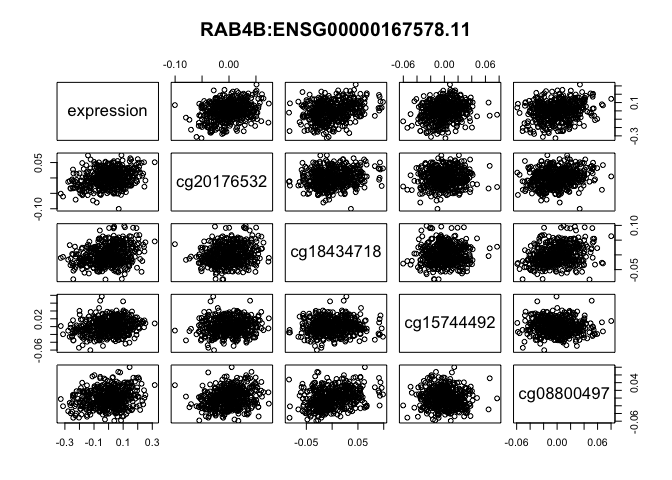

step3
================
Tiam Heydari

### Libraries

``` r
library(pheatmap)
library(reshape2)
library(tidyverse)
```

    ## ── Attaching packages ─────────────────────────────────────────────────────────────────────────────────────────────────────────── tidyverse 1.2.1 ──

    ## ✔ ggplot2 2.2.1     ✔ purrr   0.2.4
    ## ✔ tibble  1.4.2     ✔ dplyr   0.7.4
    ## ✔ tidyr   0.8.0     ✔ stringr 1.3.0
    ## ✔ readr   1.1.1     ✔ forcats 0.3.0

    ## ── Conflicts ────────────────────────────────────────────────────────────────────────────────────────────────────────────── tidyverse_conflicts() ──
    ## ✖ dplyr::filter() masks stats::filter()
    ## ✖ dplyr::lag()    masks stats::lag()

``` r
library(GEOquery)
```

    ## Loading required package: Biobase

    ## Loading required package: BiocGenerics

    ## Loading required package: parallel

    ## 
    ## Attaching package: 'BiocGenerics'

    ## The following objects are masked from 'package:parallel':
    ## 
    ##     clusterApply, clusterApplyLB, clusterCall, clusterEvalQ,
    ##     clusterExport, clusterMap, parApply, parCapply, parLapply,
    ##     parLapplyLB, parRapply, parSapply, parSapplyLB

    ## The following objects are masked from 'package:dplyr':
    ## 
    ##     combine, intersect, setdiff, union

    ## The following objects are masked from 'package:stats':
    ## 
    ##     IQR, mad, sd, var, xtabs

    ## The following objects are masked from 'package:base':
    ## 
    ##     anyDuplicated, append, as.data.frame, cbind, colMeans,
    ##     colnames, colSums, do.call, duplicated, eval, evalq, Filter,
    ##     Find, get, grep, grepl, intersect, is.unsorted, lapply,
    ##     lengths, Map, mapply, match, mget, order, paste, pmax,
    ##     pmax.int, pmin, pmin.int, Position, rank, rbind, Reduce,
    ##     rowMeans, rownames, rowSums, sapply, setdiff, sort, table,
    ##     tapply, union, unique, unsplit, which, which.max, which.min

    ## Welcome to Bioconductor
    ## 
    ##     Vignettes contain introductory material; view with
    ##     'browseVignettes()'. To cite Bioconductor, see
    ##     'citation("Biobase")', and for packages 'citation("pkgname")'.

    ## Setting options('download.file.method.GEOquery'='auto')

    ## Setting options('GEOquery.inmemory.gpl'=FALSE)

``` r
library(RColorBrewer)
library(cluster)
library(pvclust)
library(xtable)
library(limma)
```

    ## 
    ## Attaching package: 'limma'

    ## The following object is masked from 'package:BiocGenerics':
    ## 
    ##     plotMA

``` r
library(dplyr)
library(lattice)
library(RCurl)
```

    ## Loading required package: bitops

    ## 
    ## Attaching package: 'RCurl'

    ## The following object is masked from 'package:tidyr':
    ## 
    ##     complete

``` r
library(GEOquery)
library(knitr)
library(pheatmap)#
library(reshape2)#
library(purrr)
library(Hmisc)
```

    ## Loading required package: survival

    ## Loading required package: Formula

    ## 
    ## Attaching package: 'Hmisc'

    ## The following objects are masked from 'package:xtable':
    ## 
    ##     label, label<-

    ## The following object is masked from 'package:Biobase':
    ## 
    ##     contents

    ## The following objects are masked from 'package:dplyr':
    ## 
    ##     src, summarize

    ## The following objects are masked from 'package:base':
    ## 
    ##     format.pval, units

``` r
library(psych)
```

    ## 
    ## Attaching package: 'psych'

    ## The following object is masked from 'package:Hmisc':
    ## 
    ##     describe

    ## The following objects are masked from 'package:ggplot2':
    ## 
    ##     %+%, alpha

``` r
library(MASS)
```

    ## 
    ## Attaching package: 'MASS'

    ## The following object is masked from 'package:dplyr':
    ## 
    ##     select

``` r
library(DAAG)
```

    ## 
    ## Attaching package: 'DAAG'

    ## The following object is masked from 'package:MASS':
    ## 
    ##     hills

    ## The following object is masked from 'package:psych':
    ## 
    ##     cities

    ## The following object is masked from 'package:survival':
    ## 
    ##     lung

``` r
library(olsrr)
```

    ## 
    ## Attaching package: 'olsrr'

    ## The following object is masked from 'package:MASS':
    ## 
    ##     cement

    ## The following object is masked from 'package:datasets':
    ## 
    ##     rivers

``` r
library(corrplot) # We'll use corrplot later on in this example too.
```

    ## corrplot 0.84 loaded

``` r
#library(rgl)#3D plot not working yet
#library(scatterplot3d)#3D plot not working yet
#library(visreg)
library(glmnet)
```

    ## Loading required package: Matrix

    ## 
    ## Attaching package: 'Matrix'

    ## The following object is masked from 'package:tidyr':
    ## 
    ##     expand

    ## Loading required package: foreach

    ## 
    ## Attaching package: 'foreach'

    ## The following objects are masked from 'package:purrr':
    ## 
    ##     accumulate, when

    ## Loaded glmnet 2.0-13

``` r
 library(lars)
```

    ## Loaded lars 1.2

    ## 
    ## Attaching package: 'lars'

    ## The following object is masked from 'package:psych':
    ## 
    ##     error.bars

``` r
set.seed(123)
```

put all functions here:
=======================

``` r
#-----------------------------------------------------------------
                #plot the correlation between probes, genes ect
                plot_correlation <- function(designated.dataframe.for.specific.gene,number.of.picked.probes){
                plot(designated.dataframe.for.specific.gene[,1:min(number.of.picked.probes,5)], pch=1,main=gene.name)
                #linear.model <-lm(expression~.,data=designated.dataframe.for.specific.gene)
                #summary( linear.model)
                datacor = cor(designated.dataframe.for.specific.gene[1:number.of.picked.probes])
                corrplot(datacor, method = "color",addCoef.col="grey",number.cex= 7/ncol(designated.dataframe.for.specific.gene))
                #quick visualizing data
                auto.sel <- designated.dataframe.for.specific.gene[,1:number.of.picked.probes]
                #plot : distribution , linear , and correlation:
                pairs.panels(auto.sel, col="red")
                }
#-----------------------------------------------------------------
#-----------------------------------------------------------------
#-----------------------------------------------------------------
#-----------------------------------------------------------------
#-----------------------------------------------------------------
#-----------------------------------------------------------------
#-----------------------------------------------------------------
```

1- Here we load the data from a local directoty.
------------------------------------------------

``` r
rawdata<- readRDS("~/Desktop/BIOF/Group project/Step3-multiple regression/cor_test_results_PCA_lapply_V4.rds")

load("~/Desktop/BIOF/Group project/Step3-multiple regression/rosmap_postprocV2.RData")

probes_subjects<- as.data.frame( readRDS("~/Desktop/BIOF/Group project/Step3-multiple regression/probes_subjects_PCA_adjusted_V4.RDS"))

subjects_genes<- as.data.frame(  readRDS("~/Desktop/BIOF/Group project/Step3-multiple regression/subjects_genes_PCA_adjusted_V4.RDS"))
```

``` r
head(rawdata)
```

    ##                          gene      probe    estimate    pvalue
    ## cor  RAB4B:ENSG00000167578.11 cg25697727  0.04075525 0.3724587
    ## cor1 RAB4B:ENSG00000167578.11 cg02686662 -0.01476077 0.7467678
    ## cor2 RAB4B:ENSG00000167578.11 cg14319773  0.04823112 0.2911267
    ## cor3 RAB4B:ENSG00000167578.11 cg05498041 -0.05633210 0.2174921
    ## cor4 RAB4B:ENSG00000167578.11 cg14583103  0.06417159 0.1599679
    ## cor5 RAB4B:ENSG00000167578.11 cg18074151  0.03974841 0.3843954
    ##      adjusted.pvalue
    ## cor        0.9794159
    ## cor1       0.9957041
    ## cor2       0.9728284
    ## cor3       0.9633156
    ## cor4       0.9527597
    ## cor5       0.9801636
``` r
hist(rawdata$pvalue)
```


1.Selecting only genes that has a probe with P value greater than the P.val.tresh:
==================================================================================

``` r
P.val.tresh <- 0.05
max.number.of.probes <- 20
number.of.genes <- ncol(subjects_genes)
significance.of.gene.probes <- lapply(1:number.of.genes, function(i){
                gene.number <- i # then we can put the whole thing in a function
                gene.name  <- names(subjects_genes)[gene.number]
                # exclude of subse of raw data which is for this gene
                rawdata.for.specific.gene <-rawdata %>% filter(gene==gene.name)
                # sort the raws (which are prob numbers) due to P value:
                rawdata.for.specific.gene <-          
                rawdata.for.specific.gene[order(rawdata.for.specific.gene$adjusted.pvalue),]
                #gene.expressions<-data.frame(expression=subjects_genes[,gene.name])
                #names.of.ordered.probes<-rawdata.for.specific.gene$probe
                #ordered.probe.value<-as.data.frame(t(probes_subjects[as.character(names.of.ordered.probes),]))
                #designated.dataframe.for.specific.gene<-cbind(gene.expressions,ordered.probe.value)
                #head(rawdata.for.specific.gene,30)
                #head(designated.dataframe.for.specific.gene)
                if(rawdata.for.specific.gene[1,"adjusted.pvalue"] < P.val.tresh){
                     number.of.sig.probes <- 0
                     for(j in 1:max.number.of.probes) 
                       {
                         if(rawdata.for.specific.gene[j,"adjusted.pvalue"] <P.val.tresh)
                          {
                           number.of.sig.probes <- (number.of.sig.probes+1)
                         }
                       else{ break }
                     }
                     
                   return(c(gene.number,number.of.sig.probes))
                }
                else{ return(c(0,0))}
                
})
significance.of.gene.probes<-as.data.frame(t(as.data.frame(significance.of.gene.probes)))
#row.id.sig.genes<-as.matrix(row.id.sig.genes)
names(significance.of.gene.probes) <- c("gene_number", "number_probes")
#row.id.sig.genes<-filter(significance.of.gene.probes,gene_number!=0)
significance.of.gene.probes<-filter(significance.of.gene.probes,gene_number!=0)
significance.of.gene.probes[1:5,]
```

    ##     gene_number number_probes
    ## 1             1             6
    ## 2             9             8
    ## 3            10             1
    ## 4            12             4
    ## 5            18             1
 
``` r
significance.of.gene.probes_raw<- significance.of.gene.probes
significance.of.gene.probes[1:5,]
```

    ##     gene_number number_probes
    ## 1             1             6
    ## 2             9             8
    ## 3            10             1
    ## 4            12             4
    ## 5            18             1
 
``` r
hist(significance.of.gene.probes$number_probes,20, main = "distribution of probes with p value lower than 0.05")
```


``` r
pdf("~/Desktop/BIOF/Group project/Step3-multiple regression/results/plot/histogram.number.of.probes.pdf")
hist(significance.of.gene.probes$number_probes,20, main = "distribution of probes with p value lower than 0.05")
dev.off()
```

    ## quartz_off_screen 
    ##                 2

now we found the row number of genes that at least had a one fignificant probe with the p value less than the treshold and the number of fignificant probes that each gene has. Before that note that to access the genes: significance.of.gene.probes$gene\_number is used

before that here we filter only genes that have more than 1 significant probe:

``` r
significance.of.gene.probes<-filter(significance.of.gene.probes,number_probes > 1)
hist(significance.of.gene.probes$number_probes,100)
```


``` r
nrow(significance.of.gene.probes)
```

    ## [1] 312

``` r
row.names(significance.of.gene.probes) <-as.character((names(subjects_genes)[(significance.of.gene.probes[,1])]))
significance.of.gene.probes[1:5,]
```

    ##                                    gene_number number_probes
    ## RAB4B:ENSG00000167578.11                     1             6
    ## ZNF781:ENSG00000196381.5                     9             8
    ## RP4-697K14.7:ENSG00000130589.11             12             4
    ## PLIN4:ENSG00000167676.3                     20             3
    ## CYP2D6:ENSG00000100197.16                   22            20

------------------------------------------------------------------------

2 fit models to a single gene
=============================

2.1 extract matrixes for each gene :
------------------------------------

2.2 fit linear models to each significant gene
----------------------------------------------

``` r
                k <-1 # k could be between [ 1,nrow(significance.of.gene.probes) ]
                gene.number <-significance.of.gene.probes[k,1]
                gene.name  <- names(subjects_genes)[gene.number]
                number.of.picked.probes <- significance.of.gene.probes[k,2]
               number.of.picked.probes
```

    ## [1] 6

``` r
                 # exclude of subse of raw data which is for this gene
                rawdata.for.specific.gene <-rawdata %>% filter(gene==gene.name)
                
                # sort the raws (which are prob numbers) due to P value:
                rawdata.for.specific.gene <-          
                rawdata.for.specific.gene[order(rawdata.for.specific.gene$adjusted.pvalue),]
                gene.expressions<-data.frame(expression=subjects_genes[,gene.name])
                names.of.ordered.probes<-rawdata.for.specific.gene$probe
                ordered.probe.value<-as.data.frame(t(probes_subjects[as.character(names.of.ordered.probes),]))
                designated.dataframe.for.specific.gene<-cbind(gene.expressions,ordered.probe.value)
                rawdata.for.specific.gene<-rawdata.for.specific.gene[1:number.of.picked.probes,]
                designated.dataframe.for.specific.gene<- designated.dataframe.for.specific.gene[,1:(number.of.picked.probes+1)]
                head(rawdata.for.specific.gene)
```

    ##                         gene      probe   estimate       pvalue
    ## 791 RAB4B:ENSG00000167578.11 cg20176532  0.2710827 1.509350e-09
    ## 298 RAB4B:ENSG00000167578.11 cg18434718  0.2638529 4.199497e-09
    ## 741 RAB4B:ENSG00000167578.11 cg15744492  0.2168167 1.586627e-06
    ## 64  RAB4B:ENSG00000167578.11 cg08800497  0.2113251 2.931403e-06
    ## 261 RAB4B:ENSG00000167578.11 cg05033529  0.2049259 5.874577e-06
    ## 524 RAB4B:ENSG00000167578.11 cg00524108 -0.2014860 8.460544e-06
    ##     adjusted.pvalue
    ## 791    4.226004e-06
    ## 298    1.054311e-05
    ## 741    2.160051e-03
    ## 64     3.728588e-03
    ## 261    6.769418e-03
    ## 524    9.307602e-03

``` r
                head(designated.dataframe.for.specific.gene)
```

    ##           expression   cg20176532   cg18434718   cg15744492   cg08800497
    ## 10101327 -0.02892608  0.018972617 -0.005041018 -0.016747571 -0.024448123
    ## 10101589  0.09960465 -0.034246222 -0.004080686  0.064574240 -0.029412452
    ## 10202345 -0.16541889 -0.023449737 -0.060462762 -0.026610992  0.014502308
    ## 10203224 -0.03413898 -0.021368587 -0.043869322 -0.001268444 -0.002621160
    ## 10205244 -0.02284861  0.007199345  0.053465447 -0.004221907  0.026990090
    ## 10208143  0.03986186  0.029829057  0.015231149 -0.009790368  0.009955363
    ##            cg05033529   cg00524108
    ## 10101327  0.002876703 -0.026916911
    ## 10101589  0.021734037 -0.012084093
    ## 10202345 -0.019313400 -0.019431891
    ## 10203224  0.008186882  0.008424444
    ## 10205244 -0.009007920  0.007592303
    ## 10208143  0.021270586 -0.045340424

``` r
                #k
                #head(rawdata.for.specific.gene)
                #head(designated.dataframe.for.specific.gene)

                  number.of.picked.probes <- significance.of.gene.probes[k,2]
                #change the name of the dataframe colums from V1 to Vn  to make fitting easy:
                make.no.names <- as.data.frame( matrix(nrow = 1,ncol =number.of.picked.probes ) )
                designated.dataframe.for.specific.gene_NOname <- designated.dataframe.for.specific.gene
                names(designated.dataframe.for.specific.gene_NOname) <- c("expression",names(make.no.names))
                
               train.designated.dataframe.for.specific.gene_NOname <-designated.dataframe.for.specific.gene_NOname[1:385,]
               test.designated.dataframe.for.specific.gene_NOname <-designated.dataframe.for.specific.gene_NOname[386:481,]

               
               
                #_______________stepwise/forward/backwar_______________________
                fit.full <- lm(expression~.,data=train.designated.dataframe.for.specific.gene_NOname)
                fit_single <- lm(expression~V1,data=train.designated.dataframe.for.specific.gene_NOname)
                step_forward <- stepAIC(fit_single, direction="forward",trace = F)
                step_backward <- stepAIC(fit.full, direction="backward",trace = F)
                #step_backward$anova # display results
                #step_forward$anova # display results
                fit_forward<- lm(step_forward)
                fit_backward<- lm(step_backward)

                #_______________stepwise/forward/backwar_______________________
                
                #_______________LASSO_______________________
                #https://www.youtube.com/watch?v=fAPCaue8UKQ
                matrix_of_predictors_train <- as.matrix(train.designated.dataframe.for.specific.gene_NOname[,-1])
                 matrix_of_predictors_test <- as.matrix(test.designated.dataframe.for.specific.gene_NOname[,-1])
                response <- as.matrix(train.designated.dataframe.for.specific.gene_NOname[,1])
                lasso.fit <- glmnet(matrix_of_predictors_train,response)
                lasso.cv <- cv.glmnet(matrix_of_predictors_train,response,n=3)
                msp_cv_fit_lasso <- lasso.cv$cvm[lasso.cv$lambda == lasso.cv$lambda.min]
                #_______________LASSO_______________________
                
                
                #--------------find the number of probes in each model-------
                n_probes_single<-(dim(as.matrix(fit_single$coefficients))[1]-1)
                n_probes_full<-(dim(as.matrix(fit.full$coefficients))[1]-1)
                n_probes_forward<-(dim(as.matrix(fit_forward$coefficients))[1]-1)
                n_probes_backward<-(dim(as.matrix(fit_backward$coefficients))[1]-1)
                
                #for lasso 
                temp.coefficient<-as.data.frame(as.matrix(   coef(lasso.cv, s = "lambda.min")) ) 
                names(temp.coefficient) <- "coef"
                n_probes_lasso<-nrow(filter(temp.coefficient,coef!=0))
                #--------------find the number of probes in each model-------
                
                
                
                #------------------ MSP on train data -----------------------------------
                #from:  https://stackoverflow.com/questions/39811656/r-calculate-test-mse-given-a-trained-model-from-a-training-set-and-a-test-set
                msp_train_fit_single<-mean((train.designated.dataframe.for.specific.gene_NOname$expression -predict.lm(fit_single, train.designated.dataframe.for.specific.gene_NOname)) ^ 2)
                msp_train_fit_full<-mean((train.designated.dataframe.for.specific.gene_NOname$expression -predict.lm(fit.full, train.designated.dataframe.for.specific.gene_NOname)) ^ 2)
                msp_train_fit_forward<-mean((train.designated.dataframe.for.specific.gene_NOname$expression -predict.lm(fit_forward, train.designated.dataframe.for.specific.gene_NOname)) ^ 2)
                msp_train_fit_backward<-mean((train.designated.dataframe.for.specific.gene_NOname$expression -predict.lm(fit_backward, train.designated.dataframe.for.specific.gene_NOname)) ^ 2)
                msp_train_fit_lasso<-mean((train.designated.dataframe.for.specific.gene_NOname$expression -predict.glmnet(lasso.fit,matrix_of_predictors_train)) ^ 2)
                #------------------ MSP on train data -----------------------------------  
                
                                
                
                #------------------ MSP on test data -----------------------------------
                #from:  https://stackoverflow.com/questions/39811656/r-calculate-test-mse-given-a-trained-model-from-a-training-set-and-a-test-set
                
                msp_test_fit_single<-mean((test.designated.dataframe.for.specific.gene_NOname$expression -predict.lm(fit_single, test.designated.dataframe.for.specific.gene_NOname)) ^ 2)
                msp_test_fit_full<-mean((test.designated.dataframe.for.specific.gene_NOname$expression -predict.lm(fit.full, test.designated.dataframe.for.specific.gene_NOname)) ^ 2)
                msp_test_fit_forward<-mean((test.designated.dataframe.for.specific.gene_NOname$expression -predict.lm(fit_forward, test.designated.dataframe.for.specific.gene_NOname)) ^ 2)
                msp_test_fit_backward<-mean((test.designated.dataframe.for.specific.gene_NOname$expression -predict.lm(fit_backward, test.designated.dataframe.for.specific.gene_NOname)) ^ 2)
                msp_test_fit_lasso<-mean((test.designated.dataframe.for.specific.gene_NOname$expression -predict.glmnet(lasso.fit,matrix_of_predictors_test)) ^ 2)
                #------------------ MSP on test data -----------------------------------                
                
                #cross validating the resutls_______________________
                cv_fit_single<-cv.lm(train.designated.dataframe.for.specific.gene_NOname,fit_single, m=3,seed = 2018,printit = F,plotit =  F)
                msp_cv_fit_single <-attr(cv_fit_single, "ms")
                
                cv_fit_full<-cv.lm(train.designated.dataframe.for.specific.gene_NOname,fit.full, m=3,seed = 2018,printit = F,plotit =  F)
                msp_cv_fit_full <-attr(cv_fit_full, "ms")
                
                cv_fit_forward<-cv.lm(train.designated.dataframe.for.specific.gene_NOname,fit_forward, m=3,seed = 2018,printit = F,plotit =  F)
                msp_cv_fit_forward <-attr(cv_fit_forward, "ms")
                
                cv_fit_backward<-cv.lm(train.designated.dataframe.for.specific.gene_NOname,fit_backward, m=3,seed = 2018,printit = F,plotit =  F)
                msp_cv_fit_backward<-attr(cv_fit_backward, "ms")
                 #cross validating the resutls_______________________
                
                
                                    
                       #------------------ abs on test data -----------------------------------
                #from:  https://stackoverflow.com/questions/39811656/r-calculate-test-mse-given-a-trained-model-from-a-training-set-and-a-test-set
                
                abs_test_fit_single<-mean(abs(test.designated.dataframe.for.specific.gene_NOname$expression -predict.lm(fit_single, test.designated.dataframe.for.specific.gene_NOname))/test.designated.dataframe.for.specific.gene_NOname$expression)
                abs_test_fit_full<-mean(abs(test.designated.dataframe.for.specific.gene_NOname$expression -predict.lm(fit.full, test.designated.dataframe.for.specific.gene_NOname))/test.designated.dataframe.for.specific.gene_NOname$expression)
                abs_test_fit_forward<-mean(abs(test.designated.dataframe.for.specific.gene_NOname$expression -predict.lm(fit_forward, test.designated.dataframe.for.specific.gene_NOname))/test.designated.dataframe.for.specific.gene_NOname$expression)
                abs_test_fit_backward<-mean(abs(test.designated.dataframe.for.specific.gene_NOname$expression -predict.lm(fit_backward, test.designated.dataframe.for.specific.gene_NOname))/test.designated.dataframe.for.specific.gene_NOname$expression)
                abs_test_fit_lasso<-mean(abs(test.designated.dataframe.for.specific.gene_NOname$expression -predict.glmnet(lasso.fit,matrix_of_predictors_test))/test.designated.dataframe.for.specific.gene_NOname$expression)
                #------------------ abs on test data -----------------------------------      
```

non linear models:
------------------

``` r
                   #----------------higher degree fitting--------------------------------
                   higher_deg <- lapply(1:20, function(i){
                    degree <- i
                    fit_x <- lm(expression~ poly(V1,degree) ,data=train.designated.dataframe.for.specific.gene_NOname)
                    msp_train_x<-mean((train.designated.dataframe.for.specific.gene_NOname$expression -predict.lm(fit_x, train.designated.dataframe.for.specific.gene_NOname)) ^ 2)
                    msp_test_x<-mean((test.designated.dataframe.for.specific.gene_NOname$expression -predict.lm(fit_x, test.designated.dataframe.for.specific.gene_NOname)) ^ 2)                    
                    return(c(degree,msp_train_x,msp_test_x))
                  })
                  higher_deg<-as.data.frame(t(as.data.frame(higher_deg)))
                  names(higher_deg) <- c("degree","train","test")
                  higher_msp<-min(higher_deg$test)
                  degree<-which(higher_deg$test==higher_msp)
                  #----------------higher degree fitting--------------------------------                  
                  #plot
                  ggplot(higher_deg, aes(degree,test)) +
                      geom_line(aes(degree,test), colour="blue") + 
                      geom_line(aes(degree,train), colour = "grey") +
                        geom_point(aes(degree,test), colour="blue") + 
                      geom_point(aes(degree,train), colour = "grey") +
                      ylab("erroe") + 
                      xlab("degree")+
                      theme(axis.line = element_line(colour = "black"),
                      panel.grid.major = element_blank(),
                      panel.grid.minor = element_blank(),
                      panel.border = element_blank(),
                      panel.background = element_blank()) 
```


``` r
#ggplot(train.designated.dataframe.for.specific.gene_NOname, aes(expression,V1)) + geom_point() + stat_smooth(method = "lm")+
#stat_smooth(method = "lm", formula = y~ poly(x,degree), size = 1,col = "red")
```

outputs:
--------

``` r
                n_probes_single
```

    ## [1] 1

``` r
                msp_train_fit_single
```

    ## [1] 0.01112028

``` r
                msp_cv_fit_single
```

    ## [1] 0.01117672

``` r
                msp_test_fit_single
```

    ## [1] 0.01070652

``` r
                n_probes_full
```

    ## [1] 6

``` r
                msp_train_fit_full
```

    ## [1] 0.009704189

``` r
                msp_cv_fit_full
```

    ## [1] 0.01033456

``` r
                msp_test_fit_full
```

    ## [1] 0.008806419

``` r
                n_probes_forward
```

    ## [1] 1

``` r
                msp_train_fit_forward
```

    ## [1] 0.01112028

``` r
                msp_cv_fit_forward
```

    ## [1] 0.01117672

``` r
                msp_test_fit_forward
```

    ## [1] 0.01070652

``` r
                n_probes_backward
```

    ## [1] 6

``` r
                msp_train_fit_backward
```

    ## [1] 0.009704189

``` r
                msp_cv_fit_backward
```

    ## [1] 0.01033456

``` r
                msp_test_fit_backward
```

    ## [1] 0.008806419

``` r
                n_probes_lasso
```

    ## [1] 7

``` r
                msp_train_fit_lasso
```

    ## [1] 0.01002143

``` r
                msp_cv_fit_lasso
```

    ## [1] 0.01021099

``` r
                msp_test_fit_lasso
```

    ## [1] 0.009246948

Plots:

``` r
                #plot the correlation between probes, genes ect
                plot_correlation(designated.dataframe.for.specific.gene,number.of.picked.probes)
```



``` r
                plot(lasso.fit)
```


``` r
                plot(lasso.cv)
```


------------------------------------------------------------------------

3 fit linear models to all genes:
=================================

``` r
 MS.of.fitts.for.all.sig.genes   <- lapply(1:nrow(significance.of.gene.probes), function(i){
# MS.of.fitts.for.all.sig.genes   <- lapply(1:5, function(i){
                k <-i # k could be between [ 1,nrow(significance.of.gene.probes) ]
                gene.number <-significance.of.gene.probes[k,1]
                gene.name  <- names(subjects_genes)[gene.number]
                number.of.picked.probes <- significance.of.gene.probes[k,2]
                #number.of.picked.probes
                 # exclude of subse of raw data which is for this gene
                rawdata.for.specific.gene <-rawdata %>% filter(gene==gene.name)
                
                # sort the raws (which are prob numbers) due to P value:
                rawdata.for.specific.gene <-          
                rawdata.for.specific.gene[order(rawdata.for.specific.gene$adjusted.pvalue),]
                gene.expressions<-data.frame(expression=subjects_genes[,gene.name])
                names.of.ordered.probes<-rawdata.for.specific.gene$probe
                ordered.probe.value<-as.data.frame(t(probes_subjects[as.character(names.of.ordered.probes),]))
                designated.dataframe.for.specific.gene<-cbind(gene.expressions,ordered.probe.value)
                rawdata.for.specific.gene<-rawdata.for.specific.gene[1:number.of.picked.probes,]
                designated.dataframe.for.specific.gene<- designated.dataframe.for.specific.gene[,1:(number.of.picked.probes+1)]
                #head(rawdata.for.specific.gene)
                #head(designated.dataframe.for.specific.gene)
                #k
                #head(rawdata.for.specific.gene)
                #head(designated.dataframe.for.specific.gene)
                #head(rawdata.for.specific.gene)
                #head(designated.dataframe.for.specific.gene)
                #change the name of the dataframe colums from V1 to Vn  to make fitting easy:
                make.no.names <- as.data.frame( matrix(nrow = 1,ncol =number.of.picked.probes ) )
                designated.dataframe.for.specific.gene_NOname <- designated.dataframe.for.specific.gene
                names(designated.dataframe.for.specific.gene_NOname) <- c("expression",names(make.no.names))
               train.designated.dataframe.for.specific.gene_NOname <-designated.dataframe.for.specific.gene_NOname[1:385,]
               test.designated.dataframe.for.specific.gene_NOname <-designated.dataframe.for.specific.gene_NOname[386:481,]

                #_______________stepwise/forward/backwar_______________________
                fit.full <- lm(expression~.,data=train.designated.dataframe.for.specific.gene_NOname)
                fit_single <- lm(expression~V1,data=train.designated.dataframe.for.specific.gene_NOname) 
               step_forward <- stepAIC(fit_single, direction="forward",trace = F)
                step_backward <- stepAIC(fit.full, direction="backward",trace = F)
                #step_backward$anova # display results
                #step_forward$anova # display results
                fit_forward<- lm(step_forward)
                fit_backward<- lm(step_backward)

                #_______________stepwise/forward/backwar_______________________
                
                #_______________LASSO_______________________
                #https://www.youtube.com/watch?v=fAPCaue8UKQ
                matrix_of_predictors_train <- as.matrix(train.designated.dataframe.for.specific.gene_NOname[,-1])
                 matrix_of_predictors_test <- as.matrix(test.designated.dataframe.for.specific.gene_NOname[,-1])
                response <- as.matrix(train.designated.dataframe.for.specific.gene_NOname[,1])
                lasso.fit <- glmnet(matrix_of_predictors_train,response)
                lasso.cv <- cv.glmnet(matrix_of_predictors_train,response,n=3)
                msp_cv_fit_lasso <- lasso.cv$cvm[lasso.cv$lambda == lasso.cv$lambda.min]
                #_______________LASSO_______________________
                
                
                #--------------find the number of probes in each model-------
                n_probes_single<-(dim(as.matrix(fit_single$coefficients))[1]-1)
                n_probes_full<-(dim(as.matrix(fit.full$coefficients))[1]-1)
                n_probes_forward<-(dim(as.matrix(fit_forward$coefficients))[1]-1)
                n_probes_backward<-(dim(as.matrix(fit_backward$coefficients))[1]-1)
                
                #for lasso 
                temp.coefficient<-as.data.frame(as.matrix(   coef(lasso.cv, s = "lambda.min")) ) 
                names(temp.coefficient) <- "coef"
                n_probes_lasso<-nrow(filter(temp.coefficient,coef!=0))
                #--------------find the number of probes in each model-------
                
                
                
                #------------------ MSP on train data -----------------------------------
                #from:  https://stackoverflow.com/questions/39811656/r-calculate-test-mse-given-a-trained-model-from-a-training-set-and-a-test-set
                msp_train_fit_single<-mean((train.designated.dataframe.for.specific.gene_NOname$expression -predict.lm(fit_single, train.designated.dataframe.for.specific.gene_NOname)) ^ 2)
                msp_train_fit_full<-mean((train.designated.dataframe.for.specific.gene_NOname$expression -predict.lm(fit.full, train.designated.dataframe.for.specific.gene_NOname)) ^ 2)
                msp_train_fit_forward<-mean((train.designated.dataframe.for.specific.gene_NOname$expression -predict.lm(fit_forward, train.designated.dataframe.for.specific.gene_NOname)) ^ 2)
                msp_train_fit_backward<-mean((train.designated.dataframe.for.specific.gene_NOname$expression -predict.lm(fit_backward, train.designated.dataframe.for.specific.gene_NOname)) ^ 2)
                msp_train_fit_lasso<-mean((train.designated.dataframe.for.specific.gene_NOname$expression -predict.glmnet(lasso.fit,matrix_of_predictors_train)) ^ 2)
                #------------------ MSP on train data -----------------------------------  
                
                                
                
                #------------------ MSP on test data -----------------------------------
                #from:  https://stackoverflow.com/questions/39811656/r-calculate-test-mse-given-a-trained-model-from-a-training-set-and-a-test-set
                
                msp_test_fit_single<-mean((test.designated.dataframe.for.specific.gene_NOname$expression -predict.lm(fit_single, test.designated.dataframe.for.specific.gene_NOname)) ^ 2)
                msp_test_fit_full<-mean((test.designated.dataframe.for.specific.gene_NOname$expression -predict.lm(fit.full, test.designated.dataframe.for.specific.gene_NOname)) ^ 2)
                msp_test_fit_forward<-mean((test.designated.dataframe.for.specific.gene_NOname$expression -predict.lm(fit_forward, test.designated.dataframe.for.specific.gene_NOname)) ^ 2)
                msp_test_fit_backward<-mean((test.designated.dataframe.for.specific.gene_NOname$expression -predict.lm(fit_backward, test.designated.dataframe.for.specific.gene_NOname)) ^ 2)
                msp_test_fit_lasso<-mean((test.designated.dataframe.for.specific.gene_NOname$expression -predict.glmnet(lasso.fit,matrix_of_predictors_test)) ^ 2)
                #------------------ MSP on test data -----------------------------------                
                
                #cross validating the resutls_______________________
                cv_fit_single<-cv.lm(train.designated.dataframe.for.specific.gene_NOname,fit_single, m=3,seed = 2018,printit = F,plotit =  F)
                msp_cv_fit_single <-attr(cv_fit_single, "ms")
                
                cv_fit_full<-cv.lm(train.designated.dataframe.for.specific.gene_NOname,fit.full, m=3,seed = 2018,printit = F,plotit =  F)
                msp_cv_fit_full <-attr(cv_fit_full, "ms")
                
                cv_fit_forward<-cv.lm(train.designated.dataframe.for.specific.gene_NOname,fit_forward, m=3,seed = 2018,printit = F,plotit =  F)
                msp_cv_fit_forward <-attr(cv_fit_forward, "ms")
                
                cv_fit_backward<-cv.lm(train.designated.dataframe.for.specific.gene_NOname,fit_backward, m=3,seed = 2018,printit = F,plotit =  F)
                msp_cv_fit_backward<-attr(cv_fit_backward, "ms")
                 #cross validating the resutls_______________________

                
                  #----------------higher degree fitting--------------------------------
                   higher_deg <- lapply(2:7, function(k){
                    degree <- k
                    fit_x <- lm(expression~ poly(V1,degree) ,data=train.designated.dataframe.for.specific.gene_NOname)
                    msp_train_x<-mean((train.designated.dataframe.for.specific.gene_NOname$expression -predict.lm(fit_x, train.designated.dataframe.for.specific.gene_NOname)) ^ 2)
                    msp_test_x<-mean((test.designated.dataframe.for.specific.gene_NOname$expression -predict.lm(fit_x, test.designated.dataframe.for.specific.gene_NOname)) ^ 2)                    
                    return(c(degree,msp_train_x,msp_test_x))
                  })
                  higher_deg<-as.data.frame(t(as.data.frame(higher_deg)))
                  names(higher_deg) <- c("degree","train","test")
                  higher_msp<-min(higher_deg$test)
                  degree<-(which(higher_deg$test==higher_msp)+1)
                  #----------------higher degree fitting--------------------------------   
                
                  #----------other outputs:----------------------------
                    highes_Pvalue <-rawdata.for.specific.gene$adjusted.pvalue[1]
                    best_model <- "single"
                    best_msp <-msp_test_fit_single
                    if(msp_test_fit_full<best_msp){best_model <- "full"
                                       best_msp <-msp_test_fit_full }
                    if(msp_test_fit_forward<best_msp){best_model <- "forward"
                                       best_msp <-msp_test_fit_forward }
                    if(msp_test_fit_backward<best_msp){best_model <- "backward"
                                       best_msp <-msp_test_fit_backward }
                    if(msp_test_fit_lasso<best_msp){best_model <- "lasso"
                                       best_msp <-msp_test_fit_lasso }
                    if(higher_msp<best_msp){best_model <- "higher"
                                       best_msp <-higher_msp }

                #----------other outputs:----------------------------
                  
                  
                
                return(as.data.frame(c(number.of.picked.probes,highes_Pvalue,best_model,best_msp,n_probes_single,msp_train_fit_single,msp_cv_fit_single,msp_test_fit_single,n_probes_full,msp_train_fit_full,msp_cv_fit_full, msp_test_fit_full,n_probes_forward, msp_train_fit_forward,msp_cv_fit_forward,msp_test_fit_forward,n_probes_backward,msp_train_fit_backward,msp_cv_fit_backward,msp_test_fit_backward,n_probes_lasso,msp_train_fit_lasso,msp_cv_fit_lasso,msp_test_fit_lasso,higher_msp,degree)))
                })
                

MS.of.fitts.for.all.sig.genes<-as.data.frame(t(as.data.frame(MS.of.fitts.for.all.sig.genes)))
names(MS.of.fitts.for.all.sig.genes) <- c("number_significant_probes","highes_Pvalue","best_model","best_msp","single_n","single_train","single_cv","single_test","full_n","full_train","full_cv","full_test", "forward_n","forward_train","forward_cv","forward_test", "backward_n","backward_train","backward_cv","backward_test","lasso_n", "lasso_train","lasso_cv","lasso_test","higher_msp","higher_degree")
row.names(MS.of.fitts.for.all.sig.genes) <-as.character((names(subjects_genes)[(significance.of.gene.probes[,1])]))
```

``` r
MS.of.fitts.for.all.sig.genes[1:5,]
```

    ##                                    number_significant_probes
    ## RAB4B:ENSG00000167578.11                                   6
    ## ZNF781:ENSG00000196381.5                                   8
    ## RP4-697K14.7:ENSG00000130589.11                            4
    ## PLIN4:ENSG00000167676.3                                    3
    ## CYP2D6:ENSG00000100197.16                                 20
    ##                                           highes_Pvalue best_model
    ## RAB4B:ENSG00000167578.11           4.22600414716484e-06       full
    ## ZNF781:ENSG00000196381.5           2.41836281075066e-05   backward
    ## RP4-697K14.7:ENSG00000130589.11    7.39456220277079e-05       full
    ## PLIN4:ENSG00000167676.3              0.0332883881222259     higher
    ## CYP2D6:ENSG00000100197.16          8.19223152115392e-43       full
    ##                                               best_msp single_n
    ## RAB4B:ENSG00000167578.11           0.00880641902560203        1
    ## ZNF781:ENSG00000196381.5            0.0789998014779956        1
    ## RP4-697K14.7:ENSG00000130589.11     0.0495263770246164        1
    ## PLIN4:ENSG00000167676.3             0.0597809312773834        1
    ## CYP2D6:ENSG00000100197.16           0.0818012669076272        1
    ##                                           single_train           single_cv
    ## RAB4B:ENSG00000167578.11            0.0111202756714903  0.0111767175595027
    ## ZNF781:ENSG00000196381.5            0.0801439597945889  0.0807077520135302
    ## RP4-697K14.7:ENSG00000130589.11     0.0616356830288824  0.0624476196829633
    ## PLIN4:ENSG00000167676.3             0.0514611513330922  0.0519228354740456
    ## CYP2D6:ENSG00000100197.16           0.0989015366703022  0.0990102218812202
    ##                                            single_test full_n
    ## RAB4B:ENSG00000167578.11            0.0107065246172943      6
    ## ZNF781:ENSG00000196381.5            0.0984261000743553      8
    ## RP4-697K14.7:ENSG00000130589.11     0.0507133173617674      4
    ## PLIN4:ENSG00000167676.3             0.0599227680723896      3
    ## CYP2D6:ENSG00000100197.16           0.0987073350576753     20
    ##                                             full_train             full_cv
    ## RAB4B:ENSG00000167578.11           0.00970418921525214  0.0103345640269597
    ## ZNF781:ENSG00000196381.5            0.0700457183719222  0.0737188090746985
    ## RP4-697K14.7:ENSG00000130589.11     0.0612940071245409  0.0630533816369067
    ## PLIN4:ENSG00000167676.3              0.049095660728826  0.0498286053951368
    ## CYP2D6:ENSG00000100197.16           0.0877410607928223   0.102148898567221
    ##                                              full_test forward_n
    ## RAB4B:ENSG00000167578.11           0.00880641902560203         1
    ## ZNF781:ENSG00000196381.5            0.0812719065894236         1
    ## RP4-697K14.7:ENSG00000130589.11     0.0495263770246164         1
    ## PLIN4:ENSG00000167676.3             0.0622755702504141         1
    ## CYP2D6:ENSG00000100197.16           0.0818012669076272         1
    ##                                          forward_train          forward_cv
    ## RAB4B:ENSG00000167578.11            0.0111202756714903  0.0111767175595027
    ## ZNF781:ENSG00000196381.5            0.0801439597945889  0.0807077520135302
    ## RP4-697K14.7:ENSG00000130589.11     0.0616356830288824  0.0624476196829633
    ## PLIN4:ENSG00000167676.3             0.0514611513330922  0.0519228354740456
    ## CYP2D6:ENSG00000100197.16           0.0989015366703022  0.0990102218812202
    ##                                           forward_test backward_n
    ## RAB4B:ENSG00000167578.11            0.0107065246172943          6
    ## ZNF781:ENSG00000196381.5            0.0984261000743553          7
    ## RP4-697K14.7:ENSG00000130589.11     0.0507133173617674          1
    ## PLIN4:ENSG00000167676.3             0.0599227680723896          3
    ## CYP2D6:ENSG00000100197.16           0.0987073350576753          8
    ##                                         backward_train         backward_cv
    ## RAB4B:ENSG00000167578.11           0.00970418921525214  0.0103345640269597
    ## ZNF781:ENSG00000196381.5            0.0703266030808391  0.0731829143366111
    ## RP4-697K14.7:ENSG00000130589.11     0.0616356830288824  0.0624476196829633
    ## PLIN4:ENSG00000167676.3              0.049095660728826  0.0498286053951368
    ## CYP2D6:ENSG00000100197.16           0.0897073372199864  0.0926102426738514
    ##                                          backward_test lasso_n
    ## RAB4B:ENSG00000167578.11           0.00880641902560203       7
    ## ZNF781:ENSG00000196381.5            0.0789998014779956       8
    ## RP4-697K14.7:ENSG00000130589.11     0.0507133173617674       5
    ## PLIN4:ENSG00000167676.3             0.0622755702504141       4
    ## CYP2D6:ENSG00000100197.16           0.0830309644622516      12
    ##                                            lasso_train            lasso_cv
    ## RAB4B:ENSG00000167578.11            0.0100214342866418  0.0101677888808601
    ## ZNF781:ENSG00000196381.5             0.071974106046441   0.073560892421355
    ## RP4-697K14.7:ENSG00000130589.11     0.0617990400650547  0.0630931526723457
    ## PLIN4:ENSG00000167676.3             0.0496551901737622  0.0507894642432255
    ## CYP2D6:ENSG00000100197.16           0.0961218900733477  0.0983310456826255
    ##                                    higher_degree
    ## RAB4B:ENSG00000167578.11                       2
    ## ZNF781:ENSG00000196381.5                       2
    ## RP4-697K14.7:ENSG00000130589.11                4
    ## PLIN4:ENSG00000167676.3                        4
    ## CYP2D6:ENSG00000100197.16                      6

``` r
saveRDS(MS.of.fitts.for.all.sig.genes,file = "~/Desktop/BIOF/Group project/Step3-multiple regression/results/data/MSP.rda")
```

This plot shows that in more than 50% of the genes, the full model predicts the gene expression. After that interestingly non-linear model of the single probe has the best performance, this suggest hight amount of non linearaty in the model. aslo lasso shows a good performance and the linear single probe shows the weakest predicts.

``` r
barplot(prop.table(table(MS.of.fitts.for.all.sig.genes$best_model)))
```


``` r
barplot(prop.table(table(MS.of.fitts.for.all.sig.genes$higher_degree)))
```


``` r
pdf("~/Desktop/BIOF/Group project/Step3-multiple regression/results/plot/best.mode.pdf")
barplot(prop.table(table(MS.of.fitts.for.all.sig.genes$best_model)))
barplot(prop.table(table(MS.of.fitts.for.all.sig.genes$higher_degree)))
dev.off()
```

    ## quartz_off_screen 
    ##                 2

``` r
x<-0
selected.metho <- "single"
selceted.method.data<-filter(MS.of.fitts.for.all.sig.genes, best_model==selected.metho)
x$full_train<- as.numeric(as.character(selceted.method.data$full_train))
```

    ## Warning in x$full_train <- as.numeric(as.character(selceted.method.data
    ## $full_train)): Coercing LHS to a list

``` r
x$full_test<- as.numeric(as.character(selceted.method.data$full_test))
y<-lapply(1:300, function(i){
  y<- x$full_train[i]/x$full_test[i]
})
h<-hist(as.numeric(y),main = selected.metho,xlab = "[test error]/[train error]")
```


``` r
myplot_<-0
mysum<- sum(h$counts)
myplot_<-cbind(as.data.frame(as.numeric(h$mids) ) ,as.data.frame(as.numeric(h$counts) )/mysum) 
names(myplot_)<- c("x","y")
myplot_single <-myplot_


selected.metho <- "backward"
selceted.method.data<-filter(MS.of.fitts.for.all.sig.genes, best_model==selected.metho)
x$full_train<- as.numeric(as.character(selceted.method.data$full_train))
x$full_test<- as.numeric(as.character(selceted.method.data$full_test))
y<-lapply(1:300, function(i){
  y<- x$full_train[i]/x$full_test[i]
})
h<-hist(as.numeric(y),main = selected.metho,xlab = "[test error]/[train error]")
```


``` r
myplot_<-0
mysum<- sum(h$counts)
myplot_<-cbind(as.data.frame(as.numeric(h$mids) ) ,as.data.frame(as.numeric(h$counts) )/mysum) 
names(myplot_)<- c("x","y")
myplot_backward<-myplot_


selected.metho <- "lasso"
selceted.method.data<-filter(MS.of.fitts.for.all.sig.genes, best_model==selected.metho)
x$full_train<- as.numeric(as.character(selceted.method.data$full_train))
x$full_test<- as.numeric(as.character(selceted.method.data$full_test))
y<-lapply(1:300, function(i){
  y<- x$full_train[i]/x$full_test[i]
})
h<-hist(as.numeric(y),main = selected.metho,xlab = "[test error]/[train error]")
```


``` r
myplot_<-0
mysum<- sum(h$counts)
myplot_<-cbind(as.data.frame(as.numeric(h$mids) ) ,as.data.frame(as.numeric(h$counts) )/mysum) 
names(myplot_)<- c("x","y")
myplot_lasso<-myplot_


selected.metho <- "full"
selceted.method.data<-filter(MS.of.fitts.for.all.sig.genes, best_model==selected.metho)
x$full_train<- as.numeric(as.character(selceted.method.data$full_train))
x$full_test<- as.numeric(as.character(selceted.method.data$full_test))
y<-lapply(1:300, function(i){
  y<- x$full_train[i]/x$full_test[i]
})
h<-hist(as.numeric(y),main = selected.metho,xlab = "[test error]/[train error]")
```


``` r
myplot_<-0
mysum<- sum(h$counts)
myplot_<-cbind(as.data.frame(as.numeric(h$mids) ) ,as.data.frame(as.numeric(h$counts) )/mysum) 
names(myplot_)<- c("x","y")
myplot_full<-myplot_


selected.metho <- "higher"
selceted.method.data<-filter(MS.of.fitts.for.all.sig.genes, best_model==selected.metho)
x$full_train<- as.numeric(as.character(selceted.method.data$full_train))
x$full_test<- as.numeric(as.character(selceted.method.data$full_test))
y<-lapply(1:300, function(i){
  y<- x$full_train[i]/x$full_test[i]
})
h<-hist(as.numeric(y),main = selected.metho,xlab = "[test error]/[train error]")
```


``` r
myplot_<-0
mysum<- sum(h$counts)
myplot_<-cbind(as.data.frame(as.numeric(h$mids) ) ,as.data.frame(as.numeric(h$counts) )/mysum) 
names(myplot_)<- c("x","y")
myplot_higher<-myplot_


ggplot()+

      geom_smooth(data=myplot_single, aes(x=x, y=y),se=FALSE, method="loess", span=1,colour="black")+
  

      geom_smooth(data=myplot_full, aes(x=x, y=y),se=FALSE, method="loess", span=1,colour="red")+
  
      geom_smooth(data=myplot_backward, aes(x=x, y=y),se=FALSE, method="loess", span=1,colour="blue")+
  

      geom_smooth(data=myplot_lasso, aes(x=x, y=y),se=FALSE, method="loess", span=1,colour="orange")+
  

      geom_smooth(data=myplot_higher, aes(x=x, y=y),se=FALSE, method="loess", span=1,colour="pink")+
      
      theme(panel.grid.major = element_blank(), panel.grid.minor = element_blank(),
panel.background = element_blank(), axis.line = element_line(colour = "black"))
```


``` r
x$best<- as.numeric(as.character(selceted.method.data$best_msp))
x$single<- as.numeric(as.character(selceted.method.data$single_test))
y<-lapply(1:300, function(i){
  y<- x$best[i]/x$single[i]
})
selceted.method.data[1:5,]
```

    ##    number_significant_probes        highes_Pvalue best_model
    ## 1                          3   0.0332883881222259     higher
    ## 2                          3  0.00141688018230361     higher
    ## 3                          4 8.50408319514843e-20     higher
    ## 4                          3 5.62460383243407e-21     higher
    ## 5                          4 7.79752866791842e-06     higher
    ##               best_msp single_n        single_train           single_cv
    ## 1   0.0597809312773834        1  0.0514611513330922  0.0519228354740456
    ## 2   0.0141971932516864        1  0.0125920551047767  0.0127715900441415
    ## 3   0.0134568451536314        1  0.0161869023314725  0.0162119769777799
    ## 4  0.00878730776320879        1  0.0134562502568949  0.0136563375479127
    ## 5   0.0437849681930116        1  0.0398179177009344  0.0400400619320036
    ##            single_test full_n          full_train             full_cv
    ## 1   0.0599227680723896      3   0.049095660728826  0.0498286053951368
    ## 2    0.014540340993307      3  0.0125649188067888  0.0131832231094666
    ## 3    0.014179543328789      4  0.0157201737047977  0.0165504030701491
    ## 4  0.00895004974445968      3  0.0132848335041336  0.0136215063104483
    ## 5   0.0439421550015273      4  0.0389320042919527  0.0405391985580641
    ##              full_test forward_n       forward_train          forward_cv
    ## 1   0.0622755702504141         1  0.0514611513330922  0.0519228354740456
    ## 2   0.0144135502958127         1  0.0125920551047767  0.0127715900441415
    ## 3   0.0140869089261202         1  0.0161869023314725  0.0162119769777799
    ## 4  0.00895996817345472         1  0.0134562502568949  0.0136563375479127
    ## 5   0.0452198521357842         1  0.0398179177009344  0.0400400619320036
    ##           forward_test backward_n      backward_train         backward_cv
    ## 1   0.0599227680723896          3   0.049095660728826  0.0498286053951368
    ## 2    0.014540340993307          1  0.0125920551047767  0.0127715900441415
    ## 3    0.014179543328789          2  0.0157410083436115  0.0160087849842705
    ## 4  0.00895004974445968          3  0.0132848335041336  0.0136215063104483
    ## 5   0.0439421550015273          2  0.0390532606188885  0.0402170604226922
    ##          backward_test lasso_n         lasso_train            lasso_cv
    ## 1   0.0622755702504141       4  0.0496551901737622  0.0507894642432255
    ## 2    0.014540340993307       4  0.0126470249210519  0.0128861744418729
    ## 3   0.0142321566368244       5  0.0162018496847184   0.016106948516288
    ## 4  0.00895996817345472       4  0.0136580078446601  0.0136606360414522
    ## 5   0.0465093752092148       5  0.0393242088665555  0.0399476890805227
    ##             lasso_test          higher_msp higher_degree
    ## 1   0.0614131207430961  0.0597809312773834             4
    ## 2   0.0145030771861427  0.0141971932516864             7
    ## 3   0.0145255498274228  0.0134568451536314             5
    ## 4  0.00931424585506383 0.00878730776320879             3
    ## 5   0.0459728349135104  0.0437849681930116             5

``` r
hist(as.numeric(y),100)
```


------------------------------------------------------------------------

------------------------------------------------------------------------

Alternatively, you can perform all-subsets regression using the leaps( ) function from the leaps package. In the following code nbest indicates the number of subsets of each size to report. Here, the ten best models will be reported for each subset size (1 predictor, 2 predictors, etc.).
