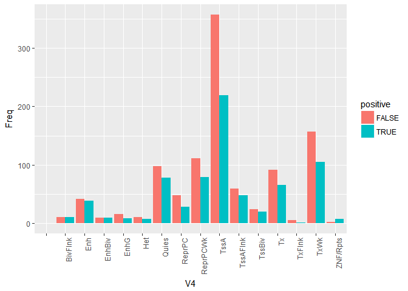
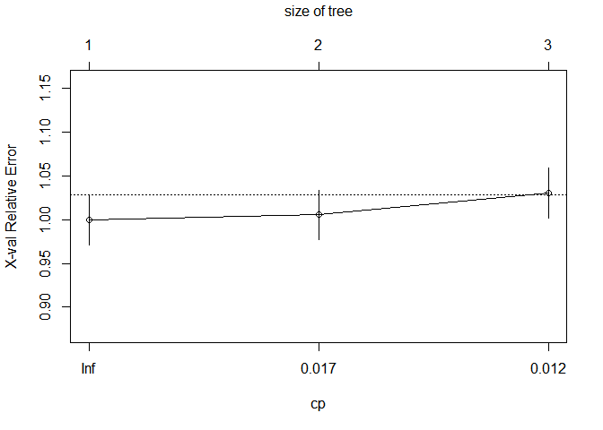
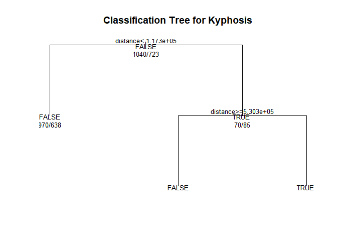
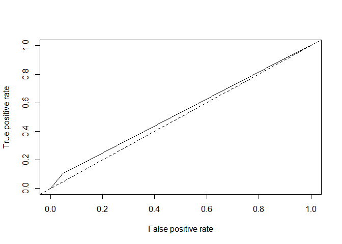
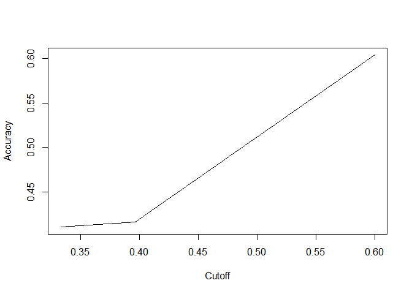

step4- Chromatine State Patterns
================
Sina Jafarzadeh
March 31, 2018

In this part, we investigate the effect of chromatin state on the relation of CpG methylation sites and gene expression. Chromatin is divided into 15 distinct functional regions including enhancers, transcription start site, etc. It would be interesting to study the contribution of each functional region to the overall population of significant CpG sites. We first filter out the CpG sites with pvalue less than 0.05 and then add extract the chromatin state annotation of each CpG site using [`ChromHMM`](http://compbio.mit.edu/ChromHMM/) method. We then tally the number of significant CpG sites in each distinct state. We further divide the CpG sites into positive and negative correlations based on the results generated in step 2. Below, you can see the results in different settings. This experiment yields three different observation: First, the number of negative correlations is more than the number of positive correlations. It means that DNA methylation often down-regulates the expression of its associated gene rather than up-regulate. It is consistent with the biological findings regarding the effect of DNA methylation on gene expression. Second, this figure suggests that there are more significant CpG sites in transcript start site (TSS) in comparison to other places in DNA sequence, validating previous biological research results. If we plot the similar figure for all probes (and not significant ones) we see that the number of methylation probes still follows a preferential pattern for TSS. It means that there are more CpG sites in TSS area in comparison to other chromatin regions. In fact, previous researchers also report that in humans, about 70% of promoters located near the transcription start site of a gene (proximal promoters) contain a CpG island.CpG islands (or CG islands) are regions with a high frequency of CpG sites.

``` r
library(ggplot2)
library(magrittr)
library(dplyr)
```

    ## 
    ## Attaching package: 'dplyr'

    ## The following objects are masked from 'package:stats':
    ## 
    ##     filter, lag

    ## The following objects are masked from 'package:base':
    ## 
    ##     intersect, setdiff, setequal, union

``` r
library(reshape)
```

    ## 
    ## Attaching package: 'reshape'

    ## The following object is masked from 'package:dplyr':
    ## 
    ##     rename

``` r
library(Matrix)
```

    ## 
    ## Attaching package: 'Matrix'

    ## The following object is masked from 'package:reshape':
    ## 
    ##     expand

``` r
library(rpart)
library(randomForest)
```

    ## randomForest 4.6-14

    ## Type rfNews() to see new features/changes/bug fixes.

    ## 
    ## Attaching package: 'randomForest'

    ## The following object is masked from 'package:dplyr':
    ## 
    ##     combine

    ## The following object is masked from 'package:ggplot2':
    ## 
    ##     margin

``` r
library(pROC)
```

    ## Type 'citation("pROC")' for a citation.

    ## 
    ## Attaching package: 'pROC'

    ## The following objects are masked from 'package:stats':
    ## 
    ##     cov, smooth, var

``` r
library("ROCR")
```

    ## Loading required package: gplots

    ## 
    ## Attaching package: 'gplots'

    ## The following object is masked from 'package:stats':
    ## 
    ##     lowess

``` r
library(rpart)


adjusted_pval_threshold = 0.05;

load("../rosmap_postprocV2.RData")
chromHMM_annotations = read.csv2("C:/Users/jafar/Desktop/methylationCoordChromHMM.csv", sep = ',' , header = FALSE)
step2_results = readRDS("C:/Users/jafar/Desktop/cor_test_results_PCA_lapply_V4.rds")


step2_results_annotated = merge(chromHMM_annotations,step2_results,by.x = "V1",by.y = "probe", all = FALSE) %>% mutate(positive=estimate>0) %>% filter(adjusted.pvalue <  adjusted_pval_threshold)

probes_indices=match(step2_results_annotated$V1,rownames(probes_subjects));
genes_indices=match(step2_results_annotated$gene,colnames(subjects_genes));
indices=cbind(probes_indices,genes_indices)
distances_for_each_probe_gene_pair=probes_genes_distance[indices];
step2_results_annotated$distance = distances_for_each_probe_gene_pair 
step2_results_annotated$V2=as.factor(step2_results_annotated$V2)
number_of_positive_corrs=length(which(step2_results_annotated$positive==TRUE))
negative_inds=which(step2_results_annotated$positive==FALSE);
to_be_removed_inds=sample(negative_inds,size = (length(negative_inds)-number_of_positive_corrs),replace = FALSE)
step2_results_annotated_balanced=step2_results_annotated[-to_be_removed_inds,]
step2_results_annotated_balanced=step2_results_annotated

freqs=table(step2_results_annotated_balanced[,c(4,9)]) 
freqs=as.data.frame(freqs)
freqs %>% ggplot() + geom_bar(aes(x=V4,y=Freq,fill=positive), position = "dodge",stat="identity") + theme(axis.text.x = element_text(angle = 90, hjust = 1))
```



someone et. al. reported similar results to the previous figures on whole blood cells. They also trained a decision three to predict the sign of regulation given the distance of CpG site and gene and end up with an Area Under the Curve (AUC) of 80%. In this section, we try to replicate the experiment on brain tissue. First, we down-sample the negative CpG site / Gene correlations to create a balanced dataset. We plot the histogram for this new balanced dataset below. Then, we train a random forest on samples using `rpart` package. We give the distance, chromatin state and chromosome number as potential features to the classifier. Surprisingly, the classifier ends up with AUC of `53%` which is far less than what mentioned in that paper. This discrepancy would be addressed in the discussion section.

``` r
fit <- rpart(positive ~ V4+V2+distance,
             data=step2_results_annotated_balanced, method="class")
```

Below, we see the summary of results and training detail for the tree.

``` r
printcp(fit) # display the results 
```

    ## 
    ## Classification tree:
    ## rpart(formula = positive ~ V4 + V2 + distance, data = step2_results_annotated_balanced, 
    ##     method = "class")
    ## 
    ## Variables actually used in tree construction:
    ## [1] distance
    ## 
    ## Root node error: 723/1763 = 0.4101
    ## 
    ## n= 1763 
    ## 
    ##         CP nsplit rel error xerror     xstd
    ## 1 0.020747      0   1.00000 1.0000 0.028564
    ## 2 0.013831      1   0.97925 1.0055 0.028588
    ## 3 0.010000      2   0.96542 1.0304 0.028687

``` r
plotcp(fit) # visualize cross-validation results 
```



``` r
summary(fit) # detailed summary of splits
```

    ## Call:
    ## rpart(formula = positive ~ V4 + V2 + distance, data = step2_results_annotated_balanced, 
    ##     method = "class")
    ##   n= 1763 
    ## 
    ##           CP nsplit rel error   xerror       xstd
    ## 1 0.02074689      0 1.0000000 1.000000 0.02856415
    ## 2 0.01383126      1 0.9792531 1.005533 0.02858792
    ## 3 0.01000000      2 0.9654219 1.030429 0.02868716
    ## 
    ## Variable importance
    ## distance 
    ##      100 
    ## 
    ## Node number 1: 1763 observations,    complexity param=0.02074689
    ##   predicted class=FALSE  expected loss=0.4100964  P(node) =1
    ##     class counts:  1040   723
    ##    probabilities: 0.590 0.410 
    ##   left son=2 (1608 obs) right son=3 (155 obs)
    ##   Primary splits:
    ##       distance < 117337.5 to the left,  improve=6.500006, (0 missing)
    ##       V4       splits as  -RRRLLRLLLRRLLLR, improve=3.406596, (0 missing)
    ##       V2       splits as  RRRL, improve=2.801768, (0 missing)
    ## 
    ## Node number 2: 1608 observations
    ##   predicted class=FALSE  expected loss=0.3967662  P(node) =0.9120817
    ##     class counts:   970   638
    ##    probabilities: 0.603 0.397 
    ## 
    ## Node number 3: 155 observations,    complexity param=0.01383126
    ##   predicted class=TRUE   expected loss=0.4516129  P(node) =0.08791832
    ##     class counts:    70    85
    ##    probabilities: 0.452 0.548 
    ##   left son=6 (30 obs) right son=7 (125 obs)
    ##   Primary splits:
    ##       distance < 530303   to the right, improve=3.4408600, (0 missing)
    ##       V4       splits as  -RLLL-RLRLLLR-R-, improve=2.4391940, (0 missing)
    ##       V2       splits as  LRLL, improve=0.5752892, (0 missing)
    ## 
    ## Node number 6: 30 observations
    ##   predicted class=FALSE  expected loss=0.3333333  P(node) =0.01701645
    ##     class counts:    20    10
    ##    probabilities: 0.667 0.333 
    ## 
    ## Node number 7: 125 observations
    ##   predicted class=TRUE   expected loss=0.4  P(node) =0.07090187
    ##     class counts:    50    75
    ##    probabilities: 0.400 0.600

We also draw the architecture of mentioned tree blow:

``` r
# plot tree 
plot(fit, uniform=TRUE, 
     main="Classification Tree for Kyphosis")
text(fit, use.n=TRUE, all=TRUE, cex=.8)
```



Below, we plot the ROC and accuracy diagram for different cut-off values. We achive the overall AUC of `0.53` and an accuracy of `60%` for the best cut-off value.

``` r
pred <- prediction(predict(fit, type = "prob")[, 2], step2_results_annotated_balanced$positive)
auc_value <- roc(step2_results_annotated_balanced$positive,predict(fit, type = "prob")[, 2])$auc
auc_value
```

    ## Area under the curve: 0.5299

``` r
plot(performance(pred, "tpr", "fpr"))
abline(0, 1, lty = 2)
```



``` r
plot(performance(pred, "acc"))
```


