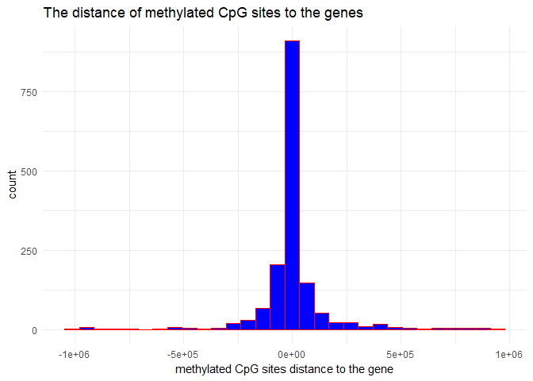
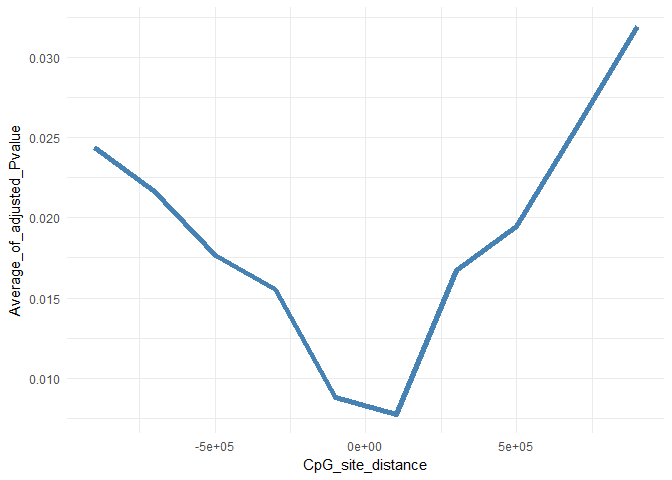
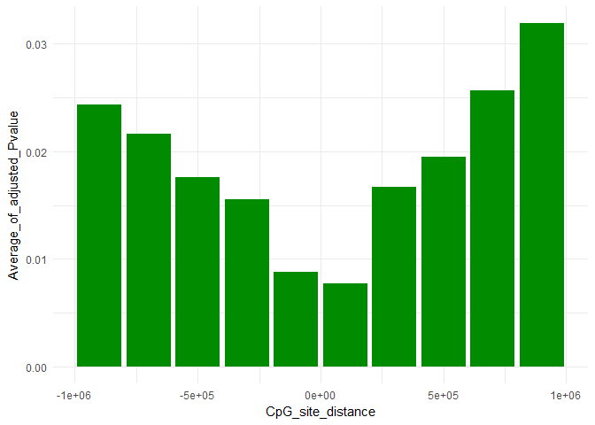

Biological Analysis-part 1
================
Zohreh Sharafian
March 24, 2018

``` r
RosmapData <- load("C:/Users/zohre/Desktop/Repo_team_Gene_Heroes/Data/rosmap_postprocV2.RData")
probes_subjects[1:5, 1:5]
```

    ##              10101327   10101589   10202345   10203224   10205244
    ## cg15886596 0.06223898 0.06643503 0.06067198 0.05669612 0.06437694
    ## cg12261117 0.22883983 0.28437790 0.26597568 0.29549651 0.30087612
    ## cg25433760 0.41568249 0.39730559 0.49797690 0.48789274 0.41684200
    ## cg23278040 0.29617882 0.26983136 0.27622813 0.28423828 0.30989476
    ## cg14324693 0.95746992 0.90520790 0.93080533 0.95443363 0.93380807

``` r
subjects_genes[1:5,1:5]
```

    ##          RAB4B:ENSG00000167578.11 ZNF708:ENSG00000182141.4
    ## 10101327               -0.1420430                -0.210962
    ## 10101589                0.1069440                -0.304536
    ## 10202345               -0.2479760                -0.119064
    ## 10203224                0.1582540                -0.191419
    ## 10205244                0.0548584                 0.116589
    ##          RAD23A:ENSG00000179262.4 ARFGAP1:ENSG00000101199.8
    ## 10101327                0.0622548                 0.2212560
    ## 10101589               -0.1841080                 0.3467160
    ## 10202345                0.1261420                -0.0074513
    ## 10203224                0.3774820                 0.1709550
    ## 10205244               -0.0405737                 0.1832600
    ##          CTSA:ENSG00000064601.11
    ## 10101327               0.0180461
    ## 10101589              -0.3811340
    ## 10202345               0.3538090
    ## 10203224              -0.0412956
    ## 10205244               0.2605110

``` r
str(RosmapData)
```

    ##  chr [1:4] "probes_subjects" ".Random.seed" "probes_genes_distance" ...

``` r
nrow(probes_genes_distance) #number of probes
```

    ## Loading required package: Matrix

    ## Warning: package 'Matrix' was built under R version 3.4.3

    ## 
    ## Attaching package: 'Matrix'

    ## The following object is masked from 'package:tidyr':
    ## 
    ##     expand

    ## [1] 42813

``` r
ncol(probes_genes_distance) #number of genes
```

    ## [1] 1795

``` r
cor_test_results_PCA_lapply_V2 <- readRDS("C:/Users/zohre/Desktop/Repo_team_Gene_Heroes/Data/cor_test_results_PCA_lapply_V3.rds")
head (cor_test_results_PCA_lapply_V2)
```

    ##                          gene      probe    estimate    pvalue
    ## cor  RAB4B:ENSG00000167578.11 cg25697727  0.03411567 0.4553742
    ## cor1 RAB4B:ENSG00000167578.11 cg02686662 -0.00833256 0.8553669
    ## cor2 RAB4B:ENSG00000167578.11 cg14319773  0.03401714 0.4566779
    ## cor3 RAB4B:ENSG00000167578.11 cg05498041 -0.05317399 0.2444297
    ## cor4 RAB4B:ENSG00000167578.11 cg14583103  0.06457742 0.1573371
    ## cor5 RAB4B:ENSG00000167578.11 cg18074151  0.04792373 0.2942161
    ##      adjusted.pvalue
    ## cor        0.9868831
    ## cor1       0.9982092
    ## cor2       0.9869856
    ## cor3       0.9737870
    ## cor4       0.9587483
    ## cor5       0.9784691

``` r
#hist(cor_test_results_PCA_lapply_V2$adjusted.pvalue[cor_test_results_PCA_lapply_V2$adjusted.pvalue<0.05])
```

``` r
#extracting three columns inclusing gene, probe, and adjusted.pvalue

extracted_matrix <- cor_test_results_PCA_lapply_V2 [,c(1,2, 5)]
head(extracted_matrix)
```

    ##                          gene      probe adjusted.pvalue
    ## cor  RAB4B:ENSG00000167578.11 cg25697727       0.9868831
    ## cor1 RAB4B:ENSG00000167578.11 cg02686662       0.9982092
    ## cor2 RAB4B:ENSG00000167578.11 cg14319773       0.9869856
    ## cor3 RAB4B:ENSG00000167578.11 cg05498041       0.9737870
    ## cor4 RAB4B:ENSG00000167578.11 cg14583103       0.9587483
    ## cor5 RAB4B:ENSG00000167578.11 cg18074151       0.9784691

``` r
nrow(extracted_matrix)
```

    ## [1] 1335544

``` r
# cut off (0.05) for the p value
filtered_pvalue <- extracted_matrix[extracted_matrix$adjusted.pvalue<0.05,]
```

``` r
data <- as.data.frame(as.matrix(probes_genes_distance))
colnames(data) <- names(subjects_genes)
rownames(data) <- rownames(probes_subjects)
```

``` r
#matching the probes and genes from two data set

match_probes <- match(filtered_pvalue$probe, rownames(data) )
matche_genes <- match(filtered_pvalue$gene, colnames(data) )

inds=cbind(match_probes,matche_genes)

match_data <- data[inds]

qplot(match_data,
      geom="histogram",
      main = "The distance of methylated CpG sites to the genes ", 
      xlab = "methylated CpG sites distance to the gene",  
      fill=I("blue"), 
      col=I("red"), 
      ) +theme_minimal()
```

    ## `stat_bin()` using `bins = 30`. Pick better value with `binwidth`.



``` r
#tmp = hist(match_data)
```

graph No.2 the average of pValue vs the distance of probes
==========================================================

``` r
tmp <- hist(match_data) 
```


``` r
intervals_values=findInterval(match_data,tmp$breaks)  #get the interval values from the histogram
```

``` r
#for loop to get the interval values for all the genes

histog <-  integer (10)
for(i in 1:10) {
elemenets_in_this_interval <-which(intervals_values==i);
histog[i]=mean(filtered_pvalue$adjusted.pvalue[elemenets_in_this_interval])
print((histog[i]))
}
```

    ## [1] 0.02435694
    ## [1] 0.02167013
    ## [1] 0.01762103
    ## [1] 0.01554024
    ## [1] 0.008793416
    ## [1] 0.007746299
    ## [1] 0.01671344
    ## [1] 0.01947546
    ## [1] 0.02571466
    ## [1] 0.03191347

``` r
x=tmp$mids;
y=histog;
data_plot=cbind(x,y)
data_plot=as.data.frame(data_plot)
colnames(data_plot)=c("CpG_site_distance","Average_of_adjusted_Pvalue")

data_plot %>% ggplot2::ggplot(aes(x= CpG_site_distance, y=Average_of_adjusted_Pvalue)) +geom_line(color='steelblue', size=2)+theme_minimal()
```



``` r
x=tmp$mids;
y=histog;
data_plot=cbind(x,y)
data_plot=as.data.frame(data_plot)
colnames(data_plot)=c("CpG_site_distance","Average_of_adjusted_Pvalue")
data_plot %>% ggplot2::ggplot(aes(x= CpG_site_distance, y=Average_of_adjusted_Pvalue)) +geom_bar(stat="identity",fill="Green4")+theme_minimal()
```



``` r
#head(gene1.sorted)

#gene1_ros <- RosmapData %>%  filter(gene=="RAB4B:ENSG00000167578.11")


#melt_x2 <- melt(rownames_to_column(data, var="probe"), id="probe")
#head(melt_x2)

#ggplot() + aes(x2)+ geom_histogram(binwidth=1, colour="black", fill="white")

#new_Data <- left_join(filtered_pvalue, melt_x2, by= c("probe"="probe", "gene"="variable"))
```
